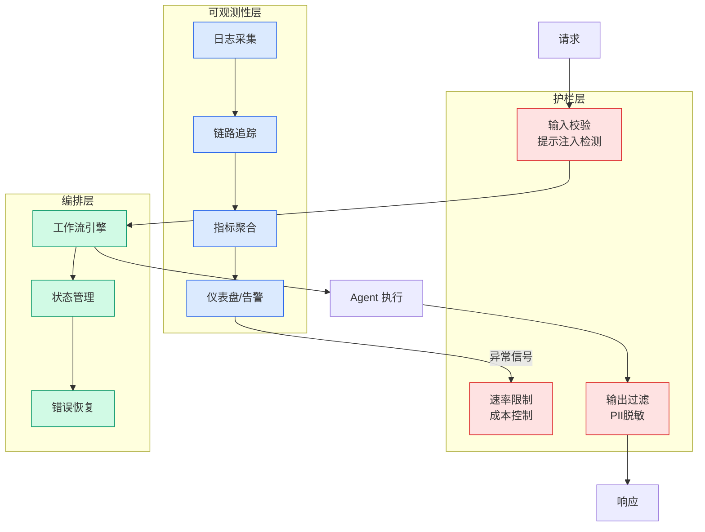

# xHC: Expanded Hyper-Connections — 16-Way Residual Stream Architecture

## Ch01.1319 xHC: Expanded Hyper-Connections — 16-Way Residual Stream Architecture

> 📊 Level ⭐⭐⭐ | 3.5KB | `entities/xhc-expanded-hyper-connections.md`

# xHC: Expanded Hyper-Connections

xHC (Expanded Hyper-Connections) is a neural architecture that extends `DeepSeek`'s mHC (Multi-path Hyper-Connections) to support **16 residual streams** with **sparse updates and multi-scale temporal feature enhancement**. Developed by researchers from Shanghai Jiao Tong University and Xiaohongshu, xHC addresses the saturation problem that arises when scaling mHC beyond 4 residual paths.

## Motivation

The original Hyper-Connection (HC) expanded single residual streams to multiple paths; mHC added constrained cross-stream mixing via Sinkhorn normalization for training stability. However, scaling from 4 to 16 paths in mHC incurred a **32% increase in training FLOPs** for only **0.006 loss reduction** — indicating that additional streams lacked sufficiently diverse write-back signals while bearing growing dynamic mixing costs.

## Key Design

xHC introduces three innovations over mHC:

### Dense Read, Sparse Update
xHC maintains 16 full residual states. Each sublayer reads all 16 streams but writes to only **k=4** of them (2 permanently active + 2 dynamically selected by a sigmoid-gated router). This reduces the projection cost for the residual mixing matrix from O(N²) to O(N·k), bringing FLOPs overhead down to ~4% while keeping access to the full state space.

### Multi-Scale Temporal Feature Enhancement
After the MLP output, xHC applies r=3 causal 1D convolution branches with kernel sizes covering different local context ranges. These convolved outputs are concatenated with the original MLP output, producing 4 write-back components. A modified Gram–Schmidt process removes collinear components. This mechanism enriches the diversity of write-back signals without re-executing the MLP per stream.

### Extensibility Beyond 4 Streams
While mHC saturates at 4 paths, xHC's dense-read/sparse-update architecture scales efficiently: loss reduction from 4→16 paths jumps from 0.006 (mHC) to 0.012 (xHC), with parameter count per layer at ~1/7 of dense mHC for the same 16-stream configuration.

## Results

On DeepSeekMoE-style backbones (18B/28B, ~1.7B/2.7B activated):
- **18B avg score**: mHC 44.8 → xHC 48.8
- **28B avg score**: mHC 50.5 → xHC 53.6
- Gains are distributed across knowledge, reasoning, math, code, and Chinese language tasks
- Additional training FLOPs relative to standard residual baseline: only **3.3%** (vs mHC's ~20% for 16-path dense)

Scaling law analysis confirms that xHC reaches the same loss target with significantly less compute than both standard residual and mHC baselines.

→ [原文存档](https://github.com/QianJinGuo/wiki-book/tree/main/docs/raw/articles/deepseek-mhc之后xhc重新设计16路残差流架构.md)

---
## 关联
- 相关概念: [Harness Engineering](https://github.com/QianJinGuo/wiki/blob/main/concepts/harness-engineering-framework.md)

---

