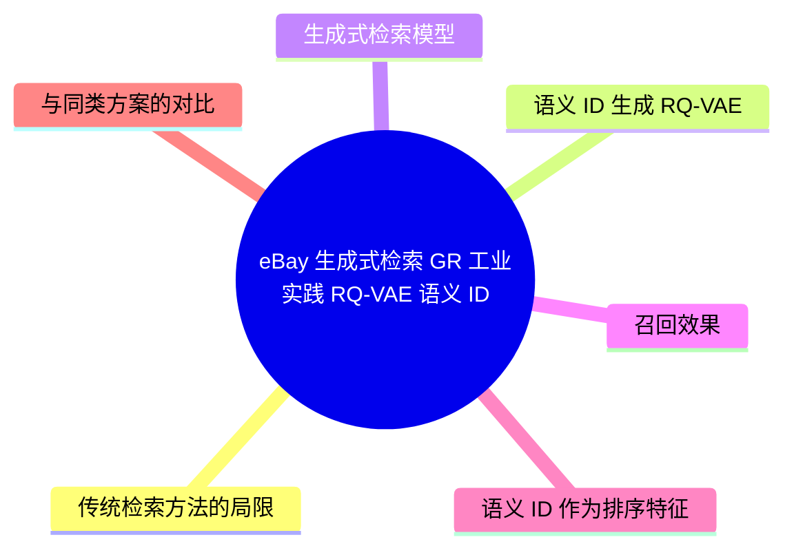
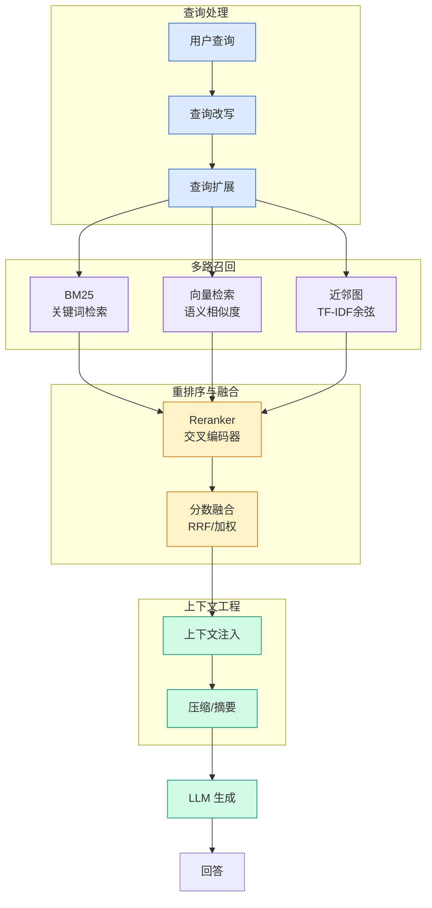

# eBay 生成式检索（GR）工业实践：RQ-VAE 语义 ID + 20 亿商品全量训练

## Ch01.1321 eBay 生成式检索（GR）工业实践：RQ-VAE 语义 ID + 20 亿商品全量训练

> 📊 Level ⭐⭐⭐ | 3.4KB | `entities/ebay-generative-retrieval-rq-vae-semantic-id-2026-06-30.md`

# eBay 生成式检索（GR）工业实践：RQ-VAE 语义 ID + 20 亿商品全量训练

eBay 广告推荐团队在覆盖 20 亿商品的全量语料上训练 RQ-VAE，构建语义 ID 码本，将广告推荐中的候选召回从"相似度检索"重新表述为"序列生成"问题。

## 概念导图

## 传统检索方法的局限

eBay 场景下传统召回方法面临三个主要挑战：
- **稀疏交互信号**：大量单一库存商品（one-off items），生命周期极短
- **长尾商品表征质量差**：ANN 检索结果不可信，召回偏向头部热门商品
- **双塔架构表达能力瓶颈**：用户侧和商品侧向量独立计算，缺乏显式交叉学习

## 语义 ID 生成（RQ-VAE）

给定商品内容信息 → BERT 提取稠密语义向量 → RQ-VAE 压缩为离散语义编码序列。

- **4 层码本**，每层 4096 个码向量（维度 8），每个商品对应 4 元组语义 ID
- 增加 **协同嵌入对比学习目标** 引入协同信号
- 20 亿商品规模上碰撞率降至 **0.0221%**
- 层次化语义结构：高层粗粒度类目 → 低层细粒度分化
- 前缀一致性：共享更长前缀的商品具有更相似的属性一致率

## 生成式检索模型

Transformer 编码器-解码器架构：
- **编码器**：用户历史行为序列（语义 ID）+ 个性化嵌入 + 会话特征 + 上下文信号
- **解码器**：自回归逐步预测下一个商品的语义 ID 序列
- **采样**：Beam Search 生成 Top-K，温度参数控制多样性

## 召回效果

| 指标 | 提升 |
|------|------|
| Recall@5 | +35.7% |
| Recall@10 | +13.3% |
| NDCG@5 | +50.2% |
| NDCG@10 | +34.8% |

## 语义 ID 作为排序特征

**离线**：点击 AUC +1.14%，购买 AUC +0.92%，购买 NDCG@6 +1.05%

**线上 A/B**：CTR +1.47%，CVR +13.12%，RPC +3.92%，GMVPC +7.23%

**长尾商品**：曝光占比 +5.86%，点击占比 +2.73%

## 与同类方案的对比

与 [Instacart 生成式检索](../ch12/003-token.html) 的差异：
- eBay 使用 RQ-VAE（残差量化）构建语义 ID，Instacart 使用语义 token
- eBay 覆盖 20 亿商品全量，规模远超 Instacart
- eBay 将语义 ID 同时用于召回和排序特征，Instacart 仅用于召回
- eBay 增加协同嵌入对比学习，引入协同信号
- eBay 报告了详细的线上 A/B 指标（CTR/CVR/RPC/GMVPC）

---
## 关联
- 相关概念: [Harness Engineering](https://github.com/QianJinGuo/wiki/blob/main/concepts/harness-engineering-framework.md)

---

