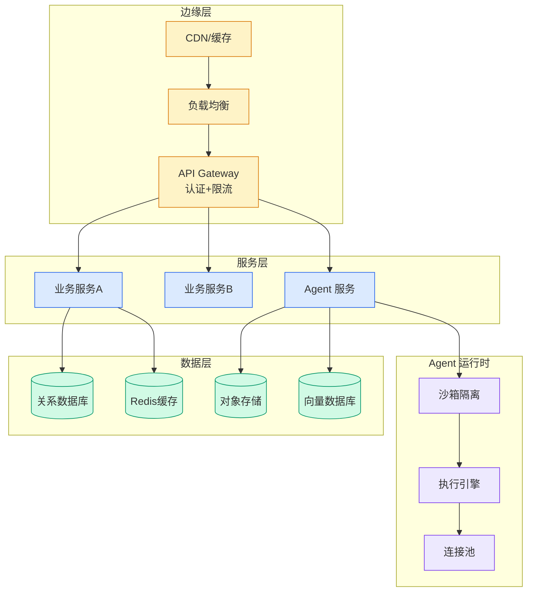

# Nano Banana 2 Lite 与 Gemini Omni Flash：Google DeepMind 最新生成式媒体模型

## Ch01.1322 Nano Banana 2 Lite 与 Gemini Omni Flash：Google DeepMind 最新生成式媒体模型

> 📊 Level ⭐⭐⭐ | 3.2KB | `entities/nano-banana-2-lite-gemini-omni-flash-google-deepmind-2026.md`

# Nano Banana 2 Lite 与 Gemini Omni Flash：Google DeepMind 最新生成式媒体模型

2026年6月30日，Google DeepMind 发布两大模型更新：Nano Banana 2 Lite（最快的 Gemini Image 模型）和 Gemini Omni Flash（面向开发者的视频生成与对话式编辑模型）

> ⚠️ 产品公告：本文基于 Google DeepMind 官方产品发布博客整理，内容以产品能力和平台可用性为主，包含 benchmarks 和架构改进信息。作为产品方自报数据，未独立验证 benchmark 结果。

## Nano Banana 2 Lite

Nano Banana 2 Lite（gemini-3.1-flash-lite-image）是 Nano Banana 家族中最快、最具成本效益的图像模型，专为高吞吐、高速度和规模化设计。相比 Nano Banana 2，推理速度提升 2 倍以上，成本降低 50%。

主要特点：
- 支持图像生成和编辑
- 在 Google AI Studio、Gemini API 和 Gemini Enterprise Agent Platform 可用
- 已集成到 Google 消费者产品（AI Mode in Search、Gemini App 等）
- 采用 SynthID 水印技术

## Gemini Omni Flash

Gemini Omni Flash 是高质量、高性价比的视频生成和对话式编辑模型，首次面向开发者开放。此前 Gemini Omni 仅限于 Google 内部产品使用[Introducing Gemini Omni](ch01/1292-introducing-gemini-omni.html)。

能力：
- 视频生成和对话式编辑
- 在 Google AI Studio、Gemini API 和 Gemini Enterprise Agent Platform 可用
- 已集成到 Gemini App 和 Google Flow
- 端到端多媒体体验：从快速图像生成到视频创建和编辑

## 平台可用性

两个模型均通过以下平台提供：
- Google AI Studio（立即体验）
- Gemini API（开发者集成）
- Gemini Enterprise Agent Platform（企业级部署）
- 消费者产品（Gemini App、AI Mode in Search、Google Flow）

## 与 Gemini Omni 系列的关系

Gemini Omni Flash 是 Gemini Omni 系列的高性价比变体，与 [原有 Gemini Omni](ch01/1292-introducing-gemini-omni.html) 系列互补。原有 Gemini Omni 专注于高质量视频生成，Flash 版本在保持质量的同时大幅降低了成本和推理延迟。

Nano Banana 2 Lite 延续了 Nano Banana 系列（[加速 Gemini Nano 模型](ch01/960-accelerating-gemini-nano-models-on-pixel-with-frozen-multi-t.html)）的高效路线，将推理效率推向新高。

## 安全

两个模型均集成 SynthID 水印技术，用于标识 AI 生成内容。Google 还扩展了在线验证工具，帮助用户了解内容如何被创建和编辑。

→ [原文存档](https://github.com/QianJinGuo/wiki-book/tree/main/docs/raw/articles/google-deepmind-nano-banana-2-lite-gemini-omni-flash-launch-2026-06-30.md)

---

