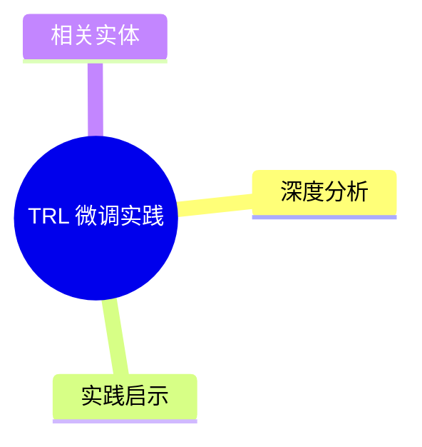
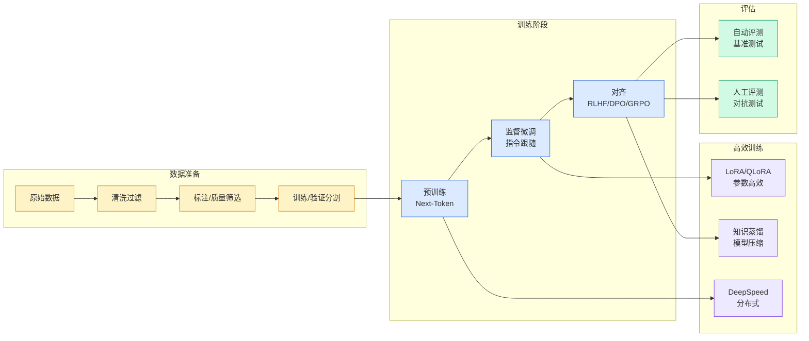

# TRL 微调实践

## Ch01.1325 TRL 微调实践

> 📊 Level ⭐⭐⭐ | 1.8KB | `entities/fine-tuning-with-trl.md`

# TRL 微调实践

Transformer Reinforcement Learning (TRL) 库的微调实践：SFT、DPO、PPO、GRPO 等训练策略。Hugging Face 生态中模型对齐的核心工具。

## 概念导图

## 深度分析

本页作为知识图谱锚点，连接了以下关键实体：[LLM Fine-Tuning Cost Breakdown](ch01/1274-llm.html)。 相关主题通过 [Karpathy 最新访谈：从 Vibe Coding 到 Agentic Engineering](../ch04/237-agentic.html) 延伸。

> 本页内容将在入库相关溯源素材后进一步深化。

## 实践启示

1. 本领域系统性内容尚待采集——当前知识库在此方向的覆盖密度偏低
2. 建议优先采集 TRL 微调实践 相关的一手来源（论文/官方文档/工程博客）
3. 通过交叉链接密度评估本领域的知识图谱成熟度

## 相关实体

- [LLM Fine-Tuning Cost Breakdown](ch01/1274-llm.html)
- [Karpathy 最新访谈：从 Vibe Coding 到 Agentic Engineering](../ch04/237-agentic.html)
- [Anthropic Institute《When AI builds itself》深度解读：AI 进入 AI 研发执行层、瓶颈迁移与研发级 Harness（架构师 JiaGouX）](ch01/989-anthropic.html)
- [Learning to Replicate Expert Judgment in Financial Tasks - Thinking Machines Lab](ch01/182-learning-to-replicate-expert-judgment-in-financial-tasks-t.html)
- [DeepSeek V4 (Flash & Pro) ：通往百万级上下文与万亿参数推理的新纪元](ch01/1073-deepseek-v4-flash-pro.html)

---

