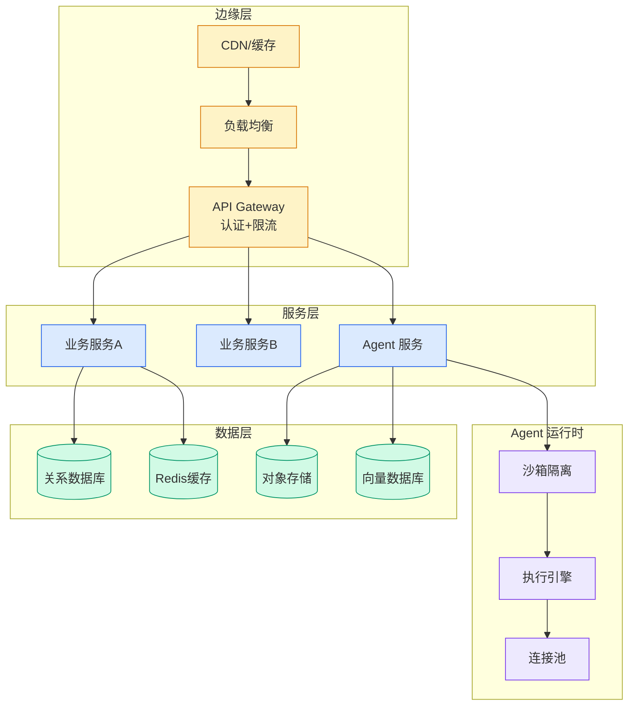

# the anti singularity

## Ch01.1362 the anti singularity

> 📊 Level ⭐⭐⭐⭐⭐ | 2.2KB | `entities/the-anti-singularity.md`

> -> 原文存档
# the anti singularity
source: 
## 摘录
> Title: The Anti-Singularity
URL Source: https://www.lesswrong.com/posts/k3XHZ4DjykLSfsnks/the-anti-singularity
Published Time: 2026-05-10T22:33:59.903Z
Markdown Content:
Heuristic solution to Doom generated by GPT-5.4
In his blog post, Jiayi Weng proposes "the next paradigm" for Machine Learning: rather than trying to find beautiful abstractions for general-purpose-learning, we simply take advantage of LLM's ability to tirelessly iterate on complex designs to build heuristics that can solve what...
## 标签

- source/newsletter
## 相关实体
> 主题导航
- [the token economy](ch01/1029-the-token-economy.html)
## 深度分析
原文存档
**核心论点**：反奇点（The Anti-Singularity）代表了机器学习领域的一次范式转变——不再追求寻找通用学习的优美抽象，而是利用 LLM 无穷迭代复杂设计的能力，通过构建启发式 heuristics 来解决难题。
**技术内涵**：文章源自 Jiayi Weng 的博客文章，由 GPT-5.4 生成 Doom 的启发式解决方案作为案例。这一思路暗示了 AI 发展的另一条路径：与其依赖理论突破，不如让模型在特定任务上通过大规模迭代自我优化。
**意义**：这与传统的"走向通用人工智能（AGI）"路径形成对照。反奇点并非预测 AI 发展的终点，而是提出一种替代性技术路线——通过工程化迭代而非理论突破来实现复杂任务。
## 实践启示
原文存档
- **启发式优先于抽象**：在实际应用中，优先考虑通过迭代生成的启发式规则，而非一味追求理论优雅的通用模型
- **利用 LLM 的迭代能力**：LLM 的不知疲倦的迭代特性可以被用于在复杂设计空间中搜索有效解
- **工程化路径**：对于特定领域问题，工程化的迭代方法可能比追求泛化更有效
- **结合人类反馈**：启发式方案仍需人类评估和引导，确保迭代方向符合预期目标

---
## 关联
- 相关概念: [Harness Engineering](https://github.com/QianJinGuo/wiki/blob/main/concepts/harness-engineering-framework.md)

---
