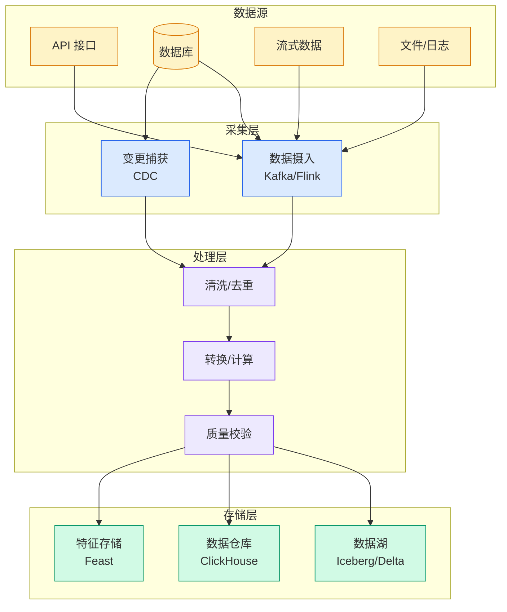

# Nearly every enterprise is investing in AI, but only 5% say their data is ready

## Ch01.146 Nearly every enterprise is investing in AI, but only 5% say their data is ready

> 📊 Level ⭐ | 4.0KB | `entities/www.cio-4170978-nearly-every-enterprise-is-investing-in-ai-but-only-5-say-their-.md`

## 深度分析
这个调查结果揭示了企业AI转型中的一个核心悖论：投资热情与数据成熟度之间的巨大鸿沟。

**95% vs 5% 的含义**：95%的企业表示正在投资AI，但仅有5%认为自己的数据已做好准备——这个比例揭示了为什么大量AI项目最终失败或停留在POC阶段。

**数据准备度不足的根源**通常不在于数据量不够，而在于三个结构性缺陷：

- **数据孤岛**：数据被锁在ERP、CRM、各业务系统等孤岛中
- **数据治理缺失**：缺乏统一的数据治理框架，数据质量无法保证
- **数据质量工具链落后**：历史积累的数据质量问题不会因为引入AI而自动消失

**"先上线AI、再治理数据"策略的陷阱**：这种方式往往导致失败。AI 的放大效应会暴露得更彻底，而非解决问题。

**技术债务视角**：历史积累的数据质量问题在 AI 时代变得更加关键。当企业依赖 AI 做决策时，底层数据的质量直接决定了 AI 输出的可靠性。

**数据健康度评估维度**：

- 完整性（Completeness）：关键字段的填充率
- 一致性（Consistency）：跨系统的数据定义和数值是否一致
- 时效性（Timeliness）：数据更新的频率和延迟
- 可访问性（Accessibility）：数据能否被需要的人及时获取

## 实践启示

1. **AI投资前先做数据健康检查**：在启动任何AI项目前，系统性地评估数据的完整性、一致性、时效性和可访问性
2. **采用"数据优先、AI其次"的推进策略**：优先解决数据孤岛和治理问题，再考虑AI能力的引入
3. **建立企业级数据底座**：投资建设统一的数据目录、数据血缘追踪、以及数据质量监控体系
4. **小步快跑验证数据假设**：在大规模AI投资前，通过PoC验证核心数据的可用性，避免大规模沉没成本
5. **数据治理成熟度评估**：将数据治理成熟度作为AI项目立项的前置条件
## 相关实体
- [Enterprise Ai Investment Data Readiness Cio](../ch03/011-cio.html)
- [Every Ai Subscription Is A Ticking Time Bomb For Enterprise](ch01/1148-every-ai-subscription-is-a-ticking-time-bomb-for-enterprise.html)
- [Shinyhunters Canvas Domain Suspended](../ch05/094-ai.html)
- [Akamai Acquires Israeli Ai Browser Security Startup Layerx For 205 Million In Ca](../ch05/094-ai.html)
- [Clinereleasesopen Sourceagentruntimesdk](../ch04/003-agentrun.html)

→ [原文存档](https://github.com/QianJinGuo/wiki-book/tree/main/docs/raw/articles/www.cio-4170978-nearly-every-enterprise-is-investing-in-ai-but-only-5-say-their-.md)

---

