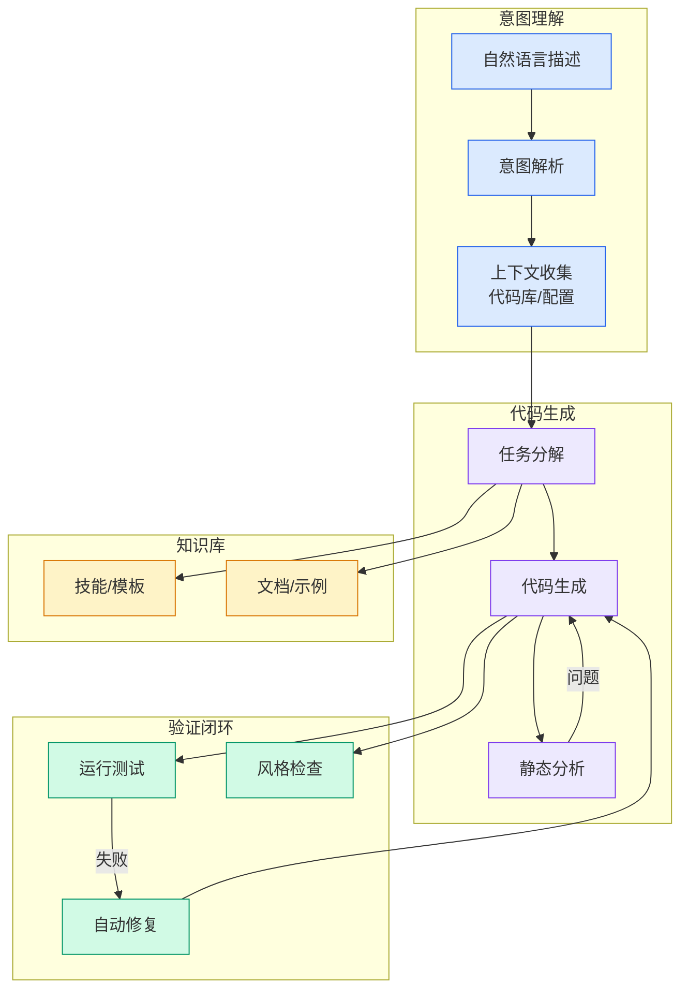

# Fable 5 官方实战指南：找到你的未知

## Ch01.147 Fable 5 官方实战指南：找到你的未知

> 📊 Level ⭐ | 3.9KB | `entities/fable-5-官方实战指南找到你的未知.md`

# Fable 5 官方实战指南：找到你的未知

或许是知道大家这周末都要奋战狂战 Fable 5，Anthropic 的 Claude Code 开发者 Thariq 放出了一篇长文，分享他使用 Fable 5 模型的方法论。

Thariq 在文中表示：  Fable 5 的能力上限，取决于你能发现多少自己还不知道的东西。

下为 Thariq 全文：

用 Claude Fable 5 写代码，反复教给我一个老道理：  ** 地图不是疆域。  **

地图，也就是对工作的描述，是我的 prompt、skills 和 context，是我交给 Claude 的东西。

疆域，则是工作真正发生的地方：代码库，现实世界，以及它真实的约束条件。

## 核心观点

> 本文通过article、llm、anthropic视角，分析了的AI/ML技术动态。

或许是知道大家这周末都要奋战狂战 Fable 5，Anthropic 的 Claude Code 开发者 Thariq 放出了一篇长文，分享他使用 Fable 5 模型的方法论。

Thariq 在文中表示：  Fable 5 的能力上限，取决于你能发现多少自己还不知道的东西。

下为 Thariq 全文：

用 Claude Fable 5 写代码，反复教给我一个老道理：  ** 地图不是疆域。  **

地图，也就是对工作的描述，是我的 prompt、skills 和 context，是我交给 Claude 的东西。

疆域，则是工作真正发生的地方：代码库，现实世界，以及它真实的约束条件。

地图与疆域

地图和疆域之间的差距，就是我所说的「未知」。当 Claude 遇到一个未知时，它得根据对你意图的最佳猜测来做决策。工作量越大，Claude 可能碰到的未知也就越多。

** Fable 是第一个让我觉得，工作质量的瓶颈其实在于我自己澄清「未知」的能力的模型。  **

这里有个关键点：光靠提前规划，往往还不够。你可能在实现过程中才挖出深层的未知，也可能发现这些未知其实指向了一个完全不同的解法。

我发现，用 Fable 工作其实是一个迭代的过程：在实现之前、之中和之后，持续地发现自己的未知。

我做了一些  ** 用于发现未知的示例 artifact [1]  ** ，不过建议先看完这篇文章，建立起直觉之后再去看。

01

##  四种「未知」

你的未知到底有哪些呢？当我带着一个问题来找 Claude 时，我倾向于从四个维度来拆解：

•  ** 已知的已知（Known Knowns）  ** ：这基本就是你 prompt 里写的东西，你告诉 agent 你想要什么了。

•  ** 已知的未知（Known Unknowns）  ** ：你还没想清楚的部分，但你至...

## 技术洞察

本文的核心技术价值在于：
- 或许是知道大家这周末都要奋战狂战 Fable 5，Anthropic 的 Claude Code 开发者 Thariq 放出了一篇长文，分享他使用 Fable 5 模型的方法论。

Thariq 在文...

→ [原文存档](https://github.com/QianJinGuo/wiki-book/tree/main/docs/raw/articles/fable-5-官方实战指南找到你的未知.md)

---
## 关联
- 相关概念: [Harness Engineering](https://github.com/QianJinGuo/wiki/blob/main/concepts/harness-engineering-framework.md)
- 相关: [Agent 架构](https://github.com/QianJinGuo/wiki/blob/main/concepts/agent-architecture.md)

---

