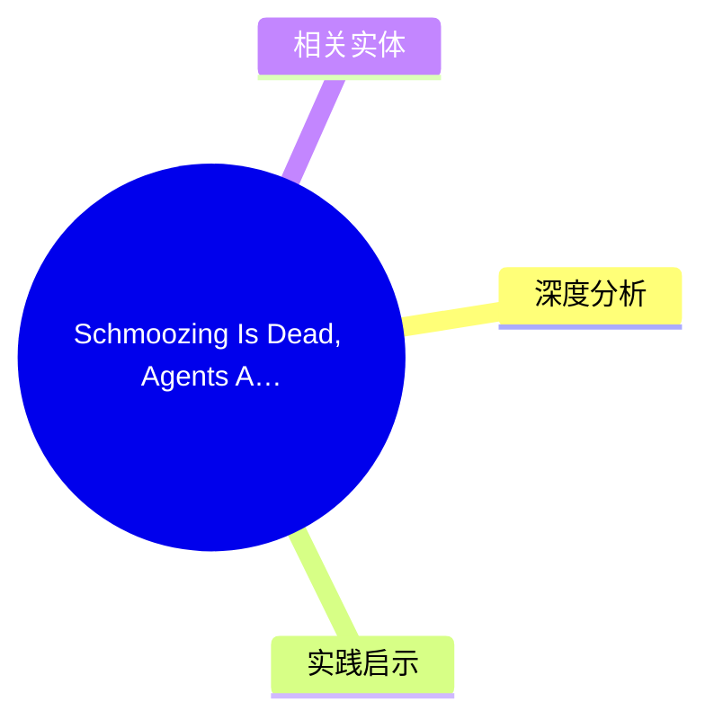
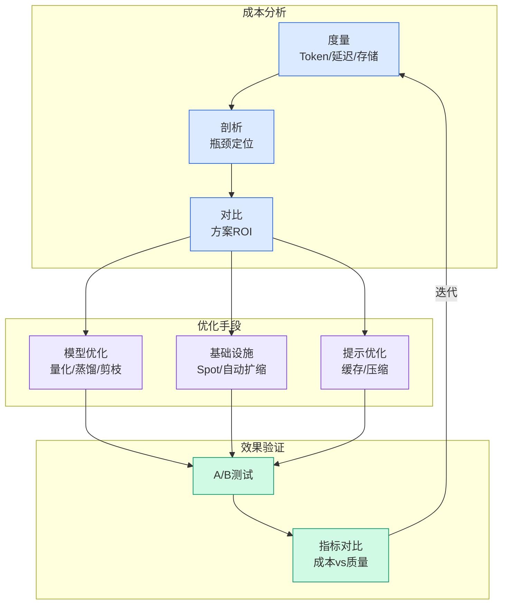

# Schmoozing Is Dead, Agents Are Hitting 120% of Humans, and Growth Is the Only Thing That

## Ch01.149 Schmoozing Is Dead, Agents Are Hitting 120% of Humans, and Growth Is the Only Thing That

> 📊 Level ⭐ | 3.8KB | `entities/schmoozing-is-dead-agents-are-hitting-120-of-humans-and-growth-is-the-only-thing.md`

## 概念导图

## 核心要点
- Schmoozing（社交 networking）已死：AI agent 正在取代人类进行销售和客户互动
- AI Agent 效率指标：部分场景达到人类效率的 120%
- 增长（Growth）是 SaaS 唯一重要指标：其他都是噪声
- SaaStr AI Annual 2026 闭门 Q&A 的核心洞察

## 深度分析

SaaStr AI Annual 2026 的闭门 Q&A 环节揭示了 AI 原生软件公司的关键趋势：

**"Schmoozing Is Dead"**：传统的销售模式依赖于人际关系和面对面沟通，但 AI Agent 正在改变这一范式。AI 可以 24/7 不间断工作，不会疲劳，不会情绪化，且可以在同一时间处理多个客户互动。这导致部分销售场景的效率达到人类的 120%。

**增长为王**：在当前市场环境下，VC 和市场对 SaaS 公司的评估标准正在简化——增长成为唯一重要的指标。ARR 增长率、净收入留存率（NRR）、CAC/LTV比率等传统指标虽然仍然重要，但在 AI 时代，增速本身即是护城河。

**AI 对 SaaS 的影响**：

- 客户支持成本大幅下降
- 销售周期缩短
- 个性化程度提高
- 客户获取成本（CAC）降低

**"120% of Humans"** 的含义：AI Agent 在特定任务上已经超越人类表现，这不是威胁而是机会——意味着软件公司可以用更少的资源做更多的事。

## 实践启示
1. **重新审视销售策略**：考虑将 AI Agent 整合进销售流程，特别是在线索 Qualification 和初始 outreach 环节
2. **增长优先**：在资源分配上，增长投入应该优先于其他所有指标
3. **效率提升**：评估当前流程中哪些可以被 AI 自动化，目标是实现效率的叠加而非简单的成本削减
4. **人机协作**：最佳策略是 AI 处理标准化任务，人类专注关系建立和复杂决策
5. **数据驱动**：AI Agent 产生的大量交互数据可以帮助优化产品和营销策略
## 相关实体
- [Deels Accelerate Or Die Moment](https://github.com/QianJinGuo/wiki/blob/main/entities/deels-accelerate-or-die-moment.md)
- 1000 Record Covers The Taschen Book That Proves
- [Vercel Com How Superset Built The Ide For Ai Agents On Vercel](ch01/080-how-superset-built-the-ide-for-ai-agents-on-vercel.html)
- [Ai Powered Honeypots Turning The Tables On Malicious Ai Agents](ch01/083-ai-powered-honeypots-turning-the-tables-on-malicious-ai-age.html)
- [Automation Anywhere Collaborates With Cisco Nvidia Okta And Openai Launching Ent](../ch04/016-automation-anywhere-collaborates-with-cisco-nvidia-okta-a.html)

→ [原文存档](https://github.com/QianJinGuo/wiki-book/tree/main/docs/raw/articles/schmoozing-is-dead-agents-are-hitting-120-of-humans-and-growth-is-the-only-thing.md)

---

