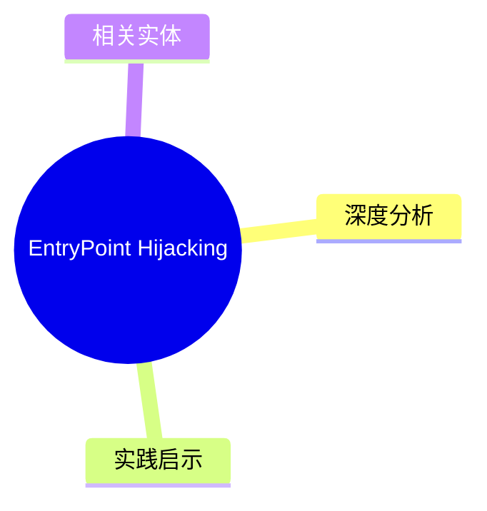
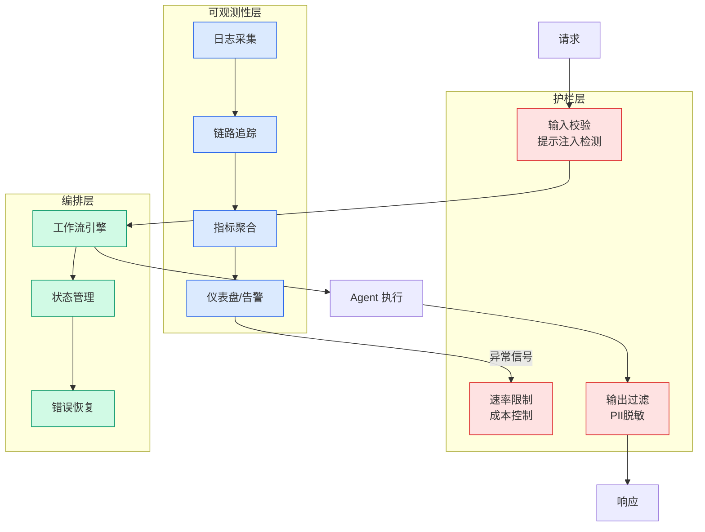

# EntryPoint Hijacking

## Ch01.153 EntryPoint Hijacking

> 📊 Level ⭐ | 3.7KB | `entities/entrypointhijacking.md`

## 概念导图

## 核心要点
- AI/ML 技术文章
- 技术分析和方法论
→ [原文存档](https://github.com/QianJinGuo/wiki-book/tree/main/docs/raw/articles/entrypointhijacking.md)

## 深度分析

EntryPoint Hijacking 是一种**无新建线程**的代码注入技术，核心创新在于将恶意代码写入内存后不立即执行，而是等待进程正常创建新线程时触发。这与传统的 Thread Injection（CreateRemoteThread）等技术的根本区别在于：不依赖 API 调用产生新线程，不在进程上下文留下明显的线程创建痕迹，从而大幅提升 EDR 规避能力。
**技术原理解构**：Windows 加载器（ntdll!Ldrp）维护已加载 DLL 的 EntryPoint 地址记录。攻击者覆写 DLL 的 EntryPoint（如 kernelbase.dll），将执行流重定向到恶意代码。由于 Windows 通过 EntryPoint 属性识别 DllMain()，加载器在触发 DLL 事件时会自动调用被篡改的入口点。LdrShuffle 和 EPI 两个 PoC 在执行机制上有所不同：LdrShuffle 通过 QueueUserWorkItem 在线程池线程执行；EPI 通过 patch PEB + 进程线程池执行，但都利用了 EntryPoint 属性这一共同攻击面。
**检测的核心挑战**：EntryPoint 被篡改后会立即恢复（LdrShuffle 在 DontCallForThreads 检查后快速恢复原始 EntryPoint），因此 EDR 的定时内存扫描只能捕捉到极短的 hijack 窗口。有效的检测必须依赖完整性检查（PEB loader structures）+ 内存属性变更监控（MEM_IMAGE → MEM_PRIVATE）+ WriteProcessMemory 遥测的组合。
**Purple Team 视角**：该技术的出现说明 EDR 不能仅依赖常见恶意 API（CreateRemoteThread 等）的检测，需要转向更底层的完整性验证（OriginalBase vs DllBase 比较、内存类型变化监控）。

## 实践启示
**EDR 团队**：将 EntryPoint Hijacking 纳入 purple team operations backlog。基于文章提供的检测逻辑（OriginalBase != DllBase、内存类型变化、OriginalBase 是堆指针）构建检测规则，重点监控高价值进程（lsass、浏览器、Office、EDD 自身）。
**SIEM 集成**：部署 LdrShuffleDetect 或其变种到关键Endpoints，定期扫描并告警。同时，监控 Sysmon Event ID 10 中 GrantedAccess=0x143A（VM_READ+VM_WRITE+VM_OPERATION）与出站流量的关联——这是 EntryPoint Hijacking 的行为指标。
**防御纵深**：EntryPoint Hijacking 成功后攻击者获得进程内执行能力，但执行本身仍依赖进程正常功能（QueueUserWorkItem、线程池）。限制进程权限、最小化 GrantedAccess、监控异常内存分配可以缩短攻击者的可用操作窗口。
**代码注入防御演进**：传统的"禁止 CreateRemoteThread"类规则已不足以覆盖此类高级注入技术。安全团队应转向：PEB 完整性持续监控、内存属性变更检测、WriteProcessMemory 调用的上下文关联分析。

## 相关实体
> [主题导航](https://github.com/QianJinGuo/wiki/blob/main/moc/cybersecurity-privacy.md)

- [EntryPoint Hijacking](ch01/153-entrypoint-hijacking.html)
- [EntryPoint Hijacking](https://github.com/QianJinGuo/wiki/blob/main/entities/entrypointhijacking.md)
- [Versa takes aim at fragmented enterprise security with CSPM, orchestration update, and AI agent controls](ch01/223-rag.html)

---

