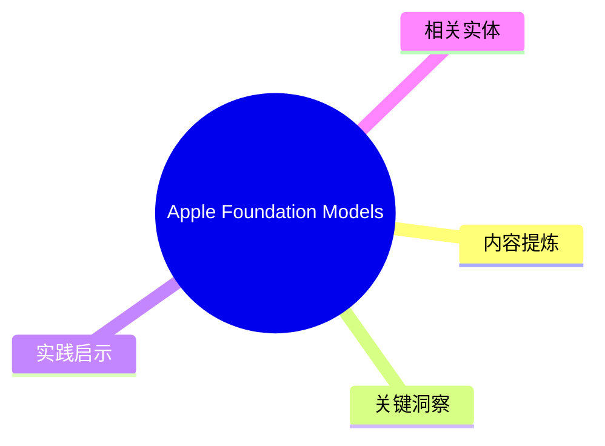
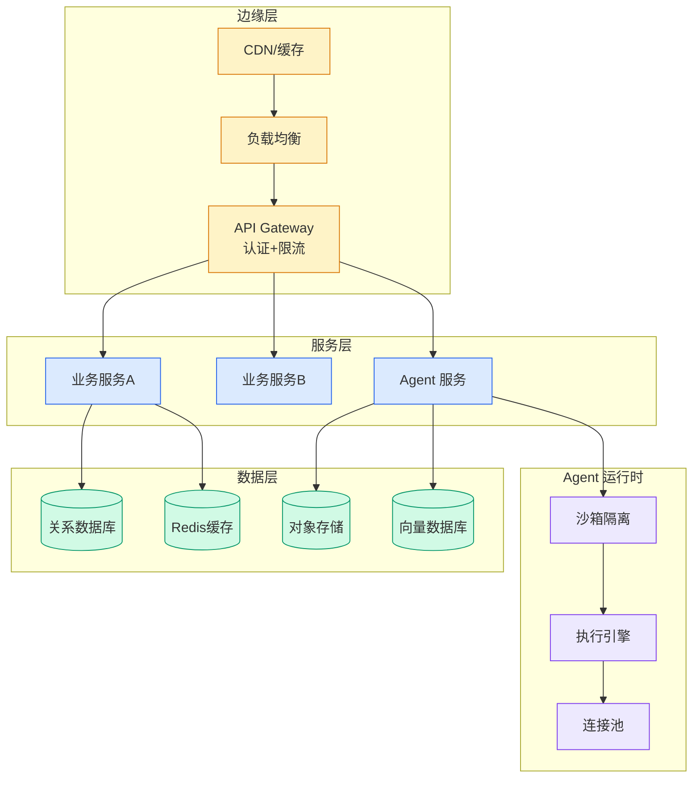

# Apple Foundation Models

## Ch01.154 Apple Foundation Models

> 📊 Level ⭐ | 3.7KB | `entities/anthropic-apple-foundation-models-claude.md`

# Apple Foundation Models

> Source: [原文存档](https://github.com/QianJinGuo/wiki-book/tree/main/docs/raw/articles/anthropic-apple-foundation-models-claude.md)

## 概念导图

## 核心要点

- **来源**: https://platform.claude.com/docs/en/cli-sdks-libraries/libraries/apple-foundation-models
- **评分**: v=7, c=7, v×c=49, stars=4
- **评估理由**: Solid technical documentation for integrating Claude with Apple's Foundation Models framework via a Swift package. Well-structured with clear sections on installation, quick start, model selection, effort levels, and authentication (dev vs production). Authoritative source from Anthropic. Notable do

## 内容提炼

Markdown Content:
CLI, SDKs, and libraries Libraries and integrations

Use Claude on Apple platforms through the Foundation Models framework with the Claude for Foundation Models Swift package.

[Claude for Foundation Models](https://github.com/anthropics/ClaudeForFoundationModels) is a Swift package that makes Claude available as a server-side language model in Apple's [Foundation Models](https://developer.apple.com/documentation/foundationmodels) framework. The package conforms Claude to the framework's `LanguageModel` protocol, so you drive it with the same `LanguageModelSession` API you use for Apple's on-device model: `respond(to:)`, streaming, guided generation, and tool calling all work the same way.

Requests go directly from your app to the Claude API; Apple is not in the request path and does not see prompts or responses. Usage is billed to your Anthropic account at [standard API pricing](https://platform.claude.com/docs/en/about-claude/pricing). Your app decides when to use Claude and when to use Apple's on-device model: pass whichever model you want to each session.

**Beta.** This package targets the Foundation Models server-side language model API introduced in the OS

## 关键洞察

- Beta.** This package targets the Foundation Models server-side language model API introduced in the OS 27 betas. APIs may change before general availability.
- iOS 27, macOS 27, visionOS 27, or watchOS 27 (all in beta): the OS releases whose Foundation Models framework supports server-side language models
- ### When to use Claude versus the on-device model
- Prompt caching controls (the package applies prompt caching automatically; cache TTL and breakpoint placement are not configurable)

## 实践启示

- 文章的核心论点可在生产环境验证
- 与现有实体的差异化角度：本文来自 platform.claude.com 视角
- 引用源：[Anthropic Apple Foundation Models Claude](https://github.com/QianJinGuo/wiki-book/tree/main/docs/raw/articles/anthropic-apple-foundation-models-claude.md)
## 相关实体
- [from doer to director: the ai mindset shift](ch01/031-from-doer-to-director-the-ai-mindset-shift.html)
- [why internally-built ai fails fund accounting audits](ch01/130-why-internally-built-ai-fails-fund-accounting-audits.html)
- [back up and restore your amazon eks cluster resources using](../ch11/013-back-up-and-restore-your-amazon-eks-cluster-resources-using.html)

---

