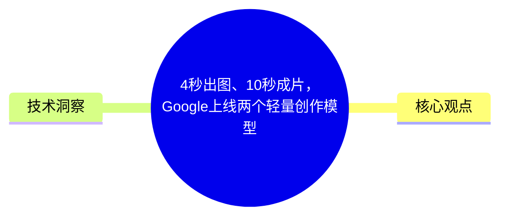
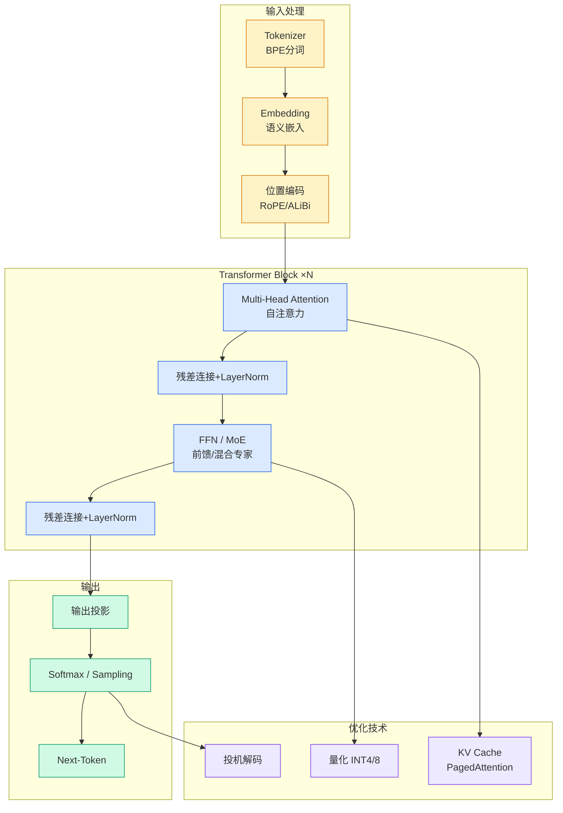

# 4秒出图、10秒成片，Google上线两个轻量创作模型

## Ch01.162 4秒出图、10秒成片，Google上线两个轻量创作模型

> 📊 Level ⭐ | 3.5KB | `entities/4秒出图10秒成片google上线两个轻量创作模型.md`

# 4秒出图、10秒成片，Google上线两个轻量创作模型

如果你是Gemini的重度用户，大概率昨天还在等Google的3.5 Pro。

这事儿从5月19日的I/O就开始吊胃口——Google当时官宣了Gemini 3.5 Pro，把发布窗口定在6月。可6月30日，眼看要到月底最后一天了，3.5 Pro也没有出现。

据外媒报道，它被推迟到了7月，理由是“根据早期企业测试反馈，还在打磨编码能力、token效率和长任务表现”，Google官方对此不予置评。。

卡着6月最后一天，Google倒是上线了两个新东西——

**图像模型Nano Banana 2 Lite**

**视频模型Gemini Omni Flash**

一个主打快，一个主打省。

## 概念导图

## 核心观点

> 本文通过article、llm视角，分析了的AI/ML技术动态。

如果你是Gemini的重度用户，大概率昨天还在等Google的3.5 Pro。

这事儿从5月19日的I/O就开始吊胃口——Google当时官宣了Gemini 3.5 Pro，把发布窗口定在6月。可6月30日，眼看要到月底最后一天了，3.5 Pro也没有出现。

据外媒报道，它被推迟到了7月，理由是“根据早期企业测试反馈，还在打磨编码能力、token效率和长任务表现”，Google官方对此不予置评。。

卡着6月最后一天，Google倒是上线了两个新东西——

**图像模型Nano Banana 2 Lite**

**视频模型Gemini Omni Flash**

一个主打快，一个主打省。

已关注

__

关注

__ 重播 __ 分享 __ 赞

关闭 __

**观看更多**

更多 __

__

__

__

_退出全屏_

[ __](<javascript:;>)

_切换到竖屏全屏_ _退出全屏_

夕小瑶科技说已关注

[ __](<javascript:;>)

分享视频

 __，时长 00:19

0/0

00:00/00:19

切换到横屏模式 

继续播放

进度条，百分之0

 __

[播放](<javascript:;>)

00:00

/

00:19

00:19

[倍速](<javascript:;>)

 _全屏_

 __倍速播放中

[ 0.5倍 ](<javascript:;>)[ 0.75倍 ](<javascript:;>)[ 1.0倍 ](<javascript:;>)[ 1.5倍 ](<javascript:;>)[ 2.0倍 ](<javascript:;>)

[ 超清 ](<javascript:;>)[ 流畅 ](<javascript:;>)

您的浏览器不支持 video 标签 

__

继...

## 技术洞察

本文的核心技术价值在于：
- 如果你是Gemini的重度用户，大概率昨天还在等Google的3.5 Pro。

这事儿从5月19日的I/O就开始吊胃口——Google当时官宣了Gemini 3.5 Pro，把发布窗口定在6月。可6...

→ [原文存档](https://github.com/QianJinGuo/wiki-book/tree/main/docs/raw/articles/4秒出图10秒成片google上线两个轻量创作模型.md)

---
## 关联
- 相关概念: [Harness Engineering](https://github.com/QianJinGuo/wiki/blob/main/concepts/harness-engineering-framework.md)
- 相关: [Agent 架构](https://github.com/QianJinGuo/wiki/blob/main/concepts/agent-architecture.md)

---

