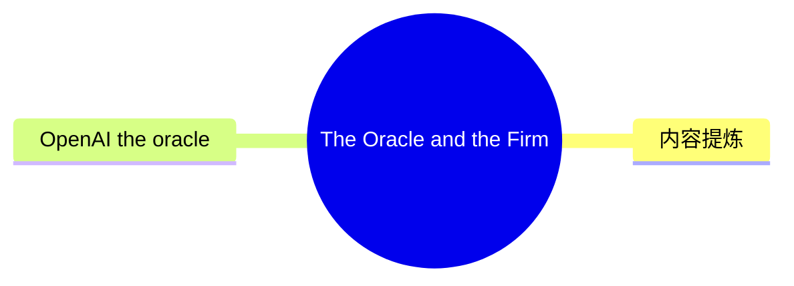
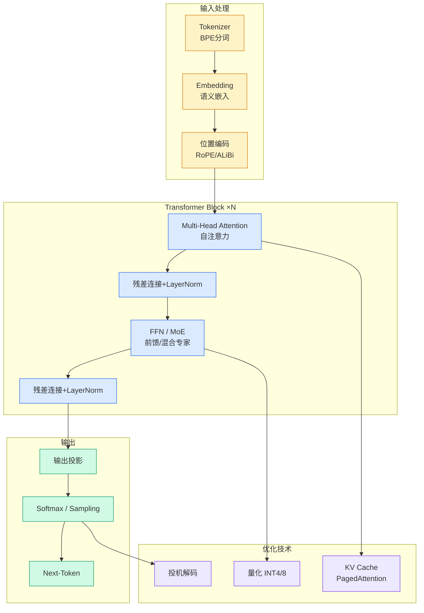

# The Oracle and the Firm

## Ch01.163 The Oracle and the Firm

> 📊 Level ⭐ | 3.5KB | `entities/calv-oracle-and-the-firm.md`

# The Oracle and the Firm

> Source: [原文存档](https://github.com/QianJinGuo/wiki-book/tree/main/docs/raw/articles/calv-oracle-and-the-firm.md)

## 概念导图

## 核心要点

- **来源**: https://calv.info/the-oracle-and-the-firm
- **评分**: v=6, c=5, v×c=30, stars=4
- **评估理由**: Original and insightful analytical framework comparing 'Oracle' (compaction-heavy, single-thread) vs 'Firm' (sub-agent delegation) approaches to context management in frontier models. The organizational analogy and technical discussion of K/V caching, message-passing, and forgetting modes are valuab

## 内容提炼

Published Time: Sat, 13 Jun 2026 14:16:25 GMT

Markdown Content:
Like most of the internet, I've been diving into Fable 5 over the last 24h. And like most of the internet, I've been pretty blown away with the quality.

But as I've been using both Fable and GPT-5.5, I couldn't help but notice there are clear differences in approach which make the two models behave quite differently. And we're seeing two very different training regimes play out.

For any frontier model, accomplishing real work is an exercise in **context management**. The model needs to solve a problem across a very large number of tokens; some are explored via tool calls, others are the model thinking. Then it needs to produce a result.

To get models to solve harder and harder tasks that run for increasing amounts of time, you need to figure out how to scale that context management.

## OpenAI: the oracle

Since roughly ChatGPT 5.3-Codex, I've noticed that the model has improved a _lot_ at dealing with long context windows. It stays coherent even across long-running tasks or `/goal` implementations, despite having a smaller context window than the corresponding Opus models (~200k vs 1m).

The approach Codex takes i

## 关键洞察

- you have a separate (sometimes smaller) model output a new message based upon the trajectory.
- _e.g. ask 5.5 to summarize everything in the thread up to 1k tokens_
- you remove certain categories of calls from the conversation.
- _e.g. remove all tool calls, then begin inference_
- Perceived speed:** Anthropic models will often seem to be "doing more", because the tokens are being produced in parallel vs serial. Many more tokens are produced during that time.

## 实践启示

- 文章的核心论点可在生产环境验证
- 与现有实体的差异化角度：本文来自 calv.info 视角
- 引用源：[Calv Oracle And The Firm](https://github.com/QianJinGuo/wiki-book/tree/main/docs/raw/articles/calv-oracle-and-the-firm.md)
## 相关实体
- [from doer to director: the ai mindset shift](ch01/031-from-doer-to-director-the-ai-mindset-shift.html)
- [why internally-built ai fails fund accounting audits](ch01/130-why-internally-built-ai-fails-fund-accounting-audits.html)
- [back up and restore your amazon eks cluster resources using](../ch11/013-back-up-and-restore-your-amazon-eks-cluster-resources-using.html)

---

