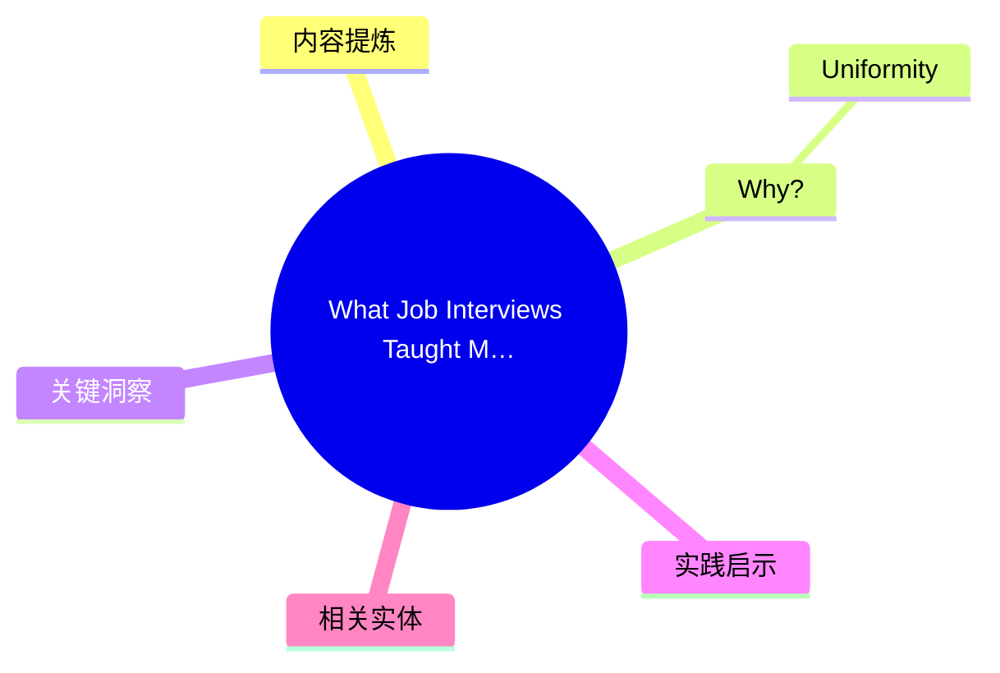
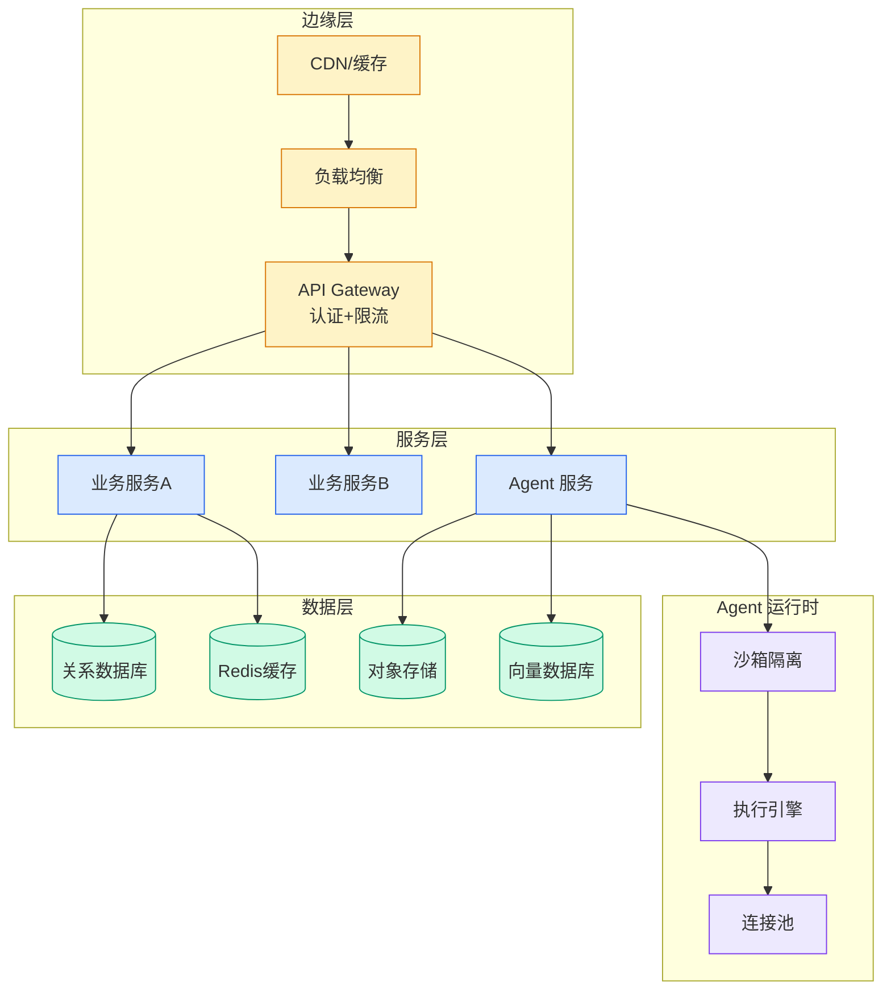

# What Job Interviews Taught Me About Kubernetes

## Ch01.165 What Job Interviews Taught Me About Kubernetes

> 📊 Level ⭐ | 3.4KB | `entities/notnotp-k8s-interviews-non-technical.md`

# What Job Interviews Taught Me About Kubernetes

> Source: [原文存档](https://github.com/QianJinGuo/wiki-book/tree/main/docs/raw/articles/notnotp-k8s-interviews-non-technical.md)

## 概念导图

## 核心要点

- **来源**: https://notnotp.com/notes/what-job-interviews-taught-me-about-kubernetes/
- **评分**: v=7, c=8, v×c=56, stars=4
- **评估理由**: Well-structured opinion piece drawing on real interview experience to discuss the non-technical (organizational) reasons companies adopt Kubernetes. Offers practical advice on when K8s makes sense (the 'second engineer' threshold is a useful heuristic) and when it doesn't. Honest about limitations a

## 内容提炼

Published Time: 2026-06-15

Markdown Content:
Published on 15 June 2026
So I've been job hunting lately. Reading job postings, doing interviews, talking to engineering teams at like a dozen companies. And I noticed something compared to five years ago when I was last doing this: literally everyone is on Kubernetes now. Every single company I talked to.

Last time I was job hunting that wasn't the case at all. There were basically three camps: the rare Kubernetes adopters, the `systemd`-on-VM/VPS/EC2 crowd, and the serverless people (Lambda, Cloud Run, etc.).

That surprised me, because where I work we have actual Big Tech-scale problems, so K8s makes obvious sense for us. But a 10-person startup with two services? None of these places were doing microservices or anything close to high scale. So I asked why.

**Spoiler: they don't care much about the technical side of K8s.**

## Why?

A technical interview is actually a great place to ask why, especially when you're talking directly to the CTO. So I did. The answers were basically the same everywhere.

### Uniformity

First one was **uniformity**. Every service deploys the same way. No one secretly knowing that the payments service

## 关键洞察

- Spoiler: they don't care much about the technical side of K8s.**
- ## Why the shift happened recently

## 实践启示

- 文章的核心论点可在生产环境验证
- 与现有实体的差异化角度：本文来自 notnotp.com 视角
- 引用源：[Notnotp K8S Interviews Non Technical](https://github.com/QianJinGuo/wiki-book/tree/main/docs/raw/articles/notnotp-k8s-interviews-non-technical.md)
## 相关实体
- [from doer to director: the ai mindset shift](ch01/031-from-doer-to-director-the-ai-mindset-shift.html)
- [why internally-built ai fails fund accounting audits](ch01/130-why-internally-built-ai-fails-fund-accounting-audits.html)
- [back up and restore your amazon eks cluster resources using](../ch11/013-back-up-and-restore-your-amazon-eks-cluster-resources-using.html)

---

