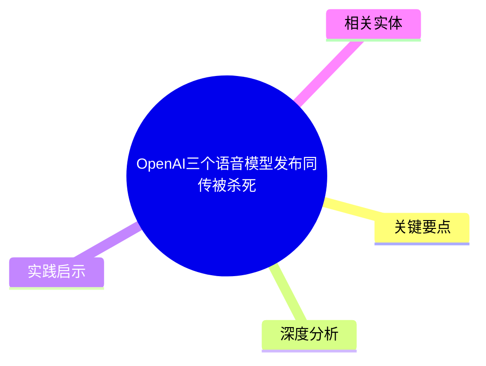
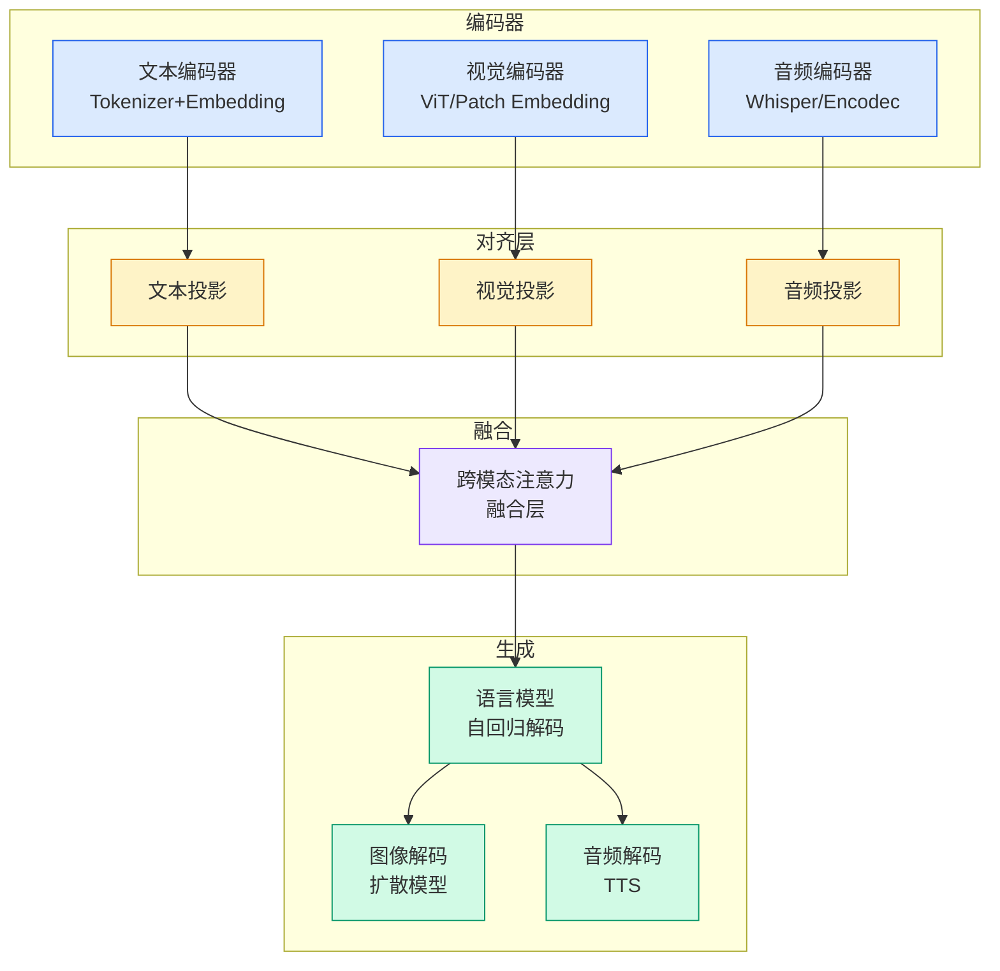

# OpenAI三个语音模型发布同传被杀死

## Ch01.166 OpenAI三个语音模型发布同传被杀死

> 📊 Level ⭐ | 3.4KB | `entities/openai-three-voice-models-kill-simultaneous-translation.md`

> -> [原文存档](https://github.com/QianJinGuo/wiki-book/tree/main/docs/raw/articles/openai-three-voice-models-kill-simultaneous-translation.md)

## 概念导图

## 摘要
OpenAI三个语音模型发布同传被杀死

## 关键要点

- [原文存档](https://github.com/QianJinGuo/wiki-book/tree/main/docs/raw/articles/openai-three-voice-models-kill-simultaneous-translation.md)

## 深度分析
**从对话界面到 AI 基础设施。** 这次发布是 OpenAI 语音战略的一次根本性转变：不再将语音能力当作 ChatGPT 的一个附加模式，而是将其拆分为三个独立可用的 API 产品，覆盖对话、翻译、转录三大场景。这意味着语音 AI 正式成为可被任何人通过 WebRTC/WebSocket/SIP 接入的基础设施层——竞争维度从「模型质量」迁移到「接入体验和可靠性」。
**价格冲击背后的行业逻辑。** GPT-Realtime-Translate 每分钟 $0.034（约人民币 2 毛 5），与人类同传每分钟 $25–$44 的成本相差约 100 倍。这个数字背后不只是便宜——而是一个量级跃迁：当一项能力以 1/100 的价格实现，「同传」这个职业定义本身就开始松动。OpenAI 并没有发明新技术，它把已有的翻译技术做成了随时可用的标准化商品。
**端到端 vs 级联式架构的优势。** 传统语音翻译是「语音→文字→翻译→语音」的级联过程，每步都丢失信息。GPT-Realtime-Translate 采用端到端原始音频处理，保留了说话者的情感、语调和语速，这是它自称比以往任何时候都更接近现场翻译的技术原因。
**「杀死同传」还在早期。** 当前模型标注为 turn-based，理想情况下需要说话者短暂停顿，翻译效果最佳。这与传统同传的 2–3 秒延迟仍有差距，但 OpenAI 明确表示延迟会随模型变快而降低——这是一个正在收窄的差距。

## 实践启示
- **口译从业者**：将 AI 翻译定位为日常工作的辅助工具而非替代品，把精力集中在 AI 目前短板领域——高风险外交场合、复杂语境理解、情感传递、创意表达；提前布局「AI + 人类协同」的商业模式。
- **企业应用开发者**：Deutsche Telekom、Priceline、Vimeo 的案例表明，多语言客服和旅行语音助手是近期的落地方向；核心竞争力将从翻译质量转向用户体验设计、错误处理和多语言场景的接入稳定性。
- **商业战略**：实时语音 API 的开放意味着「多语言实时沟通」已成为一个可打包出售的产品特性；任何依赖人工同传服务的行业（国际会议、医疗陪同、法务听证）都面临成本重构压力。

## 相关实体

- [OpenAI buys AI consultancy to sell enterprises on its models](ch01/1059-openai-buys-ai-consultancy-to-sell-enterprises-on-its-models.html)

---
## 关联
- 相关概念: [Harness Engineering](https://github.com/QianJinGuo/wiki/blob/main/concepts/harness-engineering-framework.md)

---

