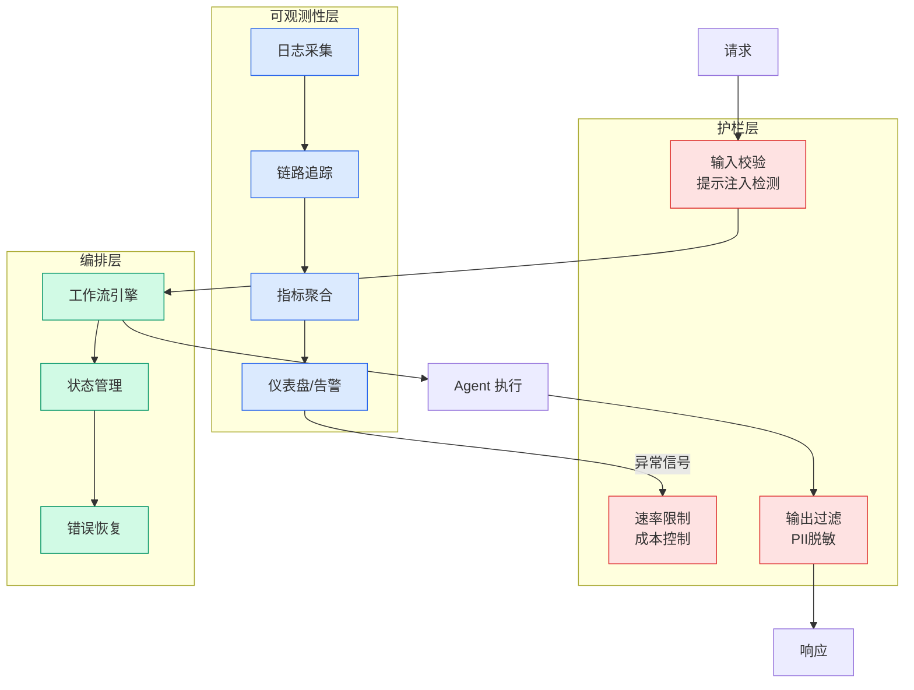

# YC Spring 2026 全批 196 家公司分析：AI 不再是差异点

## Ch01.167 YC Spring 2026 全批 196 家公司分析：AI 不再是差异点

> 📊 Level ⭐ | 3.4KB | `entities/yc-spring-2026-196-companies-chris-lu-analysis.md`

> 原文归档：[原文归档](https://github.com/QianJinGuo/wiki-book/tree/main/docs/raw/articles/yc-spring-2026-196-companies-chris-lu-analysis.md)

Chris Lu（Copy.ai 创始人）对 YC Spring 2026 全部 196 家公司、395 位创始人的系统分析。核心发现：AI 已不再是差异点，70% 做 Agent，44% 做同一种"Agent 即服务"，差异化最强的公司反而几乎不用 AI。

## 一句话

**95% 碰 AI、70% 做 Agent、44% 做同一种 Agent-as-a-Service——AI 是基线不是护城河，差异化来自垂直选择和执行速度。**

## 关键数字

| 指标 | 数值 | 备注 |
|------|------|------|
| AI 优先 | 95% | 上一批 85% |
| AI 原生 | 80% | AI 是产品本身 |
| 做 LLM Agent | 70% (137 家) | 比其它技术品类加起来还多 |
| Agent-as-a-Service | 44% (86 家) | 几乎一半做同一种东西 |
| B2B | 62% | 纯消费仅 12 家 |
| 完全不用 AI | 10 家 | 国防/航天/核能等实体产品 |

## 差异化悖论

在一个 95% 碰 AI 的批次里，**差异化最强的公司反而几乎不用 AI**：

- **国防/航天 13 家**：攻击型无人机(Tenet)、无人机防御(Surtr)、反无人机(9 Mothers)、太空制造(Dispatch)、紧凑型核反应堆(Apollo Atomics)
- **预测市场基础设施 6 家**：给 Polymarket/Kalshi 铺轨道
- **深科技/生物硬件 6 家**：便携 MRI、AI 药物发现
- **AI 安全 4 家**：给所有 Agent 搭安全层

## 创始人画像

| 维度 | 数据 |
|------|------|
| 最常见前东家 | Amazon/AWS (33 人) > Meta (17) > Google/DeepMind (17) |
| 技术出身 | 70% |
| 纯技术班底 | 49% |
| 博士 | 仅 5% |
| 辍学创业 | 仅 3% |
| 单人创始人 | 38 家（29 家 AI 原生） |
| 连续创业者 | 45% |
| 顶级学校 | Stanford 24 / Berkeley 21 / MIT 15 / Oxford 11 / TUM 8 |
| "抱团出走" | Traba 4人 / HEVN / InLoop / Clara |

## 核心判断

Chris Lu：**这一批不会靠洞见取胜，会靠速度。**

深思圈补充：86 家做同一东西的"速度决胜"更像绞肉机——速度是必要条件，但"选对赛道"本身就是洞见，不是执行。把最难一步归给速度，把判断藏起来了。

## 局限性

- 单人标签（Chris Lu 个人分类标准）
- YC 样本偏差（不代表全行业）
- "70% 做 agent" 取决于分类粒度

## 相关实体

- [Harness Engineering](../ch05/120-harness-engineering.html) — Agent 差异化来自 harness 而非模型
- [Claw-SWE-Bench](../ch05/009-harness.html) — harness 独立变量实证
- [Agent Eval WalleZhang](../ch03/035-agent.html)

---

