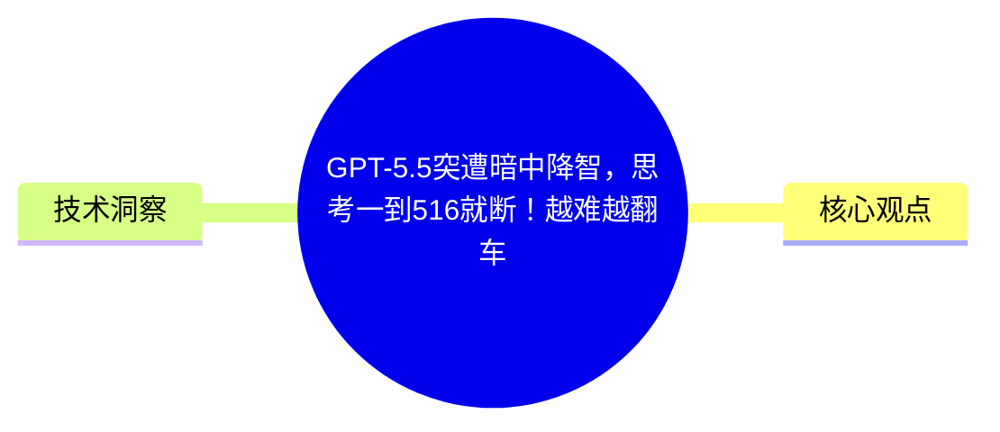
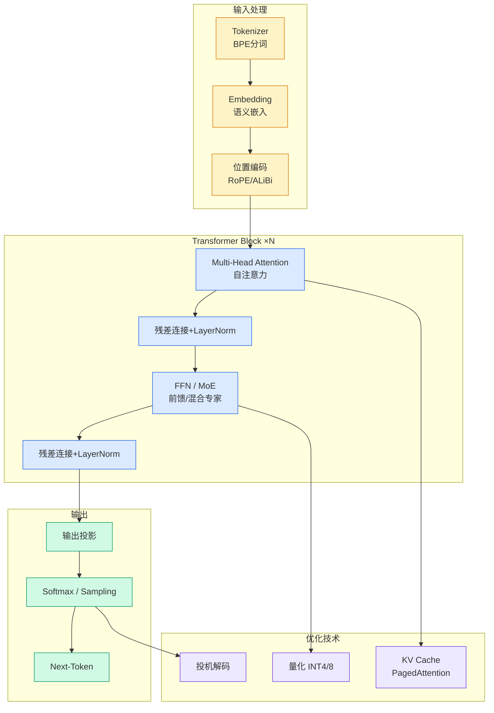

# GPT-5.5突遭暗中降智，思考一到516就断！越难越翻车

## Ch01.168 GPT-5.5突遭暗中降智，思考一到516就断！越难越翻车

> 📊 Level ⭐ | 3.3KB | `entities/gpt-55突遭暗中降智思考一到516就断越难越翻车.md`

# GPT-5.5突遭暗中降智，思考一到516就断！越难越翻车

### 

### 

**   ****新智元报道  **

##### **【新智元导读】 GPT-5.5大翻车，竟被数字「516」活活卡死。80%复杂推理被悄悄截断，开发者怒轰OpenAI暗中阉割算力：花最贵的钱，买最烂的体验！**

  

简直太诡异了。

OpenAI当家王牌GPT-5.5，这几天在复杂编程任务上突然「拉胯」，大幅降智。

细思极恐的是，有人找到了让它瞬间崩溃的「死亡密码」：

数字516

  

大批Codex开发者集体吐槽，验证了这个离谱的Bug。

## 概念导图

## 核心观点

> 本文通过article、llm视角，分析了的AI/ML技术动态。

### 

### 

**   ****新智元报道  **

##### **【新智元导读】 GPT-5.5大翻车，竟被数字「516」活活卡死。80%复杂推理被悄悄截断，开发者怒轰OpenAI暗中阉割算力：花最贵的钱，买最烂的体验！**

  

简直太诡异了。

OpenAI当家王牌GPT-5.5，这几天在复杂编程任务上突然「拉胯」，大幅降智。

细思极恐的是，有人找到了让它瞬间崩溃的「死亡密码」：

数字516

  

大批Codex开发者集体吐槽，验证了这个离谱的Bug。

堂堂顶级大模型，为何会被一个数字搞崩？

##   

**GPT-5.5死卡「516」****80%任务悄悄降智**

##   

事情的真相，是这样的……

一周前，Codex开发者@vguptaa45，拉出后台元数据，意外发现了一条让人头皮发麻的规律——

GPT-5.5的大量回复，其推理Token的数量，竟死死地卡在「516」这个数字上。

传送门：https://github.com/openai/codex/issues/30364

而且，不止一个点位。在1034和1552这两个节点，同样出现了诡异的集中爆发。

在编号#30364的GitHub Issue里，开发者摊开了一份统计：

分析窗口从2026年2月1日-6月27日，覆盖390,195条响应级Token记录、865个会话。

其中，推理Token精确等于516的事件，一共3363次。

在一次跨模型的横向对比中，结果触目惊心——

GPT-5.5，只占全部响应量的19.3%，却包揽了82.0%的「精准516」事件。

换句话说，全网所有卡在516这个死结上的回复，超过八成都出自GPT-5.5一家之手。

接下来，再和自家GPT系模型对比，一个关键指标叫「精准516/大于等于516的比例」。

在GPT-5.5...

## 技术洞察

本文的核心技术价值在于：
- ### 

### 

**   ****新智元报道  **

##### **【新智元导读】 GPT-5.5大翻车，竟被数字「516」活活卡死。80%复杂推理被悄悄截断，开发者怒轰OpenAI暗中阉...

→ [原文存档](https://github.com/QianJinGuo/wiki-book/tree/main/docs/raw/articles/gpt-55突遭暗中降智思考一到516就断越难越翻车.md)

---
## 关联
- 相关概念: [Harness Engineering](https://github.com/QianJinGuo/wiki/blob/main/concepts/harness-engineering-framework.md)
- 相关: [Agent 架构](https://github.com/QianJinGuo/wiki/blob/main/concepts/agent-architecture.md)

---

