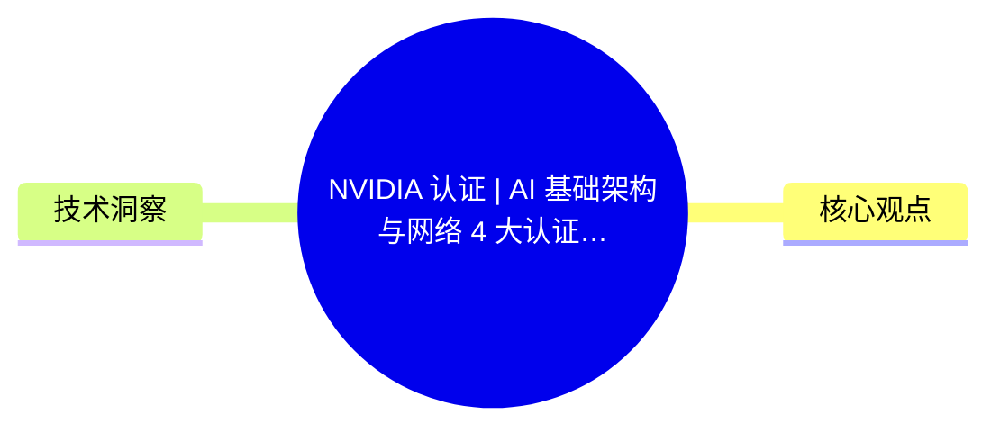
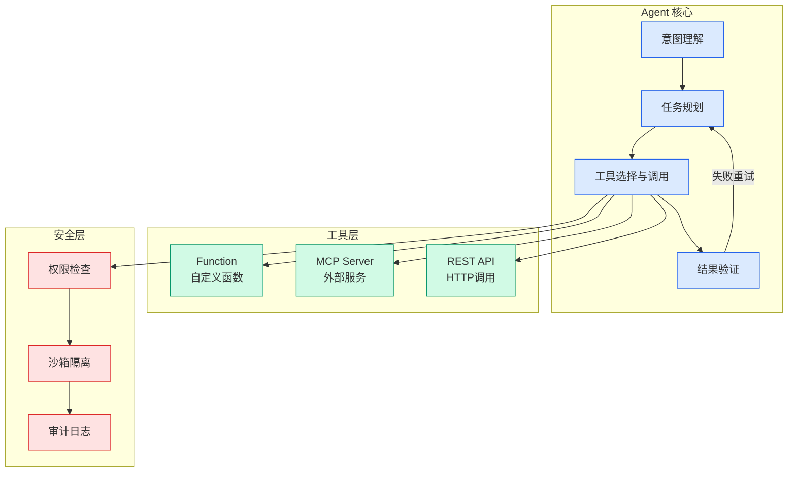

# NVIDIA 认证 | AI 基础架构与网络 4 大认证报考指南

## Ch01.170 NVIDIA 认证 | AI 基础架构与网络 4 大认证报考指南

> 📊 Level ⭐ | 3.2KB | `entities/nvidia-认证-ai-基础架构与网络-4-大认证报考指南.md`

# NVIDIA 认证 | AI 基础架构与网络 4 大认证报考指南

想从事 AI 基础架构、AI 工厂或 AI 网络相关工作，需要具备哪些核心技能？从 AI 数据中心设计、GPU 集群部署到高性能网络和 AI 运维管理，相关岗位对专业技能的要求不断提升。NVIDIA 深度学习培训中心（DLI）提供 AI 基础架构与网络系列认证，帮助您验证在 AI 基础架构规划、部署、运营和优化等领域的专业能力。

  

7 - 8 月 NVIDIA 认证现场考试上海、北京考位现已开放预约，立即报名考取 NVIDIA 认证，验证专业能力，把握 AI 发展机遇。

## 概念导图

## 核心观点

> 本文通过article、nvidia视角，分析了的AI/ML技术动态。

想从事 AI 基础架构、AI 工厂或 AI 网络相关工作，需要具备哪些核心技能？从 AI 数据中心设计、GPU 集群部署到高性能网络和 AI 运维管理，相关岗位对专业技能的要求不断提升。NVIDIA 深度学习培训中心（DLI）提供 AI 基础架构与网络系列认证，帮助您验证在 AI 基础架构规划、部署、运营和优化等领域的专业能力。

  

7 - 8 月 NVIDIA 认证现场考试上海、北京考位现已开放预约，立即报名考取 NVIDIA 认证，验证专业能力，把握 AI 发展机遇。

  

**AI 基础架构与网络（4 门认证）**

  

**NVIDIA-Certified Associate:**

**  AI Infrastructure and Operations（NCA-AIIO） **

  

01

**关于认证**

验证 AI 计算与基础架构和运营相关的基本技能。

02

**认证等级**

Associate 初级

03

**考试概况**

60 分钟现场考试，50 道单选或多选题

04

**考试涵盖主题**

  * **AI 基础知识：** NVIDIA AI 生态系统，涵盖软件堆栈、AI、机器学习和深度学习的核心概念，以及架构对比（GPU/CPU、训练/推理）和 AI 用例。

  * **AI 基础架构：** 硬件识别、GPU 基础架构扩展、电力与散热基础知识、本地部署与云端的对比、集群组件识别、设施需求、AI 网络架构、数据中心协议、高速网络选项，以及 DPU 在数据中心中的优势。

  * **AI 运营：** 管理和监测 AI 数据中心的关键技能、集群编排和作业调度、GPU 性能监测，虚拟化加速 AI 基础架构的注意事项。

  

**NVIDIA Certified Professional:  **

**...

## 技术洞察

本文的核心技术价值在于：
- 想从事 AI 基础架构、AI 工厂或 AI 网络相关工作，需要具备哪些核心技能？从 AI 数据中心设计、GPU 集群部署到高性能网络和 AI 运维管理，相关岗位对专业技能的要求不断提升。NVIDIA ...

→ [原文存档](https://github.com/QianJinGuo/wiki-book/tree/main/docs/raw/articles/nvidia-认证-ai-基础架构与网络-4-大认证报考指南.md)

---
## 关联
- 相关概念: [Harness Engineering](https://github.com/QianJinGuo/wiki/blob/main/concepts/harness-engineering-framework.md)

---

