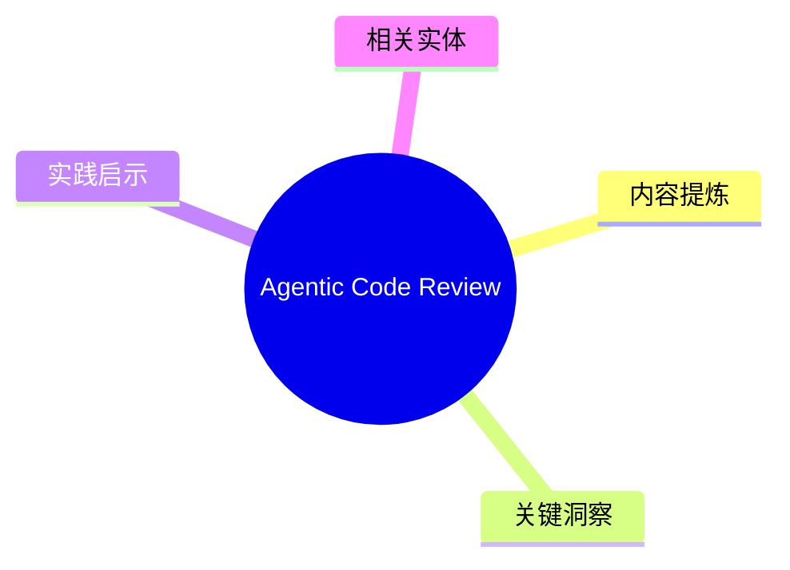
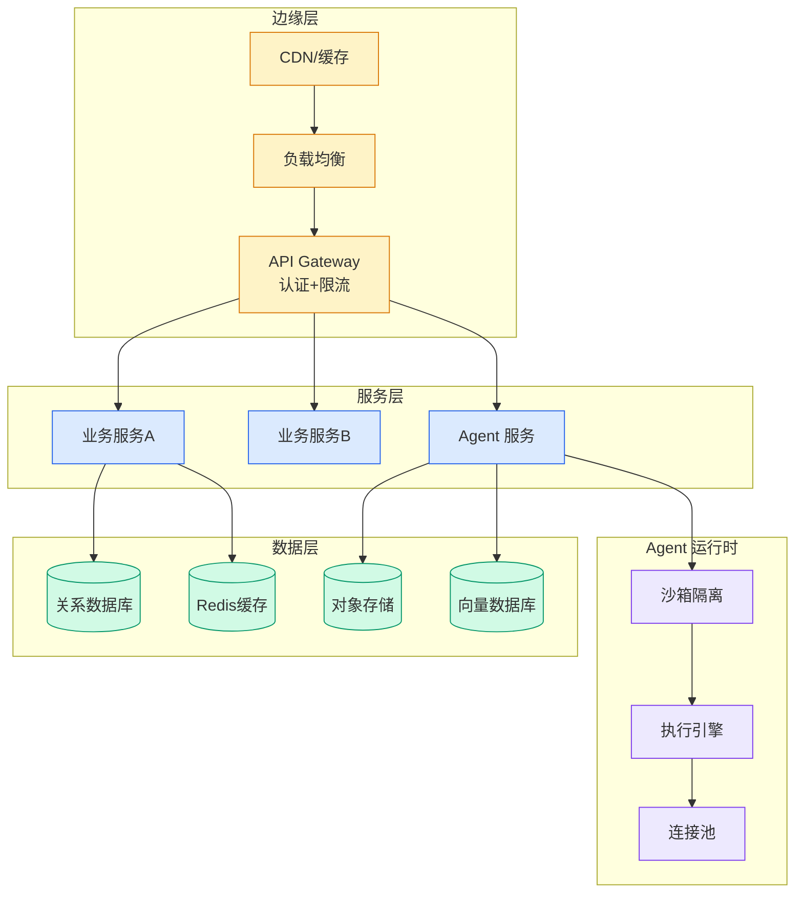

# Agentic Code Review

## Ch01.171 Agentic Code Review

> 📊 Level ⭐ | 3.2KB | `entities/agentic-code-review-addyosmani.md`

# Agentic Code Review

> Source: [原文存档](https://github.com/QianJinGuo/wiki-book/tree/main/docs/raw/articles/agentic-code-review-addyosmani.md)

## 概念导图

## 核心要点

- **来源**: https://addyosmani.com/blog/agentic-code-review/
- **评分**: v=7, c=7, v×c=49, stars=4
- **评估理由**: Strong thesis on AI-driven code review becoming the highest-leverage engineering activity, supported by specific metrics from Faros AI (22k devs, 861% churn up), CodeRabbit (1.7x more issues in AI PRs), and GitClear (4x output, ~12% real productivity gain). Writing is engaging, well-structured, and 

## 内容提炼

Markdown Content:
_Coding agents are extraordinarily good now, and getting better fast. The interesting consequence is that the hard part of engineering moved from writing code to deciding whether to trust it, which makes review the most leveraged skill in software right now. How you approach it depends enormously on who you are: a solo developer with no users and a team maintaining a ten-year-old application are not solving the same problem._

* * *

I am more optimistic about agentic engineering than I have ever been. The agents are genuinely good, they get better every month, and on an ordinary day I now ship things I would not have attempted a year ago. This write-up is a map of where the interesting work went, because it did move, and most teams have not fully caught up to where.

Code review used to work because of a happy accident of relative speed. A senior engineer could read code faster than a junior could write it, so review kept pace without anyone designing it to, and the team absorbed how the system fit together as a side effect of reading each other’s diffs. A lot of that was not deliberate. It fell out of a single fact: writing code was the slow, expensive part, and

## 关键洞察

- ## What the 2026 data actually shows
- the incidents-to-PR ratio up **242.7%**
- the per-developer defect rate up from **9% to 54%**
- median review _duration_ up **441.5%**, with time-to-first-review and average review time both roughly doubling
- PRs merged with **zero review up 31.3%**
- ## Everyone is solving a different problem

## 实践启示

- 文章的核心论点可在生产环境验证
- 与现有实体的差异化角度：本文来自 addyosmani.com 视角
- 引用源：[Agentic Code Review Addyosmani](https://github.com/QianJinGuo/wiki-book/tree/main/docs/raw/articles/agentic-code-review-addyosmani.md)
## 相关实体
- [from doer to director: the ai mindset shift](ch01/031-from-doer-to-director-the-ai-mindset-shift.html)
- [why internally-built ai fails fund accounting audits](ch01/130-why-internally-built-ai-fails-fund-accounting-audits.html)
- [back up and restore your amazon eks cluster resources using](../ch11/013-back-up-and-restore-your-amazon-eks-cluster-resources-using.html)

---

