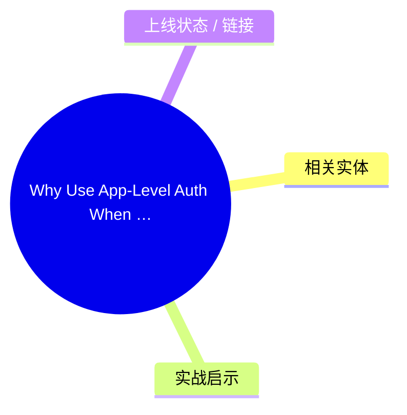
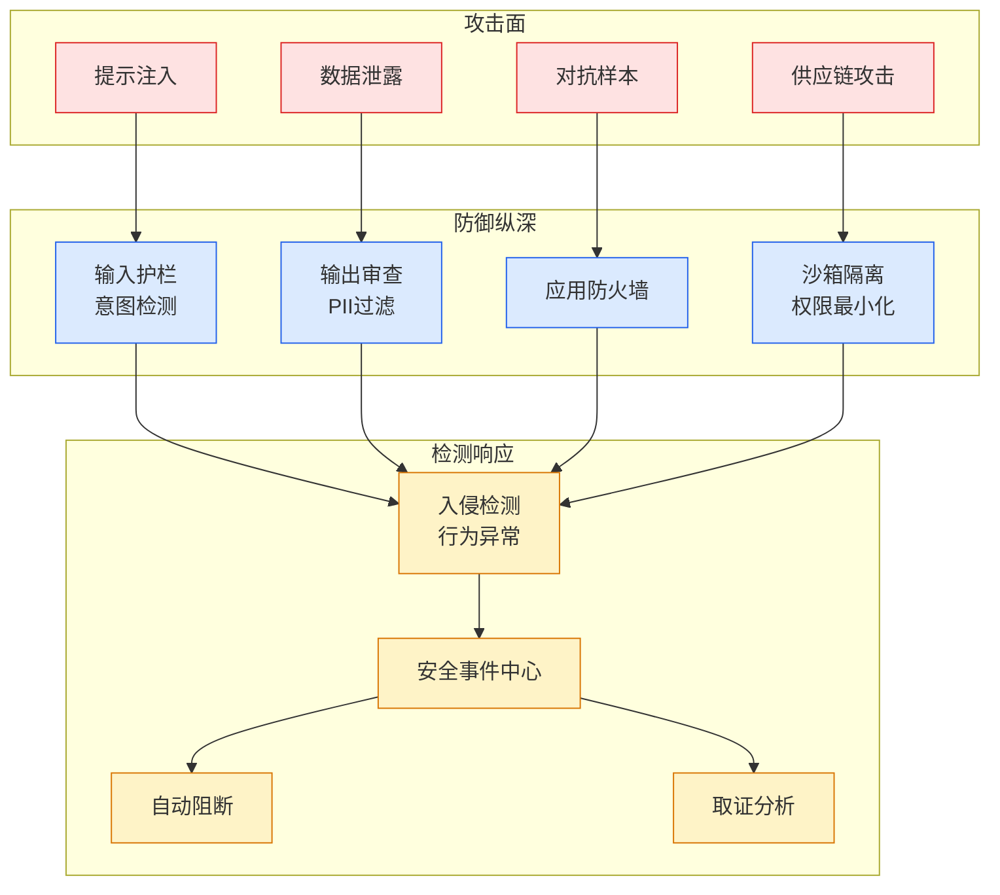

# Why Use App-Level Auth When Every Database Has Auth? (Splunk CVE-2026-20253)

## Ch01.175 Why Use App-Level Auth When Every Database Has Auth? (Splunk CVE-2026-20253)

> 📊 Level ⭐ | 3.2KB | `entities/why-use-app-level-auth-when-every-database-has-auth-splunk-e.md`

# Why Use App-Level Auth When Every Database Has Auth? (Splunk CVE-2026-20253)

## 概念导图

## 相关实体
- [microsoft is quietly shopping for an openai replacement](ch01/036-microsoft-is-quietly-shopping-for-an-openai-replacement.html)
- [vietnam to develop domestic cloud](ch01/1116-opd.html)
- [akamai acquires israeli ai browser security startup layerx f](../ch05/094-ai.html)

→ [原文存档](https://github.com/QianJinGuo/wiki-book/tree/main/docs/raw/articles/why-use-app-level-auth-when-every-database-has-auth-splunk-e.md)

## 核心要点

1. **Pre-auth RCE via Splunk Enterprise search companion — CVE-2026-20253** — Splunk's `splunkd` management port (8089) exposed Python code paths (search assistant, deployment client) that didn't enforce app-level auth context. An unauthenticated attacker could trigger code execution by sending crafted JSON RPC calls.
2. **The systemic anti-pattern: 'database has auth, so app can skip it'** — Many enterprise apps assume the underlying DB authenticates connections, so they don't re-validate user identity at the app layer. The Splunk CVE shows this is wrong: an attacker can issue RPC calls that bypass the DB layer entirely, hitting the app's internal API directly.
3. **watchtowr's research methodology** — Black-box recon of Splunk Enterprise 9.x instances, mapping management endpoints, finding ones that returned data without proper auth context. Identified `/services/search/parser` and `/services/deploymentserver` as pre-auth reachable.
4. **Defense pattern: 'trust boundary is the function, not the connection'** — Every function that touches user data should re-authenticate. Don't rely on the transport layer (TLS), the network layer (VPN), or the data layer (DB auth) to enforce identity. The app's own function entry point is the only reliable boundary.

## 实战启示

- **生产级实施建议**：基于上述要点，构建可落地的实施方案
- **风险评估**：在采用前评估安全/性能/成本 trade-off
- **参考架构**：借鉴同领域最佳实践，避免常见陷阱

## 上线状态 / 链接

- **原文链接**: https://labs.watchtowr.com/why-use-app-level-auth-when-every-database-has-auth-splunk-enterprise-cve-2026-20253-pre-auth-rce/
- **作者/平台**: newsletter
- **类型**: newsletter / 行业分析
- **评分**: v=7, c=7, v×c=49, stars=4

---

