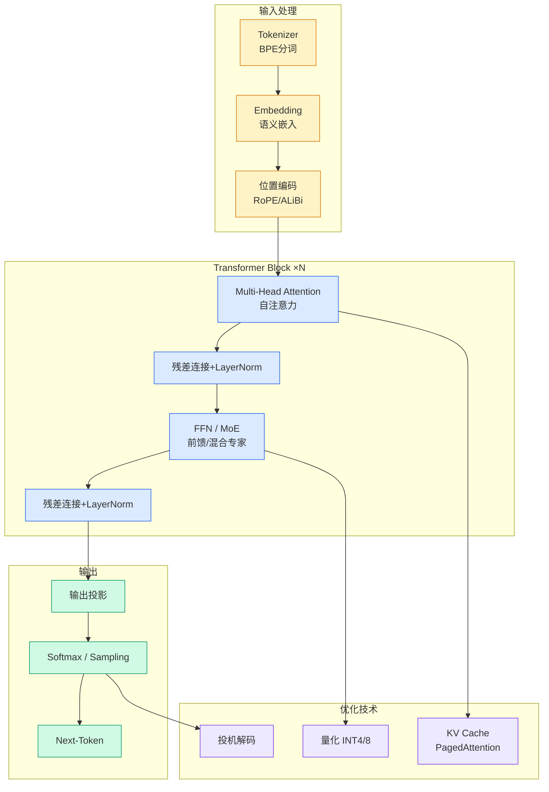

# OpenAI塌房！Scaling law原作曝bug，万亿算力全白烧

## Ch01.176 OpenAI塌房！Scaling law原作曝bug，万亿算力全白烧

> 📊 Level ⭐ | 3.2KB | `entities/openai塌房scaling-law原作曝bug万亿算力全白烧.md`

# OpenAI塌房！Scaling law原作曝bug，万亿算力全白烧

### 

### 

**   ****新智元报道  **

##### **【新智元导读】** DeepMind研究员深夜爆料：OpenAI的Scaling Law原始论文竟有致命bug！全球AI白白烧掉万亿算力，GPT-3其实严重「虚胖」。

  

OpenAI误导了整个AI圈好几年！

  

过去五年，整个AI行业都被Scaling Law推着往前冲。

  

奥特曼坚信AGI的底气就来自这条曲线。

  

现在，有人站出来说：这条曲线，一开始就错了。

  

不是事后诸葛。说这话的，是当年就在OpenAI做大模型优化的研究员**Diogo Almeida** 。

## 核心观点

> 本文通过article、llm视角，分析了的AI/ML技术动态。

### 

### 

**   ****新智元报道  **

##### **【新智元导读】** DeepMind研究员深夜爆料：OpenAI的Scaling Law原始论文竟有致命bug！全球AI白白烧掉万亿算力，GPT-3其实严重「虚胖」。

  

OpenAI误导了整个AI圈好几年！

  

过去五年，整个AI行业都被Scaling Law推着往前冲。

  

奥特曼坚信AGI的底气就来自这条曲线。

  

现在，有人站出来说：这条曲线，一开始就错了。

  

不是事后诸葛。说这话的，是当年就在OpenAI做大模型优化的研究员**Diogo Almeida** 。

  

刚刚，他发出一篇博客，标题冷得发指——《Scaling Laws, Honestly》。

  

开头一句直接把话说死：最初那版scaling law是错的，因为存在一个bug。

  

传送门：https://www.completeskeptic.com/p/scaling-laws-honestly

  

DeepMind那位以扩散模型封神的**Sander Dieleman** ，转头就在推特上把它顶了上去，说这是一段有意思的LLM往事：

  

原始scaling law因为一个bug而错了，大概率害得业界在一堆「体量过大、训练不足」的模型上，白白烧掉了海量算力。

  

  

一个bug，烧掉两年。

  

当bug被撕开，我们看到的，不仅是算力的黑洞，更是一条被语言本身重塑的、远比想象中更深刻的智能边界。

  

  

**Scaling Law竟是LLM版「地心说」**

  

2020年，**OpenAI** 给出结论：在固定的算力预算下，你应该优先把模型做大，而不是拿更多数据去喂它。

  

用公式说，最优参...

## 技术洞察

本文的核心技术价值在于：
- ### 

### 

**   ****新智元报道  **

##### **【新智元导读】** DeepMind研究员深夜爆料：OpenAI的Scaling Law原始论文竟有致命bug！全球AI...

→ [原文存档](https://github.com/QianJinGuo/wiki-book/tree/main/docs/raw/articles/openai塌房scaling-law原作曝bug万亿算力全白烧.md)

---
## 关联
- 相关概念: [Harness Engineering](https://github.com/QianJinGuo/wiki/blob/main/concepts/harness-engineering-framework.md)
- 相关: [Agent 架构](https://github.com/QianJinGuo/wiki/blob/main/concepts/agent-architecture.md)

---

