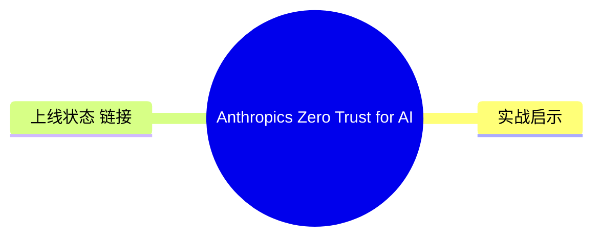
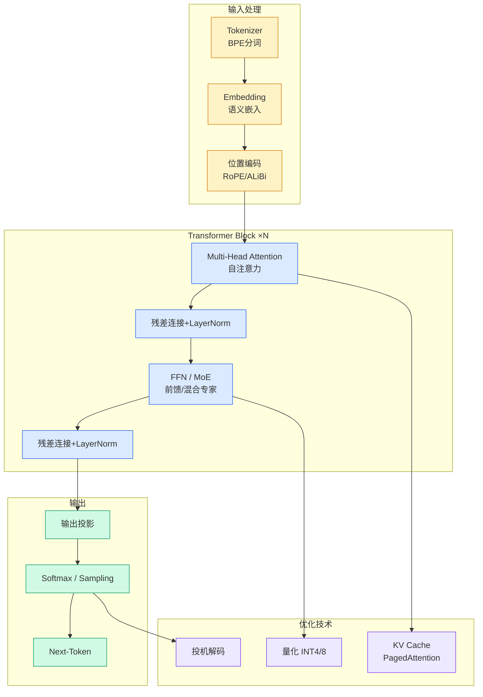

# Anthropic's Zero Trust for AI Agents Sets the Right Test. The Bearer Token Fails It

## Ch01.177 Anthropic's Zero Trust for AI Agents Sets the Right Test. The Bearer Token Fails It

> 📊 Level ⭐ | 3.1KB | `entities/anthropics-zero-trust-for-ai-agents-sets-the-right-test-the.md`

# Anthropic's Zero Trust for AI Agents Sets the Right Test. The Bearer Token Fails It

## 概念导图

## 相关实体
- [microsoft is quietly shopping for an openai replacement](ch01/036-microsoft-is-quietly-shopping-for-an-openai-replacement.html)
- [vietnam to develop domestic cloud](ch01/1116-opd.html)
- [akamai acquires israeli ai browser security startup layerx f](../ch05/094-ai.html)

→ [原文存档](https://github.com/QianJinGuo/wiki-book/tree/main/docs/raw/articles/anthropics-zero-trust-for-ai-agents-sets-the-right-test-the.md)

## 核心要点

1. **Anthropic's policy paper on AI agent security** — Anthropic published a position paper advocating Zero Trust architecture for AI agents: every tool call should be authenticated, authorized, and audited independently, not relying on session-based trust.
2. **The bearer token problem** — The author argues that long-lived bearer tokens (OAuth access tokens, API keys) are fundamentally incompatible with agentic AI. Agents accumulate tokens across services; if one token is compromised, the attacker has the agent's full delegated authority. The paper calls for short-lived, scoped, refresh-able credentials.
3. **The test the bearer token fails** — A Zero Trust agent should NOT be able to perform an action it wasn't specifically authorized for in the current scope, even with a valid token. Current bearer token models fail this test: a valid `repo:read` token can sometimes be escalated to `repo:write` via confused deputy attacks.
4. **Practical recommendation: per-action credential injection** — Instead of giving an agent a token at session start, the runtime should fetch a fresh, narrowly-scoped credential for each tool call, ideally with user-in-the-loop confirmation for high-risk actions (delete, send-money, modify-permissions).

## 实战启示

- **生产级实施建议**：基于上述要点，构建可落地的实施方案
- **风险评估**：在采用前评估安全/性能/成本 trade-off
- **参考架构**：借鉴同领域最佳实践，避免常见陷阱

## 上线状态 / 链接

- **原文链接**: https://blog.hello.coop/2026/06/anthropics-zero-trust-for-ai-agents-sets-the-right-test-the-bearer-token-fails-it/
- **作者/平台**: newsletter
- **类型**: newsletter / 行业分析
- **评分**: v=7, c=6, v×c=42, stars=4

---

