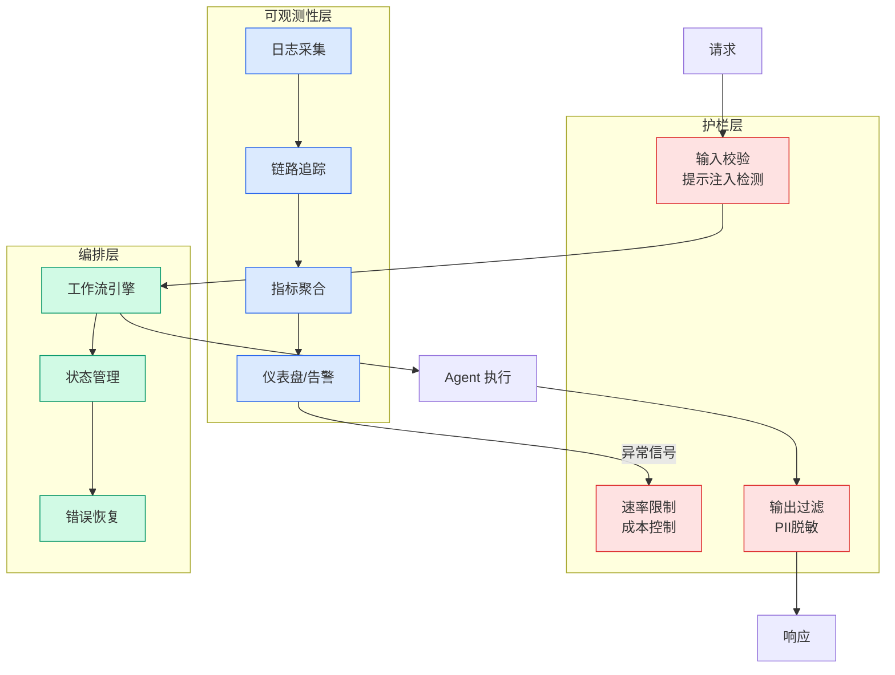

# Is This Why Science Advances One Funeral at a Time?

## Ch01.178 Is This Why Science Advances One Funeral at a Time?

> 📊 Level ⭐ | 3.1KB | `entities/is-this-why-science-advances-one-funeral-at.md`

> -> [原文存档](https://github.com/QianJinGuo/wiki-book/tree/main/docs/raw/articles/is-this-why-science-advances-one-funeral-at.md)

## 相关实体

- [Why Internally-Built AI Fails Fund Accounting Audits](ch01/130-why-internally-built-ai-fails-fund-accounting-audits.html)
- [AI in Cybersecurity Training Resources | SANS Institute](../ch05/094-ai.html)

## 深度分析

这篇文章将科学创造力的二元性（Connective Novelty vs. Disruptive Innovation）置于聚光灯下，并通过对 1200 万科学家 60 年发表记录的量化分析，为 Max Planck 的经典论断提供了实证基础。核心发现是：**科学家随年龄增长趋于"连接"而非"颠覆"**——这不是能力退化，而是认知模式的结构性转变。
研究的理论贡献在于将"创造力"解耦为两个正交维度：连接性 novelty（将已有知识重新组合产生新见解）和 disruptive innovation（颠覆现有范式）。此前关于科学家创造力的争论——年轻人更有创造力还是资深科学家更有创造力——在错误的框架下展开，因为两者都对：年轻人更可能颠覆，资深者更可能连接。
Max Planck 的"科学随葬礼前进"论断获得了新的诠释：它并非暗示资深科学家故意阻碍进步，而是说明**认知路径依赖是科学革命的内在阻力**。当 Einstein 反对量子力学时，他并非不理性——而是因为他的整个认知框架建立在经典物理之上，量子力学的随机性本质上是对其知识体系的根本性挑战。
这篇文章的深层含义指向 AI 时代的科学创新：**当 AI 系统能够高效完成"连接已有知识"的任务时，人类科学家的比较优势在哪里？** 如果连接性 novelty 可以被 AI 大规模替代，那么科学家的核心价值将越来越取决于其颠覆性创新能力——而这恰恰是当前 AI 系统最难复制的。

## 实践启示
- **科研管理者**：在组建研究团队时，应有意识地平衡经验丰富的老专家与年轻颠覆者——前者擅长知识整合与传承，后者是范式突破的潜在来源
- **年轻科学家**：不必因为"经验不足"而自我怀疑——颠覆性创新的窗口期恰恰在职业生涯早期，应勇于挑战主流范式而非急于融入
- **资深科学家**：认识到自身角色可能正在转变——从"颠覆者"到"连接者"是正常的认知演进，应主动承担知识传承而非阻碍新范式
- **AI 政策制定者**：AI 对科学的赋能应聚焦于加速"连接性 novelty"（文献综合、假设生成、知识关联），而非试图替代人类的"颠覆性创新"——后者仍需人类科学家完成

---

