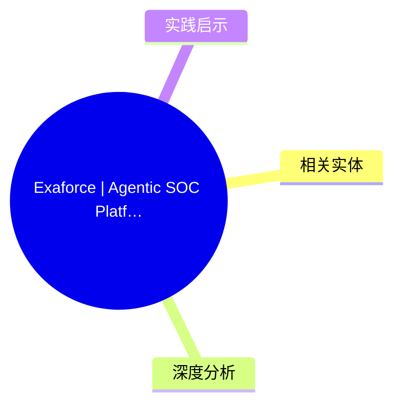
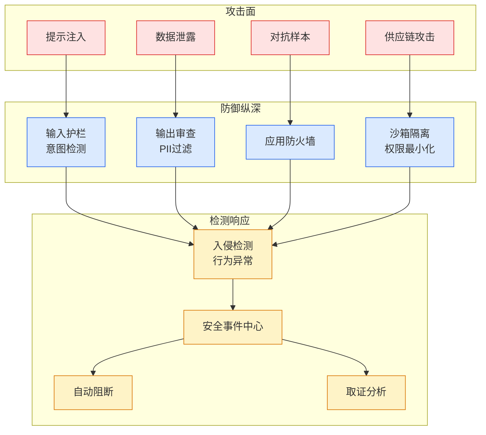

# Exaforce | Agentic SOC Platform and MDR

## Ch01.179 Exaforce | Agentic SOC Platform and MDR

> 📊 Level ⭐ | 3.0KB | `entities/exaforceagenticsocplatformandmdr.md`

## 概念导图

## 核心要点
- AI/ML 技术文章
- 技术分析和方法论
→ [原文存档](https://github.com/QianJinGuo/wiki-book/tree/main/docs/raw/articles/exaforceagenticsocplatformandmdr.md)

## 相关实体

> [主题导航](https://github.com/QianJinGuo/wiki/blob/main/moc/cybersecurity-privacy.md)

- [Exaforce | Agentic SOC Platform and MDR](../ch04/024-exaforce-agentic-soc-platform-and-mdr.html)
- [Versa takes aim at fragmented enterprise security with CSPM, orchestration update, and AI agent controls](ch01/223-rag.html)
- [We Tested DeepSeek V4 Pro and Flash Against Claude Opus 4.7](ch01/1091-deepseek.html)

## 深度分析
Exaforce 的两大运营模式——**自运营（Platform）** 和 **托管运营（MDR）**——代表了安全运营的两种主流需求：控制权 vs 省心力。前者适合有成熟安全团队的大型企业，后者让中小企业也能获得顶级 SOC 能力。相同架构、相同 Exabots、相同结果，只是运营责任转移。
值得注意的是 Exaforce 与传统 MSSP 的本质区别。传统 MSSP 需要大量人工监督，而 Exaforce MDR 实现全自动 AI 驱动调查和升级。这意味着从"人+工具"到"AI+人审阅"的范式转移，安全团队的角色从执行者转变为监督者和决策者。
客户案例中有个细节值得深挖：Fuze 通过 Exaforce 发现跨数据源关联的威胁模式，这是传统 SIEM 难以实现的能力——单一数据源的告警往往不足以揭示完整攻击链，而跨源的关联分析才能发现隐藏模式。
NTT Data 评价 Exaforce 的多模型 AI 方法在业内是独特的，能显著减少误报和调查时间。这进一步验证了专用模型架构相比通用 LLM 在安全运营中的优越性。

## 实践启示
1. **选择 MDR 时关注透明度**：好的 MDR 不应是黑箱，Exaforce MDR 让客户保持对平台的完全访问权。警惕那些"交钥匙"但毫无可见度的托管服务。
2. **自建 vs 托管的决策标准**：若团队已有安全工程师但面临告警过载，选 Platform 自运营；若需从零建立 SOC 能力，选 MDR。
3. **跨数据源关联是检测能力关键**：在评估 SOC 平台时，关注其跨云、跨 SaaS、跨身份认证的关联分析能力，而非仅仅是数据收集能力。
4. **investigation time 是核心指标**：从"数小时到分钟"的调查时间压缩直接转化为威胁驻留时间的缩短，这是衡量 SOC 平台价值的黄金指标。
5. **关注自动化覆盖范围**：Exaforce 报告 6+ FTEs 时间每月回收，这意味着团队可以将精力集中在真正的战略威胁上。

---

