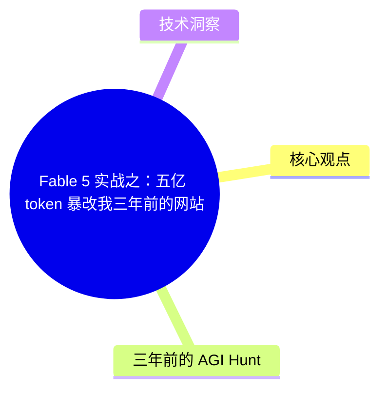
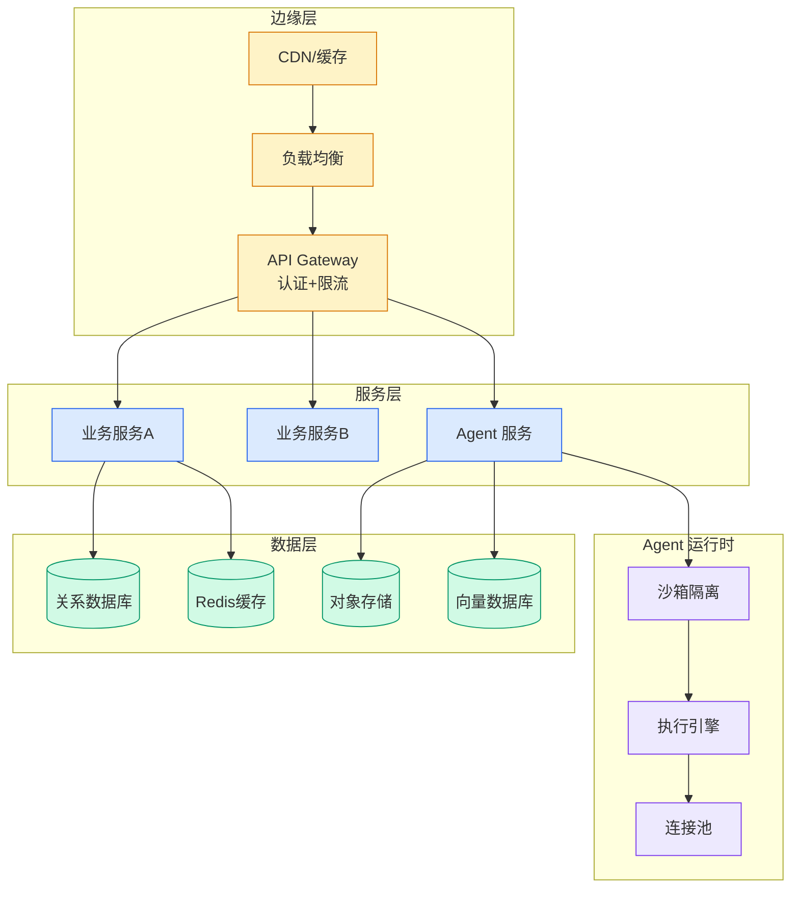

# Fable 5 实战之：五亿 token 暴改我三年前的网站

## Ch01.180 Fable 5 实战之：五亿 token 暴改我三年前的网站

> 📊 Level ⭐ | 3.0KB | `entities/fable-5-实战之五亿-token-暴改我三年前的网站.md`

# Fable 5 实战之：五亿 token 暴改我三年前的网站

大家好，我是 John。

[昨天的文章](<https://mp.weixin.qq.com/s?__biz=MzA4NzgzMjA4MQ==&mid=2453486370&idx=1&sn=a14c3dd3cccc067fa915131eaa3752ac&scene=21#wechat_redirect>)介绍了 Anthropic 工程师 Thariq 的 Fable 5 实战指南，核心观点是：**Fable 5 的能力上限，取决于你能发现多少自己还不知道的东西。

## 概念导图

## 核心观点

> 本文通过article、llm、anthropic视角，分析了的AI/ML技术动态。

大家好，我是 John。

[昨天的文章](<https://mp.weixin.qq.com/s?__biz=MzA4NzgzMjA4MQ==&mid=2453486370&idx=1&sn=a14c3dd3cccc067fa915131eaa3752ac&scene=21#wechat_redirect>)介绍了 Anthropic 工程师 Thariq 的 Fable 5 实战指南，核心观点是：**Fable 5 的能力上限，取决于你能发现多少自己还不知道的东西。**

因为上周的工作日实在是有些太忙，而本周末也是 Fable 脱离订阅套餐前的（可能）最后一个周末，所以我也是刻意把 Fable 5 的额度留到了周末，决定要好好干上几件事来压榨一下它。

这其中的一件事，就是把一个我三年前开发的、基本上每天都会用的网站的前端来开刀大改版。（当时觉得搞的还行啊，但怎么现在越来越觉得难看了……  

01

## 三年前的 AGI Hunt

这个网站叫 AGI Hunt（没错，我公众号的同名网站），网址是：

https://i.agihunt.info/feeds/ai/2026-07-05/zh （为什么是这个奇怪的链接不是纯域名，下面会讲，因为有个 bug……）

它是我在 ChatGPT 刚出来那会儿做的了，到现在其实已经三年多了（时间过得真快）。

旧版首页

其实现在都还有些 bug，比如你直接访问 https://i.agihunt.info/ 是会报错的，但我也是真的懒，一直没（空）去修……

而当年做这个的原因也非常之简单：

ChatGPT 出来之后，每天的消息都快爆炸了，到处都是标题党、震惊体……，而且信息很乱，完全没有个好的顺序、章法和体系。同时信息源也太杂了，X、Reddit、HF、各种博客和论文……根本看不过来。。。

所以我觉得我需要一个每...

## 技术洞察

本文的核心技术价值在于：
- 大家好，我是 John。

[昨天的文章](<https://mp.weixin.qq.com/s?__biz=MzA4NzgzMjA4MQ==&mid=2453486370&idx=1&sn=a14...

→ [原文存档](https://github.com/QianJinGuo/wiki-book/tree/main/docs/raw/articles/fable-5-实战之五亿-token-暴改我三年前的网站.md)

---
## 关联
- 相关概念: [Harness Engineering](https://github.com/QianJinGuo/wiki/blob/main/concepts/harness-engineering-framework.md)
- 相关: [Agent 架构](https://github.com/QianJinGuo/wiki/blob/main/concepts/agent-architecture.md)

---

