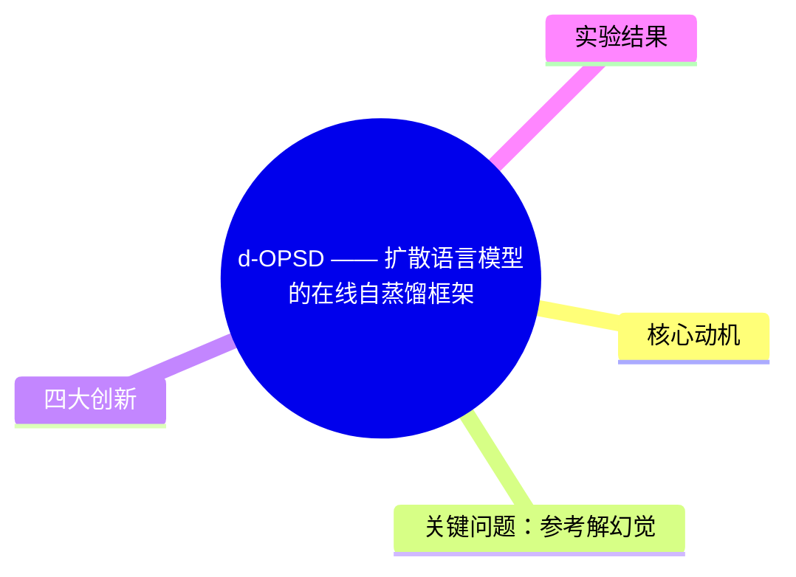
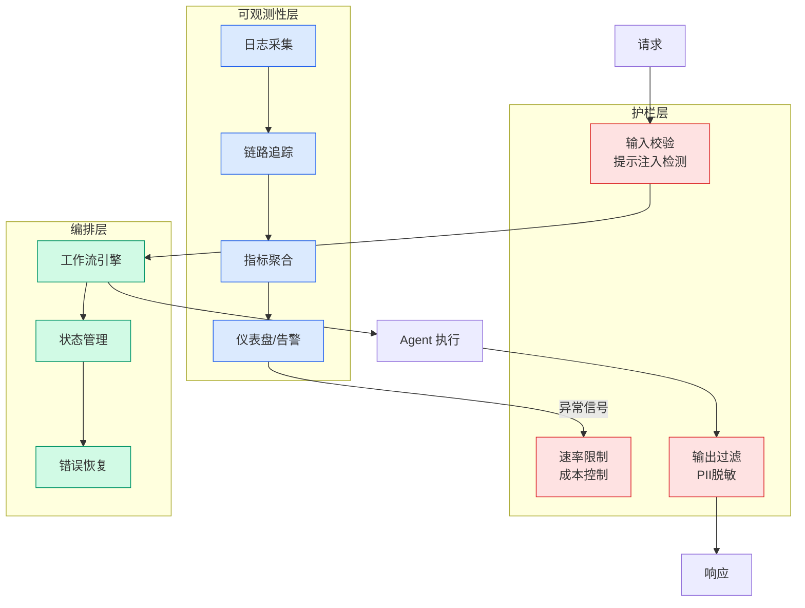

# d-OPSD —— 扩散语言模型的在线自蒸馏框架

## Ch01.181 d-OPSD —— 扩散语言模型的在线自蒸馏框架

> 📊 Level ⭐ | 3.0KB | `entities/d-opsd-diffusion-llm-on-policy-self-distillation.md`

# d-OPSD —— 扩散语言模型的在线自蒸馏框架

d-OPSD（On-policy Self-distillation for Diffusion LLMs）是由马普所联合清华大学提出的第一个针对扩散语言模型（dLLMs）的在线自蒸馏（OPSD）学习范式。

## 概念导图

## 核心动机

在线自蒸馏（OPSD）作为新兴后训练手段，凭借密集监督信号的优势，展现出超越RL的后训练效果和远超RL的训练效率。但对于扩散大语言模型（dLLMs），OPSD此前仍是空白。

## 关键问题：参考解幻觉

现有自回归LLM的OPSD采用将参考解作为特权信息加入教师模型prompt的范式，这会产生"参考解幻觉"——学生模型在蒸馏学习中默认"参考解"存在，无法给出正确答案。

## 四大创新

1. **教师模型重构**：让学生模型先在线采样，将学生的自我"未来"（self-future）随机保留，反馈给教师模型作为特权信息，彻底摆脱参考解注入的范式。

2. **全On-policy机制**：特权信息也完全由学生模型生成，而非传统的Off-policy静态参考解。

3. **Step级监督**：针对dLLMs迭代解码特性，监督层级从token升至step，提供更精准的密集监督信号。

4. **最优"教师-学生"差异**：教师恰好拥有学生不会的新知识，又能和学生拥有相当的共同语言，避免了传统范式下overlap过大的问题。

## 实验结果

在四个数学推理benchmark上，d-OPSD在大部分任务上展现更好的推理表现。训练效率远超RL：RL需上千步收敛，d-OPSD仅需数百步（约1/10）。全面优于传统"参考解注入"OPSD范式。

## 参考资料

- 论文：Learning from the Self-future: On-policy Self-distillation for dLLMs, <https://arxiv.org/abs/2606.18195>
- 代码：<https://github.com/xingzhejun/d-OPSD>
- → [原文存档](https://github.com/QianJinGuo/wiki-book/tree/main/docs/raw/articles/d-opsd-第一个针对扩散语言模型的在线自蒸馏学习.md)

---
## 关联
- 相关概念: [Harness Engineering](https://github.com/QianJinGuo/wiki/blob/main/concepts/harness-engineering-framework.md)

---

