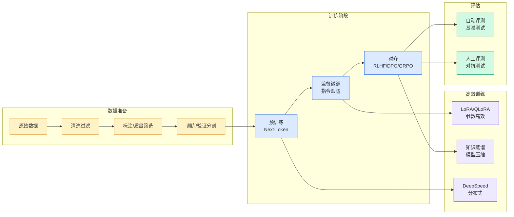

# Learning to Replicate Expert Judgment in Financial Tasks - Thinking Machines Lab

## Ch01.182 Learning to Replicate Expert Judgment in Financial Tasks - Thinking Machines Lab

> 📊 Level ⭐ | 2.9KB | `entities/learning-to-replicate-expert-judgment-in-financial-tasks.md`

# Learning to Replicate Expert Judgment in Financial Tasks - Thinking Machines Lab

With expert-labeled data and fine-tuning on Tinker, a custom model outperforms frontier LLMs on financial information-filtering tasks at a fraction of the cost.

THINKING MACHINES Tinker Connectionism News Join us Home Tinker Connectionism News Join us Learning to Replicate Expert Judgment in Financial Tasks Sarah Su, Kevin Zhu, Emily Xiao, Rohan Alur, Daniel Kang ( Bridgewater AIA Labs ) in collaboration with Thinking Machines Jun 30, 2026 (() => { const loadScript = () => { if (window.__judgmentMapLoading) return; window.__judgmentMapLoading = true; const script = document.createElement('script'); script.src = 'js/judgment-map.js?v=20260629m'; script.async = true; document.head.appendChild(script); }; const figure = document.currentScript.closest('.judgment-map-figure'); if (!figure) return; if ('IntersectionObserver' in window) { const observer = new IntersectionObserver((entries) => { if (!entries.some((entry) => entry.isIntersecting)) return; loadScript(); observer.disconnect(); }, { rootMargin: '220px 0px' }); observer.observe(figure); } else { loadScript(); } })(); Judging information Frontier model performance Training dataset construction Training recipe 1. Interleaved batching 2. CISPO loss with asymmetric clipping 3. On-policy distillation with strong teachers Results Conclusion Citation Judging information Outperforming the market is hard. When every investor has access to the same sources of public information, alpha must come from unique insight built on taste and judgment. A strong investor’s judgment is difficult to articulate and teach directly to others, whether human or AI. It comes from experience. Even when we decompose an investor&rsquo;s job into its simplest constituent tasks, those tasks turn out to be surprisingly difficult for LLMs. In this post, we consider a simple special case: filtering and processing financial documents to surface information relevant to investment decisions. Investors are bombarded with information every day: news articles, research reports, company documents, emails, internal write-ups, and more. Reading is the easy part. The real work is the small, repeated judgments carrie

→ [原文存档](https://github.com/QianJinGuo/wiki-book/tree/main/docs/raw/articles/learning-to-replicate-expert-judgment-in-financial-tasks.md)

---
## 关联

- 相关概念: [Harness Engineering](https://github.com/QianJinGuo/wiki/blob/main/concepts/harness-engineering-framework.md)
- 相关: [Agent 架构](https://github.com/QianJinGuo/wiki/blob/main/concepts/agent-architecture.md)

---

