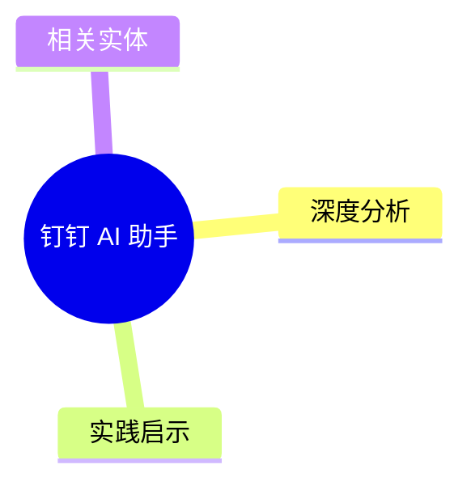
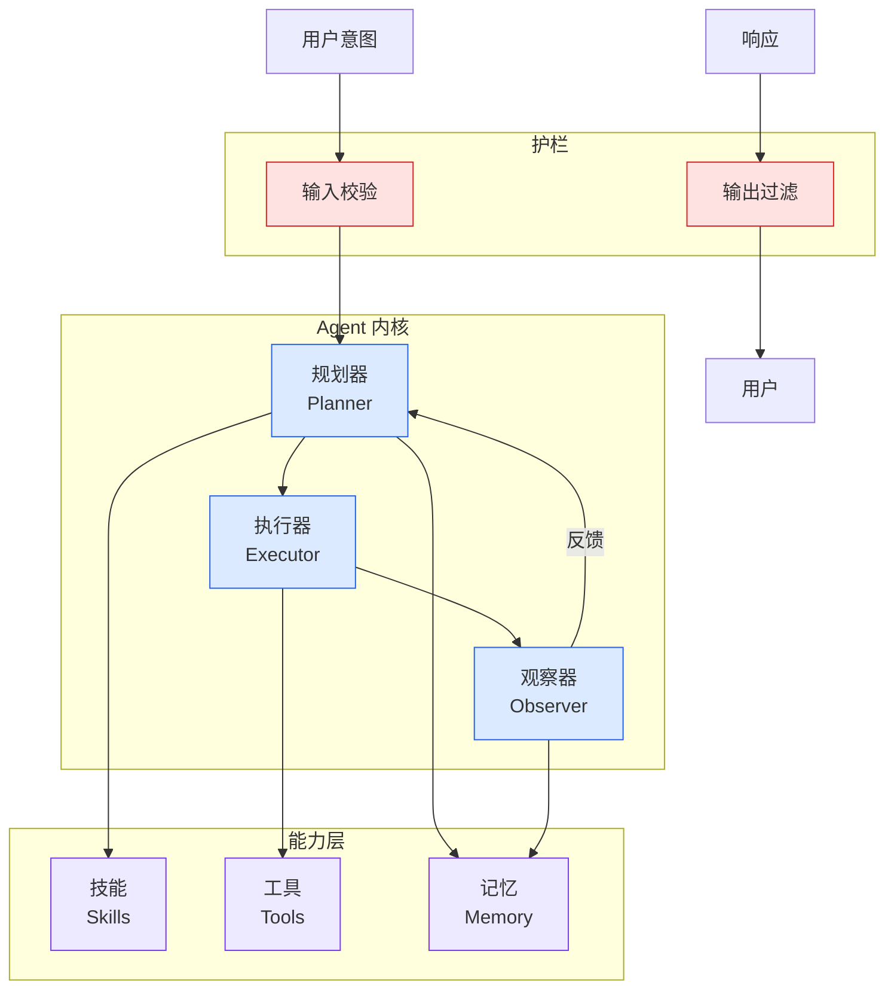

# 钉钉 AI 助手

## Ch01.186 钉钉 AI 助手

> 📊 Level ⭐ | 1.8KB | `entities/dingtalk-ai-assistant.md`

# 钉钉 AI 助手

钉钉平台的 AI 助手能力：集成企业通讯、审批、日程、文档等场景。Agent Harness 在企业协作工具中的落地实践。

## 概念导图

## 深度分析

本页作为知识图谱锚点，连接了以下关键实体：[要实现一个工作流选择-agent-skills-还是-ai-表格](../ch04/397-agent-skills.html)。 相关主题通过 [钉钉 Stream + CLI 代理双引擎 AI 助手架构](../ch05/094-ai.html) 延伸。

> 本页内容将在入库相关溯源素材后进一步深化。

## 实践启示

1. 本领域系统性内容尚待采集——当前知识库在此方向的覆盖密度偏低
2. 建议优先采集 钉钉 AI 助手 相关的一手来源（论文/官方文档/工程博客）
3. 通过交叉链接密度评估本领域的知识图谱成熟度

## 相关实体

- [要实现一个工作流选择-agent-skills-还是-ai-表格](../ch04/397-agent-skills.html)
- [钉钉 Stream + CLI 代理双引擎 AI 助手架构](../ch05/094-ai.html)
- [Nearly every enterprise is investing in AI, but only 5% say their data is ready](ch01/146-nearly-every-enterprise-is-investing-in-ai-but-only-5-say.html)
- [Every AI Subscription Is a Ticking Time Bomb for Enterprise](ch01/1148-every-ai-subscription-is-a-ticking-time-bomb-for-enterprise.html)
- [ScarfBench: Benchmarking AI Agents for Enterprise Java Framework Migration](../ch04/298-ai-agent.html)

---

