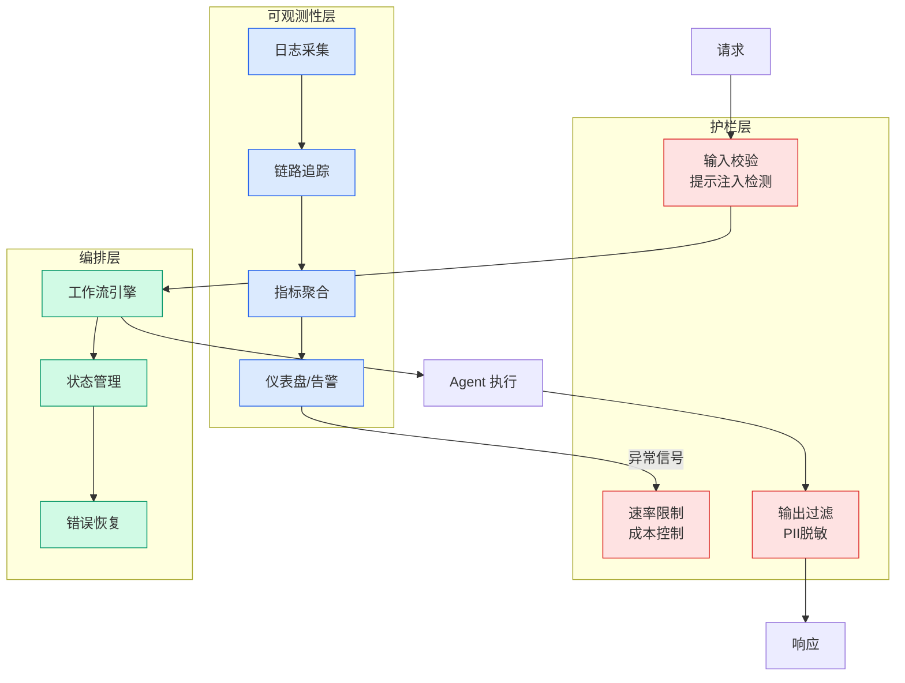

# Kimi K3: The Open-Weights Escalation

## Ch01.497 Kimi K3: The Open-Weights Escalation

> 📊 Level ⭐⭐ | 8.7KB | `entities/kimi-k3-the-open-weights-escalation.md`

# Kimi K3: The Open-Weights Escalation

> **v×c score**: 72 | stars=5
> **来源**: https://www.interconnects.ai/p/kimi-k3-the-open-weights-escalation
> **发布**: Interconnects (2026-07-20)

## Summary

Kimi K3, released by Moonshot AI on July 16, 2026, represents a watershed moment for open-weight AI models. At 2.8 trillion parameters (MoE architecture with 16/896 active experts), it ranks #2 on the Vals AI Index and #3 on Artificial Analysis's Intelligence Index — the strongest open model ever released, trailing only Claude Fable and GPT-5.6 Sol Max. Lambert's analysis examines five implications: China's recommitment to open-source AI (reinforced by Xi Jinping's WAIC keynote), the economic decelerationist effect of open models on frontier labs, China's capital efficiency advantage in model development, the growing ecosystem of frontier open models (including Alibaba's announced Qwen 3.8), and the urgent policy challenge of managing frontier open-weight capabilities.

## Key Points

- **Kimi K3 is the strongest open-weight model ever released**: 2.8T parameter MoE, #2/#3 on major leaderboards, beating all open models and even some closed models like Gemini Flash 3.5 and Grok 4.5. Moonshot AI achieved this with "far, far fewer resources" than American labs.
- **The open-to-closed performance gap has narrowed dramatically**: From the debated 6-9 months to something closer to 3-5 months. This compresses the timeline for policy action on frontier open-weight models.
- **China's strategic commitment to open-source**: Xi Jinping's WAIC keynote directly committed China's AI ecosystem to open-source and global diffusion, signaling that open model releases are official policy — not just a temporary strategy for adoption.
- **China's efficiency advantage is structural**: Chinese labs have raised "orders of magnitude less capital" than American counterparts yet produce competitive models. Architectural innovations like Kimi Delta Attention (KDA) and Attention Residuals (AttnRes) yield ~2.5× improvement in scaling efficiency over Kimi K2.
- **Open models are economically decelerationist for frontier labs**: By reducing margin potential, open models slow the reinvestment cycle and fundraising ability of closed labs — but diffuse AI capabilities more broadly across the economy.

## Deep Analysis

### The Watershed Has Arrived

Lambert's framing of Kimi K3 as a "watershed moment" is carefully chosen. The model does not just demonstrate parity or slight improvement — it fundamentally changes the strategic landscape. Previous open models (DeepSeek R1, GLM-5.2, Qwen 3.7 Max) were competitive but clearly behind the frontier. K3 sits at #2/#3 on major leaderboards, competing with the most expensive closed models from Anthropic and OpenAI. This means the policy debate around "what to do when open models reach frontier capability" is no longer hypothetical — it is the current reality. The six-month clock Lambert wrote about in the companion piece (6 Months to Live for Open Models) just accelerated.

### Capital Efficiency: The Underrated Advantage

One of the most striking findings in Lambert's analysis is the magnitude of China's capital efficiency advantage. Moonshot AI — funded with orders of magnitude less capital than OpenAI or Anthropic — has produced a model that competes head-to-head with the most expensive frontier systems. The article identifies several structural factors: lower researcher compensation, more compute allocated to training (vs. inference), and a focused "catch-up" strategy that is inherently cheaper than "inventing the next paradigm." The architectural innovations (KDA, AttnRes, Stable LatentMoE) suggest this efficiency is not just about cost-cutting but about genuinely better engineering. The implication is sobering for American labs: simply spending more may not be enough to maintain the lead.

### The Open-Closed Dance: Economic Deceleration vs. Capability Diffusion

Lambert surfaces a crucial tension that is often overlooked in the open-vs-closed debate. Strong open-weight models are "decelerationist" for frontier labs — they reduce margins, limit reinvestment, and constrain fundraising. But they are "accelerationist" for AI diffusion across the broader economy — lowering the entry price for intelligence and enabling widespread customization. The question is which effect dominates. Lambert's analysis suggests the former slows the frontier labs while the latter grows the ecosystem, creating a more distributed and resilient AI landscape. However, there is a tipping point: if closed models get too far ahead in raw capabilities, the ability to customize open models becomes moot. K3's achievement is narrowing that gap just when it was threatening to become unbridgeable.

### The Policy Trilemma

K3 lands at the intersection of three policy problems that are now impossible to separate: a) distillation regulation (the claim that Chinese models depend on adversarial distillation from U.S. frontier models), b) open-weight capability thresholds (what to ban or control), and c) the geopolitical dimension (U.S.-China competition). The model's strength effectively proves that Chinese labs can build frontier models without relying on adversarial distillation, which undercuts the foundation of the distillation regulation argument. But it simultaneously makes the case for open-weight capability controls more urgent, since a truly capable open model now exists in the wild. The tension is that these two policy responses point in opposite directions — one would restrict Chinese models, the other would restrict all capable open models regardless of origin.

### The New World Order of Model Rankings

Lambert's ranking of labs by peak model performance is revealing:

1. Anthropic — Claude Fable 5
2. OpenAI — GPT-5.6 Sol
3. Moonshot AI — Kimi K3 (open weights)
4. SpaceXAI — Grok 4.5
5. Zhipu — GLM 5.2 (open weights)
6. Meta — Muse Spark 1.1
7. DeepMind — Gemini Flash 3.5
8. Alibaba — Qwen 3.7 Max

The positioning of DeepMind at #7 and the concentration of Chinese labs in positions 3, 5, and 8 (with Qwen 3.8 announced) is a structural shift. The U.S. no longer has a monopoly on frontier AI development, and the open-weight ecosystem is now the primary vector for non-U.S. AI leadership. This has profound implications for everything from talent strategy to export controls.

## Practical Insights

1. **Re-evaluate model procurement strategy**: With K3 available as open weights and Qwen 3.8 on the horizon, teams should benchmark these models against their use cases. The cost-performance ratio of open frontier models is now dramatically better than just a few months ago.
2. **Prepare for geopolitical bifurcation**: If U.S. restrictions on Chinese open models materialize, teams need fallback plans. The key metric to track is whether the Commerce Department adds Chinese AI labs to the Entity List.
3. **Monitor architectural convergence**: KDA and Gated DeltaNet are going from academic papers to frontier-scale models within 18 months. Teams building inference infrastructure should prepare for hybrid architectures (attention + state-space) becoming the norm.
4. **Track the open-model release cadence**: Alibaba's announcement of Qwen 3.8 (2.4T parameters, open weights) and potential DeepSeek V4 graduation from preview suggest the pace of open model releases is accelerating, not slowing.
5. **Factor model diffusion into safety planning**: With frontier-capable open weights now a reality, safety strategies that depend on controlling access need to be supplemented with robustness strategies that work in a world where capable models are widely available.

## Related Entities

- [6 Months To Live For Open Models](ch01/1351-6-months-to-live-for-open-models.html) — Companion piece on the regulatory timeline that K3's release accelerates
- [Kimi K3这是 Deepseek 20 时刻](ch01/1091-deepseek.html) — Chinese-language analysis of K3's significance

→ [原文存档](https://github.com/QianJinGuo/wiki-book/tree/main/docs/raw/articles/kimi-k3-the-open-weights-escalation.md)

---

