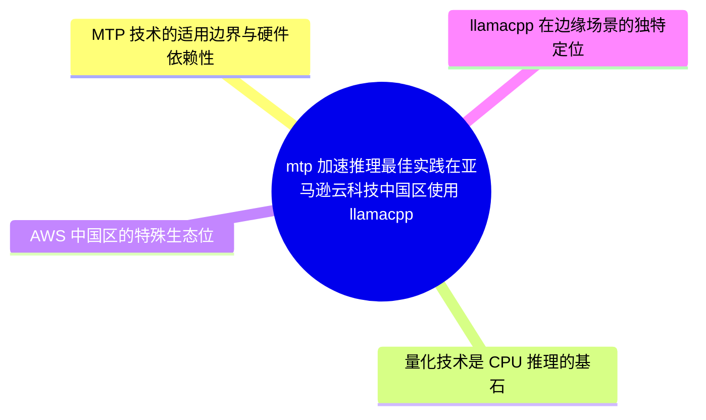
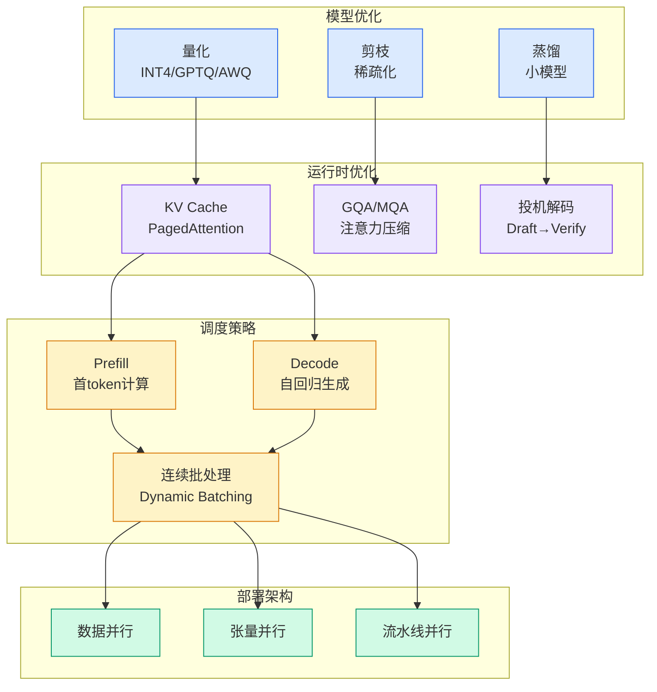

# mtp 加速推理最佳实践在亚马逊云科技中国区使用 llamacpp 部署 qwen36 的实测指南

## Ch01.528 mtp 加速推理最佳实践在亚马逊云科技中国区使用 llamacpp 部署 qwen36 的实测指南

> 📊 Level ⭐⭐ | 8.3KB | `entities/mtp-加速推理最佳实践在亚马逊云科技中国区使用-llamacpp-部署-qwen36-的实测指南.md`

# MTP 加速推理最佳实践：在亚马逊云科技中国区使用 llama.cpp 部署 Qwen3.6 的实测指南

> **v×c = 72**，来自 rss 频道。

## 概念导图

## 摘要

本文在亚马逊云科技中国区（宁夏）使用 llama.cpp 部署 Qwen3.6 系列大语言模型（27B Dense 和 35B-A3B MoE），对比了 Graviton4 ARM CPU、Intel x86 CPU 和 NVIDIA A10G GPU 三种硬件平台上 MTP (Multi-Token Prediction) 投机解码的实际加速效果，并给出了各芯片架构下的部署最佳实践。

## 核心要点

- **MTP 加速在 GPU 上效果显著（+83%），但在 CPU 上反而降速（-18% ~ -40%）**：GPU 并行计算使 draft token 验证几乎"免费"；CPU 串行执行的每个验证都有实际计算开销，抵消了 acceptance 的节省
- **Graviton4 ARM 比 Intel x86 快 1.86x ~ 2.34x**：LLM 推理是 memory-bandwidth-bound 任务，Graviton4 的 DDR5-5600 + ARM SVE/MMLA 指令优化优势巨大
- **MoE 模型是 CPU 部署的关键**：35B-A3B MoE（激活参数仅 ~3B）在 CPU 上比 27B Dense 快 3.7x ~ 4.6x
- **CPU 方案可达 GPU 82% 的性能**：c8g.4xlarge + 35B MoE (无 MTP) = 39.34 tok/s，vs g5.xlarge + 27B Dense + MTP = 47.89 tok/s
- **成本优势显著**：CPU 方案的 RI 月成本仅 ¥756（GPU 方案 ¥2,852），单位 token 成本 ¥7.41/百万 tokens（GPU ¥22.98/百万 tokens）

## 深度分析

### 1. MTP 技术的适用边界与硬件依赖性

MTP (Multi-Token Prediction) 是一种内置于模型的投机解码技术，与传统 Speculative Decoding 需要额外 draft 模型不同，MTP 模型自带预测头（MTP head），在推理时同时预测多个候选 token，再由主模型在一次 forward pass 中验证。

本次实测最关键的一个发现是：**MTP 的性能收益完全取决于硬件架构**。在 GPU (A10G) 上 +83% 的显著加速，验证了 MTP 作为 GPU 推理加速技术的巨大价值——GPU 的并行计算能力使得 batch verify 的边际成本接近零。然而在 CPU 平台上，尽管 Draft Acceptance Rate 高达 80-85%，MTP 反而导致性能下降 18-40%。这是因为 CPU 串行执行每个 draft token 的 verify 都有实际计算开销，draft 验证的额外成本超过了 acceptance 所带来的 token 节省。

这一发现具有重要的实践意义：**推理加速方案的选择不能仅看加速技术本身的理论优势，必须与实际硬件平台匹配**。同样的 MTP 技术在 GPU 和 CPU 上的表现截然相反，提醒我们在选择推理优化策略时需要做硬件感知的决策。

### 2. 量化技术是 CPU 推理的基石

GGUF 量化（Q4_K_M）是本方案的核心使能技术。通过将模型权重从 FP16 压缩到 Q4 低比特格式，Qwen3.6-27B 从 FP16 的 ~54GB 降至 ~16GB，使得原本需要高端 GPU 才能部署的模型可以在普通 CPU 实例上运行。

量化与模型架构选择之间存在协同效应：选择 MoE 架构（35B-A3B，激活参数仅 ~3B）进一步降低了对内存带宽的需求，使得即使在 CPU 上也能获得有实际可用性的推理速度（39 tok/s）。这表明，**对于 CPU 推理场景，"更聪明的架构 + 量化"比"更大的模型 + 全精度"更具实用性**。

### 3. AWS 中国区的特殊生态位

在 AWS 中国区，Bedrock 等托管 AI 服务尚未落地，GPU 实例昂贵且可能存在配额限制。这一独特困境催生了 CPU 推理方案的实际需求。Graviton4 (C8g) 实例的性价比优势在此背景下尤为突出：以 GPU 方案 26% 的成本获得 82% 的性能，同时避免了 GPU 配额的限制。

这反映出一个更广泛的趋势：**在 AI 基础设施受限的区域或场景中，CPU 推理正成为一个切实可行的补充方案**，尤其是在 latency-sensitive 但 throughput 要求不那么极致的应用场景（如对话机器人、内容生成辅助等）中。

### 4. llama.cpp 在边缘场景的独特定位

llama.cpp 与 vLLM 的对比揭示了两种不同的设计哲学。vLLM 专为企业级高并发 GPU 集群设计，PagedAttention + 连续批处理在 multi-user 场景下表现优异；而 llama.cpp 则专注于极致的轻量化、跨平台兼容性和量化生态成熟度。

在 AWS 中国区 CPU 实例自建场景下，llama.cpp 的纯 C/C++ 实现（无需 PyTorch/CUDA 依赖）和成熟的 GGUF 量化生态使其成为**最优选择**。这也意味着在边缘计算、物联网设备终端等资源受限场景中，llama.cpp 可能有更大的发挥空间。

### 5. 模型选择与推理路径的决策树框架

本文提出的方案选型决策树（"是否有 GPU 配额？→ 是否需要最高性价比？"）是一个简洁而实用的框架。它基于两个关键问题进行逻辑分支，将硬件约束（GPU 可用性）和业务需求（成本优化 vs 性能最大化）作为核心决策变量，最终导向明确的技术方案。

这一框架对于组织内部的推理基础设施选型具有参考价值——**将技术决策从"哪种加速技术最好"转变为"在给定约束下哪种组合最优"**，更贴近实际生产环境中的决策逻辑。

## 实践启示

1. **GPU 部署务必开启 MTP，CPU 部署务必关闭 MTP**：这是本次实测最明确的结论。MTP 不是"开盒即用"的加速方案，需要根据硬件平台做差异化配置。

2. **MoE 模型是 CPU 部署的首选**：35B-A3B MoE 在 CPU 上的推理速度（39 tok/s）已接近可用水平。在评估 CPU 推理方案时，建议优先选择 MoE 架构模型而非 Dense 模型。

3. **GGUF Q4_K_M 量化为性价比最优选择**：在模型质量（perplexity）和推理速度之间取得了良好的平衡，是 CPU 推理场景的默认推荐量化等级。

4. **Graviton4 优于 x86 用于 LLM 推理**：c8g 实例相比 c8i 实例在 LLM 推理场景下具有 1.86x-2.34x 的性能优势，成本还更低。在中国区自建 LLM 部署时，应优先选择 Graviton 实例。

5. **生产环境推荐 SageMaker BYOC 或 EKS**：本文测试采用 EC2 + Docker 的方式，但生产环境建议使用 SageMaker Endpoint (BYOC) 或 EKS 以获得更好的运维能力和弹性伸缩。

6. **成本估算需考虑实际利用率**：本文的单位 token 成本基于 100% 利用率估算。实际利用率低于 100% 时，单位 token 成本相应倍增。在规划部署时需充分考虑实际业务负载模式。

## 相关实体

- [llama.cpp 部署](../ch11/294-llama-cpp-deployment.html) — llama.cpp 推理引擎的部署实践和性能优化
- [Graviton 推理](https://github.com/QianJinGuo/wiki/blob/main/entities/graviton-inference.md) — AWS Graviton 处理器上的 LLM 推理优化
- [MoE 架构](ch01/1213-moe-architecture.html) — Mixture-of-Experts 模型架构的原理和优势
- [量化技术](https://github.com/QianJinGuo/wiki/blob/main/entities/quantization-techniques.md) — 模型量化方法及其对推理性能的影响
- [投机解码](ch01/1016-spec.html) — Speculative Decoding 与 MTP 的技术对比
- [Harness Engineering](https://github.com/QianJinGuo/wiki/blob/main/concepts/harness-engineering-framework.md) — AI 推理基础设施的工程化实践框架

→ [原文存档](https://github.com/QianJinGuo/wiki-book/tree/main/docs/raw/articles/mtp-加速推理最佳实践在亚马逊云科技中国区使用-llamacpp-部署-qwen36-的实测指南.md)

---

