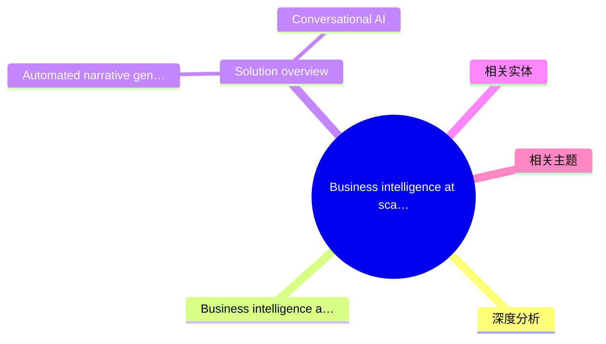
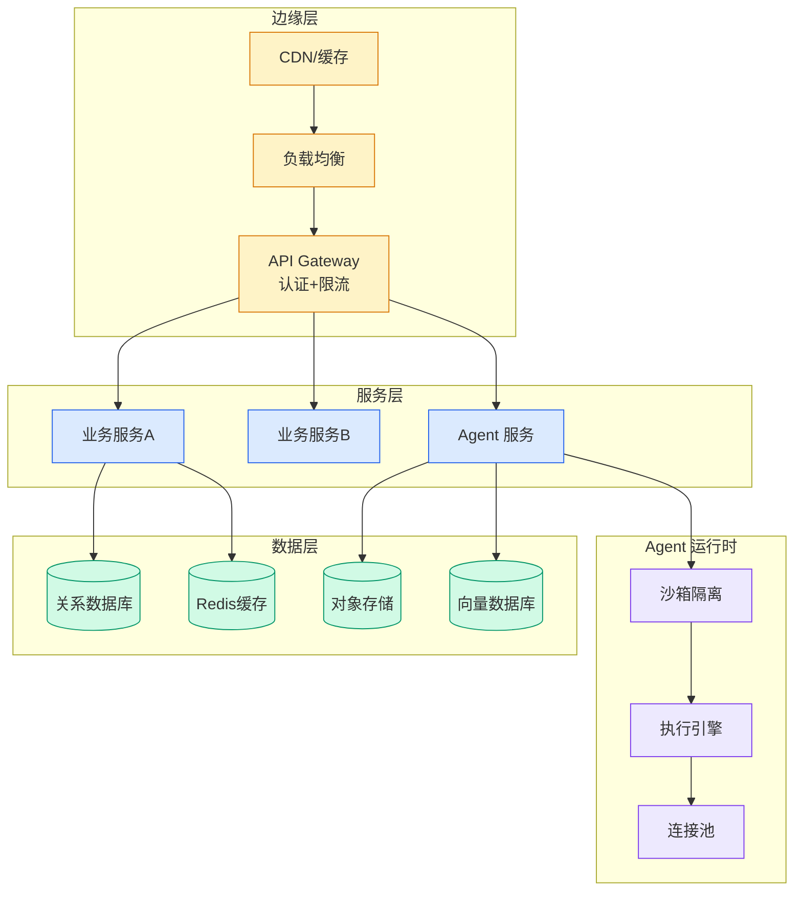

# Business intelligence at scale: Key obstacles

## Ch01.699 Business intelligence at scale: Key obstacles

> 📊 Level ⭐⭐ | 6.8KB | `entities/how-aws-smgs-uses-an-ai-powered-conversational-assistant-to-.md`

# Business intelligence at scale: Key obstacles

## 概念导图

## 深度分析

---
source: rss
source_url: https://aws.amazon.com/blogs/machine-learning/how-aws-smgs-uses-an-ai-powered-conversational-assistant-to-transform-business-management-with-amazon-bedrock-agentcore/
ingested: 2026-05-28
feed_name: AWS China ML
source_published: 2026-05-27T18:51:45Z
---

# How AWS SMGS uses an AI-powered conversational assistant to transform business management with Amazon Bedrock AgentCore

 

AWS leaders manage complex data across multiple hierarchies while making time-sensitive decisions that impact global operations. Traditional business intelligence relies on static dashboards and manual reports, which creates delays and limits organizational agility.

NarrateAI, our intelligent conversational solution, addresses this through conversational agentic AI powered by our data lake and [**Amazon Bedrock AgentCore**](https://aws.amazon.com/bedrock/agentcore/). Accessible through the **[Amazon Quick](https://aws.amazon.com/quick/)** conversational interface, NarrateAI delivers on-demand, context-rich business intelligence to leaders across AWS, from the Chief Executive Officer (CEO) to the field. By answering natural language questions about business performance, NarrateAI provides immediate, accurate, and actionable insights that remove barriers between leaders and their data.

In this post, we share how we built NarrateAI using **Amazon Bedrock AgentCore** to deliver business intelligence at scale for the AWS SMGS (Sales, Marketing and Global Services) organization. You will learn about:

*   The two-layer architecture that separates batch processing from real-time interaction.
*   The specialized AI agents that power intelligent routing and validation.
*   Key engineering patterns for production deployment.
*   How to build similar solutions with AWS services.

## Business intelligence at scale: Key obstacles

AWS faced challenges that limited the effectiveness of traditional business intelligence approaches:

**Time-intensive preparation**: AWS leaders traditionally lost hours gathering data manually before business reviews. The preparation process involved navigating multiple dashboards, reconciling data across disparate sources, and manually synthesizing insights, leaving little time for strategic reasoning and decision-making.

**Data fragmentation**: Business insights were scattered across multiple systems and dashboards, requiring leaders to piece together a coherent narrative from fragmented data sources. This fragmentation created inconsistencies in metrics and made it difficult to maintain a unified view of business performance across hierarchies and datasets.

**Limited accessibility**: Complex dashboards required specialized knowledge to navigate effectively, creating dependencies on intermediary reporting teams. Leaders could not access insights on-demand and instead had to wait for curated reports, which delayed critical business decisions and limited organizational agility.

## Solution overview

NarrateAI addresses the challenge of making complex business data conversational through a two-layer architecture: batch narrative generation and real-time interaction. This separation supports comprehensive data processing upfront while delivering instant, contextually accurate responses through natural conversation.

Amazon Bedrock AgentCore removed the need to build custom orchestration infrastructure, providing serverless architecture, built-in authentication, memory management, and integration with foundation models. This accelerated our deployment from months to weeks while maintaining production-quality observability and security through native [Amazon CloudWatch](https://aws.amazon.com/cloudwatch/) integration and automated session management.

### Automated narrative generation layer (batch processing)

NarrateAI batch-generates comprehensive persona-based narratives for each user through a three-stage pipeline:

1.  **Data extraction** — Configuration-driven Structured Query Language (SQL) templates (parameterized queries that adapt to each user’s role and permissions) extract structured data from [Amazon Redshift](https://aws.amazon.com/redshift/). These templates support multi-level breakdowns and time series analysis while enforcing user-specific access controls.
2.  **Data transformation** — [AWS Lambda](https://aws.amazon.com/lambda/) transforms the extracted data into structured JavaScript Object Notation (JSON) using section-type logic (objects, arrays, breakdowns, and containers) with field mappings and hierarchical organization.
3.  **Narrative rendering** — Jinja templates (a widely used Python templating engine) render human-readable narratives from the structured data. A hierarchical, business domain-aware chunking strategy handles large datasets efficiently. The system stores each user’s narrative as a text file in [Amazon Simple Storage Service (Amazon S3)](https://aws.amazon.com/s3/), supporting row-level security through full data isolation.

### Conversational AI

## 相关实体
- [滴滴国际化客服质检智能化之路基于 Amazon Bedrock 的多语种多业务线质检实践](../ch11/295-amazon-bedrock.html)
- [Comprehensive Observability For Amazon Sagemaker Ai Llm Infe](ch01/1274-llm.html)
- [Automate Aml Alert Triage With Amazon Quick And Snowflake Co](../ch11/222-amazon-quick.html)
- [对抗 Agent 遗忘Kollab 基于Amazon Bedrock Agentcore 的团队Ai工作空间实践](../ch04/561-amazon-bedrock-agentcore.html)
- [Process Financial Documents Using Amazon Bedrock Data Automa](../ch11/295-amazon-bedrock.html)

→ [原文存档](https://github.com/QianJinGuo/wiki-book/tree/main/docs/raw/articles/how-aws-smgs-uses-an-ai-powered-conversational-assistant-to-.md)

## 相关主题

---

