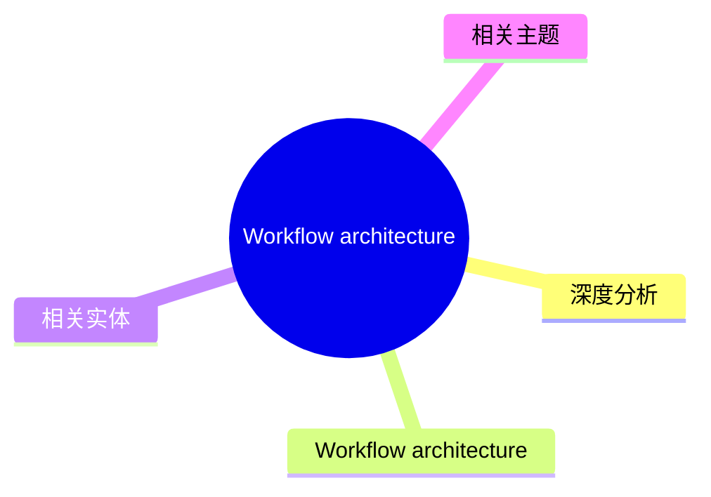
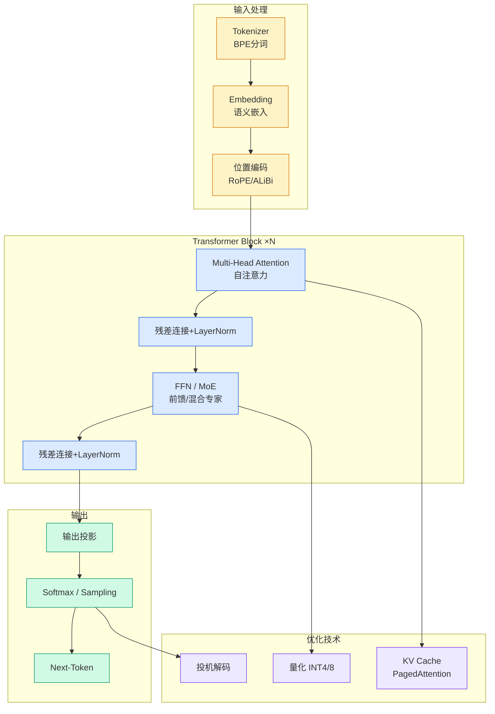

# Workflow architecture

## Ch01.726 Workflow architecture

> 📊 Level ⭐⭐ | 6.6KB | `entities/comprehensive-observability-for-amazon-sagemaker-ai-llm-infe.md`

# Workflow architecture

## 概念导图

## 深度分析

---
source: rss
source_url: https://aws.amazon.com/blogs/machine-learning/comprehensive-observability-for-amazon-sagemaker-ai-llm-inference-from-gpu-utilization-to-llm-quality/
ingested: 2026-05-30
feed_name: AWS China ML
source_published: 2026-05-29T23:36:58Z
---

# Comprehensive observability for Amazon SageMaker AI LLM inference: From GPU utilization to LLM quality

Deploying large language models (LLMs) at scale on [Amazon SageMaker AI Inference](<https://aws.amazon.com/sagemaker/ai/deploy/>) makes observability a critical pillar of any production machine learning (ML) strategy. Unlike conventional software that returns deterministic outputs, LLMs generate variable, free-form responses that are difficult to validate with standard metrics. LLM output quality can change over time as input distributions shift, and quality monitoring helps detect these changes early. For generative AI workloads, observability also includes the model serving infrastructure, where unpredictable token consumption, GPU memory pressure, and latency spikes make capacity planning and cost control a moving target.

A comprehensive observability approach for LLM inference must address two distinct but complementary dimensions: model serving infrastructure (quantity) and LLM quality. Quantity monitoring focuses on the operational health of inference infrastructure, tracking request throughput and resource utilization. These metrics help detect bottlenecks, right-size compute resources, and control costs. Quality monitoring focuses on the performance of the LLMs themselves, evaluating response accuracy, compliance, and consistency over time.

Most teams build LLM observability in stages. The first stage establishes visibility into core operational metrics such as latency, errors, and resource utilization. These signals confirm the reliability of inference endpoints. The next stage adds LLM quality through sampling and evaluation, which surface issues such as model drift, degradation, or unexpected behavior in generated responses.

With both dimensions in place, you can introduce thresholds and automated alerts that combine infrastructure and quality signals. Over time, the practice extends to comparative analysis across models and configurations so you can continuously tune cost, performance, and output quality. Quantity and quality metrics are interdependent: an endpoint can appear operationally healthy while producing poor or unsafe responses, or it can deliver high-quality outputs while running inefficiently on over-provisioned infrastructure. Production-grade LLM observability emerges when both dimensions are monitored, correlated, and optimized together.

This post demonstrates a comprehensive observability solution using [Amazon Managed Grafana](<https://docs.aws.amazon.com/grafana/latest/userguide/what-is-Amazon-Managed-Service-Grafana.html>) dashboards that provides a holistic view of both quality and quantity for LLMs served on Amazon SageMaker AI endpoints with inference components.

## Workflow architecture

For full visibility into LLMs across the two monitoring dimensions of quantity and quality, we built a solution using three core AWS services, each chosen for a specific role in LLM observability. The following high-level data flow diagram shows the three core components: Amazon SageMaker AI endpoints with inference components, Amazon CloudWatch, and Amazon Managed Grafana.

[Amazon SageMaker AI Inference Components](<https://aws.amazon.com/sagemaker/ai/deploy/>) serve as the model hosting layer. A single SageMaker AI endpoint can host multiple inference components, each running a different LLM (for example, `gpt-oss-20b` and `Qwen2.5-7B-Instruct` as shown in the preceding architecture). Inference components let you deploy, scale, and manage multiple models on shared infrastructure while keeping per-model isolation for traffic routing, scaling policies, and metric attribution.

[Amazon CloudWatch](<https://aws.amazon.com/cloudwatch/>) serves as the centralized metrics store. It receives two distinct streams of data from each inference component: enhanced metrics and custom quality metrics. Enhanced metrics are published automatically by SageMaker AI when you enable them on the endpoint configuration. The metrics include instance-level, container-level, and per-GPU dimensions, giving you granular visibility into invocation counts, latency, error rates, and GPU/CPU utilization per model. Enhanced metrics are logged to the `/aws/sagemaker/InferenceComponents/<model-name>` namespace (for example, `/aws/sagemaker/InferenceComponents/gpt-oss-20b`). For details, see the [Amazon SageMaker AI enhanced metrics documentation](<https://docs.aws.amazon.com/sagemaker/latest/dg/monitoring-cloudwatch-enhanced-metrics.html>) and the [enhanced metrics deep-dive blog post](<https://aws.amazon.com/blogs/machine-learning/enhanced-metrics-for-amazon-sagemaker-ai-endpoints-deeper-visibility-for-better-performance/>).

Custom quality metrics c

## 相关实体
- [How Aws Smgs Uses An Ai Powered Conversational Assistant To ](../ch05/094-ai.html)
- [Automate Aml Alert Triage With Amazon Quick And Snowflake Co](../ch11/222-amazon-quick.html)
- [滴滴国际化客服质检智能化之路基于 Amazon Bedrock 的多语种多业务线质检实践](../ch11/295-amazon-bedrock.html)
- [对抗 Agent 遗忘Kollab 基于Amazon Bedrock Agentcore 的团队Ai工作空间实践](../ch04/561-amazon-bedrock-agentcore.html)
- [Process Financial Documents Using Amazon Bedrock Data Automa](../ch11/295-amazon-bedrock.html)

→ [原文存档](https://github.com/QianJinGuo/wiki-book/tree/main/docs/raw/articles/comprehensive-observability-for-amazon-sagemaker-ai-llm-infe.md)

- [MOC](https://github.com/QianJinGuo/wiki/blob/main/moc/observability-monitoring.md)
## 相关主题

---

