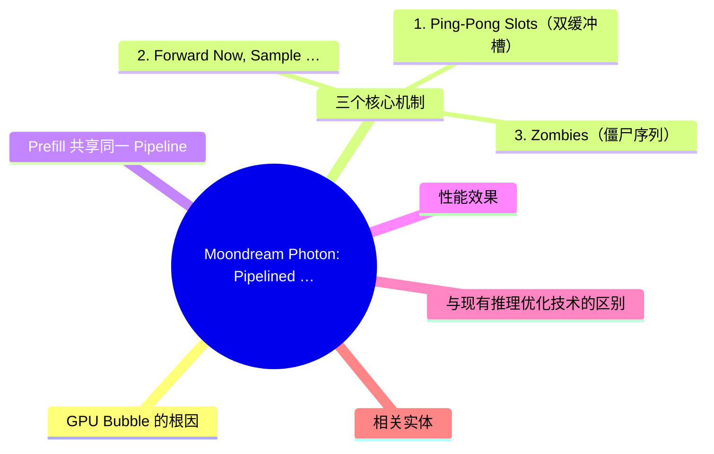
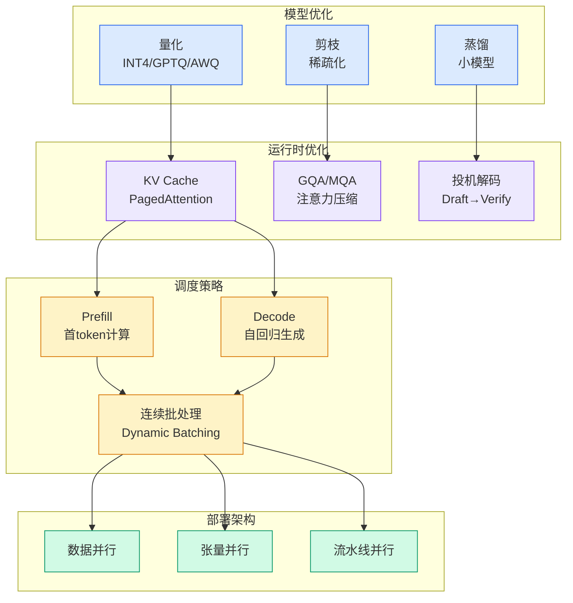

# Moondream Photon: Pipelined Decoding for VLM Inference Optimization

## Ch01.826 Moondream Photon: Pipelined Decoding for VLM Inference Optimization

> 📊 Level ⭐⭐ | 5.7KB | `entities/moondream-photon-pipelined-decoding-gpu-bubble.md`

# Moondream Photon: Pipelined Decoding for VLM Inference Optimization

Moondream 的 Photon 推理引擎通过 **pipelined decoding** 技术消除 GPU bubble（GPU 空转），在 NVIDIA B200 上实现 VLM 推理约 33ms 延迟，decode 吞吐提升高达 35%。这项技术的核心洞察是：当 GPU 等待 CPU 完成 token 提交/规划/启动工作（housekeeping）时，GPU 处于空闲状态，这就是 GPU bubble。Photon 通过重叠 CPU 和 GPU 工作来消除这个气泡。

## 概念导图

## GPU Bubble 的根因

在典型的 autoregressive decode 循环中：GPU 执行大量数学运算产生下一个 token，但 CPU 也要做不少管理工作——选择下一个请求、设置 GPU 所需的元数据、从模型输出中选择实际 token 并记录等。问题是单个 token 的 GPU 工作量很小，而 CPU 的 housekeeping 是每次循环的固定开销。如果 GPU 必须等待 CPU 完成这些工作才能开始下一个 token，GPU 就会在每个循环中部分空闲。

## 三个核心机制

### 1. Ping-Pong Slots（双缓冲槽）

Photon 维护两个 decode slot，交替使用。当 GPU 在 slot A 上执行当前 forward 时，CPU 在处理 slot B 的上一步结果。每个 slot 包含输入暂存区、模型输出区（logits）、采样 token 落地区、以及 KV cache 书签。这些缓冲区在启动时一次性分配，运行时不做 GPU 内存分配以避免设备同步。固定缓冲区地址也允许将 decode 步骤捕获为 CUDA graph 重放，减少 kernel launch 开销。

关键设计：两个 slot 共享同一个 compute stream（非 GPU 并行），但 device-to-host copy 使用独立的 copy stream，使得 GPU 可以忙于下一个 forward 的同时完成上一步结果的回传。

### 2. Forward Now, Sample Later（先算后采）

下一个 forward 不依赖 CPU 对上一个 token 的处理，但采样（sampling）却依赖——特别是 constrained decoding 场景下（Moondream 的空间能力返回结构化输出：point 返回坐标、detect 返回框、segment 返回轮廓），step t+1 的 sampling mask 取决于 step t 采出的 token。

调度 tick 分三个阶段：
1. **Launch**：立即启动 t+1 的 forward（不依赖 mask，立即执行）
2. **Commit**：等待 step t 的 in-flight copy 完成，推进 decode 状态
3. **Finalize**：当前状态确定后，构建 mask 并采样 t+1

这种 "commit-before-finalize" 顺序意味着 GPU 在 commit 阶段已经在运行 t+1 forward，commit 从关键路径消失。

### 3. Zombies（僵尸序列）

当序列在 step t 遇到 stop token 但已经编入 step t+1 的 batch 时——你不能取消已启动的 GPU 工作。Photon 通过两个 per-sequence 字段处理：`finalized`（触发 EOS 后设为 true）和 `inflight_refs`（仍在引用该序列的 in-flight 步骤数）。已 finalize 的序列不会被立即拆除，而是无害地随车同行，直到 `inflight_refs` 归零才释放 KV pages 和 LoRA slot。

## Prefill 共享同一 Pipeline

Photon 不分离 prefill 和 decode pipeline。prefill 只是同一个 two-slot pipeline 中的另一种 `kind="prefill"` launch。昂贵的 prefill forward 在 GPU 上运行时，CPU 可以同时 commit decode 结果；下一个 decode forward 运行时，CPU 可以完成刚注入的 prefill 请求的准入处理。

这对短输出场景（如只生成 3 个 token 的请求）尤为重要——请求几乎全部生命周期都在 prefill 和准入阶段，共享 pipeline 使得 CPU bookkeeping 被重叠掉而非串行化。

## 性能效果

Pipelined decoding 在 Photon 上实现最高 **35% 的 decode 吞吐提升**。技术适用范围广泛：任何有 per-step CPU bookkeeping 的 autoregressive 模型（constrained decoding、调度、流式输出）都能从 CPU/GPU 工作重叠中获益。

## 与现有推理优化技术的区别

Moondream Photon 的 pipelined decoding 与传统的推理优化方法（如 [LLM Inference Pipeline](ch01/1274-llm.html) 中 covered 的 continuous batching、PagedAttention、speculative decoding）的区别在于：它解决的是**CPU-GPU 间同步开销**问题，而非模型计算效率或显存管理问题。Pipelined decoding 可以与这些技术正交组合，产生叠加效果。

## 相关实体
- [LLM Inference Pipeline Internals](ch01/1274-llm.html)
- [MorphLLM Inference Optimization](ch01/1274-llm.html)
- [Tencent Hunyuan Hopper Inference Optimization](ch01/117-hy3-preview.html)
- [LLaVA-OneVision VLM](ch01/817-vlm.html)
- [高德 VLM 生产实践](../ch03/035-agent.html)

→ [原文存档](https://github.com/QianJinGuo/wiki-book/tree/main/docs/raw/articles/moondream-popping-gpu-bubble-photon-engine.md)

---

