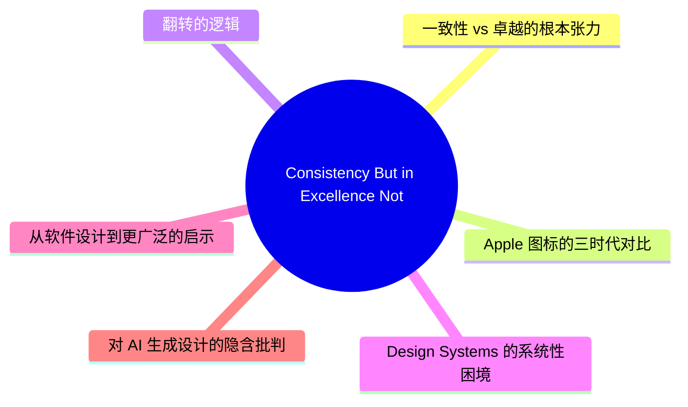
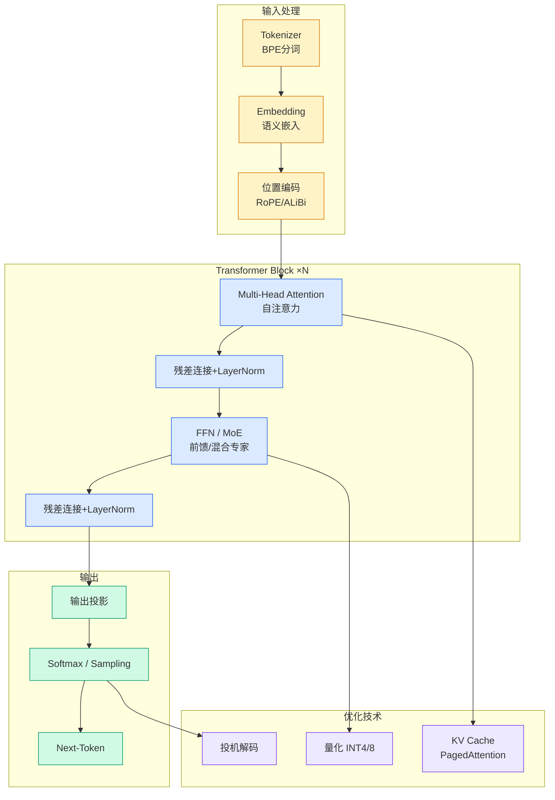

# Consistency, But in Excellence Not Appearance

## Ch01.846 Consistency, But in Excellence Not Appearance

> 📊 Level ⭐⭐ | 5.5KB | `entities/consistency-excellence-jim-nielsen.md`

# Consistency, But in Excellence Not Appearance

> **来源**: [https://blog.jim-nielsen.com/2026/a-consistency-of-excellence/](https://blog.jim-nielsen.com/2026/a-consistency-of-excellence/)

## 概念导图

## 摘要

Jim Nielsen 以 Apple 应用图标的三个时代演变为切入点，提出了一个反直觉的设计命题：过度追求视觉一致性会成为个体卓越的天花板。Original 时代的图标（拟物风格）在彼此之间缺乏视觉统一性，但每一个都是标志性的（iconic）；Creator Studio 时代的图标高度一致——圆角矩形、克制的渐变、简化形式——但没有任何一个是真正标志性的。Nielsen 的核心论点是：如果将卓越作为每个个体元素的目标，卓越本身就成为一致性的母题（motif），这比形状和渐变的一致性更有深度。

## 核心要点

### 一致性 vs 卓越的根本张力

系统设计倾向于制定规则，因为规则最容易文档化、执行和自动化——"所有图标必须使用此形状、此光照、此描边"。而卓越难以系统化，它需要判断力、品味、关怀、经验和对上下文的敏感——这些都服务于意义和目的，而非表面的相似性。

当你追求套件的整体一致性时，个体元素失去了以自身条件变得卓越和标志性的能力。**对群体的一致性成为个体卓越的天花板。**

### Apple 图标的三时代对比

| 时代 | 视觉特征 | 一致性 | 标志性 |
|------|---------|--------|--------|
| Original（拟物） | 3D 风格、真实材质、各自独特的光照 | 低——形态、材质、光照各异 | 高——每个图标都是 iconic 的 |
| Current（扁平） | 扁平/渐变风格 | 中等 | 中等 |
| Creator Studio（统一） | 深色背景、简化的图形符号、紫/蓝/红/绿/橙色系 | 高——圆角、渐变、简化形式高度统一 | 低——typical 而非 iconic |

### 翻转的逻辑

Nielsen 提出的翻转逻辑：

> 如果你反过来，如果卓越是每个个体元素的目标，有趣的事情会发生：卓越成为你一致性的母题。它不再是形状和渐变的一致性，而是品质和意图的一致性——服务于比表面视觉更深层的意义和目的。

## 深度分析

### Design Systems 的系统性困境

Nielsen 的观察触及了当代 design systems 运动的核心悖论。Design systems 的价值主张是通过可复用的组件和明确的规则来提升一致性和效率。但这种系统化思维天然倾向于"可量化的属性"（间距、颜色、圆角），而忽略了"不可量化的品质"（表现力、情感共鸣、文化语境）。

这与 [文档组织](../ch05/094-ai.html) 的讨论有深层共鸣：树状结构（文件夹、分类法）是存储机制而非知识架构；同样，design system 的规则是一致性机制而非卓越机制。

### 从软件设计到更广泛的启示

这一论点的适用范围远超图标设计：

- **代码架构**：过度的架构一致性（"所有微服务必须遵循相同的模式"）可能压制针对特定问题域的最优解
- **写作与内容**：品牌声音指南可以确保一致性，但也可能让内容变得乏味——最好的品牌写作往往在保持核心价值的同时展现出个性
- **组织文化**：过度强调文化契合（culture fit）的企业可能丧失有益的多样性——参见 工程多样性

### 对 AI 生成设计的隐含批判

在 AI 设计工具（如 [Claude Design](ch01/976-claude.html)）兴起的背景下，Nielsen 的论点具有特殊的现实意义。AI 工具天然倾向于生成"typical"的输出——统计意义上的平均值，而非 "iconic" 的个体表达。如果设计系统已经将一致性推向极致，AI 工具则将这一趋势推向了它的逻辑终点。

## 实践启示

- **Design system 团队**：在建立规则的同时，应保留"打破规则"的空间——为设计师提供偏离系统的授权和路径，特别是在品牌标识性元素上
- **产品团队**：评估设计质量时，不应仅衡量一致性（组件复用率、规范符合度），还应衡量单个触点的卓越程度
- **AI 工具设计者**：避免将 AI 训练为"一致性最大器"，而应让它在保持核心规范的同时允许有意义的变异
- **个人创作者**：在系统化工作流中保持对个体卓越的追求——一致性是手段，不是目的

## 相关实体

- [Penpot: Claude Design 不是企业设计的未来](ch01/976-claude.html) — AI 设计工具的局限性
- [文档组织: 为人类和 AI](../ch05/094-ai.html) — 系统化结构 vs 知识发现
- Design Systems — 设计系统的理论与实践

→ [原文存档](https://github.com/QianJinGuo/wiki-book/tree/main/docs/raw/articles/consistency-excellence-jim-nielsen.md)

---

