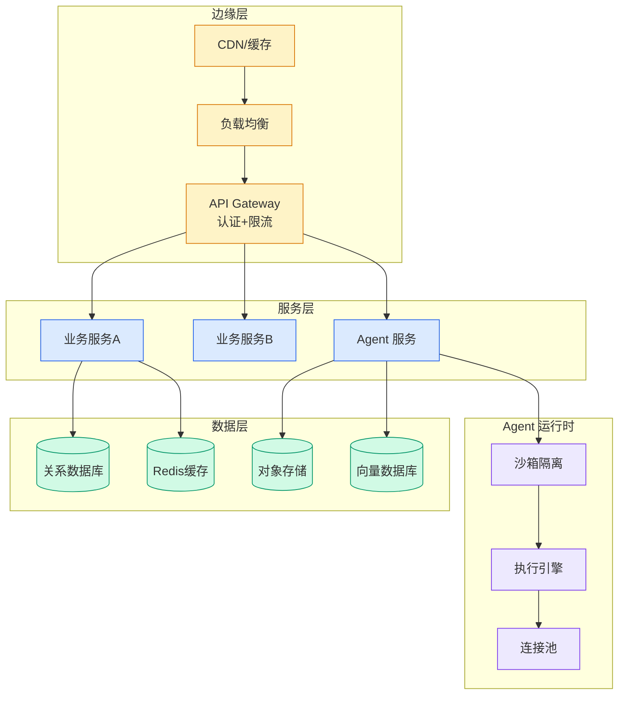

# LLMs are complicated now

## Ch01.887 LLMs are complicated now

> 📊 Level ⭐⭐ | 5.1KB | `entities/llms-are-complicated-now-ianbarber.md`

# LLMs are complicated now

> 原文存档：[原文存档](https://github.com/QianJinGuo/wiki-book/tree/main/docs/raw/articles/llms-are-complicated-now-ianbarber.md)

## 核心内容

Published Time: 2026-06-19T21:39:25+00:00

Markdown Content:
Back in 2022 and 2023 there were two big branches of machine learning happening at Meta[1](http://ianbarber.blog/2026/06/19/llms-are-complicated-now/#2c91a856-5a90-414f-bc85-26d82760c71d). The LLM work that led to Llama was a clean, smooth stack of repeated Transformer modules; the recommendation systems graphs were, by contrast, terrifying. Luckily, the industry has remedied that state of affairs by making LLMs a lot more complicated.

Seb Raschka maintains an excellent [gallery](https://sebastianraschka.com/llm-architecture-gallery/) of model architectures. You can use it to diff two of the best open models of their respective eras, Llama 3 and Nemotron 3 Ultra.

Attention might be all you need, but modern models certainly use a lot of different variants of it: query grouping, compressed, sparse, linear, sliding-window and more. Mixture-of-Experts added selective routing to feed-forward layers, and we have since started routing just about everything else too, from attention blocks to the residual stream. Vision and audio encoders have gone from bolted on to mixed-in, and models have scaled to run at inference time across multiple GPUs, which throws comms ops in that add extra boundaries in the middle of your model.

This is not too different from what happened with recsys. The basic architecture of recommendation systems, for the best part of a decade, was a relatively straightforward two-tower sparse neural net. The complexity came from the tension between the need to continually increase capabilities and the need to stay efficient, particularly for inference.

It’s tempting to assume that agents will Fix This: that you’ll hand your PyTorch or JAX definition to Claude Telenovela or whatever and have it generate optimally fused kernels[2](http://ianbarber.blog/2026/06/19/llms-are-complicated-now/#b106a18d-98b3-4821-a60f-d77f1269ad3b). To make that work you need a fixed, usable baseline to make sure that what is generated is… right.

What happened with recsys was that the gap between performance being an _optimization_ and performance being a _necessity_ became very, very small. Conceptually you can keep a pure model definition that gives you a baseline; in practice, training and testing a model takes significant resources and performance improvements become load-bearing.

If you want to swap attention variant `A` for variant `B`, you can afford for `B` to be ten percent slower. You probably can’t afford for it to be an order-of-magnitude worse. If `A` is fused and optimized, you need at least a _partially_ fused and optimized version of `B` before you can even tell whether it’s worth exploring. The research iteration loop demands a different kind of flexibility than just “optimize this known quantity”. You can’t hand-fuse your way back without investing significant time that might not be worth it, and you can’t generate your way forward without a baseline to check. The only way out is to design for composability up front.

One of my favorite kernel developments of the last few years was [FlexAttention](https://pytorch.org/blog/flexattention/) in PyTorch, which took a whole class of attention operations and allowed you to generate kernels for them, via Triton templates. It built on a huge body of work in attention kernels, and it was designed to be composable and verifiable up front: you can explore with only a very mild impact to performance.

Andrej Karpathy recently joined Anthropic, in part to develop richer auto-research-style loops at the frontier. As he has spent the last few years showing, though, being able to cut architectures to their essence and make them composable is as important as a clever agentic setup in climbing that kind of hill.

1.   And many smaller ones, shout outs to all my Content Understanding and integri

---
## 关联

- 相关概念: [Harness Engineering](https://github.com/QianJinGuo/wiki/blob/main/concepts/harness-engineering-framework.md)

---

