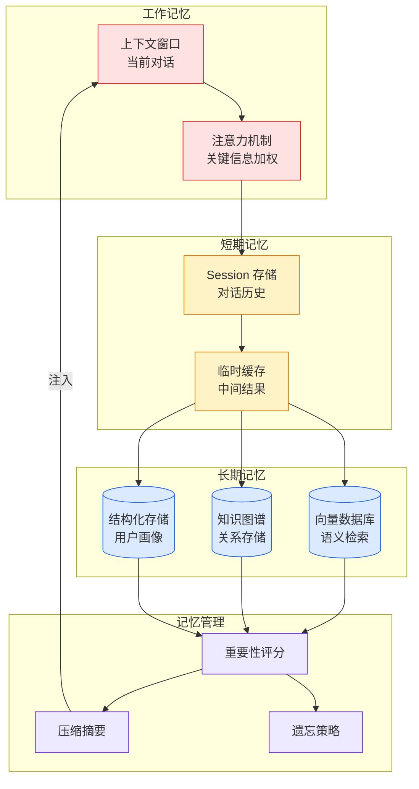

# PersonaVLM: Long-term Personalized Multimodal LLM

## Ch01.889 PersonaVLM: Long-term Personalized Multimodal LLM

> 📊 Level ⭐⭐ | 5.1KB | `entities/personavlm-long-term-personalization.md`

# PersonaVLM: Long-term Personalized Multimodal LLM
|大模型开始"懂你"了！PersonaVLM如何实现长期个性化记忆
来源：PaperWeekly → 数据派THU
当前大模型是"静态系统"，而人是"动态的"。现有方法只依赖当前上下文或简单拼接历史信息，无法跟踪用户动态变化，导致个性化停留在表面。
让模型具备"长期个性化能力"——记忆、推理与对齐三能力协同。

## 相关实体
- [Cong 30 Fen Zhong Shou Gu Agent Dao Harness Cheng Wei Xin Hou Duan](../ch05/009-harness.html)
- [从 30 分钟手搓 Agent到 Harness 成为新后端](../ch05/009-harness.html)
- [Two Harness Papers Microsoft Google](../ch05/009-harness.html)
- [Trace2Skill Trajectory Distillation Agent Skills](../ch04/397-agent-skills.html)
- [05 11 The Great Memory Panic Of 2026](ch01/876-the-great-memory-panic-of-2026.html)

→ [原文存档](https://github.com/QianJinGuo/wiki-book/tree/main/docs/raw/articles/personavlm-long-term-personalization.md)

- [MOC](https://github.com/QianJinGuo/wiki/blob/main/moc/llm-research-frontiers.md)
## 深度分析

**五类记忆分层是认知架构的工程化实现。** PersonaVLM 将心理学经典理论（大五人格）引入 LLM 个性化建模，将记忆划分为性格画像、核心记忆、语义记忆、情景记忆和程序性记忆。这一设计本质上是在模型之外构建了一个**可演进的用户模型（User Model）**，使个性化信息独立于模型权重存在，支持动态更新而不需要重训练 。

**标准 RAG 在偏好理解任务上性能下降 9.3% 的根因是"未加工记忆的噪声"**。这一发现颠覆了"加更多上下文总能帮助"的直觉——当外部记忆未经筛选时，检索会引入干扰项，反而损害模型对用户真实偏好的判断。说明个性化记忆系统必须具备**主动过滤和精炼机制**，而非简单存储检索 。

**情景记忆对整体性能影响最大，程序记忆对"行为"和"关系"任务影响显著。** 这一发现揭示了个性化的不同层次需要不同类型的记忆支撑：情景记忆提供上下文锚点，程序记忆支撑长期行为模式预测。这意味着设计个性化系统时，记忆类型的重要性不是均等的，需要优先保证情景记忆的质量 。

**双阶段协作流（响应阶段 + 更新阶段）实现了"记忆的读写分离"。** 响应阶段专注推理和检索，更新阶段专注记忆精炼和性格演化。这种分离避免了在推理过程中同时进行记忆写入导致的上下文污染，也保证了每次交互结束后系统能及时从对话中提取有价值信息 。

**开源多模态小模型在个性对齐任务表现接近随机，Qwen3 纯语言模型相对优异。** 这表明多模态个性对齐是一个尚未被开源社区充分解决的任务，当前小模型的能力不足以支撑精细的个性化理解。同时也说明纯语言模型在个性对齐上的潜力可能大于多模态模型 —— 多模态信息的引入增加了个性建模的复杂度 。

## 实践启示

**设计个性化系统时，优先实现五类记忆分层结构。** 特别是性格画像和情景记忆的构建——前者提供稳定的个性基准，后者提供动态的上下文检索基础。可以用大五人格量表作为性格画像的初始建模框架 。

**不要盲目使用 RAG 进行个性化记忆检索。** 在将记忆注入模型之前，必须经过筛选和精炼步骤，避免噪声记忆干扰模型判断。参考 PersonaVLM 的更新阶段设计，在每次交互结束后主动对记忆库进行增删改查 。

**构建评测基准时，参考 Persona-MME 的七维框架**（记忆、意图、偏好、行为、关系、成长、对齐），覆盖从基础到高级的个性化能力评估。14 个细粒度任务的设计值得借鉴 。

**如果你的场景需要多模态个性化，先用纯语言模型验证个性对齐逻辑。** 由于开源多模态小模型个性对齐能力不足，可以先用 Qwen3 等纯语言模型快速原型，再考虑多模态扩展 。

**让模型具备"理解用户"而非仅仅"回答问题"的设计目标。** 个性化的真正价值不在于给用户打标签，而在于建立一个持续演化的用户理解过程。每次交互结束后都应该触发性格演变机制和记忆更新 。

→ [原文存档](https://github.com/QianJinGuo/wiki-book/tree/main/docs/raw/articles/personavlm-long-term-personalization.md)

---

