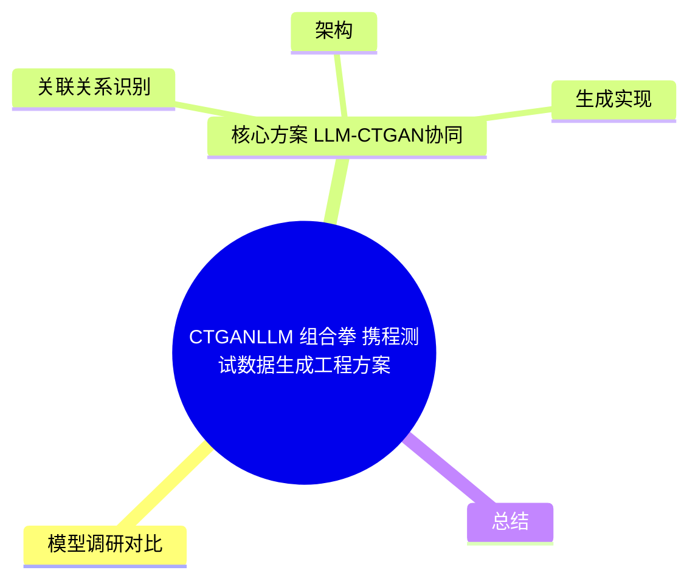
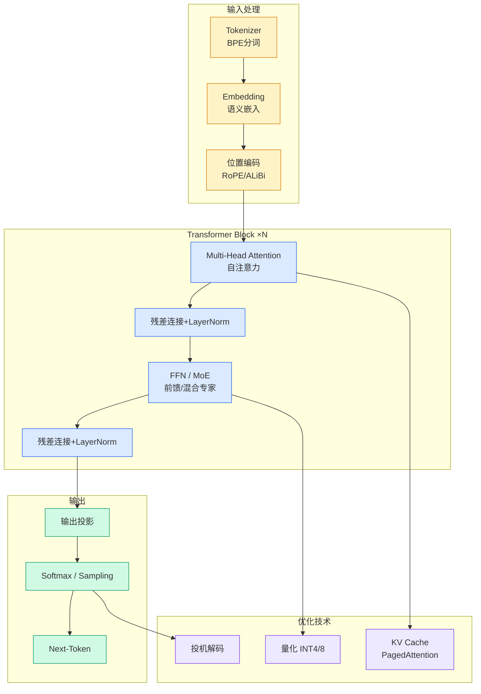

# CTGAN+LLM 组合拳：携程测试数据生成工程方案

## Ch01.890 CTGAN+LLM 组合拳：携程测试数据生成工程方案

> 📊 Level ⭐⭐ | 5.1KB | `entities/ctgan-llm-test-data-generation-ctrip.md`

# CTGAN+LLM 组合拳：携程测试数据生成工程方案

> 测试人员44%的时间耗在数据构造上。携程提出CTGAN+LLM的工程化方案，让二者各司其职：CTGAN负责高丰富度独立字段生成，LLM负责关联关系字段生成。

## 概念导图

## 背景

在软件测试过程中，构造测试数据是基础而关键的工作。Capgemini与Sogeti联合研究表明，测试人员通常需要耗费**44%**的测试时间用于测试数据的生成与管理。

常见方式：手动创建（成本高，受限于业务理解）或从线上数据库同步（隐私合规风险，无法覆盖极端用例）。**合成数据（Synthetic Data）**成为新解。

## 模型调研对比

携程测试团队评估了四种主流模型在高斯模型、TVAE、CTGAN和LLM上的表现，聚焦三个维度：

| 模型 | 字段间关系 | 枚举字段覆盖率 | 生成速度 | 核心局限 |
|------|-----------|--------------|---------|---------|
| 高斯模型 | 仅线性 | 损失约30% | <1s/条 | 正态假设严格 |
| TVAE | 弱非线性 | 损失较多 | <1s/条 | 分类变量效果差 |
| CTGAN | 隐式统计关联 | **100%** | <10s/条 | 无法学字段逻辑 |
| LLM | **最优（语义理解）** | 损失约30% | 43s/条 | 输出不可控、低效 |

结论：LLM与CTGAN分别满足**真实性**（字段间关系）与**丰富度**（枚举字段覆盖率）的诉求，但各有局限。

## 核心方案：LLM-CTGAN协同

### 架构

四个模块：关联关系识别 → 数据生成 → 指标监控 → 数据修复

### 关联关系识别

利用LLM对样本+建表语句进行语义分析，将字段分为两类：
- **独立字段** → 由CTGAN生成（最大化丰富度）
- **关联字段** → 按分组由LLM生成（保持逻辑一致性）

三步流程：LLM初分组 → LLM批评修复 → 规则过滤枚举字段。

### 生成实现

**CTGAN实现**：
- 训练集：线上10000条真实数据，按id倒序获取（取值覆盖率85%）
- 分批训练策略解决内存崩溃问题
- 预保存模型参数 → 后续生成0.16s/条（首次1.99s/条）
- 使用SDV库搭建，LLM解析DDL生成Metadata
- 6张库表验证：CTGAN保持与训练集完全一致的枚举字段覆盖率

**LLM实现**：
- 训练集：从10000条压缩至1000条（差异化抽样，平均相对熵比提升15%，枚举覆盖率+32.3%）
- 模型：自部署Deepseek-R1-Friday（全参671B）
- Markdown格式输入输出，三次Prompt迭代优化

### Prompt工程演进

从三个版本的Prompt演化可见LLM生成的核心挑战：
- V1：要求保持完全一致丰富度+均匀分布 → LLM处理非分类字段时效率极低
- V2：去掉均匀分布要求 → 仍存在非分类字段问题
- V3（最终版）：按字段类型差异化约束（枚举类保持丰富度，连续类保持范围可随机） → 稳定生成

### 评估指标

双维度评估体系：
- **字段列指标**：枚举字段覆盖率、字段间关系、数据有效性
- **数据行指标**：Discriminator Score（CTGAN判别器反打生成数据）+ Rule Validity（LLM规则形式化验证）

## 实验结果

在10000条训练集上，每次生成1000条、执行10次取平均。

直接使用LLM生成1000条数据时：生成多样性严重下降，字段取值趋向高频固定值，流程失败率>90%，生成时间>60s/条——不适合大数据量生成任务。

LLM-CTGAN协同方案在行级和列级指标上均优于CTGAN基线。

## 总结

LLM与CTGAN"各展所长"：CTGAN最大化枚举字段丰富度，LLM学习复杂字段间逻辑规则。

未来方向：复杂表间关系识别、效率提升与成本优化（离线推理）、通用平台建设。

---
## 关联
→ [原文存档](https://github.com/QianJinGuo/wiki-book/tree/main/docs/raw/articles/ctgan-llm-test-data-generation-ctrip.md)
- 相关概念: [Harness Engineering](https://github.com/QianJinGuo/wiki/blob/main/concepts/harness-engineering-framework.md)
- 相关: [Agent 架构](https://github.com/QianJinGuo/wiki/blob/main/concepts/agent-architecture.md)

---

