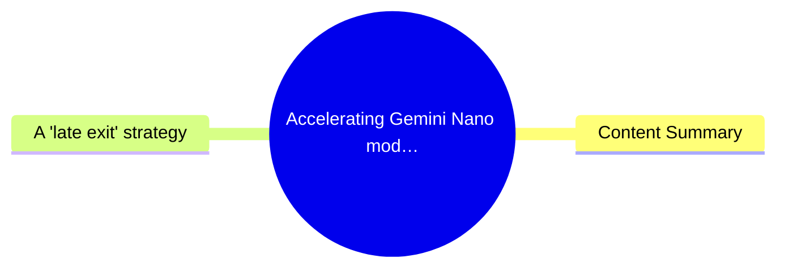
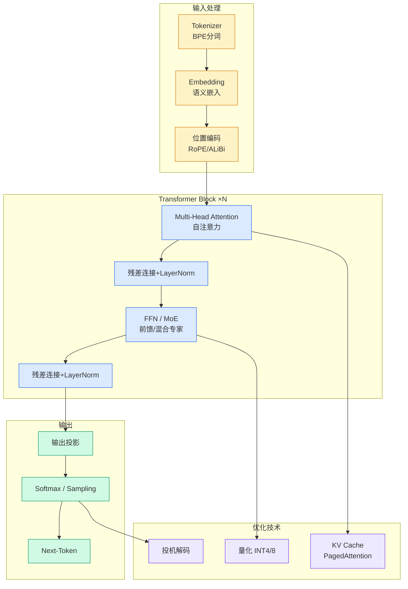

# Accelerating Gemini Nano models on Pixel with frozen Multi-Token Prediction

## Ch01.960 Accelerating Gemini Nano models on Pixel with frozen Multi-Token Prediction

> 📊 Level ⭐⭐ | 4.6KB | `entities/blog-accelerating-gemini-nano-models-on-pixel-with-frozen-multi-token-prediction.md`

# Accelerating Gemini Nano models on Pixel with frozen Multi-Token Prediction

> **Source**: [research.google](https://research.google/blog/accelerating-gemini-nano-models-on-pixel-with-frozen-multi-token-prediction/)

Specific technique (frozen Multi-Token Prediction) with implementation details for mobile deployment. Includes architectural innovations, references to prior work, and real-world deployment (Pixel 9/10). High technical depth and verifiability.

## 概念导图

## Content Summary

Markdown Content:
Having powerful Large Language Models (LLMs) right in your pocket is now a reality with on-device models like [Gemini Nano](https://developer.android.com/ai/gemini-nano) and [Gemma](https://deepmind.google/models/gemma/). This technology enables everyday features on your phone — such as instantly summarizing a flurry of notifications or proofreading an important text message — all without sending your private data off device. But to make these features useful for everyday users, they need to happen very efficiently.

Delivering this kind of speed on a mobile device is a significant challenge. Unlike vast server environments, mobile phones operate under a strict energy budget and hard memory (RAM) limits. Furthermore, standard language models generate text "autoregressively" — meaning they process and output just one word (or token) at a time. This step-by-step process creates a bottleneck, underutilizing the phone's processing power while straining its memory bandwidth, which can ultimately slow down the user experience and drain the battery.

To overcome this bottleneck, we are announcing a new architecture that retrofits Multi-Token Prediction (MTP) onto existing, "frozen" Gemini Nano v3 models. Building on prior approaches like the[EAGLE framework](https://arxiv.org/pdf/2401.15077) and [Confident Adaptive Language Modeling](https://research.google/blog/accelerating-text-generation-with-confident-adaptive-language-modeling-calm/) (CALM), we designed new architectural components to maximize these efficiency gains specifically for mobile environments. Our recent announcements highlighted accelerating [Gemma 4 with MTP](https://blog.google/innovation-and-ai/technology/developers-tools/multi-token-prediction-gemma-4/) and making it available to developers.

Today's article tackles the unique, extreme constraints of edge computing. Recently rolled out to the Pixel 9 and 10 series, this approach acts as an out-of-the-box speedup. For users, this means that features like AI Notification Summaries and Proofread generate text significantly faster and with less energy consumption. For developers, it eliminates a major friction point: delivering high-speed on-device AI without the need to fine-tune separate, memory-heavy drafting models for every new task.

## A "late exit" strategy

MTP builds upon the evolution of [speculative decoding](https://research.google/blog/looking-back-at-speculative-decoding/). In a traditional setup, generating _N_ tokens requires _N_ forward passes of the large model. Speculative decoding decouples this process into two parts:

1.   _Draft:_ a smaller, faster approximation model (the "drafter") generates a short sequence of candidate tokens (e.g., 3 tokens).
2.   _Verify:_ a large model (the "verifier") processes these candidates in parallel. If the candidates match what the large model would have predicted, they are accepted. If not, the system rolls back to the first divergence.

However, this results in

---
## 关联
- 相关概念: [Harness Engineering](https://github.com/QianJinGuo/wiki/blob/main/concepts/harness-engineering-framework.md)
- 相关: [Agent 架构](https://github.com/QianJinGuo/wiki/blob/main/concepts/agent-architecture.md)

---

