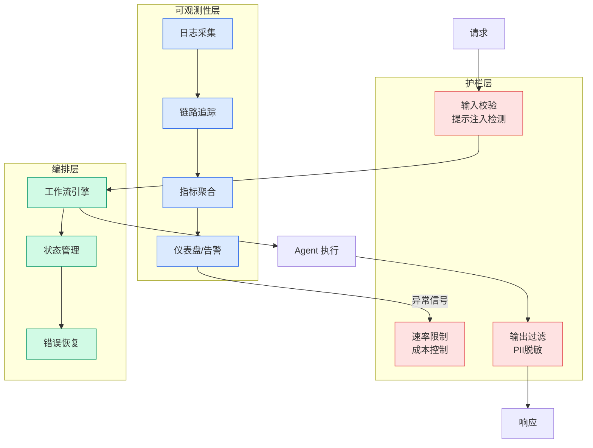

# 刚刚，姚班传奇陈立杰苦思7年的计算几何核心难题，被ChatGPT推翻了

## Ch01.969 刚刚，姚班传奇陈立杰苦思7年的计算几何核心难题，被ChatGPT推翻了

> 📊 Level ⭐⭐ | 4.5KB | `entities/刚刚姚班传奇陈立杰苦思7年的计算几何核心难题被chatgpt推翻了.md`

# 刚刚，姚班传奇陈立杰苦思7年的计算几何核心难题，被ChatGPT推翻了

**来源**: 新智元

**发布日期**: 2026-06-29

**原文链接**: http://mp.weixin.qq.com/s?__biz=MzI3MTA0MTk1MA==&mid=2652709773&idx=2&sn=68bde762eb0070f5bd61518728971232&chksm=f12e577cc659de6ac3258fec78cc0d249adcacae64f0618e13bd71cceda2f528fe0932b29ffc#rd

---

### 

### 新智元报道

【新智元导读】 GPT-5.5 Pro 生成了一个数学证明，解决了计算几何中一个 陈立杰苦思 7 年未解的核心难题。关键技术来自 OpenAI 上月的另一项突破，而最初推进这个问题的陈立杰发现，钥匙竟是自己参与的工作。

6 月 24 日，arXiv 上出现了一篇论文：UCSD 三位研究者 Barna Saha、Yinzhan Xu 和 Christopher Ye 证明，「最远点对」等经典计算几何问题，在任意超常数维度下需要近平方时间。

https://arxiv.org/pdf/2606.25887

论文声明，初始证明由 GPT-5.5 Pro 生成。

给 AI 的 Prompt 只有两句话，大意就是「试试用这个证明思路去改进那个已知结果」，附上两篇论文链接。

这个问题 7 年前由陈立杰首次推进到接近极限，而补上最后一块拼图的关键技术，恰好来自他自己上个月在 OpenAI 参与的另一项工作。

陈立杰在 X 上惊呼，「This is incredible!!!」

陈立杰想了 7 年的问题

陈立杰是算法圈顶级天才，IOI 金牌得主，本科毕业于清华姚班，博士前往 MIT 师从理论计算机科学家 Ryan Williams，毕业后入职加州伯克利担任助理教授，现任职 OpenAI，是理论计算机科学领域最受关注的青年学者之一。

拓展阅读：  姚班陈立杰入职OpenAI！破解50年世界难题的30岁天才，要颠覆ChatGPT

2018 年，他读博的第一篇论文就在这个问题上取得了关键进展，把维度下界推到了 2  Θ(log n)  。

https://arxiv.org/pdf/1802.02325

log 是一个增长极其缓慢的函数，拿宇宙中原子总数那样大的数去算 log，结果也才 5 左右。

他已经把下界逼到了一个几乎不增长的门槛前，再往下推就撞到了硬墙。

此后 7 年，断断续续地想，始终没能跨过去。

上个月，他在 OpenAI 参与了对 Erdős 单位距离猜想的反证。

这篇新论文的作者们随后发现，那项工作中的代数数论技术，恰恰是跨过最后一步所需要的。

猜想科普

这个重大猜想具体是什么意思呢？

想象一个体育馆里坐了一万人，要找出坐得最远的两个。

如果体育馆是个平面，用两个坐标描述每个人的位置，有很聪明的算法可以快速搞定。

但如果每个人的「位置」需要用 100 个、1000 个数来描述呢？这就进入了高维空间。

目前最好的算法运行时间大致是 n  2-c/d  ，n 是点的数量，d 是维度，c 是常数。

维度低时指数明显小于 2，有捷径可走；维度一高，指数逼近 2，退化成把每两个人都比一遍的暴力方法。

这篇论文回答的核心问题是，算法不够聪明，还是问题天生就这么难？

答案是后者。

只要维度在增长，哪怕增长得慢到 log log

→ [原文存档](https://github.com/QianJinGuo/wiki-book/tree/main/docs/raw/articles/刚刚姚班传奇陈立杰苦思7年的计算几何核心难题被chatgpt推翻了.md)

---
## 关联

- 相关概念: [Harness Engineering](https://github.com/QianJinGuo/wiki/blob/main/concepts/harness-engineering-framework.md)

---

