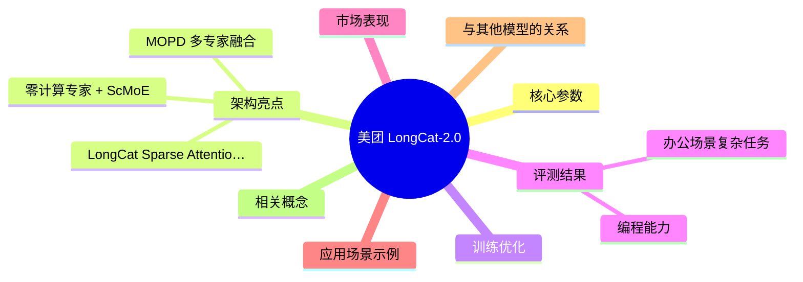
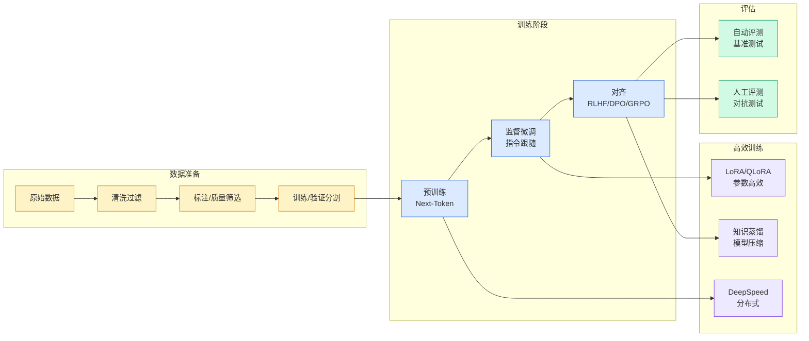

# 美团 LongCat-2.0

## Ch01.983 美团 LongCat-2.0

> 📊 Level ⭐⭐ | 4.5KB | `entities/meituan-longcat-2-0.md`

# 美团 LongCat-2.0

美团发布的新一代万亿参数大模型，业界首个在五万卡国产算力集群上完成全流程训练与推理的万亿参数模型。总参数 1.6T，平均激活约 48B（动态范围 33B~56B），原生支持 1M 超长上下文。

API 平台：https://longcat.chat/platform/product

## 概念导图

## 核心参数

| 参数 | 数值 |
|------|------|
| 总参数 | 1.6T |
| 平均激活参数 | ~48B |
| 动态激活范围 | 33B ~ 56B |
| 预训练数据 | 30T+ tokens |
| 上下文长度 | 1M (百万级) |
| 训练算力 | 五万卡国产算力集群 |
| 稳态日吞吐 | 1T+ tokens/day |

## 架构亮点

### LongCat Sparse Attention (LSA)

稀疏注意力机制，将计算量从平方级降至线性级，在 100 万 Token 的超长上下文中依然保持精准的信息定位与理解能力。

### 零计算专家 + ScMoE

通过零计算专家实现 token 级动态激活：简单 token 不消耗算力，复杂 token 自动获得更多计算资源。

### MOPD 多专家融合

融合三组专家能力：

- **Agent Experts**：专攻工具调用与自主纠错
- **Reasoning Experts**：深耕数学与 STEM 推理
- **Interaction Experts**：优化指令遵循与交互体验

推理时由门控网络根据任务类型动态调度最擅长的专家。

## 训练优化

三方面攻克国产算力训练难题：

| 维度 | 成果 |
|------|------|
| 稳定性 | 卡间通信异常处理、弹性扩缩卡、自动故障恢复；月均日故障率降低 70%+；硬件故障日均影响从 8h 压至 10min |
| 正确性 | 自研确定性算子、Bitwise 一致性验证、参数检测；关键模块计算精度提升、Reduce 逻辑优化 |
| 效率 | 流水线调度、显存优化、算子级控核；训练 MFU 提升 1.5 倍 |

## 评测结果

### 编程能力

| 评测集 | LongCat-2.0 | 对比模型 |
|---------|-------------|----------|
| SWE-bench Pro | 59.5 | > Gemini 3.1 Pro (54.2), GPT-5.5 (58.6), Claude Opus 4.6 (57.3) |
| SWE-bench Multilingual | 77.3 | ~ Claude Opus 4.6 (77.8) |
| Terminal-Bench 2.1 | 70.8 | - |

### 办公场景复杂任务

| 评测集 | 分数 |
|---------|------|
| RWSearch | 78.8 |
| FORTE | 73.2 |
| BrowseComp | 79.9 |

均达到或接近前沿闭源模型水平。

## 市场表现

- 预览版已通过 OpenRouter 和 longcat.ai 面向全球开放
- 趻身 OpenRouter 全球大模型调用量前三
- 月调用量在 Hermes、Claude Code 和 OpenClaw 分列第一、第二、第三
- 成为最受全球 Agent 开发者欢迎的模型之一

## 应用场景示例

- **AI SQL Agent**：业务人员自然语言查询数据，全链路闭环
- **代码库迁移**：分析旧版插件、梳理逻辑、重构新 API 实现
- **完整应用开发**：从一句话描述到可运行产品
- **3D 交互演示**：一句话生成完整 Three.js 3D 演示
- **AI 小说工厂**：多 Agent 协作完成创意写作到商业变现

## 与其他模型的关系

- **国产算力特色**：五万卡国产算力集群完成全流程训练
- **MoE 架构**：1.6T 总参数，动态激活约 48B
- **超长上下文**：1M 原生支持，LSA 稀疏注意力机制
- **开源**：对外开源发布

## 相关概念

- **国产算力特色**：五万卡国产算力集群完成全流程训练
- **MoE 架构**：1.6T 总参数，动态激活约 48B
- **超长上下文**：1M 原生支持，LSA 稀疏注意力机制
- **开源**：对外开源发布

→ [原文存档](https://github.com/QianJinGuo/wiki-book/tree/main/docs/raw/articles/meituan-longcat-2-0-trillion-parameter-moe-2026.md)

---
## 关联
- 相关概念: [Harness Engineering](https://github.com/QianJinGuo/wiki/blob/main/concepts/harness-engineering-framework.md)
- 相关: [Agent 架构](https://github.com/QianJinGuo/wiki/blob/main/concepts/agent-architecture.md)

---

