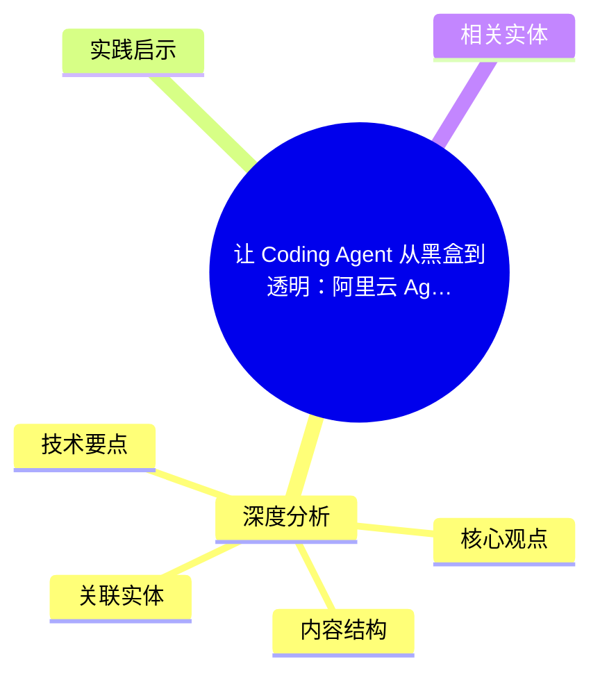
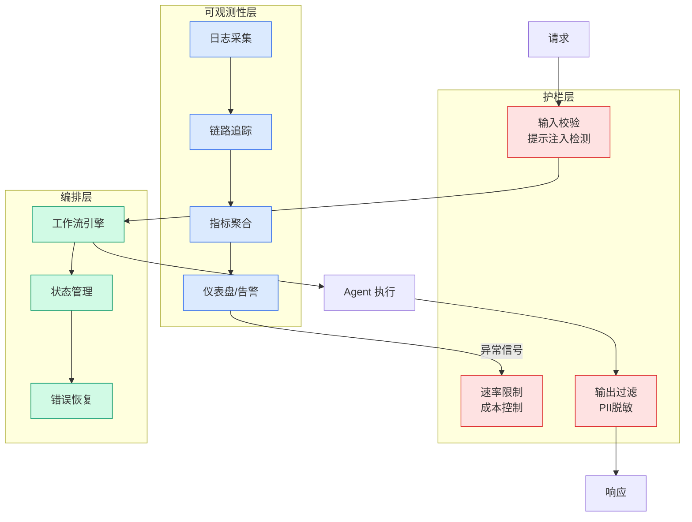

# 让 Coding Agent 从黑盒到透明：阿里云 Agent 观测审计数据采集实践

## Ch01.988 让 Coding Agent 从黑盒到透明：阿里云 Agent 观测审计数据采集实践

> 📊 Level ⭐⭐ | 4.4KB | `entities/alibaba-agent-observability-audit-loongsuite-pilot-coding-agent-blackbox-transparent.md`

# 让 Coding Agent 从黑盒到透明：阿里云 Agent 观测审计数据采集实践

→ [原文存档](https://github.com/QianJinGuo/wiki-book/tree/main/docs/raw/articles/alibaba-agent-observability-audit-loongsuite-pilot-coding-agent-blackbox-transparent.md)

## 概念导图

## 深度分析

让 Coding Agent 从黑盒到透明：阿里云 Agent 观测审计数据采集实践 涉及agent领域的核心技术议题。
### 核心观点
1. # 让 Coding Agent 从黑盒到透明：阿里云 Agent 观测审计数据采集实践
> AI Agent 规模化落地带来执行黑盒、行为难追溯、成本难度量三大难题。
2. 阿里云基于 OTel 标准，面向 Coding Agent、个人通用助理和框架型 Agent，推出 LoongSuite Pilot、插件及探针等无侵入采集方案，让 Agent 实现可看见、可分析、可审计、可治理。
3. 引言
随着大模型在企业生产环境中的规模化部署，AI Agent 已从单点实验走向核心业务系统。
4. 然而，随之而来的可观测性挑战成为制约 Agent 进一步普及的关键瓶颈——**执行黑盒、行为难追溯、成本难度量**这三大难题正在困扰着每一个 Agent 落地团队。
5. 阿里云基于 OpenTelemetry（OTel）标准，结合 LoongSuite GenAI 可观测语义规范，面向不同形态的 Agent 推出端侧轻量数据采集方案，让 Agent 真正实现"可看见、可分析、可审计、可治理"。

### 内容结构
- 让 Coding Agent 从黑盒到透明：阿里云 Agent 观测审计数据采集实践
- 1. 引言
- 2. 背景
- 2.1 三大 Agent 形态
- 2.2 三大核心挑战
- 3. 阿里云 Agent 观测审计采集方案
- 3.1 Coding Agent：LoongSuite Pilot 端侧轻量数据采集平台
- 3.2 个人通用助理：一行命令接入完整观测和审计

### 技术要点

- **agent架构**: 本文在agent方向提出的设计理念与实现路径
- **工程挑战**: 实际落地中面临的关键问题与应对策略
- **ai-coding趋势**: 相关技术演进方向与新兴范式
### 关联实体

- [Karpathy 最新访谈从 Vibe Coding 到 Agentic Engineering](../ch04/237-agentic.html)
- [Karpathy Vibe Coding Agentic Engineering](../ch04/126-karpathy-vibe-coding-agentic-engineering.html)
- [你不知道的 Agent原理架构与工程实践 V2](../ch03/035-agent.html)
- [龙虾装上了可以用来干啥分享下我的 Openclaw 多智能体团队搭建经验 V2](../ch11/235-openclaw.html)
- [Openclaw 完全指南这可能是全网最新最全的系统化教程了32W字建议收藏 V2](../ch11/235-openclaw.html)
- [Openclaw 完全指南这可能是全网最新最全的系统化教程了32W字建议收藏](../ch11/235-openclaw.html)

## 实践启示

1. **工程落地**: agent领域方案需关注可观测性、可维护性和成本效率
2. **技术选型**: 根据场景选择合适的技术栈，避免过度设计或盲目追新
3. **持续迭代**: 建立数据驱动的反馈闭环，持续优化系统表现
4. **风险管控**: 引入新技术需评估对现有系统稳定性的影响，做好降级预案

## 相关实体

- [MOC](https://github.com/QianJinGuo/wiki/blob/main/moc/mlops-training-inference.md)

---

