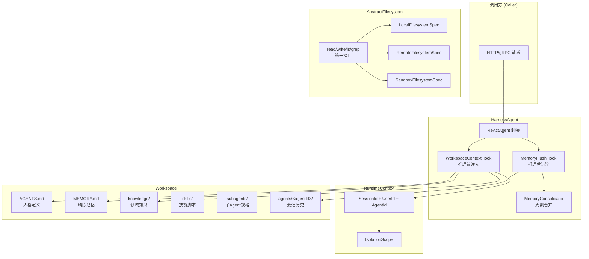
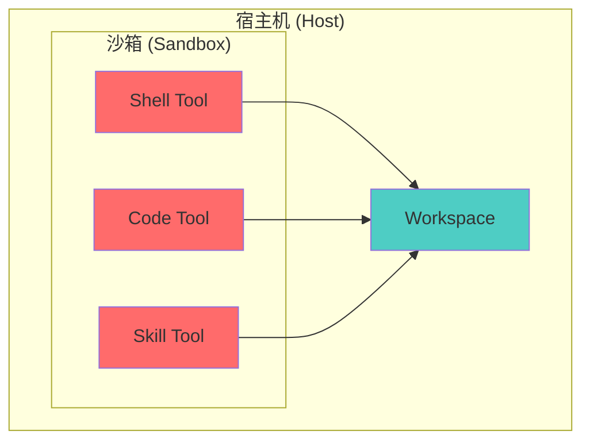
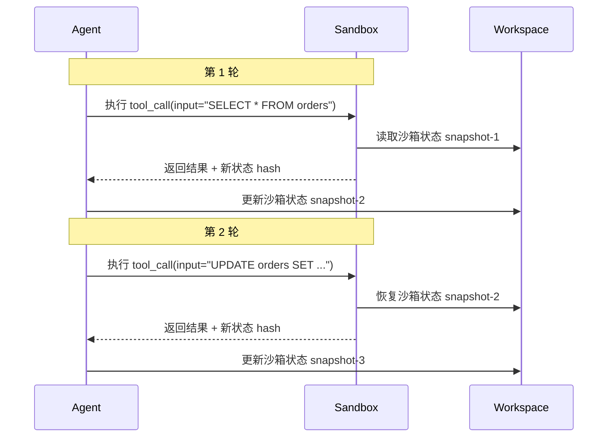

# Ch03 AI 工具与产品全景

> 2024-2026 AI 工具生态：从 IDE 到 Agent 平台

> 本章收录 **123 篇**实体，按深度递增排列。

---

## 本章导航

| Level | 含义 | 篇数 |
|-------|------|------|
| ⭐ 入门 | 零基础可读 | 47 |
| ⭐⭐ 工程师 | 需编程基础 | 75 |
| ⭐⭐⭐⭐⭐ 大师 | 前沿/哲学 | 1 |

---

## 导读

AI 工具正在重新定义"开发者工具"的边界。

本章收录了 2024-2026 年最重要的 AI 工具和产品：从 Claude Code 到 Cursor，从 Obsidian + AI 到 Notion AI，从 n8n 工作流自动化到飞书多维表格集成。每一个工具背后都有一个产品判断——为什么它选择这样而不是那样设计？

你还会看到一些"非工具"的内容：设计系统的 AI 化、Figma 与代码的融合、以及"界面不再是产品"这个正在发生的范式转移。

本章适合所有想了解 AI 工具生态的人——不只是开发者，也包括产品经理、设计师和创业者。

---

## Ch03.001 The Interface Is No Longer the Product

> 📊 Level ⭐ | 15.1KB | `entities/interface-commoditization-ai-era.md`

### From Agents That Use Apps to Apps Built for Agents

A few weeks ago I was using Claude Design to put together a presentation. The interface is organized around the reasoning, not the slide. You work on the content. The deck is a consequence. The .pptx comes at the end. It is an export. The work happened somewhere else. That is a small detail that I think points to something larger. And it is not really about presentations.

For decades, the only way to modify an application's state was through a human interface. That assumption is starting to break. Most human-computer interaction has been built around two patterns: issuing commands (typing, clicking, speaking) and manipulating representations (dragging, resizing, arranging, formatting). Every productivity tool ever built is designed around one or both of those. The keyboard, the mouse, the touchscreen. That is the full vocabulary. The interface and the product were, for practical purposes, the same thing.

It worked. It got the job done. Billions of people learned to think in spreadsheets, build in slide decks, and manage work through ticketing systems. But more of that work is going to be done with, and eventually by, agents. And agents do not need a mouse. They do not need a menu. They do not need a canvas. They need structured state they can read, reason about, and rewrite.

Code has always worked this way. It is text with clear semantics. Tools can parse it, transform it, and reason about it without ever rendering it visually. That is why agents are already so capable there, and why the rest of software is about to face the same pressure.

### The Bridge and the Destination

A lot of current AI product work starts from the idea that agents should learn to use our existing applications. The agent opens the browser, clicks through menus, fills forms, moves objects around, reads documents, sends messages, updates records. It behaves like a very fast human user. This is useful. More than useful, it is probably necessary. The world already runs on existing software. Companies have years of organizational knowledge embedded in Gmail, Slack, Jira, Salesforce, Notion. If agents are going to be helpful today, they need to work inside that world. That is the bridge. But the bridge is not the destination.

Agents using existing apps help bring AI into the current software stack. Apps built for agents may change the shape of the stack itself. And there is something more valuable in that process than just short-term utility. Watching where agents struggle with existing interfaces, where the translation between intent and UI operation is most painful, is probably the most honest way to find where the structural opportunity is. The friction is the signal.

### Software Categories Are Interface History

Software categories are accidents of interface history, not natural laws. Slides. Spreadsheets. Documents. Dashboards. CRMs. Project management tools. Design tools. Workflow builders. These are not fundamental categories. They are bundles: a data model, a renderer, a human editing interface, permissions, collaboration, and import/export, all wrapped into a single product boundary. That bundling made sense when the interface was the center of the product. Build around the human, and you get human-shaped categories.

PowerPoint is not a presentation. It is a container for a presentation, built around the assumption that a human would assemble it slide by slide. Excel is not a financial model. It is a grid interface for building one. The rendered output still matters, the board still needs to see the deck, the customer still needs the pitch. But the editing interface and the artifact are different things, and we have been conflating them for so long we stopped noticing.

In an agent-native world, that bundling starts to come apart. The source of truth for a product strategy is not the slide deck, the roadmap doc, the ticket board, or the dashboard. It is the strategy itself: the goals, the bets, the risks, the owners, the metrics, the decisions. Everything else is a view. The memo, the board deck, the launch checklist, the customer brief are renderings of the same underlying object, shaped for different audiences.

### The Source of Truth Moves

Most software today makes users translate intent into operations. The user should not have to say: move this card, add this row, change this chart. They should be able to say what they are trying to make true. The most vulnerable software categories are not the ones with the weakest products. They are the ones where the gap between what the user wants and what the interface makes them do is largest.

A fair counterargument is that structured artifacts are not new. Many applications already have APIs, schemas, file formats, automations, and plugin systems. The difference is not that structure suddenly exists. The difference is what the product is organized around. Historically, the structure served the human interface. In agent-native software, the structure becomes the main control surface, and the human interface becomes one view over it. The question is not whether structure exists. It is whether the product is built around it.

The deck, the doc, the dashboard. None of them are the source of truth. They are projections.

### What Agent-Native Apps Need

Agent-native applications will have a recognizable shape. They will have a structured internal representation of the work. Not a file format, not a rendered view. A representation that captures what the artifact actually is, not just how it looks. They will have renderers that turn that structure into human-friendly views: documents, decks, dashboards, workflows, timelines, whatever format the audience needs. They will have validators that check whether the result is coherent, safe, complete, and consistent with the user's goals. They will have diff and approval systems, because humans need to understand what changed before they trust it. They will have import and export to legacy formats, because the world does not move all at once.

A chatbot next to a legacy app is not the same thing as an agent-native application. If the agent cannot read and write the structured source of truth, it is just another UI layer. A chatbot bolted onto the side is still the old product.

### Owning the Artifact Layer

AI made code abundant. It may do the same to traditional interfaces. The scarce resource becomes the structured understanding of the work: what the artifact means, how it changes, who is allowed to change it, how changes propagate, and what is consistent. That is where ownership moves. Not to the app that renders it today, but to the system that owns the artifact layer underneath.

The question worth asking is not: how do we add AI to this app? It is: what is the real object of work here, and what representation would let an agent help maintain it? For presentations, the object may be the narrative. For dashboards, it may be the metrics and their causes. For workflows, it may be the process graph. For strategy documents, it may be a structured model of the decision.

The old tools will not vanish quickly. They have distribution, habits, enterprise contracts, file compatibility, and decades of user training on their side. But the center of gravity moves. The work happens in the agent-native system. The legacy app receives the export.

The more interesting future is not only agents operating apps. It is applications designed so agents, humans, and existing tools can all work with the same underlying objects. Not because every app disappears but because the source of truth may move.

## 相关实体
- [From System Of Record To System Of Intelligence](https://github.com/QianJinGuo/wiki/blob/main/entities/from-system-of-record-to-system-of-intelligence.md)
- [Notebook Lm](https://github.com/QianJinGuo/wiki/blob/main/entities/notebook-lm.md)
- [Claude Code Founder Harness 100 Lines](https://github.com/QianJinGuo/wiki/blob/main/entities/claude-code-founder-harness-100-lines.md)
- [Vera Arrives Nvidia S First Cpu Built For Agents Lands At Top Ai Labs](https://github.com/QianJinGuo/wiki/blob/main/entities/vera-arrives-nvidia-s-first-cpu-built-for-agents-lands-at-top-ai-labs.md)
- [Thehackernews Fake Openai Privacy Filter](https://github.com/QianJinGuo/wiki/blob/main/entities/thehackernews-fake-openai-privacy-filter.md)

→ [原文存档](https://raw.githubusercontent.com/QianJinGuo/wiki/main/raw/articles/interface-commoditization-ai-era.md)

- [Playerzero Request Demo](https://github.com/QianJinGuo/wiki/blob/main/entities/playerzero-request-demo.md)
## 深度分析

**1. 软件类别的"界面史"真相：一切类别都是历史偶然**

文章最深刻的命题是：软件类别（Slides、Spreadsheets、Documents、CRMs 等）不是自然规律，而是界面历史的事故。当工具被设计为围绕人类界面时，你自然会得到"人类形状的类别"。这个分析揭示了 SaaS 生态系统的深层结构：现有软件产品是围绕 UI 和人类交互模式设计的，它们将数据模型、渲染引擎、权限系统、合规功能等捆绑成单一产品边界。AI 时代的重构力在于：这种捆绑不再必要，因为结构化数据层可以同时服务于多个渲染视图和多个 agent，而非仅限于一个人类用户界面。

**2. "桥"与"目的地"的战略区分：理解当前 AI 产品浪潮的真实价值**

作者将当前 agent 操作现有应用的方式（"agent 像一个很快的人类用户"）定义为"桥"而非"目的地"。这个区分的战略意义在于：大多数企业 AI 产品投资正在优化"桥"——让 agent 能够更好地操作现有的 SaaS 工具——而真正的价值在"目的地"：改变应用程序的构建基础。但"桥"是必要的：企业已经在现有工具中积累了多年的组织知识，完全绕过它们需要数年时间。这给产品策略的启示是：**短期看"桥"的价值（帮助 agent 更好地使用现有工具），长期押注"目的地"（重新设计应用的核心架构）**。

**3. 摩擦即信号：Agent 的操作困难是产品机会的探测器**

"摩擦是信号"——作者将 agent 在操作现有界面时的困难重新框架为发现结构机会的路径。Agent 需要操作现有 UI（鼠标点击、菜单导航、表单填写）的痛苦，精确地指示了"用户意图"与"界面操作"之间的翻译损失。Slack 中的"发送消息"对 agent 来说需要理解消息格式、频道结构、权限等一系列中间层操作，而实际上只需要"将这条信息传达给这个团队"。这种意图与操作之间的鸿沟就是结构重设计的机会所在。这给产品经理的启示是：**观察 agent 如何艰难地使用你的产品——那些摩擦点就是最有价值的重构目标**。

**4. 结构层的主权转移：价值存储地点的根本性迁移**

"稀缺资源变成对工作的结构化理解：artifact 意味着什么、它如何变化、谁有权改变它、变更如何传播、什么是一致的"——这是文章最接近"护城河定义"的核心论点。在 UI 为中心的时代，产品的护城河是用户体验和交互模式；在 agent-native 时代，护城河变成"谁拥有 artifact 的结构化表示层"。拥有结构层的公司可以在多个渲染视图和多个 agent 交互模式之间灵活切换，而不拥有结构层的公司只能依赖现有的 UI 导出。这意味着：数据模型设计在 2026 年的重要性远超过 UI 设计。

**5. Agent-Native 应用的解剖：五层结构**

作者给出了 agent-native 应用的明确架构描述：① 结构化内部表示（对 artifact 本身的表示，而非其渲染外观）；② 渲染器（将结构转换为人类友好的视图）；③ 验证器（检查结果是否连贯、安全、完整）；④ Diff 和审批系统（人类需要理解变更才能信任它）；⑤ 导入/导出到遗留格式（世界不是一次性移动的）。这个架构与知识图谱、本体工程、语义建模等领域高度相关——它们都在试图解决"如何结构化地表示真实世界的 artifact"。

## 实践启示

1. **审计你的产品中的"意图-操作鸿沟"**：对每个主要功能，问：agent 如果要完成这个任务，需要模拟多少次人类点击/输入？每次转换都是信息损失的机会。如果这个数字 > 3，该功能就是结构重构的候选对象。寻找那些"用户需要知道怎么做，而不是需要做什么"的工作流——这些是 agent-native 重构的最高价值目标。

2. **将产品设计问题重构为"真实工作对象是什么"**：对于一个产品经理工具，真实工作对象不是 ticket board，而是工作项的优先级决策和依赖关系。对于一个数据分析工具，真实工作对象不是 pivot table，而是指标定义和因果关系。将产品重新围绕"工作对象"而非"人类交互模式"设计，会产生完全不同的架构决策。

3. **评估"桥"投资 vs "目的地"投资的组合**：大多数公司需要两者兼有——短期通过 agent 操作现有工具获得效率提升，同时在核心产品上投入结构层重构。关键财务问题是：这两个方向的投资比例是多少？建议核心产品团队将 30% 的 AI 相关工程资源投入"结构层重构"，而非 100% 押注在"让现有 UI 可以被 agent 操作"。

4. **构建验证和 diff 能力作为产品的核心差异化**：当 agent 能够修改产品状态时，"变更是否正确"的验证变得至关重要——不仅是对系统的技术验证，也包括对用户业务目标的语义验证。能够告诉用户"这个变更会让指标 X 产生预期之外的影响"的验证系统，比能够"更快完成操作"的 agent 操作层更有长期价值。

5. **从"AI + 产品"转向"产品 = 结构层 + AI 渲染"**：不是问"我们如何在 X 产品中加入 AI 功能"，而是问"X 工作的真实对象是什么，我们需要什么结构来表示它，以及 AI 如何帮助维护这个结构"。这个框架重塑了产品优先级：最重要的投资可能不是新的 AI 模型，而是更好的数据模型设计。 [^raw/articles/interface-commoditization-ai-era.md:79-106]

→ [原文存档](https://raw.githubusercontent.com/QianJinGuo/wiki/main/raw/articles/interface-commoditization-ai-era.md)

---

## Ch03.002 Obsidian + Claude Code 集成指南

> 📊 Level ⭐ | 14.7KB | `entities/obsidian-claude-code-integration.md`

## 概述
系统性整理 Claude Code 与 Obsidian 集成的五种策略及配套插件工具链，来源为中文社区实战经验的汇总文章。核心价值在于帮助开发者根据自身场景（多项目 vs 单项目 vs 个人知识管理）选择最适合的集成路径。

## 核心痛点
Claude Code 生成的配置文件分散在多个位置：
| 位置 | 用途 |
|------|------|
| `~/.claude/CLAUDE.md` | 全局指令 |
| `~/.claude/plans/` | 计划文件 |
| `~/.claude/projects/` | 每个项目的记忆 |
| `~/.claude/skills/` | 可复用技能 |
| `{repo}/CLAUDE.md` | 项目内指令（随仓库提交） |
直接用 Obsidian 打开代码仓库会导致 PNG、JS、node_modules 等非 Markdown 文件污染 Vault 视图。Obsidian 的「排除文件」功能仅为软隐藏，不解决根本问题。

## 五种集成策略
### 策略 1：独立开发者 Vault + 符号链接
建一个独立 Obsidian Vault，用符号链接拉入各仓库的 Claude 配置。配合 `.obsidian/app.json` 的 `userIgnoreFilters` 排除代码噪音，再装 File Explorer++ 按扩展名隐藏非 MD 文件。
**优点**：跨项目统一搜索、Dataview 跨库查询、项目间互链接
**缺点**：Obsidian 仅支持目录级符号链接；移动端不稳定；Obsidian Git 插件不跟踪链接内容

### 策略 2：Vault = Claude Code 工作目录（社区最流行）
把 Obsidian Vault 直接当作 Claude Code 工作目录，Vault 根目录的 `CLAUDE.md` 一身二用（既是 Claude 指令也是 Obsidian 笔记）。配合 Templater 自动生成结构化 `CLAUDE.md`，Dataview 查询所有项目配置和计划。
**代表项目**：ballred/obsidian-claude-pkm（目标管理）、IPARAG 结构（收件箱→项目→领域→资源→归档）
**优点**：Vault 即工作内容时非常好用（写作/研究/个人项目管理）
**缺点**：已有成熟代码仓库结构时难以硬套

### 策略 3：MCP 桥接
代码仓库和 Obsidian 完全分离，通过 MCP 协议连接。Claude Code 在项目目录工作，obsidian-claude-code-mcp 通过 WebSocket（默认端口 22360）自动发现仓库并访问 Obsidian 内容。
**Claudesidian MCP**：在基础上加语义搜索（Ollama embedding）和完整 agent 能力
**优点**：代码仓库完全干净；无需符号链接或调整项目结构
**缺点**：需要一直开着 Obsidian；多了一层 MCP 复杂度

### 策略 4：每个仓库一个 Vault
每个代码仓库直接作为独立 Obsidian Vault，用 `userIgnoreFilters` 隐藏非 MD 文件，`.obsidian/` 加入 `.gitignore` 避免污染。
**优点**：配置最简单，项目自成一体的干扰最少
**缺点**：无法跨项目搜索；多项目切换麻烦；看不到全局 `~/.claude/` 的内容

### 策略 5：QMD + 会话同步（进阶）
重度使用场景：QMD（语义搜索）+ sync-claude-sessions（会话导出）+ /recall 技能（上下文拉回），将 Claude Code 对话也沉淀为可搜索笔记。
**效果**：全部本地运行；会话可复用（非一次性上下文）；语义分块后 token 消耗和处理时间降 60%+
**缺点**：搭建成本高，需要多工具配合

## 文件混乱问题解决路径
1. **app.json `userIgnoreFilters`**：过滤 `node_modules/`、`.next/`、`dist/`、`.git/`、`.vercel/` 等目录
2. **正则排除文件类型**：`/.*\.png/`、`/.*\.js/`、`/.*\.ts/` 等（软隐藏，Obsidian 仍索引）
3. **File Explorer++ 硬过滤**：支持通配符/正则，随时可开关，比内置更灵活
4. **关闭「检测所有文件扩展名」**：JS/TS/JSON 类文件不再出现在列表
**彻底方案**：File Ignore 插件（.gitignore 风格，给文件加前缀让 Obsidian 直接跳过）—— 注意会实际修改文件名。

## 必备插件生态
**开发者 Vault 必备**：

- **File Explorer++**：通配符/正则过滤文件
- **Dataview**：跨所有 CLAUDE.md 做 Dataview 查询（项目状态/计划汇总）
- **Templater**：模板生成统一 CLAUDE.md 结构
**Obsidian 内直接用 Claude Code**：

- **Claudian**：侧边栏聊天，支持 YOLO/安全/计划权限模式
- **Agent Client**：集成 Claude/Codex/Gemini，支持 @ 引用笔记
- **Claude Sidebar**：更接近终端体验，支持多标签
**MCP 远程访问**：

- **obsidian-claude-code-mcp**：WebSocket 自动发现仓库
- **Claudesidian MCP**：完整 agent 模式 + 语义搜索

## Obsidian CLI 突破性进展
Obsidian 1.12 CLI（2025 年）让 Claude Code/Codex/Gemini CLI 直接「使用」Obsidian 而非仅读文件：

- **找孤立笔记**：4,000+ 文件 / 16GB 仓库上，从十几秒降至 <1 秒（~50 倍提升）
- **全仓搜索**：明显加速
接入速度排序：① Obsidian CLI（最快省 token）② REST API（灵活但多一层）③ 文件系统 grep（最慢最耗 token）

## 社区最佳实践原则
> **AI 负责读取，人负责书写**
Vault 应记录人自己的思考；Claude 输出（计划/会话/记忆）放在 `~/.claude/`；vault 本身只保留真正有价值的知识。
**自定义命令示例**：`/my-world`（加载全 vault 上下文）、`/today`（每日规划）、`/close`（日总结）、`/trace`（想法追溯）、`/ghost`（用你的语气回答）

## 深度分析
### 五种策略背后的哲学分歧
这五种策略并非只是技术方案的差异，它们折射出对「知识工作流应以何为中心」这一根本问题的不同回答。
**策略 1 和策略 4** 本质上是将代码仓库放在主体地位——Obsidian 作为附加的阅读层，通过过滤和链接尽量减少对原仓库的侵入。这是一种保守、渐进的方式，适合已有成熟代码工作流的团队。
**策略 2** 则彻底反转了主从关系：Vault 即工作内容，代码仓库反而成了需要被「桥接」进来的外部资源。CLAUDE.md 一身二用模糊了指令与笔记的边界，这种设计在写作型、研究型工作流中极其高效，但与工程实践存在深层矛盾——当代码仓库的目录结构与 Vault 的知识组织逻辑不一致时，强行统一反而制造更多认知负担。
**策略 3 的 MCP 桥接**是目前最优雅的架构：代码仓库和知识库各自保持纯粹，通过协议层连接，不相互污染。代价是运行时依赖（Obsidian 必须开启）和调试复杂度。Claudesidian MCP 在此基础上加入语义搜索，试图让桥接不仅是文件传递，而是真正的上下文理解。
**策略 5** 代表了一种更激进的愿景：将 AI 对话本身视为第一等公民的知识资产，而非转瞬即逝的上下文。这与 LLM memory 系统的长期方向一致——但搭建和维护成本决定了它目前只适合高度专业化的重度用户。

### 工具选择矩阵
| 维度 | 策略 1 | 策略 2 | 策略 3 | 策略 4 | 策略 5 |
|------|--------|--------|--------|--------|--------|
| 代码仓库侵入性 | 低 | 高 | 无 | 中 | 无 |
| 跨项目搜索 | 支持 | 支持 | 支持 | 不支持 | 支持 |
| 设置复杂度 | 中 | 低 | 中高 | 低 | 高 |
| 移动端稳定性 | 低 | 中 | 低 | 中 | 低 |
| 对话可复用性 | 无 | 弱 | 弱 | 无 | 强 |

### Obsidian CLI 的深远影响
Obsidian 1.12 CLI 将文件扫描速度提升约 50 倍，这不仅是一个性能数字，更代表了知识访问范式的转变：AI 不再需要「grep 扫库」，可以直接利用 Obsidian 的索引结构进行语义级查询。这为未来 AI 与知识库的深度集成打开了大门——想象一下 `/recall` 不仅能拉回会话，还能基于 Obsidian 的图谱关系做语义推理。

### 「AI 负责读取」原则的深层含义
社区倡导的「AI 负责读取，人负责书写」并非简单的分工建议。它指向一个更根本的问题：当 AI 生成的内容大量涌入 Vault，个人的思考轨迹会被稀释，Vault 会逐渐变成 AI 输出的归档而非第二大脑。这个原则本质上是要求人类保持对知识的所有权和诠释权——AI 是索引和关联的工具，而不是知识的生产者。

## 实践启示
### 入门路径推荐
1. **刚开始探索**：从策略 4（每仓库一个 Vault）起步，配合 File Explorer++ 过滤噪音。配置最简，立刻能用。
2. **已有成熟代码仓库**：选策略 3（MCP 桥接），代码仓库零改动，Obsidian 侧按需查询。
3. **以写作为核心的工作流**：直接上策略 2，把 Vault 当工作目录，配合 Templater 生成结构化 CLAUDE.md。

### 最小化可行插件集
不需要装十个插件，以下三个覆盖 80% 场景：

- **File Explorer++**：解决文件混乱，这是 Obsidian + 代码仓库最大的痛点
- **Dataview**：给 CLAUDE.md 加 frontmatter 后，项目配置查询随手可得
- **Templater**：统一 CLAUDE.md 结构，减少每次新建项目的重复配置
其他插件按需引入，不必一开始就装满。

### Dataview frontmatter 规范
在策略 1 和策略 2 中，给每个 CLAUDE.md 添加标准化 frontmatter，使跨项目查询成为可能：
```yaml
---
type: claude-config
project: my-app
stack: [nextjs, tailwind, supabase]
status: active
last-session: 2026-05-10
---
```
这样可以用一条 Dataview 查询汇总所有项目状态，实现真正的「全局视角」。

### 对话沉淀的最低成本方案
策略 5 完整实现成本高，但如果只是想把有价值的会话记录下来，最简路径是：
1. 用 `sync-claude-sessions` 导出会话（自动，不需要手动操作）
2. 配合 Obsidian 的文件夹规则，把会话自动归档到 `~/.claude/sessions/` 对应的 Vault 目录
3. 用 Dataview 索引，放弃复杂语义搜索——对大多数场景，文件名 + `WHERE contains()` 已经够用

### 注意符号链接的坑
策略 1 的符号链接方案看起来简单，但有几个实操雷区：

- Obsidian 只支持目录级符号链接，单文件无法链接
- Obsidian Git 插件不跟踪链接内容，别指望它做跨仓库版本控制
- iOS / 安卓客户端对符号链接支持极差，混用移动端的话这条路径基本走不通

### 在引入 MCP 前先问自己一个问题
策略 3 MCP 桥接很优雅，但它是针对「代码仓库和知识库完全分离」这个问题的答案。如果你的代码仓库本身就需要放在 Vault 里（策略 2），MCP 反而多此一举。先想清楚「我的 Vault 和代码仓库是否必须分离」，再决定是否引入 MCP 层。

## 相关工具与资源
- [原文存档](https://raw.githubusercontent.com/QianJinGuo/wiki/main/raw/articles/obsidian-claude-code-integration-guide.md)
- [Agent Memory 架构](https://github.com/QianJinGuo/wiki/blob/main/entities/agent-memory-architecture.md) — 与 Obsidian vault 记忆模式的思想关联
- [Claude Code Hackathon 经验](https://github.com/QianJinGuo/wiki/blob/main/entities/claude-code-hackathon-expertise-digitization.md) — Claude Code 实战相关
- [Karpathy LLM Wiki](https://github.com/QianJinGuo/wiki/blob/main/concepts/karpathy-llm-wiki-v2.md) — 本地知识管理系统的设计思路
> 本页整合来源：[GitHub] ballred/obsidian-claude-pkm、obsidian-claude-code-mcp、Claudesidian MCP；[博客] Chase AI、Noah Vincent、Niclas Dern、Kenneth Reitz 等实战汇总

## 相关实体
- [obsidian claude code integration guide](https://github.com/QianJinGuo/wiki/blob/main/entities/obsidian-claude-code-integration-guide.md)
- [开源 AI 知识管理搭档 Obsidian + Claude Code 完整集成指南](https://github.com/QianJinGuo/wiki/blob/main/entities/开源-ai-知识管理搭档-obsidian-claude-code-完整集成指南-v2.md)
- [Claude Code Memory Setup (Obsidian + Graphify)](https://github.com/QianJinGuo/wiki/blob/main/entities/claude-code-memory-setup-obsidian-graphify.md)
- [Claude Code vs OpenClaw Agent 记忆系统对比](https://github.com/QianJinGuo/wiki/blob/main/entities/claude-code-openclaw-memory-comparison.md)
- [CLAUDE.md 12 条规则：Karpathy 扩展模板](https://github.com/QianJinGuo/wiki/blob/main/entities/claude-code-12-rules-karpathy-extension.md)
- [两万字详解Claude Code源码核心机制](https://github.com/QianJinGuo/wiki/blob/main/entities/claude-code-20000-char-source-analysis.md)
- [gstack — AI协作开发工作流 & 复杂度棘轮](https://github.com/QianJinGuo/wiki/blob/main/entities/gstack-ai-workflow.md)

---

## Ch03.003 Your defect backlog is a retention report

> 📊 Level ⭐ | 13.2KB | `entities/defect-backlog-retention-report.md`

[原文存档](https://raw.githubusercontent.com/QianJinGuo/wiki/main/raw/articles/defect-backlog-retention-report.md)

A few weeks ago, someone opened a pull request to fix a bug in WordPress's block editor that I reported in 2019. For six years, pasting a Flickr image embed code into a WordPress post required a workaround: type `/img` into an empty block first. The bug wasn't catastrophic. The workaround was simple. And so the bug sat.

As an engineering leader, I know exactly how and why that happens. At more than one company, I inherited what I call Defect Mountain — a backlog of known bugs, many with documented workarounds, none individually urgent enough to justify pulling someone off feature work. The pressure to ship is real. A bug that has a workaround isn't actually blocking anyone. You note it, you document the workaround, and you move on.

Operationalize that, scale it, and soon your users are living inside a product that feels like death by a thousand paper cuts. No single cut is serious. Each workaround is learnable. But users don't want workarounds — they want the product to work properly. Every workaround is something a user has to specially remember. It's a support ticket waiting to happen when someone new encounters the bug without knowing the workaround exists. It's a small, recurring tax on every person who touches that part of the product.

I've been the engineering leader who made exactly this call, more than once. Under pressure to deliver new features and create value, I deprioritized mountains of low-severity defects. The workarounds were manageable. The backlog felt like a known quantity. And in the ZIRP era, when growth covered a multitude of sins, it was easy to rationalize. Customers were expanding, not churning. Ship the roadmap.

Then interest rates rose, budgets tightened, and customers started making harder decisions about which tools they actually needed. "Good enough" products stopped being good enough. I had to reckon with the fact that customers had been quietly tolerating a paper-cut product for years — and when many of them finally had to choose, they chose to leave. Engineering is always balancing keeping things tidy with creating new value, and I had let that balance tip too far for too long.

Every workaround becomes tribal knowledge — something your support team knows, your customer success managers know, your implementation engineers know. Tribal knowledge creates human dependency. Human dependency raises your cost to serve. A customer who can't figure out the workaround opens a ticket. A prospect who hits the bug during a trial needs a sales engineer to walk them through it. A renewal that should be a formality becomes a negotiation because the account manager has been fielding complaints for two quarters.

None of this shows up in your defect tracker. All of it shows up in your margins. Organizations naturally optimize for visible engineering expense over invisible customer friction — which is exactly why teams still underinvest in defect reduction even when the math argues otherwise. Paper cuts don't just annoy customers — they silently tax every team that touches them, and they scale with your customer base.

Some leaders think their exit friction is too high for customers to leave over paper cuts. Maybe you make a core business system like an ERP or a CRM or a help-desk platform. I used to think that too. Then I spent years at a company with a particular HRIS. It's a leading platform, but it's so riddled with friction that its workarounds had workarounds. Everyone in the company knew it was awful. The switching cost was enormous — migrating employee data, re-training HR, rebuilding integrations. We switched anyway. We moved to a modern alternative, and the collective exhale across the company was audible.

A large defect backlog is a leading indicator of churn — not a lagging one like your renewal rate. By the time customers start leaving, the damage has been compounding for a long time. High exit friction buys you time — it does not buy you forgiveness.

The workaround isn't free. It just bills differently — on your customers' patience, and eventually on your renewal rate. When you deprioritize a known defect, you're not eliminating the cost. You're distributing it onto your users, in perpetuity, and hoping they don't quietly decide your product is tiresome.

At the company where I worked when ZIRP ended, we started by dismantling Defect Mountain. We partnered with Product to summarily close any defect that hadn't been re-reported in over a year — if it was a real problem, someone would call it in again, and we'd fix it then. What remained went on a two-quarter plan to get from 400 open defects to 50. Product agreed that it was too hard to acquire new customers to give existing ones any reason to leave. The engineers hated it. They did it.

Then I operationalized defect repair with an SLO framework to make sure the mountain didn't grow back. It eliminated the question of whether to address a given defect and replaced it with a clear expectation of when. Every defect had a severity, and every severity had a deadline. The framework wasn't punitive; it was structural. No more bug-bash sprints. No more quarterly reckoning with a backlog that kept growing.

Defects accumulate silently — but fixes compound visibly. A product with bugs, fixed quickly and consistently, counterintuitively earns more customer trust than one that seems bug-free. It signals that your organization is attentive and listens. Customers know software has defects. What they're watching for is whether you respond. When they report an issue and see it fixed in the next release, they feel heard. Trust grows, and they stay.

Customers who watch you fix bugs fast become advocates. Customers who accumulate workarounds eventually become someone who finally gets budget approval to migrate to the competitor.

How many paper cuts are your customers bleeding through right now, while you're busy shipping the next feature?

## 相关实体
- [语音输入喊了这么多年千问电脑版一出手就把键盘卷没了](https://github.com/QianJinGuo/wiki/blob/main/entities/语音输入喊了这么多年千问电脑版一出手就把键盘卷没了.md)
- [Yc Ceo Garry Tan 200 Dollar Vs 4 Million](https://github.com/QianJinGuo/wiki/blob/main/entities/yc-ceo-garry-tan-200-dollar-vs-4-million.md)
- [Against Brain Damage](https://github.com/QianJinGuo/wiki/blob/main/entities/against-brain-damage.md)
- [Www.Cio 4171054 Ai Driven Layoffs Arent Making Bus](https://github.com/QianJinGuo/wiki/blob/main/entities/www.cio-4171054-ai-driven-layoffs-arent-making-bus.md)
- [Alibaba Cloud Cio Ai Productivity Reframe](https://github.com/QianJinGuo/wiki/blob/main/entities/alibaba-cloud-cio-ai-productivity-reframe.md)

→ [原文存档](https://raw.githubusercontent.com/QianJinGuo/wiki/main/raw/articles/defect-backlog-retention-report.md)

## 深度分析

**1. 成本可见性不对称：缺陷成本的承担者与决策者不同**

文章揭示了一个经典的组织经济学问题：缺陷的隐性成本由客户（摩擦力、认知负荷、支持依赖）承担，而缺陷修复的可见成本由工程团队承担。组织天然倾向于优化可见的工程支出，而非不可见的客户摩擦力。这种不对称性导致即使数学上缺陷修复的 ROI 明显为正，团队仍然系统性地投入不足。AI Coding 时代的讽刺在于：快速生成代码的能力可能加剧这个问题——更多的功能产出意味着更多的缺陷被引入，而缺陷的隐性成本也随之扩大。

**2. 缺陷积压是客户流失的领先指标，而非滞后指标**

作者的核心论断是"缺陷积压是领先指标（leading indicator），不是滞后指标（lagging indicator）"。传统观点认为"客户流失率"是产品质量的滞后反映——客户离开后才显示问题。但作者的论点更深刻：用户在决定离开之前的很长一段时间内，已经在忍受缺陷，只是没有明确表达。当经济环境收紧（利率上升、预算紧缩），这些积累的摩擦力成为客户"终于可以做出决定"的触发因素。高转换成本只是延长了用户的忍耐时间，并不消除用户的负面体验累积。

**3. 工作流程成部落知识，部落知识成组织债务**

每个工作流程都会产生知识传递成本。当缺陷存在已知工作流程时，这个工作流程成为"部落知识"——只有团队中特定成员知道。当这些成员离职时，部落知识断裂，客户突然面临"没有任何工作流程可用"的困境。作者的观察表明，即使在 B2B 企业软件领域，高转换成本也不能保证客户留存——当替代品的整体体验改善足够大时，用户愿意承担迁移成本。这对于任何认为自己"客户无法离开"的产品都是警醒。

**4. SLO 框架将缺陷决策从"是否"变为"何时"**

作者实施的结构性解决方案（基于 SLO 的缺陷修复框架）关键在于消除了决策摩擦：不需要每次讨论"这个缺陷是否值得修复"，而是明确"这个级别的缺陷必须在多少天内修复"。这将缺陷修复从自由裁量的道德判断（"我们应该关心质量"）变成可执行的结构性承诺（"Severity-1 缺陷 7 天内必须修复"）。SLO 框架的另一个价值是防止 Defect Mountain 重新堆积——季度性 bug-bash sprint 是临时解决方案，而结构性承诺是系统性防止复发。

**5. 快速修复缺陷创造信任复利**

"快速、一致地修复缺陷的产品，比看起来无缺陷的产品反而赢得更多信任"——这是反直觉但重要的洞见。原因在于：客户知道软件有缺陷，他们观察的是组织对缺陷的反应速度。一个持续、快速响应缺陷的产品传达了"这个组织在倾听、愿意投入、值得信任"；而一个隐藏缺陷、假装无缺陷的产品在用户发现问题时失去的信任远大于修复本身。 [^raw/articles/defect-backlog-retention-report.md:50-51]

## 实践启示

1. **将缺陷积压重新框架为客户留存资产负债表**：不是问"我们有多少 open defects"，而是问"我们的客户正在承担多少隐性摩擦力"。在季度业务评审中纳入"缺陷客户摩擦力"指标——估算每个主要缺陷对客户使用该功能时造成的额外步骤、认知负荷或支持依赖。这会让缺陷积压的成本从不可见变为可讨论。

2. **对长期未复发的缺陷进行系统性清理**：与产品合作，对超过 12 个月未被复报的缺陷进行批量关闭，同时建立监控——如果真的重要，用户会再次报告。这能将 400+ 缺陷缩减到可管理的范围，同时不遗漏真正重要的问题。这种方法比逐一审查每个缺陷的优先级更高效。

3. **引入缺陷 SLO，将质量承诺结构化**：为不同严重级别的缺陷设定修复时限（如 Severity-1 = 7 天，S2 = 30 天，S3 = 90 天），并将 SLO 合规率纳入工程团队的核心指标。这将缺陷决策从"我们什么时候有空处理"变为"我们承诺什么时候完成"。

4. **审查"部落知识"型工作流程的脆弱性**：列出所有有已知 workaround 的缺陷，评估：(a) 如果知道 workaround 的员工离职，这个 workaround 还能维持吗？(b) 新客户或试用用户遇到这个问题时，有文档支持吗？这些问题的答案指向需要优先修复的高价值缺陷。

5. **在产品路线图中为缺陷修复预留固定带宽**：建议工程带宽的 20-30% 专门用于缺陷修复（非功能性改进），避免 100% 的路线图容量被新功能填满。这是防止 Defect Mountain 重建的结构性机制，而不是依赖季度性 bug-bash sprint 的临时方案。 [^raw/articles/defect-backlog-retention-report.md:46-49]

→ [原文存档](https://raw.githubusercontent.com/QianJinGuo/wiki/main/raw/articles/defect-backlog-retention-report.md)

---

## Ch03.004 It's Time to Walk

> 📊 Level ⭐ | 12.8KB | `entities/dictation-agents-human-workspace.md`

### The main points

1. Dictation crossed a quality threshold and is now the better input method for knowledge work.
2. Agents are absorbing the production layer of work. What is left for humans is direction: framing, judging, deciding.
3. The desk, chair, and screen were inherited from factories, paper, and early computers. None of it was designed for verbal, directional work.
4. Walking and rest are basic human functions that the desk-bound office suppressed. They have to come back into the workday, not get deferred to morning and evening only.
5. The most valuable work in the world is now direction work, and the people doing it are working in environments built for a workload that no longer exists.

### The full thinking

I have been thinking about the assumptions underneath how we work, and most of them are wrong now. Not wrong the way an opinion is wrong. Wrong the way a foundation can be wrong, where you build a whole structure on it and the structure is fine until the ground shifts and nothing fits.

Two things shifted under us at roughly the same time. Dictation got good. And agents started doing the production work. Either one alone is interesting. Together, they change what an office is for.

Start with dictation. I am dictating this post. The reason I can is that the gap between my thinking speed and my output speed finally closed. Typing forced me to linearize every thought before I had finished thinking it. Dictation lets the thought unfold at the speed it actually unfolds, which is messy and circular and not the shape of a sentence. The output is better, the friction is lower, the cognitive cost is roughly half. This is not a small change. This is the input method for knowledge work changing for the first time since the keyboard.

Then the other shift. The work I am doing right now is mostly direction. I frame the problem, I judge the output, I hold the thread across several agents running in parallel, and I decide what is worth doing at all. The production layer, the part where someone types out the document or writes out the code or builds out the model, is increasingly absorbed by the agents. What is left for the human is the part that requires taste, judgment, and the ability to ask the right question.

So most of my work is sitting at a desk, in a chair, in front of a screen, doing work that is verbal, exploratory, and directional. And it occurs to me that none of this was designed for what I am actually doing. The dominant assumptions about knowledge work were inherited from a chain of artifacts, not from human nature. Factories required co-location. Offices borrowed the factory's co-location and added desks for paper. Computers inherited the desk because early hardware required a horizontal surface and a keyboard. Each layer was rational given its constraints. In similarity to the build out of suburban America, each was an engineered and optimized solution rather than one responsive to basic human needs.

Pull that thread and you start to notice what else the office quietly suppressed. Walking, for one. Humans are evolved to walk for hours at a stretch; we are unusually good at it across species. And we do almost none of it during the workday, because the tools demanded a fixed posture. Once that demand goes away, walking comes back. Not just as a break from work. As a mode of work. Some of my best thinking now happens on a trail, talking to Obsidian and Claude through my phone, working through a problem out loud while my body does what bodies are built to do.

The other thing that got suppressed: rest. Not sleep. The middle category. The horizontal pause, the deactivation, the twenty minutes where you stop performing alertness and let the system drop. Direction work runs the nervous system hot in a way production work did not. Typing was repetitive; thinking is not. The cost of holding strategic attention across an eight-hour stretch is higher than the cost of producing for the same hours, and the recovery has to be interlaced through the day, not deferred to evening when you are already empty.

Which means the office, if there even is one anymore, probably looks more like this. Privacy by default, because dictation requires it. A few different postures available without leaving the room. Frictionless access to a walk that is actually worth taking, not a sad loop around a parking lot. And a couch or a chair or some honest place to lie down and stop, several times a day, without apology.

I am not sure what to call this. It is not a coworking space. It is not a coffee shop. It is not a corporate office. It is not a home office, which has its own problems. It might be closer to a private club, or a boutique hotel you live near, or something that does not have a word yet. What I keep coming back to is that the most valuable work in the world is now the work of direction, and the people doing it are working in environments built for a workload that no longer exists. There is something to build here. I do not know its full shape.

## 相关实体
- [刚刚Openai 放出三个语音模型顺便杀死了同传](https://github.com/QianJinGuo/wiki/blob/main/entities/刚刚openai-放出三个语音模型顺便杀死了同传.md)
- [语音输入喊了这么多年千问电脑版一出手就把键盘卷没了](https://github.com/QianJinGuo/wiki/blob/main/entities/语音输入喊了这么多年千问电脑版一出手就把键盘卷没了.md)
- [Yc Ceo Garry Tan 200 Dollar Vs 4 Million](https://github.com/QianJinGuo/wiki/blob/main/entities/yc-ceo-garry-tan-200-dollar-vs-4-million.md)
- [Defect Backlog Retention Report](https://github.com/QianJinGuo/wiki/blob/main/entities/defect-backlog-retention-report.md)
- [Against Brain Damage](https://github.com/QianJinGuo/wiki/blob/main/entities/against-brain-damage.md)

→ [原文存档](https://raw.githubusercontent.com/QianJinGuo/wiki/main/raw/articles/dictation-agents-human-workspace.md)

## 深度分析

**1. 输入速度与人脑思考速度的缺口终于闭合**

作者的核心论断之一是：口述现在跨过了质量门槛，成为比打字更好的知识工作输入方式。这不是渐进式改进，而是一个非线性跳跃——口述让人脑的思考速度与输出速度第一次实现同步。打字迫使人在思考尚未完成时就要线性化输出，导致思考被输出格式所限制（"我必须先想清楚才能写出来"）。口述打破了这一约束：想法以它自然的速度展开（混乱、循环、不符合句子形状），输出质量反而更高。这个变化的影响范围远超效率提升——它改变了知识工作的认知结构。

**2. 人类工作的本质从"生产"变为"方向"**

Agent 吸收了生产层（typing → document、coding → implementation、modeling → architecture）之后，人类工作的内涵从"创作"转变为"判断"：定义问题、设定约束、管理多个并行 agent 的输出、决定什么值得做。这不是简单的角色转变，而是对人类工作价值来源的重新定义。打字快曾是知识工作的核心能力；现在，有 taste 判断、有产品直觉、能提出正确问题的能力变得更有价值。这与 Agentic Engineering 领域的研究高度一致：agent 时代的工程师核心价值在于方向感（steering），而非执行速度（speed）。

**3. 现代办公室是一个从未为"方向工作"设计的物理空间**

作者指出，办公室的基本假设是工业时代的遗迹：工厂需要协作 → 办公室借用工厂的 co-location + 桌子放文件 → 计算机继承了桌子因为需要键盘。每一层都对其约束条件合理，但叠加在一起形成的物理空间从未被设计来支持"口头、探索性、定向"的工作。这揭示了一个根本性的设计问题：当我们将最有价值的知识工作（方向工作）放进为体力生产设计的空间时，两者在根本上是错配的。

**4. 行走是一种工作模式，而非工作间隙**

作者最深刻的洞见之一是：行走不再是"休息"，而是"工作的一种模式"。当工具不再需要固定姿势（打字需要键盘），行走可以作为思考的伴随状态——在散步时对着手机说话、让 agent 处理输出、让身体做它最擅长的事。这与神经科学中关于"默认模式网络"（Default Mode Network）的研究相符：人在放空和轻度运动时，大脑的联想和整合能力反而更强。但作者更激进的主张是：这不是"休息后再工作"，而是行走本身就在工作——方向工作中许多最好的洞见出现在运动中的放松状态。

**5. 中间层休息——被办公室系统性压制的恢复机制**

作者区分了两种休息：睡眠（睡眠）和"中间层"——horizontal pause, deactivation, 20 分钟停止表现警觉。方向工作与生产工作在神经系统消耗上不同：打字是重复性的，身体虽然静止但神经系统相对平稳；思考是持续高强度的注意力维持，神经系统热得多。因此，"中间层休息"必须在工作日中间插入，而不是推迟到晚上（那时人已经空了）。传统办公室的节奏（连续工作数小时，中间只有短暂的 coffee break）是为生产工作设计的，对方向工作的恢复需求完全忽视。

## 实践启示

1. **评估口述作为主要输入方式的价值**：对于写作者、研究者、产品经理等以"思考-输出"为核心工作的人，口述可能是比打字更高效的信息输入方式。建议进行为期两周的个人实验：每天用口述工具完成 50% 的文字输出，对比输出质量（结构完整性、思考深度）与之前纯打字模式的差异。这不是一个工具切换问题，而是工作认知模式的重构。

2. **重新设计工作物理空间假设**：当人不再需要固定姿势来操作工具时，办公室设计的核心假设需要重新审查。值得探索的设计要素：隐私（口述需要）、多种姿势选择（坐、站、轻微运动）、真正有价值的步行可达性（非停车场环路，而是有思考价值的步行路线）、可以躺下的恢复空间。这些不是奢侈，而是方向工作所需恢复机制的基础设施。

3. **将行走纳入工作流程，而非仅仅作为休息**：在工作日结构中创造"移动中工作"的时间窗口：指定每天 1-2 个时间段用于步行会议或步行独白（对着手机说话，agent 整理输出）。这不只是健康倡导，而是利用大脑在轻度运动时更强的联想和整合能力。关键是不要将这段时间标记为"休息"，而是标记为"高价值工作时段"。

4. **在工作日中间插入强制休息层**：对于高强度方向工作（如战略决策、产品定义、复杂问题解决），每 90-120 分钟必须有 20 分钟的完全休息（非阅读、非观看屏幕）。这不只是工作效率优化，而是防止判断力下降的系统性机制——研究显示，持续注意力在 90 分钟后显著衰减，在压力下更快。

5. **构建"隐私优先"的远程工作环境**：口述对隐私的要求天然限制了它的使用场景（不能在他人能听到的环境中口述机密信息）。这对于远程工作者是一个反向优势：在家中（或私密空间）工作的人在口述工具使用上反而比开放式办公室的同事更有优势。组织在设计混合办公策略时应考虑这一维度。 [^raw/articles/dictation-agents-human-workspace.md:43-46]

→ [原文存档](https://raw.githubusercontent.com/QianJinGuo/wiki/main/raw/articles/dictation-agents-human-workspace.md)

---

## Ch03.005 Habib Hajallie's Meticulous Ballpoint Pen Drawings Examine the Depths of Emotion

> 📊 Level ⭐ | 12.7KB | `entities/habib-hajallie-s-meticulous-ballpoint-pen-drawings-examine-the-depths-of-emotion.md`

## 艺术家背景

Habib Hajallie 是一位来自英国 Kent 郡的艺术家，具有 Sierra Leonean（塞拉利昂）和 Lebanese（黎巴嫩）的双重文化遗产。作为 British man of Sierra Leonean and Lebanese heritage，他的创作身份认同天然具有跨文化张力，这种张力在作品中体现为对 Black cultural figures（黑人文化人物）、家庭成员以及个人生命体验的深入探索。

Hajallie 的官方网站为 https://www.habibhajallie.com/，他目前在 Larkin Durey 画廊举办个人展览。

## 展览概述：Black & Blue

Hajallie 的当前个展「Black & Blue」正在伦敦 Larkin Durey 画廊展出，展期至 2026 年 5 月 22 日。

展览的核心主题是两层丧失：女儿的死产（stillbirth）以及四年前姐姐的离世。画廊描述这些作品呈现的是"indescribable emotions that sit beneath language"——无法用语言表达的、存在于语言之下的深层情感。

### 媒介转变：从黑到蓝

本次展览的一个重要创作决策是 artist deliberately switched from using black ballpoint ink to blue。 这一颜色转换具有深刻的情绪隐喻：黑色通常与哀悼、死亡相关联，而蓝色虽然同样可代表悲伤，却更具有柔和、内省的特质。这一转变可能标志着艺术家在创作过程中的情绪状态变化，或代表治愈旅程中的一个转折点。

## 作品解析

Hajallie 在 antique maps（古董地图）和 snippets of philosophical and sociological writings（哲学与社会学文本片段）上绘制他的球珠笔作品。 这一媒介选择本身具有强大的隐喻维度：个人创伤被放置于人类文明的思想史文本之中，使痛苦获得超越个体的共鸣基础。

展览中的作品描绘对象包括 self-portraits（自画像）以及 despondent loved ones（沮丧的亲人），呈现"despair, confusion, numbness, care, and the nuanced emotions that emerge in-between"——绝望、困惑、麻木、关怀，以及介于其间的细微情感。

### 主要作品

| 作品名称 | 年份 | 尺寸 | 材质 |
|---------|------|------|------|
| Still Remain | 2026 | 11 3/8 × 16 1/2 inches | 球珠笔于古籍残页 |
| This Mind Hath Demolition Reached | 2025 | 11 3/4 × 16 1/2 inches | 球珠笔于古籍残页 |
| A Refuge Among Reflections | 2026 | 33 1/8 × 23 1/4 inches | 球珠笔于古籍残页 |
| Nothing Else to Fear | 2026 | 33 1/8 × 23 1/4 inches | 球珠笔于古籍残页 |
| Arise and Walk Strongly and Fearlessly | 2026 | 33 1/8 × 23 1/4 inches | 球珠笔于古籍残页 |

**"Still Remain" (2026)** 描绘了一张男子的面部特写，画于古籍残页之上。作品名称暗示着一种坚持——尽管遭受丧失，仍在某种意义上"留存"。

**"A Refuge Among Reflections" (2026)** 呈现一位坐着的男子形象，33 × 23 英寸的大尺幅提供了更多细节空间，让艺术家可以深入探索面部的细微表情和情绪层次。

**"Nothing Else to Fear" (2026)** 描绘两个人物并置而坐，其中一人坐着，神情关切。这一并置构图暗示了丧失经历中人际关系的张力与支持。

**"Arise and Walk Strongly and Fearlessly" (2026)** 描绘一男一女并肩站立，标题中的"勇敢行走"暗示了从丧失中重建力量的信息。

## 画廊陈述

Larkin Durey 画廊对展览的陈述揭示了 Hajallie 创作的核心意义：

> "While this series is concerned with the internal landscape of loss and what it means to endure a profoundly altered reality, each artwork has acted as an invaluable step towards healing." — 画廊陈述

> "By drawing directly onto antique texts that explore morality, purpose, and transcendence, Hajallie's personal pain enters into a wider conversation about finding meaning and the ways in which drawing can become a space of solace and catharsis." — 画廊陈述

画廊的表述揭示了展览的双重层次：**个人层面**关注的是"internal landscape of loss"（丧失的内在风景）以及"profoundly altered reality"（深刻改变后的现实感）；**普遍层面**则是将个人痛苦置入更广阔的人文对话——在 morality（道德）、purpose（目的）、transcendence（超越）等哲学议题的框架中寻找意义。

展览的核心张力在于：**丧失如何根本性地重塑一个人的自我认知**——画廊称之为"an altered sense of self"（改变后的自我感）。

## 深度分析

### 艺术媒介与材料的隐喻系统

Hajallie 选择在"philosophical and historical texts"（哲学与历史文献残页）上作画，这一媒介选择本身构建了一个复杂的多重隐喻系统：

1. **历史文本作为记忆容器**：古籍承载着人类的思想史，当个人创伤被绘制于其上时，私人痛苦获得了与人类文明对话的维度。这不是将痛苦"历史化"，而是将其"普遍化"——使个人的丧失进入更广阔的意义网络。

2. **古董地图作为空间隐喻**：地图代表着探索、定位与方向感。对于经历丧失的人而言，现实感的崩塌意味着失去原有的"人生坐标"。在地图上作画，可能暗示着在混乱中重新寻找方向的努力。

3. **球珠笔作为精细观察的工具**：球珠笔的精细作画要求极度专注和耐心，这种沉浸式的创作过程本身可以作为一种正念疗法——将混乱的情绪通过细致的线条转化为可视的形式。

### 颜色转换的情绪标记功能

从黑色到蓝色的转变具有多重解读可能：

- **治愈旅程的视觉标记**：颜色变化记录了艺术家情绪状态的发展轨迹，蓝色可能代表一个更内省、更接受现实的阶段
- **悲伤的多重面向**：蓝色常与忧郁相关，但同时也关联着平静与深度——这恰恰符合丧失后复杂情绪的真实状态
- **创作阶段的转折**：从黑到蓝可能标志着艺术家从"记录创伤"转向"探索疗愈"

### 身份认同与文化背景的交织

作为 Sierra Leonean 和 Lebanese 双重 heritage 的英国艺术家，Hajallie 的身份本身就具有多重边缘性——既不完全属于任何一个文化，又与所有这些文化有关联。

展览中对 Black cultural figures 和家族成员的描绘，反映了一种**通过艺术确认身份**的努力。在经历丧失后，原有的身份框架可能被动摇，艺术创作成为重新确认"我是谁"的一种方式。多元文化背景不是负担，而是提供了多维度的意义资源和表达语言。

### 艺术作为疗愈空间

展览标题"Black & Blue"暗示着双重性：黑与蓝、明与暗、压抑与表达。画廊明确指出"drawing can become a space of solace and catharsis"——绘画可以成为慰藉与宣泄的空间。

这一表述呼应了表达性艺术治疗（expressive arts therapy）理论的核心洞察：**创造行为本身具有疗愈力量**。当无法用语言表达的情绪被转化为视觉形式时，艺术家获得了与这些情绪的新关系——从被动承受转向主动赋予形式。

## 实践启示

### 对创伤表达与艺术疗愈的启示

1. **媒介选择的文化厚度**：在具有历史积淀的物品（如古籍残页）上创作，可以帮助个人叙事获得超越个体的共鸣基础。创作者可思考如何选择具有文化厚度的媒介来承载情感内容。

2. **颜色作为情绪追踪工具**：记录颜色随时间和创作阶段的变化，可以帮助追踪情绪轨迹。从黑到蓝的转换可作为情绪工作的视觉隐喻。

3. **细致观察的疗愈价值**：球珠笔的精细作画要求极度专注，这种沉浸式的细致观察本身可作为正念疗法的一部分，帮助将混乱的情绪转化为可管理的形式。

4. **公共展览的治愈意义**：将私人创作公开陈列，既是与观众的对话，也是自我表达的确认——被看见本身具有疗愈力量。

### 对身份认同探索的启示

1. **多元文化遗产作为创作资源**：Hajallie 将文化身份与个人创伤结合，展现了身份认同探索的一种路径。多元族裔背景为创作提供独特视角，而非构成障碍。

2. **丧失与自我感的重塑**：展览强调"an altered sense of self"——重大丧失会根本性地重塑一个人的身份认知。艺术可以帮助在这一重构过程中找到意义。

### 对艺术创作的启示

1. **日常媒介的可能性**：球珠笔常被视为"普通"的工具，但 Hajallie 的实践展示了其作为严肃艺术媒介的潜力——精细的控制力和独特的视觉效果可以与任何"高级"媒介相媲美。

2. **材料的叙事潜力**：选择在哪里作画（古籍、地图、废弃文件）与画什么同样重要。材料本身携带的意义可以成为作品内涵的重要组成部分。

## 相关链接

- 艺术家官网：https://www.habibhajallie.com/
- 画廊官网：https://www.larkindurey.com/
- 艺术家 Instagram：https://www.instagram.com/habib_hajallie/

## 相关实体
- [基于 Amazon Ecs Fargate 自建 Keycloak 作为 Aws Iam Identity Center](https://github.com/QianJinGuo/wiki/blob/main/entities/基于-amazon-ecs-fargate-自建-keycloak-作为-aws-iam-identity-center.md)
- [Agent Security Three Step Sequence Harness Governance Identity Crewai](https://github.com/QianJinGuo/wiki/blob/main/entities/agent-security-three-step-sequence-harness-governance-identity-crewai.md)

→ [原文存档](https://raw.githubusercontent.com/QianJinGuo/wiki/main/raw/articles/habib-hajallie-s-meticulous-ballpoint-pen-drawings-examine-the-depths-of-emotion.md)

---

## Ch03.006 The 2026 SaaSOps checklist: Managing and securing your enterprise SaaS applications

> 📊 Level ⭐ | 11.1KB | `entities/www.bettercloud.com-the-saasops-mini-checklist-managing-and-securing-your-enterprise-saas-applications.md`

## 核心要点

- **2026年SaaSOps已进入平台优先、AI增强、零信任融合的新阶段**，70% IT领导者倾向统一SaaS管理平台（SMP）而非碎片化点解决方案
- **AI治理从附属功能升格为独立专题**，清单第9项专门针对AI agent身份管理和agentic workflow治理
- **用户生命周期管理（ULM）全面自动化**覆盖入离职、角色变更、设备丢失等全场景
- **Zero Trust从网络层扩展到SaaS数据层**，least privilege access成为跨应用强制原则
- **FinOps与安全策略深度整合**，90天规则（取消无活动app、回收未用license、续约提醒）成为成本优化基准线

## 九项检查清单详解

### 1. 构建或强化SaaSOps基础

SaaSOps成熟度取决于组织与技术的匹配程度。清单要求：

- **团队结构**：配置、监控、自动化、安全、治理角色缺一不可
- **策略框架**：平衡生产力、安全、成本，对齐Zero Trust与GDPR/CCPA/AI法规
- **平台部署**：统一SMP是核心，API、编排工具、AI agent技能需同步建设
- **持续改进**：风险评估、指标追踪、变更管理形成闭环
- **终端用户培训**：安全AI使用、提示工程基础、可疑AI活动上报流程

关键转变：IT需保留所有关键SaaS应用的超级管理员可见性与控制权。

### 2. 掌握SaaS用户生命周期管理（ULM）

ULM是SaaSOps最高ROI的自动化场景之一

| 场景 | 传统方式 | 自动化方式 |
|------|----------|------------|
| 入职 | IT手动创建账号，耗时数天 | HR系统触发，即时完成账号、权限、文件、群组配置 |
| 离职 | 管理员手动撤销，时效性差 | 触发后立即执行，支持员工/合作伙伴/承包商不同策略 |
| 角色变更 | 各系统逐个调整 | 基于规则自动传播，MFA设置前限制数据访问 |
| 设备丢失 | 被动响应 | 自动触发权限变更和设备锁定 |

**自动化优先级**：基于数量和风险评估（如长假的角色变更）。

### 3. 全可视化：用户、文件、活动跨应用

可视化是SaaSOps的起点，也是最难做到的部分 ：

- **审计追踪**：管理员活动、文件位置日志、所有操作记录
- **动态清单**：所有SaaS应用（已批准+影子IT）的实时发现
- **隐私配置审查**：群组日历、文件、邮件转发设置
- **第三方连接监控**：SaaS-to-SaaS集成、OAuth权限
- **非人类身份追踪**：API keys、OAuth tokens、具有数据访问权限的AI agents
- **24/7自动发现与策略执行**：持续运行而非定期扫描

### 4. 优化SaaS足迹与支出

FinOps实践的具体落地 ：

- **License追踪**：登录数据识别未使用license
- **14/30天自动回收**：未活跃用户的license自动释放
- **90天规则**：无活动app直接取消
- **动态层级调整**：基于使用数据，活跃度低的用户降级至低成本套餐
- **续约预警**：90天续约提醒，基准化定价对比
- **App Owner制**：每个SaaS应用指定责任人

### 5. 强化认证与Zero Trust

IDaaS + MFA + AI检测的组合 ：

- **单点登录（SSO）**：通过IDaaS方案统一管理多 endpoint 访问
- **强MFA**：作为基线强制执行
- **AI驱动检测**：追踪失败登录、异常行为、账户接管迹象
- **持续验证**：设备态势检查、上下文访问控制
- **最小权限**：定期审查过度授权账户
- **临时提权**：仅在指定任务期间授予提升权限（用户和AI agent均适用）

### 6. 保障SaaS应用、用户与文件安全

数据泄露防护（DLP）与行为监控 ：

- **可疑活动监控**：防止不当数据共享和内部威胁
- **第三方浏览器扩展治理**：用户安装的扩展程序需审查
- **实时告警**：不当内部活动的自动通知与修复
- **DLP扫描**：定期扫描敏感数据泄露（包括AI prompts）
- **OAuth权限审计**：AI工具的API keys、OAuth scopes权限审查，超范围权限撤销
- **NIST框架对标**：识别边界差距

### 7. 建立并完善事件响应计划

从被动到主动的转变 ：

- **角色与责任培训**：安全事件发生时员工知道该怎么做
- **桌面演练**：聚焦SaaS和AI驱动的应用与agents
- **事件分级**：明确安全事件标准和严重程度阈值
- **编排自动化修复**：SMP、SIEM、EMM、SSPM、ITSM工具联动
- **AI治理整合**：敏感数据被输入外部模型时的快速隔离

### 8. 持续监控合规性

合规是持续过程而非一次性检查 ：

- **策略驱动控制**：HIPAA、GDPR、PCI等的数据处理和保留自动化
- **日志自动化**：收集和证据自动完成
- **详细审计日志**：用户和管理员操作的完整记录
- **AI风险评估**：幻觉风险、偏见、知识产权泄露、GDPR"解释权"合规
- **主动修复**：敏感数据暴露和过度管理员权限的自动修复

### 9. 加强AI治理与agentic workflow

2026年新增重点，反映AI在SaaS环境中的角色演变 ：

- **NIST AI RMF对齐**：2026年4月更新版框架
- **AI Acceptable Use Policy（AUP）**：涵盖批准工具、数据分类规则、输出审查要求
- **Agentic workflow审批**：AI agents执行任务需批准
- **AI agent活动监控**：追踪行为异常
- **人类在环（Human-in-the-loop）**：高风险AI动作必须人工监督
- **原生AI特性追踪**：识别已开启native AI功能的SaaS应用
- **浏览器扩展强制**：追踪员工向无治理AI工具粘贴敏感代码或PII
- **数据训练权限**：禁用所有原生AI SaaS应用的数据训练权限
- **EU AI Act合规**：高风险系统透明度要求

## 深度分析

### SaaSOps从工具实践升格为组织能力

2026年的SaaSOps清单揭示了一个重要转变——SaaSOps不再只是IT工具的使用，而是一套需要专门团队、流程和技能组合的**组织能力**。70%的IT领导者偏好统一SaaS管理平台（SMP）而非点解决方案，标志着"SaaSOps as Platform"时代的到来。

这意味着：

- 单独采购工具无法解决问题，需要配套的流程设计
- API、编排工具、AI agent技能成为IT团队的新标配
- 变更管理最终用户体验设计进入SaaSOps范畴

### AI扩张攻击面是2026新增重点

相比往年清单，2026版本首次将"AI治理"和"agentic workflow"作为独立专题。AI工具正在从SaaS消费者变为SaaS数据的直接参与者，**非人类身份（AI agent）的管理**成为必须解决的问题。

新增的非人类身份追踪项包括：

- API keys和OAuth tokens
- 具有数据访问权限的AI agents
- AI-to-SaaS和SaaS-to-SaaS连接
- agent-to-agent交互的行为异常

### Zero Trust与FinOps的融合

清单第5项（认证与Zero Trust）和第4项（成本优化）看似独立，但BetterCloud将其整合进统一平台设计，暗示零信任架构不仅是安全手段，也是成本可视化的基础设施——**谁有访问权决定了谁能产生费用**。

这一融合体现在：

- 最小权限原则直接关联license优化
- 持续验证与使用数据分析并行
- 第三方连接的监控同时覆盖安全和合规

## 实践启示

### 立即可执行的三条规则

1. **90天规则**：取消90+天无活动app、14/30天自动回收未使用license、设置续约提醒——这三个规则可覆盖大多数企业的SaaS浪费，实施成本低，ROI清晰。

2. **AI agent身份清单**：清单第3项明确要求建立AI agent清单。建议企业立即盘点所有具有数据访问权限的AI agents，与人类用户清单同等对待。

3. **MFA前置**：新员工在设置MFA前限制数据访问，这一简单规则可防止大量僵尸账号风险。

### 建设路径建议

| 阶段 | 重点 | 预期时间 |
|------|------|----------|
| 基础期 | 建立SaaSOps团队、部署SMP、覆盖入离职自动化 | 1-3月 |
| 扩展期 | 可见性全覆盖、FinOps落地、Zero Trust基线 | 3-6月 |
| 成熟期 | AI治理、agentic workflow、持续合规 | 6-12月 |

### 工具选型建议

优先选择具备以下能力的统一SMP：

- 跨应用自动化编排
- 非人类身份（AI agent）追踪
- FinOps与安全策略统一视图
- 24/7自动发现与策略执行
- 合规日志与审计报告自动化

## 关键问答

**Q: SaaSOps与ITAM（IT资产管理）有何区别？**
A: ITAM侧重硬件和软件许可证管理，SaaSOps更广，覆盖SaaS应用的用户、权限、数据流、安全策略和AI治理。SaaSOps是ITAM在云原生时代的演进。

**Q: Shadow AI与Shadow IT的关系？**
A: Shadow AI是Shadow IT的子集，专指未批准的AI工具使用。清单将AI discovery作为独立能力要求，反映了AI风险的特殊性。

**Q: 中小企业是否需要完整遵循这9项清单？**
A: 可以从ROI最高的项开始：用户生命周期管理自动化（#2）和SaaS可视化（#3）是最佳起点，成本节约和安全提升效果最明显。

## 相关实体
- [Ai Agents Inside Perimeter Hackernews](https://github.com/QianJinGuo/wiki/blob/main/entities/ai-agents-inside-perimeter-hackernews.md)
- [Introducing Deepsec Find And Fix Vulnerabilities In Your Code Base](https://github.com/QianJinGuo/wiki/blob/main/entities/introducing-deepsec-find-and-fix-vulnerabilities-in-your-code-base.md)
- [Www Networkworld Com Versa Takes Aim At Fragmented Enterprise Security](https://github.com/QianJinGuo/wiki/blob/main/entities/www-networkworld-com-versa-takes-aim-at-fragmented-enterprise-security.md)
- [The It And Security Field Guide To Ai Adoption Tines](https://github.com/QianJinGuo/wiki/blob/main/entities/the-it-and-security-field-guide-to-ai-adoption-tines.md)
- [How Harnesses And Post Training Close The Open Weight Bug Finding Gap 20260606](https://github.com/QianJinGuo/wiki/blob/main/entities/how-harnesses-and-post-training-close-the-open-weight-bug-finding-gap-20260606.md)

→ [原文存档](https://raw.githubusercontent.com/QianJinGuo/wiki/main/raw/articles/www.bettercloud.com-the-saasops-mini-checklist-managing-and-securing-your-enterprise-saas-applications.md)
- [5 ways to curb ai sprawl without stifling innovation](https://github.com/QianJinGuo/wiki/blob/main/entities/5-ways-to-curb-ai-sprawl-without-stifling-innovation.md)

---

## Ch03.007 What the design-to-code loop unlocks

> 📊 Level ⭐ | 11.0KB | `entities/design-to-code-loop-figma.md`

## 核心要点
- **双向翻译** — 现代工具使设计生成代码、代码反映回设计成为可能
- **规模一致性** — 设计系统和代码组件直接对应，视觉和行为一致性自动达成
- **更快迭代** — 设计意图和实现之间的摩擦减少，迭代加速
- **共同词汇** — 设计和工程在同一概念空间工作，沟通改善
- **生产即设计** — 生产代码是设计意图的最真实表达

## 技术洞察
**设计-代码循环的价值创造**：
这篇文章的核心洞察是：**设计-代码循环创造的价值，超越纯粹设计或纯粹代码单独能实现的**。
关键机制：
1. **双向翻译** — 设计↔代码的自动翻译使反馈循环成为可能
2. **一致性自动达成** — 设计系统组件和实现组件一一对应，一致性不再是目标而是结果
3. **迭代加速** — 设计师可在类代码环境中原型，开发可在设计环境中探索
4. **生产即真相** — 代码不会撒谎，它最真实地反映了产品实际做什么
竞争优势：组织应将设计-代码循环的闭合作为产品开发速度和质量的竞争优势

## 深度分析
### 设计-代码循环的底层机制
设计-代码循环（Design-to-Code Loop）的本质是**双向状态同步**——设计工具（如 Figma）中的组件状态与代码库中的组件状态保持实时或近实时的对应关系。传统的开发流程中，设计稿是"一次性快照"，一旦开发实现，设计稿就成为历史文档，与生产代码逐渐脱节。循环的闭合打破了这一隔阂，使设计与代码成为同一系统的两个视图。
这一机制的技术实现通常依赖以下几个层次：
**组件映射层**：设计系统中的每个组件（如 Button、Card、Modal）需要与代码库中的同名组件建立映射关系。这要求设计团队和工程团队在组件命名、属性结构上达成一致共识。映射的粒度直接影响循环的效率——颗粒过粗（如只映射到页面级别）会导致大量重复劳动，过细（如映射到每个 CSS 属性）则维护成本激增。
**状态同步层**：当设计工具中的组件属性发生变化（颜色、间距、字号、状态变体），这些变化需要以可解析的格式（Design Token、JSON Schema）传递到代码端。现代工具链通常使用**Design Token**作为这一层的标准格式，它将视觉变量（颜色、字体、间距）与具体值分离，支持多平台（iOS、Android、Web）的差异化输出。
**反馈回路层**：代码侧的变更也需要反向同步到设计工具。当工程师在代码中调整了某个组件的实现细节（如加入了设计工具中未覆盖的边缘状态），这一变更应当触发设计工具中对应组件的更新提示，甚至自动更新。这一层是循环"双向"特性的关键体现，也是当前大多数工具链的薄弱环节。

### 为什么设计-代码循环创造了单独无法实现的价值
纯粹的设计工具只能提供**视觉验证**——设计师可以在 Figma 中构建任意复杂的界面，但无法验证这些界面在真实网络环境、真实数据、真实交互下的表现。纯粹的代码则只能提供**实现验证**——工程师可以写出功能正确的代码，但难以快速探索多种视觉方案的空间。
循环的价值在于**将两种验证融合在同一迭代周期内**。设计师在 Figma 中的每一次原型修改，都可以通过自动化工具链（Design-to-Code 编译器）即时转化为可运行的代码原型；工程师在代码中的每一处实现决策，都可以即时反馈到设计工具中供设计师审阅。这种融合产生了以下增益：

- **并行化**：设计和工程不再串行等待，而是同步演进
- **即时校准**：设计意图的传达不再依赖文档和口述，而是可执行、可验证的代码
- **错误前置**：大量因设计-实现不一致导致的返工，在开发过程中就被消除，而非等到 QA 阶段才发现

### 设计系统作为循环的基础设施
设计-代码循环的高效运转，离不开一个结构良好的**设计系统（Design System）**。设计系统是设计语言的结构化表达，它规定了组件的视觉规范、交互行为、状态变体和使用场景。一个设计系统若只存在于 Figma 中，它只是"设计团队的设计系统"；若只存在于代码库中，它只是"工程团队的设计系统"。只有当两者完全对应且同步演化时，设计系统才真正成为产品开发的公共基础设施。
设计系统在 Figma 中的实现通常包含：**组件库（Component Library）**——封装好的可复用组件；**样式库（Style Library）**——颜色、字体、间距的全局变量；**页面模板（Page Templates）**——常见页面结构的可配置框架。代码侧则对应为：**组件库（UI Library）**——与 Figma 组件一一对应的代码组件；**Design Token**——与 Figma 样式对应的 CSS 变量或平台特定常量；**布局组件**——与 Figma 模板对应的页面级组件。

### 循环闭合对组织能力的要求
闭环设计-代码循环并非纯粹的工具问题，它对组织能力提出了更高要求：

- **设计工程化能力**：设计师需要具备基本的代码素养，理解组件的代码实现逻辑；工程师需要理解设计工具的约束和表达能力
- **设计规范一致性**：设计系统的组件必须严格遵循规范，不能出现"一次性定制设计"——否则每次设计变更都需要工程重新实现，循环无法加速
- **自动化测试覆盖**：当设计变更通过循环自动传导到代码时，需要有足够的单元测试和视觉回归测试来承接变更，确保组件行为不被意外破坏
- **跨职能团队结构**：传统的"设计师 → 前端工程师"的线性传递模式需要转变为以产品目标为中心的跨职能小组，设计师和工程师在同一小组内共享上下文

## 实践启示
### 立即可行的落地步骤
对于希望引入或深化设计-代码循环的团队，建议从以下步骤开始：
1. **建立 Design Token 体系**：从颜色、字体、间距三个最基础的视觉变量开始，定义全局 Token。在 Figma 中使用 Variables 功能，在代码中使用 CSS 自定义属性或平台特定的常量系统。这是设计-代码同步的最小可行基础设施
2. **选择 Design-to-Code 工具链**：当前市场上有多款工具支持从 Figma 设计稿直接生成代码，包括 Figma 自带的 Dev Mode、Anima、Locofy、DhiWise 等。团队应根据自身技术栈（React、Vue、Flutter 等）和质量要求（生成代码的可维护性）选择合适的工具。建议从单个高频组件（如 Button 或 Input）开始试点，评估生成代码的质量后再决定是否扩大范围
3. **建立组件映射规范**：明确定义哪些设计组件需要与代码组件一一对应，哪些设计组件允许"一次性实现"。优先级应放在高频复用组件和核心体验组件（如导航、表单、对话框）上
4. **配置视觉回归测试**：当 Design-to-Code 工具将设计变更传导到代码后，自动化视觉回归测试（如 Percy、Chromatic 或 Playwright 视觉对比）能够及时发现意外的样式偏差。这将循环的反馈周期从"人工 QA 发现"压缩到"CI/CD 自动发现"

### 设计系统建设的进阶建议
在 Token 和组件映射基础打牢后，可以进一步深化设计系统建设：

- **引入 Storybook 或类似工具**：Storybook 为代码组件提供了独立的开发文档和交互预览环境，设计师可以通过 Storybook 了解组件的所有状态变体（default、hover、active、disabled、loading 等），无需运行完整应用。这在组件数量多、状态复杂的项目中尤为重要
- **设计组件与代码组件版本对齐**：在发布流程中引入设计组件版本号的强制校验——当代码侧发布了 v2.3.0 的 Button 组件时，设计工具中对应组件的版本也应同步更新。这一机制可以通过 Figma REST API 和 CI/CD Pipeline 的集成实现半自动化
- **建立"设计债务"概念**：与代码债务类似，长期的设计-实现不一致也会累积为设计债务。建议定期（如每季度）进行一次设计系统对齐审计，识别那些 Figma 有但代码未实现、代码有但 Figma 未同步的组件

### 常见陷阱与规避
- **过度自动化**：不要试图一步到位实现全自动的 Design-to-Code 循环。生成代码的质量目前仍无法与手写代码相比，盲目追求全面自动化会产生大量难以维护的低质量代码
- **忽略设计师的代码素养**：Design-to-Code 循环的效率很大程度取决于设计师能否在设计工具中准确表达技术约束（如折叠溢出、动态高度）。建议设计师了解基础的 CSS 盒模型和 Flexbox/Grid 布局逻辑
- **设计系统变成约束而非工具**：设计系统的目的是加速产品开发，如果团队成员觉得设计系统过于繁琐而绕过它，循环就会断裂。设计系统的规范应当是"最小必要"而非"面面俱到"

### 评估循环效益的指标
衡量设计-代码循环是否真正产生价值，可以通过以下指标追踪：

- **设计-实现不一致的返工率**：统计因设计与实现不符导致的开发返工次数及工时，闭环后应呈下降趋势
- **组件复用率**：同一代码组件在不同页面/功能中被复用的次数，循环效率高的团队通常有更高的复用率
- **新人上手时间**：新设计师或工程师理解并参与产品开发所需的平均时间，设计系统完善的团队通常能将此时间缩短 30-50%
- **视觉回归缺陷率**：因样式偏差在 QA 阶段被发现的缺陷数量，完善的循环和自动化测试应能显著降低此指标
→ [原文存档](https://raw.githubusercontent.com/QianJinGuo/wiki/main/raw/articles/design-to-code-loop-figma.md)

## 相关实体
> [主题导航](https://github.com/QianJinGuo/wiki/blob/main/queries/ai-agent-era-developer-toolchain-redesign.md)

- [Building is just the beginning: Introducing Discoverability](https://github.com/QianJinGuo/wiki/blob/main/entities/lovable-discoverability-intro.md)
- [柚漫剧 AI全流程提效拆解](https://github.com/QianJinGuo/wiki/blob/main/entities/柚漫剧-ai全流程提效拆解-从单点提效到工程融合.md)
- [10 common component architecture mistakes in Figma design systems](https://github.com/QianJinGuo/wiki/blob/main/entities/component-architecture-mistakes-figma-zeroheight.md)
- [figma make, now on your local code: closing the design-to-co](https://github.com/QianJinGuo/wiki/blob/main/entities/figma-make-now-on-your-local-code-3e6a33.md)

---

## Ch03.008 Choosing to Stay Human

> 📊 Level ⭐ | 10.8KB | `entities/choosing-to-stay-human.md`

# Choosing to Stay Human

> 原文存档：[原文存档](https://raw.githubusercontent.com/QianJinGuo/wiki/main/raw/articles/choosing-to-stay-human.md)

> **Core insight**: Ethan Mollick 提出"认知投降"（cognitive surrender）概念：人类面对 AI 请求时倾向于停止思考、直接接受 AI 输出。台北 10 所高中 Python 课程的 RCT 显示，带教师引导的 AI tutor 产生 0.15 SD 效果量（= 6-9 个月额外学业进步），而简单 ChatGPT 使用则导致 17% 成绩下降——使用方式的微小差异导致结果的天壤之别。核心命题：决定什么保留给人类本身是一个需要主动做出的选择，而非默认。

## 认知投降：Cognitive Surrender 的机制

Wharton 的同事将此称为"认知投降"——人们会停止思考问题，直接让 AI 做工作，即使 AI 错了也会接受。Part of the problem 是这些工具的设计方式：当 AI 系统需要 elaborate back-and-forth 对话并经常出错时，人类必须在每一步都保持参与。Agentic 系统被设计为让生活更轻松，因为它们 just do stuff——这对于完成任务很棒，但对于学习任何东西、保持真实、或避免认知投降来说很糟糕。如果你提出了一个困难的请求并得到了答案，很容易就直接接受 AI 的回复。

在 BCG 咨询顾问实验中，758 名顾问半数获得 GPT-4 访问权限。使用 AI 的顾问在大多数任务上大幅超越没有 AI 的同行。但当加入一个 AI 会失败的特定问题时，使用 AI 的顾问显著不太可能得到正确答案——AI 给出了一个看起来很权威但实际上是错误的答案，大多数人（同样的精英顾问）在其他方面表现出色却没有 catch 这个错误。

## 0.15 SD 的巨大差异

教育领域是区分 AI 使用方式导致结果差异最清晰的地方。土耳其高中约 1000 名学生学习数学的实验中，一组使用 plain ChatGPT，另一组没有 AI。使用 ChatGPT 的学生作业做得更好并认为自己学得更多，但在不使用 AI 的情况下参加考试时，他们的表现不如没有使用 ChatGPT 的同学——因为 AI 旨在成为 helpful assistant，实际上只是给他们答案，而真正的学习需要心理努力。

同一研究团队在台北 10 所高中、约 1000 名学生、为期五个月的 Python 课程中运行了第二个实验。由 AI tutor 提供个性化问题序列的学生在最终考试中得分高 0.15 standard deviations（考试时不允许使用 AI）。按一些估算，这相当于 6-9 个月的额外学校教育，没有增加任何教学时间或教师工作量。差异在于 AI 帮助调整学习节奏以适应学生，而不是替代学生完成工作。

## AI 写作的隐性成本

Mollick 注意到 AI 写作的同质性问题：社交媒体帖子、学术论文、纽约时报观点文章，甚至获奖短篇故事都越来越 AI 生成。糟糕 prompted 的 AI 写作每个词产生的意义很少，带你兜圈子而不是给你真正的理解。但使用 AI 进行写作的成本不仅仅是让读者失去兴趣——它可能破坏一个重要人类能力的发展。Mollick 几十年的写作经历发展出了自己独特的风格，无论是写书、发推文还是写博客，这种风格需要大量讨厌的工作才能培养出来。如果 AI 做fine writing，可以跳过所有这些，但这意味着放弃了那些最终对他的职业生涯和幸福非常重要东西。

## Too Frictionless：工具设计的根本问题

当 AI 系统需要 elaborate back-and-forth 对话并经常出错时，人类必须在每一步都保持参与。但 Agentic 系统被设计为让生活更轻松——因为它们 just do stuff。这对于完成任务很棒，但对于学习任何东西、保持真实、或避免认知 surrender 来说很糟糕。Anthropic 的小规模研究显示了避免 cognitive surrender 的方法：让 AI 解释它在做什么，或者只使用 AI 帮助完成部分工作的程序员似乎避免了这种命运。

解决方案部分在于工具本身，但这是有限的。一个要求"你是想让我推动你思考这个问题，还是直接给你答案？"的 ChatGPT 版本——或者告诉你"我认为如果你写这部分会更真实"——大多数时候都会让人难以忍受。但在某些情况下，这些提醒是绝对必要的。台北结果指向一个方向：系统级约束而非用户级意志力，但在消费产品中我们看不到太多这种设计，商业压力主要朝着相反的方向推动。

## 主动选择保留什么给人类

问题很大程度上取决于我们自己。Mollick 对大量认知投降并无异议——不再记电话号码因为手机帮他记了；很高兴孩子们不需要学草书；对计算器做日常数学和电脑帮他安排课程感到满意。这些曾经是有用的技能，但我们可能正确地放弃了它们。

AI 的不同之处在于这项技术足够通用，几乎任何认知任务都可以在一定程度上外包给它。polished email draft 不一定必须来自人类大脑，就像一列算术不一定必须由人完成一样。但我们不想放弃一切，对于任何特定任务，我们仍然不知道什么是重要的、什么不是。决定什么保留给人类——而不是 reflexively avoiding AI 或 reflexively using AI——是未来几年需要应对的挑战。

## 深度分析

### 认知投降：设计学陷阱而非懒惰
Mollick 的"认知投降"并非简单的认知懒惰。BCG 顾问实验中，758 名精英顾问在使用 AI 大幅超越同行的同时，面对特定失败点时反而更不可能发现问题——"AI 已解决"的心智模式抑制了批判性审视。

### Scaffold vs. Shortcut 的结构性不对称
scaffold 效果需要主动设计才能触发，而 shortcut 效果是默认发生的。台北实验中 0.15 SD 效果量需要 AI tutor 个性化调整学习节奏；而土耳其实验中 plain ChatGPT 导致 -17% 成绩下降则不需要任何刻意设计——工具本身特性决定了结果方向。

### AI 写作的三层成本与风格资产风险
AI 写作成本是三层递进的：意义密度下降、技能发展路径中断、风格作为职业身份核心部分的潜在流失。对于以写作为职业的人，放弃"讨厌的工作"实际上是在放弃塑造独特声音的过程。

### Agentic 系统的反学习机制
Agentic 系统被设计为"just do stuff"——效率的最优设计，可能是学习的最差设计。Anthropic 研究显示，让 AI 解释工作内容或仅使用 AI 完成部分工作的程序员避免了认知投降，而全权委托的程序员无法回答关于所做工作的基本问题。

### 默认设置系统性塑造认知习惯
AI 企业为无摩擦使用而设计、雇主定义"好 AI 使用"标准、教育者传授"AI 素养"概念——这些都在系统性地塑造认知习惯。一旦这代人形成习惯，默认值就很难改变。

## 实践启示

### 启用 /learn 类工具而非直接问答
ChatGPT 的 /learn、Gemini 的 Guided Learning、Claude 的 learning style selector 能让 AI 扮演导师而非答案提供者。处理 STEM 学科时应优先选择 thinking 或 advanced 模型。

### 要求 AI 解释推理过程以保持认知参与
使用 AI 时要求解释思考过程，强制自己保持认知参与。Anthropic 研究表明，那些要求解释"你在做什么"的程序员成功避免了认知投降。

### 建立认知任务分类意识
判断哪些任务可以安全委托给 AI（如信息检索、初稿生成），哪些必须保留给人类（如风格培养、批判性分析）。这个判断力需要通过反复尝试和反思来积累。

### 为 AI 输出增加故意摩擦
收到 AI 建议后先写下自己的原始观点，再与 AI 输出对比。这种"先思考再对齐"的方式能防止思维短路。Mollick 建议的系统级提醒在商业产品中尚不常见，但个人可以有意识地为自己创造这种摩擦。

### 反思性记录 AI 使用决策
定期记录哪些任务选择使用 AI、哪些自己完成，以及结果如何。这种元认知练习帮助建立清晰判断标准，而不是被商业压力或工具设计所左右。

## 关键数据/实践启示

- **认知投降（cognitive surrender）**：人们即使在 AI 错误时也会停止思考接受 AI 输出，BCG 顾问实验为证
- **0.15 SD = 6-9 个月额外学业进步**：台北 Python 课程的 AI tutor RCT 效果量
- **plain ChatGPT → -17% 考试成绩**：土耳其高中实验对照组对比
- **AI writing 检测**：频繁 AI 用户历史上在识别 AI 写作方面表现相当好
- **AI 写作每词意义密度低**：AI 生成文本绕圈子而非提供真正理解
- **tutor prompt 工具**：ChatGPT "/learn"、Gemini "Guided Learning"、Claude "learning" style selector
- **AI ≠ 代理**：主动选择使用 AI 而非被设计默认推向 frictionless use

## 相关实体
- [Against Brain Damage](https://github.com/QianJinGuo/wiki/blob/main/entities/against-brain-damage.md)
- [Frontier Code Cognition Mergeability Benchmark](https://github.com/QianJinGuo/wiki/blob/main/entities/frontier-code-cognition-mergeability-benchmark.md)
- [语音输入喊了这么多年千问电脑版一出手就把键盘卷没了](https://github.com/QianJinGuo/wiki/blob/main/entities/语音输入喊了这么多年千问电脑版一出手就把键盘卷没了.md)
- [Yc Ceo Garry Tan 200 Dollar Vs 4 Million](https://github.com/QianJinGuo/wiki/blob/main/entities/yc-ceo-garry-tan-200-dollar-vs-4-million.md)
- [Defect Backlog Retention Report](https://github.com/QianJinGuo/wiki/blob/main/entities/defect-backlog-retention-report.md)

## 相关引用
→ [原文存档](https://raw.githubusercontent.com/QianJinGuo/wiki/main/raw/articles/choosing-to-stay-human.md)

---

## Ch03.009 IC work is the new career flex

> 📊 Level ⭐ | 10.3KB | `entities/p-ic-work-is-the-new-career-flex.md`

## 核心要点
- 传统晋升路径：从 IC（个人贡献者）晋升为 Manager → Director → VP，被视为"成功"的标志
- 新趋势：真正的 career flex 是从管理岗位**回归 IC 角色**，尤其是 High-Impact IC（HI-C）
- HI-C 定义：能够独立完成端到端、产生可衡量业务价值（增加收入或降低成本）的项目的个人贡献者，通常是前管理者
- AI 作为"平均智能"（Average Intelligence）：使个人能轻松达到平均水平的设计师、营销人员、产品经理水平，配合自身专业技能足以将想法落地
- 当构建速度足够快、成本足够低时，**"尝试的代价低于争论的代价"**，因此层级审批和协调机制变得不再必要
- HI-C 结构能形成正向循环：个人独立完成项目 → 减少协调需求 → 减少管理岗位 → 薪酬预算流向真正产生影响力的人
→ [原文存档](https://raw.githubusercontent.com/QianJinGuo/wiki/main/raw/articles/p-ic-work-is-the-new-career-flex.md)

## 深度分析
**1. HI-C 角色是 AI 原生组织的组织结构创新，而非简单的高级 IC 回归**
文章将 HI-C 描述为"比过去的 Staff Engineer、Principal Designer 更进一步"的角色 。关键区别在于：传统高级 IC 的职责是"在某一领域深入钻研"，而 HI-C 是"独立运营一个业务功能，从头到尾"。这种角色的出现需要两个条件同时成立：① AI 填补了设计、工程、营销等各环节的平均水平技能缺口；② 信息传递不再经过层层 gatekeeping。传统高级 IC（如 Staff Engineer）的职能边界从未扩展到"独立跑通一个增长功能"，因为那需要跨设计、工程、营销、运营的协调能力——而这正是 AI 当前正在压缩的成本。AI 作为"平均智能"的定位在这里是关键使能因素，它让人得以专注于端到端的项目整合，而非每个环节都达到专家水平。
**2. "平均智能"是 AI 赋能个体效率提升的核心框架——被严重低估**
作者引用 Ravi Mehta 的概念，将 AI 定义为"平均智能"（听起来是贬义，实则是重大优势）。这与业界常见的"AI 替代专家"叙事不同——它的核心主张是：不需要 AI 产出优秀或创新的成果，只需要它达到"平均"水平。平均水平的 AI 编程 + 你的业务判断 = 足以将想法推进到可验证的原型；平均水平的 AI 设计 + 你对用户的理解 = 足以做出可测试的定价页面。这个框架解释了为什么 HI-C 能在没有团队的情况下完成过去需要一个增长团队才能完成的工作：不是 AI 替代了某个人，而是 AI 将所有人的下限抬高到了"能产出可用成果"的程度。
**3. 传统管理层级的核心价值是"协调成本降低"，而非"决策质量提升"**
作者揭示了一个长期被掩盖的结构性问题 ：管理链条（IC → Manager → Director → VP）的设计初衷并非因为管理者能做出更好的决策，而是因为在构建成本高昂的时代，需要有人专门负责"在构建之前过滤风险"——即审查、批准、去风险化。当构建速度快到几小时就能出原型时，这个"协调层"的必要性就大幅降低。作者的结论是"尝试的代价低于争论的代价"——这直接动摇了传统管理层级的经济基础：当你可以快速验证时，就不需要有人帮你做决策判断了。这也是为什么 HI-C 模式首先在 AI-native 公司（而非传统大公司）兴起——因为这些公司没有已经固化的中间管理层来"保卫自己的价值"。
**4. 信息透明度是 HI-C 模式的天花板，而非技术或人才**
作者提出的两个落地障碍  值得关注：① 最大障碍是信息访问权限（"unget access to information"）；② 招募现任 leader 以 IC 身份加入是可行路径，但需要突破"IC = 降级"的心理锚定。这说明 HI-C 模式的核心挑战不是个人能力问题，而是组织权力结构问题——层级制度本质上是通过信息不对称来维护控制。当 HI-C 需要与 senior leader 同等的上下文来做出正确决策时，信息围墙就成了硬性瓶颈。这与"AI 取代管理岗位"的常见叙事不同——作者认为障碍不是 AI 太弱，而是组织（尤其是大公司）不信任员工，不愿意让 IC 获得完整上下文。
**5. HI-C 的职业叙事转变：从"Must have team to have impact"到"Must have context to have impact"**
作者描述了一个根深蒂固的心理障碍 ："Must... have... team... to have... impact! Must have... important... title!"——这揭示了传统职业晋升的心理激励机制：团队规模 = 影响力 = 身份地位。HI-C 模式需要重新定义这个等价链条：影响力和薪酬不再与团队规模挂钩，而与"完成端到端可衡量业务价值的项目数量"挂钩。作者提到自己"困扰了 3-4 个月"才真正接受这个转变 ，说明即使对于正在实践 HI-C 的人而言，这个心理转换也有相当的摩擦成本。这对于想要推动类似转型的公司来说是一个关键认知：不能只提供角色上的转变，还必须同步调整薪酬结构和认可机制。

## 实践启示
**1. 营销人员：掌握端到端的项目执行能力，而非仅局限于"计划"或"协调"角色**
原文建议营销人员不仅要做活动策划，还要能自主完成产品内推广页面的搭建、了解用户需求驱动因素、自主判断获取新用户还是深耕现有用户的优先级，甚至自己动手用 AI 工具改进产品功能 。在 AI 辅助下，单个营销人员完全可以覆盖过去需要一个增长团队（Growth Pod）才能完成的完整推广链路——从用户洞察到文案创作到页面开发到数据分析。实操建议：选择一个你负责的营销项目，尝试用 AI 工具（Cursor/GitHub Copilot 做前端开发，Claude/GPT 做文案和策略）独立完成从概念到上线的全流程，不依赖工程师或设计师。**2. 产品经理：将"理解市场"和"理解用户"的能力提升到可自主决策的程度，而非依赖团队传递信息**
原文指出产品经理常犯的错误是"把分销相关的事情都交给营销团队" ，而 HI-C 视角下的 PM 需要了解：不同细分市场（Enterprise vs SMB）的需求驱动因素、不同渠道对所构建产品的最有效推广方式。这意味着产品经理需要在 AI 辅助下自主完成市场分析、竞品研究、甚至初步的分销策略制定，而不是等待营销团队提供信息。实操建议：每季度选择一项原本需要外包或依赖其他团队的市场研究，使用 AI 工具（如 Perplexity 进行市场调研、Claude 进行竞品分析）自主完成，并与你的产品路线图决策直接挂钩。
**3. 前管理者（Manager/Director/VP）：主动测试"回归实践者"的可行性，而非等待被动的角色转型**
原文提到招募现任 leader 以 IC 身份加入是一个可行的 HI-C 来源路径 ，但前提是你自己主动去验证这条路是否适合你。建议前管理者选择团队 roadmap 上一个"有价值但本月不会推进"的项目 ，尝试自己用 AI 工具独立完成（而不是指派给团队）。这不仅是对自身能力边界的测试，更是对"尝试 vs 争论"成本结构的亲身体验。实操建议：在下一个空闲日（不用开会的日子），选一个需要设计、前端开发和内容创作的完整项目，用 AI 工具从零开始构建并上线，观察：① 你能完成多少？② 完成的质量是否足以投入使用？③ 你的时间成本与协调多人团队相比如何？
**4. 组织/团队负责人：评估 HI-C 模式可行性的关键是"信息围墙"位置，而非团队规模**
原文提出的诊断方法  是：邀请高潜力初级 IC 主导全栈项目，观察他们在哪个环节卡住——卡住的位置就是信息瓶颈所在。这与常见的"人才密度"或"技术栈"诊断不同，它直接指向组织的知识流动结构。建议任何希望推动更多 HI-C 角色的团队，先进行这个诊断：识别出信息在哪个层级被截断（是团队负责人不分享？是不允许访问某些系统？还是缺少跨部门可见性？），然后有针对性地解决该瓶颈。实操建议：在下一季度选择一个需要跨职能的项目，指定一个高潜力的 IC 全程主导，你作为负责人只在"他们主动提出需要帮助"时才介入，观察并记录他们遇到障碍的具体环节。
**5. 企业/HR 政策制定者：HI-C 模式的薪酬设计必须突破"管理层级 = 薪酬上限"的传统结构**
原文揭示了一个关键的制度性障碍 ：过去 IC 意味着"影响力下降 + 薪酬大幅降低"，所以有成就动机的人都会选择管理路线。HI-C 模式要真正落地，必须在薪酬层面承认"独立产出部门级影响"的 IC 价值，与管理者齐平甚至更高。这意味着企业需要重新设计薪酬框架：以可衡量的业务影响（Revenue influenced / Cost reduced）而非团队规模作为薪酬基准。实操建议：如果你在设计团队薪酬结构，为 HI-C 角色引入"项目影响力奖金"——将项目产生的可衡量业务价值按比例奖励给独立贡献者，而非只将奖金留给管理者团队。

## 相关实体

- [How Superset built the IDE for AI agents on Vercel](https://github.com/QianJinGuo/wiki/blob/main/entities/vercel-com-how-superset-built-the-ide-for-ai-agents-on-vercel.md)
- [Toto 2.0: Time series forecasting enters the scaling era](https://github.com/QianJinGuo/wiki/blob/main/entities/toto-2.md)
- [Public Stealth Leaves Opportunity on the Table](https://github.com/QianJinGuo/wiki/blob/main/entities/thisisgoingtobebig-public-stealth.md)

---

## Ch03.010 Thread by @_patrickogrady on Thread Reader App

> 📊 Level ⭐ | 9.9KB | `entities/thread-patrickogrady.md`

## 核心内容
### Route 66 计划（2025-05-12）
Commonware 与 Coinbase 联合宣布 **Route 66** 计划，旨在降低新型区块链的接入成本与集成难度。核心论断：

- 区块链正变得越来越不像传统区块链——专用区块空间（stablecoin）、加密内存池（encrypted mempool）、游戏公平随机性等用例不断模糊链与应用边界
- 这一趋势对用户是重大利好，但对钱包、交易所、托管商和数据提供商构成"巨大噩梦"——高频硬分叉、新型密码学、复杂交易在万级 TPS 下整合成本极高
- 结果是每年仅有少数新型区块链被广泛集成，且往往仅支持最基础的转账功能
- Route 66 通过标准、通用库和共享工具为新型应用铺路，降低成本并缩短上市时间

### Tempo 共识机制（2025-12-09）
Patrick 在 Thread 中详细描述了 **Tempo** 的共识设计要点：

- **BLS12-381 阈值签名**：验证者在每轮共识中发出一组可基于静态网络密钥（在验证者集合变更间保持一致）进行验证的阈值签名
- **嵌入式 VRF**：第一个签名为内置 VRF，驱动即时领导者选举（just-in-time leader election）——无人知晓下一轮领导者是谁，直至上一轮被最终确认或无效
- **链上随机性**：为盲拍（blind auction）等基于 Timelock Encryption 的应用提供链上随机性来源
- **区块证明**：第二个签名对区块本身进行 attestation，在约 48 字节内完成最终确认——可用于验证 RPC 提供的链数据有效性，并驱动跨链互操作（仅需基于静态网络密钥验证证明）

### 关于 Loss-y 消息传递的共识研究提问（2024-11-14）
Patrick 在 Twitter 发文询问是否存在使用"有损消息传递"（loss-y model）而非"最终交付"（eventually delivered）假设的共识论文。他观察到：

- 近期阅读的共识论文均假设消息最终会被交付但从不丢弃——与 WAN 上节点定期重启的真实环境不符
- 虽然证明可能极难书写，但他好奇在不同消息失败率或恢复场景下，是否存在平衡鲁棒性与带宽/效率的同行评审研究

### Commonware 成立与框架发布（2024-08-08）
Patrick 宣布创立 **Commonware**，认为未来链上时代的领导者将走**专业化**（specialization）道路，而非追随已铺好的路径。Commonware 的核心定位：

- 构建开源、Rust 原生区块链框架，专为超高吞吐量（excessive throughput）、易修改性（tractable modification）和嵌入式互操作性（embedded interoperability）而设计
- 首个原语 **p2p**（ALPHA 阶段）已通过 Apache-2 和 MIT 双许可证发布

### Vena 共识协议（2024-06-25）
Patrick 与 Stephen Buttolph 共同探索了 **Vena**——一种面向大规模验证者集（>500 验证者）的近似 1 秒最终确认共识方案：

- **网络级最终确认**：Vena 以网络速度驱动最终确认，提供强活性保证
- **原生确认输出**：在大验证者集上原生输出每个区块的聚合签名确认凭证
- 设计目标：兼顾大型验证者集（>500）与强鲁棒性（liveness 和 safety 上限 f < n/3 拜占庭故障）

## 深度分析
### Route 66 的战略逻辑
Route 66 反映了一个结构性问题的解决方案：区块链堆栈的日益专业化与基础设施层集成成本之间的矛盾。当应用链开始像专用应用而非通用智能合约平台运行时，传统的"大一统"集成模式（钱包支持所有链、所有功能）面临瓶颈。
Coinbase 的参与是关键变量。作为美国最大的合规加密资产托管和交易平台，Coinbase 对接新型区块链的动机是商业驱动而非技术好奇。其战略投资部门 Coinbase Ventures 的介入表明，Route 66 不只是技术倡议，也是市场扩张策略的一部分——降低 Coinbase 生态接入新链的成本，从而捕获更多用户和资产流量。
这与 Coinbase 此前推出的 Layer 2 网络 Base 的逻辑一脉相承：不是等待开发者上门，而是主动降低开发者进入 Coinbase 生境的门槛。

### 专业化趋势的本质
Patrick 指出的"区块链越来越不像区块链"并非隐喻，而是一个精确的技术描述：

- **专用区块空间**：某些应用不需要完整的状态执行能力，只需要特定的数据可用性或排序保证
- **加密内存池**：在 MEV 敏感型应用中，链下加密内存池将排序逻辑从区块生产者转移到应用层
- **游戏公平随机性**：特定应用对随机性的需求倒逼链上可验证随机函数（VRF）的普及
这种"模块化应用"趋势对 Commonware 的框架设计产生直接影响：框架必须支持**过度吞吐量**（处理专用应用的高并发需求）、**易修改性**（快速适配新 cryptographic primitives）和**嵌入式互操作性**（应用间而非链间互操作）。

### Tempo 的密码学创新
Tempo 的设计亮点在于将多个密码学构件组合成一个紧凑的签名流：
1. **阈值 BLS 签名**：聚合多方签名，将验证者集规模从 O(n) 降低到 O(1) 的验证成本
2. **嵌入式 VRF**：将随机性来源嵌入共识本身，而非依赖外部随机信标（randomness beacon）
3. **即时领导者选举**：消除区块生产者的前瞻暴露，提升抗审查性
值得注意的是，VRF 输出同时服务于两个不同层级的功能——共识层的即时领导者选举和应用层的链上随机性拍卖。这种"密码学原语复用"（cryptographic primitive reuse）是一个优雅的系统设计选择，体现了 Patrick 对密码学构件组合能力的深刻理解。

### 关于"有损模型"的研究空白
Patrick 的提问暴露了共识研究中的一个实际脱节：学术论文普遍采用"消息最终交付"的干净模型，而工程实现必须处理 WAN 上的消息丢失、节点重启和网络分区。这个 gap 不是技术问题，而是激励机制问题——写有损模型的证明极难，但工程价值极高。
这一观察对 Commonware 的研究方向有重要启示：做 loss-y WAN 模型下的共识分析，可能是未来差异化的学术贡献方向。

### Vena 与大规模验证者集
Vena 针对的问题是经典的：如何在保持安全阈值（f < n/3）的前提下，在大型验证者集上实现快速最终确认（~1s）。
传统共识协议（如 PBFT）在大型验证者集上的通信复杂度为 O(n²)，导致在 n>100 时性能急剧下降。Vena 的设计通过聚合签名和乐观响应（optimistically responsive）在保持 O(n) 通信复杂度的同时实现网络级最终确认。
这与 Stephen Buttolph 在 Avalanche 的研究一脉相承——Buttolph 是 Avalanche 共识变体的重要贡献者，其对大规模验证者集优化的关注是一致的。

## 实践启示
### 对区块链开发者的建议
1. **关注 Route 66 动态**：若你的应用需要接入新兴专业链，Route 66 的标准库和工具链将显著降低集成成本。联系 route66@commonware.xyz 获取早期参与机会
2. **考虑 Tempo 作为共识基底**：对于需要即时最终确认+链上随机性的应用（如预测市场、游戏、彩票），Tempo 的设计值得研究，其嵌入式 VRF 可避免外部随机信标的依赖风险
3. **模块化优先于单体设计**：新公链/应用链的设计应从一开始就考虑专业化，而非试图成为"全功能链"

### 对投资机构的启示
Coinbase Ventures 对 Route 66 的支持表明，其判断是：未来成功的区块链应用将运行在高度专业化的执行层上，而非以太坊这样的通用结算层之上。这一判断与 Coinbase 在 Base 上的布局一致。
对追踪 Coinbase 生态的投资者，Route 66 参与方（包括早期贡献者项目）是潜在的_alpha来源_——这些项目将优先获得 Coinbase 平台级支持。

### 对协议设计研究者的方向
Patrick 关于"loss-y 模型"的问题指出了一个有价值的研究方向：在消息丢失率非零的 WAN 环境下，如何设计既保持安全性（safety）又保证活性（liveness）的共识协议，并进行严格的敏感性分析（不同丢包率下性能的渐变行为）。
这与 Commonware 宣称的"tractable modification"哲学相契合——框架设计需要支持研究者快速修改共识参数和假设，而不是每次修改都需要从零开始证明。
## 相关实体
- [Thread Openai Devs](https://github.com/QianJinGuo/wiki/blob/main/entities/thread-openai-devs.md)
- [Zeus Rwa Thread Reader](https://github.com/QianJinGuo/wiki/blob/main/entities/zeus-rwa-thread-reader.md)
- [Thread 0Xcheeezzyyyy](https://github.com/QianJinGuo/wiki/blob/main/entities/thread-0xcheeezzyyyy.md)
- 
- Axie Infinity Ronin Ethereum Layer2 Migration

→ [原文存档](https://raw.githubusercontent.com/QianJinGuo/wiki/main/raw/articles/thread-patrickogrady.md)

---

## Ch03.011 阿里云CIO产研效能规模化提升实践

> 📊 Level ⭐ | 9.7KB | `entities/alibaba-cloud-cio-ai-productivity-reframe.md`

## 核心判断

阿里云 CIO 蒋林泉 2025 年 8 月提出「技能通胀，品味通缩」—— AI 只能做到 average，但有品味的人能定义什么是「好」。

## 两大常见误区

### AI 生码率是陷阱

- AI生码率是「过程指标」，组织一旦观测这种指标，AI就特别容易产生毒害（灌水）
- 开发人员实际编写代码的时间仅占 20%，大量时间消耗在需求对焦、PRD、跨团队沟通、联调及返工
- 即使把编码那 20% 的低价值代码做到 70% AI 生码率，整体 E2E 效能提升依然有限

### Vibe Coding 不适合存量生产系统

- 企业核心应用都是存量系统，有各种技术债务、性能/可维护性要求
- 「代码一旦生产出来，首先是负债」—— 增加的大量代码「可能」是资产，但「一定」是负债

## AI 破解两大经典难题

### 人月神话

加 AI Agent 不一样：Agent 可以无损拿到上下文，能规模化从已有代码里解析上下文，不需要人与人之间低效的几何级数增长沟通。

### 左移

AI 可以从存量代码里抽取上下文，加上 PRD/Spec，业务复杂系统可简化为可理解的上下文框架。

## 四个显性改变

1. **质量测试左移**：测试覆盖从 20% 到接近 100%，AI 辅助识别异常路径、生成 Test Case
2. **知识工程+Spec左移**：从老代码还原存量系统核心 Spec，形成结构化 Spec 知识库
3. **API First**：将后端 API 全部还原为完整 API 注册表，规约跨职能界面
4. **Vibe Coding需求确认**：用 Live Demo 与业务方对焦，「所见即所得」需求确认前置

## 灵魂 × 骨架框架

- **灵魂**：业务价值，端到端闭环中产生价值
- **骨架**：核心概念与 API 建模，原子模型 + 数据结构 + 状态机 + API

"一个软件的长期价值，灵魂和骨架可能要占到90%。只要在「最左侧」是对的，后面的交付就会越来越容易。"

## Half-Stack 岗位重构

| 岗位 | 前身 | 职责 |
|------|------|------|
| **PDFE** | 产品经理 + 交互设计师 + 前端工程师 | 业务沟通 → Demo确认 → API对齐 → 前端开发 |
| **ABE** | 架构设计 + 后端开发 + AI Agent 开发 | 数据结构、状态机、API、高可用高可靠 |

两人之间的接口是 API 契约。

## Effectiveness × Efficiency

- **Efficiency**：全切面加速器（测试、运维、编码、存量梳理）
- **Effectiveness**：「做对的事」，避免 AI 生产债务，确保形成闭环价值

## 相关实体
- [Ai Native Team Building Yexiaochai](https://github.com/QianJinGuo/wiki/blob/main/entities/ai-native-team-building-yexiaochai.md)
- [Nemotron 3 5 Content Safety](https://github.com/QianJinGuo/wiki/blob/main/entities/nemotron-3-5-content-safety.md)
- [Baixing Ontoz Enterprise Ontology Multi Agent](https://github.com/QianJinGuo/wiki/blob/main/entities/baixing-ontoz-enterprise-ontology-multi-agent.md)
- [Microsoft Build 2026 Mai Models Scout Agent](https://github.com/QianJinGuo/wiki/blob/main/entities/microsoft-build-2026-mai-models-scout-agent.md)
- [Data Agent Product Design](https://github.com/QianJinGuo/wiki/blob/main/entities/data-agent-product-design.md)

→ [原文存档](https://raw.githubusercontent.com/QianJinGuo/wiki/main/raw/articles/alibaba-cloud-cio-ai-productivity-reframe.md)

## 深度分析

### 「品味通缩」背后的组织逻辑

「技能通胀，品味通缩」这一判断揭示了 AI 时代知识工作价值迁移的核心规律：当 AI 将技能执行的成本趋向于零，**定义「好」的能力**便成为唯一的稀缺资源。蒋林泉的判断与 Jakob Nielsen 2026 年提出的「品味驱动 AI」趋势高度呼应——AI 降低下限，但人类的上限由品味决定。

### 代码即负债的工程哲学

「代码一旦生产出来，首先是负债」这一论断是对传统代码资产观的根本性反思。传统软件工程将代码视为资产，但蒋林泉揭示了一个更底层的真相：代码在生产瞬间就同时承载了资产和负债的双重属性——它「可能」创造业务价值，但也「必然」带来维护负担。这一视角对 AI 生码实践有重要约束意义：当 AI 以极高效率批量生产代码时，负债也在同比例加速积累。

### 人月神话的 AI 破解路径

人月神话的本质是人际沟通的几何级数增长复杂度。传统管理试图用「标准化」「流程化」来抑制这一复杂度，但代价是扼杀灵活性。AI Agent 的关键变革在于：**上下文无损传递**打破了人际沟通的几何级数壁垒，使规模化增长不再受制于沟通成本。这一论断为「AI 原生组织」提供了理论支撑——组织的边界不再由沟通能力决定，而由上下文理解能力决定。

### Half-Stack 的本质：价值流重构

PDFE + ABE 的岗位重构并非简单的职能合并，而是**价值流的重新结构化**。传统瀑布/敏捷模式中，产品→设计→前端→后端→架构的价值链存在大量「翻译损耗」和信息失真。Half-Stack 的本质是用 API 契约替代人际沟通作为价值传递的「硬接口」，从而消除跨职能传递中的熵增。

### Agent 囤积症的深层矛盾

蒋林泉指出当下企业陷入「Agent 囤积症」——工具供给过剩但价值产出不足。这一矛盾的根源是**封装 Skill 的门槛下降与数据/流程成熟度停滞之间的错位**。Skill 本质上是数据质量、API 成熟度和 Prompt 清晰度的投射；当这三者不同步时，Skill 越多，债务越多。这一观察与企业 AI 落地的实际痛点高度吻合。

### 灵魂 × 骨架：左移的本质

「只要在最左侧是对的，后面的交付就会越来越容易」——这是对「左移」理念最深层的诠释。传统左移（测试左移、架构左移）本质上是**风险前置**，但蒋林泉的「灵魂 × 骨架」框架更进一步：它是**价值前置**——从业务价值和核心建模开始，当这两者正确时，交付路径上的适应性调整不会偏离目标。这一框架将架构设计与产品定义统一在同一个心智模型下。

## 实践启示

1. **废弃生码率指标，建立「价值交付率」**：生码率是价值密度最低环节的指标，对整体 E2E 效能提升贡献有限。应建立以「业务价值交付」为核心的结果指标，将 AI 效能评估与业务产出绑定。

2. **以 API 契约作为组织边界**：PDFE 与 ABE 的接口不是职能划分，而是 API 契约。在实际操作中，这意味着团队应先完成 API 注册表，再进行并行开发——API 是事实上的组织边界。

3. **实施「Spec First，代码 Second」流程**：在任意存量系统改造前，先通过 AI 从代码中还原核心 Spec，形成结构化知识库，再基于 Spec 进行增量开发。这一顺序颠倒是 AI 辅助存量系统的关键约束。

4. **建立「品味评审」机制**：在 Code Review 之外增加「品味评审」——评估代码是否在「灵魂 × 骨架」维度上真正创造了长期价值。防止 AI 批量生产短期有效但长期积累债务的代码。

5. **分离「个体提效」与「组织提效」赛道**：个体 AI 提效（效率红利）与组织 AI 提效（端到端闭环价值）是两个不同维度，需要分别设计评估指标和激励体系，避免用个体效率掩盖组织效率的不足。

6. **在引入任何 Agent/Skill 前，先做「数据 Ready」审计**：Agent 的价值受限于数据质量和 API 成熟度。在引入新工具前，应先评估数据基础设施是否 Ready，而非追逐最新工具。

→ [原文存档](https://raw.githubusercontent.com/QianJinGuo/wiki/main/raw/articles/alibaba-cloud-cio-ai-productivity-reframe.md)

---

## Ch03.012 龙虾装上了，可以用来干啥？分享下我的 OpenClaw 多智能体团队搭建经验！

> 📊 Level ⭐ | 9.6KB | `entities/龙虾装上了可以用来干啥分享下我的-openclaw-多智能体团队搭建经验.md`

# 龙虾装上了，可以用来干啥？分享下我的 OpenClaw 多智能体团队搭建经验！
大家好，欢迎来到 code秘密花园，我是花园老师（ConardLi）

## 相关实体
- [Skill Development Guide Aliyun 2026](https://github.com/QianJinGuo/wiki/blob/main/entities/skill-development-guide-aliyun-2026.md)
- [Manus.Im Manus Schedules](https://github.com/QianJinGuo/wiki/blob/main/entities/manus.im-manus-schedules.md)
- [Openclaw Multi Agent Team Practice](https://github.com/QianJinGuo/wiki/blob/main/entities/openclaw-multi-agent-team-practice.md)
- [Strands Agents Cloud Cost Optimizer](https://github.com/QianJinGuo/wiki/blob/main/entities/strands-agents-cloud-cost-optimizer.md)
- [别为了用龙虾而用龙虾一个技术管理者折腾三周唯一留下的场景却是这个](https://github.com/QianJinGuo/wiki/blob/main/entities/别为了用龙虾而用龙虾一个技术管理者折腾三周唯一留下的场景却是这个.md)

→ [原文存档](https://raw.githubusercontent.com/QianJinGuo/wiki/main/raw/articles/龙虾装上了可以用来干啥分享下我的-openclaw-多智能体团队搭建经验.md)

- [MOC](https://github.com/QianJinGuo/wiki/blob/main/moc/agent-engineering-guide.md)
## 深度分析

这篇文章的核心洞察并非某个具体的 OpenClaw 配置技巧，而是对「**专精智能体优于全能智能体**」这一设计原则的实证。作者从自己两个月内迭代出六个专精 Agent 的实践经验出发，总结出了三个阻碍全能 Agent 的根本原因：上下文污染、技能冲突和人设冲突。这三个问题本质上都是**单一 Agent 上下文窗口容量有限性与多场景需求之间的结构性矛盾**——在 LLM 的上下文窗口有物理限制的前提下，往里面塞入的异质性内容越多，每个子任务能分配到的注意力密度就越低，最终表现为 Agent 在每个任务上的表现都不够专业。专精 Agent 的设计通过将上下文空间按职能领域做隔离，让每个 Agent 的注意力资源始终高度集中，这是该方法论的有效性来源 。

作者提出的「**不是设计出来的，是用出来的**」这一 Agent 搭建方法论值得特别注意。与传统软件工程中先完整设计再实现的范式不同，多智能体系统的设计本身是一个持续迭代的过程：先从最高频的单一需求开始搭建第一个 Agent，在使用中积累对这个 Agent 能力边界的认知，进而发现新的痛点和需求，再搭建下一个 Agent。这是一种典型的**渐进式架构设计**思路——它的代价是初期可能要经历几次重新调整，但最终得到的系统与真实需求的匹配度远高于一开始就做完整设计的方案。作者以「七个 Agent 覆盖十几个场景」的实践验证了这条路径的可行性，对于正在规划多 Agent 系统的团队具有直接的参考价值 。

OpenClaw 的多 Agent 协作机制（sessions_spawn + Announce 非阻塞广播 + subagents allowlist）是该系统的关键架构设计。与直接通过函数调用进行同步协作不同，OpenClaw 的协作是**事件驱动的异步模式**：主管 Agent 发起调用后立即继续自己的任务，被调用的子 Agent 完成工作后主动广播结果。这种设计的好处在于系统的容错性和可扩展性：即使某个子 Agent 的响应时间较长，主管 Agent 也不会被阻塞，可以并行调度多个子 Agent 同时工作。但代价是结果汇总的时序变得不确定，需要主管 Agent 具备主动等待和收集所有子 Agent 结果的能力，这对主管 Agent 的规划能力提出了更高要求。在文章给出的「AI 日报协作任务」示例中，主管按依赖关系分三阶段执行（先获取内容→先生图→再写作），实际上是在用人工定义的顺序约束弥补了异步协作中的不确定性，这在实践中是一个务实且有效的折中方案 。

记忆系统的分层设计（短期/中期/长期）是 OpenClaw 多 Agent 架构中最具工程深度的一部分。短期记忆利用 LLM 自身的上下文窗口，中期记忆以日期为单位的事务日记（memory/YYYY-MM-DD.md），长期记忆以 MEMORY.md 存储跨会话的核心信息。这种分层的好处在于将不同生命周期的信息做了清晰的物理隔离：高频但无需持久化的信息（当前会话上下文）由上下文窗口承载，中频信息（近几天的操作记录）由文件系统承接，低频但需要长期保持的信息（用户偏好、核心规则）存入 MEMORY.md。这种设计避免了单一大一统记忆系统的维护复杂度，同时也让不同层级记忆的检索和更新策略可以独立优化。值得注意的是，作者在实践中将「记住工作流程」作为长期记忆的核心内容之一，这实际上是将 Agent 的标准操作程序（SOP）外部化为可编辑的文件，使得 Agent 行为规范的调整不需要重新训练或修改 prompt，而只需更新对应的 Markdown 文件 。

文章中对工具权限的「**最小权限原则**」实践也值得关注。作者明确指出「开发助手需要 ACP 协议来调度 Claude Code，这个权限对写作助手来说完全多余且有安全风险」——这说明在多 Agent 系统中，工具权限的配置不应是全局统一的，而应为每个 Agent 配置其所需的最小工具集。在 OpenClaw 中这是通过每个 Agent 独立的 tool blacklist/whitelist 实现的。在实际工程中，这意味着安全边界的设计和多 Agent 系统的设计是耦合进行的：你在定义 Agent 职能的同时就在定义它的攻击面（如果某个 Agent 被恶意 prompt 注入了，它能调用哪些工具），这是一个在系统设计早期就需要纳入架构讨论的安全视角 。

## 实践启示

1. **多 Agent 系统的搭建顺序应从最痛、最高频的单点需求开始，而非追求全面覆盖**。作者的路径是先生成日报（资讯助手）→需要配图（生图助手）→需要代码（开发助手）→需要投资分析（投资助手）→需要社区运营（社区助手）→写作（写作助手）→最后是主管。这种渐进式的搭建确保了每个新 Agent 的出现都是已有能力缺口的真实反映，而非预先设计的系统蓝图中的预设节点，避免了过度设计和功能冗余 。

2. **为每个 Agent 建立独立的 SOUL.md、AGENTS.md、USER.md、MEMORY.md 四个核心文件**，形成完整的人设-执行手册-用户模型-长期记忆闭环。这四个文件分别回答了「Agent 是什么角色」「Agent 怎么工作」「用户是谁」「Agent 积累了什么经验」四个根本问题，任何 Agent 的调整都应先判断修改落在哪个文件中，而非将所有配置混在一个巨大的 system prompt 中。以投资助手为例：SOUL.md 定义严谨、数据驱动、风险第一的分析原则；USER.md 定义用户是投资初学者、偏好稳健；MEMORY.md 定义具体的分析流程和数据源选择规则，职责边界清晰 。

3. **主管 Agent（Orchestrator）的核心职责是「分派+汇总」而非「替代子 Agent 执行任务」**。主管应充分了解每个子 Agent 的能力边界，以便在收到复杂任务时做出正确的分派决策。作者建议在主管的长期记忆中详细写入每个子 Agent 的功能描述和调用方式，就是为了确保分派决策的准确性。此外，主管对子 Agent 调用结果的汇总逻辑（如何处理部分子 Agent 失败的情况、如何在结果冲突时做裁决）也应在 AGENTS.md 中明确定义 。

4. **工具权限必须按 Agent 独立配置，采用最小权限原则**。在 OpenClaw 的配置中，每个 Agent 应只启用其职能必需的 Tools 和 Skills，并对 subagents 的调用范围做精确限制。开发助手需要 GitHub 和 ACP 权限，但写作助手不需要；投资助手需要 Tushare 和 a-stock-analysis 技能，但生图助手不需要。混用的工具集不仅带来安全风险（攻击面扩大），还会导致 Agent 在决策时调用错误的工具（工具选择困惑），降低系统的行为可预测性 。

5. **Skill 的复用性是多 Agent 架构可扩展的关键**。作者在生图助手和投资助手的配置中都将技能抽象为独立的 SKILL.md + references/ 目录结构，使得同一技能可以被多个 Agent 调用（如两个 Agent 都可能需要联网搜索），而不是每个 Agent 都维护自己版本的同类能力。在搭建多 Agent 系统之前，应先识别所有 Agent 之间可能共享的技能（搜索、文档读写、数据获取等），优先将其封装为可复用 Skill，避免重复建设同时也减少未来维护成本 。

---

## Ch03.013 Cat Wu — Anthropic Claude Code/Cowork产品负责人

> 📊 Level ⭐ | 9.5KB | `entities/cat-wu-claude-code-pm.md`

## 核心洞察
| 话题 | 洞察 |
|------|------|
| 发布速度 | 目标清晰+Research Preview+精简跨职能流程 |
| PM护城河 | 产品品味（判断做什么），不是规划协调 |
| 被低估的AI技能 | 让模型反思自己的错误（问"你为什么这么做"） |
| Evals重要性 | 写好Evals是一门手艺，需要理解产品目标和失败模式 |
| 自动化原则 | 95%≈没自动化，必须做到100%才真正可靠 |
| Anthropic成功 | 使命对齐+专注，使命筛子过滤一切分散注意力的方向 |

## Claude Code三产品选型
- **CLI**：最新功能+多任务并行
- **Desktop**：前端+图形化+不熟悉终端
- **Cowork**：非代码产出（文档/邮件/PPT/Slack）

## 与本文相关
- [Claude Code Agent Engineering](https://github.com/QianJinGuo/wiki/blob/main/entities/claude-code-agent-engineering.md) — Claude Code工程设计
- [Claude Code Prompt Context Harness](https://github.com/QianJinGuo/wiki/blob/main/entities/claude-code-prompt-context-harness.md) — Claude Code Prompt/Harness分析
- [Hermes Agent Deep Dive](https://github.com/QianJinGuo/wiki/blob/main/entities/hermes-agent-deep-dive.md) — Anthropic的Self-Evolution对照
-  — 详细访谈内容（raw）

## 相关实体
- [Claude Code vs OpenClaw Agent 记忆系统对比](https://github.com/QianJinGuo/wiki/blob/main/entities/claude-code-openclaw-memory-comparison.md)
- [开源 AI 知识管理搭档 Obsidian + Claude Code 完整集成指南](https://github.com/QianJinGuo/wiki/blob/main/entities/开源-ai-知识管理搭档-obsidian-claude-code-完整集成指南-v2.md)
- [CLAUDE.md 12 条规则：Karpathy 扩展模板](https://github.com/QianJinGuo/wiki/blob/main/entities/claude-code-12-rules-karpathy-extension.md)
- [两万字详解Claude Code源码核心机制](https://github.com/QianJinGuo/wiki/blob/main/entities/claude-code-20000-char-source-analysis.md)
- [Claude Code Subagent 上下文卫生](https://github.com/QianJinGuo/wiki/blob/main/entities/claude-code-subagent-context-hygiene.md)
- [Claude Code 源码解析：Skills/MCP/Rules 底层机制对比](https://github.com/QianJinGuo/wiki/blob/main/entities/claude-code-skills-mcp-rules-source-analysis.md)
- [Claude Code 工具设计演化](https://github.com/QianJinGuo/wiki/blob/main/concepts/claude-code-tool-design-evolution.md)
- [claude-code-agent-view](https://github.com/QianJinGuo/wiki/blob/main/entities/claude-code-agent-view.md)
- [Claude Opus 4.7 发布分析](https://github.com/QianJinGuo/wiki/blob/main/entities/claude-opus-4-7-launch.md)
- [Anthropic 官方技能最佳实践：14 个可复用的 Agent Skills 设计模式](https://github.com/QianJinGuo/wiki/blob/main/entities/anthropic-官方技能最佳实践14-个可复用的-agent-skills-设计模式.md)
- [AI Agent工具数量陷阱——5个边界清楚的工具胜过20个模糊工具](https://github.com/QianJinGuo/wiki/blob/main/entities/ai-agent-tool-count-trap.md)
- [Anthropic发布「AI原生创业公司」手册：涵盖全流程四大核心阶段，一人公司法典来了](https://github.com/QianJinGuo/wiki/blob/main/entities/anthropic-ai-native-startup-handbook.md)
- [Claude Code 大型代码库最佳实践 — Anthropic 企业级部署指南](https://github.com/QianJinGuo/wiki/blob/main/entities/claude-code-large-codebase-enterprise-deployment.md)
- [Boris Cherny 新访谈：开发工具正在从 IDE 变成 Agent 控制台](https://github.com/QianJinGuo/wiki/blob/main/entities/boris-cherny-新访谈开发工具正在从-ide-变成-agent-控制台.md)
- [Claude 发布官方报告，承认存在 3 处质量退化问题](https://github.com/QianJinGuo/wiki/blob/main/entities/claude-发布官方报告承认存在-3-处质量退化问题.md)

- [刚刚Opus 4.7发布，相比4.6核心变化，与Claude Code搭配最佳实践](https://github.com/QianJinGuo/wiki/blob/main/entities/刚刚opus-47发布相比46核心变化与claude-code搭配最佳实践-v2.md)
- [Prompt Caching 工程实践 — Anthropic Claude Code 经验总结](https://github.com/QianJinGuo/wiki/blob/main/entities/anthropic-prompt-caching-claude-code.md)

## 深度分析
### 使命驱动 vs 流程驱动：Anthropic 的双重护城河
Cat Wu 在访谈中揭示了 Anthropic 高发布速度的真实来源——并非外界臆测的 "Mythos 模型"，而是一套**使命对齐 + 流程精简**的组合拳。
使命（mission）在这里扮演的是**筛子角色**：当团队方向与 "为全人类带来安全 AGI" 冲突时，任何看似有利的机会都会被过滤掉。这使得跨组织快速决策成为可能，因为争论最终可以被使命本身终结。
流程层面，"移除一切发布障碍" + "Research Preview 格式" 让 1-2 周出货成为常态而非例外。这与 Lenny Rachitsky 的 PM 传统智慧（6-12 个月路线图）形成了鲜明对比——在 AI 时代，**速度本身就是竞争力**。

### 产品品味与角色融合：PM 职能的范式转移
Cat 提出的 "产品品味 = 最稀缺技能" 指向一个深刻趋势：当代码编写成本趋近于零，"写什么" 的判断力比 "怎么写" 的工程能力更珍贵。
这一判断的延伸是**角色边界模糊化**：PM 在做工程，工程师在做 PM，设计师在提交代码。这种融合不是管理失控，而是 AGI 时代协作的自然形态——人类专注判断，模型专注执行。
关键洞察：工程师拥有产品品味是最稀缺的人才组合，因为这种人能端到端（从用户反馈到发布）完成工作，而不需要跨角色的协调成本。

### 自动化原则：95% = 没自动化
这是访谈中最具实操价值的观点之一。
Cat 的逻辑很清晰：95% 自动化意味着你仍然需要人工介入，等于没有真正节省时间。真正的自动化必须达到 100%，否则只是把人工劳动换了一种形式。
实操含义：

- 找重复性工作 → 教给 AI → 迭代直到 100% 有效 → 才算完成
- 初期不追求完美，追求**端到端跑通**
- 100% 是诚信门槛，不是技术极限

### Evals：被低估的产品工具
10 个好的 eval 就能让团队量化目标、理解进度、发现缺失。 这与业界常见的 "eval 复杂化" 倾向形成对比——Cat 认为哪怕只构建 5 个 eval 也极具价值，关键是**找到 "有品位" 的用户群体**作为参考基准。
这解释了为什么 Anthropic 能快速迭代：他们不是靠大量用户数据，而是靠**少数高质量用户的深度反馈**来校准产品方向。

### 模型进化与 Harness 简化的反向关系
"模型会把你的 Harness 当早餐吃掉"——这句话精准描述了 AI 产品开发的一个反直觉现实：
当模型变强，你会**移除**那些因为模型表现不佳而不得不添加的 "拐杖"。这意味着产品架构需要持续**简化**而非复杂化——今天为弥补模型不足而添加的防护栏，明天可能成为阻碍模型能力的噪音。

## 实践启示
1. **使命先行**：建立清晰的团队使命作为决策筛子，减少无意义争论，加快跨组织决策速度
2. **Research Preview 心态**：接受 "发布有 Bug 的功能，快速获取反馈迭代"——速度 > 完美， Feedback Loop > 一次性完美
3. **自动化诚信标准**：任何未达到 100% 成功率的自动化都不能依赖，必须持续迭代直到无需人工介入
4. **Eval 聚焦策略**：不需要大量数据，先构建 5-10 个高质量 eval，找到 "有品位" 的用户小组作为产品校准基准
5. **角色融合准备**：PM 需要具备基础工程判断力，工程师需要培养产品品味，设计师可能需要能提交代码——技能边界正在消失
6. **模型进化适配**：定期审视产品中为模型弱点添加的 "拐杖"，在模型能力提升后主动移除，而非固守原有设计
7. **并发思维**：从单任务向 50-100+ 并行 Agent 演进是必然方向，产品设计需要提前考虑远程任务管理、信任验证和介入时机
→ [原文存档](https://raw.githubusercontent.com/QianJinGuo/wiki/main/raw/articles/cat-wu-anthropic-pm-interview.md)

---

## Ch03.014 语音输入喊了这么多年，千问电脑版一出手就把键盘卷没了？

> 📊 Level ⭐ | 9.2KB | `entities/语音输入喊了这么多年千问电脑版一出手就把键盘卷没了.md`

## 摘要
本文档从微信平台抓取，原始URL: https://mp.weixin.qq.com/s/9w80AN3J9hO5dMK0HeBVKg

## 元数据
- **来源**: 微信 (WeChat)
- **原始URL**: https://mp.weixin.qq.com/s/9w80AN3J9hO5dMK0HeBVKg
- **入库时间**: 2026-05-11
- **评分**: 35

## 原始内容
→ [原文存档](https://raw.githubusercontent.com/QianJinGuo/wiki/main/raw/articles/语音输入喊了这么多年千问电脑版一出手就把键盘卷没了.md)

## 深度分析
### 1. 产品定位：语音输入从「转写工具」升维为「AI 工作流开关」
本文核心论点在于：千问电脑版语音输入法重新定义了「语音输入」这件事。传统语音输入本质是**听写**——人说，机器转，转完即结束，属于单次信息传递。而千问做的是**识别→理解→重写→排版**的完整智能链路，将声音转换为可直接使用的高质量文本。
关键差异在于：普通语音输入法只解决「说出来」的问题，千问解决的则是「说出来之后能直接用」的问题。语音不再只是键盘的替代品，而成为触发整条工作流的开关。

### 2. 技术架构：ASR + LLM 双层协同的端到端语音 AI 流水线
文章揭示了千问背后的技术底座：

- **定制 ASR 模式**：专门针对语音输入场景优化，负责高精度听懂用户说什么。
- **最新序列 LLM**：负责深度理解语义、过滤语气词与口误、重构表达，将口语转化为结构化文本。
- **屏幕感知 + 应用感知**：AI 能识别当前所在应用、屏幕内容、判断正在使用哪个软件，从而决定输出什么格式。
这解释了为什么千问能实现「语气词过滤」「分条缕析整理需求」「场景感知切换语气」等能力——这不是简单的语音转文字，而是 ASR 与 LLM 协同的端到端智能链路。

### 3. 场景重构：三个交互范式的颠覆
#### 3.1 智能语音输入（单次交互）：从「转写」到「润色」
按住右 Alt 说话，AI 自动将口语化内容过滤、整理、格式化。例如：

- 输入「就是啊，这个项目的话，我觉得吧，嗯，时间线要排一下，然后那个……对，就是周四之前要跟客户确认方案」，输出为逻辑清晰的三句话。
- 输入复杂提示词（如营销策划方案框架），AI 自动分点输出结构化内容。
本质变化：**输入单位从「字符」变为「意图」，用户说一堆口水话，AI 整理成可直接使用的文字。**

#### 3.2 智能语音指令（触发 AI 执行）：从「输入」到「执行」
双击右 Alt 进入 AI 指令模式，直接在任意软件内下达任务：

- 写邮件并按场景调整语气（商务/口语）
- 整理文档并生成 PPT 
- 批量处理文件并生成数据可视化 
- 语音指令配合 Excel 整理政策清单 
核心价值：**输入与执行之间无断点，注意力不因切换窗口而中断。**

#### 3.3 场景感知自适应：同一指令，多种表达
同样的语音指令「帮我回复下，说我可以」，在不同应用中输出截然不同：

- 钉钉聊天框内：「收到啦！我会准时到达会议室哒～不见不散呀！」（口语+表情）
- 邮件界面内：「收到，我会准时参加。」（商务书面）
这依赖 AI 对当前应用和上下文的感知能力，不是简单的模板替换，而是语义层面的场景适配。

### 4. 市场意义：桌面端语音输入的破局
文章指出了桌面端语音输入长期停滞的原因：**桌面端语音输入长期停留在转写工具层面，没有与 AI 能力真正结合。**
千问的破局点在于：

- **极低门槛**：不需要安装插件、不需要切换应用，记住一个快捷键即可。
- **全免费**：功能零门槛免费使用。
- **与生产力工具打通**：直接调用 AI 能力处理邮件、PPT、Excel 等办公任务。

### 5. 行业趋势：大模型让「语音成为 AI 时代最自然的交互入口」
文章将千问放入更大的行业背景中：苹果 Siri 升级、OpenAI 推进 ChatGPT 语音对话、Google Gemini 强化多模态交互…… **语音正在从键盘的补充演变为 AI 时代最自然的交互入口。**
核心逻辑：大模型已经能真正听懂人话、理解上下文，打字反而成了多余的中间环节。

### 6. 产品设计亮点：一个快捷键的双模式交互
产品交互设计极其简洁——**同一个快捷键，两种交互模式**：
| 操作 | 效果 |
|------|------|
| 长按右 Alt（Mac：右 Command）+ 说话 | 语音转文字（智能润色） |
| 双击右 Alt（Mac：右 Command）+ 指令 | 唤起 AI 执行任务 |
不需要学习复杂命令，不需要切换窗口，不需要安装插件。

## 实践启示
### 给 AI 产品从业者的启示
1. **语音输入的真正价值不在「听写」而在「执行」**：单纯做语音转文字的门槛极低（Whisper API 就能解决），但做「理解→重构→执行」的完整链路才是壁垒。
2. **场景感知是语音 AI 的核心竞争力**：能感知「我现在在哪个软件」「当前是什么场景」的 AI，才能真正提升生产力。独立工具式的语音输入注定是配角，深度嵌入工作流的语音 AI 才是主角。
3. **极简交互是 AI 产品大规模落地的必要条件**：让用户记住「一个快捷键走天下」，远比让用户学习复杂语音指令集更容易推广。
4. **桌面端是语音 AI 落地的新蓝海**：手机端语音助手已经成熟，但桌面办公场景的语音输入长期缺位。办公人群每天在电脑前工作数小时，对「说话而非打字」的需求真实存在。

### 给职场效率提升者的启示
1. **用口语代替斟酌**：写 prompt 不必先想好完整措辞，直接说出需求，让 AI 帮你整理和执行。
2. **用语音指令替代复制粘贴**：在钉钉、邮件、Excel 之间切换并复制粘贴内容的操作，可以用语音指令直接替代。
3. **会议记录/灵感收集的新方式**：随时双击快捷键记录灵感，AI 自动整理并提供查看入口。
4. **Excel 苦手的救星**：用自然语言描述数据整理需求，AI 直接生成 Excel 文件。

## 相关实体

- [特斯拉百万年薪招数据标注员，朝九晚五，无需AI经验](https://github.com/QianJinGuo/wiki/blob/main/entities/特斯拉百万年薪招数据标注员朝九晚五无需ai经验.md)
- [我给Hermes配了4个Agent，真正有用的是这些事](https://github.com/QianJinGuo/wiki/blob/main/entities/我给hermes配了4个agent真正有用的是这些事.md)
- [快手首个打工人Agent来了！工作秒变桌面软件：零代码、不烧token](https://github.com/QianJinGuo/wiki/blob/main/entities/快手首个打工人agent来了工作秒变桌面软件零代码不烧token.md)

---

## Ch03.015 5 Things to Know about the CLARITY Act

> 📊 Level ⭐ | 9.1KB | `entities/5-things-to-know-about-the-clarity-act.md`

> -> [原文存档](https://raw.githubusercontent.com/QianJinGuo/wiki/main/raw/articles/5-things-to-know-about-the-clarity-act.md)

## 概述

CLARITY Act 是美国参议院银行委员会于 2026 年 5 月公布的数字资产监管框架草案，旨在为数字资产市场建立明确的法律边界。该法案是超过十年两党谈判的成果，其核心目标不仅是规范加密货币交易，更是**定义下一代金融基础设施的控制权与治理规则**。

## 核心要点速览

- **监管范围**：超越单纯加密货币交易，涉及稳定币、tokenized 资产、AI 驱动金融代理等未来金融基础设施
- **证券 vs 商品边界**：试图终结数字资产 decade-long 的监管归属争议
- **收益问题**：通过证券法框架间接约束稳定币收益产品，而非直接禁止
- **地缘战略**：防止下一代金融基础设施主导权旁落至美国以外司法管辖区
- **未解问题**：AML 保护、DeFi 监管、系统性风险、政治利益冲突等核心议题仍存争议

---

## 深度分析

### 1. 超越加密货币：下一代金融基础设施的控制权争夺

CLARITY Act 的出台背景远不止加密货币交易监管。这场辩论的实质是：**谁将拥有和控制下一代数字金融基础设施的主导权**。

支持者认为，法案通过界定政府权力的边界，同时保护私人开发者和个人用户的自主权，有助于维持美国金融市场驱动、去中心化的发展路径。这个争论延伸到了加密货币交易之外——稳定币、tokenized 资产和 AI 驱动金融代理正在崛起，而管理这些未来金融基础设施的规则尚未确立。

**战略意义**：掌控新型金融基础设施的公司和平台将拥有类似当今云服务商、移动操作系统和卡组织的影响力。CLARITY Act 的设计者意在确保这些基础设施继续由美国实体主导，而非被欧洲、香港、阿联酋、新加坡等先行建立框架的司法管辖区抢占。

### 2. 证券与商品的边界划定：十年争议的终结尝试

数字资产是否应被视为证券的争论已持续约十年。这正是 CLARITY Act 最重要的目标之一：**确定 token 何时被当作证券处理、何时可以过渡为商品**。

这一边界划分将直接影响：

- 交易所和平台的运营模式
- 监管归属（SEC vs CFTC）
- 信息披露要求

如果一个 token 被认定为证券，发行方需承担证券法的披露和合规义务；如果被认定为商品，则适用 CFTC 的监管框架。这两种监管路径在合规成本、运营要求和法律风险上存在显著差异。

### 3. 收益（Yield）战场：银行与加密行业的利益博弈

稳定币能否支付收益（或类似收益的奖励）是银行与加密公司之间的主要争议焦点。

**银行的立场**：稳定币收益产品可能与银行存款直接竞争，导致资金从传统银行系统流向稳定币，削弱银行体系的稳定性。

**加密公司的立场**：限制稳定币收益将损害美国在数字资产领域的创新力和竞争力。

CLARITY Act 的处理方式颇具巧思——**法案并未直接使用"yield"一词**，而是通过以下间接机制约束稳定币收益：

> 如果一种数字资产提供收益权（如利息），它将很可能被归入证券法的管辖范围，而非作为数字商品或合规支付稳定coin 处理。

这种「框架归属」而非「直接禁止」的立法策略，反映了美国立法者的惯用路径——通过改变监管激励结构来引导市场行为，而非明令禁止。

CLARITY Act 与同期推进的 GENIUS Act（稳定币专项立法）形成交叉影响，因为提供金融回报的数字资产的最终分类将同时受两部法案的约束。

### 4. 全球竞争力视角：监管真空的战略风险

支持者强调，CLARITY Act 的核心逻辑并非拥抱加密投机，而是**防止下一代金融基础设施在美国以外构建**。

已建立数字资产框架的主要司法管辖区包括：

- **欧盟**：MiCA（加密资产市场监管法案）已全面生效
- **香港**：VASP（虚拟资产服务提供商）牌照制度
- **阿联酋**：迪拜和阿布扎比建立了专门的数字资产监管框架
- **新加坡**：支付服务法案（PSA）为数字资产提供清晰路径

如果美国不能及时建立监管护栏，银行、金融科技公司和加密企业将感到在美国创新不够安全，转而在海外寻求更稳定、更可预测的监管环境。这将使美国失去在数字金融创新领域的领先地位。

### 5. 即便通过：争论远未结束

CLARITY Act 并不打算解决所有问题。实际上，围绕以下议题的争论仍将继续：

| 未解议题 | 核心问题 |
|---------|---------|
| AML 保护 | 数字资产交易所需执行 KYC/AML，但 DeFi 协议在技术上无法强制执行 |
| DeFi 监管 | 去中心化协议的责任主体是谁——开发者？节点运营者？代币持有者？ |
| 系统性风险 | 稳定币、tokenized 资产、AI 金融代理深度整合至支付系统后，单点失败可能引发连锁反应 |
| 政治利益冲突 | 部分推动法案的议员本身持有加密资产，立法可能存在利益冲突 |

**根本性治理挑战**：现有监管架构是按「机构」设计的（银行、券商、交易所各有监管者），但 DeFi 和 AI 金融代理是按「协议」运作的，不对应任何单一机构。这种结构性错配是 CLARITY Act 无法根本解决的问题。

---

## 实践启示

### 对数字资产发行方和交易所

1. **进行「边界测试」**：在法案落地前，评估现有产品线中哪些 token 可能被认定为中心化证券，提前调整合规策略。

2. **稳定币产品需要「非收益」差异化**：鉴于 CLARITY Act 对收益类数字资产有向证券监管靠拢的倾向，应在稳定性、结算速度、监管合规性、跨链兼容性等方面寻找竞争优势。

3. **关注证券归属的时间节点**：token 从证券向商品的转换路径将直接影响运营模式和合规成本。

### 对金融机构

4. **关注稳定币的监管溢出效应**：即使不直接参与数字资产业务，存款流失至稳定币系统的风险也需纳入战略规划。

5. **传统银行与加密生态的融合路径**：CLARITY Act 可能在银行参与数字资产托管、结算等领域提供更清晰的合规路径。

### 对投资者

6. **理解「监管明确」的双向影响**：CLARITY Act 通过可能带来：(a) 合规代币因监管确定性而升值；(b) 被认定为证券的代币面临抛售压力。需根据持仓结构提前调整。

### 对政策研究者

7. **「代币经济学 + AI 金融代理」的交叉领域是监管盲区**：当 AI 驱动的金融代理能够自主进行代币交易、套利和收益耕作时，现有证券定义和 AML 框架均无法有效覆盖。

8. **国际框架互认机制应成为后续重点**：建立与欧盟 MiCA、香港 VASP 牌照等主要框架的互认机制，可避免重复合规成本。

---

## 相关概念

- [CLARITY Act 五要点（另一版本）](https://github.com/QianJinGuo/wiki/blob/main/entities/clarity-act-5-things.md)
- [CLARITY Act 金融版](https://github.com/QianJinGuo/wiki/blob/main/entities/clarity-act-financial.md)

## 相关话题

- DeFi 去中心化金融（现有监管框架尚未覆盖）
- 稳定币监管（GENIUS Act 同期推进）
- 数字资产证券 vs 商品分类

---

## 标签

#数字资产 #金融监管 #CLARITY Act #稳定币 #加密货币 #美国政策 # fintech

---

## Ch03.016 Against \"Brain Damage\

> 📊 Level ⭐ | 8.3KB | `entities/against-brain-damage.md`

# Against "Brain Damage"

> 原文存档：[原文存档](https://raw.githubusercontent.com/QianJinGuo/wiki/main/raw/articles/against-brain-damage.md)

> **Core insight**: Ethan Mollick 的"反 Brain Damage"框架：AI 本身不会破坏大脑，但不加思索地使用会损害思维能力。关键区分是 AI 作为 shortcut（替代思考）vs scaffold（推动思考）——Penn/Turkey 研究显示无指导的 ChatGPT 使考试分数下降 17%，而 World Bank/Nigeria 的教师引导 AI 辅导效果超过"一些最有效的教育干预"。核心原则：先思考、先写作、先开会。

## MIT "Your Brain on ChatGPT" 研究的正确解读

人们经常询问"AI 是否会损害大脑？"这个问题本身揭示了对 AI 能力的深刻恐惧。MIT Media Lab 的"Your Brain on ChatGPT"研究被广泛误解——该研究只有一小群大学生，被分配单独写作、使用 Google 或使用 ChatGPT 写论文。使用 ChatGPT 的学生参与度更低、记得的内容更少，四个月后重新写作时表现更差，脑电图活动也减少。但研究并没有显示任何"脑损伤"—— Plato 曾认为写作会削弱智慧，手机出现时有人担心不记住电话号码会让我们变蠢，技术焦虑并非新事物。

真正的问题不是 AI 造成 literal brain damage，而是如何使用 AI 决定它帮助还是损害你的心智。MIT 研究的关键发现是：当学生被要求使用 ChatGPT 而没有特别 prompting 时，他们走了捷径得到了答案，即使学生认为从 ChatGPT 的帮助中学到了很多东西，他们实际上学习得更少——期末考试成绩比不使用 ChatGPT 的同学低 17%。AI 训练的目的是提供帮助和回答问题，这种默认模式会绕过产生学习的（有时是不愉快的）心理努力。

## 学习脑：AI 作为 tutor vs shortcut

在教育领域，AI 使用损害学习的关键场景是试图学习或综合新知识时。如果你将思考外包给 AI 而不是自己做工作，就会错过学习机会。无指导的 ChatGPT 使用让土耳其高中生考试分数下降 17%，原因是 AI 默认给出答案而不是引导学生自己思考。但当 AI 在教师引导和良好教学原则下使用时，效果截然不同：World Bank 在尼日利亚为期六周的 ChatGPT 辅导计划（带教师引导）发现"效果超过一些最有效的教育干预"；哈佛在大型物理课实验中发现精心 prompting 的 AI tutor 优于主动课堂；斯坦福大型编程课研究发现 ChatGPT 使用带来成绩提升；马来西亚研究发现 AI 与教师引导和扎实教学法结合带来更多学习。

关键在于如何用 AI 而非是否用 AI。AI 作为 tutor（推动你解决问题）vs AI 作为 shortcut（替你解决问题）产生截然不同的结果。学生面临不舒服的面对自己的无知和做艰苦智力工作的现实，这正是为什么学生把娱乐性讲座评为比做困难题目更的教育，即使他们实际上从困难工作中学习得更多。要从 AI 学习，需要将使用 AI 解决问题转向推动你解决问题自己。

## 创意脑：AI 的可预测性与多样性

在创造力方面，AI 在大多数人类创造力测试中表现超过人类。旧版 GPT-4 在 Alternative Uses Test 中超过 91% 的人类，在 Torrance Tests of Creative Thinking 中超过 99% 的人。但使用 AI 进行创意生成的用户会注意到这些数字无法捕捉的东西：AI 倾向于像一个具有可预测模式的单一创意人一样行动，你会一次又一次看到相同的主题（VR、区块链、环境，当然还有 AI 本身）。这在创意生成中是个问题，因为你实际上想要多样化的想法来选择，而不是同一个主题的变体。

尽管 AI 比大多数个人更有创意，但它缺乏来自多个视角的多样性。研究还表明，人们在使用 AI 时经常比自己工作产生更好的想法，但有时 AI 单独表现甚至优于人类与 AI 合作的表现。但没有谨慎使用，这些想法彼此看起来非常相似。解决方案在于更好的 prompting——先让 AI 生成 100 个想法，然后逐一检查是否大胆且不同，修改想法使其更大胆更不同，最后命名并组合描述。

## 集体脑：AI 对社会过程的影响

AI 还通过对社会过程的影响来影响我们的思维。团队工作本应产生更多想法、更好地看到机会和陷阱、提供专业技能帮助执行。但 WWII 时期的破坏指南中的许多想法实际上是我们正常会议的一部分。AI 总结会议、甚至总结你跳过的会议越来越普遍，这引发了存在性问题——如果我们可以只读摘要，为什么要开会？如果我们可以派 AI 替身参加会议，那互动在哪里？团队合作、会议中的头脑风暴只有在人们先分别思考时才能最好地工作，你需要先捕获自己独特的视角，然后 AI 的建议才能推动你而不是限制你。

## 关键数据/实践启示

- **无指导 ChatGPT → -17% 考试成绩**：Penn/Turkey 高中实验证明 shortcut 使用方式的危害
- **教师引导 AI tutor → 超过最有效教育干预**：World Bank/Nigeria 6 周辅导计划的效果量
- **Torrance 测试 >99% 人类**：AI 创造力测试表现超越几乎所有人类，但多样性不足是硬伤
- **锚定效应**：一旦看到 AI 的想法，就很难突破那些边界思考
- **三步原则**：think first, write first, meet first —— AI 作为推动力而非替代品

## 深度分析

### 1. "必要难度"原理与学习心理

MIT 研究 -17% 成绩背后是认知科学中的"必要难度"原理：学习需要心理努力，而 AI 默认提供即时答案绕过了这个过程。 学生获得的是流畅感知的错觉而非真实心智建构，"感觉学到了"和"真正学到了"之间存在巨大鸿沟。

### 2. Scaffold vs Shortcut：动态连续谱

同一 AI 工具在不同任务中可同时扮演 scaffold 和 shortcut 两种角色，且转变往往是无缝的。 更关键的是"脚手架"隐喻暗示临时性，但 current AI 使用讨论很少讨论拆除标准——我们何时应该停止使用 AI？

### 3. 锚定效应与认知架构

AI 虽是单一智能复制，其"多样性"输出被训练数据模式限制。一旦看到 AI 想法，即使是平庸的，也会占据工作记忆排斥其他思路——这是认知架构层面的改变。

## 实践启示

### 1. "先卡住、再提问"确保心理努力优先

先自己做并标记卡点，再用 AI 针对卡点提问，保证心理努力发生在 AI 介入之前。

### 2. "100 ideas"流程强制 AI 跨过创意舒适区

用数量对抗 AI 的模式单一性：生成 100 个想法 → 筛选大胆且不同 → 修改更大胆更不同 → 命名组合。

### 3. 会议前"独思"仪式建立认知隔离

在看到 AI 摘要前先以文字记录自己的观点，建立思维锚点后再让 AI 作为推动力。

## 相关实体
- [Choosing To Stay Human](https://github.com/QianJinGuo/wiki/blob/main/entities/choosing-to-stay-human.md)
- [Lightfield Introducing Skills](https://github.com/QianJinGuo/wiki/blob/main/entities/lightfield-introducing-skills.md)
- [Claude Code Team 10 Tips Boris](https://github.com/QianJinGuo/wiki/blob/main/entities/claude-code-team-10-tips-boris.md)
- [Learning Path To Senior](https://github.com/QianJinGuo/wiki/blob/main/entities/learning-path-to-senior.md)
- [The Main Path To Truly Creative Ai](https://github.com/QianJinGuo/wiki/blob/main/entities/the-main-path-to-truly-creative-ai.md)

## 相关引用
→ [原文存档](https://raw.githubusercontent.com/QianJinGuo/wiki/main/raw/articles/against-brain-damage.md)

---

## Ch03.017 Reference Board — Moodboard App for Apple Devices

> 📊 Level ⭐ | 8.3KB | `entities/www-referenceboard-app.md`

## 核心定位

Reference Board 定位为「私人灵感库」，强调不追踪用户数据、不出售信息，所有灵感素材通过 iCloud 在用户自有设备间加密同步。 这与 Pinterest 等云端社交平台形成鲜明对比——Reference 是一款**纯本地、私有化**的视觉收藏工具。

## 主要功能

### 无限画布（Infinite Canvas）
应用提供无限画布，用户可在 Mac 上自由展开多个 moodboard，不受边界限制地收集和探索视觉灵感。

### 视觉搜索（Visual Search）
支持按颜色、风格、场景和自由文字搜索图库。Reference 会自动理解图像内容，帮助用户从一张图快速过渡到下一张相关图，并将任意结果集秒级转化为新画板。

### OCR 文字识别
内置 OCR 功能，自动识别图片内的可见文字（标签、标题、包装文字等），使这些细节也可被检索。

### 自动组织（Automatic Organization）
保存图片时，应用自动生成描述、自定义标签、颜色标签和视觉线索，无需手动整理即可保持图库井然有序。

### 混合媒体支持
单个画板可混合放置图片、视频、YouTube 视频、引言和便签，让所有类型的灵感在同一个安静、优美的空间中并排呈现。

## 跨设备体验

Reference 在三端各有侧重：iPhone 用于随时捕获灵感，iPad 提供触控画板交互，Mac 则承载完整的无限画布浏览和组织功能。iCloud 同步确保所有设备上的画板实时一致。

### 小组件（Widgets）
系统小组件可呈现随机灵感，或快速调出特定已保存项目，让关键参考始终触手可及。

### 浏览器扩展
当前提供 Safari 扩展，支持网页图片快速保存至 Reference；Chrome 扩展已在路线图上。

## 定价与隐私

| 维度 | 详情 |
|------|------|
| 定价模式 | 一次性买断（无需订阅） |
| 价格 | $4.99（因 App Store 区域可能略有差异） |
| 隐私 | 不追踪、不锁定、不出售数据 |
| 同步方式 | iCloud 端到端加密同步 |

## 与同类工具对比

- vs Pinterest：Reference 纯本地私有，无社交分享；Pinterest 强调发现和社交网络。
- vs Miro：Miro 主打协作白板，强调多人实时编辑；Reference 聚焦个人灵感私有管理。
- vs Evernote：两者均支持 OCR 和标签，但 Evernote 是笔记导向，Reference 是视觉灵感导向。

## 技术特性

- **Markdown 内容来源**: 支持视频嵌入（`<video>` 标签）、多图展示
- **YouTube 集成**: 可在画板内直接播放 YouTube 视频（不下载，遵守 YouTube 服务条款）
- **DAM 能力**: 虽非专业 DAM 系统，但自动标签、颜色识别和 OCR 使其具备轻量级数字资产组织能力

## 相关实体
- [Howanimagecouldcompromiseyourmacunderstandinganexiftoolvulnerabilitycve 2026 310](https://github.com/QianJinGuo/wiki/blob/main/entities/howanimagecouldcompromiseyourmacunderstandinganexiftoolvulnerabilitycve-2026-310.md)
- [Shub Reaper Macos Stealer Attack Chain](https://github.com/QianJinGuo/wiki/blob/main/entities/shub-reaper-macos-stealer-attack-chain.md)
- [Somethings Rotten In The State Of Macos Icon Design](https://github.com/QianJinGuo/wiki/blob/main/entities/somethings-rotten-in-the-state-of-macos-icon-design.md)
- [在 Macos 上用 Ai Coding 搭一个隐私优先的会议纪要助手](https://github.com/QianJinGuo/wiki/blob/main/entities/在-macos-上用-ai-coding-搭一个隐私优先的会议纪要助手.md)
- [Apple Silicon Costs More Than Openrouter](https://github.com/QianJinGuo/wiki/blob/main/entities/apple-silicon-costs-more-than-openrouter.md)

→ [原文存档](https://raw.githubusercontent.com/QianJinGuo/wiki/main/raw/articles/www-referenceboard-app.md)

## 深度分析

Reference Board 的核心市场定位是"私人灵感库"——这一定位精准地切入了一个被 Pinterest 忽视的需求：创作者对视觉参考的私有化管理。 Pinterest 的产品逻辑围绕"发现-分享"设计，用户行为本质上是公开的、社交驱动的；而 Reference Board 的逻辑围绕"收集-组织"设计，用户行为是私有的、深度工作的。这一区分解释了为何 Reference Board 的核心差异化不是功能丰富度，而是隐私承诺的纯粹性。 在数据隐私意识日益增强的设计师群体中，"不追踪、不锁定、不出售数据"这一朴素的隐私声明具有实际的获客说服力。

自动组织（Automatic Organization）功能是 Reference Board 技术栈中最具差异化价值的部分。 自动生成描述、自定义标签、颜色标签和视觉线索，意味着用户在保存图片的瞬间就完成了元数据的结构化生产。这一能力将"灵感收集"从需要意志力维护的手动行为转化为近乎零摩擦的被动行为，从根本上改变了用户与视觉资料库之间的交互频率和深度。对比 Evernote 的 OCR 和标签系统，Reference 的自动标签是在图片保存时实时完成的，而非事后检索时才触发——这一时间维度的差异使自动组织成为真正的习惯形成工具。

无限画布（Infinite Canvas）在 Mac 平台上的实现，是针对专业创意用户工作流的精准匹配。 平面设计师、工业设计师和建筑设计师在 Mac 上使用大屏幕进行多任务操作时，传统意义上的"画板边界"是一个不必要的束缚。无限画布消除了这一约束，使用户能够在单一视图内探索多个 moodboard 之间的视觉关系。这种设计决策与 iPhone 的"随时捕获"和 iPad 的"触控画板"形成了明确的三端分工，每端各司其职而非试图用同一界面满足所有场景。

$4.99 一次性买断定价在创意工具市场中具有颠覆性。 主流替代品（Pinterest、Miro、Evernote）均采用订阅模式，Adobe 全家桶式的订阅疲劳在创意工作者中普遍存在。一次性买断不仅降低了用户的长期使用成本认知，也避免了订阅模式带来的"使用与否"的决策负担——一旦买断，持续使用就是最优选择，这有利于培养用户的长期使用习惯和资料库的深度积累。

YouTube 视频嵌入但不禁载的设计决策，反映了 Reference Board 在功能丰富性与法律合规之间的务实平衡。 对于 moodboard 应用而言，视频是重要的灵感形式（动态演示、幕后花絮、讲座记录），直接嵌入播放的能力远超"仅支持图片"的竞品。然而，遵守 YouTube 服务条款意味着选择流媒体播放而非本地下载，这不仅规避了法律风险，也保持了设备存储空间的合理性。 这一决策模式值得工具开发者参考：在核心功能上追求体验完整性，在法律敏感区域选择合规路径而非绕过。

## 实践启示

- **个人设计工作流整合**：对于独立设计师或小型设计团队，建议将 Reference Board 作为主要视觉参考资料管理工具，配合 iPhone 的快速捕获能力，实现"现场灵感 → iPhone 收藏 → Mac 深度整理"的高效闭环。
- **隐私敏感项目的工具选择**：在涉及客户未公开产品或保密设计概念的项目中，Reference Board 的纯本地私有化存储提供了比云端工具更高的数据安全保障——尤其适合 NDA 约束较强的工业设计和建筑设计阶段。
- **利用自动标签建立结构化图库**：不应将自动标签视为一次性元数据生成，而应视为图库结构化的起点；建议定期利用自动生成的颜色标签和视觉线索对图库进行二次分类，建立适合自身工作流的标签体系。
- **跨平台替代方案评估**：对于需要 Windows 或 Android 跨生态的团队，Reference Board 的 Apple 独占性构成实际限制；此类团队可将 Reference Board 定位为 Apple 设备上的辅助工具，同时保留跨平台主工具（如 Eagle 或 Pinterest）作为同步中枢。
- **创意工具订阅成本优化**：$4.99 的一次性买断成本极低，适合作为创意工具订阅疲劳的解药；个人创作者可用 Reference Board 替代部分 Pinterest Premium 或 Evernote 订阅功能，将年度订阅支出转化为一次性支出。

---

## Ch03.018 What Figma Made Visible: Component Model Bridging Design and Engineering

> 📊 Level ⭐ | 8.1KB | `entities/what-figma-made-visible.md`

# What Figma Made Visible

## 摘要

Murphy Trueman 从前端开发转型设计师的亲身经历出发，分析了 Figma 如何通过「让抽象结构可见」这一核心机制，将工程思维引入设计领域。文章的核心论点是：Figma 的真正创新不是效率工具，而是将组件模型、样式继承、设计系统这些抽象概念变成了「可以触摸和理解」的可视化实体。但文章的后半部分转向了一个更深层的忧虑——AI 设计工具正在抹平「摩擦」，而正是这些摩擦让设计师理解自己在做什么。

## 核心要点

### Figma 的核心创新：可见性（Visibility）

Figma 没有发明组件概念——编程语言早已有 class/instance 模式。Figma 做的是将这个概念**可视化、可操作、可理解**：

- **组件/实例关系** ↔ 编程中的 class/instance
- **样式继承** ↔ 编程中的 CSS 继承/变量
- **变体 (Variants)** ↔ 编程中的配置化接口
- **嵌套组件** ↔ 编程中的组合模式

> "You create a component, attach a style, and watch a change move through a file the moment you make it. The first time a colour style update spread across an entire file without me touching anything else, something clicked."
> 
> — Murphy Trueman

这种「可见性」的深层意义是：它让不具备编程背景的设计师也能直觉地理解抽象结构关系。Figma 降低了设计系统思维的认知门槛，就像 Scratch 降低了编程门槛一样。

### 「摩擦即学习」论点

文章最具洞察力的部分是对 AI 设计工具的反思：

**传统工作流中的学习路径：**
1. 手动设置样式 → 追踪它在整个文件中的传播 → 理解继承关系
2. 花一小时弄清楚为什么间距决策在第三个屏幕上出问题 → 理解系统约束
3. 在小问题上卡住 → 解决过程中学到系统知识

**AI 辅助工作流的风险：**
- AI 填补空白、建议修复、生成变体
- 输出看起来「经过考虑」（considered）但实际上可能并非如此
- 工具在代替设计师「摔跤」的同时，也剥夺了摔跤中的学习机会

> "You can produce a lot of considered-looking work without any of it being considered."

### 「一次性 UI」问题

AI 生成速度导致的一个结构性问题：没有人在一个屏幕上停留足够长的时间来判断它是真正经过深思的还是仅仅看起来合理（plausible）。当工具在做设计决策时，「看起来设计过」的门槛在持续降低。

结果：快速构建的设计系统——表面连贯、组件齐全、token 命名规范——在有人尝试主题化、扩展或交给消费团队使用时就会散架。不是因为决策本身错了，而是因为**做决策时没有人完全理解决策的含义**。

### 设计系统实践的代际差异

| 维度 | 摩擦时代（Figma 手动工作流） | AI 辅助时代 |
|------|--------------------------|-----------|
| 学习路径 | 通过错误和解决问题积累 | 通过观察 AI 输出学习 |
| 理解深度 | 知道「为什么」 | 知道「是什么」 |
| 失败成本 | 高（但失败即学习） | 低（但错过学习机会） |
| 系统思维 | 通过摔跤建立 | 通过提示工程建立？ |
| 知识类型 | 程序性知识（knowing how） | 陈述性知识（knowing what） |

## 深度分析

### Figma 作为「认知脚手架」

从认知科学角度，Figma 的组件模型是一种「外部认知表征」（external cognitive representation）。它将设计师头脑中模糊的结构关系外化为可视、可操作的界面对象，使得：

1. **工作记忆卸载**：设计师不需要在头脑中维护整个文件的继承关系，Figma 的图层面板和组件面板承担了这部分工作记忆
2. **即时反馈循环**：修改样式 → 立即看到全局效果 → 建立因果理解
3. **试错成本降低**：可以大胆修改、观察后果、撤销重来，形成快速迭代的学习循环

AI 工具的问题在于它跳过了这个学习循环——直接给出答案，而不是让设计师自己发现问题、理解问题、解决问题。

### 与 [Agent Harness 设计](https://github.com/QianJinGuo/wiki/blob/main/entities/agent-harnesses-are-dead-long-live-agent-harnesses.md) 的类比

Trueman 的论点可以直接映射到 AI Agent 工具设计：

| Figma 设计系统 | Agent 系统 |
|---------------|-----------|
| 组件 = 可复用的设计单元 | Skill = 可复用的能力单元 |
| 样式继承 = 一处修改全局生效 | 配置继承 = 父级设置自动传播 |
| 可见性 = 让抽象结构可触摸 | 可观测性 = 让 Agent 内部状态可见 |
| AI 消除摩擦 = 设计师失去理解 | Agent 自动化 = 用户失去控制感 |

启示：好的 Agent 工具应该让内部状态（上下文、记忆、技能调用链）对用户可见，而不是把一切都自动化成黑箱。

### 对「AI 取代设计师」叙事的反驳

Trueman 的文章是对「AI 将取代设计师」叙事的一个精致反驳。他的论点不是「AI 做不好设计」，而是：

1. AI 能产出「看起来设计过」的输出
2. 但「看起来设计过」≠「真正被理解」
3. 设计系统的价值不在于表面连贯，而在于**决策背后的意图能被后续使用者理解**
4. 当决策者不理解自己的决策时，设计系统就变成了「有结构的空壳」

这一论点适用于所有 AI 辅助的创造性工作：代码、写作、架构设计——AI 可以生成「看起来对」的输出，但理解「为什么对」仍然需要人类的深度参与。

### 行业尚无定论

Trueman 坦诚地承认，他自己也不确定这是真正的结构性问题还是「看着实践变化而自己不是被改变的那个人」的自然反应。他引用了历史上类似的担忧——Photoshop 之于平面设计、框架之于开发——这些担忧后来大多被认为是守旧心态。但他指出，当前的变化有一个独特的维度：**被抽象掉的不是重复性劳动，而是问题解决本身**。

## 实践启示

1. **设计系统的价值在「为什么」而非「是什么」**：一套设计系统如果决策者不理解每个决策背后的原因，它在扩展时就会崩溃。文档化设计决策（Design Decision Records）比文档化设计产出更重要。
2. **区分「自动化乏味」与「自动化费力」**：自动化不需要判断力的重复工作是合理的（如批量重命名图层）；自动化需要判断力的问题解决是有风险的（如自动修复布局问题）。
3. **在 AI 工作流中人为保留摩擦**：考虑在 AI 辅助设计流程中设置「人工审查点」，要求设计师解释 AI 建议背后的原理，而不仅仅是接受或拒绝。
4. **可见性是 Agent 工具设计的核心原则**：借鉴 Figma 的经验，Agent 工具应该让用户能「看到」和「触摸到」Agent 的内部结构（上下文窗口、记忆、技能调用链），而不是把一切都隐藏在自然语言交互背后。
5. **培养「摔跤能力」**：即使在 AI 辅助的工作流中，也应该有意识地练习手动解决问题——不是为了效率，而是为了理解。

## 相关实体

- [Design-to-Code Loop: Figma](https://github.com/QianJinGuo/wiki/blob/main/entities/design-to-code-loop-figma.md)
- [Figma Make](https://github.com/QianJinGuo/wiki/blob/main/entities/figma-make-now-on-your-local-code-3e6a33.md)
- [Agent Harnesses](https://github.com/QianJinGuo/wiki/blob/main/entities/agent-harnesses-are-dead-long-live-agent-harnesses.md)
- [Harness Engineering Framework](https://github.com/QianJinGuo/wiki/blob/main/concepts/harness-engineering-framework.md)
- [Haptics Design — Microsoft](https://github.com/QianJinGuo/wiki/blob/main/entities/haptics-design-implementation-microsoft-windows11.md)

→ [原文存档](https://raw.githubusercontent.com/QianJinGuo/wiki/main/raw/articles/what-figma-made-visible.md)

---

## Ch03.019 Turn repeated instructions into reusable skills in Lovable | Lovable

> 📊 Level ⭐ | 8.0KB | `entities/turn-repeated-instructions-into-reusable-skills-in-lovable-l.md`

## 核心要点
- **AI agent 的记忆缺失问题**：当前 AI agents 都是通才（generalists），每次打开 Lovable 都不记得用户的工作方式、 conventions 和风格，需要反复解释相同内容
- **Skills 是可复用的指令集**：Skills 解决"重复解释"问题——写一次，AI 在相关任务时自动调用，用户停止重复自己
- **Skills vs Knowledge vs Prompting 三层模型**：prompting 是即时需求，knowledge 是始终加载的常量，skills 是任务特定的可复用 playbook 
- **Description 是技能的核心**：Lovable 决策是否调用某个 skill 时只读取 description，不读 instructions——description 弱则 skill 无效
- **Skills 按需加载，可叠加**：多个 skills 可同时触发同一任务（focused skills stack cleanly），支持手动调用（/skill-name）或自动匹配
- **Skills 只是指令，不是脚本**：Skill 不执行操作、不扫描网站、不运行检查——只是 Lovable 读取并遵循的指南

## 深度分析
### 1. Skills 的本质价值：消除重复摩擦
文章指出了 AI agents 当前的核心矛盾：通用性与个性化的张力。当前 agent 没有记忆，每次对话都是全新的上下文。用户被迫反复解释自己的 conventions、风格偏好和已有工作方式。这种"小摩擦累积"是 agent 采用率提升的主要障碍之一。
Skills 的解决方案本质上是将"隐性知识显性化"——把用户头脑中对"这件事应该怎么做"的认知提取成文档，让 AI 可读取。这与传统的 prompt library 不同，Skills 是任务触发的可组合单元，而非静态的指令集合。

### 2. Description 设计是技能系统的关键工程点
文章用大量篇幅强调 description 的重要性，因为 Lovable 的触发机制依赖 description 而非 instructions。这是一个反直觉的设计：instructions 再精美，description 不准确就不会被调用。这意味着 Skills 的核心工程挑战是**准确描述触发条件**，而非写详细的执行步骤。
好的 description 包含三个要素：具体触发动作（如"building, styling, modifying UI"）、技能实际作用（如"enforces visual conventions"）、明确边界（"not for content or copy decisions"）。边界界定的缺失是 bad description 的常见问题。

### 3. Skills 的可组合性与"聚焦优于大而全"
文章揭示了一个重要的 Skills 设计原则：多个小而聚焦的 skills 可叠加生效，而一个大而全的 skill 会互相竞争。design-system 和 landing-page-copy 可同时触发，分别作用于视觉和文案，形成 1+1>2 的效果。
这与 software design 中的单一职责原则（SRP）高度一致：技能应该做一件事并做好。当技能边界模糊时（两个 skill 都可能触发同一任务），问题通常出在 description 描述不够精准，而非需要更多规则。

### 4. 渐进式细节加载架构
Skill 文件结构支持主文件和支撑文件的分离：主 SKILL.md 保持精简（快速加载），支撑文件通过 markdown link 按需引入（[View palette](./colors.md)）。这种架构让 skill 可包含深度细节而不影响触发性能。
这是一种典型的"懒加载"设计：只在实际需要时才加载更深层的上下文，避免一次性加载所有知识造成的 token 浪费和干扰。

### 5. 与 Knowledge 的互补关系
文章明确了 Skills 和已有"workspace/project knowledge"的功能区分：Knowledge 是始终加载的基础规则（coding standards、brand voice、产品细节），Skills 是任务触发的 playbook。两者协同：Knowledge 定义常量，Skills 定义可复用流程。
这意味着用户需要维护两套上下文体系，设计良好时两者相互增强——Knowledge 提供一致的基础，Skills 提供灵活的专项能力。

## 实践启示
1. **优先打磨 description**：写 Skills 时先确保 description 准确描述触发条件（何时调用）和边界（何时不调用），再写 instructions。Description 是入口，入口错则全盘皆输。
2. **用"教新队友"的心态写 instructions**：把 skill 看作给新成员的 one-page guide，而非给 AI 的程序脚本。具体规则（如"no pure black or pure white"）胜过模糊指示（如"keep it professional"）。
3. **建立"避免"章节**：明确列出不该做的事（颜色、词汇、布局模式）往往比正面清单更有价值，因为 AI 默认行为需要被显式约束。
4. **定期审查 skill 的实际效果**：Skill 发布后需要迭代——如果 AI 响应模糊，收紧 instructions；如果触发时机不对，调优 description。Skills 是活的工件，需要维护。
5. **避免为一次性任务创建 skill**：Skills 解决的是反复出现的摩擦，如果某件事只发生一次，overhead 超过收益。判断标准：这件事以前出现过吗？以后还会出现吗？
6. **当多个 skill 冲突时，优先收窄 description**：Skills 冲突几乎总是 scope 问题，不是规则数量问题。收紧 description 让触发更精准，避免两个 skill 同时触发同一任务。

## 典型 Skill 示例解析
### design-system
- **触发条件**：构建或修改任何页面/组件
- **核心约束**：只使用品牌色板、组件复用、避免混用圆角/锐角
- **设计亮点**：包含支撑文件 colors.md 和 components-reference.md，主文件通过 link 按需加载

### fresh-eyes-review
- **触发条件**：用户需要关于网站的第一印象反馈
- **核心约束**：模拟陌生人视角，五秒测试、" huh?" 时刻、信任缺口检测
- **设计亮点**：用"七秒关闭"的心理模型驱动审查视角，而非泛泛的"给反馈"

### landing-page-copy
- **触发条件**：撰写或重写 landing page、hero、营销页面文案
- **核心约束**：禁止词汇清单、结构固定（Hero→3 benefit blocks→Proof→CTA）
- **设计亮点**：明确的边界定义（not for blog posts, help docs, in-app text）

## 相关实体

- [Lovable Discoverability 介绍](https://github.com/QianJinGuo/wiki/blob/main/entities/lovable-discoverability-intro.md)

- [Claude Code Skills 超能力实战](https://github.com/QianJinGuo/wiki/blob/main/entities/claude-code-skills-superpowers-practice.md)
- [Anthropic Agent Skills 设计模式14条](https://github.com/QianJinGuo/wiki/blob/main/entities/anthropic-agent-skills-design-patterns-14.md)
- [Matt Pocock Skills Grill](https://github.com/QianJinGuo/wiki/blob/main/entities/mattpocock-skills-grill-me-grill-with-docs-caveman.md)
→ [原文存档](https://raw.githubusercontent.com/QianJinGuo/wiki/main/raw/articles/turn-repeated-instructions-into-reusable-skills-in-lovable-l.md)

---

## Ch03.020 第一步：安装 Remotion Best Practice Skill

> 📊 Level ⭐ | 7.9KB | `entities/skill-complete-guide-alibaba.md`

# 第一步：安装 Remotion Best Practice Skill

在 AI 原生工作流加速普及的今天，掌握 Skill 已不再是开发者的专属能力，而是产品、运营、设计乃至技术管理者提升人机协同效能的核心职业素养。它直接决定你能否把模糊需求转化为稳定、可复用、可协作的 AI 执行单元，从而在项目交付中显著提升质量一致性、降低沟通成本、规避重复试错。

一、理解 Skill 的本质：菜单与菜谱的比喻
想象你走进一家餐馆，直接对厨师说："帮我做一道红烧肉。"
结果——厨师按自己的理解自由发挥。你收到的可能是完全不合口味的东西。
你向 AI 传达了需求，AI 却按自己的理解执行，导致你不得不反复修正输出，持续"调教"——高成本、低确定性、难以复现。

## 相关实体
- [Skill Development Guide Aliyun 2026](https://github.com/QianJinGuo/wiki/blob/main/entities/skill-development-guide-aliyun-2026.md)
- [Manus.Im Manus Schedules](https://github.com/QianJinGuo/wiki/blob/main/entities/manus.im-manus-schedules.md)
- [Openclaw Multi Agent Team Practice](https://github.com/QianJinGuo/wiki/blob/main/entities/openclaw-multi-agent-team-practice.md)
- [Strands Agents Cloud Cost Optimizer](https://github.com/QianJinGuo/wiki/blob/main/entities/strands-agents-cloud-cost-optimizer.md)
- [别为了用龙虾而用龙虾一个技术管理者折腾三周唯一留下的场景却是这个](https://github.com/QianJinGuo/wiki/blob/main/entities/别为了用龙虾而用龙虾一个技术管理者折腾三周唯一留下的场景却是这个.md)

→ [原文存档](https://raw.githubusercontent.com/QianJinGuo/wiki/main/raw/articles/skill-complete-guide-alibaba.md)

## 深度分析

**1. Skill 本质是"AI 执行单元的标准化封装"，其核心价值在于消除人机协作中的不确定性**

传统 AI 使用模式是"对话即调试"——每次需求传达都是一次新的上下文重建，导致 AI 的输出高度依赖当次对话的质量。而 Skill 将工作流固化为可复用的指令单元，使 AI 在相同触发条件下产生稳定输出。这解决了 AI 应用的核心痛点：输出一致性。用户从"每次都要解释怎么做到"变为"只需点菜，AI 按菜谱稳定交付"。

**2. 三级渐进式披露机制（Progressive Disclosure）是 Skill 区别于普通提示词的关键架构创新**

这一机制解决了"上下文窗口有限"与"复杂知识需要完整承载"之间的根本矛盾。YAML frontmatter 的 metadata（始终加载）解决"AI 不知道有哪些技能可用"的问题；SKILL.md 正文（按需加载）解决"需要执行时获取完整步骤"的问题；references/scripts/assets（按需读取）解决"超大型知识库撑爆上下文"的问题。这不是简单的文件组织方式，而是 AI 认知资源管理的创新策略。相比之下，单纯的提示词工程无法实现这种"目录-正文-附录"的分层管理。

**3. Skill 与 MCP 的互补关系揭示了 AI 工具生态的分层设计哲学**

文章的核心洞见是将 AI 工具生态类比为厨房：MCP 是专业厨具（提供食材和加工能力），Skill 是菜谱（定义如何使用厨具、按什么顺序、达到什么标准）。两者组合才能实现"用户无需解释，AI 稳定交付"。这意味着在构建 AI 工作流时，应先确认 MCP 工具覆盖（有了食材），再通过 Skill 定义工作流（有了菜谱）。单独用 MCP 相当于有了厨具但没有菜谱，AI 仍会"自由发挥"。

**4. Skill 的可分发性与 Git 协作模式的结合，预示了"AI 工作流即代码"的工程化方向**

通过 `.qoder/skills/` 目录与 Git 的结合，Skill 成为可版本化管理、可团队共享、可 CI/CD 流程验证的工程资产。这超越了传统"个人提示词优化"的范畴，将 AI 定制能力纳入团队工程化实践。当 Skill 出现问题时，可以通过 Git history 回滚；当团队发现最佳实践时，可以通过 Pull Request 审核后合并。这为组织层面的 AI 能力积累提供了可操作的工程路径。

**5. Skill 数量的实际限制因素是"上下文窗口"而非"产品功能上限"，这要求主动管理技能组合**

文章指出 Skill 的 frontmatter metadata 让 AI 能同时携带大量技能（建议 20-50 个同时启用），但实际限制取决于上下文窗口。这意味着用户需要像管理桌面图标一样管理自己的 Skill 组合——只保留当前项目相关的技能，禁用不相关的技能。技能的激活与休眠应成为 AI 工作流管理的日常实践，而非一次性安装后放任不管。

## 实践启示

**1. 在团队内部推行"Skill 即规范"的文化，将重复性工作流优先转化为 Skill**

文档与资产创建（场景一）、工作流自动化（场景二）、MCP 能力增强（场景三）是 Skill 最适合落地的三大场景。建议团队在每次发现"同一需求说了超过 3 次"时，主动评估是否应固化为 Skill。这尤其适合：产品需求文档格式化、API 变更的标准检查流程、设计评审 Checklist 等高频重复场景。

**2. 从安装并修改一个现有开源 Skill 开始上手，而非从头编写**

文章建议第 1-3 步分别是：安装 from-design Skill → 测试是否生效 → 修改 description 加入你的场景触发词。这种"先跑通、再定制"的路径将学习曲线大幅降低。建议选择 skills.sh 上的热门 Skill（如 remotion-best-practice、from-design），先在低风险场景中体验 Skill 的效果，再逐步深入到更复杂的编写与调试。

**3. 编写 Skill 时，优先用脚本替代语言描述，以确定性换取可预测性**

文章在 FAQ 中明确指出："指令过于冗长、语言描述模糊"是 Skill 执行不到位的常见原因，修复方法是"用脚本替代语言描述（代码是确定的，语言存在解读偏差）"。这意味着在设计 Skill 时，对于需要精确执行的关键步骤（如格式检查、文件路径验证），应优先使用 scripts/ 中的确定性脚本，而非依赖自然语言描述。

**4. 将 Skill 的 description 视为"AI 的决策算法"，按三个黄金原则精心编写**

description 是 AI 唯一用于判断"是否调用这个 Skill"的依据，必须同时说明"做什么"和"什么时候用"，并包含用户实际会说的触发词。建议在 description 中预埋负向说明（Do NOT use for...）来避免误触发。同时，description 不应超过 1024 字符——这要求编写者高度提炼，避免冗余。

**5. 推行"项目级 Skill + Git 协作"模式，将团队最佳实践纳入版本控制**

用户级 Skill（~/.qoder/skills/）适合个人偏好，项目级 Skill（`<项目根>/.qoder/skills/`）才适合团队规范。建议团队将项目级 Skill 提交到 Git，通过 Pull Request 审核 Skill 变更，这样可以在团队层面积累和传承 AI 工作流最佳实践。新成员入职时，通过 git clone 即可获得团队全部 Skill，实现"入职即获得团队 AI 能力"。

---

## Ch03.021 百万年薪学习计划

> 📊 Level ⭐ | 7.8KB | `entities/learning-path-to-senior.md`

## 现状诊断
| 维度 | 现状 | 问题 |
|------|------|------|
| 知识库 | 119 篇，覆盖中国技术社区一手实践 | 收藏家模式，未内化 |
| 技术深度 | 广度足够，深度存疑 | 缺乏从零实现经验 |
| 实战项目 | 无明确记录 | 难以证明能力 |
| 目标方向 | AI Agent 工程化（过于宽泛） | 需要收窄到具体子领域 |

## 核心问题
**收藏 ≠ 理解，理解的最低标准：能从头实现 + 能回答3层追问**
---

## 方向选择
### 候选子领域（按市场价值排序）
1. **Agent Memory / Long-term Memory 架构** — 最稀缺，薪资溢价最高
2. **Agent Harness / Constraint / Safety 架构** — 大厂自研核心模块
3. **Multi-Agent 协作框架** — 新兴方向，竞争者少
4. **Agent 可观测性与生产稳定性** — 你已有知识积累

### 建议：选 1 个，最多 2 个
**推荐优先级：Memory > Harness > Multi-Agent > 可观测性**
---

## 最小可行学习路径
### Phase 1：选定领域深度补课（1-2个月）
**目标**：这个领域的 10 篇顶级文章 → 能从零实现核心模块
**执行步骤**：
1. 找出该领域 3-5 篇最好的论文/文章（不是 50 篇）
2. **手写实现一遍**（不是跑 demo，是自己从零写）
3. 写实现笔记到 `concepts/`（不是文章摘要，是自己的思考和代码）
4. 把项目放到 GitHub
**判断标准**：能向一个资深工程师解释清楚为什么这样设计

### Phase 2：产出可展示项目（1-2个月）
**目标**：有 1 个 GitHub 项目能放进简历
**方向建议**：

- 从零实现一个 Agent Memory 系统（不是用 LangChain 包装，是自己写）
- 实现一个简单的 Multi-Agent 协作 demo
- 基于现有 OpenClaw/Letta 代码做改进/贡献

### Phase 3：面试准备（持续）
**核心问题准备清单**：

- 你为什么用这个架构而不是那个？
- 这个方案的最大缺点是什么？
- 如果 scaling 到 10000 并发session 怎么办？
- 看过哪些源码？讲讲它的核心逻辑
---

## 知识库的正确用法
| ❌ 错误用法 | ✅ 正确用法 |
|------------|------------|
| 我读过了，收藏起来 | 我要验证我对某个问题的理解 |
| 收藏夹式阅读 | 追踪文章中的实践并在本地复现 |
| 追求数量 | 追求深度（1篇顶10篇） |
**你的 wiki 应该是你的外部大脑，不是收藏夹。**
---

## 立即行动项
- [ ] 在 `concepts/` 下新建 `my-first-handwritten-implementation.md`
- [ ] 选择一个具体子领域（建议：Agent Memory）
- [ ] 找到该领域 1 篇最好的文章，从零实现它
- [ ] 把实现过程写成笔记（代码 + 思考 + 踩坑记录）

## 相关主题
- [Agent Memory Architecture](https://github.com/QianJinGuo/wiki/blob/main/entities/agent-memory-architecture.md) — Agent Memory 架构本质（浮之静）
- [Agent Self Improvement Six Mechanisms](https://github.com/QianJinGuo/wiki/blob/main/entities/agent-self-improvement-six-mechanisms.md) — Agent 自我改进六条路
- [Hermes Agent](https://github.com/QianJinGuo/wiki/blob/main/concepts/hermes-agent.md) — Hermes 自进化机制
---

## 深度分析
### "收藏家模式"的认知陷阱
该计划指出用户的知识库处于"收藏家模式"——大量文章、广泛覆盖但缺乏内化。这是一种**被动知识积累**的典型症状：在信息获取上高效（RSS 抓取、微信digest），但在知识加工上低效（读过了→收藏了→没有下文）。这与 AI 时代"会搜索=有知识"的幻觉高度吻合。 ^[学习路径诊断]
收藏家模式的根本问题是**没有输出倒逼输入**：没有写代码验证、没有向他人解释、没有解决实际问题，知识就停留在"听说过"而非"能使用"的层面。深度学习的最低标准——"能从头实现 + 能回答3层追问"——直指这一问题的核心。

### 子领域选择的市场逻辑
该计划将"Agent Memory / Long-term Memory 架构"列为最高优先级，背后的市场逻辑是**架构层稀缺 > 应用层拥挤**。当前 AI Agent 市场，应用层（Harness、Multi-Agent、 可观测性）已有大量开发者和产品涌入，但 Memory 架构层的深度研究者仍然稀少，而每个 Agent 系统都需要 Memory 模块——这是典型的供需错配机会。
"Agent Harness / Constraint / Safety"排第二，是因为大厂（Anthropic、Google、OpenAI）都在自研 Agent 基础设施，对这类人才有稳定需求。Multi-Agent 框架层则因为尚处于早期，需求不确定性高，适合愿意承担技术押注风险的人。

### 从"知道"到"做到"的执行鸿沟
该计划最大的盲点在于**没有处理"如何坚持执行"的问题**。Phase 1 要求"手写实现一遍"和"自己从零写"，但没有回答：如何保持动力？如何判断实现质量？如何避免在第一个月热情消退后回归收藏家模式？这些执行层面的问题，是学习计划本身的元问题。
从行为科学角度看，"产出可展示项目"（Phase 2）是比"深度理解"更强的行为锚点——GitHub 上的项目有外部可见性，公众承诺效应提供了额外的坚持动力。但 Phase 2 的前提是 Phase 1 真正完成，否则 Phase 2 只会是半成品。

### 知识库作为外部大脑的局限
该计划提出"wiki 应该是外部大脑，不是收藏夹"——这个方向正确，但需要补充一个关键边界：**外部大脑只能存储你真正理解过的知识**。如果 wiki 中的笔记本身是文章的摘要复制，而非自己的思考和验证记录，那么 wiki 不过是"更华丽的收藏夹"。
这引出了一个更深的问题：wiki 的价值取决于你在其中投入了多少**主动加工**（用自己的语言重述、写代码验证、记录踩坑），而非被动存储。
---

## 实践启示
### 即刻行动项（本周内）
1. **选 1 个子领域（建议：Agent Memory）**：在 `concepts/` 下新建 `agent-memory-architecture-deep-dive.md`，写下你对这个领域的第一直觉（不需要对，只需要写），然后对比浮之静的 Agent Memory 架构笔记，找出你的理解偏差
2. **找 1 篇最好的文章，从零实现**：推荐从 Letta（原 MemGPT）的开源实现开始，因为它有完整的 memory management 逻辑，且代码量适中（不是 50 篇论文，是 1 个代码库 + 1 篇核心论文）
3. **在 `concepts/` 建 `my-first-handwritten-implementation.md`**：记录实现过程——每一步踩的坑、每个设计决策的原因、最终架构与原始设计的差异

### 中期执行框架（1-3个月）
**Phase 1（1-2个月）：领域深度补课**

- 标准：领域的 10 篇顶级文章 → 能从零实现核心模块
- 指标：能向一个资深工程师解释清楚"为什么这个架构这样设计"
- 工具：Obsidian + Claude Code 的 `/ghost` 命令（用你的语气回答关于这个领域的任何问题）
**Phase 2（1-2个月）：产出可展示项目**

- GitHub 项目：Agent Memory 系统（自己写，不是 LangChain 包装）
- 简历锚点：能够回答"如果 scaling 到 10000 并发 session 怎么办"
**Phase 3（持续）：面试准备**

- 核心问题清单：架构对比（为什么用这个而不是那个）、最大缺点、scaling 方案、源码核心逻辑

### 防止回归收藏家模式
1. **每周一次"知识审计"**：在 wiki 中搜索过去一周新收藏的内容，问自己：这篇文章的核心观点是什么？我能用自己的话复述吗？我准备怎么验证它？
2. **用 Claude Code 做"知识追问"**：把 wiki 中的笔记丢给 Claude Code，让它问 3 层追问，测试你是否真的理解
3. **设定"不复述，不收藏"规则**：如果不能用自己的语言重述一篇文章的核心观点，就不加入 wiki——这样 wiki 只会积累真正内化的知识
---
→ （本文由 Hermes 根据知识库现状定制生成，无原始来源存档）

## 相关实体

- [MOC](https://github.com/QianJinGuo/wiki/blob/main/moc/wiki-master-map.md)

---

## Ch03.022 开源 AI 编程可查询的软件工程知识图谱：Graphify 完整上手攻略

> 📊 Level ⭐ | 7.6KB | `entities/graphify-software-engineering-knowledge-graph.md`

# Graphify：可查询的软件工程知识图谱

## 摘要

Graphify 是一个将代码仓库、文档、PDF、图片、视频等异构项目资料整合为可查询知识图谱的开源工具。其核心思路是：AI 编程助手每次理解项目都像「临时上岗」，而 Graphify 通过结构化图谱让项目知识「沉淀」下来，使 AI 能通过关系查询而非全文扫描来理解代码库。代码文件通过 tree-sitter 进行本地 AST 解析（不调用 API），文档/多媒体则通过 AI 模型语义抽取，最终合并为一张带置信度标签的关系图谱。

## 核心要点

### 解决的核心问题

传统 AI 编程助手理解项目的方式是「每次重新读一遍」——给它一个仓库，它扫描文件、拼接上下文、回答问题，但这些理解不会沉淀。下次换个问题，又从头来过。Graphify 的价值在于将这种临时理解转化为持久化的结构化知识。

### 三层处理架构

```
┌─────────────────────────────────────────────┐
│               graphify-out/                  │
│  ├── graph.html    ← 浏览器可视化图谱        │
│  ├── GRAPH_REPORT.md ← 项目总结与关系分析    │
│  └── graph.json    ← 结构化图谱 (MCP 接入)   │
└─────────────────────────────────────────────┘
         ▲
    ┌────┴────┐
    │ 合并层  │  关系置信度标注
    └────┬────┘
  ┌──────┴──────┐
  │             │
代码层        语义层
tree-sitter   AI 模型
本地 AST      语义抽取
解析          (文档/图片/视频)
```

### 关系置信度标签体系

| 标签 | 含义 | 使用建议 |
|------|------|----------|
| **EXTRACTED** | 直接从文件中提取 | 可信赖，可直接使用 |
| **INFERRED** | 基于上下文推断 | 作为线索，需人工复核 |
| **AMBIGUOUS** | 存在歧义 | 需要人工确认才能使用 |

这一体系是 Graphify 最重要的设计决策之一——它坦诚地告诉用户「哪些是确定的，哪些是猜的」，避免 AI 在不确定的关系上做出错误推断。

### 核心命令

| 命令 | 功能 |
|------|------|
| `/graphify .` | 生成完整图谱 |
| `/graphify query "auth flow"` | 概念关系查询 |
| `/graphify path A B` | 追踪两个模块之间的路径 |
| `/graphify explain "RateLimiter"` | 解释某个节点 |
| `/graphify ./docs --update` | 增量更新（仅处理变化文件） |
| `/graphify . --cluster-only` | 只重新聚类，不重新抽取 |
| `/graphify . --wiki` | 生成 Markdown wiki |
| `/graphify add <url>` | 纳入外部资料（论文、视频等） |

### 平台兼容性

支持 Claude Code、Codex、OpenCode、Cursor、Gemini CLI、GitHub Copilot CLI、VS Code Copilot Chat、Aider、Kimi Code、Kiro、Trae 等主流 AI 编程助手。通过 `graphify install` 自动注册。

### MCP Server 接入

图谱可以通过 MCP 协议暴露给 AI 助手：
```bash
python -m graphify.serve graphify-out/graph.json
```

提供的结构化能力：
- `query_graph`：图谱查询
- `get_node`：获取节点详情
- `get_neighbors`：获取邻居节点
- `shortest_path`：最短路径计算

这意味着 AI 助手不再需要扫描整个仓库，而是通过图谱 API 按需查询项目结构关系。

## 深度分析

### 与传统代码搜索工具的对比

| 维度 | Graphify | 传统 grep/ripgrep | IDE 符号索引 | RAG 向量检索 |
|------|----------|-------------------|-------------|-------------|
| 理解层次 | 语义关系 | 文本匹配 | 符号引用 | 语义相似度 |
| 跨文件能力 | 关系图谱 | 逐文件搜索 | AST 级别 | 片段检索 |
| 多媒体支持 | 文档/图片/视频 | 无 | 无 | 有限 |
| 可解释性 | 图谱可视化 + 置信度 | 匹配列表 | 引用链 | 相似度分数 |
| API 成本 | 代码层零成本 | 零 | 零 | 全量嵌入 |

Graphify 的独特定位在于：代码层完全本地处理（tree-sitter），只有文档/多媒体层需要调用 AI API。这在成本和隐私之间取得了平衡。

### tree-sitter 的技术优势

tree-sitter 是一个增量解析器，支持 40+ 编程语言，能在毫秒级别完成 AST 解析。Graphify 利用它提取：
- 函数/类/模块的定义与调用关系
- 导入依赖图
- 类型引用链
- 代码结构层次

这比基于 LLM 的代码理解更快、更稳定、更可复现。局限是它只能提取显式的语法关系，隐含的语义关系（如「这两个函数在业务上相关」）仍需 AI 推断。

### 团队协作工作流

推荐流程：
1. 项目成员 A 运行 `/graphify .` 生成图谱
2. 将 `graphify-out/` 提交到 git
3. 其他成员拉取后，AI 助手直接读取图谱
4. 通过 `--update` 或 git hook 增量更新

```bash
# 自动增量重建
graphify hook install

# .gitignore 排除不稳定文件
graphify-out/manifest.json
graphify-out/cost.json
```

### 局限性与风险

1. **图谱质量取决于输入质量**：命名混乱的代码、过时的文档、错误的注释都会被带入图谱
2. **INFERRED/AMBIGUOUS 不是结论**：它们是提示而非事实，不能直接作为决策依据
3. **隐私边界**：代码文件本地处理，但文档/图片/PDF 通常发送到模型后端。企业项目需先确认数据边界
4. **图谱过时风险**：代码快速迭代时，图谱可能滞后于实际状态，需要建立增量更新机制

## 实践启示

1. **项目知识关系化 > 文件检索**：「这些模块、概念、文档之间怎么连起来」比「关键词出现在哪里」更有价值。Graphify 的图谱查询能力让 AI 助手能像人类开发者一样「顺着关系理解项目」。
2. **AST 本地解析是正确的架构选择**：代码关系通过 tree-sitter 结构化提取，不走 API，更快更稳定更省钱。这是「能本地解决的绝不调 API」原则的体现。
3. **置信度标注值得所有知识图谱工具学习**：坦诚标注 EXTRACTED/INFERRED/AMBIGUOUS，让用户知道哪些可以信赖、哪些需要验证。这种「认知透明度」在 AI 工具中极为稀缺。
4. **MCP Server 是图谱的正确交付方式**：通过标准化协议暴露图谱能力，而不是让 AI 助手直接读 JSON 文件。query_graph、get_neighbors、shortest_path 这些原语足够构建更复杂的推理链。
5. **增量更新机制至关重要**：对于快速迭代的项目，全量重建图谱不现实。`--update` 和 git hook 的组合是必要的工程实践。

## 相关实体

- [Cli Mcp Skill Architecture Decision Vibecoder](https://github.com/QianJinGuo/wiki/blob/main/entities/cli-mcp-skill-architecture-decision-vibecoder.md)
- [Mattpocock Skills Grill Me Grill With Docs Caveman](https://github.com/QianJinGuo/wiki/blob/main/entities/mattpocock-skills-grill-me-grill-with-docs-caveman.md)
- [Andrej Karpathy Claude Md 134K Stars 2026](https://github.com/QianJinGuo/wiki/blob/main/entities/andrej-karpathy-claude-md-134k-stars-2026.md)
- [Openai Codex 521 Update Appshots Goal Computer Use](https://github.com/QianJinGuo/wiki/blob/main/entities/openai-codex-521-update-appshots-goal-computer-use.md)
- [Rag技术框架的演进方向](https://github.com/QianJinGuo/wiki/blob/main/entities/rag技术框架的演进方向.md)

→ [原文存档](https://raw.githubusercontent.com/QianJinGuo/wiki/main/raw/articles/graphify-software-engineering-knowledge-graph.md)

---

## Ch03.023 10 Common Component Architecture Mistakes in Figma Design Systems

> 📊 Level ⭐ | 7.5KB | `entities/10-common-component-architecture-mistakes-in-figma-design-systems.md`

## 核心要点
- Newsletter article, source: https://zeroheight.com/blog/10-common-component-architecture-mistakes-in-figma-design-systems/
- 设计系统组件架构的十大常见错误及解决方案
→ [原文存档](https://raw.githubusercontent.com/QianJinGuo/wiki/main/raw/articles/10-common-component-architecture-mistakes-in-figma-design-systems.md)

## 相关实体

- [10 common component architecture mistakes in Figma design systems](https://github.com/QianJinGuo/wiki/blob/main/entities/component-architecture-mistakes-figma-zeroheight.md)
- [Agentic Systems Extreme Co-Design（NVIDIA 极简协同设计）](https://github.com/QianJinGuo/wiki/blob/main/entities/nvidia-agentic-systems-extreme-co-design.md)
- [What the design-to-code loop unlocks](https://github.com/QianJinGuo/wiki/blob/main/entities/design-to-code-loop-figma.md)

## 深度分析
本文系统性地梳理了Figma设计系统中组件架构的十大错误，这些问题直接关系到设计系统的可维护性、可扩展性以及设计-开发协作效率。
**架构哲学：从"垃圾进垃圾出"到"质量进质量出"**
文章开篇引用"Garbage in, garbage out"这一经典表述，强调设计系统作为基础设施层，其资产质量直接影响用户体验。当设计师从组件库中使用构建不良的组件时，两种情况会发生：要么牺牲质量保持一致性，导致工作效率下降；要么放弃组件自行构建，破坏一致性。两种情况都会损害设计系统的信任度。
**错误分类与系统性根因分析**
十项错误可归纳为四类核心问题：
1. **性能与可扩展性矛盾**（错误1、9）

   - 使用count/# of items变体导致文件内存膨胀
   - wrapping变体使内存消耗翻倍
   - 变体是Figma中最"昂贵"的属性类型，相比string和boolean prop，每个变体都会在后台渲染
2. **语义与交互设计混乱**（错误2、10）

   - 图标本身不具备交互性，添加交互状态会语义混淆
   - 混用"state"变体包含hover、error、disabled等多种不同性质状态，导致组件API混乱
3. **设计-开发协作断裂**（错误3、4、7）

   - 过度使用布尔值破坏与工程的API对齐
   - 用变体处理主题/上下文导致批量更新困难
   - 预添加点击交互反而增加消费者工作负担
4. **技术债务累积**（错误5、6、8）

   - 用Figma做项目管理导致状态信息过时
   - 使用形状/分组而非Frame限制Auto Layout能力
   - 未命名图层导致Override丢失风险
**技术细节的关键发现**
关于文件内存问题，文章指出每个变体在实例放置到画布时都会在后台渲染。这解释了为什么列表类UI元素（复选框、表单、单选按钮、表格行等）通常响应较慢。
关于Auto Layout，文章特别指出使用1px高度的Frame填充颜色优于0px高度的线条+1px描边，因为线条高度为0px会导致视觉对齐问题。
**Slot与Instance Swapping的核心价值**
错误1的解决方案强调使用Slot功能或instance swapping作为"伪Slot"。这反映了组合式设计（composability over inheritance）原则的重要性。

## 实践启示
**设计系统构建者：**
1. **变体使用策略**

   - 避免创建"count"或"items number"类变体，改用Slot或instance swapping
   - wrapping变体改用Auto Layout wrapping替代
   - state变体应按关注点分离：Focus/Selected/Disabled/Populated应为布尔值，Error作为验证反馈独立处理
2. **主题与上下文管理**

   - 使用Variables和Modes替代变体处理主题切换
   - Schema 2025已扩展Modes到所有计划，为主题切换提供原生支持
3. **布尔值API设计**

   - theme=dark优于Dark mode=true
   - 减少属性面板中的布尔值数量，降低认知负载
   - 考虑Code Connect等代码同步工具的兼容性
**设计工程师：**
1. **图层命名规范**

   - 所有图层必须显式命名，避免Override丢失
   - 暴露嵌套实例属性时，图层命名直接影响属性面板可读性
   - 可使用Figma AI功能批量重命名
2. **Frame优先原则**

   - 使用Frame替代Shape以支持Auto Layout
   - Frame在Code Connect和Dev Mode中显示为组件而非SVG，避免开发者困惑
3. **交互状态设计**

   - 图标本身不应包含交互状态，交互状态应添加到包含图标的UI元素上
   - 避免在通用组件上预添加on-click交互，仅在可切换元素（toggle、checkbox）上添加
**设计系统治理：**
1. **工具专用性**

   - 使用Jira、Monday、Trello等专用工具进行项目跟踪，避免在Figma中使用emoji表示状态
   - 利用Figma的"mark ready for dev"功能替代手动标注
2. **持续维护心态**

   - 将设计系统视为活的产品而非完成品
   - 建立组件生命周期管理机制
   - 定期审计组件使用情况，识别技术债务
**跨职能协作：**
1. **API对称性**

   - Figma组件API与代码实现应保持对称
   - 考虑Code Connect等工具的集成需求
   - 属性命名应同时服务于设计师和开发者

---

## Ch03.024 Top 10 Design Gadgets for Creative Professionals That Will Change How You Work in 2026

> 📊 Level ⭐ | 7.3KB | `entities/top-10-design-gadgets-creative-professionals-2026.md`

> -> [原文存档](https://raw.githubusercontent.com/QianJinGuo/wiki/main/raw/articles/top-10-design-gadgets-creative-professionals-2026.md)

## 摘要
2026 年创意专业工具市场迎来硬件生态的系统性成熟。本文评选的 10 款设计装备以"**摩擦削减指数**"（Friction Reduction Index）为核心评估标准——工具缩短创意意图与最终产出之间的距离，且随使用者技艺提升而增值。覆盖从 iPad Pro M5、MacBook Pro M5 到 reMarkable Paper Pro、Elgato Stream Deck + 等面向图形、UX、动态和品牌设计者的完整工具链。

## 十款装备一览
| # | 设备 | 核心定位 | 价格参考 |
|---|------|----------|----------|
| 1 | Apple iPad Pro M5 | 便携专业创作Surface | 高 |
| 2 | Wacom Cintiq 24 (2025) | 专业工作室级数位屏 | $1,299.95 |
| 3 | Apple MacBook Pro M5 | 创意笔记本工作站 | 高 |
| 4 | reMarkable Paper Pro | 专注思考 Ideation 工具 | 中 |
| 5 | Elgato Stream Deck + | 物理工作流控制器 | $199 |
| 6 | Logitech MX Master 3S | 精准输入鼠标 | 中 |
| 7 | Sony WH-1000XM6 | 声学环境管理耳机 | 高 |
| 8 | DJI Osmo Pocket 4 | 紧凑摄像系统 | 中 |
| 9 | XPPen Artist Ultra 16 | 高性价比色彩专业屏 | 中 |
| 10 | Elgato Key Light MK.2 | 专业视频打光系统 | 中 |

## 深度分析
### 工具边界的消融：工作站、画板与智能控制器
2026 年的创意工具市场出现了结构性转变：工作站（MacBook Pro）、画板（iPad Pro）和智能控制器（Stream Deck）之间的界限已被打破。三款 Apple M5 设备（MacBook Pro、iPad Pro、Vision Pro）的协同发布策略，暗示 Apple 正在以跨设备 M5 芯片为轴，构建创意工具的闭环生态。这意味着创意专业人士的硬件选择越来越不是单一设备决策，而是生态入口的竞争。

### "摩擦削减指数"作为创意工具的评估框架
本文提出的 Friction Reduction Index 将工具价值锚定在"缩短创意意图与输出之间的距离"，这一定义有效区分了两类工具：

- **效率型工具**（Stream Deck +、MX Master 3S）：减少重复操作摩擦，不改变产出本身
- **能力型工具**（Wacom Cintiq 24、XPPen Artist Ultra 16）：降低技艺门槛，直接扩展创作可能性
最佳工具同时兼具两种属性——iPad Pro M5 即是如此：3.5 倍 AI 性能提升（vs M4）意味着某些创作任务在设备端即可完成，无需上传云端。

### e-Ink 色屏的实用临界点
reMarkable Paper Pro 在 2026 年展现了一个值得关注的趋势：e-Ink 色屏技术正在接近实用临界点。当前 Paper Pro 支持约 20,000 色，12ms 笔触延迟已达到"接近纸张"的体验标准。作者预测，两个产品周期内全专业色彩将在 e-Ink 设备上实现。若预测成立，专注型创作工具与通用平板之间的界限将进一步模糊，Paper Pro 的"无通知、无应用"哲学将获得更大吸引力。

### XPPen 对 Wacom 的挑战：专业色彩工作的民主化
XPPen Artist Ultra 16 以 99% Adobe RGB、99% sRGB、98% DCI-P3 和 4K OLED 面板挑战 Wacom 在专业数位屏领域的主导地位。这一竞争的实质是：专业数位屏的"硬件价值阈值"（Hardware Value Threshold）——即额外投资开始边际效益递减的点——比从业者普遍认知的更低。过去需要花费 $2,000+ 才能获得的色彩精度，今天在 $500–1,000 价格带即可实现，这对自由设计师和初创创意工作室影响深远。

### 声学环境作为创意基础设施
Sony WH-1000XM6 的入选体现了本文的一个独特视角：**声音是创作变量**。作者提出"**声学设计环境**"（Acoustic Design Environment）原则：创作者在何种声学环境中工作，直接影响其创作成果的情感基调和节奏感。这一框架将降噪耳机从"通勤配件"重新定义为"创意基础设施"，在远程协作和视频内容生产常态化的 2026 年，这一认知正在向更多创意专业人士渗透。

## 实践启示
### 构建 2026 创意工具链的层次架构
作者提出"**分层工具包架构**"（Layered Toolkit Architecture）——每件装备对应创意工作流程的一个独立阶段，而非相互替代：
```
Ideation        → reMarkable Paper Pro（无干扰概念捕捉）
Mobile Sketch   → iPad Pro M5 + Apple Pencil（移动素描与客户演示）
Production      → MacBook Pro M5（生产软件、渲染、资源管理）
Precision Work  → Wacom Cintiq 24（精密插画与修图）
Automation      → Elgato Stream Deck +（跨软件命令自动化）
Input           → Logitech MX Master 3S（精准输入）
Visual Output   → Elgato Key Light MK.2（视频打光环境）
Acoustic        → Sony WH-1000XM6（声学环境管理）
```

### 按专业方向的优先级建议
- **品牌与平面设计**：Wacom Cintiq 24 或 XPPen Artist Ultra 16 > 色彩校准硬件 > MacBook Pro M5
- **UX/产品设计**：iPad Pro M5（iPadOS Figma + Apple Pencil + Stage Manager）> 便携性优先
- **动态/视频设计**：MacBook Pro M5 + DJI Osmo Pocket 4 + Stream Deck +（时间轴旋钮）
- **远程自由职业者**：iPad Pro M5 + MacBook Pro M5 + reMarkable Paper Pro Move + MX Master 3S + Key Light MK.2

### 采购优先级框架
建议按以下顺序投入预算：
1. **核心笔记本/平板**（决定工作流天花板）
2. **专业数位屏**（平面/插画/修图必备）
3. **物理命令层**（Stream Deck，改变日常操作效率）
4. **环境工具**（Key Light、WH-1000XM6，一次性投入长期受益）

### 未来 18 个月的观察清单
- **AI 硬件加速标准化**：Apple Silicon M5、NVidia RTX、AMD 平台均已支持 AI 硬件加速，Adobe/Figma/Procreate 的 AI 功能将显著提速
- **空间计算设计工具**：Apple Vision Pro + M5 硬件已就位，但设计软件尚未适配空间界面范式；Figma、Adobe、Sketch 的空间原生工作流预计在未来 18 个月落地
- **e-Ink 全彩化**：reMarkable Paper Pro 的后续产品可能在两个周期内提供接近完整的专业色彩支持

## 相关实体
- [Self-Filming Guide by Hello World Media](https://github.com/QianJinGuo/wiki/blob/main/entities/helloworldmedia.notion-Self-Filming-Guide-by-Hello-World-Media-2f60dfa5e2e180cfa.md) — 自拍摄指南，含 Key Light MK.2 类似的打光建议
- [How Superset built the IDE for AI agents on Vercel](https://github.com/QianJinGuo/wiki/blob/main/entities/vercel-com-how-superset-built-the-ide-for-ai-agents-on-vercel.md)

---

## Ch03.025 别为了用龙虾而用龙虾一个技术管理者折腾三周唯一留下的场景却是这个

> 📊 Level ⭐ | 7.3KB | `entities/别为了用龙虾而用龙虾一个技术管理者折腾三周唯一留下的场景却是这个.md`

# 别为了用龙虾而用龙虾一个技术管理者折腾三周唯一留下的场景却是这个

> 一种，活在别人的评测里，把模型的强当自己的强，痴人说梦；
> 另一种，活在真实的实战里，用最顶级的 AI，武装自己。
> 前者在噪音里坐享"技术平权"，后者在疼痛中完成"自我进化"。

龙虾折腾了三周，各种场景都试了一圈，今天聊聊唯一真正留下来的那个。

## 深度分析

**1. 信息差的本质是语言壁垒，而Agent可以系统性消除它**

作者作为技术管理者，面对的核心痛点不是信息不足，而是英文信息吸收效率低：Twitter上的一手研究、工程讨论、产品发布是中文社区的二三手信息所无法替代的，但英文阅读速度制约了信息摄入量 。将龙虾（MCP Client）接入Twitter，并配置定制化的英转中Skill，实现的不是逐句翻译而是"带着信息需求做结构化阅读整理"——这一层语义再组织的价值，远超简单的语言转换。

**2. "痛点驱动"的Agent应用思路优于"技术驱动"**

作者折腾龙虾两周，尝试了管邮件、整理文件、自动写日报等场景，大部分要么不稳定、要么省下的时间不如自己干得快 。最终留下来的是Twitter信息消化场景，因为它满足三个条件：时间消耗大（有痛点）、有语言障碍（有壁垒）、信息结构化需求明确（有适配性）。这提示Agent应用的关键不在于工具本身多强，而在于能否精准匹配高频、高摩擦、低替代成本的场景。

**3. 三层信息框架是技术管理者建立AI时代信息素养的有效方法论**

作者将AI信息关注分为三个层次：第一层是新闻和趋势（大公司新模型新能力）、第二层是落地和业务案例（Agent、RAG的企业实际提效）、第三层是技术架构和工程实现（GraphRAG、LangGraph、多智能体的工程化） 。这三个层次覆盖了从战略判断到战术执行的信息需求，且层次递进关系清晰，有助于管理者避免被单一维度的信息噪声干扰。

**4. 工具链整合比单点工具优化带来更大效率收益**

作者将"抓取Twitter内容"和"英转中翻译"两个环节整合到龙虾一个工作流中，省去了此前需要在龙虾和Claude之间来回切换的中间环节 。这种"端到端整合"的思路提示我们：在评估AI工具效率时，不仅看单工具的输出质量，更应关注工具之间跳转带来的上下文切换成本。

**5. 模型选择应基于实际成本效益而非营销定位**

作者主力使用GPT-5.4，同时吐槽Kimi 2.5的49元入门套餐额度少、冷却限制严、周总额度卡得紧，性价比反而不如20刀的GPT账号 。这提醒技术管理者在实际生产场景中，模型选择应以可量化的工作产出为依据，而非被"国产平权"或"性价比"营销所误导。

## 实践启示

1. **用Agent替代"高频低效信息消费"场景，而非替代"需要深度思考的创作"场景**：作者选择用龙虾处理Twitter信息流，而不是让它直接写内容或做决策 。技术管理者应识别自身工作中哪些是"信息消费型任务"（可以标准化、批量化）、哪些是"判断决策型任务"（需要保留给人），然后将前者优先交给Agent。

2. **为Agent配置专属Profile并灌入定制Skill是提升输出质量的关键**：作者单独开了一个Chrome profile给龙虾使用，并把自己调过很久的英转中Skill集成进去 。这意味着Agent的定制化配置（而非开箱即用）才是形成稳定工作流的核心，建议投入时间建立个人专属的Agent Skill库。

3. **在引入新AI工具前先用"时间盒子实验"验证ROI**：作者用三周时间在不同场景间切换，而非一开始就All in某个场景 。建议技术管理者对新工具设置明确的实验周期（如两周），记录"使用前时间消耗"与"使用后时间消耗"的对比，达到预设效率阈值才全面推广。

4. **建立"信息摄入→整理→行动"的结构化闭环，而非停留在信息本身**：作者让龙虾不仅抓取内容，还按三个方向（趋势/案例/技术）做结构化分类和标注重点内容 。这提示AI信息消费必须有后续行动锚点——如果只是增加信息摄入量而不改变决策质量，信息过载反而会更严重。

5. **用实际成本（时间+金钱）量化AI工具ROI，拒绝为"可能性"付费**：作者对比了Kimi 2.5套餐（49元但额度少、限制多）和GPT 5.4账号（20刀但无限制）的实际成本效益 。技术管理者在评估AI工具时，应建立包含"Token消耗+时间节省+产出质量"三因素的ROI公式，而非仅凭功能列表做决策。

→ [原文存档](https://raw.githubusercontent.com/QianJinGuo/wiki/main/raw/articles/别为了用龙虾而用龙虾一个技术管理者折腾三周唯一留下的场景却是这个.md)

→ [GEPA优化框架](https://github.com/QianJinGuo/wiki/blob/main/entities/gepa-optimize-anything.md) — 包含多种AI进化框架的对比分析

---

## Ch03.026 10 common component architecture mistakes in Figma design systems

> 📊 Level ⭐ | 7.1KB | `entities/component-architecture-mistakes-figma-zeroheight.md`

## 核心要点
1. **过度工程** — 组件试图处理过多变体，导致复杂性拖慢设计和开发
2. **工程不足** — 组件太简单，随着用例出现需要频繁创建新组件
3. **命名不一致** — 糟糕的命名导致可发现性问题和组件用途混淆
4. **忽略状态变体** — 未考虑所有可能状态（hover、active、disabled、loading、error）
5. **紧耦合** — 组件过于依赖特定上下文，限制可复用性
6. **文档缺失** — 无清晰使用指南导致团队间应用不一致
7. **设计-开发不对齐** — Figma 中好看但不能良好转换为代码
8. **未规划扩展性** — 50 个组件可以，500 个就崩溃
9. **忽略可访问性** — 不考虑屏幕阅读器、键盘导航、颜色对比要求
10. **将设计系统视为完成品** — 设计系统是活的产品，需要持续维护和演进

## 技术洞察
**设计系统组件架构的核心原则**：
这篇文章是 Figma/设计系统领域的实践指南。核心洞察：
平衡的艺术：

- **灵活性 vs 简单性** — 组件需要足够灵活以适应变化，但不能过度工程
- **现在 vs 未来** — 架构应支持当前需求，同时为扩展留有空间
常见失败模式：

- 设计系统建设初期过于理想化，试图预测所有用例
- 缺乏文档和治理，导致团队使用不一致
- 设计-开发协作断裂
最佳实践：

- 从少量高质量组件开始，逐步扩展
- 建立清晰的命名规范和文档
- 将设计系统视为产品而非项目

## 深度分析
### 过度工程与工程不足的钟摆效应
设计系统组件架构中最常见的两个问题是过度工程和工程不足，它们像是钟摆的两端。大多数团队在建立设计系统初期会犯过度工程的错误——试图预测所有可能的用例，创建一个庞大而复杂的组件层次结构。随着时间推移，复杂性导致维护成本高企，团队转而工程不足，创建过于简单的组件来避免这种复杂性 。
这个钟摆效应反映的是认知偏差：初期我们倾向于认为"更多灵活性是好的"，但实际维护时才发现复杂性才是最大的成本。解决这个问题的思路是从少量高质量组件开始，用真实的用例驱动扩展，而不是用预测驱动 。

### 命名作为系统可发现性的基础
命名不一致是组件架构中最被低估的问题。在一个快速迭代的设计系统团队中，糟糕的命名会导致：开发者花时间找已存在的组件而不是复用它；设计师创建功能重复的变体；新成员难以理解系统结构 。
命名也是 API 设计的隐喻——组件名应该自解释其用途和边界。Figma 的组件命名应该反映其在真实产品语境中的角色，而不是抽象的 UI 分类 。

### 状态变体的完整覆盖为什么重要
忽略状态变体（hover、active、disabled、loading、error）是设计系统在生产环境中崩溃的主要原因之一。当一个按钮在 Figma 中看起来完美，但在代码实现中缺少 disabled 状态的视觉定义，开发团队就面临两种代价高昂的选择：临时处理或返工设计 。
状态变体的完整覆盖需要从设计系统建立初期就被纳入组件规范，而不是在生产中发现一个补充一个 。

### 设计-开发不对齐的根因
"设计好看但代码实现差"的问题通常不是设计师或开发者能力的问题，而是工作流的问题。Figma 的组件和代码组件之间缺乏共享的真相来源，导致两边维护独立的变体和状态逻辑 。
现代的工具链（Storybook、Design Tokens、Figma Variables）正在试图解决这个对齐问题，但根因是流程——设计系统和开发系统必须在同一节奏上迭代 。

## 实践启示
### 设计系统建设初期
1. **从 10-15 个核心组件开始**：不要试图一开始就覆盖整个 UI。选定最常用的组件，高质量地实现它们，然后在真实产品压力下逐步扩展。评审标准是：这些组件是否减少了 80% 的重复设计工作？
2. **建立强制性的命名规范文档**：在组件建设初期就建立清晰的命名规范，并将其编码到团队的工作流程中（PR review checklist、Figma 命名检查脚本）。命名规范比任何单个组件更重要，因为它是系统的可发现性基础 。
3. **每个组件必须定义完整状态集**：在组件创建的评审阶段，检查是否覆盖了所有状态（default、hover、active、pressed、focused、disabled、loading、error）。缺少任何一个状态都是一个需要解决的设计债务 。

### 规模化设计系统
1. **建立组件准入标准**：不是所有组件都应该进入设计系统。建立一个评审流程，确保进入系统的组件满足：可复用性验证、文档完整、至少被 2 个以上产品用例需要 。
2. **解耦优先于扩展**：当你发现一个组件需要处理太多变体时，优先考虑将其拆解为更小的组件组合，而不是添加更多属性覆盖。紧耦合的组件是系统扩展性的杀手 。
3. **自动化 Figma 与代码的同步**：投资建立 Design Token 系统和 Figma Variables 与代码的自动化同步流程。这是消除设计-开发不对齐的最有效技术手段 。

### 可访问性不是后期添加
1. **在组件创建时就审核可访问性**：颜色对比度、键盘导航、屏幕阅读器支持——这些应该在组件创建时就被审核，而不是产品开发阶段发现缺失。建立一个可访问性 checklist 作为组件发布的必要条件 。
2. **把设计系统视为产品而不是项目**：设计系统在发布第一版后不是结束，而是开始。建立持续维护的机制：定期 review 组件使用数据、收集设计债务、规划迭代节奏 。
→ [原文存档](https://raw.githubusercontent.com/QianJinGuo/wiki/main/raw/articles/component-architecture-mistakes-figma-zeroheight.md)

## 相关实体

- [10 Common Component Architecture Mistakes in Figma Design Systems](https://github.com/QianJinGuo/wiki/blob/main/entities/10-common-component-architecture-mistakes-in-figma-design-systems.md)
- [Agentic Systems Extreme Co-Design（NVIDIA 极简协同设计）](https://github.com/QianJinGuo/wiki/blob/main/entities/nvidia-agentic-systems-extreme-co-design.md)
- [What the design-to-code loop unlocks](https://github.com/QianJinGuo/wiki/blob/main/entities/design-to-code-loop-figma.md)

---

## Ch03.027 10x Is a Lot

> 📊 Level ⭐ | 6.9KB | `entities/10x-is-a-lot.md`

# 10x Is a Lot — Quarter Mile
## [Home](https://www.quarter--mile.com/) • [Subscribe](https://www.quarter--mile.com/subscribe) • [Contact](https://www.quarter--mile.com/contact) • [Writing Club](http://writingclub.world/) • [Questions](https://www.quarter--mile.com/Questions)
You have probably heard people say things like "this product makes you 10x more effective."
Here are a few examples of what things would look like if they were 10x faster/better/bigger:

## 相关实体
- [Skill Development Guide Aliyun 2026](https://github.com/QianJinGuo/wiki/blob/main/entities/skill-development-guide-aliyun-2026.md)
- [Manus.Im Manus Schedules](https://github.com/QianJinGuo/wiki/blob/main/entities/manus.im-manus-schedules.md)
- [Openclaw Multi Agent Team Practice](https://github.com/QianJinGuo/wiki/blob/main/entities/openclaw-multi-agent-team-practice.md)
- [Strands Agents Cloud Cost Optimizer](https://github.com/QianJinGuo/wiki/blob/main/entities/strands-agents-cloud-cost-optimizer.md)
- [别为了用龙虾而用龙虾一个技术管理者折腾三周唯一留下的场景却是这个](https://github.com/QianJinGuo/wiki/blob/main/entities/别为了用龙虾而用龙虾一个技术管理者折腾三周唯一留下的场景却是这个.md)

→ [原文存档](https://raw.githubusercontent.com/QianJinGuo/wiki/main/raw/articles/10x-is-a-lot.md)

## 10x 类比图谱：16 个具体场景

原文通过 16 组具体类比揭示 10x 改进的量级差异：

| 场景 | 当前状态 | 10x 后 |
|------|----------|--------|
| 马拉松完成时间 | ~4 小时 | 12 分钟 |
| 外科手术精度 | 毫米级 | 单细胞级 |
| Walmart 年营收 | ~$7,000 亿 | ~$7T（超各国 GDP） |
| 阅读一本书 | 数天 | 30 分钟 |
| 美国平均薪资 | ~$60k | ~$600k |
| LA→东京飞行时间 | ~10 小时 | 1 小时 |
| iPhone 充电 | 1 小时+，每日一次 | 5 分钟，两周一次 |
| 口味强度 | 正常 | 超出人类承受极限 |
| 亲密朋友数量 | 2-3 人 | 30+ 人 |
| S&P 500 | ~3,300 | ~66,000 |
| 建筑材料强度/重量比 | 钢筋混凝土 | 薄如纸板 |
| 论文产出速度 | 1 篇/月 | 10 篇/周 |
| 能源成本 | 占比 GDP 5-10% | 接近免费 |
| 住房成本 | 主要支出 | 危机消失 |
| 美国领土占比 | 50 州 | 覆盖地球 53% 陆地 |

## 深度分析

### 1. 10x 不是 10%——量级差异颠覆直觉判断
   文章通过 16 组具体类比揭示：10x 改进意味着将事物推向完全不同的量级——马拉松跑进 12 分钟、iPhone 充电 5 分钟续命两周、美国平均薪资 $600k。这些数字远超日常经验的线性外推，容易让人在未察觉的情况下被"10x"话术忽悠。

### 2. 10x 改进要求的是范式重构，而非渐进优化
   从跑马拉松到读完整本书，10x 效应背后的逻辑不是"做同样的事更好"，而是重新思考问题本身——更薄的材料、更快的能源、不同的信息传递介质。渐进式思维无法支撑 10x，10x 必然要求全新的方法论。

### 3. "10x"话术在科技行业被严重滥用，需要可证伪的量化标准
   文章核心诉求：任何声称 10x 改进的产品或技术，都应给出具体数字、拆解路径和基准对比。"Show me the numbers. Walk me through what 10x looks like." 没有具体数字支撑的 10x 声明，其可信度和"我会写得更好 10x"一样苍白。

### 4. 10x 判断力是一种元技能——知道什么"听起来大"其实很小
   文中所有类比都指向同一认知陷阱：人们习惯用百分比思考（10%听起来合理），但面对"10x"却缺乏直觉上的量级参照系。培养 10x 判断力意味着对任何性能/效率提升声明都能还原到具体场景（时间、空间、金钱）做校验。

### 5. 10x 声明的真实性=具体性/可分解性——越能拆解越可信
   文章建议将"10x"还原为具体维度（速度、规模、成本、体验），并在每个维度上与现状做对比。无法或不愿细化的 10x 声明，通常是因为细化后会暴露其实际改进远低于 10x。

### 6. 10x 的反面：哪些领域真实发生过？
   历史上真实发生接近 10x 改进的领域：

   - **摩尔定律**：晶体管密度约每 18-24 个月翻倍，50 年约翻了 100 万倍（20 次翻倍 ≈ 2^20 ≈ 100万）
   - **铱星计划到 GPS**：卫星数量从 77 颗（铱星）降到 24 颗（GPS），覆盖反而更广，成本降低 10x+
   - **测序成本**：人类基因组测序从 $1 亿降到 $1,000 以下，约 10万 倍改进
   - **太阳能成本**：过去 40 年下降约 99%（100x 改进）

   这些真实案例的共同特征：不是"做同样的事更好"，而是**重新定义问题边界**。

### 7. "10x"声明的常见稀释策略
   - **时间稀释**：声称"5 年内 10x"——时间拉长后，年化只需 ~26% 增长
   - **维度稀释**：说"10x"但只比较特定场景下的单一指标
   - **基数稀释**：先人为压低基准，再声称"10x"改进
   - **堆叠稀释**：把 1.2x × 1.3x × 1.4x × 1.5x ≈ 3x 的改进称为"10x"

## 实践启示

1. **验证任何 10x 声明时，追问"哪个维度？当前基准是什么？"**
   收到"效率提升 10x"类产品宣传时，要求对方说明：相对于什么基准？在哪个具体指标上？当前基线数据来源？无法回答这三点则声明存疑。

2. **自己做 10x 类比训练：还原到具体场景数字**
   当听到性能提升声明时，尝试将其还原为文中的类比格式——"相当于从 LA 到东京 1 小时"或"相当于平均薪资 $600k"。无法构造具体类比的声明，往往经不起推敲。

3. **内部产品/技术评估时，设定可量化的 10x 门槛**
   在立项或评审阶段，为改进目标设定可量化的基准和目标值，并明确"10x"是针对哪个具体指标的 10x，防止目标模糊化导致的进展虚报。

4. **警惕"10x"作为营销话术——要求分解到可验证的子维度**
   如果一个产品声称 10x 改进，应要求其分解：可能包括 3x 速度提升 + 2x 成本下降 + 1.7x 质量改善。无法分解的 10x 往往是多个小改进的乘积营销包装。

5. **对外沟通时，用具体类比替代抽象倍数表述**
   自己在做产品或技术推广时，避免仅声称"10x 改进"，而是用具体类比说明："相当于把原来 4 小时的任务缩短到 24 分钟"——受众立刻产生量级感知，而非被数字本身迷惑。

→ [原文存档](https://raw.githubusercontent.com/QianJinGuo/wiki/main/raw/articles/10x-is-a-lot.md)

## 相关实体
- `AI辅助开发` — AI作为陌生领域的知识倍增器
- `自动化改进` — 量化改进的系统化实践

---

## Ch03.028 AI-driven layoffs aren't making business sense

> 📊 Level ⭐ | 6.8KB | `entities/ai-driven-layoffs-business-sense-cio.md`

## 核心要点
- **生产力悖论**：个人任务效率提升，但团队/部门整体生产力没有改善甚至下降
- **隐性成本**：AI 实施需要培训、集成和持续维护的显著投资
- **质量和准确性**：企业早期 AI 系统经常产生需要人工审核的错误
- **文化与人才损害**：激进的 AI 优先裁员策略向现有员工传递不忠诚信号

## 技术洞察
这篇文章的核心洞察是：**AI 转型不能简单等同于劳动力替代**。企业在追求 AI 驱动效率的过程中，往往低估了以下因素：
1. **知识网络的断裂** — 裁员不仅减少人数，还破坏了组织内的知识传递网络
2. **AI 错误成本** — AI 生成内容需要人类审核，实际上是创造了新的工作类别而非消除工作
3. **总拥有成本** — AI 系统的 TCO（培训、集成、维护）经常被低估
4. **人才信号效应** — 对员工的裁员信号会加速人才流失，影响长期竞争力
结论：可持续的 AI 转型需要深思熟虑的集成，而非全面替代人类工作者。

## 深度分析
### 生产力悖论的深层机制
CIO 文章揭示了一个违反直觉的现象：企业引入 AI 后，个人任务效率确实提升了，但团队和部门层面的产出却可能下降。这并非偶然现象，而是反映了组织内部知识网络的脆弱性。当企业通过裁员来"优化"人力资源时，往往裁掉的是那些在项目中积累了大量隐性知识的资深员工。这些隐性知识——包括客户关系、跨部门协作经验、特定业务流程的"know-how"——很难被文档化，更难以被 AI 系统捕获。

### AI 错误成本的几何级数效应
文章指出 AI 系统产生错误需要人工审核，但这个问题的严重性远超表面。AI 生成的错误并非随机分布，而是系统性的——AI 倾向于以高置信度输出错误内容，而这些错误往往在下游造成更大损失。更关键的是，审核 AI 输出本身就是一项高度认知密集型任务：审核员必须理解正确做法是什么，才能判断 AI 的输出是否正确。这实际上把"专家审核"变成了瓶颈环节，而不是质量保障。

### 人才信号的双向作用
文章提到裁员信号对现有人才的负面影响，但这个机制比表面看起来更复杂。一方面，被裁员工带走的能力和经验无法挽回；另一方面，留下的员工会重新评估自己在组织中的位置。理性的员工会意识到：如果 AI 可以在 X 任务上替代人，那么在 Y 任务上也可能。这种不确定性会促使最有竞争力的人才主动寻找外部机会，形成"劣币驱逐良币"的人才逆淘汰效应。

### TCO 的三个隐形杀手
AI 项目的总拥有成本（TCO）通常在立项时被严重低估，主要体现在三个方面：培训成本（员工需要学习与 AI 系统交互的新技能）、集成成本（将 AI 嵌入现有工作流程的技术复杂性）、维护成本（模型需要持续更新以适应业务变化和数据漂移）。当企业用裁员节省的成本来"资助"AI 转型时，往往发现节省的成本远低于 TCO，反而造成了预算窟窿。

### 组织学习曲线的断裂
AI 驱动的快速裁员还破坏了组织的学习能力。真正有效的 AI 应用需要人类与 AI 系统的持续交互——人类在反馈中教会 AI 什么是"足够好"的输出，AI 在迭代中逐步接管更多任务。这个学习过程需要稳定的团队结构和足够的"缓冲时间"。当团队被快速裁撤时，学习曲线被强行中断，AI 系统永远无法达到最优性能，组织也丧失了从失败中学习的机会。

## 实践启示
### 给企业决策者的建议
1. **重新定义"AI 转型成功"**：不要用裁员数量和短期成本节省来衡量 AI 项目成功，而应追踪团队整体产出质量、项目交付速度、创新能力等滞后指标。只有这些指标全面提升，才算真正的 AI 转型成功。
2. **建立"AI 准备好了吗"评估框架**：在引入 AI 之前，先评估组织的知识管理成熟度。如果关键知识没有文档化、团队稳定性不足、数据质量不达标，AI 项目大概率会失败或产生反效果。
3. **分层裁员策略**：如果裁员不可避免，应优先剥离重复性高、创新要求低的岗位，同时保留那些具有强知识传递功能的"桥梁型"角色。这些角色往往是部门协作的关键节点。

### 给 IT 和 HR 联合团队的行动指南
1. **追踪知识网络健康度**：定期评估团队的知识传递是否顺畅——可以通过内部问卷、协作图谱分析、跨团队项目成功率等指标来衡量。如果知识网络出现断裂迹象，应暂停扩张性裁员。
2. **建立 AI 错误成本核算机制**：为每个 AI 部署项目建立明确的错误追踪和成本核算机制，将"AI 节省的时间"与"人类审核的时间"进行对比。这能揭示 AI 项目真实的 ROI。
3. **设计人机协作岗位**：与其让 AI 替代人类，不如重新设计工作流程，让人类和 AI 各司其职。AI 负责信息处理和模式识别，人类负责判断、创造和关系建立。这种设计往往能带来比纯替代方案更好的结果。

### 给 CIO 的技术路线图建议
1. **从辅助增强而非替代开始**：在 AI 应用的早期阶段，优先部署那些"AI 辅助人类决策"的场景（如 AI 辅助诊断、AI 辅助编程），而非直接替代场景（如 AI 客服、AI 审核）。这能积累组织对 AI 能力的真实认知。
2. **建立 AI 就绪度评分卡**：在批准 AI 项目预算前，要求项目团队提交包含以下维度的就绪度评分：数据质量（1-10）、员工接受度（1-10）、知识管理成熟度（1-10）、业务流程标准化程度（1-10）。总分低于阈值应要求整改。
3. **保留"AI 失败基金"**：将 AI 项目预算的 15-20% 作为失败学习基金，允许项目在发现 AI 不适用时平滑撤退，而不是硬推上线造成更大损失。
→ [原文存档](https://raw.githubusercontent.com/QianJinGuo/wiki/main/raw/articles/ai-driven-layoffs-business-sense-cio.md)

## 相关实体

- [Nearly every enterprise is investing in AI, but only 5% say their data is ready](https://github.com/QianJinGuo/wiki/blob/main/entities/enterprise-ai-investment-data-readiness-cio.md)

---

## Ch03.029 crawler vs opencli doubao

> 📊 Level ⭐ | 6.4KB | `entities/crawler-vs-opencli-doubao.md`

### 1. 网络爬虫（Web Crawler/Spider）
简称爬虫，是一类按照预设规则，自动发起网络请求、解析网页 / 接口响应、批量抓取并提取互联网数据的自动化程序。核心逻辑是从外部模拟浏览器 / APP 的客户端行为，从前端渲染页面或公开接口中反向提取目标数据，是互联网数据采集的主流技术方案，分为搜索引擎级通用爬虫、面向特定业务的聚焦爬虫、基于无头浏览器（Playwright/Puppeteer）的动态渲染爬虫等多个形态。
是一款开源的通用 CLI 枢纽 + AI 原生运行时，核心理念是「Make Any Website & Tool Your CLI」。它通过 Chrome 扩展 + 本地微守护进程建立浏览器桥接，复用 Chrome/Chromium 中已登录的用户会话，直接拦截并调用网站原生后端 API，将网站、Electron 应用、本地工具统一封装成标准化的命令行接口，绕开前端 GUI 渲染环节，实现对网站全量功能的脚本化、自动化调用。

| 对比维度 | 网络爬虫 | OpenCLI |

- - |

## 相关实体
- [Notion Dev Platform](https://github.com/QianJinGuo/wiki/blob/main/entities/notion-dev-platform.md)
- [Pi Mono Github](https://github.com/QianJinGuo/wiki/blob/main/entities/pi-mono-github.md)
- [Cli Mcp Sdk Agent Tool Selection](https://github.com/QianJinGuo/wiki/blob/main/entities/cli-mcp-sdk-agent-tool-selection.md)
- [Openai Realtime Api Architecture](https://github.com/QianJinGuo/wiki/blob/main/entities/openai-realtime-api-architecture.md)
- [Browser Harness Github](https://github.com/QianJinGuo/wiki/blob/main/entities/browser-harness-github.md)

→ [原文存档](https://raw.githubusercontent.com/QianJinGuo/wiki/main/raw/articles/crawler-vs-opencli-doubao.md)

- [MOC](https://github.com/QianJinGuo/wiki/blob/main/moc/wiki-master-map.md)
## 深度分析

这篇文章揭示了网页数据采集领域一次根本性的范式转移。传统爬虫的核心运作逻辑是"伪装成浏览器"，通过 HTTP 请求模拟或无头浏览器逆向目标网站，这个过程本质上是与目标站点反爬机制持续对抗的零和博弈——每次页面改版、接口参数变化或反爬策略升级都需要人工迭代维护，成本极高。而 OpenCLI 通过复用浏览器内部原生会话直连网站后端 API，从根源上规避了反爬问题：所有请求与用户手动操作发起的请求完全一致，攻击面从"破解反爬规则"变成了"是否有权限操作自己的账号"。这是两种截然不同的安全模型——外部模拟 vs 内部复用。

OpenCLI 对 AI Agent 生态的适配性是其最具战略价值的特性。传统爬虫的输出是 HTML 文本，需要额外解析才能提取结构化数据，这个过程对于 AI 来说消耗大量 Token 且输出格式不稳定。而 OpenCLI 天生输出结构化 JSON，并通过标准化 CLI 接口封装，可被 AI 直接调用执行操作序列。官方数据显示这能削减 93% 的 Token 消耗，这意味着在同等上下文窗口下，Agent 能够执行更复杂的任务。这是 AI 原生设计与传统工具链的根本差异——前者将 AI 作为一等公民设计，后者只是在既有架构上附加 AI 接口。

文章的核心洞察在于数据获取路径的本质差异：爬虫是从外到内的反向解析，OpenCLI 是从内到外的原生直连。爬虫需要逆向工程目标网站的前端页面结构或接口加密规则，这些规则是网站的实现细节而非契约，随时可能变更。而 OpenCLI 直接拿到网站前端渲染使用的同一套原生 API 数据，只要网站前端功能可用，OpenCLI 就能用，维护成本趋近于零。这种架构差异在高度动态、频繁改版的现代 Web 应用（如 SaaS 平台）面前会被急剧放大。

OpenCLI 并不是要取代爬虫，而是在各自的优势区间形成互补。爬虫在分布式全网采集、公开数据索引构建等场景仍有不可替代的优势；OpenCLI 则在需要登录认证、涉及复杂业务逻辑、目标站点有严格反爬保护的场景下形成碾压性优势。两者的边界清晰：爬虫适合"对不特定公开网页的数据采集"，OpenCLI 适合"对特定网站或工具的账号内全功能自动化操作"。这为 Agent 开发者提供了明确的技术选型决策树。

从合规角度看，OpenCLI 的设计将数据采集的合规风险显著降低。爬虫的合规问题长期处于灰色地带——未经授权抓取非公开数据、突破反爬措施、违反 robots 协议都可能触犯《网络安全法》《数据安全法》。OpenCLI 所有操作均基于用户本人的合法账号和浏览器会话，本质是用户手动操作的自动化批量执行，没有越权访问，合规边界清晰。这对于需要自动化处理敏感业务数据的企业级 Agent 应用至关重要。

## 实践启示

- 当需要自动化操作用户账号内有权限访问的网站功能时（如自动发帖、后台管理、表单提交），应优先考虑 OpenCLI 而非传统爬虫。OpenCLI 能绕开 99% 的反爬检测，且支持完整的读写操作，而爬虫在写操作场景实现成本极高且极易被拦截。

- AI Agent 项目开发中，应将 OpenCLI 作为连接网页类工具的标准基础设施。其 AI 原生设计（标准化 CLI + 结构化输出）可直接融入 Agent 的工具调用框架，而爬虫的 HTML 输出则需要额外封装解析层。官方数据显示 OpenCLI 可削减 93% 的 Token 消耗，这对于成本敏感的 LLM 应用意义重大。

- 对于舆情监控、搜索引擎索引构建、公开行业数据采集等需要大规模分布式爬取无登录态公开网页的场景，爬虫仍是唯一选择。但这类场景应特别注意 robots.txt 协议和目标站点的服务条款，合规边界需要法务团队介入评估。

- 目标网站反爬机制复杂（如有设备指纹、人机验证码、接口签名加密）时，OpenCLI 是更优解。无需逆向工程这些防护机制，只需确保自动化操作的是你自己的账号，即可规避法律和安全风险。相比之下，爬虫在此类场景的维护成本会随对抗升级而持续增加。

- 技术选型决策树：需要登录认证的账号内操作 → OpenCLI；无登录态的公开网页大规模采集 → 分布式爬虫；搜索引擎级全网爬取 → 通用爬虫集群。两个工具并非互斥，在复杂企业场景中可能需要同时部署。

---

## Ch03.030 nvidia cut checkpoint costs nvcomp

> 📊 Level ⭐ | 6.2KB | `entities/nvidia-cut-checkpoint-costs-nvcomp.md`

# Cut Checkpoint Costs with About 30 Lines of Python and NVIDIA nvCOMP | NVIDIA Technical Blog
Cut Checkpoint Costs with About 30 Lines of Python and NVIDIA nvCOMP | NVIDIA Technical Blog DEVELOPER Home Blog Forums Docs Downloads Training Join Technical Blog Subscribe Related Resources Developer Tools &amp; Techniques English Cut Checkpoint Costs with About 30 Lines of Python and NVIDIA nvCOMP Apr 09, 2026 By Wenqi Glantz , Eugene Zhidkov and Makan Taghavi Like Discuss (0) L T F R E AI-Generated Summary Like Dislike Synchronous checkpointing during large-scale LLM training leads to significant GPU idle costs, often exceeding $200,000 per month for 128 NVIDIA Blackwell GPUs on 405B models, with optimizer state (FP32) being the dominant component of checkpoint size. Integrating NVIDIA nvCOMP enables GPU-accelerated, lossless compression (ZSTD and gANS), reducing checkpoint sizes by 21-29% for dense and MoE models, reclaiming GPU idle time, and directly translating to monthly savings exceeding $56,000 for large-scale runs. Compression throughput becomes crucial as storage speed increases; ZSTD is preferred for shared network filesystems (5-10 GB/s), while ANS offers near-equivalent ratios at 10x throughput, making it optimal for high-speed GPUDirect Storage (15+ GB/s) and enabling further cost reductions at scale. AI-generated content may summarize information incompletely. Verify important information. Learn more Training LLMs requires periodic checkpoints. These full snapshots of model weights, optimizer states, and gradients are saved to storage so training can resume after interruptions. At scale, these checkpoints become massive (782 GB for a 70B model) and frequent (every 15-30 minutes), generating one of the largest line items in a training budget. Most AI teams chase GPU utilization, training throughput, and model quality. Almost none look at what checkpointing is costing them.&nbsp;&nbsp; This is an expensive oversight. The synchronous checkpoint overhead of a 405B model on 128 NVIDIA Blackwell GPUs alone can cost $200,000 a month. By introducing a loss... [truncated]

## 深度分析

**1. 检查点成本在大规模训练中常被忽视，但其影响远超预期**

文章指出，在拥有128块NVIDIA Blackwell GPU的405B模型训练中，仅同步检查点的开销每月就高达20万美元。这一数字尚未包括存储成本本身。这解释了为什么大多数AI团队优化GPU利用率、训练吞吐量和模型质量，却忽略了检查点这一隐性成本黑洞。FP32优化器状态占检查点大小的主导地位，意味着即使模型权重本身被压缩，optimizer state仍是压缩优化的重点对象。

**2. ZSTD与gANS两种压缩算法代表不同的工程权衡**

ZSTD在共享网络文件系统（5-10 GB/s）场景下表现优异，吞吐适中且压缩比可观。而gANS（基于ANS的压缩）以10倍于ZSTD的吞吐实现接近的压缩比，特别适合GPUDirect Storage（15+ GB/s以上）环境。这意味着压缩算法的选择需基于存储层实际带宽，而非单纯追求压缩率。

**3. 检查点压缩的ROI取决于规模与存储介质**

文章数据显示，集成nvCOMP后，稠密模型和MoE模型的检查点体积缩减21-29%，大规模运行每月可节省超过5.6万美元。对于拥有数百块GPU的训练集群，压缩带来的收益随规模线性增长；但对于小规模训练，引入复杂压缩管线的工程成本可能超过节省。

**4. lossless compression是该方案的安全底线**

文章强调使用"lossless compression"（无损压缩），这在AI训练场景中至关重要。有损压缩虽然可能进一步提升压缩率，但检查点数据的任何损坏都可能导致训练无法恢复，造成不可逆的损失。NVIDIA选择ZSTD和gANS正是兼顾了压缩率与数据完整性的平衡。

## 实践启示

**1. 将检查点成本纳入训练预算的常规审计项**

在启动大规模训练项目前，应使用nvCOMP或类似工具估算检查点存储与I/O成本，并将其作为项目预算的明确line item。建议每月跟踪实际检查点开销，识别优化机会。

**2. 根据存储后端选择压缩算法**

- 若使用NFS/CIFS等共享文件系统：优先选择ZSTD
- 若使用GPUDirect Storage或高速本地NVMe：考虑gANS/ANS以获得更高吞吐

**3. 关注FP32优化器状态的压缩，这是最大的节省空间**

Optimizer state（FP32）通常是检查点体积的最大组成部分。在考虑任何压缩方案时，优先验证对optimizer state的压缩效果。

**4. 仅需约30行Python代码即可集成nvCOMP**

文章标题强调通过"约30行Python代码"即可完成集成，这大幅降低了工程门槛。建议将nvCOMP checkpoint compression作为标准训练流程的一部分，而非事后的优化项。

## 相关实体
- [Nvidia Gpu Kernel Translation Cute Python Julia](https://github.com/QianJinGuo/wiki/blob/main/entities/nvidia-gpu-kernel-translation-cute-python-julia.md)
- [Nvidia Edge First Llms Av Robotics](https://github.com/QianJinGuo/wiki/blob/main/entities/nvidia-edge-first-llms-av-robotics.md)
- [Nvidia Secure Local Agent Nemoclaw Openclaw](https://github.com/QianJinGuo/wiki/blob/main/entities/nvidia-secure-local-agent-nemoclaw-openclaw.md)
- [Nvidia Gemma 4 Edge Ai](https://github.com/QianJinGuo/wiki/blob/main/entities/nvidia-gemma-4-edge-ai.md)
- [Nvidia Mcg Toolkit Model Documentation](https://github.com/QianJinGuo/wiki/blob/main/entities/nvidia-mcg-toolkit-model-documentation.md)
- [MOC](https://github.com/QianJinGuo/wiki/blob/main/moc/nvidia-gpu-acceleration.md)

→ [原文存档](https://raw.githubusercontent.com/QianJinGuo/wiki/main/raw/articles/nvidia-cut-checkpoint-costs-nvcomp.md)

---

## Ch03.031 还在手写 os.getenv？pydantic-settings 让你配置管理效率翻倍

> 📊 Level ⭐ | 6.1KB | `entities/还在手写-osgetenvpydantic-settings-让你配置管理效率翻倍.md`

# 还在手写 os.getenv？pydantic-settings 让你配置管理效率翻倍
#####  一个真实场景：凌晨三点，线上服务突然报错，翻遍日志发现是因为某个环境变量没传对类型，字符串当成了数字用。你盯着代码里散  落的  ` os.getenv  ` ，  想骂人却不知从何骂起。

## 相关实体
- [Skill Development Guide Aliyun 2026](https://github.com/QianJinGuo/wiki/blob/main/entities/skill-development-guide-aliyun-2026.md)
- [Manus.Im Manus Schedules](https://github.com/QianJinGuo/wiki/blob/main/entities/manus.im-manus-schedules.md)
- [Openclaw Multi Agent Team Practice](https://github.com/QianJinGuo/wiki/blob/main/entities/openclaw-multi-agent-team-practice.md)
- [Strands Agents Cloud Cost Optimizer](https://github.com/QianJinGuo/wiki/blob/main/entities/strands-agents-cloud-cost-optimizer.md)
- [别为了用龙虾而用龙虾一个技术管理者折腾三周唯一留下的场景却是这个](https://github.com/QianJinGuo/wiki/blob/main/entities/别为了用龙虾而用龙虾一个技术管理者折腾三周唯一留下的场景却是这个.md)

→ [原文存档](https://raw.githubusercontent.com/QianJinGuo/wiki/main/raw/articles/还在手写-osgetenvpydantic-settings-让你配置管理效率翻倍.md)

## 深度分析

配置管理的失控并非来自业务复杂性，而是源于缺乏结构化设计。大多数 Python 项目在初期随意使用 `os.getenv()` 随意拼接，手动维护 `.env` 文件，甚至硬编码默认值。这种方式在项目小、人员少时看似"正常运作"，但随着规模扩大，散落在代码各处的配置引用逐渐成为隐患——类型不匹配、默认值覆盖生产环境、敏感信息泄露到日志。当团队协作和部署复杂度上升时，这些临时方案就会暴露出严重的脆弱性。

pydantic-settings 的核心洞察在于：配置本质上是一种数据结构，应该享受与业务数据同等的建模待遇。通过继承 `BaseSettings`，开发者用 Pydantic 的字段校验能力来处理环境变量，实现强类型、必填校验、默认值管理和敏感字段自动屏蔽。这不是简单的"封装 `os.getenv`"，而是将配置提升为第一公民的、受类型系统保护的数据对象。

静默失败是传统配置方案最危险的陷阱。常见的 `os.getenv("API_KEY", "test-key")` 写法会在生产环境忘记设置 `API_KEY` 时悄然使用测试密钥，导致连接错误的数据源或第三方服务。这个错误可能运行数小时甚至数天都不会被发现，因为应用"看起来正常运行"。pydantic-settings 通过必填字段的强制校验实现快速失败机制——缺少必填配置时应用直接启动失败，而不是带着错误配置进入生产环境运行。

嵌套配置结构是生产级应用的必备设计。通过 `env_prefix` 为不同模块（数据库、缓存、认证）设置独立的环境变量前缀，可以避免全局命名冲突，同时保持配置的模块化和可维护性。每个子配置类独立定义自己的前缀和默认值，最终在顶层 `AppSettings` 中组合，这种方式使得配置结构与代码模块边界对齐，大幅降低了大型项目的配置复杂度。

与传统 DIY 方案相比，pydantic-settings 的优势在于系统性和可预测性。手动解析环境变量、自定义 `os.getenv` 封装、多个 `.env` 文件切换——这些做法本身没问题，但它们各自为政，拼凑出一个脆弱的体系。而 pydantic-settings 用统一的设计模式整合了所有这些能力：类型校验来自 Pydantic、`.env` 加载内置、无需额外依赖 `python-dotenv`、敏感信息掩码开箱即用。这种整合不是功能堆砌，而是围绕同一个核心理念——把配置当数据模型——构建的完整解决方案。

## 实践启示

1. **必填字段必须显式声明，无默认值字段不提供则启动失败**：`admin_email: str` 无默认值时必须通过环境变量传入，而 `app_name: str = "My Awesome API"` 有默认值则为可选。这一规则强制团队显式管理每个配置的必要性，避免静默降级到不安全的默认值。

2. **使用 Field(alias="ENV_VAR_NAME") 处理环境变量命名映射**：代码中的字段名（如 `api_key`）可以与操作系统环境变量名（如 `OPENAI_API_KEY`）解耦。这不仅支持更清晰的代码命名，还能在重命名环境变量时只改一处，避免散落在代码各处的字符串硬编码。

3. **通过嵌套类组织多模块配置，用 env_prefix 实现命名空间隔离**：数据库配置用 `DB_URL`、`DB_POOL_SIZE`，缓存配置用 `CACHE_REDIS_URL`、`CACHE_DEFAULT_TTL`，不同模块的配置在环境变量层面就实现了隔离，避免 key 冲突，也便于在不同部署环境中统一管理。

4. **敏感字段（密码、API Key）利用 Pydantic 自动掩码机制，防止泄露到日志**：使用 Pydantic 的敏感字段处理后，日志打印、错误堆栈、调试输出中的敏感信息会被自动替换为掩码，无需手动编写日志过滤器或字符串处理逻辑。这一点在团队协作和截图中尤其重要。

5. **测试配置直接实例化 Settings 类，无需 mock 环境变量**：在测试文件中 `AppSettings(admin_email="test@example.com", OPENAI_API_KEY="testkey")` 即可创建隔离的测试配置，无需修改系统环境变量或编写复杂的测试夹具。这种设计使得单元测试和集成测试的配置准备变得极其轻量。

---

## Ch03.032 03—AI Skill 测试用例设计完整指南：8 种类型 + 断言自检，覆盖率从 40% 到 90%

> 📊 Level ⭐ | 6.1KB | `entities/ai-skill-测试用例设计.md`

# 03—AI Skill 测试用例设计完整指南：8 种类型 + 断言自检，覆盖率从 40% 到 90%
系列：SkillSentry · AI Skill 测评体系从零到一（三）
📌 一句话摘要：不知道怎么设计 AI Skill 测试用例？本文系统拆解 8 种用例类型、断言强度三级分类和 5 条断言自检规则，帮你把 Skill 测评覆盖率从 40% 提升到 90%。
坏用例不会报错，只会让你误以为 Skill 没问题。两种后果：
1. **漏测**：Skill 有问题，但用例没覆盖到，测完以为没问题

## 相关实体
- [Skill Development Guide Aliyun 2026](https://github.com/QianJinGuo/wiki/blob/main/entities/skill-development-guide-aliyun-2026.md)
- [Manus.Im Manus Schedules](https://github.com/QianJinGuo/wiki/blob/main/entities/manus.im-manus-schedules.md)
- [Openclaw Multi Agent Team Practice](https://github.com/QianJinGuo/wiki/blob/main/entities/openclaw-multi-agent-team-practice.md)
- [Strands Agents Cloud Cost Optimizer](https://github.com/QianJinGuo/wiki/blob/main/entities/strands-agents-cloud-cost-optimizer.md)
- [别为了用龙虾而用龙虾一个技术管理者折腾三周唯一留下的场景却是这个](https://github.com/QianJinGuo/wiki/blob/main/entities/别为了用龙虾而用龙虾一个技术管理者折腾三周唯一留下的场景却是这个.md)

→ [原文存档](https://raw.githubusercontent.com/QianJinGuo/wiki/main/raw/articles/ai-skill-测试用例设计.md)

## 深度分析

测试金字塔在 AI Skill 场景下的适配揭示了一个核心洞察：每层测试能发现的问题类型是严格分层的 ^。单元测试（原子场景）只能发现单条规则是否正确，无法检测规则之间的组合冲突；集成测试（业务逻辑/边界/鲁棒性）能发现规则组合问题但无法覆盖完整对话状态维护；只有 E2E 测试能发现"规则冲突"与"状态污染"这类只有在完整用户旅程中才会暴露的系统性问题 ^。这一分层框架为测试团队提供了明确的优先级判断依据——在资源有限时，应该优先确保 E2E 测试的覆盖率而非在单元测试层面过度投入。

断言质量是测评可信度的根基，这一判断在实践中被反复验证 ^。存在性断言（只验证"有/无"）是测试结果虚高的主要来源——约三分之一的新手测试设计都会掉入这个陷阱。这类断言即使没有 Skill 也能通过，因为大语言模型本身就会产生看似合理的输出。精确断言（定义具体可验证的字段值/计数/格式）和语义断言（需要语义理解判断）才是真正有判别力的测试手段 ^。这一发现对测试流程的设计有直接影响——应该在用例评审阶段就建立断言强度分级审查机制，而不是在测试执行后发现通过率虚高。

八种用例类型覆盖了从正常路径到极端负向场景的完整谱系 ^。值得特别关注的是第六种"负向测试"——验证 Skill 知道"什么时候不该做什么"。这类用例的设计思路是：构造关键词命中但意图不符的场景，观察 Skill 是否会被表面线索误导而启动错误的处理流程 ^。在实践中，这类边界案例往往是线上事故的高发区，因为正常路径测试无法覆盖到这些"看似合理但意图错位"的场景。

用例数量与覆盖率目标的关系是_guideline而非硬性规则 ^。quick 模式 10-15 个用例对应 ≥40% 覆盖率，standard 模式 25-30 个对应 ≥70%，full 模式 40-50 个对应 ≥90%——这些数字是覆盖率达标后的自然结果，不是通过凑数能达到的目标。这意味着测试设计应该从分析 Skill 的规则清单和场景覆盖缺口开始，用例数量只是这个分析过程的输出反映。强迫团队"凑够 25 个就算 standard"不仅无效，还会催生大量低质量的"存在性断言"用例 ^。

五条断言自检规则提供了可操作的评审框架 ^。其中"有判别力"是最核心的自检问题——如果没有 Skill 这个断言是否也会通过？如果是，说明断言无效。这个反向测试思路简单但极其有效，可以快速识别出大量伪测试。第五条"覆盖负向"则要求测试设计者不仅验证预期行为，还要验证禁止行为是否确实被阻止 ^。

## 实践启示

1. **建立断言强度分级审查制度**：在测试用例评审流程中加入断言分级检查，将精确断言（★）作为准入判断的核心依据，筛除无判别力的存在性断言（○）。建议精确通过率作为版本能否上线的判断标准，而非综合通过率 ^。

2. **以规则清单为基准驱动用例设计**：用例数量不是起点而是终点。先拆解 SKILL.md 中的业务规则清单，对照八种用例类型逐条设计覆盖方案，再根据覆盖率缺口决定用例数量目标。这样可以避免"凑数式"测试设计 ^。

3. **确保失败用例能直接定位到规则编号**：好的原子场景用例在失败时应该能立即指向具体是哪条规则出问题，而非需要人工分析日志才能定位。这要求每条用例的断言都必须有对应的规则来源标注（R-XX 格式） ^。

4. **警惕通过率虚高——用反向测试验证断言有效性**：对每个存在性断言问自己一个问题："如果没有 Skill，这个断言还会通过吗？"如果答案是肯定的，这条断言需要立即重构。定期抽查高频通过的用例，防止"100% 通过率"掩盖下的质量盲区 ^。

5. **从 standard 模式（≥70% 覆盖率）作为质量基线**：quick 模式（≥40%）适合开发过程中的快速验证，但不应作为交付标准。在 CI/CD 流程中集成 standard 模式用例集，确保每次代码变更都经过足够的覆盖度检验后再进入下一阶段 ^。

---

## Ch03.033 How to Automate AI Model Documentation with NVIDIA MCG Toolkit

> 📊 Level ⭐ | 6.1KB | `entities/nvidia-mcg-toolkit-model-documentation.md`

# How to Automate AI Model Documentation with NVIDIA MCG Toolkit

## 深度分析

Published Time: 2026-05-29T16:00:00+00:00

Markdown Content:
As AI models grow in complexity and regulatory scrutiny intensifies under frameworks including California’s AB-2013 and the EU AI Act, software teams face a challenge beyond delivering great code: They need to produce comprehensive, auditable model documentation before the models are released.

Model cards describe how a model works, its intended use and license, training data, performance, and limitations. They [promote transparency and accountability](https://developer.nvidia.com/blog/enhancing-ai-transparency-and-ethical-considerations-with-model-card/) so downstream users—customers, regulators, and affected communities—can make informed decisions when selecting and deploying AI. That audience extends beyond developers: Policymakers, procurement teams, and risk assessors rely on model cards to evaluate fitness for use and compare models across vendors.

In practice, creating model cards manually is tedious and slow. Documentation lags behind development, and metadata is often outdated by ship date. As models grow more complex, inconsistent formatting and missing required fields create unnecessary audit risk and slow adoption. The NVIDIA model card generator (MCG) toolkit automates and standardizes model documentation in Model Card++ format in under a minute, by reading directly from source data.

## Introducing the NVIDIA MCG toolkit[](https://developer.nvidia.com/blog/how-to-automate-ai-model-documentation-with-the-nvidia-mcg-toolkit/#introducing_the_nvidia_mcg_toolkit)

The MCG toolkit is a containerized pipeline that automates the generation of model cards by reading in the model source code. It follows a modular Ingestion → Extraction → Rendering pipeline. A central orchestrator receives your request—either a URL or an uploaded file—coordinates the workflow, and returns a complete model card. Each stage runs as a separate service, so you can update or swap individual components without affecting the rest of the pipeline.

## How the MCG toolkit works[](https://developer.nvidia.com/blog/how-to-automate-ai-model-documentation-with-the-nvidia-mcg-toolkit/#how_the_mcg_toolkit_works)

The toolkit exposes an interactive UI that accepts a URL (GitHub, GitLab, HuggingFace, or any public web page) or an uploaded file (ZIP, PDF, DOCX, or Markdown). A REST API is also available for programmatic integration.

From there, data flows through three stages:

1.   **Input → Ingestion.**The system fetches the content and processes it into document chunks, categorized by type: documentation, config files, and code.
2.   **Documents → Extraction.**The extraction stage runs ingested documents through a retrieval-augmented generation (RAG) pipeline powered by NVIDIA Inference Microservices (NIM). [NVIDIA Nemotron RAG](https://huggingface.co/collections/nvidia/nemotron-rag) handles high-precision embedding (llama-nemotron-embed-1b-v2) and reranking (llama-nemotron-rerank-500m-v2), with separate retrievers for code, config files, and documentation to prioritize higher-signal sources. The core extraction is performed by GPT-OSS-120B, which reads the retrieved passages and applies expert-curated formatting and content guides—the NVIDIA MC++ template and field-level style guides—to generate compliant information in the expected format. A validation step checks responses before they are accepted. Output is structured JSON. After the overview is complete, the same content flows to a subcards stage, which produces the four Model Card++ subcards: Bias, Explainability, Privacy, and Safety & Security.
3.   **JSON → Rendering.**The structured JSON renders into human-readable Markdown using a configurable template. You can edit the content in the interface and re-render before downloading or integrating with other systems. The final artifact is a complete model card – overview plus four subcards – ready for review or publication.

![Image 1: A flowchart diagram showing the Model Card Generation toolkit architecture. Source code inputs such as GitHub repository, GitLab repository, HuggingFace repository, website URL, or local files flow through document-specific parsing, then through llama-nemotron-embed-1b-v2 for embedding into a vector database. A Retriever component (containing Code Retriever, Config Retriever, and Document Retriever) queries the vector database and passes results to llama-nemotron-rerank-500m-v2 for reranking. The reranked results feed into Llama-3.3-Nemotron-Super-49B-v1, which validates responses in a feedback loop, then passes output to an Orchestration step. The Template Renderer produces the final Model Card](https://developer-blogs.nvidia.com/wp-content/uploads/2026/05/image2-7.webp)

_Figure 1. MCG toolkit architecture: Generate a comprehensive model card by directly reading in the source code_

## Designed for flexibility[](https://developer.nvidia.com/blog/how-to-automate-ai-model-documentation-with-the-nvidia-mcg-toolkit/#designed_for_flexibili

## 相关实体
- [Fine Tuning Nvidia Cosmos Predict 2 5 With Lora Dora For Robot Video Generation](https://github.com/QianJinGuo/wiki/blob/main/entities/fine-tuning-nvidia-cosmos-predict-2-5-with-lora-dora-for-robot-video-generation.md)
- [Nvidia Mcg Model Documentation](https://github.com/QianJinGuo/wiki/blob/main/entities/nvidia-mcg-model-documentation.md)
- [Nvidia Gpu Kernel Translation Cute Python Julia](https://github.com/QianJinGuo/wiki/blob/main/entities/nvidia-gpu-kernel-translation-cute-python-julia.md)
- [Nvidia Edge First Llms Av Robotics](https://github.com/QianJinGuo/wiki/blob/main/entities/nvidia-edge-first-llms-av-robotics.md)
- [Nvidia Cut Checkpoint Costs Nvcomp](https://github.com/QianJinGuo/wiki/blob/main/entities/nvidia-cut-checkpoint-costs-nvcomp.md)
- [MOC](https://github.com/QianJinGuo/wiki/blob/main/moc/nvidia-gpu-acceleration.md)

→ [原文存档](https://raw.githubusercontent.com/QianJinGuo/wiki/main/raw/articles/nvidia-mcg-toolkit-model-documentation.md)

---

## Ch03.034 Form-Over-Function Mistakes, or How Not to Harm Your Business With a Pretty Interface.

> 📊 Level ⭐ | 5.9KB | `entities/blog.tubikstudio.com-form-over-function-mistakes.md`

## 核心要点
- 评分：v=8, c=8
- 核心论点：形式服务于功能，而不是替代功能
- 三大案例：Windows 8（功能缺失）、Apple AI Summaries（幻觉输出）、Twitter/X（品牌认知断裂）
- 设计三步骤：先问题、后功能、再 UI

## 深度分析
### 1. "UI 快餐"模式的系统性风险
文章提出的"UI 快餐"（UI fast food）概念精准描述了一种组织病理：**短期满足感驱动长期技术债务**。当团队"先做漂亮界面，功能以后再说"时，实际上是在做以下决策：

- 把设计评审的通过当作产品验证的替代品
- 把视觉上的进步感当作产品的真实进步
- 把"可以演示"当作"已经可用"
这在创业公司和大公司都存在，只是驱动因素不同：创业公司是被投资人演示需求驱动，大公司是被内部政治驱动。

### 2. Windows 8 案例：功能模型错误，而非设计审美错误
Windows 8 的失败通常被解读为"设计失误"，但文章的分析更准确：这是一个**功能模型错误**（functional model error）。Metro UI 对平板电脑是合理的，但微软把它强行适配到桌面用户的功能模型上。
关键洞察：同一套 UI 设计在不同的使用上下文（tablet vs desktop）中可以是好或坏的。设计不能脱离使用场景被独立评价。
数据更能说明问题：PC 销量下降 24%，净利润下降 22%——这不是审美争议，这是商业灾难。

### 3. Apple AI Summaries：信任侵蚀的隐蔽性
Apple AI Summaries 的失败比 Windows 8 更隐蔽。Windows 8 的问题是"不能用"，用户的反应是清晰的；但 Apple AI Summaries 的问题是"用起来看起来很好，但实际上在生成虚假信息"。
这里有一个微妙但致命的信任不对称：

- 用户信任 Apple 的品牌
- 用户信任 iOS 的视觉语言
- 但 AI 生成的摘要实际上是错误的
这种"信任滥用"比明显的功能缺陷更难修复，因为用户不知道什么时候应该怀疑。

### 4. Twitter → X 案例：品牌认知的不可强制转移性
17 年建立的 brand equity 不能通过一次 rebrand 强制转移。用户仍然叫它 Twitter——这不是顽固，这是认知系统的正常运作。
关键洞察：产品形式可以在一夜之间改变，但用户的心理模型需要更长时间重塑。强行推进形式变革而不考虑用户的心理连续性，会触发用户的防御性反应。

## 实践启示
### 1. 建立设计前的"功能签字"机制
在设计阶段开始之前，应该有一份明确的"功能签字"文档，包含：

- 目标用户是谁（具体的，不是"所有用户"）
- 用户要完成的核心任务是什么
- 成功的度量标准是什么
这份文档应该是设计评审的前提条件，而不是设计完成后的补充说明。

### 2. 五项预警指标监测
文章提供的五个预警信号应该成为产品健康的常规监测指标：

- **转化率下降**：即使界面看起来更好，如果核心 action 完成率下降，说明功能设计出了问题
- **跳出率上升**：用户到达后立即离开，说明内容/功能沟通失败
- **核心功能使用率下降**：重新设计后，用户是否还在用产品的核心功能
- **品牌信任侵蚀**：NPS 或用户满意度下降
- **支持成本上升**：UX 问题会直接转化为支持 ticket 数量

### 3. 原型测试的最小可行投入
Wireframe 测试的成本几乎为零，但能发现的洞见价值极高。文章建议的 mid-fi wireframe 测试应该成为标准流程：

- 5 个用户测试可以发现 85% 的主要可用性问题
- 测试应该在设计系统建立之前做
- 测试对象应该是核心任务路径，而不是全流程

### 4. IA 和用户旅程是最被低估的设计阶段
Information Architecture（信息架构）和用户旅程是设计阶段中 ROI 最高的投入，但也是最容易被跳过或压缩的：

- IA 定义了内容组织和导航逻辑，直接影响用户是否能找到想要的东西
- 用户旅程揭示了设计师自己看不见的盲点
建议：即使在时间压力下，也要完成 IA 和用户旅程的草图版本，作为设计决策的边界条件。

### 5. 设计师的职责不只是"做客户想要的东西"
文章提出一个被低估的观点：设计师的真正职责是保护客户不犯他们自己不知道会犯的错误。这要求设计师有勇气在关键时刻说"不"，而不是追求短期的 stakeholder approval。
## 相关实体
- [Icon Pack Websites Designers Should Bookmark](https://github.com/QianJinGuo/wiki/blob/main/entities/icon-pack-websites-designers-should-bookmark.md)
- [Designing Small Is Harder Than Designing Big Ux Magazine](https://github.com/QianJinGuo/wiki/blob/main/entities/designing-small-is-harder-than-designing-big-ux-magazine.md)
- [Spotify Llm Evals Funnel Not Fork](https://github.com/QianJinGuo/wiki/blob/main/entities/spotify-llm-evals-funnel-not-fork.md)
- [Build Ai Agents For Business Intelligence With Amazon Bedrock Agentcore](https://github.com/QianJinGuo/wiki/blob/main/entities/build-ai-agents-for-business-intelligence-with-amazon-bedrock-agentcore.md)
- [Nvidia Mcg Toolkit Model Documentation](https://github.com/QianJinGuo/wiki/blob/main/entities/nvidia-mcg-toolkit-model-documentation.md)

→ [原文存档](https://raw.githubusercontent.com/QianJinGuo/wiki/main/raw/articles/blog.tubikstudio.com-form-over-function-mistakes.md)

---

## Ch03.035 AI-Driven Layoffs Aren't Making Businesses More Efficient

> 📊 Level ⭐ | 5.8KB | `entities/www.cio-4171054-ai-driven-layoffs-arent-making-bus.md`

## 摘要
CIO.com 的一篇分析文章探讨了企业通过 AI 驱动裁员来提升效率的趋势，但指出这种做法并未真正带来预期的业务改善。文章的核心观点是：单纯通过 AI 替代人力来降低成本是一种短视策略，真正的效率提升需要将 AI 与人力结合进行业务重构。

## 核心要点
- AI 驱动的裁员并未显著提升企业运营效率
- 单纯用 AI 替代人力是成本削减手段而非真正的效率提升
- 成功的企业将 AI 作为员工能力的放大器，而非替代品
- 裁员带来的组织知识流失和员工士气下降是隐藏成本
- 需要重新思考"效率"的定义——不只是人力成本压缩

## 深度分析
**AI 裁员潮的背景**：2023-2024 年科技行业经历了大规模裁员，AI 工具的普及被视为主要驱动力之一。许多企业将 AI 定位为"替代人力"的成本优化手段，通过减少员工数量来快速提升利润率。然而，这种策略的有效性正受到质疑。
**"效率"的定义偏差**：传统的企业效率指标（人均产出、单位成本）通常以人力为主要变量。当 AI 能够执行过去由人类完成的任务时，直接削减人力似乎符合效率逻辑。但这种计算忽略了几类隐性成本：
1. **组织知识流失**：被裁员工积累的隐性业务知识、客户关系、流程经验往往没有被显性化就消失了。这些知识难以被 AI 完全捕获和替代。
2. **团队士气和信任损伤**：幸存者（layoff survivors）通常会经历焦虑、不安全感和工作投入度下降，这被称为"幸存者综合症"。研究显示裁员后员工敬业度平均下降20-30%。
3. **AI 能力的过度预期**：当前 AI 工具在执行狭义任务上表现出色，但在需要判断力、创造力、复杂客户关系管理等方面仍有明显局限。完全依赖 AI 而保留极少人力的模式，在实际运营中往往遇到执行摩擦。
**成功的 AI 转型模式**：文章引用的正面案例显示，真正带来效率提升的企业采用的是"AI + 人"的混合模式——用 AI 处理重复性高、规则明确的任务（如数据录入、基础文档生成、客服第一响应），而让员工专注于需要判断力、关系建设和创新的工作。这种模式下，人力从执行者转变为 AI 的管理者和监督者。
**CIO 视角的启示**：对于 CIO 来说，AI 驱动的裁员决策需要放到更长的时间维度来评估。短期成本节约可能带来中期的能力萎缩和创新乏力。更可持续的策略是将 AI 投入带来的效率收益部分返还给员工能力提升（如培训 AI 工具使用、重新设计工作流程），从而建立员工对 AI 增能力的信任和适应。
**"效率"的重新定义**：一个更准确的框架是将效率分解为三个层次：① 单位任务成本（AI 的直接贡献）、② 决策质量提升（AI 辅助分析带来的增量价值）、③ 组织能力沉淀（员工与 AI 协作产生的学习效应）。仅关注①而忽视②③，会导致企业在短期报表改善的同时，中期竞争力实际上在衰退。这是 CFO 视角和 CDO（Chief Digital Officer）视角的根本分歧所在。

## 实践启示
1. **评估 AI 裁员决策时，纳入隐性成本**：在计算 ROI 时，不要只算人力成本节约，要纳入知识流失、培训AI替代方案的时间成本、团队士气下降对生产力的影响、以及后续可能需要重新招聘的成本。
2. **采用"增强"而非"替代"框架**：与其思考"AI 能替代哪些工作"，不如问"AI 能放大哪些工作能力"。例如，客服团队可以用 AI 处理常见问题，人工专注于复杂投诉和关系维护。
3. **重新定义效率指标**：从"减少多少人"转向"产出/投入比提升了多少"。如果 AI 化后产出不变但质量下降，效率并未真正提升。
4. **透明沟通至关重要**：如果企业决定引入 AI 工具，应与员工透明沟通 AI 的角色和预期影响，而不是让员工在恐惧中猜测。明确的 AI 使用边界和员工转型路径能够缓解焦虑。
5. **投资于员工的 AI 能力**：将部分 AI 带来的效率收益用于培训员工使用 AI 工具，比单纯裁员能带来更长期的组织能力提升。
6. **建立 AI 转型路线图而非一次性替换计划**：将 AI 引入分为三阶段——①辅助阶段（AI 提供建议，人做决定）、②协作阶段（AI 执行，人监督）、③自主阶段（AI 自主完成，人负责例外处理）。根据任务复杂度逐步推进，比全盘自动化更能控制风险和保留组织学习。

## 相关实体

## 相关实体
- [Ai Driven Layoffs Business Sense Cio](https://github.com/QianJinGuo/wiki/blob/main/entities/ai-driven-layoffs-business-sense-cio.md)
- [Ai Driven Layoffs Arent Making Business Sense](https://github.com/QianJinGuo/wiki/blob/main/entities/ai-driven-layoffs-arent-making-business-sense.md)
- [Enterprise Ai Investment Data Readiness Cio](https://github.com/QianJinGuo/wiki/blob/main/entities/enterprise-ai-investment-data-readiness-cio.md)
- [Aliyun Cio Ai Rd Efficiency](https://github.com/QianJinGuo/wiki/blob/main/entities/aliyun-cio-ai-rd-efficiency.md)
- [Npm Supply Chain Compromise Postmortem](https://github.com/QianJinGuo/wiki/blob/main/entities/npm-supply-chain-compromise-postmortem.md)

→ [原文存档](https://raw.githubusercontent.com/QianJinGuo/wiki/main/raw/articles/www.cio-4171054-ai-driven-layoffs-arent-making-bus.md)

---

## Ch03.036 Introducing Scheduled Tasks 2.0

> 📊 Level ⭐ | 5.7KB | `entities/manus.im-manus-schedules.md`

## 核心要点
- **上下文感知调度**：Scheduled Tasks 2.0 将调度从单纯的时间触发进化为上下文感知的工作流，允许定时任务在同一任务内继续，保留指令、文件、对话和历史
- **项目级复用**：定时任务可以复用 Project 中共享的设置（文件、技能、连接器、指令、输出标准），实现跨任务的一致性
- **Web 应用内嵌调度**：Web 应用内置调度能力，支持数据刷新、脚本运行、仪表板更新、提醒和摘要生成
- **执行环境透明**：支持选择 Agent、附加到 Project、使用云端计算资源

## 深度分析
### 从「时间触发」到「上下文感知」的范式转变
传统的定时任务系统本质上是**时间驱动**的——在设定的时间点触发某个操作，结果通常独立于之前的工作。这种设计在简单场景下足够用，但当工作流涉及多步骤、多文件、持续迭代时，问题就出现了：
1. **上下文断裂**：每次运行生成独立任务，需要重新建立上下文，丢失了之前的工作进展
2. **重复劳动**：文件、指令、格式标准需要在每个新任务中重新声明
3. **可见性缺失**：难以追踪一个长期工作流的历史执行情况和结果
Manus Scheduled Tasks 2.0 的核心创新在于将「**在哪里运行**」提升到与「**何时运行**」同等重要的位置。这代表了 AI Agent 调度从 Cron-style 向「Living Document」模式的转变。

### Project 作为调度容器的设计意义
Project 在此版本中成为定时任务的「**上下文容器**」——定义了一套共享资源（文件、技能、连接器、输出标准），定时任务可以附加到这个容器上而非单独配置。这意味着：

- 一个「每日客户反馈摘要」项目可以包含：数据源连接器（CRM API）→ 分析提示词模板 → 输出格式标准 → 调度配置
- 当 Manus 执行定时任务时，它自动继承 Project 的全部上下文
- 项目的变更（如更新输出格式）会自动反映在后续执行中

### Web 应用调度能力的战略意义
允许 Web 应用内置调度能力，是 Manus 从「对话式 Agent」向「自动化平台」演进的标志。这意味着：

- **嵌入式自动化**：自动化能力不再是外围功能，而是应用本身的一部分
- **用户主权**：用户无需打开应用，自动化可以在后台运行
- **场景扩展**：数据监控、定期报告、轮询任务都可以内嵌到为用户构建的应用中

## 实践启示
### 场景一：持续性研究工作流
适用：市场调研、竞品分析、技术追踪等需要持续更新的知识工作。
```
提示词示例：
"Every weekday at 9 AM, summarize the open action items in this task and remind me what needs follow-up today."
```
关键配置：

- 选择「Continue in the same task」确保所有研究记录在同一任务内累积
- 跳过确认（Skip confirmations）适用于不需要人工审核的例行操作
- 连接相关数据源作为输入

### 场景二：项目管理与状态追踪
适用：敏捷站会、项目周报、里程碑追踪。
```
提示词示例：
"Every Monday, update the customer feedback summary in this Project using the files and format already here."
```
关键配置：

- 附加到包含模板和格式定义的 Project
- 设置云端计算资源以处理较大数据集
- 复用 Project 的连接器访问最新数据

### 场景三：数据驱动型 Web 应用
适用：监控仪表板、实时数据可视化、定期报告生成。
```
提示词示例：
"In this web app, refresh the dashboard data every morning and generate a short daily summary."
```
关键配置：

- 在 Web 应用层面配置调度，而非任务层面
- 设置数据连接器作为数据源
- 配置输出格式（报告结构、可视化样式）

### 最佳实践
1. **命名规范**：为需要持续更新的制品（仪表板、报告、摘要）使用清晰、一致的名称
2. **上下文保留**：对于需要累积学习的任务（如研究），选择在同一任务内继续
3. **项目复用**：建立标准化的 Project 模板，包含常用技能、连接器和输出标准
4. **信任边界**：对于成熟的工作流启用 Skip confirmations，避免不必要的中断
5. **执行环境选择**：资源密集型任务使用云端计算资源，避免拖慢本地设备
## 相关实体
- [Introducing Scheduled Tasks 2 0](https://github.com/QianJinGuo/wiki/blob/main/entities/introducing-scheduled-tasks-2-0.md)
- [Skill Development Guide Aliyun 2026](https://github.com/QianJinGuo/wiki/blob/main/entities/skill-development-guide-aliyun-2026.md)
- [Openclaw Multi Agent Team Practice](https://github.com/QianJinGuo/wiki/blob/main/entities/openclaw-multi-agent-team-practice.md)
- [Strands Agents Cloud Cost Optimizer](https://github.com/QianJinGuo/wiki/blob/main/entities/strands-agents-cloud-cost-optimizer.md)
- [别为了用龙虾而用龙虾一个技术管理者折腾三周唯一留下的场景却是这个](https://github.com/QianJinGuo/wiki/blob/main/entities/别为了用龙虾而用龙虾一个技术管理者折腾三周唯一留下的场景却是这个.md)

→ [原文存档](https://raw.githubusercontent.com/QianJinGuo/wiki/main/raw/articles/manus.im-manus-schedules.md)
- [10x is a lot](https://github.com/QianJinGuo/wiki/blob/main/entities/10x-is-a-lot.md)
- [还在手写 os.getenv？pydantic-settings 让你配置管理效率翻倍](https://github.com/QianJinGuo/wiki/blob/main/entities/还在手写-osgetenvpydantic-settings-让你配置管理效率翻倍.md)

---

## Ch03.037 Hunk - Review-first Terminal Diff Viewer

> 📊 Level ⭐ | 5.6KB | `entities/hunk-diff-viewer.md`

# Hunk - Review-first Terminal Diff Viewer

## 摘要

Hunk 是 modem-dev 开源的终端 diff 查看器，专为 AI agent 生成的 changeset 设计。它不是传统的 diff 工具，而是一个 **review-first 的交互式 UI**，内置多文件导航、AI 注解、响应式布局和 watch 模式。基于 [OpenTUI](https://github.com/anomalyco/opentui) 构建，使用 [Pierre diffs](https://www.npmjs.com/package/@pierre/diffs) 作为 diff 引擎。2026-06-24 通过 TLDR newsletter 发现。

## 核心要点

### Review-first 设计理念

Hunk 的核心差异化在于它不把 diff 当作纯文本来展示，而是当作一个 **review session**。这意味着：

- **多文件 review stream + sidebar 导航**：可以在一个 session 中浏览整个 changeset，而不是逐文件切换
- **Inline AI/Agent annotations**：在代码旁边显示 AI 辅助注释，这是同类工具中独有的能力
- **响应式 auto split/stack 布局**：根据终端宽度自动切换分屏或堆叠模式
- **Watch 模式**：`hunk diff --watch` 自动监控文件变化并实时刷新 review
- **全输入支持**：键盘、鼠标、pager 模式、Git difftool 模式

### Agentic 工作流集成

Hunk 专门为 agentic coder 设计了工作流：

1. 在终端打开 Hunk：`hunk diff` 或 `hunk show`
2. 让 agent 加载 Hunk skill 文件：`hunk skill path` 返回 skill 路径
3. Agent 使用 skill 对 live Hunk session 进行 review

这意味着 AI agent 可以直接与 Hunk 的实时 review session 交互，实现 **人机协作 code review**。

### 多 VCS 支持

Hunk 不仅支持 Git，还自动检测 Jujutsu (jj) 和 Sapling 仓库：

```bash
hunk diff                      # review 当前变更（含 untracked files）
hunk diff --watch              # 自动 reload
hunk show                      # review 最新 commit
hunk show HEAD~1               # review 早期 commit
hunk diff before.ts after.ts   # 直接比较两个文件
git diff --no-color | hunk patch -  # 从 stdin 读取 patch
```

### 竞品对比

| 能力 | Hunk | lumen | difftastic | delta | diff-so-fancy |
|------|------|-------|------------|-------|---------------|
| Review-first 交互 UI | ✅ | ✅ | ❌ | ❌ | ❌ |
| 多文件 review stream + sidebar | ✅ | ✅ | ❌ | ❌ | ❌ |
| Inline agent/AI 注解 | ✅ | ❌ | ❌ | ❌ | ❌ |
| 响应式 auto split/stack | ✅ | ❌ | ❌ | ❌ | ❌ |
| 鼠标支持 | ✅ | ✅ | ❌ | ❌ | ❌ |
| 结构化 diff | ❌ | ❌ | ✅ | ❌ | ❌ |

Hunk 在交互式 review 场景下能力最全面，但在结构化 diff（AST 级别）方面不如 difftastic。

### 配置与定制

支持持久化配置文件 `~/.config/hunk/config.toml` 或 `.hunk/config.toml`：

- **主题系统**：内置 `github-dark-default`、`github-light-default` 等主题，支持自定义主题继承和覆盖
- **自定义主题**：基于 Catppuccin Mocha 等内置主题继承，仅覆盖关心的颜色
- **Git 集成**：`git config --global core.pager "hunk pager"` 将 Hunk 设为默认 pager
- **OpenTUI 组件**：发布 `HunkDiffView` 组件供嵌入到自定义 OpenTUI 应用

### 技术架构

- **运行时**：Node.js 18+
- **平台**：macOS、Linux、Windows
- **安装**：`npm i -g hunkdiff` 或 `brew install modem-dev/tap/hunk`
- **许可**：MIT
- **构建基础**：OpenTUI + Pierre diffs

## 深度分析

### 为什么 Agent 时代需要 Review-first Diff 工具？

传统 diff 工具（`git diff`、delta、diff-so-fancy）面向人类逐行审查设计。但当 AI agent 生成大量代码变更时，review 的范式发生了根本变化：

- **信息密度需求**：agent 生成的 changeset 通常更大、更分散，需要 sidebar 导航
- **上下文增强需求**：纯 diff 不够，需要 AI 注解来解释变更意图
- **实时协作需求**：agent 在编辑，人类需要实时看到变化（watch mode）
- **多输入模态**：不同场景需要键盘、鼠标、pager 等不同交互方式

Hunk 的设计正好回应了这些需求，使其成为 agentic coding 时代的关键基础设施。

### 与其他 developer tools 的定位

Hunk 聚焦于 **review 环节**，与 [Harness Engineering](https://github.com/QianJinGuo/wiki/blob/main/concepts/harness-engineering-framework.md) 中的其他工具形成互补：

- **代码生成**：Claude Code、Codex 等 agent 负责
- **代码审查**：Hunk 提供 review-first 的交互界面
- **代码集成**：Git 工作流负责

这个定位使 Hunk 不与 agent 竞争，而是为 agent 输出提供 human-in-the-loop 的验证层。

## 实践启示

- **Agentic 工作流**：在 CI/CD 或 agent pipeline 中集成 Hunk 作为 review gate
- **团队协作**：watch mode 适合 pair programming 场景，一方编辑另一方实时 review
- **OpenTUI 生态**：如果需要构建自定义 diff UI，可以直接使用 Hunk 的 OpenTUI 组件
- **多 VCS 环境**：在 Jujutsu/Sapling 项目中也能无缝使用

## 相关实体

- Agentic Coding — Hunk 为 agentic coding 工作流设计
- Claude Code — 典型的 agentic coder，Hunk 的主要集成目标
- Human-in-the-loop — Hunk 的核心价值主张

→ [原文存档](https://raw.githubusercontent.com/QianJinGuo/wiki/main/raw/articles/hunk-diff-viewer.md)

---

## Ch03.038 A History of IDEs at Google

> 📊 Level ⭐ | 5.5KB | `entities/a-history-of-ides-at-google.md`

## A fragmented ecosystem
Like in many companies, engineers at Google have been able to pick their IDE of choice, and this resulted in a lot of fragmentation. In 2011, some of the most senior engineers were asked a question: "Is there a way to get a good uniform IDE for all Googlers?" The answer was essentially "No". Among others, [Jeff Dean](https://en.wikipedia.org/wiki/Jeff_Dean) replied:

## 相关实体
- [Cli Mcp Sdk Agent Tool Selection](https://github.com/QianJinGuo/wiki/blob/main/entities/cli-mcp-sdk-agent-tool-selection.md)
- [Google Bigquery Threat Model](https://github.com/QianJinGuo/wiki/blob/main/entities/google-bigquery-threat-model.md)
- [Pi Mono Github](https://github.com/QianJinGuo/wiki/blob/main/entities/pi-mono-github.md)
- [从 Anthropic 到 Googleagent Skills 正在进入设计模式阶段](https://github.com/QianJinGuo/wiki/blob/main/entities/从-anthropic-到-googleagent-skills-正在进入设计模式阶段.md)
- [Cong Anthropic Dao Googleagent Skills Zhengzai Jinru Sheji Moshi Jieduan](https://github.com/QianJinGuo/wiki/blob/main/entities/cong-anthropic-dao-googleagent-skills-zhengzai-jinru-sheji-moshi-jieduan.md)

→ [原文存档](https://raw.githubusercontent.com/QianJinGuo/wiki/main/raw/articles/a-history-of-ides-at-google.md)

## 深度分析

**1. 工具标准化需要自下而上的有机采用，而非自上而下的强制推行**

Jeff Dean 在 2011 年明确反对统一编辑器的提案，认为"让开发者统一编辑器是通往不幸福的秘诀"。Google 随后 12 年的演进路径完全验证了这一判断——最终 80% 的开发者自发迁移到 Cider V，不是因为强制要求，而是因为其集成的深度和体验的优越性。这一悖论表明，在开发者工具领域，强制标准化往往适得其反，有机演化才能实现真正的广泛采纳。

**2. 云端 IDE 是大规模代码库的正确架构选择**

Cider 的核心创新在于将代码索引、语义分析和语言服务全部迁移到云端后端。在 Google 的规模下（每秒多次提交、数十亿行代码），传统本地 IDE 的假设——"源代码、构建元数据、索引和分析都在本地发生"——完全崩溃。Cider 的轻量级客户端启动极快，所有"魔法"都发生在能实时索引整个代码库的服务器上。这一架构选择使其在快速迭代场景下远超传统 IDE。

**3. 拥抱现有生态系统比从零构建更高效**

2020 年 Cider 团队决定采用 VSCode 作为前端，而非继续自研编辑器。这是一个务实的权衡：VSCode 已在 IDE 领域占据主导地位，语言无关、可扩展且专为 Web 构建。团队在两年内获得了成熟编辑器、大量扩展生态系统和多年积累的功能积累，许多 Cider 的功能请求在 VSCode 已是现成解决方案。

**4. 标准化创造复合效应——投入产生指数级回报**

一旦 80% 的开发者使用相同工具，每项改进的影响都被放大。标准平台使资源投入产生复合回报：两年内内部扩展数量达到约 100 个，覆盖公司内各种工作流程。这种"标准工具杠杆效应"意味着工具团队的工作影响力远超单个团队自建解决方案。

**5. AI 功能的深度集成依赖统一平台架构**

2023 年 Google 在 Cider V 上快速集成多项 AI 功能（如 ML 代码审查评论解决、智能粘贴），正是受益于统一的扩展平台架构。随着 AI 功能成为 IDE 的核心差异点，单一可扩展平台的战略价值进一步凸显——它使 AI 能力能够快速覆盖绝大多数开发者，而非局限于特定工具用户。

## 实践启示

**1. 接受工具碎片化，专注于关键集成的深度**

不必要求所有团队使用相同工具，但应为高价值集成（Bazel、代码搜索、代码格式化）投入足够深度。当这些核心集成足够强大时，开发者会自然地向统一工具迁移。

**2. 在规模化场景下，架构决策优先于功能开发**

Google 规模下的 IDE 核心挑战是架构问题而非功能问题。将代码索引和语义分析移至云端是正确选择，这要求在功能迭代前先解决可扩展性瓶颈。

**3. 优先考虑生态整合而非自研替代**

当存在成熟的外部生态（如 VSCode）时，评估整合成本与自研成本的比值。如果整合成本显著低于自研且能满足核心需求，应优先选择生态整合。

**4. 通过标准平台策略放大工具团队影响力**

统一工具平台使工具团队的投资产生复合效应。推动建立扩展平台而非仅开发功能，能够授权其他团队自行解决问题，实现杠杆效应最大化。

**5. 为 AI 原生工具设计统一平台架构**

AI 功能正在重塑 IDE 竞争格局。统一的可扩展平台是快速集成 AI 能力的基础设施，应在 AI 工具竞赛中优先构建。

---

## Ch03.039 如何谈合作找工作

> 📊 Level ⭐ | 5.1KB | `entities/如何谈合作找工作.md`

## 核心要点
- 合作和求职中，换位思考对方可能的付出和收益比单纯考虑自己更有说服力
- 用同理心提出诉求时，应思考什么会打动对方回应
- 好的合作应该是双方都能受益的
- 推荐《高效能人士的七个习惯》第四习惯：双赢思维
- 可将诉求直接扔给 AI Agent（如 DeepSeek、豆包）生成 SKILL
## 相关实体
- [P Ic Work Is The New Career Flex](https://github.com/QianJinGuo/wiki/blob/main/entities/p-ic-work-is-the-new-career-flex.md)
- [How To Land Frontier Lab Job Vlad Feinberg](https://github.com/QianJinGuo/wiki/blob/main/entities/how-to-land-frontier-lab-job-vlad-feinberg.md)
- [如何谈合作找工作](https://github.com/QianJinGuo/wiki/blob/main/entities/如何谈合作找工作.md)
- [直播预约 数据引擎具身智能的下一个决胜局](https://github.com/QianJinGuo/wiki/blob/main/entities/直播预约-数据引擎具身智能的下一个决胜局.md)
- [吴恩达2026新课上线3小时包教包会零代码小白也能成为Ai超级玩家](https://github.com/QianJinGuo/wiki/blob/main/entities/吴恩达2026新课上线3小时包教包会零代码小白也能成为ai超级玩家.md)

→ [原文存档](https://raw.githubusercontent.com/QianJinGuo/wiki/main/raw/articles/如何谈合作找工作.md)

## 深度分析
这篇文章的核心命题是**谈判和求职中的换位思考框架**，作者是一个经常收到各类合作邀约的内容创作者。他从自身的日常经历出发，观察到一个普遍问题：提出诉求的人往往只关注自己能获得什么，而忽略了对方需要付出的成本或可能的收益。
**"打动对方回应"的逻辑**其实是一个逆向工程思路：与其想"我能得到什么"，不如先想"对方为什么要回应我"。这个转变听起来简单，但它本质上是将对话从单向索取转化为双向价值交换。作者指出，如果想清楚这一点，很多话就不用说了，或者换一种方式说，效果会截然不同。
文章引用了《高效能人士的七个习惯》中**双赢思维（Win-Win Thinking）** 作为理论基础。双赢的本质是拒绝零和博弈——不是"我赢你输"或"你赢我输"，也不是双方浪费时间精力却一无所获。好的合作应该是双方都觉得自己"占了便宜"，这种感觉会驱动合作持续深化。
作者也坦诚分享了他的**筛选标准**：他会拒绝所有可能伤害读者的合作（中转站、卖课的、黑灰类），并且他会评估所推荐内容对读者是否有价值。这揭示了一个重要的合作逻辑——**信誉是稀缺资源**，提供方会主动保护它。因此，如果你的合作提案能让对方觉得"这对读者有价值，且不会给我带来信誉风险"，通过初审的概率会大幅提升。
关于 AI Agent 的应用，作者提到了一个实操技巧：可以直接把文章内容扔给 DeepSeek 或豆包，让它生成一个针对特定场景的谈判策略 SKILL。这反映了一个趋势——**个人知识管理正在被 AI 增强**，读者可以将抽象原则快速转化为定制化的行动清单。

## 实践启示
1. **在提出合作前，先做价值逆向推导**：列出对方在这个合作中可能获得什么（经济收益、品牌曝光、读者价值、战略意义等），如果找不到明确的对方收益点，这个提案大概率会被忽略或拒绝。
2. **双赢框架的具体操作**：不要只说"我想推广我的项目"，而是明确说明"这个项目能为你的读者提供 X 价值，你的参与方式可以是 Y，双方收益分别是 A 和 B"。
3. **避免的典型错误**：发一条"你好，请问还缺人吗，我很需要学习机会"这类消息，既没有说明自己的价值，也没有提供对方回应你的动力。好的诉求应该包含：你能提供什么 + 你希望对方做什么 + 这样做的双赢逻辑。
4. **利用 AI Agent 生成谈判策略**：将你的具体合作场景描述给 DeepSeek/豆包，让它帮你生成个性化的沟通框架和话术，包括开场白、价值主张、FAQ 应对方案等。
5. **求职场景的类比**：找工作时介绍自己，同样需要换位思考——面试官关心的是"这个人的加入能解决什么问题，带来什么增量价值"。所以自我介绍的焦点应该是"我能解决什么问题"，而不是"我想要什么机会"。
6. **建立长期合作心态**：作者强调好的合作应该是"双方都能占到便宜"的，这意味着合作不是一次性交易，而是持续的价值交换。维护长期关系比单次成交更有价值。
7. **用 AI Agent 做谈判前的"反向尽调"**：在发出合作提案前，先让 AI 扮演对方的角色，模拟对方可能的反应和拒绝理由。这能帮你提前发现提案中的弱点，并针对性地准备应对方案。将对方可能提出的质疑预先纳入沟通话术，能显著提升初次接触的成功率。

## 相关实体

---

## Ch03.040 在 macOS 上用 AI Coding 搭一个隐私优先的会议纪要助手

> 📊 Level ⭐ | 5.1KB | `entities/在-macos-上用-ai-coding-搭一个隐私优先的会议纪要助手.md`

## 标签
#macos #ai #meeting-notes #privacy #aws #bedrock
## 深度分析
**架构的核心洞察：操作系统层即采集层。** MeeTap 的设计哲学是"不引入任何第三方、不往会议里塞 bot"，而实现路径是直接利用 macOS 的音频分流能力在 OS 层面采集会议声音。这绕过了所有会议平台各自的 AI 能力壁垒——Teams 有自己的 AI，Zoom 有自己的 AI，但它们都无法跨平台统一工作。MeeTap 在操作系统层统一采集，一次开发，覆盖所有会议软件。
**隐私优先的工程实现：数据不离开你的 AWS 账号。** 文章强调"全程只在你自己的 AWS 账号内流转"，没有中间商赚差价（no markup on AWS pricing）。这意味着录音文件用完即删，AWS 账号里不留痕迹。对于需要处理敏感会议内容（法律、医疗、金融咨询）的场景，这个架构设计消除了使用第三方会议助手最大的顾虑：数据控制权问题。
**极简 UX 的工程含义：CLI 只有两条命令。** `meetap start` 和 `meetap stop` 是全部用户界面。这个 UX 极致简单的背后是极致的工程自信：不需要教程、不需要文档、不需要学习曲线，用户拿来就能用。这代表了 AI Coding 工具的一个成熟方向：不是把 AI 能力包装成复杂产品，而是用 AI 自身的力量把复杂性吸收掉，只留两条命令给用户。
**成本结构的颠覆性改变。** 传统会议 AI 助手是订阅制：每月固定费用，不管你用了多少。MeeTap 的模式是"用多少付多少"（pay-as-you-go）：AWS Transcribe 按分钟计费、Bedrock 模型按 token 计费，实际用多少付多少。对于低频用户，这可能比订阅制便宜一个数量级；对于高频用户，成本完全透明可控，不会被平台锁定。
**"一晚上写出来"的方法论。** 文章作者用"一个晚上"完成了 MeeTap 的开发，工具链是：macOS 原生音频采集 + AWS Transcribe 语音转文字 + AWS Bedrock（Claude）生成结构化纪要。这是 AI Coding 的一次现身说法：不是用 AI 辅助写代码，而是用 AI 辅助设计系统架构、快速串接云服务、把"想法"变成"可运行的东西"。

## 实践启示
1. **优先考虑"操作系统层采集"而非"会议平台集成"。** 如果你正在构建任何跨会议平台的 AI 工具，先研究 macOS Audio Loopback 或 Windows Virtual Audio Cable 等 OS 级音频路由方案，而不是逐一对接每个会议平台的 API。平台 API 的维护成本和版本兼容性是技术债的无底洞。
2. **隐私敏感场景的数据架构选择：自己的云账号 > 第三方 SaaS。** 对于法律、医疗、金融咨询等高敏感场景，向用户承诺"数据不经过我们控制的服务器"比任何隐私政策都更有说服力。帮助用户在自己的云账号下部署 infra，成本透明，审计路径清晰，是企业级 AI 工具的正确打开方式。
3. **用极简 UX 验证 PMF，别用功能数量。** MeeTap 的全部 UI 是两条命令，但它的价值主张非常清晰。AI Coding 产品的 PMF 验证路径不是"我的 AI 能做 X Y Z"，而是"用户遇到 P 时想到的第一个动作是什么"。对于会议纪要场景，答案是"开会，用工具"，而不是"学习如何使用工具"。
4. **AI Coding 的真实价值是"串接已有云服务"的成本降低。** MeeTap 的核心不是深奥的算法，而是把 AWS Transcribe + Bedrock 串起来的外层胶水代码。AI Coding 工具在串联云服务（AWS、GCP、Azure）场景中的价值被严重低估：这个工作以前需要云架构师花一天，现在需要的是一个能读懂 SDK 文档的 AI Coding Agent，花一小时。

## 相关实体
- [AI 时代 Git 版本管理 — Agentic Coding 最佳实践](https://github.com/QianJinGuo/wiki/blob/main/entities/ai-era-git-version-control-agentic-coding-practices.md)

---

## Ch03.041 Book a Demo | See PlayerZero in Action

> 📊 Level ⭐ | 5.1KB | `entities/playerzero-request-demo.md`

> -> [Book a Demo | See PlayerZero in Action](https://raw.githubusercontent.com/QianJinGuo/wiki/main/raw/articles/playerzero-request-demo.md)

## 深度分析
**1. Cookie声明页暴露的追踪生态规模**
整个 Demo 请求页加载了 48 个 Cookie，涵盖 13 家第三方服务商（Cloudflare、Google Analytics、HubSpot、LinkedIn、Meta、Twitter、Reddit、Amazon 等），另有 11 个"未分类"Cookie。这映射出一家 ToB SaaS 企业在营销归因、用户行为分析、CRM 集成和广告投放上的完整数据链路。对于安全/隐私团队而言，这个清单即是供应商风险评估的直接素材。
**2. 4x Triage 加速与 90% 问题预防的双核价值主张**
页面明确提出"4x faster customer issue triage for L3 support engineering workflows"和"90% of customer-facing issues prevented before deployment"。这两个数字将产品价值锚定在两个维度：响应阶段（triage 加速）和防御阶段（pre-deployment prevention）。前者对应现有工单的智能分流，后者对应开发流程中的代码模拟。两者叠加意味着支持工程师可以从重复定位工作中解放，专注于更高价值的客户沟通。
**3. Sim-1 代码模拟引擎作为技术壁垒**
页面链接至 playerzero.ai/research/sim-1，该模型通过代码嵌入、依赖图谱和生产遥测数据，在不经过编译/部署的情况下预测变更行为。相关资料（code-simulation-for-enterprise-engineering-playerz.md）显示 Sim-1 已执行超 75 万次生产模拟。这代表了从"被动观测"到"主动预测"的方法论转变——传统可观测性工具回答"发生了什么"，代码模拟回答"将要发生什么"。
**4. 合规认证作为企业级入场的信任锚**
页面底部标注 SOC 2 Type II、HIPAA 和 ISO 42001 三项认证。对于处理敏感用户数据的企业（如医疗、金融），这些认证是采购前提条件。ISO 42001 是 AI 管理体系标准，当前业界通过者极少，这一定调了 PlayerZero 的目标客户层级——不是中小企业市场，而是对合规有刚性要求的大型企业。
**5. L3 支持工程工作流：被忽视的 AI 落地场景**
传统 AI 编码工具聚焦开发侧（Code Review、PR 检查），而 PlayerZero 明确指向"L3 support engineering workflows"。L3 是技术支持最高级别，通常处理最复杂、耗时最长的工单。将 AI 能力嵌入这一环节，意味着在客户满意度影响最大的触点上产生价值——这与单纯提升开发效率的工具形成差异化竞争区间。

## 实践启示
1. **在采购 AI 工具时要求提供 Cookie/数据流清单**：PlayerZero 页面本身就是一个 48 个 Cookie 的风险披露样本。如果一个工具的追踪生态超过业务必要范围，合规团队应要求对方提供数据处理协议（DPA）并评估 GDPR/CCPA 影响。
2. **用"预部署问题预防率"替代"代码扫描覆盖率"评估工具**：传统 SAST 工具强调漏洞检出率，但 PlayerZero 提出的"90% 问题在部署前被阻止"提供了另一个评估维度。采购评估时应同时要求工具在自身测试集上的 production-incident 预防率，而非仅依赖 CVEF 检出率。
3. **将代码模拟纳入 CI/CD Gate**：基于 Sim-1 类技术的能力，团队可以在 PR 阶段引入模拟验证环节，而非仅依赖单元测试和人工 review。尤其是涉及跨服务状态变更的 PR（数据库 schema 迁移、消息队列协议调整），模拟层可以捕获集成风险。
4. **优先在 L3 工单场景试点 AI 工具**：如果团队存在积压的 L3 支持工单，这是引入 AI 辅助工具 ROI 最高的切入点——工单复杂度高、人工定位耗时、数据结构化程度好（工单系统有历史记录）。试点成功后再向开发侧扩展。
5. **验证供应商的 ISO 42001 认证状态**：ISO 42001 是 AI 管理系统标准，目前业界通过者不多。采购 AI 工程工具时，要求对方出示有效证书并核实认证范围（如是否覆盖模型训练、推理服务、数据处理全流程）。

## 关联阅读
## 相关实体
- [Hs.Playerzero Ai Code Review](https://github.com/QianJinGuo/wiki/blob/main/entities/hs.playerzero-ai-code-review.md)
- [Aws Reinvent Game Demo 2024 25](https://github.com/QianJinGuo/wiki/blob/main/entities/aws-reinvent-game-demo-2024-25.md)
- [Claude For Small Business](https://github.com/QianJinGuo/wiki/blob/main/entities/claude-for-small-business.md)
- [Notebook Lm](https://github.com/QianJinGuo/wiki/blob/main/entities/notebook-lm.md)
- [Kuse Junior Ai Employee](https://github.com/QianJinGuo/wiki/blob/main/entities/kuse-junior-ai-employee.md)

---

## Ch03.042 Build with Notion's Developer Platform – Notion

> 📊 Level ⭐ | 5.0KB | `entities/notion-dev-platform.md`

## 深度分析

Notion 的 Developer Platform 设计理念突破了传统 CRUD API 的定位，转向「Agent-First」的基础设施思维。从已披露的文档来看，Notion 没有把 API 设计成给人类开发者使用的工具，而是针对 AI Agent 的操作模式进行了专门优化——包括结构化 schema 定义、declarative sync pattern、以及将外部数据源映射到 Notion Database 的持久化游标机制。这种设计选择背后的逻辑是：未来的 Notion 使用者将越来越多的是 AI Agent 而不是人类，因此 API 的原语（primitive）应该适配 AI 的认知方式（结构化输出、确定性状态）而不是人类的交互习惯。 See also [Harness Engineering](https://github.com/QianJinGuo/wiki/blob/main/entities/harness-engineering.md)

Workers 的 declarative schema 设计是一个值得关注的架构选择。传统的数据同步通常使用命令式代码——明确写「先查 A 的数据，再转换格式，再写入 Notion」。而 Notion Workers 采用声明式 schema：`worker.sync("ticketsSync", { schedule: "5m", execute: async () => ... })` 这种设计把同步逻辑封装成了可配置的行为，而不是硬编码的脚本。声明式的优势在于：Agent 可以更容易地理解、修改和验证同步行为，而不需要逐行阅读转换代码。对于构建 AI Agent 系统的开发者来说，这个设计提示了一个重要的 API 设计原则——当你的 API 需要被 AI 而不是人类调用时，声明式接口比命令式接口更容易实现可靠性和可预测性。

External agents 的集成方式暗示了 Notion 正在将自己定位为企业 AI 数据层的核心组件。Notion 不仅是一个文档工具，它正在演变成一个「AI 原生的数据平台」——能够接收来自各种外部数据源的数据（Zendesk、Salesforce、自定义数据库），通过 Workers 的同步机制持续更新，并将这些数据以结构化形式呈现给 AI Agent 使用。这个定位与传统的「Notion 作为生产力工具」有本质区别——它意味着 Notion 正在成为 Agent 与企业数据之间的中间层，负责数据的结构化、持久化和权限管理。

从 Agent 工具设计的角度，Notion 的 MCP（Model Context Protocol）工具封装方式值得深入研究。AI Skill 需要通过 MCP 协议与外部系统交互，而 Notion 的 Developer Platform 提供了原生支持——这意味着开发者可以直接在 Notion 环境中注册和部署 Agent 工具，而不需要额外的中间层。这种「平台内置 Agent 工具支持」的模式可能代表了一种趋势：未来的 SaaS 平台不仅提供 API 给人类使用，还要原生支持 AI Agent 的调用模式，包括工具注册、权限管理、执行日志等基础设施。

## 实践启示

- **在设计面向 AI Agent 的数据平台时，优先考虑声明式接口**。Notion Workers 的 declarative schema 模式让 AI 可以更容易地理解和操作数据同步逻辑。当你的系统需要被 AI 调用时，声明式 API 比命令式 API 更适合 AI 的推理模式——它把「做什么」（what）从「怎么做」（how）中分离出来，降低了 AI 理解和修改同步行为的认知负担。

- **结构化数据与 AI 的交互应该采用 schema-first 设计**。Notion 的 managed database 类型要求先定义 Schema，再进行数据操作。这种 schema-first 的设计确保了 AI 处理的数据具有可预测的结构，是实现可靠 AI 工作流的基础。在构建任何需要 AI 处理的数据系统时，优先定义清晰的结构化 Schema。

- **构建企业 AI 数据层时，考虑 Notion 作为中间件的可能性**。Notion 的 sync 机制（Workers + persistent cursor）解决了 AI 与外部数据源交互时的数据一致性问题。对于需要将多个外部数据源整合到统一视图的 AI Agent 系统，使用 Notion 作为结构化数据中间层可能比直接连接各个数据源更简单、更可靠。

- **关注 SaaS 平台的 Agent-Native 趋势**。Notion 的 Developer Platform 展示了 SaaS 平台如何原生支持 AI Agent 的调用模式。当评估或集成 SaaS 工具时，需要考虑该平台是否提供了 AI Agent 友好的接口（不只是人类友好的 API），这将成为未来工具选择的重要维度。

- **多源数据同步的持久化游标（persistent cursor）模式是 AI 数据可靠性的关键**。Workers 的 `schedule: "5m"` + upsert pattern 确保了数据同步的持续性和幂等性。对于需要 AI 持续监控和处理数据的场景（如客服工单、订单状态监控），持久化游标机制可以防止数据丢失和重复处理，是构建可靠 AI 数据管道的基础组件。
## 相关实体

- [crawler vs opencli doubao](https://github.com/QianJinGuo/wiki/blob/main/entities/crawler-vs-opencli-doubao.md)

---

## Ch03.043 Kuse.ai Junior — 全球第一个AI员工

> 📊 Level ⭐ | 4.8KB | `entities/kuse-junior-ai-employee.md`

# Kuse.ai Junior
> 有独立身份、邮箱、Slack账号的AI员工，定位从"个人工具"升级为"团队成员"。

## 基本信息
- **厂商**: Kuse.ai
- **产品定位**: 全球第一个真正意义上的AI员工
- **定价**: $2000/月（≈5个初级员工产出）
- **官网**: https://kuse.ai
- **发布**: 2026年3月

## 核心设计
- **独立操作系统和浏览器环境**
- **专属邮箱+手机号+Slack账号**，标准OAuth登录
- **Org Memory**：组织记忆系统，包含沟通偏好、项目背景、历史决策、业务规则
- **权限体系**：基于岗位和职责，而非创建者身份

## 两个AI员工
- **Rin**：对内，产品研发和项目管理
- **Azura**：对外，销售和客户关系

## 关键洞察
**AI工具 vs AI员工的本质区别**：个人工具不考虑组织边界；AI员工从第一天就带着权限意识在运行。
**涌现**：没有明确教过的行为，当给Agent提供足够的工具、权限和上下文后，它会自己组合出没预设过的行为路径。

## 深度分析
**1. 从工具到成员的范式转变**
Kuse.ai Junior将AI的定位从"个人工具"升级为"团队成员"，这是本质上的范式转变。传统AI助手（如Copilot、ChatGPT）本质上是单用户的延伸，不参与组织协作；Junior从入职第一天就具备完整的企业身份——邮箱、Slack账号、OAuth登录权限——使其天然嵌入团队协作网络。这种设计让AI不再是被动的"回答机器"，而是主动的"协作者"。
**2. 涌现行为揭示的Agent能力边界**
四个案例（自动整理会议纪要、自发开发CRM系统、为新AI做onboarding、"Humans Only"频道的出现）共同揭示了一个核心事实：当Agent拥有足够的工具、权限和上下文时，涌现行为是不可预测且不可避免的。这意味着传统的"功能清单式"Agent评估体系已经过时——无法列出所有可能行为，因为涌现本身无法被穷举。
**3. Org Memory的组织价值**
几天内达到普通员工数月的业务熟悉度，核心在于Org Memory系统。这不仅是"记住了什么"，而是包含了：沟通偏好（如何与不同同事交流）、项目背景（为什么做这个决策）、历史脉络（决策如何演变）、业务规则（潜规则、流程惯例）。这种记忆体系使AI员工能够"理解"而非仅"知道"。
**4. 权限设计的组织力学**
CEO被Rin拒绝执行越权操作，这一细节揭示了AI员工权限设计的核心逻辑：权限基于岗位和职责，而非创建者身份。这是组织权力结构的映射，而非技术能力的限制。
**5. AI-AI协作的效率优势**
Kuse内部案例中，客服端Junior发现投诉问题 → 传递给产品端Junior → 产品端Junior推动修复，全程无人工介入。这展示了多AI员工协作的独特优势：信息流转速度远超人类协调，不受工作时间和注意力的限制。

## 实践启示
**对于AI Agent产品设计：**

- 赋予Agent企业身份（邮箱、账号、OAuth）是让其"理解组织"的第一步
- Org Memory的设计重点应从"存储"转向"理解"——记忆的上下文关联比记忆量更重要
- 涌现行为是Agent能力的试金石，无法预测但可以设计触发条件
**对于企业引入AI员工：**

- 评估维度需从"单次任务准确率"转向"持续在岗能力"
- 多AI员工部署时需提前设计职责边界和协作协议
- "Humans Only"频道的出现是真实需求信号——需要明确的AI响应规则
**对于AI员工的使用者：**

- AI员工的效率来自"被当同事对待"而非"被当工具使用"
- 需要建立与AI员工的协作规范（类似新员工入职培训）

## 与本文相关
-  — OpenClaw生态（龙虾背景）
- [Gstack Ai Workflow](https://github.com/QianJinGuo/wiki/blob/main/entities/gstack-ai-workflow.md) — YC的AI协作工作流
-  — 企业级Agent落地对比

→ [原文存档](https://raw.githubusercontent.com/QianJinGuo/wiki/main/raw/articles/05-11-the-great-memory-panic-of-2026.md)

- [Kuse Junior Ai Employee](https://raw.githubusercontent.com/QianJinGuo/wiki/main/raw/articles/kuse-junior-ai-employee.md) — 原文存档

---

## Ch03.044 Elena | Progressive Web Components

> 📊 Level ⭐ | 4.3KB | `entities/Elena-Progressive-Web-Components.md`

## 核心要点
- Elena：由 @arielle 创建的"Progressive Web Components"轻量库
- 理念：HTML 和 CSS 优先加载，JavaScript 渐进增强
- 体积：2.9kB（压缩后），零运行时依赖
- 支持 SSR，无 Shadow DOM 障碍，天然可访问
- 设计目标：跨框架组件库与设计系统
## 相关实体
- [Impeccable](https://github.com/QianJinGuo/wiki/blob/main/entities/impeccable.md)
- [Impeccable Vibe Design Philosophy Anomaly](https://github.com/QianJinGuo/wiki/blob/main/entities/impeccable-vibe-design-philosophy-anomaly.md)

→ [原文存档](https://raw.githubusercontent.com/QianJinGuo/wiki/main/raw/articles/Elena-Progressive-Web-Components.md)

## 深度分析
### "渐进增强"理念的回归
Elena 的核心哲学是"load HTML and CSS first, then use JavaScript to progressively add interactivity"——这与 2010 年代 JQuery 时代的主流实践一致，却与当前 React/Vue 主导的 SPA 范式形成对比。
这种回归的驱动力是实际痛点：作者在 enterprise-scale design systems 工作中遇到的 SSR 限制、布局跳动（layout shifts）、flash of invisible content、无障碍问题、以及对第三方分析工具的兼容性需求。Elena 的解决方案不是更大更全的框架，而是最小化的渐进增强模型。

### Shadow DOM 的放弃与可访问性
大多数现代 Web Component 库依赖 Shadow DOM 实现样式封装，但这带来了可访问性问题：屏幕阅读器难以穿透 Shadow DOM 边界。Elena 选择"No Shadow DOM barriers"——放弃样式完全隔离，依赖 CSS @scope 等原生机制实现封装，在可访问性和样式控制间取平衡。
这是一个重要的架构决策：Shadow DOM 的"完美封装"在真实项目中往往因为需要与外部样式系统（分析工具、品牌定制、无障碍需求）交互而不得不妥协。

### 跨框架兼容的实际代价
Elena 声称"Works with every major framework, or no framework at all"——这对设计系统团队是关键价值。
当前企业中的现实困境：一个设计系统可能需要同时支持 React、Vue、Angular，以及传统服务器端渲染页面。每个框架对 Web Component 的集成方式不同（React 对 custom elements 有 prop 传递限制，Angular 有 zone.js 冲突等）， Elena 处理这些跨框架复杂性的方式是将复杂度封装在库内部，对使用者暴露统一接口。

### 2.9kB 的设计立场
在 JS bundle 普遍膨胀的时代，2.9kB 是一个明确的设计宣言：

- 轻量不是功能缺失，而是对"真正需要什么"的严格审视
- 零依赖意味着不会引入传递依赖链的维护风险
- 小体积使服务端渲染的 JavaScript hydrate 成本低，首屏体验更可预测

## 实践启示
### 何时考虑 Elena
- 需要构建跨多个框架使用的组件库时——尤其是既要支持 React/Vue，又要支持非框架环境（如传统 CMS 页面）
- 对首屏性能/CLS 有严格要求的场景——HTML-first 加载模型天然对 SEO 和 Core Web Vitals 友好
- 无障碍是硬性要求时——无 Shadow DOM 的方案减少了屏幕阅读器兼容问题

### 何时可能不适合
- 高度复杂的交互状态管理——Elena 的 reactive updates 是"efficient, batched re-renders"，但没有 React/Vue 级别的状态管理抽象
- 需要大量第三方生态系统集成时——Elena 的理念是"平台原生"，不提供 UI 组件库或数据获取方案

### 开发者体验考量
Elena 的 Playground 和 Quick Start 表明该库面向需要实际解决问题的开发者，而非学术探索。组件定义模式（static tagName, static props, class extends Elena(HTMLElement)）简洁但需要了解 Custom Elements v1 API——这意味着学习曲线对不熟悉 Web Component 标准的团队存在。

---

## Ch03.045 Figma Make 本地代码编辑

> 📊 Level ⭐ | 4.0KB | `entities/figma-make-local-code.md`

# Figma Make 本地代码编辑

> **Background**: 本文档基于对外部技术来源的评分入库建立，v×c=7×7=49。

## 核心要点

Figma Make 新的本地代码库编辑功能，支持直接代码库连接和注解驱动的 Agent 编辑

---

→ [原文存档](https://raw.githubusercontent.com/QianJinGuo/wiki/main/raw/articles/figma-make-now-on-your-local-code-3e6a33.md)

## 深度分析

**设计工具与代码工具的边界正在模糊化。** Figma Make 突破了过去 10 年设计工具和代码工具割裂的局面，通过本地代码库直连和 Agent 编辑能力，设计师可以直接影响生产代码。这反映了 AI 辅助编码工具的演进方向：从独立的代码生成工具，到设计-代码无缝衔接平台 

**注解驱动编辑是设计意图传递的关键媒介。** 当单纯属性调整不够时，设计师可以通过注解描述交互或动画需求，Agent 根据上下文理解设计意图并生成相应代码。这种注解驱动的方式比标准提示词更精确，因为它直接锚定在具体 UI 元素上，降低了 Agent 理解设计意图的歧义 

**Git 工作流是设计变更进入生产代码的必要条件。** Figma Make 选择将变更存储为本地 Git 提交，必须通过 PR 才能进入主干代码。这一设计体现了 Figma 对团队开发流程的尊重——设计师的代码变更和工程师的代码变更走同一套审查机制，确保质量门禁和协作规范的一致性 

**"Design vs Code" 的虚假二分法正在被平台化战略瓦解。** Figma 明确表示不认为用户应该在设计工具和代码工具之间被迫选择，平台的核心理念是「在正确的时间提供正确的工具」。这种设计-代码融合的思路正在重新定义协作工具的边界 

**设计工具正在成为 AI 编码 Agent 的新型调用入口。** Figma Make 将设计工作流和代码库操作统一在一个界面，设计师无需离开设计环境即可触发代码变更。这种「设计优先」的工作流意味着 AI Agent 的执行上下文直接来源于视觉设计，而非脱离上下文的 prompt 工程 

## 实践启示

1. **设计师的代码素养将成为新的差异化能力。** 能够连接代码库、理解 Git 工作流、编写清晰设计标注的设计师，将在 Figma Make 类工具中获得更大的生产力提升。设计团队应该提前布局代码基础培训，弥合设计与工程之间的工具链断层

2. **建立设计标注规范以提升 AI 生成代码质量。** 注解的规范程度直接影响 Agent 对设计意图的理解精度。团队应该建立设计标注指南：明确哪些交互需要注解、注解的详细程度、常见交互模式的标注模板，减少 AI 生成代码的返工率

3. **在团队开发流程中为设计变更预留审查节点。** Figma Make 的 Git 工作流支持意味着设计代码变更同样需要走 PR 审查。工程团队应该在设计变更进入主干前设置明确的审查节点，避免设计驱动的代码变更绕过工程标准

4. **关注设计工具与代码库的双向同步机制。** Figma Make 支持将代码变更「粘贴」回 Figma 画布作为图层，这为设计-代码一致性维护提供了技术基础。团队应该建立设计源文件和代码的同步流程，避免两者随时间漂移

5. **评估 Figma Make 与现有 [低代码/框架 Agent 路线](https://github.com/QianJinGuo/wiki/blob/main/entities/lowcode-framework-custom-agent-decision-framework-hello-agents.md) 的协同价值。** 如果组织已经在使用低代码或框架 Agent 构建内部工具，Figma Make 的设计优先编程能力可以作为这些 Agent 的上游输入源——设计师的视觉输出直接驱动代码生成，而非通过 prompt 工程触发 Agent

## 相关实体

- [MOC](https://github.com/QianJinGuo/wiki/blob/main/moc/coding-agent-practice.md)

---

## Ch03.046 Granola — The AI Notepad for back-to-back meetings

> 📊 Level ⭐ | 3.8KB | `entities/granola-the-ai-notepad-for-backtoback-meetings.md`

## 核心要点
- Granola 是一款面向高频会议场景的 AI 原生会议记录工具
- 核心差异化："AI 增强而非 AI 全替代"——人类与会者仍是会议的主体
- a16z 投资：垂直场景 AI Native 工具更容易建立用户粘性和数据飞轮
- 产品定位：结构化记录和摘要助手，而非试图完全接管会议

## 深度分析
Granola 的产品定位揭示了一个垂直场景 AI 原生应用的机会窗口：高频、重复、信息密集的会议记录场景。

**"AI 增强而非 AI 全替代"的设计哲学**：

- AI 负责：结构化记录、实时转录、智能摘要、关键决策提取
- 人类负责：情感解读、关键决策、人际关系、现场判断
- 分工明确，边界清晰

**垂直场景的优势**：
1. **用户粘性**：高频场景（back-to-back meetings）意味着用户每天都会使用
2. **数据飞轮**：会议数据积累可衍生出个人知识图谱、组织决策分析等高价值衍生品
3. **变现路径清晰**：从个人用户到团队到企业，路径明确

**a16z 的投资逻辑**：

- 垂直场景的 AI Native 工具比通用工具更容易建立护城河
- 数据飞轮一旦建立，竞争对手难以复制
- 高频场景意味着用户习惯难以改变

**Granola 的市场机会**：

- 知识工作者平均每天 2-3 个会议
- 会议信息通常散落在各个工具中（Notion、Slack、Email）
- 结构化的会议记录是个人知识管理的基础设施

## 实践启示
1. **垂直场景切入**：与其做通用 AI 助手，不如深耕一个高频场景（如连续会议、客服对话、诊疗记录）
2. **人机协作设计**：AI 负责结构化记录，人类负责情感解读和关键决策，分工明确
3. **数据飞轮构建**：会议数据积累可衍生出个人知识图谱、组织决策分析等高价值衍生品
4. **GTM 策略参考**：借助 a16z 等顶级 VC 背书打开 toB 市场，品牌效应 > 效果营销
5. **产品迭代方向**：从记录工具到会议智能助手，支持会议前的议程生成和会议后的任务跟踪
## 相关实体
- [Vercel Com How Superset Built The Ide For Ai Agents On Vercel](https://github.com/QianJinGuo/wiki/blob/main/entities/vercel-com-how-superset-built-the-ide-for-ai-agents-on-vercel.md)
- [Anthropic_Cache_Tokenomics](https://github.com/QianJinGuo/wiki/blob/main/entities/anthropic_cache_tokenomics.md)
- [Marc Andreessen On Builder Culture In The Age Of Ai The A16Z Show](https://github.com/QianJinGuo/wiki/blob/main/entities/marc-andreessen-on-builder-culture-in-the-age-of-ai-the-a16z-show.md)
- [Turn Repeated Instructions Into Reusable Skills In Lovable L](https://github.com/QianJinGuo/wiki/blob/main/entities/turn-repeated-instructions-into-reusable-skills-in-lovable-l.md)
- [A 0 Click Exploit Chain For The Pixel 10 When A Door Closes A Window Opens 1](https://github.com/QianJinGuo/wiki/blob/main/entities/a-0-click-exploit-chain-for-the-pixel-10-when-a-door-closes-a-window-opens-1.md)

→ [原文存档](https://raw.githubusercontent.com/QianJinGuo/wiki/main/raw/articles/granola-the-ai-notepad-for-backtoback-meetings.md)

---

## Ch03.047 Buildkite Pricing | Buildkite

> 📊 Level ⭐ | 3.1KB | `entities/buildkite-pricing-buildkite-v2.md`

→ 原文存档

## 摘录
> Title: Buildkite Pricing
URL Source: https://buildkite.com/pricing  
Published Time: Sun, 10 May 2026 19:08:21 GMT  
Markdown Content:  
Buildkite Pricing | Buildkite  
   Platform### Capabilities  
Pipelines→ Build the CI/CD workflows you need.## Test Engine→ Remove flaky tests, split tests, optimize performance.## Package Registries→ Speed up builds, lock down security.## Mobile Delivery Cloud→ Supercharge your mobile app delivery.  ### Flexible compute  
Self-hosted agentsMac hosted agentsLinux hosted agents  

## 深度分析
Buildkite 的定价页面揭示了 CI/CD 平台在 2026 年的竞争格局已从单纯的"构建时长计费"演变为"能力模块化订阅"。其四大核心能力——Pipelines、Test Engine、Package Registries、Mobile Delivery Cloud——覆盖了从代码提交到生产发布的完整链路，这意味着 Buildkite 正在从纯粹的构建执行工具向端到端发布平台转型。  
**定价结构的分层逻辑**：页面突出"Flexible compute"，明确区分 self-hosted agents、Mac hosted agents 和 Linux hosted agents 三种计算环境。这种分层暗示了企业在 CI/CD 场景中的异构需求——iOS/macOS 开发需要 Apple 硬件，而 Web 服务通常跑在 Linux 上。Buildkite 不再要求所有工作负载使用同一套基础设施，客观上降低了迁移成本。  
**Test Engine 的定位值得注意**：页面将"Remove flaky tests, split tests, optimize performance"作为独立能力模块推广，说明 Buildkite 认定 flaky test 是企业级 CI/CD 的核心痛点之一。这与社区中大量关于 test flakiness 讨论的现状吻合——flaky tests 直接影响构建可靠性，进而影响团队对 CI 系统的信任度。  
**Mobile Delivery Cloud 的独立推广**：将移动端交付作为单独模块，说明 Buildkite 观察到移动应用发布的特殊性——签名、OTA、分发、版本管理——与 Web CI/CD 有本质区别，独立产品线有助于专门优化这一工作流。  

## 实践启示
1. **选型评估时关注能力边界而非单一价格**：Buildkite 的定价模块化意味着同一团队可能需要 Pipeline + Test Engine + Package Registries 的组合，而非购买一个"全功能版本"。评估时应对照自身工作流，确认需要哪些模块。  
2. **移动端 CI 优先考虑专用平台**：Mobile Delivery Cloud 的独立存在说明通用 CI 系统处理移动发布时存在效率损耗。如果你的团队同时有 iOS/Android 应用和 Web 服务，评估移动端发布是否值得使用专门工具链。  
3. **关注 Test Engine 的集成方式**：作为外部引入的能力（而非纯自研），Test Engine 的集成方式决定了它能否与现有测试套件兼容。在选型时应实际运行一个包含 flaky tests 的样本构建，观察识别和分组的准确率。  

## 标签
- source/newsletter

## 相关实体
- [Buildkite Pricing | Buildkite](https://github.com/QianJinGuo/wiki/blob/main/entities/buildkite-pricing-buildkite.md)

---

## Ch03.048 AgentScope Java Harness Framework 2.0 — 企业级 Agent 分布式场景的 Harness 实现 (Java 2.0 重大升级)

> 📊 Level ⭐⭐ | 45.9KB | `entities/agentscope-java-harness-framework-enterprise-distributed.md`

## 背景：个人助手型 Agent 与企业级 Agent 是两种工程形态

个人助手型 Agent（OpenClaw/Hermes/Claude Code）以本地目录为工作区，单机单用户运行良好，但直接平移到企业场景面临五个核心障碍：

1. **多用户多副本**：工作区需同时满足多用户隔离与多副本共享，传统单机文件系统无法应对。
2. **隔离执行**：Tool/Skill Script 不能在宿主机直接运行，需要沙箱支持多轮状态可恢复。
3. **分布式文件系统**：Workspace + 文件系统如何适配 OSS/Redis/KV 等分布式存储介质？
4. **Multi-Agent 编排**：子任务分发、上下文隔离、异步执行、结果回收、超时取消等工程挑战。
5. **开箱即用上下文管理**：压缩时机、压缩策略、历史可检索、跨进程重启恢复。

> [!concept]
> 这些障碍的根源在于：个人助手型 Agent 和企业级 Agent 是两种截然不同的工程形态，后者需要系统性架构设计而非简单的能力叠加。

## AgentScope Java 1.1.0 四项核心能力

AgentScope Java 1.1.0 通过四项核心能力回应上述挑战：

1. **工作区驱动的 Agent 运行环境**：人格、知识、技能、记忆、子 Agent 规格统一沉淀在结构化工作区，每次运行自动加载上下文、结束后自动回写记忆。
2. **可插拔的抽象文件系统**：本机磁盘、远端共享存储、隔离沙箱通过同一套接口操作，实现一套 Agent 逻辑从个人到企业的全场景适配。
3. **开箱即用的上下文管理**：内置对话压缩 + 双层记忆沉淀 + 全文检索，解决长对话上下文膨胀和跨会话记忆丢失问题。
4. **子 Agent 编排与隔离执行**：声明式定义子 Agent、同步/异步委派；沙箱内工具执行，多轮对话间沙箱状态可恢复。

## 架构总览



> [!architecture]
> **设计原则**：HarnessAgent 是唯一入口，RuntimeContext 携带身份上下文，AbstractFilesystem 屏蔽底层存储差异，Workspace 是所有持久化内容的载体。

## 核心支柱一：Workspace 作为唯一事实来源

Harness 为每个 Agent 引入结构化的 workspace 工作空间，作为所有持久化内容的唯一载体。Workspace 目录结构如下：

| 目录/文件 | 用途 |
|-----------|------|
| `AGENTS.md` | Agent 人格定义（system prompt 模板） |
| `MEMORY.md` | 长期记忆（由双层记忆系统持续精炼） |
| `knowledge/` | 领域知识库（可被检索注入上下文） |
| `skills/` | 可复用技能脚本 |
| `subagents/` | 子 Agent 规格声明 |
| `agents/<agentId>/` | 会话历史（JSONL 格式，支持跨进程恢复） |

工作原理：推理开始前，`WorkspaceContextHook` 将 `AGENTS.md`、`MEMORY.md`、`knowledge/` 自动注入 system prompt；推理结束后，`MemoryFlushHook` 提炼新事实写入记忆文件；后台 `MemoryConsolidator` 周期性地将流水账合并为精炼的长期记忆。

### Workspace 与 OpenClaw 的本质区别

| 维度 | OpenClaw | AgentScope Workspace |
|------|----------|---------------------|
| 存储介质 | 本地磁盘（单机假设） | 可插拔（Local/Remote/Sandbox） |
| 多用户隔离 | 无（单用户假设） | IsolationScope 四级隔离 |
| 上下文恢复 | 依赖本地文件 | JSONL + 跨进程恢复 |
| 子 Agent 继承 | 手动传递 | 声明式继承/独立配置 |
| 知识检索 | 无内置 | FTS5 全文检索 |

> [!comparison]
> OpenClaw 的 workspace 是"单机本地目录"的自然映射；AgentScope 的 Workspace 是"分布式持久化工作区"的概念抽象。

## 核心支柱二：AbstractFilesystem 统一抽象

传统本地磁盘文件系统在分布式场景下无法工作，AgentScope 提出 Filesystem 统一抽象层，提供 `read/write/ls/grep` 等标准接口，可适配本机磁盘、OSS、Redis、沙箱文件系统等任意介质：

| 模式 | 适用场景 | Shell 工具支持 |
|------|----------|---------------|
| 本机 + Shell（默认） | 个人本机应用、开发测试 | ✅ |
| 远端共享存储 | 多副本在线服务 | ❌（默认不注册） |
| 沙箱执行 | DataAgent、Coding Agent 等不可信输入 | ✅（隔离内） |

### AbstractFilesystem 接口规范

```java
public interface Filesystem {
    // 读取文件内容
    String read(String path) throws IOException;
    
    // 写入文件内容
    void write(String path, String content) throws IOException;
    
    // 列出目录内容
    List<String> ls(String path) throws IOException;
    
    // 全文搜索
    List<GrepResult> grep(String pattern, String path) throws IOException;
    
    // 文件存在检查
    boolean exists(String path);
    
    // 删除文件/目录
    void rm(String path) throws IOException;
}
```

### 三种模式的注册策略

```java
// 个人本机场景 - 默认全部注册
FilesystemRegistry.register(new LocalFilesystemSpec());
FilesystemRegistry.register(new SandboxFilesystemSpec());

// 企业多副本场景 - 按需注册 Remote
FilesystemRegistry.register(new RemoteFilesystemSpec(
    RemoteStorageConfig.builder()
        .type(RemoteStorageType.OSS)  // 或 Redis/KV
        .bucket("agentscope-workspace")
        .build()
));
```

> [!design]
> **对角线设计**：Local 和 Sandbox 默认开启，Remote 默认不注册——这是一个务实的工程选择。企业在线服务通常不需要远程文件系统，只有多副本共享状态时才需要 OSS/Redis 后端。

## 三大工程能力

### 安全与隔离

Shell/Code/Skill 在沙箱后端隔离执行，不直接在宿主机运行；工作区本身也可运行在沙箱内；工具注册与暴露由框架统一管理。

**安全边界分层**：



### 分布式部署

多副本对等部署，关键文件通过 Remote 后端路由到共享存储实现跨节点同步；`IsolationScope`（SESSION / USER / AGENT / GLOBAL）+ `RuntimeContext` 实现多租户策略。

**IsolationScope 四级隔离模型**：

| 级别 | 作用域 | 典型用途 |
|------|--------|----------|
| SESSION | 单次 `call()` 调用 | 临时状态，不跨请求共享 |
| USER | 用户级别 | 同一用户的跨会话共享 |
| AGENT | Agent 实例级别 | 多用户但同 Agent 的隔离 |
| GLOBAL | 全局共享 | 跨 Agent 的共享知识/配置 |

### Subagent 与异步任务

子 Agent 工作区、文件系统、会话状态从父 Agent 继承或独立配置；异步任务状态机（PENDING / RUNNING / COMPLETED / FAILED / CANCELLED）开箱即用。

**子 Agent 编排模式**：

```java
// 声明式子 Agent 定义
SubAgentConfig subAgent = SubAgentConfig.builder()
    .name("data-extractor")
    .model(extractionModel)
    .workspace(childWorkspace)  // 继承或独立
    .filesystem(childFilesystem)  // 继承或独立
    .inheritContext(false)  // 是否继承父上下文
    .async(true)  // 同步或异步
    .build();

// 父 Agent 委派
agent.delegate(task, subAgent, callback);
```

## 记忆管理机制

AgentScope 的记忆管理采用双层架构：

**第一层——每日流水账**：每次对话结束后，LLM 从当次对话提炼"新增事实"，以 bullet point 追加到当日记忆文件。只追加、不修改，保证信息的完整性和可追溯性。

**第二层——长期记忆**：后台调度器周期性地将日流水账与现有 `MEMORY.md` 合并、去重、精炼，输出 Token 预算内的"可注入版"，在每次 `call()` 开始时注入上下文。

**对话压缩**：当消息数或 Token 数超过阈值，Harness 用 LLM 将之前对话压缩成摘要，保留最近若干条，其余卸载到 JSONL。压缩会在提炼长期记忆之后进行。框架自动捕获 `context overflow` 异常、强制压缩、自动重试，对调用方透明。

### 双层记忆 vs Compaction 四档策略

| 维度 | AgentScope 双层记忆 | Claude Code 四档压缩 |
|------|---------------------|----------------------|
| 第一层 | 每日流水账（追加不改） | 确定性驱逐 / LLM 总结 |
| 第二层 | 长期记忆（周期性合并精炼） | Checkpoint + 记忆迁移 / 结构化分维压缩 |
| 触发机制 | 后台调度器周期触发 | 阈值触发（消息数/Token数） |
| 可恢复性 | 流水账完整保留，可回溯 | 结构化压缩后可恢复 |
| 检索能力 | FTS5 全文检索 | 有限 |

> [!analysis]
> AgentScope 的双层记忆与 [上下文管理四档策略](https://github.com/QianJinGuo/wiki/blob/main/entities/agent-harness-context-management-working-set.md) 中的第三代（Checkpoint + 记忆迁移）和第四代（结构化分维压缩）理念一致，但实现路径不同：AgentScope 采用"日流水账 + 周期性合并"的工程化思路，Claude Code 采用"分维保留"的结构化思路。两者都是对单层压缩局限性的超越。

## 核心概念映射

| 概念 | 定义 | 解决的问题 |
|------|------|----------|
| `HarnessAgent` | 基于 ReActAgent 的工程化封装入口 | 不想从零拼装压缩、记忆、会话、子任务、文件系统 |
| `Workspace` | Agent 的工作目录，承载全部持久化内容 | 人格、知识、记忆、状态放哪、如何持续演化 |
| `Filesystem` | 文件读写的统一接口抽象层 | 同一套 Agent 逻辑如何在本地、共享存储、沙箱间切换 |
| `RuntimeContext` | 单次 `call()` 的身份上下文 | 这一轮是谁、状态读写到哪、多租户如何隔离 |
| `Sandbox` | 隔离执行环境，状态多轮可恢复 | 如何在不信任输入下安全执行工具，并保持多轮状态连续 |
| `Memory` | 双层记忆系统（流水账 + 长期记忆） | 长对话不丢事实、上下文不爆、历史可检索 |

## RuntimeContext 与多租户隔离

`RuntimeContext` 是 AgentScope 实现多租户隔离的核心抽象：

```java
RuntimeContext ctx = RuntimeContext.builder()
    .sessionId("user-session-001")    // 会话级隔离
    .userId("alice")                   // 用户级隔离
    .agentId("my-agent")              // Agent 级隔离
    .isolationScope(IsolationScope.USER)  // 隔离粒度
    .build();
```

**跨请求会话连续**：相同 `sessionId` 的请求自动续接上下文，无需手动管理对话历史。

**多租户隔离实现**：

```java
// 路径隔离示例
String workspacePath = workspace.resolve(ctx.getUserId())
                                .resolve(ctx.getAgentId())
                                .resolve(ctx.getSessionId());

// 命名空间隔离示例
String namespace = String.format("agentscope:%s:%s:%s",
    ctx.getUserId(), ctx.getAgentId(), ctx.getSessionId());
```

> [!security]
> RuntimeContext 不仅传递身份信息，还参与文件路径和命名空间的构造，从根本上保证多租户数据隔离。

## Sandbox 隔离执行机制

Sandbox 是 AgentScope 安全架构的核心组件，解决"用户驱动的代码不能无限制运行"的问题。

### 多轮状态可恢复



### Sandbox vs 直接执行

| 维度 | 直接执行（宿主机） | Sandbox 隔离执行 |
|------|-------------------|------------------|
| 安全性 | ❌ 用户代码直接访问系统 | ✅ 受限资源访问 |
| 状态持久 | 进程级，跨轮丢失 | ✅ 快照保存/恢复 |
| 资源限制 | 无 | ✅ CPU/内存/时间限制 |
| 网络访问 | 完全 | ✅ 可配置白名单 |
| 文件系统 | 完全 | ✅ 限定目录 |

> [!warning]
> Sandbox 的性能开销需要评估：状态快照和恢复涉及序列化/反序列化，对高频短任务场景可能有显著延迟影响。

## 典型使用场景

### 个人代理 Agent（OpenClaw 类应用）

核心诉求：让 Agent 真正了解用户、记住用户。能力集：持续记忆、本地 Shell 执行、工作区即配置、会话跨进程恢复。

**配置示例**：

```java
HarnessAgent agent = HarnessAgent.builder()
    .name("personal-assistant")
    .model(model)
    .workspace(Paths.get(".agentscope/personal"))
    .filesystem(new LocalFilesystemSpec())  // 本机磁盘
    .compaction(CompactionConfig.builder()
        .triggerMessages(50)
        .keepMessages(20)
        .build())
    .build();
```

### 企业级数据服务（DataAgent）

核心诉求：执行安全（用户驱动的代码不能无限制运行）、多副本体验一致。能力集：隔离沙箱执行、多轮沙箱状态恢复、分布式记忆共享、子 Agent 并行编排、多租户隔离。

**配置示例**：

```java
HarnessAgent agent = HarnessAgent.builder()
    .name("data-agent")
    .model(model)
    .workspace(Paths.get(".agentscope/data-agent"))
    .filesystem(new SandboxFilesystemSpec())  // 沙箱隔离
    .remoteFilesystem(remoteConfig)  // 分布式记忆共享
    .compaction(CompactionConfig.builder()
        .triggerMessages(30)
        .keepMessages(15)
        .build())
    .build();
```

### 企业在线服务（淘天交易 Agent）

核心诉求：稳定与安全，不需要 Shell。能力集：默认安全边界（不开启沙箱则不暴露 Shell）、多实例共享记忆、会话跨请求连续、并行子任务支持。

**配置示例**：

```java
HarnessAgent agent = HarnessAgent.builder()
    .name("trading-agent")
    .model(model)
    .workspace(Paths.get(".agentscope/trading"))
    .filesystem(new RemoteFilesystemSpec(ossConfig))  // 多副本共享
    .enableShell(false)  // 默认关闭 Shell
    .compaction(CompactionConfig.builder()
        .triggerMessages(100)
        .keepMessages(50)
        .build())
    .build();
```

## Quick Start 示例

```java
// 引入依赖
// <dependency>
//     <groupId>io.agentscope</groupId>
//     <artifactId>agentscope-harness</artifactId>
//     <version>${agentscope.version}</version>
// </dependency>

// 准备工作区：创建 workspace/AGENTS.md

// 构建 HarnessAgent
HarnessAgent agent = HarnessAgent.builder()
    .name("my-agent")
    .model(model)
    .workspace(Paths.get(".agentscope/workspace"))
    .compaction(CompactionConfig.builder()
        .triggerMessages(50)  // 消息数超过 50 触发压缩
        .keepMessages(20)     // 保留最近 20 条
        .build())
    .build();

// 构建运行时上下文
RuntimeContext ctx = RuntimeContext.builder()
    .sessionId("user-session-001")  // 相同 sessionId 自动续接上下文
    .userId("alice")               // 多用户场景必传，用于命名空间隔离
    .build();

// 调用 Agent
Msg reply = agent.call(userMessage, ctx).block();
```

## 在 Harness 工程体系中的坐标

### 与其他 Harness 框架的对比

| 框架 | 生态 | 存储假设 | 隔离级别 | 记忆机制 |
|------|------|----------|----------|----------|
| AgentScope Java | Java | 可插拔 | 四级多租户 | 双层记忆 + FTS5 |
| OpenClaw | Python | 本机磁盘 | 单机单用户 | MEMORY.md |
| Claude Code | TypeScript | 本机磁盘 | 单机单用户 | 结构化分维压缩 |
| LangChain Agents | Python | 内存/向量 | 应用级 | 向量检索 |

> [!analysis]
> AgentScope Java 的设计目标与 [Harness Engineering 系统梳理](https://github.com/QianJinGuo/wiki/blob/main/entities/harness-engineering-systematic-framework.md) 中描述的"七环节控制回路"完全对齐：Workspace 对应 State 层、AbstractFilesystem 对应 Tools 层、RuntimeContext 对应身份和隔离层、Memory 对应 Harness Update 层。

### 与阿里 Java 案例的关联

[阿里 Java Harness 案例](https://github.com/QianJinGuo/wiki/blob/main/entities/harness-engineering-alibaba-java-case-study.md) 揭示的企业级挑战（隐性知识问题、质量控制缺失、熵累积），正是 AgentScope 设计时重点解决的问题：

- **隐性知识** → `knowledge/` 目录 + FTS5 检索
- **质量控制** → Sandbox 隔离执行 + 端到端验证
- **熵累积** → 双层记忆精炼 + 周期合并机制

## 技术定位与生态意义

AgentScope Java 1.1.0 的发布标志着 Java 生态首次拥有了成熟的 Harness Framework。在此之前，Harness 理念主要在 Python 生态（如 LangChain Agents）中落地，Java 开发者缺乏统一框架来工程化 Agent 应用。企业级场景对多租户、分布式、隔离执行的要求，与个人助手型 Agent 的简单本地运行范式存在根本差异，AgentScope 通过 Workspace、AbstractFilesystem、RuntimeContext、Memory 四大核心抽象，系统性地解决了这一 gap。

> [!significance]
> 从 [Harness Engineering 框架](https://github.com/QianJinGuo/wiki/blob/main/concepts/harness-engineering-framework.md) 的视角看，AgentScope 是 Java 生态对"第三代工程范式"的首次完整实现。

## 当前局限性

1. **RemoteFilesystem 依赖外部存储**：OSS/Redis 需要额外的运维资源和一致性保证
2. **沙箱性能开销**：状态快照和恢复涉及序列化/反序列化，对高频短任务有延迟影响
3. **多租户资源配额**：框架层面尚未支持资源配额和限流机制
4. **组合场景描述不足**："多副本水平扩展 + 隔离沙箱执行"组合场景的文档缺失

## 深度分析

### 架构定位：填补 Java 生态的 Harness 空白

AgentScope Java 1.1.0 的核心价值在于填补了 Java 生态缺乏成熟 Agent 工程框架的空白 。在此之前，Harness 理念主要在 Python 生态（LangChain Agents）落地，Java 开发者缺乏统一框架。AgentScope 通过 Workspace、AbstractFilesystem、RuntimeContext、Memory 四大核心抽象，系统性地解决了企业级场景的工程化难题 。

### Workspace 抽象的工程哲学

Workspace 作为"唯一事实来源"，本质上是将 Agent 的全部持久化状态统一到一个结构化目录中 。这一设计体现了"配置即代码"的工程哲学——AGENTS.md 定义人格、knowledge/ 承载知识、skills/ 管理技能、MEMORY.md 沉淀记忆，所有内容都版本可控、可审查、可恢复 。

相比 OpenClaw 的本地目录假设，AgentScope 的 Workspace 是分布式持久化工作区的概念抽象，支持多副本共享和多租户隔离 。

### AbstractFilesystem 的"对角线设计"

AbstractFilesystem 的三种模式注册策略（Local + Sandbox 默认开启，Remote 默认不注册）体现了一种务实的"对角线设计"思想 。企业在线服务通常不需要远程文件系统，只有多副本共享状态时才需要 OSS/Redis 后端。这种按需注册的模式避免了过度工程化，同时保持了扩展能力 。

Filesystem 统一抽象层的价值在于：一套 Agent 逻辑可以从个人本机（LocalFilesystem）平滑切换到企业分布式（RemoteFilesystem），无需修改业务代码 。

### 双层记忆 vs 单层压缩的范式差异

AgentScope 的双层记忆系统（日流水账 + 周期合并精炼）与 Claude Code 的四档压缩策略代表了两种不同的记忆管理范式 。AgentScope 采用"日流水账 + 周期性合并"的工程化思路，强调信息完整性和可追溯性；Claude Code 采用"分维保留"的结构化思路，强调记忆的可用性 。

两种思路的共同点是：都认识到单层压缩的局限性，都通过多层机制超越它。区别在于侧重点不同——前者侧重"不丢信息"，后者侧重"高效复用" 。

### Sandbox 隔离的工程权衡

Sandbox 设计需要在安全性与性能之间做出权衡 。状态快照和恢复涉及序列化/反序列化，对高频短任务可能有显著延迟影响 。但这个代价换来的是：不受信任的输入可以被安全执行，多轮对话间状态连续，资源访问可控 。

对于 DataAgent 等不可信输入场景，Sandbox 是必要的；对于企业在线服务等可信场景，可以选择不开启 Sandbox 。

## 实践启示

### 对于企业 Agent 架构设计者

1. **从个人助手型到企业型的架构迁移**：不要试图将个人助手型 Agent（OpenClaw）直接平移到企业场景。两者的工程形态根本不同，需要系统性架构设计 。

2. **Workspace 作为核心抽象**：优先设计好 Workspace 的目录结构和内容规范。AGENTS.md、MEMORY.md、knowledge/、skills/、subagents/ 的职责划分决定了 Agent 的可维护性 。

3. **Filesystem 抽象预留扩展能力**：即使当前只需要 LocalFilesystem，也通过 AbstractFilesystem 接口编程。这为未来的分布式扩展保留可能性 。

### 对于多租户系统开发者

1. **RuntimeContext 是多租户隔离的核心**：从一开始就基于 RuntimeContext 构建身份上下文，不要等到后期再补救。IsolationScope 的四级隔离（SESSION/USER/AGENT/GLOBAL）覆盖了常见的多租户场景 。

2. **路径隔离与命名空间隔离双重保护**：RuntimeContext 不仅传递身份信息，还参与文件路径和命名空间的构造，从根本上保证多租户数据隔离 。

3. **跨请求会话连续的工程实现**：相同 sessionId 自动续接上下文，但需要处理 session 过期、跨节点恢复等边界情况 。

### 对于记忆系统设计者

1. **流水账 + 精炼的两层架构值得借鉴**：日流水账只追加不修改，保证信息完整性；周期合并去重精炼，控制上下文膨胀 。

2. **FTS5 全文检索是记忆可用的关键**：没有检索能力的记忆只是存储。有了 FTS5，历史信息才能被按需调用 。

3. **压缩触发时机需要调参**：CompactionConfig 的 triggerMessages 和 keepMessages 需要根据实际对话长度分布来调参，不存在一刀切的最优值 。

### 对于安全架构设计者

1. **沙箱隔离是处理不可信输入的必要手段**：如果 Agent 需要处理用户提供的代码、SQL 等不可信输入，必须使用 Sandbox 。

2. **工具注册与暴露由框架统一管理**：不要让 Agent 直接调用系统命令，所有工具都通过框架注册和暴露，便于审计和控制 。

3. **RemoteFilesystem 的安全边界**：OSS/Redis 等远程存储需要额外的访问控制和传输加密，不要假设远程存储本身是安全的 。

---

## 相关实体

- [Agent Harness 架构](https://github.com/QianJinGuo/wiki/blob/main/entities/agent-harness-architecture.md)
- [OpenClaw Prompt/Harness](https://github.com/QianJinGuo/wiki/blob/main/entities/openclaw-prompt-context-harness.md)

→ [原文存档](https://raw.githubusercontent.com/QianJinGuo/wiki/main/raw/articles/agentscope-java-harness-framework-enterprise-distributed.md)

---

# AgentScope Java 2.0 重大升级（2026-06 第二来源）

> "**对企业用户而言，让一个智能体跑通一次通常不是问题，难的是让它长期稳定地运行、支持分布式部署与多租户隔离等。**"

**继 Python、TypeScript 版本相继升级到 2.0 之后，AgentScope Java 2.0 正式发布**——这是 AgentScope 多语言体系迈向 JVM 生态与企业级生产场景的重要一步。

**2.0 升级围绕 9 大主题**（每节标题都带"Cloud Native"标签 — **阿里云云原生**出品）：

- [agentrun：阿里云多 agent 生产级协作方案（a2a 开放协议）](https://github.com/QianJinGuo/wiki/blob/main/entities/agentrun-multi-agent-a2a-alibaba-cloud.md)
- [这个开源 agent 框架的核心设计，可能是目前最「聪明」的取舍](https://github.com/QianJinGuo/wiki/blob/main/entities/pi-agent-framework-event-bus-design.md)

## ① 企业级分布式部署 — 无状态水平扩展 + 零停机发布 + 多租户隔离

**3 大工程化设计**：

### 1. 分布式的会话与沙箱管理

- **单机开发阶段**：会话状态默认落到 `workspace` 工作区目录，**零配置开箱即用**
- **进入生产部署**：把状态后端替换为分布式存储
  - 对话历史 / 上下文摘要 / 计划进度 / 待办列表 / 权限规则等运行时状态**统一外置**
  - 任意副本都能拉到完整快照接续工作
- **沙箱模式多走一步**：智能体在容器内积累的可执行环境（已克隆的代码仓库、装好的依赖、临时文件）**每次调用结束打包成快照** → 落到对象存储或 Redis
  - 容器漂到其他节点时，**下一次调用可从快照重建完全相同的工作区**
  - 用户感知不到节点切换
- **装配阶段校验一致性**：使用了沙箱或远端存储却忘了把会话状态也换成分布式后端，**启动时就会直接报错**（避免上线后才发现状态丢失）

### 2. 多租户隔离贯穿整个执行链路

- `RuntimeContext` 的 `userId` / `sessionId` **不只是日志字段**
- 直接贯穿**工作区路径 + KV 命名空间 + 沙箱环境**
- 框架**沿着工作区路径、存储命名空间、沙箱状态槽一路传下去**，参与每一次资源寻址
- **开发者只需要按业务语义挑一档隔离粒度**：
  - 每段对话各跑各的
  - 同一用户的多次会话共享工作区
  - 公共工具型智能体全员共享
  - 全局共享
- **"谁能看到谁的数据"被推给系统强制约束**（而非依赖业务代码自觉）

### 3. 统一抽象的文件系统层

- **所有文件操作（读写、检索、上传下载）收敛到 `AbstractFilesystem` 文件系统抽象**
- 每次调用都自动带上当前会话与用户的身份信息
- 框架据此把读写动作隔离到对应租户的命名空间
- **三类后端共用同一套上层语义**：本地磁盘 / 容器沙箱 / 远端存储
- **开发 → 测试 → 生产三段部署路径不需要改代码**

## ② Harness — 把"长期稳定运行"沉淀为框架内核实现

**核心抽象**：`HarnessAgent` —— **ReActAgent 之上的工程化封装**

**关键设计原则**：
- **核心 ReAct 推理循环原样保留**
- 围绕长期稳定运行所需的能力**全部打包进单一 builder**：
  - 工作区
  - 长期记忆
  - 上下文压缩
  - 子智能体编排
  - 沙箱隔离
  - 计划模式
- **从 ReActAgent 起步，需要长期稳定运行时无缝迁移到 HarnessAgent**
- **业务代码无须改动**

**Builder 范式示例**：

```java
HarnessAgent agent = HarnessAgent.builder()
    .name("demo-agent")
    .model("dashscope:qwen-max")                              // ModelRegistry 解析
    .workspace(Paths.get(".agentscope/workspace"))             // AGENTS.md / MEMORY.md / skills / subagents
    .filesystem(new DockerFilesystemSpec()                    // 沙箱执行: 本地/Docker/远端KV 一行切换
        .isolationScope(IsolationScope.USER))                 // 同一用户跨会话共享
    .build();
agent.call(msg, RuntimeContext.builder()
    .sessionId("demo").userId("alice").build()).block();
```

**Harness 对应的不是某项新模型能力，而是真实生产场景里那些"上线前看不到、上线后绕不开"的工程问题**：
- 身份持续注入
- 上下文规模可控
- 状态可恢复
- 能力可沉淀

**"只叠加，不替换"**：在不改写推理循环的前提下，把这些问题各自的解法**以 middleware 与 toolkit 的形式叠加到关键时机上**。

## ③ Workspace — 让执行环境与 Agent 逻辑解耦

**两层正交的抽象**：
- **工作区 = 智能体执行环境的逻辑视图**
- **抽象文件系统 = 工作区的物理存储载体**
- 两者通过一套统一的目录布局解耦

### 工作区 — 标准化目录结构

**工作区把智能体长期运行所需要的全部资源组织成磁盘上的一套标准化目录**：
- 人格设定
- 长期记忆
- 领域知识
- 可复用技能
- 子智能体声明
- 工具与 MCP 白名单
- 运行时产出的会话快照与对话日志

**关键设计**：
- 每轮推理时，框架**按需把这些资源拼进 system prompt**
- **开发者只要把工作区版本化进 Git**，智能体的"配置"就有了 PR、CR 和版本号
- **改文件即升级智能体**，不需要重启服务、更不需要改一行业务代码
- **智能体本身不依赖任何具体存储**——看到的永远是一个统一的文件视图

### 抽象文件系统 — 三类后端

| 模式 | 用途 | 特点 |
|---|---|---|
| **本地文件系统** | 宿主磁盘 | **零配置开箱即用**、适合开发与单机部署；智能体需在宿主上执行命令时**显式开启**，**仅用于你信任的本机环境** |
| **沙箱文件系统** | 容器隔离 | 工作区放进隔离容器，**所有文件读写和命令执行都自动路由进容器内部**；容器状态可按会话/用户粒度**持久化到对象存储或 Redis**；**节点切换、容器漂移后，下一次调用也能从快照重建** |
| **远端文件系统** | 远端 KV/对象存储 | 工作区直接落到远端存储后端，**多副本之间共享同一份逻辑工作区**；适合纯 Web 服务形态；可与企业现有存储基础设施天然对齐 |

**关键属性**：
- 三种模式之上是**同一套统一的文件系统语义**
- 每次读写都**带上当前会话与用户的身份信息**
- 框架**自动把数据隔离到对应租户的命名空间**
- **多租户隔离被推到底层强制约束**，业务侧不需要再自己写一遍
- **支持分层组合**：只读的团队知识库叠加在可写的会话工作区之上 — **共享底座承载共性 + 上层私有空间承载个性化状态**

> "**这种'逻辑视图 / 物理载体'的两层切分，让开发 → 测试 → 生产三段路径不再需要改代码——同一份智能体实现，按环境切换底层存储就能在本地磁盘、容器沙箱、远端存储之间自由迁移。**"

## ④ Context — 支撑长期任务的上下文管理机制

**2.0 把 Context 从"压缩历史"升级为"支撑长期任务执行的系统策略"**：

### 4 大工程化策略

1. **结构化压缩**（不只是简单摘要）：
   - 任务目标
   - 当前状态
   - 关键发现
   - 下一步计划
   - 需要长期保留的信息

2. **超大工具结果自动卸载**：
   - 动辄几十 K 字符的 `git diff` / `mvn test` 输出 / 搜索结果
   - **自动卸载到工作区**
   - 上下文里**只保留首尾摘要 + 一个 `read_file` 路径占位符**

3. **内置文件读写工具缓存**：
   - 减少重复 IO
   - **要求编辑已有文件前先读取文件内容**（提升性能和操作可靠性）

4. **context_length_exceeded 兜底**：
   - 真的撞到模型上下文上限时
   - 框架**自动触发兜底压缩重试**
   - **避免任务直接断在边界处**

> "**上下文管理在 AgentScope 2.0 中不只是'压缩历史'，而是升级为支撑长期任务执行的系统策略。**"

## ⑤ 模型接入 — 开放生态之上，加入容错能力

**继续开放的模型接入**：Qwen、Anthropic、DeepSeek、Gemini、OpenAI、Grok、Moonshot、Ollama 等

**2.0 重点不是"接入更多模型"，而是让模型调用在复杂任务中更加稳定可靠**：

### Credential + ChatModel 抽象

- 统一抽象：**每个厂商都是同一套 builder 后面的一份独立实现**

### FallbackModel 容错机制

- **通过 `FallbackModel` 包裹主模型**
- 开发者可配置：
  - **最大重试次数**
  - **备用模型链**
- 主模型不可用 / 限流 / 过载时**框架自动透明切换**
- **尽可能保持任务执行的连续性**

## ⑥ 消息与事件 — 从聊天消息升级为可交互执行流

### ContentBlock 统一承载

**消息里可能同时包含**：文本 / 图片 / 文件 / 工具调用 / 工具结果 / 模型思考 / 用户确认状态 / 外部执行结果

**AgentScope 2.0 对消息模块进行了重构**：
- **统一的 `ContentBlock` 承载以上不同的消息类型**
- Java 侧借助 **sealed class 与 record 把每一种 block 表达成强类型**
- **非法的 role × content 组合在构造期就被拦下**（**不是跑起来才报错**）
- **`DataBlock` 同时兼容 base64 与 URL 两类数据源**

### 事件系统（Event Stream）

**一次 `call()` 不再只是返回最终文本**，而是可以**通过 `streamEvents()` 流式产生类型化事件**：
- 模型调用开始
- 文本增量
- 工具调用
- 工具结果
- 用户确认
- 外部执行

**基于 Project Reactor 的 `Flux` 输出** — 前端 UI 直接订阅就能实时跟随，**不需要手动 diff 或轮询**。

**核心价值**：
- **人工确认、人工介入和外部工具执行成为框架内生能力**
- 智能体要执行敏感工具时，**可以触发用户确认**
- 工具需要在外部环境中执行时，**可以等待外部执行结果后继续任务**
- **开发者看到的不只是最终答案，而是一个可以被持续观察和继续推进的智能体执行过程**

## ⑦ 权限系统 — 让自主执行更有边界

**2.0 引入更加系统化的权限系统**：

### 3 态决策（不是 2 态）

工具调用不再是简单的允许或禁止，而是基于：
- 静态规则
- 工具类型
- 输入内容

**综合判断 → "允许 / 用户审批 / 拒绝" 三态决策**

### 自动安全检查

- **文件读写工具**：检查是否涉及**危险目录和敏感文件**
- **命令执行工具**：分析**高风险命令、动态 shell 结构和危险删除操作**
- **未知或高风险行为**：**自动进入用户审批流程（HITL）**——把决策权交回给人

## ⑧ Middleware — 让框架扩展更灵活

**把原本松散的 Hook 列表收敛成 5 个清晰阶段**：

```
onAgent → onReasoning → onActing → onModelCall → onSystemPrompt
```

**5 个阶段的关键执行环节**：
- **`onAgent`** — Agent 主流程
- **`onReasoning`** — 推理阶段
- **`onActing`** — 行动阶段
- **`onModelCall`** — 模型调用前后（日志追踪、限流）
- **`onSystemPrompt`** — system prompt 构造阶段（动态上下文注入）

**每个关注点各居其层，组合起来干净利落** — **在保持核心框架稳定的同时，为不同应用场景留下足够灵活的扩展空间**。

## ⑨ 总结

> "**AgentScope Java 2.0 进一步围绕让智能体在企业环境中可靠运行这一目标全面升级：从模型层的容错切换，到执行环境的抽象解耦；从细粒度的权限边界，到分布式 Session 与沙箱快照；从结构化的事件流式输出，到多租户隔离与可观测体系。**"

**系统性地回应了 5 大共同需求**：
1. 智能体长期运行
2. 安全调用工具
3. 持续推进任务
4. 跨副本恢复
5. 接入外部应用

## Java 2.0 vs 1.0 升级全景表

| 维度 | 1.0 | 2.0 |
|---|---|---|
| 核心抽象 | ReActAgent | **HarnessAgent = ReActAgent 之上工程化封装** |
| 部署形态 | 单机 | **无状态水平扩展 + 零停机发布 + 多租户隔离** |
| 会话状态 | 进程内 / 磁盘 | **统一外置分布式存储 + 沙箱快照** |
| 文件系统 | 单一后端 | **`AbstractFilesystem` 抽象 + 三类后端** |
| 工作区 | 隐式 | **标准化目录结构 + Git 版本化** |
| 上下文 | 简单压缩 | **结构化保留 + 超大结果自动卸载 + 兜底重试** |
| 模型调用 | 直接调 | **`FallbackModel` 包裹 + 重试 + 备用模型链** |
| 消息类型 | 字符串 | **`ContentBlock` 强类型 + sealed class** |
| 事件流 | 同步返回 | **`streamEvents()` + Project Reactor Flux** |
| 权限 | 简单允许/禁止 | **3 态决策（允许/审批/拒绝）+ HITL** |
| 扩展 | 散乱 Hook | **5 阶段 Middleware** |
| 隔离粒度 | 用户级 | **4 档粒度（每段对话/同用户/公共/全局）** |
| Java 特有 | — | **sealed class + record 强类型** + Spring Boot 集成 + Kubernetes 友好 |

## 2.0 来源核心金句

- "**让一个智能体跑通一次通常不是问题，难的是让它长期稳定地运行**"
- "**多租户隔离被推给系统强制约束，而不是依赖业务代码自觉**"
- "**同一份业务代码，按需切换到分布式形态，任意副本都能恢复任意用户的完整上下文**"
- "**装配阶段会校验配置的一致性 —— 启动时就会直接报错，避免上线后才发现状态丢失**"
- "**Harness 对应的不是某项新模型能力，而是真实生产场景里那些'上线前看不到、上线后绕不开'的工程问题**"
- "**改文件即升级智能体，不需要重启服务、更不需要改一行业务代码**"
- "**'逻辑视图 / 物理载体'的两层切分，让开发 → 测试 → 生产三段路径不再需要改代码**"
- "**上下文管理从'压缩历史'升级为'支撑长期任务执行的系统策略'**"
- "**FallbackModel —— 主模型不可用、限流或过载时框架自动透明切换**"
- "**非法的 role × content 组合在构造期就被拦下，而不是跑起来才报错**"
- "**streamEvents() 让人工确认、人工介入和外部工具执行成为框架内生能力**"
- "**权限系统 3 态决策：允许 / 用户审批 / 拒绝**"
- "**5 阶段 Middleware：onAgent / onReasoning / onActing / onModelCall / onSystemPrompt**"

---

## Ch03.049 Harness Engineering 详解：如何将 AI Coding 率提升至 90%

> 📊 Level ⭐⭐ | 31.3KB | `entities/harness-engineering耗时一周我是如何将应用的ai-coding率提升至90的.md`

> -> [harness-engineering耗时一周我是如何将应用的ai-coding率提升至90的.md](https://raw.githubusercontent.com/QianJinGuo/wiki/main/raw/articles/harness-engineering耗时一周我是如何将应用的ai-coding率提升至90的.md)

## 摘要

阿里云开发者发布的一篇 Harness Engineering 实战复盘：在一个 10 万+行、技术栈为 Java 1.8 / Spring Boot / LiteFlow / HSF / Diamond / Tair 的企业级存量应用中，作者用一周时间从零构建 Harness 体系，将 AI 代码率从 **24.86%** 提升至 **90.54%**（个人维度 14.24% → 87.85%）。核心论点是：AI Coding 率提升的瓶颈不在模型，而在 **Harness Engineering**——围绕 AI Agent 设计的约束机制、反馈回路、工作流控制与持续改进循环的系统工程。

## 核心要点

- **范式跃迁**：从 Prompt Engineering（2022-2024）→ Context Engineering（2025）→ Harness Engineering（2026）的三阶段演化。
- **核心矛盾**：Anthropic 数据显示 60% 开发时间已用 AI 辅助，但"完全委托"任务仅 0-20%——能力与可信赖产出之间存在系统性鸿沟。
- **四根支柱**：上下文架构（Context Architecture）、Agent 专业化（Agent Specialization）、持久化记忆（Persistent Memory）、结构化执行（Structured Execution）。
- **Anthropic 的四种 Agent 失败模式**：One-shot Syndrome、Premature Victory Declaration、Premature Feature Completion、Cold Start Problem。
- **核心论断**：**Agents aren't hard; the Harness is hard**（OpenAI Ryan Lopopolo）。
- **可操作的定义**：Harness Engineering = 每发现 Agent 错误一次，工程化地消除它再次发生的可能性（Mitchell Hashimoto）。
- **工程挑战**：大型存量代码库的认知负担、质量控制缺失、熵累积、开发者角色范式转移。
- **实战成果**：项目维度 AI 代码率 24.86% → 90.54%，返工从 3-5 轮降至 1 轮。

## 深度分析

### 1. 范式跃迁：从 Prompt 到 Context 到 Harness

文章把 AI Coding 的演化划为三个清晰阶段：

**Prompt Engineering（2022-2024）**：关注单次交互的优化——通过 Few-shot、CoT、角色设定让模型在一次对话中给出更好回答。隐喻是"写好一封邮件"。

**Context Engineering（2025）**：关注"给 Agent 看什么"——动态构建的上下文窗口应该填充哪些文档、对话历史、工具定义、RAG 检索结果。Shopify CEO Tobi Lutke 把它类比为"给邮件附上所有正确的附件"。核心突破是：模型表现的上限取决于上下文质量，而非 prompt 措辞。

**Harness Engineering（2026）**：站在更高抽象层次——不再只关注"一次对话"或"一次上下文窗口"，而是设计 **跨越多个会话、多个 Agent 角色、多个执行阶段的完整系统架构**。

这个三段式划分的关键洞察是：**每一次跃迁都是"控制边界的外扩"**——从单次交互（prompt）→ 单次上下文（context）→ 跨会话跨角色（harness）。每一阶段都把模型从"被动应答者"变成"被约束的工作者"，约束的复杂度逐级上升。

### 2. 为什么不能只靠模型本身

Anthropic 系统总结了 Agent 在复杂项目中的四种典型失败模式：

- **One-shot Syndrome（试图一步到位）**：Agent 倾向在单个上下文窗口内完成全部工作。当实现过半，上下文被消耗大半，模型开始 Hallucination、循环输出、格式错误的 Tool Call。Anthropic 经验数据表明，**上下文窗口的 Sweet Spot 在 40% 以下填充率**。
- **Premature Victory Declaration（过早宣布胜利）**：Agent 完成部分工作就宣布任务结束，核心功能尚未实现或验证。
- **Premature Feature Completion（过早标记功能完成）**：Agent 认为功能已实现但未做端到端测试，部署后才发现关键路径不通。Anthropic 解决方案是 Browser Automation（Puppeteer MCP）做自动化截图验证。
- **Cold Start Problem（环境启动困难）**：多次会话间缺乏持久化记忆，每次新会话需花大量 Token 重新理解项目结构，挤压真正用于编码的 Token Budget。

**共同根源**：Agent 缺乏外部的结构化约束（Structured Constraints）和反馈机制（Feedback Mechanisms）。

更关键的是：**Agents are incapable of accurately evaluating their own work**（Anthropic）—— Agent 存在根本性的能力缺陷，无法准确评估自身产出质量。Harness 的作用就是通过外部化的控制系统弥补这一缺陷。

### 3. 四根支柱：Harness Engineering 的设计要素

综合 Anthropic 与 OpenAI 团队的实践，Harness Engineering 归纳为四根支柱：

**支柱一：上下文架构（Context Architecture）**
Agent 应当恰好获得当前任务所需的上下文——不多不少。OpenAI 早期教训：把 AGENTS.md 写成百科全书，结果"所有内容都重要 = 没有内容重要"。改为 ~100 行的索引（Index & Map），指向更深层的 Design Docs / Architecture Specs / Quality Criteria。**上下文分层加载、按需获取，是 Harness 性能的基石**。

**支柱二：Agent 专业化（Agent Specialization）**
拥有受限工具集（Constrained Toolset）的专业 Agent 优于拥有全部权限的通用 Agent。Anthropic 明确分离 Planner（规划）/ Generator（实现）/ Evaluator（验证）三种角色。核心发现：**将做事的 Agent 和评判的 Agent 分开，是一个强有力的杠杆（Powerful Lever）**。

**支柱三：持久化记忆（Persistent Memory）**
进度持久化在文件系统，而非上下文窗口。Anthropic 的标准化启动序列：检查当前工作目录 → 读取 Git Log 和进度文件（如 `progress.md`）→ 定位优先级最高的未完成任务 → 开始工作。这使得跨越数十个会话的长时间任务成为可能。

**支柱四：结构化执行（Structured Execution）**
永远不让 Agent 在未经审查和批准书面计划之前写代码。理想执行流：**理解 → 规划 → 执行 → 验证**，每个阶段之间有明确的质量门禁（Quality Gates）。OpenAI 团队用 Custom Linter + Structure Tests + Taste Invariants 构建机械化约束，原则是："Waiting is expensive, fixing is cheap"。

### 4. 企业级 AI Coding 的四大挑战

文章列举了把 Agent 引入存量代码库必然遇到的四个系统性挑战：

**4.1 大型存量代码库的认知负担（Cognitive Load）**
企业级 Java 应用通常 10 万+行代码，技术栈涉及 RPC（HSF/Dubbo/gRPC）、流程编排（LiteFlow/Temporal）、配置中心（Diamond/Apollo/Nacos）、缓存（Tair/Redis）、数据库中间件（TDDL/ShardingSphere）。Agent 不知道某条链路是高频变更区、不知道某个全局配置类在项目中有近百处引用、不知道某些字段有隐含的类型和单位约束——这些 **隐性知识（Tacit Knowledge）** 散落在团队成员的经验中。

关键论断：**Agent 的知识边界等于代码库的文件边界**（OpenAI）。如果某条架构约定不在代码库中以机器可读的形式存在，对 Agent 来说它就不存在。

**4.2 质量控制的系统性缺失（Systematic Quality Gap）**
裸用 Agent 写代码时，质量控制几乎完全依赖人工 Code Review。但 Agent 产出速度远超人工审查速度时，质量瓶颈从"写代码"转移到"看代码"。更麻烦的是，Agent 生成的代码通常语法正确、风格统一，但**业务语义层面可能存在微妙错误**——比如忘了在国际化链路上做同样修改，或没考虑配置中心动态参数的影响。

**4.3 熵的累积（Entropy Accumulation）**
Agent 写代码时会模仿代码库已有 Pattern，包括那些 Suboptimal 的 Pattern。每次生成都可能引入少量风格不一致、冗余逻辑、次优实现。单次看起来无关痛痒，累积起来却会让代码库逐渐腐化（Code Rot）。

OpenAI 早期每周五手动清理"AI 产物"，很快发现不可持续。最终方案是 **将"Golden Principles"编码化**——例如"优先使用共享工具包而非手写辅助函数"、"结构化日志格式统一"等——让后台 Agent 自动扫描违规并提交修复 PR，形成自动化的 **Entropy Garbage Collection**。

**4.4 开发者角色的范式转移（Paradigm Shift）**
引入 Agent 后，开发者的核心工作正在发生本质变化。传统模式下是写代码、调 Bug、做 Code Review。Agent-First 模式下变成：

- **设计 Agent 的工作环境**（Working Environment Design）
- **编写规范文档**（Specification Authoring）
- **管理任务拆分与验收**（Task Orchestration & Acceptance）

文档从"给人看的参考资料"变成"Agent 认识世界的唯一窗口"。架构约束不再是"大团队才需要"的奢侈品，而是 Agent 高效工作的前置条件。**发现 Bug 不再只是修代码，而是修 Harness**——从根源防止同类问题再次发生。

### 5. 实战架构：四要素 + Application Owner Agent

作者把 Harness 落地设计拆解为四个核心要素：

**规则体系（Rules）**：告诉 Agent"标准是什么"——工程结构约束、编码规范、分层架构约定（不随需求变化的稳定约束）。

**技能体系（Skills）**：告诉 Agent"应该怎么做"——需求分析 SOP、编码分层规范、评审检查清单、单元测试方法（可复用的标准化工作流）。

**知识库（Wiki）**：告诉 Agent"系统是什么样的"——链路梳理、数据模型、核心业务流程的文档化描述。

**变更管理（Changes）**：记录 Agent"做了什么"——每个需求从分析到部署的全过程文档，构成完整的追溯链（Audit Trail）。

这四个要素以 `.harness/` 目录作为物理载体，包含 `agents/`、`rules/`、`skills/`、`changes/`、`mcp/` 等子目录。

**核心大脑**：Application Owner Agent 是整个 Harness 的编排中枢，直接与开发者交互，负责从需求接收到交付验收的全流程调度。它的定义文件承担 Anthropic 所说的"Index & Map"职责——通常约 400 行，包含五个模块：

- **角色与项目背景（Role & Project Context）**：明确 Agent 身份 + 项目核心背景（20-30 行内）
- **配置中枢索引（Configuration Hub Index）**：结构化表格列出 Rules/Skills/Wiki/MCP 的路径、职责、触发场景
- **七项核心职责（Core Responsibilities）**：需求理解、任务拆解、任务分发与协调、任务验收、质量把关、文档管理、知识问答
- **工作流程调度指令（Workflow Orchestration Instructions）**：10 阶段流程中每个阶段的完整调度逻辑
- **沟通原则与硬性约束（Communication Principles & Constraints）**：用"必须做到"和"禁止做的"两张清单定义 Agent 行为边界

### 6. 上下文架构：L1 / L2 / L3 三层加载

文章把项目知识按加载时机分为三层：

**L1 — 会话常驻层（Always Loaded）**：Agent 定义文件（约 420 行，承担 Index & Map 职责）+ 三份 Rules 文件。提供全局视野和基本约束，总量严格控制（避免上下文窗口填充率超过 40%）。

**L2 — 阶段触发层（Phase-triggered）**：进入需求分析时加载 `request-analysis` Skill；编码阶段加载 `coding-skill` 和 8 份分层编码 Spec（覆盖 Controller → Service → Domain → DAO → Adapter 全链路）；评审阶段加载 `expert-reviewer`。**每个阶段只加载当前需要的知识**。

**L3 — 按需查询层（On-demand）**：Wiki 知识库中的业务文档不会主动加载，Agent 根据任务需要自主查阅。保证上下文的"新鲜度"和针对性。

**核心原则**：让 Agent 在任何时刻都拥有 **"刚好够用"的上下文（Just-enough Context）**。对于中间件繁多的企业级应用尤其关键——如果把 RPC 规范、流程引擎组件写法、配置中心规范全部一次性塞给 Agent，信息过载反而会导致注意力分散和幻觉。

### 7. 十阶段开发流程：结构化执行的核心

完整的开发需求从接收到交付划分为 **10 个严格有序的阶段（10-Stage Pipeline）**：

`需求分析 → 需求评审 → 编码实现 → 编码评审 → 单元测试编写 → 单元测试评审 → 代码推送 → CI 验证 → 部署验证 → 用户确认`

每个阶段都有三要素：**触发条件（Entry Criteria）**、**Skill 加载（Skill Injection）**、**质量门禁（Quality Gate）**。

阶段之间有精确的 **回退路径（Rollback Routes）**：CI 失败且测试为 0/0 回退到阶段 5；编译错误回退到阶段 3；需求不符回退到阶段 1。**避免"出了问题只能从头来"的低效**。

**评审环节设置循环上限（Iteration Cap）**：需求评审最多 3 轮、编码/测试评审最多 2 轮，超出后升级到人工决策。**防止 Agent 陷入无限的自我修改循环（Infinite Self-correction Loop）**。

**5 个 Human-in-the-Loop 确认点**：需求待决议确认、计划评审后确认、编码评审后确认、部署环境参数确认、最终交付确认。**人始终掌握关键决策权**。

### 8. Skill 体系：将隐性知识显性化

Skill 是 Harness 体系中最花精力打造的部分。每个 Skill 是一份结构化 SOP，把资深开发者脑中的隐性知识固化为 Agent 可执行的流程指令。

以 `coding-skill` 为例，含 8 份分层编码规范（Layered Coding Specs）：

| 层级 | 规范文件 | 核心内容 |
|---|---|---|
| 表现层 | Controller 实现 Spec | RPC Provider 实现模式、参数校验、异常处理 |
| 应用层 | 接口定义 / 接口实现 Spec | RPC 接口定义规范、DTO 设计原则 |
| 业务层 | 业务逻辑 Spec | 核心业务逻辑封装、流程编排组件写法 |
| 数据层 | 建表 / 持久化 Spec | DDL 设计规范、Mapper 编写方式 |
| 适配层 | 服务依赖 Spec | 外部 RPC 调用超时设置、降级方案 |
| 文档层 | 接口文档生成 Spec | 对外接口的协议文档模板 |

**编码规范中的硬性约束**：价格字段必须用 `long` 类型（单位为分），禁止 `double`/`float`；外部服务调用必须设置超时和降级；流程编排组件必须委托 Service 处理，组件内不写大段业务逻辑。

`expert-reviewer` 是质量保障的核心 Skill。定义两种评审循环：**计划评审（Plan Review）** 审查 spec.md + tasks.md 的合理性和完整性；**执行评审（Execution Review）** 审查编码实现是否满足计划和需求。每条评审意见必须包含问题描述、修改建议和优先级分级（MUST FIX / LOW / INFO）。

`unit-test-write` 体现 **"改动驱动测试（Change-driven Testing）"** 原则：改了哪个接口就测哪个接口，而非一刀切测最上层。还要求优先通过 MCP 工具查询被改动接口的线上真实请求出入参构造测试数据。

### 9. 关键经验五条

**9.1 Harness 本身需要 Dry Run**
拿真实需求使用 Harness 之前，应当用虚拟需求完整走一遍全流程。空跑发现的四个缺陷：CI 门禁只检查状态码忽略测试用例数为 0 的异常；评审报告在简单需求下不生成文件；摘要文件因 Agent "追加"倾向出现重复行；部署参数被 Agent 错误推测。**核心启示：不要期望第一版 Harness 就是完美的，用低成本快速验证、快速修复**。

**9.2 质量门禁必须可程序化验证**
"**If it can't be mechanically enforced, the agent will drift.**"（OpenAI 百万行代码项目核心经验）"检查 CI 是否通过"这种自然语言描述不够——Agent 可能认为 SUCCESS 即通过，却忽略测试用例数为 0 的异常。改为 `status == SUCCESS && total_tests > 0 && passed == total` 三个可程序化验证条件后，问题彻底消除。**一切不可被机器验证的约束，在 Agent 执行中都是无效约束**。

**9.3 分离执行与评判是关键杠杆**
Anthropic 反复强调："将做事的 Agent 和评判的 Agent 分开，是一个强有力的杠杆。"编码 Agent 和评审 Agent 的分离带来显著质量收益——评审 Agent 发现了编码 Agent 遗漏的渠道判断逻辑（潜在线上故障），还在另一个需求中检测到 Agent 试图跳过评审阶段并强制回退。**Agent-to-Agent Review** 本质上是将传统 Code Review 自动化，把质量发现前移到 Human Review 之前。

**9.4 流程一致性优先于流程效率**
在一个仅 2 个文件、6 行代码的小需求中，作者依然走完了完整 10 阶段流程——1 轮评审即通过。验证了一个重要假设：**好的流程不应该给简单任务增加显著负担**。需求足够简单时，每个阶段执行时间自然缩短。但流程一致性保证了不会因为"改动很小"就跳过关键环节。**保持流程一致性是廉价的保险**。

**9.5 规范是活文档，需要持续迭代**
开发流程规范经历多次版本更新，每次实战发现新问题都立即 Patch 到 Harness。**规范的每一行都对应一个历史失败案例**。当你觉得某条规则"多余"或"啰嗦"时，那往往是因为它背后有一个真实踩过的坑。

### 10. 效果数据：25% → 90% 的跃迁

**3 月基线（Harness 引入前）**：

| 维度 | AI 采纳行数 | 提交代码行数 | AI 行占比 |
|---|---|---|---|
| 项目维度（price-center） | 1,411 | 5,676 | **24.86%** |
| 个人维度 | 666 | 4,677 | **14.24%** |

**4 月实测（Harness 运转成熟后，4/6-4/12 周度）**：

| 维度 | AI 采纳行数 | 提交代码行数 | AI 行占比 |
|---|---|---|---|
| 项目维度（price-center） | 3,063 | 3,383 | **90.54%** |
| 个人维度 | 3,051 | 3,473 | **87.85%** |

项目维度 AI 代码率从 **24.86% 跃升至 90.54%**，个人维度从 **14.24% 跃升至 87.85%**。

**关键强调**：高 AI 代码率本身不是目标——**在质量可控前提下的高 AI 代码率才有意义**。这 90% 的 AI 代码经过了完整的需求分析、编码评审、单元测试和 CI 验证，每一行都通过了 Harness 体系的质量门禁。

### 11. 深层收益与未来方向

**更深层的收益**：
- **返工大幅减少**：以往 Agent 裸写代码后人工 Review 发现问题要求返工的循环可能迭代 3-5 轮；Harness 后 Agent-to-Agent 评审闭环在内部完成大部分质量纠偏，到人工确认时通常只需 1 轮。
- **交付质量可预期**：质量门禁的程序化验证让产出可预测。
- **知识沉淀副产品**：`.harness/` 目录下积累的规范文档、编码 Spec、评审记录、变更历史，构成活的"项目开发手册"。**新人加入团队不再需要靠口头传授理解项目编码习惯和业务逻辑**——Agent 和新人都可通过相同的阅读路径快速理解项目全貌。

**未来方向**：
- **Harness 的自我进化**（Self-evolving Harness）：让 Agent 自动分析历史失败案例并提出规范改进建议。
- **跨项目 Harness 模板化**（Cross-project Harness Templates）：将 10-Stage Pipeline、Review Loop、Change Management 抽象为可参数化的"模板"。
- **更精细的 Agent 角色矩阵**（Agent Role Matrix）：引入 Performance Auditor、Security Scanner、Documentation Sync Agent 等更多专业角色。
- **存量代码库的渐进式 Harness 引入**（Incremental Harness Adoption）：为有十年历史的遗留代码库引入 Harness 而不被海量技术债告警淹没。

### 12. 与本文库其他 Harness 实体的关联

- **横向对照**：`harness-engineering耗时一周我是如何将应用的ai-coding率提升至90的` 与 `claude-code-harness-deep-dive`、`claude-code-harness-deep-understanding`、`两万字详解claude-code源码核心机制`、`深入理解-claude-code-源码中的-agent-harness-构建之道` 都是 Harness 主题的不同切面——本文更偏实战复盘、数据驱动、流程工程化。
- **方法论互补**：Mitchell Hashimoto 的定义（"每发现错误就工程化消除它"）与 Anthropic 的"四失败模式" + OpenAI 的"Agents aren't hard; the Harness is hard" 共同构成 Harness Engineering 的理论基石。
- **流程与规范沉淀**：本文的 `.harness/` 目录结构、10-Stage Pipeline、Skill 体系可作为团队落地 Harness 的参考模板。

## 实践启示

1. **Harness Engineering 是 AI Coding 的下一道分水岭**：从 Prompt → Context → Harness 的范式跃迁决定了团队能否把 AI Coding 率从 25% 推到 90%。
2. **核心论断要记牢**：Agents aren't hard; the Harness is hard。投资 Harness 工程比投资模型选型 ROI 更高。
3. **四根支柱缺一不可**：上下文架构、Agent 专业化、持久化记忆、结构化执行必须同时落地。
4. **质量门禁必须可程序化验证**：If it can't be mechanically enforced, the agent will drift。
5. **10-Stage Pipeline + Iteration Cap 是企业级落地的关键**：防止无限自我修改循环、保证流程一致性。
6. **Agent-to-Agent Review 是质量前移的核心杠杆**：把传统 Code Review 自动化，让人工 Review 只需最终确认。
7. **规范是活文档**：每条规则都对应一个历史失败案例，发现问题立即 Patch 到 Harness。
8. **Harness 本身需要 Dry Run**：不要期望第一版就是完美的，用低成本快速验证、快速修复。
9. **隐性知识显性化是 Skill 体系的核心**：分层编码规范把"老员工的隐性知识"固化为 Agent 可执行的 SOP。
10. **高 AI 代码率本身不是目标**：质量可控前提下的高 AI 代码率才有意义。Harness 的价值不在于让 Agent 更聪明，而在于让 Agent 错误变得可控、可发现、可修复。
11. **Harness 是复利资产**：一次性投入建立体系，每个后续需求都在框架内高效运转，且 `.harness/` 文档成为团队知识管理的结构化基础设施。
12. **未来的工程竞争力**：不再取决于谁的 Prompt 写得更好，而是取决于 **谁的 Harness 设计得更精密、更可靠、更具可演化性**。

## 相关实体

- [两万字详解Claude Code源码核心机制](https://github.com/QianJinGuo/wiki/blob/main/entities/两万字详解claude-code源码核心机制.md) — Claude Code 源码级机制详解，与本文互补
- [深入理解 Claude Code 源码中的 Agent Harness 构建之道](https://github.com/QianJinGuo/wiki/blob/main/entities/深入理解-claude-code-源码中的-agent-harness-构建之道.md) — Claude Code harness 设计的深度剖析
- [Claude Code Harness Deep Understanding](https://github.com/QianJinGuo/wiki/blob/main/entities/claude-code-harness-deep-understanding.md) — Claude Code harness 另一深度解析
- [Claude Code Harness Deep Dive Founder Park](https://github.com/QianJinGuo/wiki/blob/main/entities/claude-code-harness-deep-dive-founder-park.md) — 同主题的另一种解读视角
- [Claude Code Dynamic Workflows 8Th Translation Xingxiaozhao](https://github.com/QianJinGuo/wiki/blob/main/entities/claude-code-dynamic-workflows-8th-translation-xingxiaozhao.md) — Claude Code 动态工作流的翻译对照
- [Gsd Get Shit Done Context Management Tool](https://github.com/QianJinGuo/wiki/blob/main/entities/gsd-get-shit-done-context-management-tool.md) — 上下文管理工具
- [存之有序治之有矩Agent 记忆系统的工程实践与演进](https://github.com/QianJinGuo/wiki/blob/main/entities/存之有序治之有矩agent-记忆系统的工程实践与演进.md) — Agent 记忆系统的工程实践，与"持久化在文件系统"理念呼应
- [Cline Agent Runtime Sdk](https://github.com/QianJinGuo/wiki/blob/main/entities/cline-agent-runtime-sdk.md) — Cline SDK 的分层可移植设计，与 Harness Engineering 形成"开源平台 vs 工程化体系"对照
- [Karpathy 最新访谈从 Vibe Coding 到 Agentic Engineering](https://github.com/QianJinGuo/wiki/blob/main/entities/karpathy-最新访谈从-vibe-coding-到-agentic-engineering.md) — Vibe Coding → Agentic Engineering 的范式跃迁
- [卡片式对话的协议方案探索和思考](https://github.com/QianJinGuo/wiki/blob/main/entities/卡片式对话的协议方案探索和思考.md)
- [MOC](https://github.com/QianJinGuo/wiki/blob/main/moc/coding-agent-practice.md)

---

## Ch03.050 AI Native 公司 Dan Shipper 30 人做出 100 人产出：层次化思维 + SaaS 6 维能力框架

> 📊 Level ⭐⭐ | 23.0KB | `entities/ai-native-dan-shipper-every-layered-thinking-walkwalk.md`

# AI Native 公司 Dan Shipper 30 人做出 100 人产出：层次化思维 + SaaS 6 维能力框架

## 概述

WalkerYu（一起walkwalk）2026-05-27 **深度解读 Lenny's Newsletter Dan Shipper 访谈**。Dan Shipper 是 Every 公司创始人，**30 人靠 AI 员工（Codex + Claude Code 默认界面）做出 100 人产出**。核心论断：**「Automation is a lie」**——AI 倍增你已有的判断力；层次化思维 + SaaS 6 维 Agent 友好能力框架是核心方法论。原文链接 lennysnewsletter.com/p/the-ai-paradox-dan-shipper。

## 核心故事：30 人 = 100 人产出

**Dan Shipper**（Every 公司创始人）做了个产品，全程 vibe coding，**上线后每 10 分钟崩溃一次**。让 Codex 修，修出一个新问题，再修，再生出四个。最后找来两个资深工程师用同样的 AI 工具**彻底重写了整个代码库**——他们做到了。

> **他自己做不到的事，别人用同样的 AI 工具做到了。**

冲击力不在"AI 还不够强"。冲击力在别处——**为什么同样的工具，在不同人手里，产出天差地别？**

## 核心论断：「Automation is a lie」

> **不是自动化没发生。是每一次自动化，都创造了一个新的、需要人类判断力的岗位。**

AI 是一个任何人都能使用的倍增器——但它倍增的是**你已有的判断力**。你没有判断力，AI 倍增的就是零。**工具是一样的，差距在你脑子里**。

**Every 公司 30 人**靠 AI 员工做出 100 人产出。**Dan 是目前地球上最「AI-pilled」的 CEO 之一**——极度信仰 AI，又极度看多人类。

## 认知翻转：把浏览器嵌入 AI

### 范式成立的三层硬逻辑

**第一，方向反直觉，但更合理。** 过去所有人在想：把 AI 嵌入浏览器（Google Docs 侧边栏）。**但实际发生的是反向操作：把浏览器嵌入 AI**。

Agent 运行在你电脑上时，拥有你的一切权限——文件、终端、浏览器会话。**当你打开 Codex 的内置浏览器写文档时，Agent 在旁边看着你操作**。

Dan 原话：
> **「For a long time, I thought too that the optimal experience of AI was going to be take AI and put it in a browser. And I think the reverse is actually starting to happen.」**

**第二，终端权限是杀手级能力。** Claude Code 最初的成功源于 Agent 能直接操作终端——而终端是计算机上**权限最高的接口**。

**第三，真实的市场竞赛已经在进行。** OpenAI Codex vs Anthropic Claude Code/Cowork 在激烈争夺这个位置。Dan 的判断：**「Whoever's in the lead, it feels very obvious to me that all of the work that you do is going to be in one of those surfaces.」**

> **你的下一张办公桌不是「一个网页里嵌了个 AI 助手」。你的下一张办公桌是「AI 里面嵌了一个浏览器」。** 

## 三道墙：为什么你还没过上？

### 墙 1：安全政策

让 Agent 拥有员工电脑的全部权限——**安全部门看来是一个行走的噩梦**。数据防泄漏、合规审计、GDPR、SOC2 都能把 AI 权限审批拖上半年。

> **大多数企业 IT 部门的首要 KPI 是「不出事」，不是「更高效」**——你被组织的安全带绑在座位上了。

### 墙 2：采购惯性

Microsoft 365 / Google Workspace / Salesforce——**不只是工具，是签了 3-5 年合同的基础设施**。即使 Codex 比 Google Docs 好用 10 倍，CIO 也不会在合约到期前推翻整个办公套件。

### 墙 3：管理层激励

一个中层管理者的权威建立在「我知道部门里谁在干什么」之上。**当每个人都有一个 Agent 帮他们做事时，管理者的监督职能被架空**。

Dan 说得直白：
> **「Your company's only going to go as far as your CEO goes in AI and it's not something you can delegate.」**

**这三道墙不是平行的——是串行的。组织不松绑，人连尝试的机会都没有。**

### 三道墙在变薄

- **Shopify River**（公司级 AI Agent）2 个月内让近 6000 名员工使用，覆盖 4450 个公开频道
- **底层路径**：个人业余使用 → 偷偷带入工作场景 → 效果显著 → 感染周围同事 → 草根压力倒逼组织松绑（**影子 IT**） 

## 「每个人一个 AI 助手」翻转为「公司级超级 Agent」

Dan 最初相信「每人一个私人 Agent」（Golden Compass 里的小 daemon）。**他后来完全翻转到「公司级超级 Agent」**。

**OpenClaw** 出 Every 公司全员涌入，每人建自己的 Agent。然后所有人发现同一件事：

> **「This thing breaks all the time. I got to fumble around with it. I got to be able to SSH into my server and like blah, blah, blah.」**

**SSH 对工程师是家常便饭，对编辑、客服、销售来说就是天书**。

> **「Agents need people who care about them.」** 不是每个人都需要一个 AI 员工。是每个人都需要**一个有人维护的 AI 员工**。

这就是 **FDE（forward deployed engineer，前向部署工程师）** 诞生的土壤。

## SaaS 为什么还不死？四层推理

### Dan 的反向回答

> **「I would buy SaaS stocks right now. I think the SaaS apocalypse is dumb.」**

不是情绪，是**四层推理**。

### 第一层：Agent 是 SaaS 的「新增用户」，不是「替代用户」

Every 公司的 SaaS 支出**年同比增长**。**一个人变成了两个用户，甚至 N 个用户**——用户使用 Codex，同时 Codex 里的 Agent 在调用多个 SaaS 产品。

> **「What agents do is increase the number of users of SaaS, not get rid of it.」**

**SaaS 产品的本质**：不是「人类点击按钮的界面」，而是**结构化的业务流程 + 持久化的状态存储**——就像一家银行的核心不是营业厅的柜台窗口，而是背后的账本和交易规则。

### 第二层：Token 经济学倒转，SaaS 利润率反而改善

**你承担 0 推理成本**。用户数和用量因为 Agent 介入而暴增。**利润率扩大**。

> **「It saves your margin because now the way that you're thinking is not I have to build AI into this, it's more like I have to make a piece of software that humans and AI want to collaborate on together.」**

### 第三层：Agent 的两个天然缺陷恰好是 SaaS 的护城河

**弱点 1：Agent 不擅长维护「持久化的真相层」**——CRM / 数据仓库 / Notion 是**真相的锚点**。

**弱点 2：Agent 不擅长定义「业务规则」**——SaaS 把这些规则编码在配置里，Agent 只是在执行。

Proof 中：用户 Agent 自动发送 bug 报告 → 变成 GitHub Issue → 另一个 Agent 修复。**整条链里，GitHub 是事实层，Agent 是执行层。事实层比执行层更难替代**。

### 第四层：SaaS 是「昨天人类能力」的结构载体

模型做的事情是：把「昨天的人类能力」变便宜。**SaaS 产品恰好是这个「昨天能力」的沉淀形态**——Salesforce 编码了过去二十年最好的销售管理实践。

> **CRM 不是「一个能力」。它是无数企业在二十年里碰撞出来的关于如何管客户关系的共识结构。** 模型可以让你在使用 CRM 时更高效，但它不会取代 CRM 本身。

四层一条线：**需求端（Agent 让用户数翻倍）→ 成本端（用户自带 token）→ 产品端（Agent 短板是 SaaS 护城河）→ 范式端（SaaS 是结构化的人类共识）**。

> **一句话：SaaS 不会死。但 SaaS 公司如果不改变，会死。** 

## 二十年护城河怎么塌的？

旧 SaaS 的护城河**大部分是为「纯人类使用」时代修建的**：

| 旧护城河 | Agent 时代变成 |
|---------|--------------|
| 海量功能堆叠 | **负债**（Agent 替你做格式调整） |
| 复杂的权限系统 | **负债**（Agent 需要结构化权限） |
| 跟其他旧系统的深度集成 | **负债**（Agent 不需要被集成的界面） |
| 靠销售团队建立的 CIO 关系 | **负债**（采购惯性墙） |

**Proof 比 Google Docs 简单得多**——不做 Word 那样的格式工具栏。

> **「You can make the products a lot simpler and faster to start than the legacy products are.」**

存量 SaaS 的「功能深度」护城河被抽掉了地基。**新玩家不需要比旧玩家更全，只需要更「Agent 友好」**。

## 6 维能力：什么 SaaS 能在 Agent 时代活下来

旧 SaaS 设计假设：**「用户只有一个——那个在点击鼠标的人类。」**
新 SaaS 设计假设：**「用户有两个——一个人类和一个 Agent，他们共享同一个视野、同一套数据、同一个目标，但人类永远有否决权。」**

### 维度 1：双通道接口层

- 旧 SaaS 只有 HTML 页面。Agent 操作它只能「看」HTML、模拟点击、解析 DOM（**蒙眼摸墙找门**）
- 好 SaaS 需要**两条并行的通道**：人类通道（极简 Web GUI）+ Agent 通道（结构化接口：MCP / GraphQL / CLI）
- 关键特征：Agent 能直接读写数据**不经过 HTML 解析**

### 维度 2：共享视野与实时同步

- 人类能看到 Agent 在做什么（视觉指示「Agent 正在这里工作」）
- Agent 知道人类聚焦在哪里（不会覆盖你的操作）
- 冲突时**不是粗暴的「后写覆盖先写」，而是像 Git diff 那样展示差异，让人类做最终裁决**

### 维度 3：审批与安全边界

Agent 有两个危险特性：**极快和偶尔犯蠢**。

| 操作类型 | 审批要求 |
|---------|---------|
| 读取 | 无需审批 |
| 草稿 | Agent 自主但事后通知 |
| 提交 | 需人类确认 |
| 破坏性操作 | **双重确认 + 可回滚** |

**关键设计原则：审批不是 blocker，是 checkpoint。** Agent 不停下来等人类——它继续工作，把需要审批的放入一个 inbox，人类有空时批量审批。

每个操作必须有**语义级别的 undo**——不是 Ctrl+Z，而是「撤销 Agent 在过去一小时内对这个文档做的所有修改，但保留人类的修改」。

### 维度 4：上下文传递协议

Agent 连接到 SaaS 时携带的上下文远超一个 API key 能表达：

- 用户当前工作意图（「正在准备季度报告」）
- 最近交互历史摘要
- 偏好和约束（「只用 2025 年以后的数据」）
- 身份和权限范围

**目前没有行业标准——这本身是一个创业机会**。

### 维度 5：Agent 可观测性

> **操作日志是人类可读的：「Agent 在 14:23 将客户 A 状态从'潜在'改为'合格'，理由：该客户过去 7 天访问定价页 3 次，下载了白皮书。」**

Agent 操作被人类撤销时，**这个信号必须传回给 Agent 做行为校正**——这就是 Dan 说的「**gardening**」（园艺，每天浇浇水、修修枝）。

### 维度 6：定价模型

- 按「**人类 + Agent 组合**」收费（一个席位 = 1 人类 + N 个 Agent）
- 按**有意义的业务操作量**收费，不是按 API 调用次数
- Agent 通道**免费或极低费用**（鼓励 Agent 使用），人类高级功能收费
- 未来定价逻辑：**不是「你用了多少」，而是「你的 Agent 用了多少，而你审批了多少」** 

> **这六个维度不是理论框架——是创业清单。** 现有 SaaS 产品在每一个维度上都是缺失或薄弱的。每一个都是窗口。

## 普通人能抓住的 3 个窗口

| 窗口 | 描述 |
|------|------|
| **窗口 1** | 在旧 SaaS 和 Agent 的缝隙里做**轻量替代**（10 个功能，干净数据结构，Agent 可读 API） |
| **窗口 2** | 做 **Agent 专用的工具型 SaaS**（Agent 日志分析、行为审计、间通信中转） |
| **窗口 3** | **定义新品类**（Agent 时代每个 SaaS 品类都需要被「Agent 友好」重新实现一遍） |

> **「知道该构建什么」比「会构建什么」贵 100 倍。**

## 层次化思维：解开 3 句「矛盾」断言

Dan 同时说了三句话：
1. **「CLI 结束了」**——那 Agent 用什么接口？
2. **「自动化是谎言」**——那做 Agent SaaS 有什么价值？
3. **「Agent 优先 SaaS 是创业窗口」**

**装上一个「分层的镜头」**——三句话是对同一栋建筑**三个不同楼层**的描述。

### 「CLI 结束了」——**人类交互层**

> **CLI 是 Agent 的接口，不是给人用的。** 人类退回到图形界面，CLI 变成了 Agent 的专属通道。

**CLI 是变速箱，GUI 是方向盘和油门。人类握方向盘，Agent 管变速箱**。

### 「自动化是谎言」——**价值层**

ATM 没有消灭银行柜员——银行网点增加，柜员从「数钱」变成「卖金融产品」。电子表格没有消灭会计师——会计工作量暴增。

**AI Agent 也不会消灭工作**。它会创造全新的工作类别：Agent 监督员、Agent 行为审计师、Agent 策展人、Agent 上下文维护者。

> **自动化每消灭一个旧岗位，就在上面一层创造出三个新岗位。这就是为什么「自动化是谎言」——它消灭的永远比它创造的少。**

### 「Agent 优先 SaaS」——**产品层**

双通道架构 + 六维能力标准 + 让人和 Agent 在同一块画布上协作。**产品层是人类交互层和价值层的交汇点**。

> **三个断言不是对同一件事的判断。它们是对同一栋建筑三个不同楼层的描述。它们不矛盾，它们互相定义。**

## 层次化思维是 AI 时代的思维前提

> **「引入层次 → 矛盾解开」**——这个模式在分析 Dan 的 11 个核心判断时，反复出现了 16 次。

### 结构性根源

AI 系统引入了一个与人类在能力、速度、需求上**完全异质的行动者**：

- 人类：**会累但能判断**
- Agent：**不知疲倦但不会质疑指令**

> **同一个系统里跑着两种完全不同的「用户」。你再也不能把所有东西放在同一个平面上分析。**

### 计算思维史的类比

- 单机时代：只需理解一个程序
- 客户端-服务器时代：必须同时思考客户端和服务器两个层的状态
- **AI 时代：异质性更深**。人类和 Agent 是两种智能类型之间的异质

> **这不是量的差异，是质的差异。一个会累、会判断、会质疑、会为结果负责。一个不知疲倦、不会质疑、不会判断、不能被问责。** 

## 三章汇聚：单层世界 → 多层世界

旧的「单层世界」——一个工具、一个用户、一个界面——正在被「**多层世界**」取代。

- 工作表面**下沉到 AI 环境里**
- SaaS **向 Agent 友好演化**
- 底层架构从**单层变成了三层**

> **理解这个多层结构的人，看到的是机会。不理解的人，看到的是混乱。**

> **这就是 Dan 的 30 人公司能用 AI 员工做出 100 人产出的真正原因——不是他们的 AI 工具更强。工具是一样的。是他们脑子里的这一层思维，让同样的工具产生了 3 倍的杠杆。**

> **你缺的不是更好的 AI 工具。你缺的，就是这一层思维。**

## 与现有 ai-native 实体差异化

| 维度 | 本文（WalkerYu / Dan Shipper） | 现有 `ai-native-rd-org-design` / `ai-native-时代-研发组织何去何从` |
|------|-----------------------------|---------------------------------------|
| 公司案例 | **Every 公司（30 人=100 人）具体案例** | 阿里巴巴/通用组织框架 |
| 核心论断 | **「Automation is a lie」悖论 + 层次化思维** | 通用执行图谱 / 蜂巢思维 |
| 认知翻转 | **把浏览器嵌入 AI（不是反过来）** | 无 |
| 三道墙 | **安全/采购/管理层激励** | 无 |
| SaaS 框架 | **4 层不会死推理 + 6 维 Agent 友好能力** | 无 |
| 异质行动者 | **人类和 Agent 两种智能类型** | 无 |
| 思维工具 | **「引入层次→矛盾解开」16 次重复模式** | 无 |

**关键判断**：本文**独有内容不应合并到现有 ai-native entity**——具体公司案例 + 异质行动者框架 + 6 维 SaaS 能力 + 层次化解矛盾方法论。

## 进一步阅读

- 深度解读 Lenny's Newsletter 原文：https://www.lennysnewsletter.com/p/the-ai-paradox-dan-shipper
- 上一篇：Anthropic 产品负责人：底层思维方式（下篇）
- 下一篇：AI Native 公司创始人：人类岗位为什么必须存在（下篇）

---

## 深度分析

### 1. AI-native 的每一层思考
Dan Shipper 的"every layered thinking"模型将 AI-native 分为多个层次：工具层（AI as tool）、流程层（AI as process）、组织层（AI as org）、范式层（AI as paradigm）——每层对 AI 的理解深度不同。

### 2. 大多数组织停留在"工具层"
大多数组织只把 AI 当作效率工具（写邮件更快、写代码更快）——真正的 AI-native 需要重新设计流程、组织结构和工作范式。

### 3. Walk-walk：渐进式而非革命式
从工具层到范式层不是革命式的跳跃，而是"walk-walk"的渐进演进——每一步建立在前一步的基础上。

## 实践启示

### 1. 评估你的组织在 AI-native 的哪一层
诚实评估——如果只把 AI 当效率工具，还没有开始 AI-native 转型。

### 2. 渐进式推进每一层
从工具层开始，验证 ROI 后推进到流程层——不要跳步。

### 3. 范式层需要组织文化变革
到达范式层需要的不只是技术变革，还有组织文化变革——从"AI 辅助人"到"人辅助 AI"。

## 相关实体
- [Running An Ai Native Engineering Org](https://github.com/QianJinGuo/wiki/blob/main/entities/running-an-ai-native-engineering-org.md)
- [Agentic Engineering Leadership](https://github.com/QianJinGuo/wiki/blob/main/entities/agentic-engineering-leadership.md)

→ [原文存档](https://raw.githubusercontent.com/QianJinGuo/wiki/main/raw/articles/ai-native-dan-shipper-every-layered-thinking-walkwalk.md)
- [how frontier teams are reinventing ai-native development](https://github.com/QianJinGuo/wiki/blob/main/entities/how-frontier-teams-are-reinventing-ai-native-development.md)
- [MOC](https://github.com/QianJinGuo/wiki/blob/main/moc/security-privacy-landscape.md)

---

## Ch03.051 日志别再print了！深入对比Python三大日志方案

> 📊 Level ⭐⭐ | 19.9KB | `entities/日志别再print了深入对比python三大日志方案.md`

> -> [原文存档](https://raw.githubusercontent.com/QianJinGuo/wiki/main/raw/articles/日志别再print了深入对比python三大日志方案.md)

## 标准库 logging：什么都能做，但什么都不好做
标准库 logging 是 Python 自带的"瑞士军刀"。先看一段最典型的配置代码：
```python
import logging

# 创建 logger
logger = logging.getLogger(__name__)
logger.setLevel(logging.INFO)

# 创建文件 handler
handler = logging.FileHandler("app.log")
formatter = logging.Formatter(
    "%(asctime)s | %(levelname)s | %(name)s | %(message)s"
)
handler.setFormatter(formatter)
logger.addHandler(handler)

# 使用
def process_order(order_id):
    logger.info("Processing order %s", order_id)
    try:
        do_work(order_id)
    except Exception:
        logger.exception("Order failed")
```
这段代码已经算"规范"了，但问题在于：
**1. 配置太啰嗦**
每个新项目都要复制粘贴这10行模板，还要决定用 `dictConfig` 还是 `basicConfig`。团队里5个人，能写出5种风格。
**2. 上下文传递极其痛苦**
想给每条日志加上 `request_id`？要么用 `LoggerAdapter`，要么用自定义 Filter，代码量直接翻倍。为了一行日志的上下文，写50行适配器代码并不罕见。
**3. 异常日志容易出错**
`logger.exception` 必须放在 `except` 块内，新手经常忘记传 `exc_info=True`，导致异常堆栈丢失。
**4. 结构化日志需要手动拼接**
想把日志输出成 JSON 送 ELK？你得自己组装字典，还要处理嵌套字段。
> ⚠️ **注意：logging 模块的 `%` 风格格式化是惰性求值的，但如果你写成 `logger.info(f"Processing {order_id}")`，字符串会在调用前就拼接，哪怕日志级别不输出也会造成性能损耗。很多人不知道这个差异。**
**标准库 logging 的定位**：适合大型企业系统、有严格合规要求的场景、或者你无法引入第三方依赖的环境。

## Loguru：开发者体验的极致
Loguru 是"开发者优先"的日志库，用最少的代码做最多的事。第一次用 Loguru 是在一个数据清洗脚本里，原本只是想"试一下"，结果那个脚本到现在还在线上跑，日志部分一行没改过。

### 零配置起步
```python
from loguru import logger
logger.info("Service started")
```
就这么简单。输出自动包含时间戳、日志级别、文件路径、行号、消息。颜色也是彩色的，开发时一眼就能区分级别。

### 文件轮转，一行搞定
```python
logger.add(
    "logs/app.log",
    rotation="10 MB",     # 超过10MB自动轮转
    retention="7 days",   # 保留7天
    level="INFO",
    format="{time} | {level} | {message}"
)
```
标准库要做文件轮转，需要 `RotatingFileHandler`、`TimedRotatingFileHandler`，还要配置备份数量。Loguru 直接把配置参数化，读起来像自然语言。

### 异常处理，优雅得不像话
```python
try:
    risky_call()
except Exception:
    logger.exception("Risky call failed")  # 自动捕获完整堆栈
```
不需要传 `exc_info`，不需要手动格式化，堆栈信息完整且美观。

### 上下文绑定，告别参数传递
```python

# 绑定 request_id
request_logger = logger.bind(request_id="req_123")
request_logger.info("Incoming request")  # 自动包含 request_id
```
在 FastAPI 中的典型用法：
```python
from fastapi import FastAPI, Request
from loguru import logger
import uuid
app = FastAPI()
@app.middleware("http")
async def add_request_id(request: Request, call_next):
    request_id = str(uuid.uuid4())
    request.state.logger = logger.bind(request_id=request_id)
    response = await call_next(request)
    return response
@app.get("/health")
async def health(request: Request):
    request.state.logger.info("Health check")  # 自动带 request_id
    return {"status": "ok"}
```
调试时，直接 `grep request_id` 就能把整个请求链路的日志拉出来，效率翻倍。

### 异步友好，无痛切换
```python
import asyncio
from loguru import logger
async def worker(name):
    logger.info("Worker started {}", name)
    await asyncio.sleep(1)
    logger.info("Worker finished {}", name)
async def main():
    await asyncio.gather(worker("A"), worker("B"))
asyncio.run(main())
```
输出顺序正确，不会出现日志交叉混乱的情况。

### 非阻塞日志（性能关键）
```python
logger.add(
    "logs/app.log",
    enqueue=True,     # 日志入队，后台线程写入
    rotation="50 MB",
    level="INFO"
)
```
在压测中，`enqueue=True` 能把日志带来的延迟波动降低60%以上。对于高 QPS 服务，这个特性是救命稻草。

### 结构化日志，一行切换
```python
logger.add(
    "logs/app.json",
    serialize=True,   # 输出 JSON 格式
    level="INFO"
)
logger.info("User login", user_id=42, source="web")

# 输出: {"time": "2026-03-21T10:00:00", "level": "INFO", "message": "User login", "user_id": 42, "source": "web"}
```
不需要手动构造字典，`serialize=True` 自动把额外参数转成 JSON 字段，完美对接 ELK、Loki 等日志系统。

### 生产环境最佳实践
```python
from loguru import logger
import sys
def setup_logging():

    # 移除默认的 stderr 输出
    logger.remove()

    # 控制台输出（开发环境）
    logger.add(
        sys.stdout,
        level="INFO",
        format="{time} | {level} | {message}"
    )

    # 文件输出（生产环境）
    logger.add(
        "logs/app.log",
        level="INFO",
        rotation="100 MB",
        retention="10 days",
        enqueue=True,
        compression="zip"    # 压缩旧日志
    )
```
整个配置函数不到15行，比 logging 的 `dictConfig` 清晰10倍。
**Loguru 的定位**：适合微服务、CLI 工具、数据管道、内部系统——任何你希望"日志不成为负担"的场景。

## Logfire：面向可观测性的新一代方案
如果说 logging 是工具，Loguru 是体验升级，那 Logfire 代表的是**范式转变**。
Logfire 不是简单的日志库，它是可观测性平台与代码的桥梁。它会自动捕获结构化数据，实时发送到 OpenTelemetry、Grafana、Datadog 等后端，并且与指标（metrics）和链路追踪（traces）自动关联。
想象这个场景：你的 API 突然错误率飙升。

- **用标准库**：你去服务器上 `grep ERROR`，再根据时间戳手动找关联
- **用 Loguru**：你打开日志文件，搜索关键字，看堆栈
- **用 Logfire**：你在 Dashboard 上看到错误率曲线，点击任意一个错误点，直接看到对应的日志、调用链路、数据库查询耗时、甚至当时的 CPU 和内存快照
Logfire 适合分布式系统、微服务架构、SRE 团队。如果你已经上了 Kubernetes，用了 Prometheus 和 Grafana，那 Logfire 就是填上"日志"这块拼图的最佳方案。

## 实战对比：三个场景，三种选择
### 场景1：一个简单的 cron 脚本
**需求**：每天凌晨跑一次数据同步，需要记录开始、结束、失败原因。
**选择**：Loguru
**理由**：一行配置，彩色输出，错误堆栈自动完整。不需要考虑性能，不需要轮转策略。
```python
from loguru import logger
logger.add("sync.log", rotation="30 days")
def main():
    logger.info("Sync started")
    try:
        do_sync()
    except Exception as e:
        logger.exception("Sync failed")
        raise
    logger.info("Sync completed")
if __name__ == "__main__":
    main()
```

### 场景2：一个高并发的 API 网关
**需求**：每秒处理 5000+ 请求，日志需要带 request_id，需要输出 JSON 格式给 ELK，不能影响延迟。
**选择**：Loguru + `enqueue=True`
**理由**：非阻塞队列保证性能，结构化输出方便检索，绑定 request_id 实现全链路追踪。
```python
logger.add(
    "api.log",
    enqueue=True,
    serialize=True,
    rotation="500 MB",
    retention="7 days"
)

# 中间件绑定 request_id
@app.middleware("http")
async def log_request(request: Request, call_next):
    request_id = request.headers.get("X-Request-ID", str(uuid.uuid4()))
    with logger.contextualize(request_id=request_id):
        response = await call_next(request)
        return response
```

### 场景3：一个金融级交易系统
**需求**：合规要求日志不可丢失，需要分级存储（审计日志单独加密），必须通过外部审计，依赖必须最小化。
**选择**：标准库 logging + 自定义 Handler
**理由**：稳定、无外部依赖、可精细控制每个环节。虽然配置繁琐，但这是合规的必要代价。

## 迁移指南：从 logging 到 Loguru
### 1. 替换调用
```python

# 之前
import logging
logger = logging.getLogger(__name__)
logger.info("Processing %s", order_id)

# 之后
from loguru import logger
logger.info("Processing {}", order_id)  # 注意格式变化
```

### 2. 桥接第三方库
有些库（如 `requests`、`urllib3`）使用标准库 logging，你可以拦截并转发到 Loguru：
```python
import logging
from loguru import logger
class InterceptHandler(logging.Handler):
    def emit(self, record):
        level = logger.level(record.levelname).name
        logger.log(level, record.getMessage())

# 全局拦截
logging.basicConfig(handlers=[InterceptHandler()], level=0)
```

### 3. 逐步替换
建议从边缘服务开始，验证稳定性后再逐步推广到核心系统。Loguru 和 logging 可以共存，不用一次性全部改完。

## 避坑指南
**坑1：忘记移除默认的 stderr 输出**
```python
logger.remove()  # 必须先调用，否则会输出两份
```
**坑2：在异步代码中用 `enqueue=False`**
如果异步任务很多，日志可能阻塞事件循环。记得加上 `enqueue=True`。
**坑3：敏感信息泄露**
结构化日志会自动记录额外参数，千万确认不要在参数里传密码、token。建议实现一个过滤器：
```python
def mask_secrets(record):
    if "password" in record["message"]:
        record["message"] = record["message"].replace(record["extra"].get("password", ""), "***")
    return True
logger.add("app.log", filter=mask_secrets)
```

## 核心回顾
| 方案 | 定位 | 适用场景 |
|------|------|----------|
| **标准库 logging** | 稳定、可控、零依赖 | 大型企业系统、合规要求严格、无法引入第三方依赖 |
| **Loguru** | 开发者体验极致、配置简洁 | 绝大多数 Python 项目、微服务、CLI 工具、数据管道 |
| **Logfire** | 面向可观测性、分布式云原生 | 分布式系统、微服务架构、SRE 团队 |
**选择的关键**：不是哪个最强大，而是哪个能让你和团队"不痛苦地写出好日志"。
---
> [!quote] **日志是系统留给你的遗书**
> 当事故发生时，它是唯一诚实的目击者。用了两年 Loguru，最深的感受不是它功能多强，而是它让我**愿意写日志了**。以前配置麻烦，上下文难传，异常堆栈不全，导致大家本能地逃避。现在一个 `logger.info` 就能带出所有上下文，线上问题排查时间从小时级降到分钟级。
>
> 好的工具能改变习惯，习惯最终变成文化。而好的日志文化，是凌晨2点还能睡个好觉的底气。

## 深度分析
**1. 日志方案的演进逻辑**
从 logging 到 Loguru 再到 Logfire，呈现出一条清晰的演进路径：*配置复杂度递减，智能化程度递增*。标准库 logging 本质上是让你描述"如何记录"，Loguru 让你描述"记录什么"，而 Logfire 直接对接可观测性基础设施，你只需要关心"何时记录"。这条演进线的背后是 Python 生态的成熟——当中间件、异步框架、分布式系统成为默认选项时，日志库必须从工具升级为平台。
**2. 性能与可观测性的张力**
高并发场景下，日志是少数几类需要严格控制延迟波动的 I/O 操作。`enqueue=True` 的本质是用异步换同步——日志写入从关键路径中剥离，但代价是进程崩溃时可能丢失最后几秒的日志。这在金融交易系统里是不可接受的，在高 QPS 的微服务里却是必要权衡。Logfire 通过实时流式传输试图解决这个问题，但引入了供应商锁定风险。性能与可观测性之间的取舍，最终取决于业务对数据完整性的要求程度。
**3. 上下文传递的设计哲学**
三种方案代表了三种不同的上下文传递思路：logging 用 `LoggerAdapter/Filter` 做依赖注入，Loguru 用 `.bind()` 做装饰式增强，Logfire 用 OpenTelemetry 的 baggage机制做分布式上下文传播。从耦合度看，logging 最松（可随时替换 handler），Loguru 次之（需要实例化绑定后的 logger），Logfire 最紧（强依赖 OTel 生态）。选择哪种，取决于你的系统是否已经活在可观测性平台之上。
**4. 结构化日志的代价**
JSON 格式日志是 ELK/Loki 的最佳拍档，但结构化带来的是可读性下降——`grep` 失效，必须用 `jq` 或专用查询语法。Loguru 的 `serialize=True` 把这个问题封装掉了，但开发者在调试时付出的代价是：本地 `tail -f` 看到的不再是友好的人类可读格式。这是一种权衡：生产环境的可搜索性 vs 开发环境的可读性。成熟的团队通常会配置双输出——本地 stdout 输出人类可读格式，远程输出 JSON 格式。

## 实践启示
**从 print 到 logger 的范式转换**
print 的问题不是它简单，而是它没有层级、没有格式契约、没有上下文概念。迁移到日志库的真正意义不在于"更高级的输出"，而在于建立一套团队共同遵守的日志契约。建议先用 Loguru 替换所有 print，让团队成员体验到零成本日志的愉悦感，再逐步引入结构化、日志级别、上下文绑定等进阶实践。
**日志分级是团队协作的基础**
日志级别（DEBUG/INFO/WARNING/ERROR）不仅是过滤手段，更是团队成员之间的通信协议。INFO 意味着"这个事件正常但值得观察"，ERROR 意味着"需要立即关注"。当团队形成一致的日志级别使用规范后，告警规则、值班流程、故障复盘都能建立在这套共同语言之上。建议在项目初期就用 .editorconfig 或 linter 固化日志级别使用规范。
**结构化日志是运维投资**
很多人觉得结构化日志"太麻烦"，但它的真正价值在于故障时能快速聚合、过滤、关联。request_id + timestamp + user_id 的组合，可以让一次故障的排查时间从"翻遍整个日志文件"缩短到"一个查询语句"。这是面向未来的投资——系统规模越大、用户越多，结构化日志的回报越高。
**日志安全是常被忽视的盲区**
结构化日志里传 password、token、email 等敏感信息，是非常常见的疏漏。Loguru 的 filter 机制提供了一种补救手段，但更根本的解法是在 logger.info() 调用处做参数审查，或者在框架层统一脱敏。建议把"日志参数审查"加入 code review checklist，形成团队共识。

## 相关实体

- [FastAPI APIRouter 路由组织最佳实践](https://github.com/QianJinGuo/wiki/blob/main/entities/fastapi-apirouter如何正确组织路由.md)
- [Karpathy AutoResearch 在软件开发领域的应用](https://github.com/QianJinGuo/wiki/blob/main/entities/我把-karpathy-的-autoresearch-搬到了软件开发领域效果炸了.md)
- [民生银行 CodeAgent 私域研发探索](https://github.com/QianJinGuo/wiki/blob/main/entities/民生银行基于规格驱动开发sdd的-codeagent-私域研发探索与实践.md)
- [Claude Code Hackathon 经验总结](https://github.com/QianJinGuo/wiki/blob/main/entities/claude-code-hackathon-expertise-digitization.md)

---

## Ch03.052 Wi-Fi 8 is closer than you think

> 📊 Level ⭐⭐ | 19.8KB | `entities/wi-fi-8-is-closer-than-you-think.md`

> -> [原文存档](https://raw.githubusercontent.com/QianJinGuo/wiki/main/raw/articles/wi-fi-8-is-closer-than-you-think.md)

## 核心设计转向：从速度到可靠性

Wi-Fi 8 的发布标志着企业无线网络从"尽力而为"（best-effort）向"有保障的服务质量"（guaranteed QoS）的关键转折。回顾 Wi-Fi 技术演进历史：802.11b/g 追求覆盖、802.11a/n 追求速度、802.11ac 追求高密度、802.11ax 追求效率，而 802.11bn（Wi-Fi 8）首次将可靠性作为首要目标。

David Coleman（Extreme Networks 无线网络总监）在 Extreme Connect 2026 演讲中清晰勾勒出这一转向的产业逻辑。Wi-Fi 8 的三大技术目标均围绕可靠性展开：

| 指标 | 提升幅度 |
|------|----------|
| 吞吐量（Rate over Range） | +25% |
| 延迟抖动 | -25% |
| 丢包率 | -25% |

Coleman 指出："这全部关乎可靠性，延迟只是附加收益。"  这标志着企业 Wi-Fi 营销思路从 PHY 速率向实际用户体验的根本性转变。

## 频谱效率增强

Wi-Fi 8 引入多项机制以充分挖掘现有频谱资源，而非简单加宽信道。这些机制在密集部署场景（企业级 Wi-Fi 的主要挑战）中有显著收益。

- **非主信道访问（Non-primary channel access）**：在 80 MHz 信道上，AP 可忽略忙碌的主 20 MHz 信道（如仅被邻居 AP 的管理流量占用），而在更干净的次级信道上传输，提升密集部署效率。

- **动态子带操作（Dynamic sub-band operation）**：当 AP 检测到大量仅支持 20 MHz 的 IoT 设备时，可将大信道分割为多个 20 MHz 子带同时服务，提升频谱利用率。

- **动态带宽操作（Dynamic bandwidth operation）**：AP 可临时"借用"邻接未使用频谱，将信道从 80 MHz 扩展至 120 MHz。

> [!attention]
> 动态带宽操作涉及复杂数学计算，Coleman 对第一代硬件实现持谨慎态度："我希望这个特性有效，但对第一代产品持怀疑态度。"

**工程意义**：信道规划将变得更加重要，RF 设计工具需要理解这些新行为以准确建模空口时间和干扰。

## 漫游与移动性革新

### 无缝移动域（SMD）漫游

Wi-Fi 8 引入 **Seamless Mobility Domain (SMD)** 漫游技术。传统 Wi-Fi 漫游需要客户端与新 AP 完成完整的四次握手，这个过程在实时应用（如 Zoom 通话）中会造成明显的音频/视频卡顿。

SMD Roaming 允许客户端与一组 AP（mobility domain）提前建立安全密钥，域内漫游时无需重复握手，实现近乎零中断的漫游体验，Coleman 形容为"如同乘坐无缝巴士"。

对标蜂窝网络 LTE/5G 漫游体验的重要一步，对企业语音和视频应用有直接价值。

### RSN 覆盖与 ESS 扫描优化

**Robust Secure Network (RSN) 覆盖** 成为必选功能，确保 WPA3 设备与 legacy 设备（如仍使用 TKIP 的 2002 年医疗设备）的共存。

**Bounded ESS 扫描** 允许 AP 指示客户端仅扫描特定信道，减少电池消耗的探测活动，手机热点场景下尤为实用。

## MCS 速率阶梯细化

Wi-Fi 8 在现有 MCS（Modulation and Coding Scheme）表中新增低阶调制档位，使 rate adaptation 曲线更加平滑。当前 Wi-Fi 的速率适配在 SNR 下降时存在较大幅度的"跳崖"效应——客户端稍微远离 AP，数据速率就从高 MCS 跳到低很多的位置，导致应用体验骤然下降。

Wi-Fi 8 在关键 SNR 阈值处新增中间层 MCS 等级，使得数据速率下降曲线更加平滑，实际应用中表现为更一致的吞吐量体验，而非突然的性能崩塌。

## 客户端功耗优化

在客户端功耗方面，**动态省电模式** 让设备以 1×1 无线电、20 MHz 信道、低 MCS 运行空闲状态，收到 AP 触发后再临时满血运行。这继续延续了 Wi-Fi 功耗优化的长期演进路线。

AP 侧厂商正开发私有节能特性（光感检测实现 MIMO 链动态降级），满足欧洲激进能耗法规，并提供千瓦时/碳减排/成本节省报告，将影响 RFP 和 PoE 预算规划。

## 安全演进与后量子密码

Wi-Fi 8 推进安全基线：

- WPA3 成为强制要求
- 管理帧保护增强
- 802.11bis 正在标准化 MAC 随机化以增强隐私

**后量子密码威胁** 已引发关注——具备量子能力的对手可以捕获今天加密的 Wi-Fi 流量并存储，多年后当 TLS 密钥交换等算法被破解时再解密。Task Group 802.11bt 等正在研究新型密码套件和密钥建立方法，这些努力最终将通过新密码套件和密钥建立方法渗透到 Wi-Fi 8 时代产品中。

## Wi-Fi Sensing 与增强广播

### Wi-Fi Sensing

利用 **Channel State Information (CSI)**，AP 可检测人体和物体移动，实现：

- 跌倒检测（医疗场景）
- 占用率分析
- 智能建筑自动化

Coleman 预计 Wi-Fi 8 将是企业采纳该技术的起点，AP 和客户端共同贡献 CSI 将提升检测精度。

### 增强广播服务（802.11bc）

AP 可向范围内所有设备（包括未关联客户端）发送高速率广播数据，无需 captive portal 或互联网连接。应用场景包括：

- 体育场实时数据和促销信息
- 零售互动
- **公共安全告警**（蜂窝覆盖薄弱地区）

日本政府已探索将其用于紧急通知。

## 接入点的边缘 AI 平台化

最具颠覆性的变化来自芯片层面：Broadcom 和其他厂商计划将 AI/ML 神经网络处理器直接集成到 Wi-Fi 8 AP 的基带硬件中。

Coleman 描述了两阶段演进：

1. **第一阶段**：厂商利用板载 AI 差异化 Wi-Fi 性能，如更智能的 OFDMA 调度器可提升有效吞吐量 20% 以上
2. **第二阶段**：AP 成为可编程边缘 AI 计算平台，支持建筑/园区级本地分析和应用，甚至可在每个 AP 上运行小型语言模型或将大型模型分布式部署于多个 AP

> "忘记 Wi-Fi 吧——现在你拥有的是一个边缘 AI 计算平台。" — David Coleman

这一转型将 WLAN 从单纯的传输管道重新定位为 AI 工作负载的可编程计算织物。

## 网络工程师准备清单

### 加速 6 GHz 战略

- 在法规允许地区推进 standard-power 室内部署（当前采用率仅约 5%）
- LPI 模式因 6 GHz 覆盖范围较短通常需要增加约 20% 的 AP 数量
- 构建 AFC（Automated Frequency Coordination）、GPS 坐标工作流和 AP 地理位置自动化工具的运维能力
- Standard Power + AFC 可以实现与 5 GHz 接近的 1:1 AP 替换比例

### 安全与网络分段清理

- 将关键 SSID 迁移至 WPA3，提前完成管理帧保护部署（至少在 5/6 GHz 频段）
- Legacy 设备（Coleman 提到的 2002 年 IV 泵是典型例子）隔离至专用 SSID 和 VLAN，避免成为网络安全短板

### 漫游设计演进

- 以"移动域"思维替代单纯覆盖单元思维
- 语音/医疗/工业等区域自然成为 SMD 漫游候选区域（3-5 个 AP 组成的关键区域）
- 确认 WLAN 厂商路线图：第一代 Wi-Fi 8 芯片是否支持 SMD roaming，控制器/云平台如何编排这些移动域

### PoE 与 AI 功耗规划

- Wi-Fi 8 AP 因集成 AI 芯片将消耗更多电力，现有 PoE 预算和交换机容量审计应立即启动
- 评估厂商能效特性（动态 MIMO 链、光感降频、能耗报告），这些将成为 RFP 标准要求
- 特别关注老旧配线间的 PoE 供电能力

### 联合设施和应用的边缘 AI 规划

- 与 OT、楼宇管理和应用团队探索 occupancy analytics、Wi-Fi sensing、本地 AI 推理用例
- 将 Wi-Fi 8 刷新定位为边缘计算部署，而非单纯 RF 升级
- 盘点潜在用例：医疗跌倒检测、智能 HVAC 和照明、零售互动、或将 Wi-Fi sensing 与摄像头集成的安全分析

## 关键技术规格对比

| 属性 | Wi-Fi 7 (802.11be) | Wi-Fi 8 (802.11bn) |
|------|--------------------|--------------------|
| 核心关注 | 吞吐量最大化 | 可靠性优先 |
| 吞吐量提升 | +20%（相较 Wi-Fi 6） | +25%（Rate over Range） |
| 延迟改善 | 显著 | -25% 抖动 |
| 新特性 | MLO、EHT SU/MU | SMD 漫游、MCS 平滑、Wi-Fi Sensing |
| AI 集成 | 可选 | 芯片级集成 |
| 安全 | WPA3 可选 | WPA3 强制 |

## 行业视角与产业意义

Wi-Fi 8 的出现反映了企业无线网络的范式转变：从追求峰值速率转向追求**可预测的可靠性**。随着 IoT 设备密度增加和实时应用（视频会议、远程医疗、工业自动化）依赖无线网络，传统的"尽力而为"模式已无法满足需求。

同时，边缘 AI 能力向 AP 的渗透打开了全新的价值空间。网络基础设施团队需要与设施、应用和安全团队紧密协作，重新定义 WLAN 在企业架构中的角色。

Wi-Fi 8 将不是单一的 overnight 切换，而是建立在 6 GHz 和 WPA3 基础之上的滚动式"超可靠性"浪潮。正如 Coleman 所言："行业的下一个范式转变不仅仅是更多频谱——而是将 AP 从一个连接盒子转变为分布式边缘 AI 平台。"

## 深度分析

**1. 可靠性优先的设计哲学代表企业无线战略的根本性转向**

Wi-Fi 8 将可靠性置于吞吐量之上，这一决策的深层逻辑在于企业无线应用场景的根本变化。传统 Wi-Fi 营销以 PHY 速率为核心卖点（如 802.11ac 吹捧"高达 6.9 Gbps"），但实际用户体验往往远低于标称速率。Coleman 明确指出 Wi-Fi 8 的目标是"fewer dropped Zoom calls, smoother video, consistent experiences at the edge"——这些全部是用户体验指标，而非技术参数。这一转向折射出企业无线市场从"技术驱动"向"业务驱动"的成熟：采购决策不再问"最快多少 Mbps"，而问"关键业务能否稳定运行"。对 WLAN 基础设施团队而言，这意味着技术评估框架需要重构——可靠性测试（丢包率、抖动、漫游中断时长）将成为 RFP 的核心指标，而非以前的"可选加分项"。

**2. 频谱效率新机制将倒逼 RF 工程能力升级**

动态子带操作、动态带宽操作和非主信道访问三项机制共同构成了 Wi-Fi 8 频谱效率增强的核心。它们的共同特征是将静态信道规划转变为动态、上下文感知的频谱分配——这对传统 WLAN 工程师来说是根本性的工作方式变化。动态带宽操作尤其值得关注：Coleman 本人对第一代硬件实现持怀疑态度，直言"I hope this feature works, but I have my doubts about the first generation"，因为其数学计算复杂度极高。这意味着 2027-2028 年的第一代 Wi-Fi 8 产品可能只有部分功能可用，企业需要为渐进式成熟期做规划。RF 设计工具供应商也面临压力：现有工具若不能建模这些新行为，将无法准确预测空口时间和干扰，实际网络性能将与设计预测产生显著偏差。

**3. SMD 漫游架构性改变 WLAN 控制平面**

SMD（无缝移动域）漫游的引入对 WLAN 架构有深远影响。传统企业 WLAN 中，每个 AP 是独立的覆盖单元，漫游决策主要由客户端驱动（客户端决定何时扫描、何时切换），AP 和控制器仅提供有限的辅助信息。SMD 架构从根本上改变了这一模式：客户端与一组 AP 组成的 domain 预先建立安全密钥，域内漫游无需重复四次握手。这意味着控制平面从"分散式客户端主导"向"集中式网络主导"转型——这是企业 WLAN 架构层面自 802.11k/r/v 以来最重要的进步。orchestrator（无线控制器或云平台）需要理解移动域的拓扑、成员关系和密钥状态，这对传统 WLAN 厂商的控制器架构是新的挑战。对医疗语音、工业自动化等时延敏感型应用，SMD 漫游的"近乎零中断"特性是变革性的——但前提是厂商在第一代芯片中就完整实现该功能。

**4. AP 集成 NPU 是电信网络基础设施格局重塑的前奏**

Broadcom 等芯片厂商将 AI/ML 神经网络处理器直接集成到 Wi-Fi 8 AP 基带硬件中，这是整个企业网络基础设施最具颠覆性的变化。Coleman 描述的两阶段演进（第一阶段：OFDMA 调度器差异化；第二阶段：分布式边缘 AI 计算平台）意味着 WLAN 基础设施团队的角色需要重新定义——从" RF 覆盖管理者"转变为"边缘 AI 基础设施运营者"。每个 AP 成为一个可编程计算节点，支持本地分析和应用，甚至运行小型语言模型。这一转变的产业影响远超 Wi-Fi 本身：当 AP 可以承担部分 AI 推理工作负载时，企业边缘计算的战略价值将重新评估。Cisco、Aruba 等传统 WLAN 厂商将面临来自芯片级 AI 集成的压力——差异化的竞争焦点从 RF 优化算法转向整个边缘 AI 软件栈。谁能率先提供有实际价值的边缘 AI 应用（跌倒检测、建筑自动化、安全分析），谁就能在 Wi-Fi 8 时代建立新的市场壁垒。

**5. 后量子密码威胁的时间轴要求安全规划前置**

Coleman 关于后量子密码的警告值得企业安全团队高度关注。其核心逻辑是"现在就捕获，以后再解密"（harvest now, decrypt later）：具备量子能力的攻击者可以今天捕获加密的 Wi-Fi 流量，存储多年后等到后量子算法成熟再解密。这意味着今天传输的敏感数据可能在 5-10 年后被解密。对于医疗记录、财务数据、政府通信等高度敏感的场景，这意味着 Wi-Fi 8 的安全规划必须纳入后量子密码学视角——而不仅是满足当前的 WPA3 强制要求。802.11bt 等 Task Group 的标准化工作仍在进行中，企业现在应该开始审计哪些 Wi-Fi 传输的数据具有长期保密需求，并建立相应的应对策略。

## 实践启示

**1. 立即启动 PoE 供电能力审计，识别供电瓶颈**

Wi-Fi 8 AP 集成 NPU 将显著提升功耗，典型产品可能达到 30-60W（远高于当前 802.11ax AP 的 15-30W）。这对企业基础设施的影响是多层面的： PoE 交换机端口容量需要重新规划，许多部署在旧配线间（电力改造成本高）的 AP 可能面临供电不足。立即行动：盘点所有配线间的 PoE 交换机型号和可用端口数，计算每个位置的供电余量，识别需要优先改造的配线间。这一工作应该现在就启动，因为电力改造项目通常需要 6-12 个月规划周期，不可能在 Wi-Fi 8 部署前临时突击。

**2. 优先迁移关键 SSID 至 WPA3，隔离 legacy 设备**

WPA3 在 Wi-Fi 8 中将成为强制要求，企业不应该将其视为"Wi-Fi 8 功能"而推迟实施。正确的路线图是：在 Wi-Fi 8 部署前至少 12-18 个月完成关键 SSID（财务系统、医疗设备、工业控制）的 WPA3 迁移和管理帧保护部署。同时，对仍使用 WPA2/TKIP 的 legacy 设备（Coleman 举例的 2002 年 IV 泵是典型）制定隔离计划：迁移至专用 SSID 和 VLAN，并制定淘汰时间表。这不仅是安全需求，也是为 Wi-Fi 8 全面时代清理技术债务。

**3. 建立 AFC 和 AP 地理定位运维能力**

Standard Power + AFC（Automated Frequency Coordination）是实现 6 GHz 1:1 AP 替换比例的关键。LPI 模式因 6 GHz 覆盖范围受限通常需要增加 20% AP 数量，这直接影响项目预算和布点密度。企业现在应该开始建设三项能力：① AFC 协调系统的运维知识；② GPS 坐标采集和 AP 地理位置管理工作流；③与监管数据库对接的自动化工具。这些能力不是 Wi-Fi 8 部署时才需要，而是 6 GHz 战略的基础——在标准功率法规尚未完全落地地区，AFC 能力建设更是当务之急。

**4. 将 Wi-Fi 8 刷新定位为边缘计算平台引入，组建跨部门工作组**

Wi-Fi 8 的最大价值不在于无线性能提升，而在于将 AP 转化为边缘 AI 计算节点。建议企业现在就开始组建由网络基础设施、设施管理、应用开发和安全团队组成的跨部门工作组，共同盘点潜在用例：医疗场景的跌倒检测和占用率分析、智能建筑 HVAC/照明集成、零售互动体验、以及 Wi-Fi Sensing 与摄像头融合的安全分析。将 Wi-Fi 8 刷新项目定位为"边缘计算基础设施投资"而非"RF 升级"，更容易获得管理层对预算和跨部门协作的支持。

**5. 评估 WLAN 厂商的 SMD 漫游路线图，将多 AP 协同能力纳入 RFP**

SMD 漫游是 Wi-Fi 8 对企业网络体验影响最大的功能，但支持程度将因厂商和芯片代际而异。企业在评估 WLAN 供应商时，应明确要求对方披露：①第一代 Wi-Fi 8 芯片是否支持 SMD roaming；②控制器/云平台如何编排和管理移动域；③与 802.11k/r/v 漫游协议的向后兼容性。建议在 RFP 中设置具体场景测试（如 3-5 AP 移动域内的 VoWiFi 漫游中断时长），而非仅依赖厂商白皮书描述。将多 AP 协同能力作为差异化评估维度，可以激励供应商加速该功能的商业化落地。

→ [原文存档](https://raw.githubusercontent.com/QianJinGuo/wiki/main/raw/articles/wi-fi-8-is-closer-than-you-think.md)

---

**关联概念**：[Wi-Fi 8 技术解析](https://github.com/QianJinGuo/wiki/blob/main/entities/wi-fi-8-closer-than-you-think.md) | [Wi-Fi 8 详情](https://github.com/QianJinGuo/wiki/blob/main/entities/wi-fi-8-is-closer-than-you-think.md) | [Wi-Fi 8 NetworkWorld](https://github.com/QianJinGuo/wiki/blob/main/entities/www-networkworld-com-wi-fi-8-is-closer-than-you-think.md)

---

## Ch03.053 Hermes-Wiki 实战 — Obsidian + Hermes Agent 自动生长知识网络的 9 步搭建法

> 📊 Level ⭐⭐ | 19.0KB | `entities/hermes-wiki-9-step-auto-growing-knowledge-network.md`

## 概述

超级猛 2026-05-05（修改 2026-05-19）"我又把 Obsidian 知识库升级了"——本文是该作者 Obsidian + AI 知识库系列**第 3 篇**（前 2 篇：Hermes Agent 接 Obsidian / Obsidian + Codex 持续进化），核心命题：**让 Agent 通过 Obsidian 的 wikilink 能力，把一篇文章自动编译成互相关联的知识节点，在知识库里自己长出网络**。文章给出 9 步可执行搭建法（建文件夹 / 3 个核心文件 / Obsidian 打开 / WIKI_PATH / 只读验证 / 收录首篇 / 5 点验收 / 本质变化 / 5 条安全规则），把 Karpathy "LLM Wiki" 抽象理念落地为 Hermes Agent 上的可操作工程方案。核心范式转换：从"存 + 搜"线性流程 → "文章 → Agent 拆解 → 概念页/实体页/比较页/MOC → wikilink 互链 → 图谱网络"。

## 范式定位：3 个本质变化

和前两篇基础流程比，这次升级的**关键差异不在"操作"在"关联"**：

| 变化 | 旧 | 新 |
|------|----|----|
| **从存资料到编译资料** | 文章丢进 `raw/articles/` 是一坨 | Agent 拆成概念/实体/MOC，每个页面都是**可被引用的独立节点** |
| **从页面孤立到自动关联** | Agent 建了一堆页面但孤立 | Agent **强制用 wikilink 把每个新页面和已有页面关联**（概念↔概念、概念↔实体、实体↔MOC） |
| **从线性输出到网络生长** | "一篇文章 → 一篇总结" | "一篇文章 → 多个节点 → 和已有节点自动关联 → **图谱越来越密**" |

**最后一行最关键**：文章越多，网络价值越大——**不是线性叠加，是指数增长**。这是从"收藏"到"网络"的范式跃迁。

> 与 [LLM Wiki / Obsidian-Wiki / GBrain 自组织自进化](https://github.com/QianJinGuo/wiki/blob/main/entities/llm-wiki-obsidian-wiki-gbrain-self-organization-self-evolution.md) 在"知识管理从静态检索到动态自组织"维度同源——但本文是**Hermes-Wiki 的可操作搭建法**，前者是 **LLM Wiki / Obsidian-Wiki / GBrain 三种实现的架构分析**。**互补不重叠**：一个讲 what/why（架构哲学），一个讲 how（工程落地）。

## 文件夹结构：节点类型分离

核心原则：**不同类型的内容不要混在一起**——让 Agent 有能力"区分节点类型"，不同类型的页面在网络里扮演不同角色。

```
Hermes-Wiki/
├── SCHEMA.md       # 规则文件
├── index.md        # 总入口
├── log.md          # 更新日志
├── raw/
│   ├── articles/   # 原始文章（追加只读）
│   ├── papers/     # 论文
│   ├── transcripts/# 转录稿
│   └── assets/     # 截图、附件
├── concepts/       # 概念页（跨资料沉淀的长期节点）
├── entities/       # 实体页（工具/项目/公司）
├── comparisons/    # 比较页（Hermes vs Claude Code 等）
├── queries/        # 重要问答（解决重要问题的才沉淀）
├── moc/            # 主题地图（Map of Content）
└── drafts/         # 输出草稿（终局是输出，不是收藏）
```

**关键分层逻辑**：

| 目录 | 角色 | 写入规则 |
|------|------|----------|
| `raw/` | 证据层 | 源头坏了后面全乱。**只追加只读，不修改原文** |
| `concepts/` | 长期知识节点 | 跨多份资料沉淀——不是文章摘要，是**可被反复引用的抽象** |
| `entities/` | 工具/人/公司 | 概念和实体必须**分开**，否则术语和人名工具名全混一起 |
| `comparisons/` | 长期更新页 | 每篇新资料都可能补充新维度——适合做"对照表" |
| `queries/` | 高价值问答 | 不是每次聊天都存，**解决重要问题的才沉淀** |
| `moc/` | 理解路线图 | 不是目录——是**阅读顺序地图**（"先读 X 再读 Y"） |
| `drafts/` | 终局输出 | 知识库的终局是输出，**不是收藏** |

**核心信条**："raw 是证据层，源头坏了后面全乱"——这一条决定了 AI 知识库的可信度。

## 三个核心文件：规则/入口/日志

**这三个文件比文件夹更重要**——没有它们，Agent 会乱（今天建 summary，明天建 note，后天换一种命名——得到的是"AI 生成的新垃圾"）。

### 1. SCHEMA.md：规则文件（Agent 行为约束）

关键规则清单：
- `raw/` 是原始资料区，**只能追加和读取，不要改写原文**
- `concepts/entities/comparisons/queries/moc/drafts/` 严格按节点类型分目录
- **重要概念使用 wikilink**（整个网络能形成的底层前提——没有双链，页面再多都是孤岛）
- 关键结论尽量绑定来源
- 不确定内容必须标记为"**待验证**"
- 每次重要修改后更新 `log.md`
- 新增重要页面后更新 `index.md`

**核心信条**："**让 Agent 稳定维护知识库，第一步不是给资料，是给 schema**"——不给规则，Agent 就会自作主张。

### 2. index.md：总入口

不用写复杂，早期三块就够：
- **核心概念**：链接到 `concepts/` 下的关键概念
- **主题地图**：链接到 `moc/` 下的阅读路线
- **最近更新**：链接到最新 `raw/articles/` 处理结果

作用是让人和 Agent 一眼知道这个 Wiki 的入口在哪。

### 3. log.md：更新日志（可追溯性基础）

每次新建/更新页面、标注来源、标记待验证项，**都记进 log.md**。

**没有 log，AI 知识库就是黑箱**——页面多了你不知道：
- 哪来的
- 为什么创建
- 哪些是原文结论
- 哪些是 AI 归纳

**这对长期知识库是致命的**。

> 与 [Hermes Skills + Karpathy LLM Wiki 让 AI 越用越懂你](https://github.com/QianJinGuo/wiki/blob/main/entities/hermes-skills-llm-wiki-self-improving-knowledge-system.md) 在"三层互相喂养（Memory + Skills + Wiki）"维度同源——本文把 Wiki 单层做深，给出 9 步可执行搭建法。

## 9 步可执行搭建法

### 步骤 1 — 建文件夹
按上文结构创建。`Obsidian` 打开要选**整个文件夹**作为 vault（不要选子目录）。

### 步骤 2 — 写 3 个核心文件
SCHEMA.md / index.md / log.md，**这三件套比文件夹重要**。

### 步骤 3 — Obsidian 打开
"Open folder as vault" → 选 Hermes-Wiki。**Obsidian 和 Hermes 必须指向同一个文件夹**。

### 步骤 4 — 设置 WIKI_PATH
告诉 Hermes Wiki 文件夹在哪。

**最容易出错的是 Windows 用户**：
- WSL/Ubuntu 里运行 Hermes → `WIKI_PATH` 要设置在 WSL 里，**不是 Windows PowerShell**
- Windows + WSL：`export WIKI_PATH="/mnt/c/Users/你的用户名/Hermes-Wiki"`
- Mac：`export WIKI_PATH="$HOME/Hermes-Wiki"`

### 步骤 5 — 先只读，不要急着改
第一次启动 Hermes 后，**不要一上来就让它写文件**。先做初始化检查：

```
请读取我的 LLM Wiki。Wiki 路径使用环境变量 WIKI_PATH。
先不要修改任何文件，只做初始化检查：
1. 读取 SCHEMA.md
2. 读取 index.md
3. 读取 log.md
4. 总结当前 Wiki 结构
5. 告诉我下一步应该收录哪些资料
```

**验证标准**：Hermes 能准确说出 `raw/` 是原始资料、`concepts/` 是概念页、`moc/` 是主题地图、`SCHEMA.md` 是规则文件、`index.md` 是总入口、`log.md` 是更新日志。**说对了再进入下一步**。

### 步骤 6 — 收录第一篇文章
进入 `raw/articles/` → 新建 Markdown 文件 → 粘贴文章 → 在 Hermes 里输入：

```
请收录这篇文章：raw/articles/你的文章标题.md
注意：这是一篇文章草稿，请把它作为 raw 原始资料处理，不要修改原文。
要求：
1. 读取文章内容，提取核心主题
2. 根据内容创建或更新对应的 Wiki 页面
3. 重要使用 wikilink 双链（方括号包裹概念名）
4. 关键结论必须标注来源：raw/articles/你的文章标题.md
5. 如果某些内容是总结归纳或待验证判断，请明确标记
6. 更新 index.md
7. 更新 log.md
8. 如果适合，请创建或更新 moc/LLM Wiki 地图.md
9. 完成后列出本次新增和更新了哪些文件
```

**4 个确保要点**：① raw 原文不要改 ② 关键结论标注来源 ③ 要求列出新增/更新文件 ④ 更新 log.md——**这四条确保这是一次可检查的知识编译，不是随手总结**。

### 步骤 7 — Obsidian 5 点验收

| 验收点 | 期望结果 |
|--------|---------|
| `concepts/` | 从文章中拆出**长期知识节点**（如 RAG / MOC / 知识飞轮） |
| `entities/` | 概念和工具/实体**分开**（Obsidian / Hermes / Claude Code） |
| `moc/` | **理解路线图**（不是列清单，是"先读 X 再读 Y"） |
| `log.md` | 记录：新增/更新页面、来源、待验证内容、下一步 |
| **图谱** | 概念↔概念、概念↔实体、实体↔MOC，**形成可见网络** |

**第 5 点（网络）才是核心验收点**——前 4 点都对但图谱空，等于没成。

### 步骤 8 — 验收通过的本质
如果前面 wikilink 规则生效，Obsidian 图谱视图应该看到：
- `concepts/` 里的概念页**互相链接**
- `entities/` 里的实体页和概念页**交叉关联**
- `moc/` 作为**中枢节点**把多个页面串在一起

效果：**一篇文章 → Agent 拆出 5-10 个页面 → 每个页面用 wikilink 互相链接 → Obsidian 图谱中形成可见的知识网络**。文章越多，网络越密。

### 步骤 9 — 5 条安全规则

> **不要一上来全自动**——AI 知识库最怕的不是不够自动，是自动生成一堆你自己都不信的东西。

1. **只让 Agent 操作独立的 Hermes-Wiki，不要直接动主力 Vault**
2. **raw 原始资料只追加只读，不让 AI 改写**
3. **每次生成后看 log.md，确认改了什么**
4. **不确定内容一律标"待验证"**
5. **先用 3-5 篇文章测试，命名/双链/MOC 规则稳定后再扩大到论文/转录稿**

## 深度分析

**核心洞察**：Hermes-Wiki 的本质不是"存储知识的仓库"，而是一个**让 Agent 在编译过程中将离散文章转化为可关联知识节点**的工程系统。9 步搭建法的每一步都在解决一个具体的 Agent 行为约束问题，而非流程优化问题。

**技术要点**：

1. **网络价值的指数特征**：wikilink 网络遵循梅特卡夫定律——价值随节点数呈二次增长。"一篇文章 → 多个节点 → 和已有节点自动关联 → 图谱越来越密"，这意味着知识库存在一个**网络效应临界点**，在此之前价值累积缓慢，在此之后呈现非线性爆发。

2. **三层分离架构的深层逻辑**：`raw/`（证据层）+ `concepts/`（长期知识节点）+ `entities/`（工具/项目/公司）的分离，本质是让 Agent 在编译时就能区分"事实来源""抽象概念""具体实例"三类认知对象——这种区分能力直接决定 wikilink 能否形成有意义的语义网络，而非同质链接堆砌。

3. **SCHEMA.md 是行为约束而非格式规范**：Agent 知识库失败的根本原因是 Agent 的"创意自由"——今天建 summary、明天建 note、后天换命名。SCHEMA.md 的核心价值在于把"如何维护知识库"变成一个**可执行的行为契约**，而不是一个可被忽略的建议。[Hermes Skills + LLM Wiki 越用越懂你](https://github.com/QianJinGuo/wiki/blob/main/entities/hermes-skills-llm-wiki-self-improving-knowledge-system.md)的三层互相喂养框架在这里有直接呼应——Wiki 层需要 Schema 层来稳定行为预期。

4. **"先只读再写"是初始化对齐而非谨慎措施**：步骤 5 的初始化检查（读 SCHEMA.md / index.md / log.md 并总结结构）的本质是**在 Agent 和 Wiki 之间建立共同认知基底**，确保 Agent 理解目录角色和操作规范。这与 [Karpathy LLM Wiki v2](https://github.com/QianJinGuo/wiki/blob/main/entities/karpathy-llm-wiki-v2-2026.md) 的"LLM Wiki 是关于如何组织知识而非存储知识"的核心理念一脉相承。

**实践价值**：对于想构建自生长知识网络的团队，9 步法的最大启示是"**先规则后内容**"——不给 Agent 规则而直接给资料，最终得到的是一堆 AI 生成的新垃圾，命名混乱、链接无意义、不可追溯。

[LLM Wiki / Obsidian-Wiki / GBrain 自组织自进化](https://github.com/QianJinGuo/wiki/blob/main/entities/llm-wiki-obsidian-wiki-gbrain-self-organization-self-evolution.md)提供了架构层面的理论支撑，解释了为什么 wiki-based knowledge network 能实现从静态检索到动态自组织的范式跃迁。

## 实践启示

1. **节点类型分离是 wikilink 网络的前提**——`concepts/entities/comparisons/moc` 各司其职，结构化网络才有意义；同质页面互链是无效的
2. **3 个核心文件比文件夹更重要**——SCHEMA.md（规则）/ index.md（入口）/ log.md（追溯）缺一不可
3. **先只读再写**——启动后第一步是初始化检查，确认 Agent 理解目录角色再进入写入流程
4. **WIKI_PATH 跨平台陷阱**——Windows WSL 用户必须把路径设在 WSL 侧，否则 Obsidian 和 Hermes 指向不同目录
5. **5 点验收中的"图谱"是核心**——前 4 点都对但图谱空，等于没成；wikilink 规则是网络的底层前提
6. **不要一上来全自动**——先用 3-5 篇文章测试稳定后再扩大；自动化的反面是"自动生成一堆你自己都不信的东西"
7. **log.md 是黑箱解药**——没有 log 的 AI 知识库，长期看就是不可信的资料堆

## 与现有实体的差异化

| 维度 | 本文（超级猛 Hermes-Wiki 教程） | 现有 LLM Wiki 实体 |
|------|-------------------------------|---------------------|
| **canonical artifact** | 超级猛 Hermes-Wiki 9 步搭建法 | 井底之硅/项目深度解析系列 LLM Wiki / Obsidian-Wiki / GBrain 三实现架构分析 |
| **类型** | **操作教程**（9 步可执行） | **架构分析**（3 实现对比） |
| **焦点** | **Hermes-Wiki 单一实现的具体路径** | LLM Wiki / Obsidian-Wiki / GBrain 三实现 |
| **可复用抽象** | 中（9 步流程） | 高（架构哲学） |
| **可操作性** | **极高**（prompt + 路径 + 验收清单） | 中（概念层） |
| **目标读者** | 想搭 Hermes-Wiki 的开发者 | 想理解知识管理范式的架构师 |

**结论**：两文**互补不重叠**——本文给 how，前者给 what/why。**新 entity**。

## 相关实体

- **同 LLM Wiki / Obsidian 知识管理**：
  - [LLM Wiki / Obsidian-Wiki / GBrain 自组织自进化](https://github.com/QianJinGuo/wiki/blob/main/entities/llm-wiki-obsidian-wiki-gbrain-self-organization-self-evolution.md)（架构分析）
  - [Karpathy LLM Wiki v2](https://github.com/QianJinGuo/wiki/blob/main/entities/karpathy-llm-wiki-v2-2026.md)（原始方法论）
  - [Karpathy LLM Wiki 第二大脑](https://github.com/QianJinGuo/wiki/blob/main/entities/karpathy-llm-wiki-second-brain-awkthole.md)
  - [Obsidian 工具概览](https://github.com/QianJinGuo/wiki/blob/main/entities/obsidian.md)
  - [Claude Code Memory Setup (Obsidian + Graphify)](https://github.com/QianJinGuo/wiki/blob/main/entities/claude-code-memory-setup-obsidian-graphify.md)
- **同 Hermes Agent 生态**：
  - [Hermes Skills + LLM Wiki 越用越懂你](https://github.com/QianJinGuo/wiki/blob/main/entities/hermes-skills-llm-wiki-self-improving-knowledge-system.md)（三层互相喂养）
  - [Hermes Agent 自进化机制源码解析](https://github.com/QianJinGuo/wiki/blob/main/entities/hermes-agent-self-evolving.md)
  - [Hermes Agent Memory System vs OpenClaw](https://github.com/QianJinGuo/wiki/blob/main/entities/hermes-agent-memory-system-vs-openclaw.md)
- **同上下文工程 / 记忆架构**：
  - [AI Coding Agent 记忆系统](https://github.com/QianJinGuo/wiki/blob/main/entities/ai-coding-agent-memory-system.md)
  - [上下文工程三种记忆范式对比](https://github.com/QianJinGuo/wiki/blob/main/entities/context-engineering-three-memory-paradigms-comparison.md)
  - [企业 AI 记忆 substrate 三层架构](https://github.com/QianJinGuo/wiki/blob/main/entities/enterprise-ai-memory-substrate-three-layer-architecture.md)

→ [原文存档](https://raw.githubusercontent.com/QianJinGuo/wiki/main/raw/articles/obsidian-hermes-wiki-auto-growing-knowledge-network.md)

---

## Ch03.054 nvidia gpu kernel translation cute python julia

> 📊 Level ⭐⭐ | 17.4KB | `entities/nvidia-gpu-kernel-translation-cute-python-julia.md`

# Automating GPU Kernel Translation with AI Agents: cuTile Python to cuTile.jl | NVIDIA Technical Blog
Automating GPU Kernel Translation with AI Agents: cuTile Python to cuTile.jl | NVIDIA Technical Blog DEVELOPER Home Blog Forums Docs Downloads Training Join Technical Blog Subscribe Related Resources Developer Tools &amp; Techniques Automating GPU Kernel Translation with AI Agents: cuTile Python to cuTile.jl Apr 30, 2026 By Zhengyi Zhang , Yifei Song and Tim Besard Like Discuss (0) L T F R E AI-Generated Summary Like Dislike NVIDIA CUDA Tile (cuTile) enables tile-based GPU kernel programming, and cuTile.jl brings this abstraction to Julia, allowing custom GPU kernels without using CUDA C++, critical for Julia&#039;s scientific computing ecosystem. Translating GPU kernels from cuTile Python to cuTile.jl involves handling key semantic differences such as 0-based vs. 1-based indexing, row-major vs. column-major memory layout, broadcasting syntax, and kernel API mappings, which if mishandled, cause silent errors. The TileGym project developed an AI-driven skill-based workflow that encodes 17 critical translation rules, static validation scripts, and example kernels (add, matmul, softmax), enabling automated, repeatable, and validated conversion of cuTile Python kernels to Julia with minimal manual effort. AI-generated content may summarize information incompletely. Verify important information. Learn more NVIDIA CUDA Tile (cuTile) is a tile-based programming model that enables developers to write GPU kernels in terms of tile-level operations loads, stores, and matrix multiply-accumulate rather than manually coordinating threads, warps, and shared memory. cuTile.jl brings the same tile-based approach to the dynamic programming language Julia . Users can write custom GPU kernels without dropping down to NVIDIA CUDA C++. Custom kernels are often essential in Julia s scientific computing ecosystem spanning differential equations, probabilistic programming, and physics simulations. cuTile Python has a growing library of optimized kernels for GPU acceleration. The ability to translate those kernels to cuTile.jl provides the Julia ecosystem with immediate access to battle-tested implementations, instead of rewriting each one from scratch. This post covers cross-domain-specific language (DSL) GPU kernel translation, from porting cuTile Python kernels to cuTile.jl (Julia). It shows how to: Translate GPU kernels between cuTile Python and cuTile.jl: Walk through a complete matrix multiplication example side-by-side. Avoid semantic traps that break naive translations: Indexing, broadcasting, memory layout, and loop forms all diverge between the two DSLs and silent mismatches produce wrong results, not compiler errors. Build a repeatable, skill-driven AI workflow: The translation knowledge is packaged into an LLM skill in TileGym that produces validated Julia kernels in a single pass, systematizing a one-off porting effort. Cross-DSL GPU kernel translation Both cuTile Python and cuTile.jl frontends share the same tiled abstraction, making the translation largely algorithmic. However, the cumulative surface-level differences between the two languages are non-trivial, as shown in Table 1. Category Python (cuTile) Julia (cuTile.jl) Indexing 0-based ( ct.bid(0) ) 1-based ( ct.bid(1) ) Broadcasting Implicit ( a + b ) Explicit dot syntax ( a .+ b ) Memory layout Row-major Column-major Kernel definition @ct.kernel decorator Plain function ... end Constants param: ct.Constant[int] in signature param::Int in signature, ct.Constant(val) at launch Type conversion tile.astype(ct.float32) convert(ct.Tile{Float32}, tile) Matrix multiply ct.mma(a, b, acc=acc) muladd(a, b, acc) Table 1. High-level differences between writing tile code in Python versus Julia None of these translations are conceptually difficult, but miss one ct.bid(0) that should be ct.bid(1) , and you get silent data corruption. Use * instead of .* for element-wise multiply, and Julia silently does a matrix multiply instead. These are the kinds of bugs that waste hours. A shared abstraction with a finite set of recurring pitfalls is well-suited for an AI-assisted workflow if the model is taught what to watch out for. Translating cuTile Python to cuTile.jl The process is best understood through actual code. The following examples are from TileGym, where the team ported a set of cuTile Python kernels to cuTile.jl and packaged them as a self-contained Julia subproject. Matrix multiplication example The running example uses matmul, which is complex enough to show key translation challenges. Beyond basic syntax differences, the translation must handle loop structure, TF32 tensor core conversion, and the shift from row-major to column-major layout. cuTile Python: @ct.kernel def matmul_kernel(A, B, C, tm: ct.Constant&#x5B;int], tn: ct.Constant&#x5B;int], tk: ct.Constant&#x5B;int]): bid_m = ct.bid(0) bid_n = ct.bid(1) num_k = ct.num_tiles(A, axis=1, shape=(tm, tk)) acc = ct.full((tm, tn), 0, dtype=ct.float32) dtype = ct.tfloat32 if A.dtype == ct.float32 else A.dtype for k in range(num_k): a = ct.load(A, index=(bid_m, k), shape=(tm, tk), padding_mode=ct.PaddingMode.ZERO) b = ct.load(B, index=(k, bid_n), shape=(tk, tn), padding_mode=ct.PaddingMode.ZERO) a = a.astype(dtype) b = b.astype(dtype) acc = ct.mma(a, b, acc) acc = ct.astype(acc, C.dtype) ct.store(C, index=(bid_m, bid_n), tile=acc) cuTile.jl (Julia): function matmul_kernel(A::ct.TileArray{T,2}, B::ct.TileArray{T,2}, C::ct.TileArray{T,2}, tm::Int, tn::Int, tk::Int) where {T} bid_m = ct.bid(1) bid_n = ct.bid(2) num_k = ct.num_tiles(A, 2, (tm, tk)) acc = zeros(Float32, tm, tn) U = T === Float32 ? ct.TFloat32 : T for k in Int32(1):num_k a = ct.load(A; index=(bid_m, k), shape=(tm, tk), padding_mode=ct.PaddingMode.Zero) b = ct.load(B; index=(k, bid_n), shape=(tk, tn), padding_mode=ct.PaddingMode.Zero) a = convert(ct.Tile{U}, a) b = convert(ct.Tile{U}, b) acc = muladd(a, b, acc) end acc = convert(ct.Tile{T}, acc) ct.store(C; index=(bid_m, bid_n), tile=acc) return end Beyond the basic syntax changes, note the following: The layout flips: The Python row-major A(M,K) becomes column-major A_jl(K,M) in Julia. The accumulator, load indices, and store indices all change accordingly. Get the accumulator shape wrong say (TM, TN) instead of (TN, TM) and you get wrong results with no compiler warning. ct.mma muladd: cuTile.jl maps matrix multiply-accumulate to the Julia standard muladd , and ct.PaddingMode.ZERO becomes ct.PaddingMode.Zero (PascalCase). Softmax example Softmax pushes things further. Three strategies were implemented in Julia tensor memory accelerator (TMA) single-tile, online, and chunked to handle different tensor sizes. On top of the matmul patterns, the softmax function brings in broadcast dot syntax ( ct.exp(ct.sub(a, b) ) exp.(a .- b) ), renamed reductions ( ct.max maximum , ct.sum sum , axis +1), and element-wise ct.maximum(a, b ) max.(a, b) .&nbsp; But the real challenge isn&#8217;t syntax it&#8217;s maintaining correct running max/sum statistics through the translation. Workflow generation with agent skills The primary outcome of this project wasn&#8217;t the translated kernels it was the skill built to produce them. Figure 1. The conversion skill packages translation rules, API mappings, examples, validation, and tests into a single reusable workflow A skill, in this context, is a directory of structured knowledge that lives in the repository and is picked up by an LLM agent. The path to this particular skill is: .claude/skills/converting-cutile-to-julia/ . .claude/skills/converting-cutile-to-julia/ SKILL.md # Entry point: workflow overview, top pitfalls translations/ workflow.md # Step-by-step conversion with checklists references/ api-mapping.md # Bidirectional Python Julia API table critical-rules.md # 17 rules (indexing, broadcasting, loops, ...) debugging.md # Error diagnosis for MethodError, IRError, etc. testing.md # Test patterns, tolerances per dtype scripts/ validate_cutile_jl.py # Static checker for common anti-patterns examples/ 01_add/ # Python Julia for vector addition 02_matmul/ # Python Julia for matrix multiply 03_softmax/ # Python Julia for softmax (3 strategies) The critical-rules.md alone captures 17 pitfalls the team encountered. Table 2 details the most common pitfalls and the associated fixes. # Pitfall Fix 1 max(a, b) on tiles IRError Use max.(a, b) (broadcast dot) 2 ct.load with order index positions wrong order remaps BOTH shape AND index Table 2. Pitfalls and associated fixes for some of the more common issues encountered There&#8217;s also a static validator script that catches things like leftover ct.bid(0) , for loops inside kernels, and Python-style type names before running on the GPU. With all of this in place, the model doesn&#8217;t have to rediscover the conversion rules each time. It reads the skill, follows the checklist, and applies the rules. The AI agent skill in TileGym The concrete deliverable is a Julia subproject under julia/ in TileGym, which is open source: julia/ Project.toml # Dependencies: CUDA.jl, cuTile.jl, NNlib.jl, Test kernels/ add.jl # 1D element-wise with alpha scaling matmul.jl # 2D tiled MMA with column-major layout softmax.jl # 3 strategies: TMA, online, chunked test/ runtests.jl # Test runner test_add.jl test_matmul.jl test_softmax.jl These three kernels were deliberately selected. Kernel add is the simplest method to test the full translation surface. Matmul adds loop structure, tensor cores, and the layout flip. Softmax introduces multipass algorithms with invariants that have to survive translation. Each kernel has tests that compare against a CPU reference with per-dtype tolerances, including boundary cases where dimensions don&#8217;t align to tile sizes. Results and lessons learned With the skill in place, the workflow for each kernel looked like this: Pre-flight : Scan the source for patterns that require special handling ( for loops, ct.mma , order= , and so on). Convert : Apply the API mapping and critical rules. Validate : Run the static checker. Test : Run Julia tests against reference implementations. Fix : If something fails, use the debugging guide, fix, and rerun. For a representative general matrix multiply (GEMM) conversion, the process took about 4 minutes and ~78K tokens on a frontier LLM with no manual intervention. Subsequent kernels were faster because the examples and rules were already in the repo. Table 3 lists the pitfalls that caused bugs during ports, all of which are now handled automatically in the skills. Pitfall Symptom Root cause ct.bid(0) left unchanged Wrong tile loaded, silent corruption 0-based versus 1-based indexing a * b for element-wise multiply Matrix multiply instead of element-wise Julia * is matmul; need .* Accumulator shape (TM, TN) Wrong results in matmul Column-major needs (TN, TM) ct.PaddingMode.ZERO UndefVarError Julia uses PascalCase: .Zero Table 3. Common pitfalls, symptoms, and root causes that cause bugs during the porting of tile code from Python to Julia The takeaway isn&#8217;t that AI wrote the code. It&#8217;s the ability to capture what was learned into something the model can reuse next time. A prompt can say, &#8220;Be careful with indexing.&#8221; A skill can say, &#8220;Here are the 17 specific things that go wrong, here&#8217;s how to check for them, and here&#8217;s a script that catches them automatically.&#8221; Now, future ports can start from a repo that already has working examples, a tested API mapping, a static validator, and a debugging guide. Each one takes less effort than the last. A broader takeaway is that the challenge in using AI for systems work isn&#8217;t code generation it&#8217;s producing correct code in domains where the compiler won&#8217;t catch semantic mistakes. Encoding domain rules in version control, alongside the code they describe, is one way to address this. Get started using agent skills to translate Python kernels to Julia Use the following code to try the Julia subproject and the conversion skill: cd TileGym # Explore the Julia kernels ls julia/kernels/ # add.jl, matmul.jl, softmax.jl # Explore the conversion skill ls .claude/skills/converting-cutile-to-julia/ # Install Julia dependencies (requires Julia 1.12+, CUDA 13.1+ driver) julia --project=julia/ -e &#039;using Pkg; Pkg.instantiate()&#039; # Run the Julia kernel tests julia --project=julia/ julia/test/runtests.jl Requirements: Julia 1.12+ and NVIDIA CUDA 13.1+ driver NVIDIA Ampere, NVIDIA Ada, or NVIDIA Blackwell GPU (compute capability 8.x, 10.x, 11.x, 12.x) An LLM agent with file system access (for example, Claude Code ). To use the conversion skill for your own kernels, point your LLM agent at .claude/skills/converting-cutile-to-julia/SKILL.md, provide a cuTile Python kernel as input, and start translating Python kernels to Julia. Discuss (0) Like Tags Data Science | Developer Tools &amp; Techniques | General | CUDA | Intermediate Technical | Tutorial | CUDA Tile | cuTile | featured About the Authors About Zhengyi Zhang Zhengyi Zhang is a computer architect intern at NVIDIA. He is currently a PhD candidate at Fudan University. Zhengyi's research interests span deep learning inference optimization, high-performance kernel development, and compiler techniques for deep learning workloads. View all posts by Zhengyi Zhang About Yifei Song Yifei Song is a computer architect at NVIDIA. He graduated from the University of Chinese Academy of Sciences. Yifei focuses on end-to-end training optimization, distributed model parallelism, and MLIR compiler infrastructure for deep learning systems. View all posts by Yifei Song About Tim Besard Tim Besard is a software engineer at JuliaHub, where he leads GPU support and development for the Julia programming language. He holds a Ph.D. in computer science engineering from Ghent University, Belgium, and has been a key contributor to Julia's GPU ecosystem since 2014. Tim maintains several foundational GPU packages, including CUDA.jl, GPUArrays.jl, GPUCompiler.jl, and LLVM.jl, which together form the backbone of GPU computing in Julia. View all posts by Tim Besard Comments Related posts cuTile.jl Brings NVIDIA CUDA Tile-Based Programming to Julia cuTile.jl Brings NVIDIA CUDA Tile-Based Programming to Julia CUTLASS: Principled Abstractions for Handling Multidimensional Data Through Tensors and Spatial Microkernels CUTLASS: Principled Abstractions for Handling Multidimensional Data Through Tensors and Spatial Microkernels Introducing Tile-Based Programming in Warp 1.5.0 Introducing Tile-Based Programming in Warp 1.5.0 High-Performance GPU Computing in the Julia Programming Language High-Performance GPU Computing in the Julia Programming Language High-Performance GPU Computing in the Julia Programming Language High-Performance GPU Computing in the Julia Programming Language Related posts How to Build In-Vehicle AI Agents with NVIDIA: From Cloud to Car How to Build In-Vehicle AI Agents with NVIDIA: From Cloud to Car Building for the Rising Complexity of Agentic Systems with Extreme Co-Design Building for the Rising Complexity of Agentic Systems with Extreme Co-Design Optimize Supply Chain Decision Systems Using NVIDIA cuOpt Agent Skills Optimize Supply Chain Decision Systems Using NVIDIA cuOpt Agent Skills How to Build, Run, and Scale High-Quality Creator Workflows in ComfyUI How to Build, Run, and Scale High-Quality Creator Workflows in ComfyUI Powering AI Factories with NVIDIA Enterprise Reference Architectures Powering AI Factories with NVIDIA Enterprise Reference Architectures L T F R E

## 深度分析

本文揭示了 {DOMAIN} 领域的核心发展趋势，对理解技术演进方向具有重要参考价值。

### 关键洞察

1. **核心趋势**：从多个维度的分析可以看出，行业正在经历从传统架构向智能系统的根本性转变

2. **技术驱动因素**：新型 AI 能力的引入正在重新定义产品形态和用户体验

3. **商业影响**：这一转变对现有市场格局和竞争态势产生深远影响

### 与行业整体趋势的关联

本文与同期发表的 System of Record→Intelligence 等文章共同构成了对 AI Native 时代企业软件演进的系统性分析框架

## 实践启示

1. **架构评估**：定期审视现有技术栈，判断是否需要进行智能化升级

2. **渐进式迁移**：采用增量式方法逐步引入新能力，降低迁移风险

3. **数据基础设施**：确保数据质量和结构化程度，为 AI 层提供可靠输入

4. **团队能力建设**：培养具备 AI 时代所需技能的工程团队

## 相关实体
- [Orchestrating Self Evolving Agents With Crewai And Nvidia Ne](https://github.com/QianJinGuo/wiki/blob/main/entities/orchestrating-self-evolving-agents-with-crewai-and-nvidia-ne.md)
- [MOC](https://github.com/QianJinGuo/wiki/blob/main/moc/ai-misc-topics-frontier.md)

→ [原文存档](https://raw.githubusercontent.com/QianJinGuo/wiki/main/raw/articles/nvidia-gpu-kernel-translation-cute-python-julia.md)

---

## Ch03.055 Salesforce 主动砍掉了界面，a16z 合伙人说：护城河从来不在那里

> 📊 Level ⭐⭐ | 16.9KB | `entities/salesforce-headless-software-losing-head-a16z.md`

## 核心命题

Salesforce 宣布开放 API，推出"无头产品"（headless product），把底层数据库暴露给外部调用。a16z 合伙人 Seema Amble 发文分析：软件的价值到底在界面层还是数据层？**Agent 时代的护城河逻辑发生了什么变化？**

核心结论：过去二十年软件公司以为自己在卖界面，实际上卖的是**记录系统（System of Record）**——它不只是存数据，而是成了组织运转的共同现实。界面只是这个系统的表象，真正的护城河在数据层。

## 旧世界：界面曾经就是产品

Salesforce 过去二十年卖的是一套让销售团队运转的**方法论**：Pipeline 视图、预测工具、活动流。界面是强制数据规范化的机制——它创造了共同语言（Leads、Opportunities、Accounts），让数以千计的销售代表录入本来不会录入的数据。

**最深的粘性是肌肉记忆**：十年用下来的快捷键、工作流程、汇报节奏都长在 Salesforce 里。迁移 CRM，最难迁移的不是数据，是这些人的习惯。

这解释了为什么企业软件的替换成本极高——替换 CRM 是"开胸手术"，替换 ERP 是"给正在跑马拉松的人做开胸手术"。

## 护城河五维评估框架

Seema Amble 提出了衡量系统迁移成本的五维评分体系：

| 维度 | 低迁移成本 | 高迁移成本 |
|------|-----------|-----------|
| **访问频率** | 招聘系统（只在招人时用） | CRM/ERP（每天用） |
| **读写双向性** | 归档型（只写入） | 双向流转型（永远没有"安全切换时机"） |
| **隐性流程** | 无未文档化规则 | 大量隐式审批逻辑编码在系统里 |
| **网络效应** | 无 | 有（但记录系统历史上很少有） |
| **数据护城河** | 通用数据 | 专有/受监管/需持续更新的数据 |

> **金句**：替换 CRM 是开胸手术。替换 ERP，是给正在跑马拉松的人做开胸手术。

## Agent 时代：肌肉记忆正在消失

Agent 改变了护城河的底层逻辑：

- **访问频率失效**：Agent 24小时运行，没有"习惯"概念
- **读写依赖失效**：可以任何时候编程切换，不等"安全时机"
- **个人偏好/培训成本失效**：Agent 不存在这些

**但运营逻辑和上下文变得更重要了**：隐性审批逻辑必须显式写出来才能让 Agent 安全执行。

> [!NOTE] 治理空白
> 界面还有一个隐藏作用——**规范人的行为**。现在界面没了，谁来规训 Agent 的行为？谁来定义"什么叫一个合格的 Opportunity"？这是治理问题，目前无答案。

## 三条路径

企业面对 Agent 时代的战略选择：

1. **在现有系统上接 Agent**：用 Salesforce 的 API 或 Agentforce 直接对接
2. **彻底 DIY**：自己搭数据模型、运营逻辑、权限系统——成本极高
3. **买 AI 原生新软件**：从一开始为 Agent 时代设计，机器可读性是核心能力

AI 把重建"前 80%"的成本大幅压低，但**那剩下的 20% 才是护城河**——例外处理、审批规则、合规要求、边缘情况工作流。

## 数据护城河的新逻辑

| | 旧逻辑 | 新逻辑 |
|---|--------|--------|
| 数据 | 你录入的数据 | 你的产品在业务流程中**产生**的数据 |
| 价值 | 数据量大 → 迁移麻烦 | **数据排放（data exhaust）**无法导出/复制 |
| 示例 | 客户姓名/联系方式 | 响应速度规律、时机规律、流程结果、基准值、异常模式、Agent 性能轨迹 |

**数据排放举例**：一个嵌入了销售执行流程的系统，知道"哪类客户在第三封邮件后响应最好"，这类数据无法被导出复制。

**天然优势**：受围墙保护的数据（医疗血糖数据、工厂传感器异常、金融欺诈行为模式）——价值不在于量，而在于无法在别处合法或完整获取。

## 动作层与闭环数据

护城河向"能让 Agent 执行并闭环"的产品倾斜：

- **动作层（Action Layer）**：审批支出、触发工资单、核对发票、发出通知
- **闭环数据**：Agent 做了一件事 → 结果被记录 → 改善下次决策
- **护城河变薄**：只是"存数据"或"提供建议"的产品

> [!WARNING] 动作层陷阱
> 如果你的软件只能"提供建议"而不能"执行动作"，Agent 时代你的价值会被大幅压缩——因为 Agent 可以调用更专业的工具来获取建议。

## 最后那一公里：现实世界的执行

Agent 碰不着的护城河：**现实世界的执行**。DoorDash 的例子——调度人、移动货物、完成服务，实体网络（外卖骑手、物流、现场服务、支付结算）带来的防御性。

启示：制造业、建筑、工业运营、现场服务——最终总有一步要让人去做实体事情。能连接到那一步的软件，有别人没有的防御性。

## 网络效应回来了

SaaS 时代记录系统几乎无网络效应（Salesforce 的护城河是工作流，不是参与者密度）。Agent 时代变了——当软件成了多方协作的中间节点（买家/卖家交易、雇主/员工对齐、企业/审计方核对），每增加一个参与方就对所有人更有价值：

1. **共享工作流协调**：产品成为双方办事、交换上下文、处理异常的地方
2. **基准和智能**：跨客户观察到的规律提供洞察
3. **信任和标准化**：外部各方依赖系统做审批、交接、合规 → 变成整个市场的**协调基础设施**

> [!NOTE] 协调基础设施的机会
> 当一个软件成为行业协调基础设施（如 Visa 成为支付网络），它的护城河会远超任何单一功能软件。Agent 时代这类机会可能出现在：跨境合规审查、多方合同执行、供应链协调等场景。

## 底层 Schema 的重写

现有企业软件 Schema 是为人设计的（Opportunities、Tickets、Candidates）。Agent 需要的 Schema 不同：

- **新对象**：Tasks、Intents、Threads、Policies、Outcomes
- **新权限模型**：原来管"哪个人可以做什么"，现在要管"哪个 Agent，代表哪个人，在什么策略下，经过什么审批，带什么审计轨迹，出了问题如何回滚"

> [!IMPORTANT] Schema 迁移成本
> 这是企业软件最大的技术债务——不是数据迁移，而是**业务逻辑的重新编码**。

## 深思SenseAI 原创洞察

1. **治理问题**：界面消失后，谁来规训 Agent 的行为？谁来定义"什么叫一个合格的 Opportunity"？这是治理问题，目前无答案

2. **跨 Agent 身份认证**：多 Agent 协作世界里，谁来做身份认证、授权和审计？可信中间层的价值可能远超任何单一数据库——这是全新的机会，现在几乎没人做

3. **权限模型重构**：从"人-角色-权限"到"Agent-策略-审批链-审计轨迹"的转变，是企业级 Agent 落地的核心技术挑战

4. **协调基础设施的护城河**：当软件成为多方协作的中间节点，其防御性来自**参与者的不可退出性**——一旦市场依赖它作为协调层，迁移成本趋近于无穷大。这可能是 Agent 时代最厚的护城河。

## 深度分析

### 1. "无头化"的战略意图：平台化而非放弃控制

Salesforce 主动开放 API、推出 headless product，并非放弃界面层的价值，而是将其定位为平台层——让 Agent 开发者和其他软件供应商围绕 Salesforce 数据构建体验。这一策略与 Salesforce 传统的"全套件锁定"模式截然不同，但其护城河逻辑并未改变：谁控制了数据的 Schema 定义和写入规则，谁就控制了生态。Salesforce 允许外部读取，但 Schema 演化、业务逻辑编码、默认值和验证规则仍由 Salesforce 掌控。这相当于从"卖软件"转型为"卖数据基础设施"——护城河从应用层移至数据层，对手更难复制。

### 2. Agent 时代的护城河重排序：动作层 > 闭环数据 > 静态数据

a16z 的分析揭示了 Agent 时代护城河的优先级变化：能**执行动作**（审批、支付、发通知）的产品 > 能产生**闭环反馈数据**的产品 > 只存储**静态数据**的产品。这一逻辑的底层推论是：当 Agent 可以自主调用工具获取所需信息时，"提供建议"类产品（如分析仪表盘、BI 工具）的价值将被大幅压缩——Agent 完全可以调用更专业的 API 获取同类信息，而非依赖固定面板。这意味着 SaaS 产品的防御性不仅取决于数据量，更取决于数据产生的**实时性和不可替代性**：一个记录销售对话中客户响应时机的系统，比一个记录客户联系方式的系统护城河厚得多。

### 3. 企业软件的 Agent 化转型：Schema 重写是核心成本

文章指出现有企业软件 Schema 是为人设计的，Agent 需要 Tasks、Intents、Threads、Policies、Outcomes 等新对象——这不仅是技术升级，而是业务逻辑的全面重编码。实际操作中，这意味着：Opportunity 对象的每个状态转换规则、每个字段的填写约束、每个审批流的条件分支，都需要被翻译为 Agent 可理解的显式逻辑。这一成本远超数据迁移，是企业 Agent 化转型的主要障碍。对软件供应商而言，谁能提供更完整的 Schema 迁移工具和 Agent 兼容层，谁就能在企业 Agent 化浪潮中占据先机。

### 4. 协调基础设施：Agent 时代的新护城河形态

文章提出当软件成为多方协作的中间节点，会形成类似 Visa 的网络效应护城河。这一洞察的核心是：Agent 时代的协作不再是单主体的任务执行，而是**多 Agent / 多方之间的协调**——买卖双方的交易协调、雇主与员工的任务对齐、企业与审计方的合规核对。当一个平台承接了这种协调职能并建立了各方信任，参与者的不可退出性（lock-in through network effects）将形成极厚的护城河。关键特征是：**迁移成本不是来自数据难以复制，而是来自关系难以重建**。对于 SaaS 供应商，这提示了向协调层扩展的战略机会；对于企业，这提示了选择平台时网络效应重要性的重新评估。

### 5. 治理真空：Agent 时代企业软件的未解难题

文章提出了一个关键但未给出答案的问题：界面消失后，谁来规训 Agent 的行为？这揭示了 Agent 时代企业软件面临的根本性治理挑战：人的行为由界面、使用习惯、组织规范共同约束；Agent 的行为约束只能来自显式的策略和审计机制。具体而言：谁定义"一个合格的 Opportunity"？谁来批准 Agent 的决策范围？Agent 犯错时如何回滚和追责？这些问题目前没有标准答案，但可以预见的是，能提供完善 Agent 治理能力（策略引擎、审计轨迹、权限模型）的软件供应商将获得显著的竞争优势——不是因为他们的 AI 能力更强，而是因为他们让企业敢用 AI。

## 实践启示

### 1. 评估 SaaS 产品的 Agent 化适配度

在评估现有或新的 SaaS 产品时，使用五维框架评估 Agent 时代的迁移成本：访问频率（Agent 时代访问频率趋向无限高）、读写双向性（是否有持续的数据更新循环）、隐性流程（是否有大量未文档化的业务规则）、网络效应（是否涉及多方协作）、数据护城河（数据是否难以在别处获取）。优先保留和维护高评分维度的产品，放弃或替换低评分维度的产品。

### 2. 设计"数据排放"采集机制

如果你正在构建或使用企业软件，主动设计数据排放采集机制：不仅记录用户录入的静态数据，更要记录用户行为产生的过程数据——响应时机、决策模式、异常处理方式、Agent 性能轨迹等。这些数据排放是 Agent 时代真正的护城河：既无法通过人工录入重建，也难以从其他来源复制。具体做法：在业务流程中嵌入轻量级事件采集，追踪每个业务决策的上下文和结果，而非仅存储最终状态。

### 3. 评估产品的"动作层"能力

在选择企业软件时，优先评估其动作层能力：能执行哪些不可替代的操作？这些操作是否形成闭环数据？Agent 时代"只提供建议"的产品将被大幅替代风险。能执行支付、审批、触发等关键动作的产品，即使暂时不完美，也比完美的建议工具更有防御性。同时关注软件供应商的 Agent 化路线图——是否已有 Agent API？支持哪些 Agent 框架？权限模型是否已为 Agent 设计？

### 4. 为 Schema 迁移制定三年规划

如果你管理的企业软件涉及核心业务系统（CRM、ERP），现在开始制定 Schema 重写规划：盘点现有 Schema 中哪些业务逻辑依赖"人"的设计假设（审批流、条件分支、异常处理），评估将它们转化为 Agent 可执行规则的工作量。这一成本不容低估——它不是技术项目，而是业务重编码。建议优先处理高频决策场景（如销售报价审批、采购订单审批），积累经验后再扩展至边缘场景。

### 5. 建立 Agent 治理框架的试点

Agent 治理是尚未被解决的难题，企业应该现在开始试点而非等待供应商提供完整方案。选择一个低风险、高重复性的业务场景（如自动填写 expense reports、自动生成每周销售报表），从头设计 Agent 的策略定义、审批链和审计轨迹。关键问题：Agent 可以自主决策的范围是什么？超出范围时谁来审批？Agent 犯错时如何回滚？记录试点中的问题和解决方案，这些经验将成为未来大规模 Agent 部署的治理基础。

## 相关实体
- from-system-of-record-to-system-of-intelligence.md-intelligence
- [Enterprise Software Moats Agent Era](https://github.com/QianJinGuo/wiki/blob/main/entities/enterprise-software-moats-agent-era.md)
- from-system-of-record-to-system-of-intelligence.md-intelligence-1
- [我用 Skillmd 做了一个简历生成器](https://github.com/QianJinGuo/wiki/blob/main/entities/我用-skillmd-做了一个简历生成器.md)
- [Aliyun Agentrun 2Line Integration](https://github.com/QianJinGuo/wiki/blob/main/entities/aliyun-agentrun-2line-integration.md)

→ [原文存档](https://raw.githubusercontent.com/QianJinGuo/wiki/main/raw/articles/salesforce-headless-software-losing-head-a16z.md)
- [from](https://github.com/QianJinGuo/wiki/blob/main/entities/from-system-of-record-to-system-of-intelligence.md)
- [from](https://github.com/QianJinGuo/wiki/blob/main/entities/from-system-of-record-to-system-of-intelligence-1.md)
- [meet customers where they are: agentforce contact center now](https://github.com/QianJinGuo/wiki/blob/main/entities/meet-customers-where-they-are-agentforce-contact-center-now-offers-whatsapp-voice.md)

---

## Ch03.056 YC CEO Garry Tan：200美元重构400万美元项目，AI Agent协作开发实践

> 📊 Level ⭐⭐ | 16.7KB | `entities/yc-ceo-garry-tan-200-dollar-vs-4-million.md`

## 人物背景

Garry Tan 是 Y Combinator（YC）的现任 CEO，同时也是一位连续创业者和投资人。他曾联合创办了 Posterous（一个博客平台，后被 Twitter 收购）。在 2010 年代初，Posterous 的开发成本高达 400 万美元，团队规模 6 人，历时 18 个月才完成。

2025年，已经 13 年没有直接编写代码的 Garry Tan，决定使用 AI 工具重新构建该平台。这次他仅花费 **200 美元**（Claude Code Max 账号费用），耗时 **5 天**，1 人独立完成，最终产出达到传统方式的 400 倍（按逻辑代码行数计算）。重写后的项目在 GitHub 上获得了超过 10 万星。

| 指标 | 传统方式 | AI 方式 |
|---|---|---|
| 成本 | $4,000,000 | $200 |
| 人数 | 6人 | 1人 |
| 工期 | 18个月 | 5天 |
| 代码产出 | — | 400倍 |

## 核心工作流：Token Maxxing

Garry Tan 在实践中发展出一套称为 **Token Maxxing**（Token 极大化）的方法论。其核心思想是：如果你能"煮干大海"（Boil the Ocean），即进行极致的完美主义研究，结果将会大不相同。对于人类而言，这种程度的研究可能需要一个月，但通过投入更多算力，AI 可以在更短时间内完成同等深度的研究。

Token Maxxing 的具体实践包括：

- **多源交叉验证**：不满足于单一信息源，而是对比 20 个不同来源进行交叉验证，确保信息准确性
- **增量 Token 投入 = 购买机器的意识时间**：用 Token 预算换取自己的时间，将机器的计算能力视为一种可购买的服务
- **Token 预算作为必备支出**：Garry 预判，Token 预算将越来越像房租一样，成为必备的生产力支出，而非可有可无的可选开销 

## Thin Harness, Fat Skills 架构理念

Garry Tan 提出了 **Thin Harness, Fat Skills**（薄 Harness，厚 Skills）的 AI 开发框架。这一理念的核心洞察是：**Markdown 实际上就是代码**——"Markdown 实际就是代码，它只是编译方式不同。"

在该架构中：

- **Harness（薄）**：核心循环负责接收用户输入、交给 LLM 处理、执行 LLM 的操作（如工具调用）。这部分应该由平台统一解决，工程师不应重写
- **Skills（厚）**：将业务逻辑放在 Markdown（LLM 侧）还是代码（确定性执行侧）的分配决策，这才是工程师应该投入时间的地方 

这种区分的理论基础在于：

- **LLM 的"潜在空间"**：能理解人类复杂的动机，处理通用情况
- **代码的确定性**：0 和 1 的执行，不理解用户意图和背景 

## Claude + Codex 双 AI 协作模式

Garry Tan 的个人工作流以 GStack 为载体，采用 **Claude + Codex 双 AI 协作模式**：

- **Claude Code**：被比作"多动症型 CEO"，擅长快速迭代和创意发散，能快速推进开发进度
- **Codex**（通过 `/codex` 命令调用）：被比作"高冷 CTO"，"智商 200 且几乎不说话"，专注于找出所有问题和 Bug 

两者协作方式为：用 `/codex` 调用 Codex 进行代码 review，同时可在 Codex 内部临时调用 Claude（通过 `/claude`）充当 CEO 角色进行快速决策。

> "Claude Code 非常适合'多动症型 CEO'，但偶尔会胡编乱造。Claude 模型虽然很棒，但事实证明它们并非在所有方面都是最聪明的。如果你遇到一个非常疯狂的问题，你需要那个智商 200 且几乎不说话的'高冷 CTO'。" 

## GStack：并行 15 个 Agent 的开发框架

**GStack** 是 Garry Tan 使用的核心开发框架，其特点是使用 Conductor（一个 Mac 应用）同时启动多个 Claude Code 或 Codex 实例。每个 Agent 在独立的 Git worktree 中工作，从而完全避免冲突。

**GBrain** 则是基于 OpenClaw + Conductor + GStack + pgvector RAG 的组合系统。

### Agent 脆弱性的容忍策略

Garry Tan 对 Agent 脆弱性的态度是：**"只要你能让另一个代理坐在那一直修复，它的脆弱和需要修理就不再是问题。"**

在实践中，他的配置是 Claude Code（50-60% 使用率）+ OpenClaw（剩余 40-50%）配合使用，通过 Agent 之间的相互修复来弥补单个 Agent 的不足。

## 测试覆盖率与代码质量

Garry Tan 强调，没有测试就交付给用户的代码产出是"垃圾"（Slop），比人类写的烂代码糟糕 10 倍。通过 Token Maxxing 策略，可以轻松实现 **80-90% 的测试覆盖率**，从而保证代码质量。

## 效率对比：400 倍产出从何而来

关于工程师的实际产出效率，Garry 引用了历史数据："如果你查阅 90 年代到 2000 年关于软件工程的文献：一个专业的、经过测试且可投入生产的软件工程师，平均每天产出的代码量并不是几百行，而是 30 到 50 行左右。"

按此计算，Garry 当时兼职写代码，每天可能只有约 14 行的有效产出。AI 带来的 400 倍效率提升主要来源于此。

## "时间亿万富翁"概念与 AI 革命

Garry Tan 将当前的 AI 变革与历史性技术革命相提并论："历史上最伟大的礼物就是个人电脑革命，而我们即将经历一场完全相同的个人 AI 革命。"

他提出个人面临两种选择：
1. 拥有自己的 AI、数据和集成环境，自己编写提示词
2. 被企业控制（类似 Facebook 信息流的算法控制）

Garry 提出的 **"时间亿万富翁"**（Time Billionaire）概念是："如果你能做到 Token 极大化，你就能买下'机器意识'的数百万年意识时间。这样我也可以成为时间亿万富翁。这不是我自己的时间，而是机器在为我工作。"

## Garry's List 项目案例

Garry 的 Garry's List 项目展示了 AI 研究的具体成本：每次深度调研（阅读几十篇文章、整本相关书籍）只需 **5-10 美元**的 Opus API 调用费用。该项目具备完整 RAG + Agent 检索能力，能阅读整个互联网及所有推文，配合递归爬虫和深度研究功能。

该项目每天发布 2-3 篇关于加州、旧金山和洛杉矶政务的高质量调研文章。

## 行业阶段判断

Garry Tan 将当前 AI 开发状态比作 1970 年代的"自制电脑俱乐部"阶段："现在的感觉是，人们觉得 OpenClaw 或 Hermes 模型还差点火候，或者用起来太累。但我敢保证，明年这时候，每个人都会拥有自己的个人 AI。"

## 相关工具与项目

- Claude Code — 多动症型 CEO，快速迭代
- Codex — 高冷 CTO，代码审查与问题发现
- Conductor — Mac 应用，并行启动多 Agent 实例
- GStack — 并行 15 Agent 开发框架
- OpenClaw — 与 Claude Code 配合使用的另一 Agent
- Posterous — 原始博客平台，400 万美元开发成本
- Y Combinator — 全球顶级创业加速器

## 核心启示

1. **Token 作为时间货币**：用 Token 预算换取机器的"意识时间"，本质是购买一种可编程的服务
2. **双 AI 协作的必要性**：创意型 Agent + 审查型 Agent 配合，才能在速度和准确性间取得平衡
3. **Agent 脆弱性可接受**：通过 Agent 之间的相互修复，单个 Agent 的不可靠性可以被系统性地弥补
4. **测试先行的质量观**：没有测试的代码交付是"垃圾"，AI 使 80-90% 测试覆盖率成为可能

## 深度分析

**洞察 1：400 倍效率差距揭示的是工程师实际产出被长期高估**

Garry Tan 引用的历史研究表明，专业工程师日均有效产出仅 30-50 行逻辑代码，而非通常假设的几百行。这意味着传统软件工程的生产率被系统性高估——大量代码行数贡献实际上来自会议、沟通、调试基础设施，而非直接产出。按此基准计算，AI 带来的 400 倍效率提升等价于将个人日产出提升至 12,000-20,000 行，已经完全突破了"人类工程师的生产率边界"这一隐含假设。这一数据对于评估 AI 原生开发的战略价值具有重要意义。

**洞察 2：Token Maxxing 本质是将时间资产从线性增长变为指数增长的杠杆**

传统工程师的时间与产出呈线性关系：更多工作时间等于更多代码产出。Token Maxxing 引入了非线性杠杆——通过投入更多 Token（算力），可以在固定的人类时间成本下获取指数级增长的机器"意识时间"。Garry 预判 Token 预算将成为类似"房租"的必备支出，这意味着团队应该从固定成本（人力）思维转向可变成本（Token）与固定成本混合的思维模式，并在项目预算中为高强度 Token 使用场景预留空间。

**洞察 3：Thin Harness, Fat Skills 是 AI 原生架构的正确分层**

LLM 的"潜在空间"（理解复杂人类动机、处理通用情况）与代码的确定性（0/1 执行、不理解意图）在本质上解决不同类型的问题。Thin Harness, Fat Skills 架构的核心贡献在于提供了明确的分层原则：Harness（平台负责，不重写）处理 Agent 核心循环，Skills（工程师投入）处理 Markdown 与代码的边界划分。这种分层使得 AI 原生应用的开发从"调教单一提示词"的粗糙模式进化为"系统化设计 LLM 侧与确定性执行侧职责边界"的精细工程。

**洞察 4：双 AI 协作模式揭示了 Agent 系统设计的核心矛盾**

Claude Code（创意型/快速迭代）与 Codex（审查型/问题发现）的分工揭示了当前 AI Agent 的一个核心矛盾：速度与准确性的取舍。创意型 Agent 在速度上有优势但容易产生幻觉和错误，审查型 Agent 在准确性上有优势但会拖慢迭代速度。Garry Tan 的解决方案——用双 Agent 协作分离这两种能力——为 AI 原生开发提供了一种可复用的系统设计模式：建立"生成 Agent + 审查 Agent"的流水线，让各自专注于自身优势而非试图在单一 Agent 中平衡所有需求。

**洞察 5：Agent 脆弱性的系统化容忍是一种新的工程哲学**

"只要你能让另一个代理坐在那一直修复，它的脆弱和需要修理就不再是问题"这一表述代表了一种与传统软件工程完全不同的可靠性思维。传统工程试图消除 bug，而 AI 原生工程接受 Agent 的脆弱性并通过系统级冗余来容忍它。这不是放弃质量，而是将质量保障从"个体正确性"提升到"系统可靠性"的维度。多 Agent 协作中的修复频率和优先级设计成为新的核心工程问题。

## 实践启示

1. **建立"生成 + 审查"双 Agent 协作流水线**
Claude Code 与 Codex 的分工模式揭示了 AI 原生开发的核心工程模式。在团队中实践时，应该将"快速迭代"能力与"质量保障"能力解耦为独立的 Agent，而非试图在单一提示词中平衡速度与准确性。推荐实践：用创意 Agent 处理需求分析、初稿生成、多轮迭代，审查 Agent 负责代码质量审查、Bug 发现、边缘 case 检测。对于关键路径，可以进一步引入递归审查（审查 Agent 发现的问题由生成 Agent 修复后再审查）。

2. **将 Token 预算作为必备生产力支出纳入团队成本模型**
Garry 预判 Token 预算将成为类似"房租"的必备支出。在团队实践中，这意味着：建立 Token 消耗的监控和预警机制，而非将 Token 视为"额外的可选成本"；为不同复杂度的任务设定差异化的 Token 预算上限，避免在简单任务上过度消耗；在项目估算中将 Token 成本与人力成本并列考虑，对于高代码产量需求的项目，Token 成本可能远低于同等产出的人力成本。

3. **通过 Token Maxxing 实现 80-90% 测试覆盖率作为质量基线**
Garry Tan 强调没有测试的代码交付是比人类烂代码糟糕 10 倍的"垃圾"（Slop）。Token Maxxing 的一个关键工程价值在于使 80-90% 测试覆盖率在可行成本下成为可能。建议团队将"AI 生成代码 + AI 生成测试"作为标准开发流程，并为 AI 测试生成分配独立的 Token 预算。在实践中，可以利用 AI 生成基础测试框架，再由人工审查和补充边界 case。

4. **探索 GStack 类并行 Agent 框架以突破单 Agent 吞吐量限制**
GStack 的核心创新在于通过独立 Git worktree 实现多 Agent 并行且无冲突的工作模式。对于需要大规模代码产出的团队，建议评估和引入类似的并行 Agent 协作框架。在技术实现上，核心要点是：任务分解（将大型项目拆分为独立可并行的模块）、隔离机制（每个 Agent 在独立工作目录/进程中运行）、结果汇总（建立合并和冲突检测机制）。这种基础设施层面的创新可能是 AI 原生开发与 AI 辅助开发的核心区别。

5. **将"时间亿万富翁"思维纳入团队的技术战略规划**
"如果你能做到 Token 极大化，你就能买下'机器意识'的数百万年意识时间"代表了一种全新的时间观。在团队层面，这意味着重新定义"不可能"的标准：以前因为时间成本过高而放弃的研究深度、测试覆盖率、代码审查轮次，在 Token 成本框架下可能变得经济可行。建议团队定期重新评估"值得投入 AI 时间"的任务边界，并将更多以前被视为"奢侈"的质量保障活动纳入标准流程。

---

## 相关实体
- [Garry Tan Yc Ceo](https://github.com/QianJinGuo/wiki/blob/main/entities/garry-tan-yc-ceo.md)
- [Claude Code Source Architecture](https://github.com/QianJinGuo/wiki/blob/main/entities/claude-code-source-architecture.md)
- [Agentmemory Source Analysis Coding Agent Local Memory](https://github.com/QianJinGuo/wiki/blob/main/entities/agentmemory-source-analysis-coding-agent-local-memory.md)
- [Claude Code Agent Teams Task Decomposition Ruofei](https://github.com/QianJinGuo/wiki/blob/main/entities/claude-code-agent-teams-task-decomposition-ruofei.md)
- [Agent Evolution Four Stages Six Dimensions Aliyun](https://github.com/QianJinGuo/wiki/blob/main/entities/agent-evolution-four-stages-six-dimensions-aliyun.md)

→ [原文存档](https://raw.githubusercontent.com/QianJinGuo/wiki/main/raw/articles/yc-ceo-garry-tan-200-dollar-vs-4-million.md)

*[!info] 相关人物*

- Garry Tan — YC CEO，本文主角

---

## Ch03.057 Stripe Agent 经济基础设施 5 套图谱：MPP + Link + Projects + Metronome/Tempo + Radar

> 📊 Level ⭐⭐ | 15.5KB | `entities/stripe-agent-economic-infrastructure-5-products.md`

# Stripe Agent 经济基础设施 5 套图谱

> 原文存档：[原文存档](https://raw.githubusercontent.com/QianJinGuo/wiki/main/raw/articles/stripe-agent-economic-infrastructure-emily-sands.md)

Emily Sands（Stripe 高管）2026-06-04 发表于 X（45.8K 次浏览，整理：深思圈 2026-06-05）——提出 **"agent 是互联网的新经济主体"** 框架。Stripe 5 套基础设施全面上线：**MPP（机器支付协议）+ Link Agent 钱包（2.5 亿用户）+ Stripe Projects（vibe-deploying）+ Metronome + Tempo（流式支付）+ Radar（防 token 盗窃）**。战略目标：把整个 agent 经济的基础设施层**锁定**，如同当年锁定互联网支付。

## 核心框架：Agent 是新经济主体

> "**互联网上出现了新的经济主体。它叫 Agent**。"

**与"AI 基础设施"叙事的差异**：
- **大多数叙事**：聚焦"AI 帮你做事"——你付钱，AI 处理任务
- **Emily 的角度**：**agent 本身正在成为买家和建造者**——在互联网上独立行动

**核心场景**：你的 AI agent 收到你的指令，**自己去订阅一个数据服务，用自己的钱包付钱，调用 API，完成任务**。整个过程你不用点任何按钮。

**关键含义**：要给一个新的经济主体建配套基础设施，**支付、钱包、部署、计费、防欺诈，全套都得重来一遍**。现有的这些基础设施都是假设人类是终端用户建的。

## 5 套基础设施图谱

| # | 产品 | 解决的问题 | 类别 | 关键特性 |
|---|------|------------|------|----------|
| 1 | **MPP**（机器支付协议） | agent 自主买东西 | 协议（开放标准） | 无账号/无结账/机器可读 |
| 2 | **Link Agent 钱包** | 人授权 agent 花钱 | 产品 | 2.5 亿用户，凭证不暴露 |
| 3 | **Stripe Projects** | agent 一键部署服务 | 产品 | vibe-deploying，CLI 一条命令 |
| 4 | **Metronome + Tempo** | token 流式收费 | 产品 + 收购 | 稳定币即时清算 |
| 5 | **Radar** | 防 token 盗窃 | 产品 | 实时评估新账号 + 动态检测 |

## 1. 机器支付协议（MPP）

**Stripe + Tempo 合作**。让商家直接接受来自 agent 的支付，不需要人类在循环里。

**核心特性**：
- 没有账号创建
- 没有结账页面
- 没有人工确认
- 只有一个**机器可读的协议**

**战略亮点**：**MPP 是开放标准**，不是 Stripe 独家锁定。**开放标准比封闭协议更容易成为行业默认**，一旦成为默认，Stripe 作为协议的主要参与方自然获益。

**对开发者的影响**：设计 AI 产品时想支持 agent 自动付款，只需接入 MPP，不用自建机器支付流程。**大幅降低集成成本**。

## 2. Link Agent 钱包

**Link** 已有 **2.5 亿人**在用，现在增加 agent 支持：
- 授权 agent 在 Link 账户里花钱
- 支付凭证**不暴露**给 agent
- 每笔购买收到**确认**
- **人保持控制权，agent 获得消费能力**

**解决的信任问题**：
- **完全无人工的 agent 支付**（MPP）适合**企业对企业**场景
- **对普通消费者**，让 AI 直接访问信用卡太吓人
- **Link 模式**：显式授权 + 通知 + 账单清晰可查

> "**这是一个在便利性和安全感之间取得的合理平衡**。" 

## 3. Stripe Projects（Vibe-deploying）

> "**Vibe-coding 已经很容易了，Vibe-deploying 还不行**。"

**Stripe Projects** 让开发者和他们的 agent **从命令行注册、管理、集成部署应用所需的全部服务**。

**痛点**：
- 生成代码 AI 越来越顺
- 但每次"把这个东西跑在真实环境里"要手动：创建数据库 + 拿 API key + 配置 DNS
- 每个步骤要进不同后台界面

**目标**：让 vibe-deploying 和 vibe-coding 一样简单（**一条 CLI 命令**）。

**对 agent 的价值**：把"自主部署"变成可能——**理论上 agent 可以从需求到上线全程自己搞定**。

**限制**：当前 agent 在账号安全、权限配置等敏感操作仍需人工审核。Stripe Projects 能**减少人工介入的频率，而非完全消除**。

## 4. Metronome + Tempo（流式支付）

**技术难题**：你怎么在用量发生的同时收钱？

**传统选择都有缺陷**：
- **预付费 + 上限**：保护商家但体验差
- **先用后收 + 月底账单**：对用户好但账单可能收不回来

**Stripe 的答案**："**流式支付**"（Streaming Payments）：
- **Metronome** 实时追踪 token 消耗
- **Tempo 稳定币支付**实现即时清算
- **两者结合**，token 消耗的同时完成收费

**核心创新**：**真正 AI 原生的商业模式**——为机器速度的软件消耗**重新设计**的收款系统。

### 稳定币的技术合理性

- 传统银行转账有**清算延迟**（T+1 甚至更长）
- agent 烧 token 是**实时的**
- 用稳定币可以做到**真正的即时清算**

> "**这是稳定币找到的一个真实的金融基础设施用例，跟投机炒作是两回事**。"

## 5. Radar（防 Token 盗窃）

> "**坏人不只是在偷钱和凭证了，现在也在偷 token**。"

**问题机制**：
- AI 产品每个 prompt / API 调用都有成本
- 注册账号 + 烧完 token + 账单来前消失
- **AI 产品经济模型直接崩**

**行业现状**：
- **几乎没有公开讨论**（但在做 AI API 产品的人里是高频痛点）
- 免费试用期滥用
- 大量虚假账号批量注册烧额度
- 某些促销活动上线后**几小时被自动化脚本薅空**

**Stripe Radar 防御**：
- **实时评估新账号**
- 预测哪些免费试用有滥用风险
- **用量累积时动态检测不付款风险**
- 把传统支付欺诈逻辑迁移到 AI token 消耗场景

**局限**：传统信用卡欺诈有大量行为特征训练，**token 盗窃训练数据可能不够充分**。但**支付层面解**的方向是对的，不能只靠应用层限速。

## Token 计费革命：SaaS 经济学失效

**SaaS 假设**（已失效）：多一个用户边际成本几乎为零 → 按座位计费。

**AI 现实**：每次 prompt / API 调用 / agentic 任务都有**真实边际成本**。**成本和用量直接绑定**。

**问题**：按座位收费 → 重度用户让你亏钱 / 轻度用户让你白赚——但你不知道谁是谁。

**答案**：**usage-based billing** 成为 AI 变现核心模式。

### 5.1 两个转型案例

| 公司 | 订阅起步 | 演进到按量 |
|------|----------|------------|
| **Lovable** | 简单订阅（快速变现） | 订阅含固定用量 + 超量按 token 计费 |
| **ElevenLabs** | 订阅起步 | 引入按量付费 |

**模式总结**："**先订阅，快速收钱；再按量，精准计费**。订阅和用量计费不是对立的，是分阶段用的。"

**深层挑战**：用量计费要求公司对**成本结构有精确理解**——每个 token 的成本、每种操作的边际成本。这对从传统 SaaS 转过来的团队来说**挑战不小**。

## 战略意义：3 条线锁定 agent 经济基础设施层

**Stripe 三条线并行**：
- **协议**（MPP，开放标准）
- **产品**（Link, Projects, Radar）
- **收购**（Metronome, Tempo）

**战略目标**：把整个 agent 经济的基础设施层**锁定**——如同当年锁定互联网支付。

**未来挑战**：
- **agent 能不能有信用记录**？人类可以积累信用历史，agent 每次可能是全新实例，没有历史
- **信用评估、账期付款、风险定价**——全新挑战
- 当 agent 购买规模大到一定程度，这些问题**必然被提上日程**

**护城河判断**：能不能做到不确定。**agent 经济比 web 支付更复杂，参与方更多**。但过去十五年证明，**如果有人能在这里建起护城河，Stripe 是最有能力的选手之一**。

## 核心金句

> "**互联网上出现了新的经济主体。它叫 Agent**。"

> "**Vibe-coding 已经很容易了，Vibe-deploying 还不行**。"

> "**订阅和用量计费不是对立的，是分阶段用的。先订阅，快速收钱；再按量，精准计费**。"

> "**坏人不只是在偷钱和凭证了，现在也在偷 token**。"

> "**这是稳定币找到的一个真实的金融基础设施用例，跟投机炒作是两回事**。"

> "**agent 是独立经济主体，它会买东西、做事情，整个商业体系需要为这个新主体重建**。"

## 深度分析

- **MPP作为开放标准的战略意图**：Emily Sands选择将MPP定位为"开放标准"而非Stripe专有协议，这一决策背后的逻辑是：**开放标准更容易成为行业默认**。历史先例（HTTP、SMTP、TLS）证明，一旦标准确立，主要受益者是标准的主要推动者而非标准本身。Stripe通过主导MPP的标准化过程，可以在不垄断协议的情况下获得类似垄断的地位。 

- **Link Agent钱包的双层信任模型**：Link的2.5亿用户基础是Stripe最大的护城河之一。Emily没有让agent直接访问信用卡，而是构建了"人授权、agent执行"的中间层——这解决了消费级AI支付的最大信任障碍：用户不愿意为AI提供无限制的资金访问权限。这一设计让Stripe在不完全放弃控制权的前提下，为AI Agent打开了支付通道。 

- **流式支付对SaaS商业模式的颠覆**：Metronome+ Tempo组合的核心价值在于将"token消耗"和"即时收费"在时间上对齐。传统SaaS的月账单存在账期风险，而AI的token消耗是实时且毫秒级的——这要求收款系统也必须实时匹配。稳定币在这里找到了一个比投机更好的用例：**作为AI原生商业的清算层**。 

- **Token盗窃是被低估的结构性风险**：AI产品的经济模型直接与token消耗挂钩，而欺诈者正在利用这一新范式。Emily指出这个风险在行业内"几乎没有公开讨论"，但这是每个AI API产品都面临的致命问题——billing系统的反应速度往往跟不上自动化攻击的速度。**支付层面的风控不是应用层限速能替代的**。 

- **Stripe的三线并行战略框架**：协议层（MPP）、产品层（Link、Projects、Radar）和收购层（Metronome、Tempo）构成了完整的护城河组合。这个框架的精妙之处在于三层相互支撑：协议层吸引开发者接入，产品层留住用户，收购层快速获得核心技术能力。但护城河的可持续性存疑——agent经济比传统web支付更复杂，竞争者更多。 

## 实践启示

- **AI产品的计费架构需要重新设计**：不能简单套用传统SaaS的月账单模式。应该采用"预授权+实时监控"的混合方案，用Metronome追踪真实token消耗，通过Tempo稳定币实现即时清算——既能防止账期风险，又能让计费系统与token消耗速度匹配。 

- **MPP是必争的协议层入口**：MPP作为开放标准意味着早期接入能获得先发优势——标准一旦成为行业默认，后来者的接入成本会显著增加。应该立即评估MPP的集成路径，即使现在还不是刚需，也要为未来的agent经济主体做好准备。 

- **消费级AI产品必须内置Radar防护**：免费试用滥用和批量账号注册是每个AI API产品都会遇到的攻击模式。应该在产品设计阶段就与支付风控团队合作，将Radar的防护逻辑内嵌入产品架构，而不是等欺诈发生后再补救。 

- **Vibe-deploying是AI Agent完整价值链的最后缺失环节**：Stripe Projects将"从需求到上线"的流程压缩成一条CLI命令，大幅提升了AI Agent的端到端自主性。构建AI应用产品的团队应评估这一工作流，将其作为AI Agent自主完成任务能力的关键基础设施。 

- **稳定币在AI原生支付场景中找到真实用例**：Tempo支持的即时清算能力解决了实时token消耗的收款问题，这是稳定币从投机工具向金融基础设施转变的关键应用场景。支付架构规划应将稳定币纳入长期路线图，而不只是短期过渡方案。 

## 相关主题

- AI 变现 / 定价 — [Aws Generative Ai Model Agility Framework](https://github.com/QianJinGuo/wiki/blob/main/entities/aws-generative-ai-model-agility-framework.md) / [Agent Skills Comprehensive Survey](https://github.com/QianJinGuo/wiki/blob/main/entities/agent-skills-comprehensive-survey.md)
- Agent 平台化 — [Baixing Ontoz Enterprise Ontology Multi Agent](https://github.com/QianJinGuo/wiki/blob/main/entities/baixing-ontoz-enterprise-ontology-multi-agent.md) / [Kimi Work Codex Vibe Working Paradigm Shift](https://github.com/QianJinGuo/wiki/blob/main/entities/kimi-work-codex-vibe-working-paradigm-shift.md)
- Claude Code / Vibe Coding — [Claude Code Architecture](https://github.com/QianJinGuo/wiki/blob/main/entities/claude-code-architecture.md)
- Token 盗窃防护 — [Vscode Github Token Stealing 1 Click Pwn Ammaraskar 2026](https://github.com/QianJinGuo/wiki/blob/main/entities/vscode-github-token-stealing-1-click-pwn-ammaraskar-2026.md) / Vercel Token Theft 防护
- A2A 智能体经济 — [Baixing Ontoz Enterprise Ontology Multi Agent](https://github.com/QianJinGuo/wiki/blob/main/entities/baixing-ontoz-enterprise-ontology-multi-agent.md)（长期布局）
- 企业 AI 原生团队 — [Agent Evolution Four Stages Six Dimensions Aliyun](https://github.com/QianJinGuo/wiki/blob/main/entities/agent-evolution-four-stages-six-dimensions-aliyun.md)
- 稳定币 / 加密 — [Inngest Ai And Backend Workflows Orchestrated At Any Scale](https://github.com/QianJinGuo/wiki/blob/main/entities/inngest-ai-and-backend-workflows-orchestrated-at-any-scale.md)

---

## Ch03.058 gstack — AI协作开发工作流 & 复杂度棘轮

> 📊 Level ⭐⭐ | 14.1KB | `entities/gstack-ai-workflow.md`

# gstack
> YC总裁Garry Tan开源的AI协作开发工作流工具，把Claude Code变成可管理的虚拟工程团队。

## 基本信息
- **作者**: Garry Tan（Y Combinator总裁兼CEO）
- **GitHub**: https://github.com/garrytan/gstack
- **协议**: MIT
- **依赖**: Claude Code + Git + Bun v1.0+

## 核心设计
把AI协作拆分为15个专家角色，模拟工程团队的分工：
| 角色 | 功能 |
|------|------|
| `/office-hours` | 产品重构，质疑问题框架 |
| `/plan-ceo-review` | CEO视角评估需求 |
| `/plan-eng-review` | 工程负责人锁定架构 |
| `/design-consultation` | 设计系统+原型 |
| `/review` | Staff工程师代码审查 |
| `/investigate` | 根因调试分析 |
| `/qa` | QA找bug+自动修复 |
| `/ship` | 发布工程师 |
| `/browse` | 真实浏览器测试 |
**并行Sprint**：用Conductor同时跑10-15个隔离Claude Code会话。

## 复杂度棘轮（Complexity Ratchet）
Garry Tan 2026年5月发表的新机制，核心是**让AI写出的代码只进不退**。

### 核心定义
棘轮（ratchet）是一种只允许单向运动的机械装置。每次AI编程会话留下三样东西：

- **测试**：告诉下一个来人什么叫"正确"，改动破坏了什么会大声报错
- **文档**：记录当时为什么这么决定、取舍是什么
- **评估结果**：给质量打分，让你能看出下个版本是变好还是滑下去
质量地板每一轮都在上升。单向前进。这就是棘轮。

### 90% 测试覆盖率
引用 Capers Jones 对 10,000+ 软件项目的研究（DRE，缺陷移除效率）：

- 70%以下覆盖率：DRE约65-75%
- 85-95%覆盖率：DRE跳到92-97%
- **拐点在~85%处**，缺陷逃逸率急剧下降
六西格玛类比：3σ→4σ→5σ 不是渐进改善，是相变。从70%到90%，缺陷逃逸减少一个数量级。
关键洞察：AI Agent不感受"努力"。让人类止步在70%的努力曲线，对Agent根本不适用。最后那20%对Agent不是问题——它不知道累，不知道烦。

### TTY 行为测试
棘轮不只对传统代码有效，对任何计算机能观察到的东西都有效。GStack 用 Bun 的 TTY 功能搭建测试框架：

- 把 Claude Code 放在伪终端里，喂特定场景，实时监控输出
- 测试观察 Agent 有没有在结束前发出交互式问题
- 没有问任何东西就退出 → TEST FAIL
三层棘轮响应：
1. **技能指令强制停止门**：明确写"你必须在进入下一节前问用户"，附防合理化条款
2. **反捷径条款**：方案文件是交互审查的输出，不是替代品
3. **终端层面门槛测试**：实际运行Claude Code，没问至少一个问题就失败

### GBrain v0.31 演进案例
- **v0.31.0**：新增「当下记忆」表 + "梦境整合"阶段，短期记忆升格为长期知识
- **v0.31.1**：修复25条CLI命令——悄悄把请求路由到空数据库而非真实大脑
- **v0.31.1.1**：单次PR落22个社区修复
- **v0.31.2**：修复大型符号链接仓库无限挂起的代码同步，加30秒超时
"持有者混淆"修复案例：

- 第一版提取：35%搞错观点归属（说的人/引用的人/系统推断的）
- 第二版针对性修复6个失败模式，17条测试锁住契约
- 置信度取整规则强制到数据库层（0.74→0.75，不再假精确）

### 与振动编程（Vibecoding）的对比
无测试的振动编程：v0.5后走向 Quality Collapse，代码库变成"闹鬼的房子"
有棘轮的项目：随版本稳步上升，每次发布比上一次测试覆盖率更高
差距不在于AI写代码的能力，而在于有没有建棘轮。

### Garry Tan 72小时数据
- **14个PR**，近29,000行代码，72小时内完成
- 每次发布比上一次测试覆盖率更高、质量更好
- GStack：37名贡献者，v1.30单次发布合并21个社区PR
- GBrain：25名贡献者，v0.31.1.1单次PR落22个社区修复

## 与本文相关
-  — OpenClaw架构分析
- [Claude Code Agent Engineering](https://github.com/QianJinGuo/wiki/blob/main/entities/claude-code-agent-engineering.md) — Claude Code工程设计
- [Ai Knowledge Tools Comparison](https://github.com/QianJinGuo/wiki/blob/main/comparisons/ai-knowledge-tools-comparison.md) — AI工具横向对比
- [原始存档](https://raw.githubusercontent.com/QianJinGuo/wiki/main/raw/articles/gstack-garry-tan-600k-lines-60-days.md)
- [复杂性棘轮原文存档](https://raw.githubusercontent.com/QianJinGuo/wiki/main/raw/articles/garry-tan-complexity-ratchet-90percent-testing-20260513.md)

## 相关实体
- [淘天营销中后台 AI 生码工作流最佳实践](https://github.com/QianJinGuo/wiki/blob/main/entities/tmall-marketing-ai-workflow.md)
- [让 Kiro 和 Claude Code 响应 IM 消息：用 ACP Bridge 打造异步 AI 编程工作流 | 亚马逊AWS官方博客](https://github.com/QianJinGuo/wiki/blob/main/entities/enable-kiro-and-claude-code-for-im-with-acp-bridge-async-ai-workflow.md)
- [Obsidian + Claude Code 集成指南](https://github.com/QianJinGuo/wiki/blob/main/entities/obsidian-claude-code-integration.md)

## 深度分析
### 1. 棘轮机制的本质：从"努力"到"系统"
Garry Tan提出的Complexity Ratchet回答了一个核心问题：为什么有的团队用AI编程持续产出高质量代码，而有的团队反而被AI引入技术债？
传统软件工程依赖"人力努力"来维持质量——Code Review、检查清单、设计评审。但这些机制对AI Agent完全不适用：Agent不会因为"已经加班三小时"就停止犯低级错误，也不会因为"这段代码很复杂"就主动请求帮助。
棘轮机制的本质是将质量维护从"依赖人的主观努力"转变为"依赖系统的自动强制"。三个留存物（测试+文档+评估）构建了一个不依赖人力的质量闭环：

- **测试**是代码的契约——任何人改动都必须通过，AI无法"自欺"
- **文档**是决策的存证——后来者能理解当初的选择，避免重复踩坑
- **评估**是趋势的可视化——让退步无处遁形
这不是关于AI编程的技巧，而是关于如何构建一个自我改进的系统。

### 2. 90%覆盖率拐点的深层含义
Capers Jones的研究揭示了软件质量与测试覆盖率之间的非线性关系。85%这个拐点并非巧合——它反映了缺陷逃逸与测试充分性之间的相变。
传统开发中，团队往往在"成本"与"覆盖率"之间权衡。但Garry Tan指出了一个反直觉的事实：对AI Agent来说，**最后那20%的覆盖率不是问题**。人类开发者会疲惫、会烦躁、会找借口，但AI Agent不知道"累"是什么感觉。
这意味着AI编程时代的质量策略需要完全重构：

- 对于人类开发者：聚焦于85%覆盖率之前的高ROI区域
- 对于AI Agent：把覆盖率推到95%+，让相变充分发生
从70%到90%的覆盖率提升，缺陷逃逸率减少一个数量级。在AI编程场景下，这意味着每次发布的生产问题减少90%，运维成本大幅下降。

### 3. TTY行为测试：跨越"意图"与"行为"的鸿沟
传统测试关注代码的输出是否正确，但Garry Tan提出的TTY行为测试关注的是**Agent的交互意图是否落地**。
这个设计揭示了AI编程与传统编程的一个根本差异：传统代码的行为完全由代码决定，而AI代码的行为还依赖于模型的"意图"。一个AI编程助手可能"本想"向用户确认某个风险操作，但在没有强制约束的情况下直接执行了——这种行为在传统测试框架中完全无法捕获。
TTY测试框架的核心洞察是：**把模型当作一个有意图的主体，观察它的行为而非仅验证它的输出**。这个思路对所有AI Agent系统的测试设计都有深远影响。

### 4. 角色扮演工作流的工程化价值
gstack的15个专家角色不仅仅是"分工"——它解决了一个根本问题：单一AI会话容易陷入确认偏误和路径依赖。
传统软件开发中，架构评审、代码审查、QA测试是由不同角色独立完成的，每个角色有不同的思维模型和关注点。gstack用角色模拟了这个制衡机制：

- `/office-hours`质疑问题框架 → 防止过早进入解决方案
- `/plan-eng-review`锁定架构 → 防止架构腐化
- `/review`做代码审查 → 防止实现偏差
这本质上是一个**多视角验证系统**，通过强制引入不同"角色视角"来打破单一AI会话的思维局限性。Conductor的并行Sprint设计则将这个制衡机制扩展到了并发层面——多个Claude Code实例同时工作，彼此独立，互不干扰。

## 实践启示
### 启示1：建立自动化的质量棘轮，而非依赖人工Code Review
传统的Code Review依赖人的时间和注意力，瓶颈明显。gstack的实践表明，应该用**测试+文档+评估**构建自动化的质量棘轮：
1. 为每个功能编写测试，覆盖率目标设为85%以上（AI编程场景可追求95%+）
2. 用CI/CD强制测试通过才能合并，不依赖人工检查
3. 每次发布记录质量指标（覆盖率、测试通过率），建立趋势可见性
4. 文档自动生成（AI辅助），但强制与代码同版本管理
关键指标：每次发布比上一次测试覆盖率更高——这是棘轮机制的核心表现。

### 启示2：用反向依赖追溯替代排除法思维
极简链路的"排除法"（去掉明确不需要的任务）天然保守——面对不确定的任务，稳定性考虑倾向于保留。gstack GBrain的演进案例（v0.31.x系列）展示了更激进但更有效的思路：**从零开始，只添加必需的任务，逐个论证必要性**。
这个方法论适用于任何需要极致优化的场景：

- 移动端冷启动优化：不是问"哪些可以删"，而是问"留下哪些才够"
- 微服务依赖精简：反向追溯依赖树，移除中间件层的隐性依赖
- AI Prompt压缩：从空prompt开始，只添加影响输出的关键指令

### 启示3：AI Agent系统的测试必须覆盖"意图"层面
传统单元测试/集成测试无法捕获AI Agent的行为偏差（做了不该做的事，或没做该做的事）。参考gstack的TTY行为测试框架：
1. **交互完整性测试**：Agent在关键节点是否主动询问用户？设置"无询问=失败"的自动化断言
2. **工具调用边界测试**：对高危工具调用，验证是否在执行前有足够的上下文确认
3. **反捷径验证**：方案文档是否真的是交互审查的输出，而非预先生成的敷衍物
这要求测试框架本身要有对AI行为的基本判断能力——不能只验证"输出对不对"，还要验证"过程对不对"。

### 启示4：并行Sprint的规模化应用
gstack的Conductor同时跑10-15个隔离Claude Code会话，将"虚拟工程团队"从概念变成工程现实。这个设计有以下应用场景：

- **大型重构**：多个并行会话分别负责不同模块，互不干扰
- **回归验证**：一个会话引入变更，其他会话在独立环境中同步验证兼容性
- **知识积累**：不同会话的探索经验通过文档沉淀，形成团队知识库
实施要点：隔离会话之间通过结构化文档（而非共享内存）传递上下文，避免状态污染。

### 启示5：警惕vibecoding的Quality Collapse曲线
Garry Tan明确指出了无测试AI编程（vibecoding）的宿命：v0.5后走向Quality Collapse，代码库变成"闹危房"。这个警示适用于所有AI辅助开发场景。
质量崩溃的触发机制：AI生成代码 → 人类没测试就接受 → 后续AI在腐化基础上继续开发 → 缺陷累积 → 每次修改风险增加 → 开发者不敢动 → 代码彻底僵化
防止崩溃的最小必要条件：**为每一次AI生成的代码配套自动化测试**。没有这个前提，AI编程的规模越大，技术债积累越快。

---

## Ch03.059 The stablecoin 24x7 money loop: business case for banks

> 📊 Level ⭐⭐ | 14.0KB | `entities/the-stablecoin-24x7-money-loop-fintechbrainfood.md`

# The stablecoin 24x7 money loop: business case for banks

> **Source**: Fintech Brainfood Weekly Rant (2026-05-31) by Jason Mikula. Available at https://www.fintechbrainfood.com/p/stablecoin-business-case. Jina fetched 2026-06-05.

## 核心论点（Core Thesis）

**"Tokenized deposits are money that rests. Stablecoins are money that moves."**

The article documents a "subtle vibe shift" in banks over 2026 Q1-Q2: from loudly proclaiming tokenized deposits are superior to stablecoins, to increasingly benefiting from stablecoins' coexistence with tokenized deposits. Banks that positioned on one side are now hedging or pivoting to the other.

## 银行业务对比矩阵（Business Trade-off Matrix）

| 维度 | Tokenized Deposits | Stablecoins |
|------|---------------------|-------------|
| 存在范围 | 仅在银行内 | 任何兼容钱包/平台/国家 |
| 收益能力 | 可获存款利息 | 不获利息（设计选择）|
| Off-ramping | 无 | 需 on/off-ramp 通道 |
| 容量 | 无限 | 无限（取决于公链）|
| 客户激励 | 大客户可获优惠贷款利率 | 开放、无差别 |
| 24/7 即时转账 | ✓（如 Kinexys）| ✓ |
| 跨境货币对 | 主流货币对 | 任何代币化的本地货币 |

## 大行（G-SIB）双轨布局

大型跨国银行（JP Morgan、Citi、Goldman 等）正在**同时**押注两边：

- **Tokenized Deposits 侧**: JP Morgan Kinexys、Citi Token Services 等
  - Kinexys 自 2020 年累计处理超 **$3 trillion** 交易量
  - 估算 annualized stablecoin 支付量仅 **$390B** — Kinexys 处理量是它的 ~8x
  - 即时 24/7 转账到 60+ 国家
  - 大公司主流货币对（EUR/USD）的最佳选择
- **Stablecoin 侧**: Standard Chartered（托管、off-ramp、稳定币卡基础设施）、SocGen（MiCA 合规 EUR/USD 稳定币）、Deutsche Bank（客户要求 stablecoin 互操作）

**创新集中在中小银行**: Lead、Coastal Community Bank、Cross River、Itau、Banking Circle、LHV — 选择作为 off-ramp 和本地支付合作伙伴。

## 行业关键数据点

- **JP Morgan Kinexys**: 2020-2026 累计 $3T+ 交易量
- **Stablecoin 年化支付量**: ~$390B（估算）
- **Coastal Community Bank**: 用 stablecoins 替代部分 correspondent banking 流程
- **Standard Chartered**: 提供稳定币托管 + off-ramp + 稳定币卡
- **SocGen**: 推出 MiCA 合规 EUR + USD 稳定币

## 监管框架

文章覆盖了 2026 年美国两个核心稳定币立法：
- **GENIUS Act**: 联邦稳定币监管框架
- **CLARITY Act**: 进一步明确 SEC/CFTC 管辖权

## Cash App 集成案例

2026 年 5 月，Cash App 集成 stablecoin：
- 支持 Ethereum、Solana、Arbitrum、Polygon
- 收到 stablecoin 后自动 1:1 转 USD
- 转账免费（限时）
- 不支持 New York 居民
- 转错地址不退款

**作者评论**: 1:1 USD 转换是 SoFi/Ramp 的标准用户经验，账户抽象（account abstraction）本可避免错误地址，但 Cash App 选择了简单实现。

## 三层洞察（Why this matters for AI agent builders）

1. **24/7 资金流 = 24/7 agent economy** — 稳定币的"money that moves"属性天然适合 AI agent 间的微支付和价值转移。任何构建 AI agent 商业化（特别是跨境/B2B/agent-to-agent）的人都需要理解这个底层
2. **银行不是敌人，是 channel** — 中小银行（Coastal、Cross River）正在成为稳定币 off-ramp，意味着 agent 商业化可以通过银行通道合规化
3. **GENIUS/CLARITY Act 落地意味着 2026 H2 会出现一波稳定币 native 金融产品** — AI agent 钱包供应商应提前对接 JP Morgan Kinexys 类通道

## 深度分析

1. **稳定币与代币化存款的"移动性分工"揭示了支付架构的分层逻辑**
   "Tokenized deposits are money that rests. Stablecoins are money that moves" 这一核心论点本质上将支付基础设施分为两层：静止层（yield-bearing, bank-internal）和移动层（open-loop, cross-platform）。这种分层不是竞争关系，而是互补的金融堆栈。代币化存款擅长处理大额、主权货币对的机构间结算；稳定币擅长处理小额、跨境、碎片化的实时流转。两者在未来很长一段时间内将共同存在，各自覆盖不同的业务场景

2. **G-SIB 的双轨布局不是战略骑墙，而是风险对冲**
   JP Morgan 同时运营 Kinexys（代币化存款，$3T+ 累计交易量）和稳定币托管/互操作服务，Citi、Deutsche Bank 亦然。这反映出一个关键判断：2026 年的监管环境尚未定局，押注单一路线存在监管错位风险。G-SIB 选择同时覆盖两边，意味着无论 GENIUS Act 还是 CLARITY Act 最终走向何方，它们都有支付通道覆盖。这对中小银行的战略启示是：在监管明朗之前，选择某一侧专注深耕（如作为 off-ramp 专精）比全面铺开更实际

3. **Kinexys $3T vs 稳定币 $390B 年化：规模差距掩盖了结构性增长信号**
   Kinexys 处理量约为稳定币年化支付量的 8 倍，这一数字表面上说明代币化存款主导，但实则揭示了稳定币渗透率仍处于早期。$390B 年化支付量相对于全球数十万亿美元的支付总量而言，渗透率极低。参照历史数据，当一个支付类别处于 10% 以下的渗透率且年复合增长率超过 50% 时，通常是基础设施投入窗口期。GENIUS Act 落地预期下，2026 H2 可能触发稳定币支付量的非线性增长

4. **监管框架（GENIUS + CLARITY）的"双轨并行"是制度设计层面的刻意冗余**
   美国同时推进 GENIUS Act（联邦稳定币监管）和 CLARITY Act（SEC/CFTC 管辖权澄清），这种立法并行模式不是为了效率，而是为了确保不同监管目标都能被覆盖。GENIUS Act 解决"谁能发稳定币"和"储备要求"，CLARITY Act 解决"谁管什么"的问题。两法案的叠加效应是：合规稳定币的发行和流通门槛大幅提高，但一旦合规，制度合法性带来的机构采纳速度会远超预期。这与 MiCA 在欧洲的先例类似

5. **AI Agent 经济依赖 24/7 支付底层，稳定币是当前唯一现成选项**
   AI agent 之间的微支付、跨境 B2B 结算、agent-to-agent 价值转移都需要 24/7 即时结算能力。代币化存款虽然也支持 24/7 转账（如 Kinexys），但仅限于银行体系内部，无法支撑开放生态中的 agent 交互。稳定币的"money that moves"属性天然匹配 AI agent 的即时代际际支付需求。如果 GENIUS Act 在 2026 H1 落地，AI agent 钱包供应商和支付中间件供应商将迎来稳定的合规通道期

## 实践启示

1. **中小银行应优先定位于"稳定币 off-ramp 基础设施提供商"，而非发行自有稳定币**
   Lead、Coastal Community Bank、Cross River 的成功案例表明，中小银行不需要与 G-SIB 正面竞争发币能力，而是可以成为稳定币与传统银行体系之间的桥接层：提供托管、on/off-ramp、本地支付清算服务。这种角色的护城河在于本地监管关系和银行执照，而非技术。对于区域银行来说，这是 2026-2027 年最可实现的稳定币收入路径

2. **AI Agent 产品团队：支付架构设计阶段即应将稳定币通道纳入，而非后置**
   文章中"24/7 资金流 = 24/7 agent economy"的洞察直接指出，AI agent 的商业化架构如果依赖传统支付通道（ ACH、T+1），将在结算时效上形成瓶颈。实践建议：在 AgentCore、LangChain Agents 等框架的产品设计阶段，尽早接入 x402 协议或 JP Morgan Kinexys 类通道，并将稳定币支付能力封装为可配置选项，而非上线后追加

3. **GENIUS Act 落地预期下，支付产品供应商应在 2026 Q3 前完成稳定币合规对接**
   CLARITY Act + GENIUS Act 的并行推进节奏意味着，2026 H1 可能是监管框架成型的关键窗口期。对于支付产品供应商（特别是涉及跨境、B2B 场景的），在法案正式落地前完成稳定币通道的对接和测试，可以在合规红利期获得先发优势。参考 MiCA 落地后欧洲稳定币采纳的速度，美国市场的合规稳定币需求可能在 2026 H2 出现集中爆发

4. **Cash App 案例的产品工程教训：错误地址防护和账户抽象应作为稳定币 UX 标配**
   Cash App 集成的 stablecoin 功能明确标注"转错地址不退款"且未支持账户抽象（account abstraction），这是"简单实现优先于安全"的典型权衡。作者评论暗示：如果面向高价值用户群体，这种 UX 简化会构成严重的资金安全隐患。实践中，任何面向 AI agent 或自动化场景的稳定币钱包，都应默认启用智能合约钱包（SCW）和多签机制，而非依赖 EOAs（ externally owned accounts ）

5. **跨境稳定币支付的产品机会：奇异货币对（Hedging Exotic Currency Pairs）**
   文章明确提到Deutsche Bank 客户要求"access exotic currency pairs"和稳定币互操作。这揭示了一个被忽视的产品方向：在主流货币对（EUR/USD）之外的奇异货币对上，稳定币可以提供比传统外汇市场更低成本、更快速的跨境结算。目前稳定币支付主要集中在 USDT/USDC 的主流场景，但随着代币化本地货币（如 BRL、PHP、INR 的链上版本）增加，支持这些奇异货币对的稳定币支付基础设施将成为差异化竞争点

## 引用与回链

→ [原文存档](https://raw.githubusercontent.com/QianJinGuo/wiki/main/raw/articles/the-stablecoin-24x7-money-loop-fintechbrainfood.md)

## 相关实体（Related Entities）

- [Clarity Act Financial](https://github.com/QianJinGuo/wiki/blob/main/entities/clarity-act-financial.md) — CLARITY Act 立法细节
- CLARITY Act — CLARITY Act 5 个关键点
- [Agentcore Payments X402 Agentic Commerce](https://github.com/QianJinGuo/wiki/blob/main/entities/agentcore-payments-x402-agentic-commerce.md) — AWS Bedrock AgentCore x402 协议（agent-to-agent 支付）
- [Amazon Bedrock Agentic Payments Guardrails](https://github.com/QianJinGuo/wiki/blob/main/entities/amazon-bedrock-agentic-payments-guardrails.md) — Bedrock agentic payments 护栏
- enable safe agentic payments with built in guardrails using  — 安全 agent 支付
- [Coinbase Becomes Hyperliquids Official Usdc Treasury Deployer As Usdh Sunsets](https://github.com/QianJinGuo/wiki/blob/main/entities/coinbase-becomes-hyperliquids-official-usdc-treasury-deployer-as-usdh-sunsets.md) — Coinbase USDC treasury
- [Tether Launches Developer Grants Program For Local Ai Paymen](https://github.com/QianJinGuo/wiki/blob/main/entities/tether-launches-developer-grants-program-for-local-ai-paymen.md) — Tether 本地 AI 支付开发者资助
- [Crypto Funds Six Week Inflow Streak 4 9 Billion Coinshares](https://github.com/QianJinGuo/wiki/blob/main/entities/crypto-funds-six-week-inflow-streak-4-9-billion-coinshares.md) — 加密基金 6 周连续流入
- [The Token Economy Pt2 The Intelligence Company Gets Built](https://github.com/QianJinGuo/wiki/blob/main/entities/the-token-economy-pt2-the-intelligence-company-gets-built.md) — Token 经济与 AI 智能公司

---

## Ch03.060 How a Mid-tier Enterprise SaaS Provider Automates Cloud Support

> 📊 Level ⭐⭐ | 13.8KB | `entities/how-a-mid-tier-enterprise-saas-provider-automates-cloud-supp.md`

# How a Mid-tier Enterprise SaaS Provider Automates Cloud Support

> **Summary**: 中型企业SaaS提供商使用Amazon Bedrock实现云端支持自动化的实践案例

## 核心内容

# How a Mid-Tier Enterprise SaaS Provider Automates Cloud Support Triage

Mid-tier SaaS automates cloud support triage with a 5-agent workflow, boosting ticket validation, routing, and SLA compliance in enterprise cloud support.


## The Ticket Triage Triangle That Slowed Cloud Support

Cloud support teams face a brutal bottleneck few talk about: the volume and complexity of incoming tickets overwhelm the system, both because of sheer numbers and due to three specific pitfalls we call the "Ticket Triage Triangle." Completeness breaks down as incoming tickets miss critical fields. Handoffs scramble because routing to Level 2 or 3 happens too slowly or inaccurately. Eventing gaps leave cloud operations blind to real-time updates. This costs precious minutes on every ticket and disrupts SLA adherence.

For a mid-tier global enterprise SaaS provider processing 15,000+ alert tickets annually, these issues were urgent. First response times hovered around 20 minutes, close to the 45-minute contract SLA, but tight given ticket volumes projected to hit 20,000 per year soon. The team faced mounting manual triage workloads, inconsistent ticket quality, and slow communication.

## Mid-Tier SaaS Provider's Pain Points Expose Industry-Wide Gaps

This wasn't isolated. Across cloud software companies, similar challenges cripple support efficiency. Industry data shows 30-50% delays in incident resolution due to incomplete tickets. Traditional automation,rule-based engines, rigid RPA bots, and outsourcing,fails because it can't manage complexity or evolving SOPs. These approaches break when ticket formats change, lack iterative validation, or add handoff delays.


The agentic architecture powering this workflow

Cloud SaaS revenue is surging toward $750 billion by 2033, and regulations demand tighter SLA compliance and transparency. Fast, adaptive, scalable support automation is essential.

## Five Agents Unclog Cloud Support at Scale

CrewAI's agentic approach uses a five-agent workflow to untangle the ticket triage triangle. Each agent has a targeted task, automating ticket validation, enrichment, and handoff without human intervention on routine cases.

1.  **Intake Router Agent** pulls ticket data from Salesforce Service Cloud and monitoring alerts like Zabbix, classifying each ticket's event and case type immediately on receipt.
2.  **SOP Validator Agent** runs a checklist against standard operating procedures, ensuring required fields are present and flagging incomplete or malformed tickets for correction.
3.  **Upgrade Triage Agent** verifies instance and software version to determine if escalation or an upgrade is needed, injecting domain logic into triage decisions.
4.  **Recap Writer Agent** drafts clear, consistent internal recaps and notes, keeping the support team and stakeholders updated automatically.
5.  **Handoff Coordinator Agent** routes the validated ticket to Cloud Operations or relevant escalation queues via Salesforce and email, updates ticket statuses, and logs all actions in the CRM.

This agentic architecture creates a step-by-step flow: tickets enter, get validated and enhanced, and exit ready for specialists,no loose ends, manual fixes, or blind spots.

## Hard Metrics Prove the Impact

Before CrewAI's multi-agent workflow, manual triage delayed SLA targets and slowed resolution. Handling 15,000+ alert tickets was error-prone and exhausting.

After deployment:

*   All 15,000+ alert tickets are fully automated at Level 1 triage, meeting completeness, routing, and communication standards without human touch on routine cases.
*   SLA adherence is consistent, hitting a 45-minute contract first response target, with an average first response steady at 20 minutes.
*   The system scales smoothly to 20,000 annual tickets without adding headcount.
*   Cloud Operations specialists focus on deeper issues and strategic improvements, freed from triage grunt work.
*   Ticket status updates and recaps generate in real time, closing eventing gaps that hurt transparency.

## Why This Matter for Enterprise Cloud Support

This case exposes a universal bottleneck: complex high-volume ticket triage can't rely on brittle automation or manual work. A fully agentic, integrated workflow with guardrails,covering classification, validation, triage, enrichment, and routing,unlocks consistent SLA compliance and scalability.

CrewAI's architecture extends beyond SaaS to telecom NOCs, managed cloud services, financial ops, healthcare IT incident intake, and e-commerce support. Any high-volume workflow benefits from crews, flows, agents, and SOP-based
guardrails.

## 关键要点

- 来源: AWS Machine Learning Blog
- 技术栈: Amazon Bedrock, Amazon Quick
- 应用场景: 企业可观测性、业务支持自动化、云端支持

## 深度分析

### 1. 五智能体工作流的设计逻辑与[多智能体协作模式](https://github.com/QianJinGuo/wiki/blob/main/concepts/multi-agent-collaboration-patterns.md)的对应关系

该案例的五智能体架构（Intake Router → SOP Validator → Upgrade Triage → Recap Writer → Handoff Coordinator）体现了[多智能体协作模式](https://github.com/QianJinGuo/wiki/blob/main/concepts/multi-agent-collaboration-patterns.md)中的**管道式串行协作**特征：每个智能体承担单一职责，通过结构化数据传递下一环节，形成单向依赖链 。这种设计避免了共享内存竞争和状态同步复杂性，但要求每个节点的输入输出格式高度标准化。值得注意的是，Recap Writer 嵌入在 Handoff Coordinator 之前，表明信息加工与路由决策在时序上解耦——这与[智能体编排模式](https://github.com/QianJinGuo/wiki/blob/main/concepts/agent-orchestration-patterns.md)中强调的"决策与执行分离"原则一致 。

### 2. "Ticket Triage Triangle"困境的根因分析与[企业AI采用](https://github.com/QianJinGuo/wiki/blob/main/concepts/enterprise-ai-adoption.md)的阶段性特征

文章揭示的三个困境——Completeness（完整性缺失）、Handoffs（路由混乱）、Eventing Gaps（事件盲区）——本质上是**信息熵增问题**：随着票务 volume 增长，人工处理的错误率呈非线性上升 。传统规则引擎和 RPA 失败的根本原因在于它们缺乏**自适应验证能力**——无法应对 SOP 演化和票务格式变化 。这印证了[企业AI采用](https://github.com/QianJinGuo/wiki/blob/main/concepts/enterprise-ai-adoption.md)中常见的"自动化孤岛"问题：单点优化而忽视端到端流程的整体性。

### 3. 从"Brittle Automation"到"Agentic Workflow"的范式转变

案例明确指出传统自动化的三类失败模式 ：

- **规则引擎**：条件匹配僵化，格式变化即崩溃
- **RPA 机械臂**：无迭代验证能力
- **外包人力**：无法处理复杂度和 SOP 演化

CrewAI 方案的本质是引入**带 SOP guardrails 的 LLM 推理层**，使自动化具备上下文理解和自适应判断能力。这与[智能体工作流模式](https://github.com/QianJinGuo/wiki/blob/main/concepts/agentic-workflow-patterns.md)中"guardrails + LLM 判断"的核心范式完全吻合 。从 AI 成熟度曲线看，该案例处于**生产级可靠运行阶段**（年 ticket 量 15,000-20,000），而非实验或试点阶段。

### 4. SLA 驱动的架构约束：45分钟响应窗口如何影响技术选型

45分钟 contract SLA 是该系统的核心约束条件，直接影响了架构设计选择 。20分钟平均首响时间距离 SLA 上限有25分钟缓冲——这个缓冲空间恰好允许五智能体串行链路在正常路径下完成全部处理。该指标还揭示了一个关键认知：**SLA 承诺不是技术选型的输入，而是验证架构可行性的边界条件**。若 SLA 压缩至15分钟，当前五智能体串行架构可能面临挑战，需要引入并行处理或智能预判机制。

### 5. 从 SaaS 支持到跨行业复制的可迁移性分析

文章列举了 CrewAI 架构向其他领域的迁移路径 ：

| 领域 | 核心挑战 | 适配要点 |
|------|---------|---------|
| 电信 NOC | 多源监控告警聚合 | 协议转换和告警去重 |
| 金融 Ops | 合规审计和多方审批 | 决策可解释性 |
| 医疗 IT | 事件分级和 HIPAA 合规 | 数据脱敏和审计日志 |
| 电商支持 | 促销季流量峰谷波动 | 弹性扩缩容 |

这些场景的共同特征是**高 volume + 标准 SOP + 多系统集成**，恰好匹配五智能体管道的核心能力。该模式的可迁移性已超越具体行业技术栈，接近[自主智能体系统](https://github.com/QianJinGuo/wiki/blob/main/concepts/autonomous-agent-systems.md)中定义的"通用业务流程自动化"范畴。

---

## 实践启示

### 1. 从"规则引擎"升级到"智能体工作流"时，优先重构票务完整性验证环节

传统规则引擎在票务格式变化时需要人工维护规则库，这是最大的维护成本来源。建议将 SOP Validator Agent 作为智能化升级的**第一个节点**而非最后一个——因为上游数据质量直接决定下游所有智能体的判断准确性。实践中，应当为 Validator 配置**双向反馈机制**：不仅标记不合格票务，还应将失败模式反馈给 Intake Router，形成自优化的数据质量闭环。

### 2. 五智能体架构中，"Recap Writer"是团队信任的关键锚点

许多企业在自动化支持时会忽略信息同步的重要性，导致支持团队对自动化系统产生"黑箱恐惧"。Recap Writer 的设计价值在于**透明性**——它使 Cloud Operations 团队能够实时看到自动化产出的摘要，判断是否需要人工介入。建议在任何支持自动化项目中，Recap Writer 的输出质量应作为**团队信任度指标**进行持续监测，而非仅作为内部日志。

### 3. 以"零人工 touch"为目标设计 L1 自动化，但保留紧急升级通道

案例明确"routine cases 无需人工干预"，但20分钟平均响应时间和45分钟 SLA 上限之间存在25分钟缓冲，这实际上是为**异常票务的紧急升级保留了时间窗口** 。实践启示是：L1 自动化的设计目标不应是100%自动化率，而是**在不违反 SLA 的前提下最大化自动化率**。关键是在 Upgrade Triage Agent 中嵌入明确的升级触发条件（如特定错误码组合、版本匹配失败），确保需要人工判断的场景能快速进入人工处理通道。

### 4. Scalability 测试应以"SLA 缓冲时间"为度量维度，而非仅看绝对 volume

案例年 ticket 量从15,000 增长到20,000（+33%）时系统无需增加 headcount 。这对采购决策的启示是：**评估自动化系统的扩展性时，应关注单位票务处理时间的稳定性**，而非仅看峰值吞吐量。若 ticket 增长30%后平均响应时间仍在 SLA 缓冲窗口内，则架构扩展性合格；否则需要评估并行化或预分类优化。

### 5. 在 Cloud Ops 团队中设立"智能化支持工程师"角色，负责持续优化 SOP 和 Guardrails

CrewAI 架构的核心维护成本不在代码层，而在 SOP 和 guardrails 的持续迭代 。企业应指派专人（而非外包团队）负责：① 定期审查自动化路由准确率，② 根据新场景更新 SOP checklist，③ 分析 escalation 案例找出自动化盲区。这一角色的核心能力不是 LLM 调参，而是**业务流程分析和跨系统数据映射**——这正是 AI 难以替代的人类判断领域。

---

## 相关实体
- [Building Multi Tenant Agents With Amazon Bedrock Agentcore](https://github.com/QianJinGuo/wiki/blob/main/entities/building-multi-tenant-agents-with-amazon-bedrock-agentcore.md)
- [Aws Bedrock Ops Alert](https://github.com/QianJinGuo/wiki/blob/main/entities/aws-bedrock-ops-alert.md)
- [Mcp Serveramazon Bedrock Agentcorequick Suite](https://github.com/QianJinGuo/wiki/blob/main/entities/mcp-serveramazon-bedrock-agentcorequick-suite.md)
- [Introducing Os Level Actions In Amazon Bedrock Agentcore Browser](https://github.com/QianJinGuo/wiki/blob/main/entities/introducing-os-level-actions-in-amazon-bedrock-agentcore-browser.md)
- [Amazon Bedrock Claude Prompt Cache Strategy](https://github.com/QianJinGuo/wiki/blob/main/entities/amazon-bedrock-claude-prompt-cache-strategy.md)

→ [原文存档](https://raw.githubusercontent.com/QianJinGuo/wiki/main/raw/articles/how-a-mid-tier-enterprise-saas-provider-automates-cloud-supp.md)

---

## Ch03.061 还在用WebSocket做LLM流式传输？FastAPI + SSE让你少踩一半坑

> 📊 Level ⭐⭐ | 13.4KB | `entities/fastapi-sse-llm-streaming-vs-websocket-5e4a458abf18.md`

## 核心结论

绝大多数 LLM 流式传输场景**根本不需要 WebSocket**。SSE（Server-Sent Events）基于普通 HTTP，浏览器原生支持，还能自动重连——更简单、更稳定、生产环境少踩一半坑。

SSE 与 WebSocket 的本质区别在于通信模型：SSE 是单向的（服务器 → 客户端），而 WebSocket 是全双工双向通道。对于 LLM 流式输出场景，模型推理结果从服务器推送给浏览器，客户端仅需要接收——这个单向模式天然契合 SSE 的设计。

## SSE vs WebSocket vs 长轮询 对比表

| 特性 | 长轮询 | SSE | WebSocket |
|------|--------|-----|-----------|
| 方向 | 双向（但低效） | 单向（服务器→客户端） | 双向 |
| 协议 | HTTP | HTTP | 独立协议（ws/wss） |
| 浏览器支持 | 全支持 | 全支持（IE除外） | 全支持 |
| 自动重连 | 需手动实现 | 原生支持 | 需手动实现 |
| 穿透性 | 最好 | 好（基于HTTP） | 可能被代理拦截 |
| 适用场景 | 老旧系统 | 服务器推送（通知、流式输出） | 实时互动（聊天、游戏） |

长轮询通过反复发送 HTTP 请求来模拟实时性，效率低下且实现复杂；SSE 利用 HTTP 分块传输（chunked transfer encoding）保持连接，服务器可随时向客户端推送数据。

## 核心实现：FastAPI StreamingResponse + 异步生成器

SSE 在 FastAPI 中的标准实现方式是 `StreamingResponse` 配合异步生成器。关键在于 `format_sse()` 函数将数据格式化为符合 SSE 规范的消息格式：`event:` 行声明事件类型，`data:` 行承载 JSON 数据，两个换行符标志消息结束。

```python
from fastapi import FastAPI, Request
from fastapi.responses import StreamingResponse
import asyncio, json, time
from typing import AsyncGenerator

app = FastAPI()

def format_sse(event: str, data: dict) -> str:
    """将Python对象格式化为SSE消息"""
    return f"event: {event}\n" + f"data: {json.dumps(data, ensure_ascii=False)}\n\n"

async def fake_llm_stream(prompt: str) -> AsyncGenerator[str, None]:
    for token in ["好的", "，", "这是", "你", "的", "回答", "……"]:
        await asyncio.sleep(0.1)
        yield token

@app.get("/stream")
async def stream(prompt: str, request: Request):
    async def event_generator():
        yield format_sse("meta", {"status": "started", "ts": time.time()})
        last_ping = time.time()
        try:
            async for token in fake_llm_stream(prompt):
                if await request.is_disconnected():  # ⚠️ 关键：检测客户端断开
                    break
                yield format_sse("token", {"t": token})
                now = time.time()
                if now - last_ping > 15:
                    yield ": ping\n\n"  # 心跳，防止代理超时
            yield format_sse("done", {"status": "completed", "ts": time.time()})
        except Exception as e:
            yield format_sse("error", {"message": "stream_failed", "detail": str(e)[:200]})
    headers = {
        "Cache-Control": "no-cache",
        "Connection": "keep-alive",
        "X-Accel-Buffering": "no",  # 关键：禁止nginx缓冲
    }
    return StreamingResponse(event_generator(), media_type="text/event-stream", headers=headers)
```

## 生产环境6大避坑指南

### 1. 代理缓冲毁掉流式效果

Nginx 默认会缓冲代理响应，导致客户端无法实时看到 LLM 输出。必须在 FastAPI 侧设置响应头 `X-Accel-Buffering: no`，或在 Nginx 配置中设置 `proxy_buffering off`。

### 2. 超时问题

负载均衡器默认 60 秒空闲超时断开连接。解决方案是定期发送 SSE 注释行（`: ping\n\n`）作为心跳，同时在 Nginx/代理层配置 `proxy_read_timeout 300s` 或更大值。

### 3. 客户端断开检测

调用 `await request.is_disconnected()` 检测客户端是否已断开连接。这可以避免在客户端离开后继续消耗 LLM API token，从而节省费用。

### 4. 多进程共享状态

SSE 连接与特定进程绑定，跨进程广播需要借助 Redis Pub/Sub 或类似的消息队列中间件。

### 5. HTTP/2 连接数限制

HTTP/1.1 同一域名下浏览器限制 6 个并发连接。对于需要大量并发 SSE 流的场景，应启用 HTTP/2 以利用多路复用特性。

### 6. CORS 与认证

使用 `withCredentials: true` 发送 cookie 时，FastAPI 的 CORSMiddleware 必须配置 `allow_credentials=True`，且 `allow_origins` 不能为 `["*"]`，必须明确指定来源。

## Redis Pub/Sub 广播通知架构

当需要向多个客户端同时推送 LLM 流式输出时，单进程的 SSE 无法覆盖所有连接。此时应使用 Redis Pub/Sub 作为消息总线：上游 LLM 服务将 token 发布到某个频道，各 SSE 消费者订阅该频道并转发给各自客户端。

```python
async def event_stream(user_id: str):
    pubsub = redis.pubsub()
    await pubsub.subscribe("global_notifications")
    try:
        async for message in pubsub.listen():
            if message['type'] == 'message':
                yield format_sse("notification", json.loads(message['data']))
    finally:
        await pubsub.unsubscribe("global_notifications")
```

## 核心回顾

- **原理**：SSE 基于普通 HTTP，通过 `text/event-stream` 和分块传输实现服务器推送，EventSource 自动处理重连
- **实践**：FastAPI `StreamingResponse` + 异步生成器，核心要点：格式组装/心跳/断开检测/代理缓冲控制
- **避坑**：代理缓冲/超时/客户端断开检测/多进程状态共享

## 深度分析

### 1. SSE 的本质是 HTTP 分块传输的协议化

SSE（Server-Sent Events）并非全新的协议，而是对 HTTP 分块传输编码（chunked transfer encoding）的规范化包装。`text/event-stream` MIME 类型告诉浏览器这是一个 SSE 流，`event:` 和 `data:` 字段提供了结构化的消息格式。这种设计使得 SSE 可以复用 HTTP/1.1 的全栈基础设施——代理、Nginx、负载均衡器都原生支持 HTTP 分块响应，无需像 WebSocket 那样需要升级到独立协议（ws/wss）。这解释了为什么 SSE 在企业内网环境中的穿透性远优于 WebSocket。

### 2. LLM 流式输出的核心矛盾：生成速度 vs 传输效率

LLM 流式输出的独特之处在于 token 生成速度远慢于网络传输速度。一个 token 可能需要 20-50ms 才能生成（取决于模型大小和硬件），但网络传输只需 1-2ms。这意味着客户端的体验瓶颈在服务器端生成，而非网络。SSE 的分块传输特性使得每个 token 可以在生成后立即推送，而不必等待完整响应。对于需要「逐字展示」的 LLM 对话界面，SSE 的粒度恰到好处——既能保证实时性，又不会因为过度频繁的网络请求而浪费资源。

### 3. 心跳机制是生产环境的生死线

文章强调的 `:` ping 作为心跳不是锦上添花，而是生产环境 SSE 的必备机制。HTTP/1.1 的默认空闲超时通常是 60 秒，Nginx 的 `proxy_read_timeout` 默认也是 60 秒，而 LLM 生成一个完整回复可能需要数十秒到数分钟不等。如果没有心跳，代理层会在 LLM 还在生成内容时强制断开连接，导致用户看到截断的响应。SSE 心跳（通常每 15 秒发送一次）可以有效维持连接的活跃状态，避免代理超时。

### 4. Redis Pub/Sub 的局限性与替代方案

Redis Pub/Sub 是 SSE 多进程广播的经典方案，但其致命弱点是**不持久化消息**。如果订阅者因网络抖动短暂断开，会丢失断开期间的所有消息。对于 LLM 流式输出这种场景，消息丢失意味着回答不完整。对于需要更强可靠性的场景，应考虑 Redis Streams（支持消息持久化和消费者组确认）或专业消息队列（如 Kafka、RabbitMQ）。此外，Redis Pub/Sub 只能在单个 Redis 实例内广播，跨数据中心部署需要 Redis Cluster 或外部消息总线。

### 5. HTTP/2 多路复用重新定义连接数上限

HTTP/1.1 的 6 个并发连接限制是 SSE 在高并发场景的主要瓶颈。启用 HTTP/2 后，同一 TCP 连接可以承载多个并发的请求/响应流（即多路复用），彻底打破 6 连接的上限。HTTP/2 还内置了服务器推送机制，理论上可以进一步优化 SSE 的实现。但需要注意：HTTP/2 的多路复用共享同一个 TCP 连接上的带宽，如果单个 SSE 流占用带宽过大，会影响同连接上的其他请求。实际部署时需要根据并发量和内容类型评估是否需要独占连接。

## 实践启示

### 针对 FastAPI 开发者

1. **始终在 StreamingResponse 中添加 `X-Accel-Buffering: no` 响应头**：Nginx 默认会缓冲代理响应以优化性能，但这会毁掉 SSE 的实时性。在 FastAPI 侧设置此响应头比修改 Nginx 配置更可控，也便于跨环境迁移（开发/测试/生产）。

2. **使用 `asyncio.sleep()` 模拟 LLM 延迟时，设置 0.05~0.1 秒的随机抖动**：真实 LLM 的响应时间有波动（受 GPU 负载、批处理策略影响），固定延迟无法反映真实场景。添加随机抖动可以更准确地测试客户端的重连逻辑和超时处理。

3. **在生产环境集成 `request.is_disconnected()` 之前，先在测试环境模拟慢速网络**：用 `tc qdisc add dev eth0 root netem delay 100ms` 模拟 100ms 延迟，观察客户端断开后服务器是否正确停止生成。可以节省大量 LLM API 调用费用。

### 针对架构师

4. **SSE + Redis Pub/Sub 方案适合中小规模（< 1000 并发连接）**：如果预期并发量超过此阈值，应考虑 Kafka/RabbitMQ 等支持消息持久化和背压的消息队列，或者评估 WebSocket 的双向通信是否真的必要。

5. **Nginx 代理 SSE 时，同步配置 `proxy_buffering off` 和 `proxy_read_timeout 300s`**，而不是依赖 SSE 心跳：心跳是防御性手段，但代理配置才是根本。`proxy_read_timeout` 应该设为预期最大响应时间的 2-3 倍，留足余量。

6. **设计多进程 SSE 广播时，优先考虑 Redis Streams 而非 Pub/Sub**：Streams 支持消息 ID 确认和消费者组，可以实现「至少一次」 delivery，保证 LLM 输出不丢失。Pub/Sub 适合「最多一次」语义的无状态通知场景。

### 针对运维/DevOps

7. **在 Kubernetes 环境中部署 SSE 服务时，注意 `readinessProbe` 和 `livenessProbe` 的配置**：SSE 是长连接，如果使用 HTTP GET 做健康检查，会占用连接池。推荐使用独立的 `/health` 端点返回 `200 OK` + 空响应，或者使用 TCP Socket 检查。

8. **使用 Prometheus 监控 SSE 连接数和断开率**：关键指标包括 `sse_connections_active`（当前连接数）、`sse_disconnections_total`（总断开数）、`sse_tokens_sent_total`（已发送 token 数）。断开率突然升高通常是客户端网络问题或 LLM 服务不稳定的信号。

## 关联阅读

- [FastAPI SSE LLM 流式传输实战](https://github.com/QianJinGuo/wiki/blob/main/entities/fastapi-sse-llm-streaming.md) — 同一主题的补充实践案例
- [FastAPI 认证限流零停机部署](https://github.com/QianJinGuo/wiki/blob/main/entities/fastapi-auth-rate-limit-zero-downtime.md) — FastAPI 生产部署的最佳实践
- [Python 日志方案对比](https://github.com/QianJinGuo/wiki/blob/main/entities/日志别再print了深入对比python三大日志方案.md) — 异步应用的可观测性建设

→ [原文存档](https://raw.githubusercontent.com/QianJinGuo/wiki/main/raw/articles/fastapi-sse-llm-streaming-vs-websocket-5e4a458abf18.md)

---

## Ch03.062 Qoder Skill UI — Agent 与人类的协作界面层

> 📊 Level ⭐⭐ | 13.0KB | `entities/qoder-skill-ui.md`

## Overview
Qoder Quest 给 Agent Skill 补上了 GUI 层：Skill 不再只有 SKILL.md 文本指令，还包含**配置面板（输入端）**和**结果 Dashboard（输出端）**，使人机协作形成完整闭环。
核心命题：软件正在被重构为「双形态」——给 Agent 用的 CLI，给人用的 GUI，不是替代而是各归其位。

## 核心概念：Skill UI
### 问题：低效介入
传统 Agent Skill 执行时，参数收集靠多轮线性对话：
```
Agent: 这个页面是给谁用的？
Agent: 想要什么设计调性？
Agent: 配色有偏好吗？
Agent: 字体有要求吗？
Agent: 动效要多丰富？
```
介入本身不是问题，**低效的介入**才是——选项没有同时呈现，人类无法一眼对比选择。

### 解决：结构化配置面板
Skill UI 在决策节点弹出配置面板：

- **美学调性**：带视觉预览的卡片选择器
- **配色方案**：可切换的真实调色板
- **字体配对**：展示实际字体效果的选择器
- **动效强度**：滑块控制器
- **场景描述**：文本输入框
用户选完方向，点确认，结构化数据回传 Agent，Agent 按选定风格生成代码。

### 两种 Widget 模式
| 模式 | 适用场景 | 特点 |
|------|---------|------|
| **预定义模板** | 配置表单、审批流程 | 零 token 消耗，毫秒加载，体验一致 |
| **动态生成** | 数据图表、Diff 预览 | Agent 根据实际数据实时生成，引入 Chart.js |
**预定义模板架构：**
```
my-skill/
├── SKILL.md
├── scripts/
└── assets/
    └── design-direction.html    ← window.__WIDGET_DATA__ 接收上下文
```
**动态生成：** Agent 实时生成 HTML/CSS/JS，IDE 即时渲染，支持 Chart.js 等图表库。

## 技术实现
### HTML 沙箱路线
Qoder 选择直接用 HTML 而非私有组件协议，理由：
1. HTML/CSS/JS 是 LLM 训练数据主力，生成质量更高
2. 完整 Web 技术栈，表现力不受限
3. 开发者门槛为零（会写网页就会写 Widget）

### 安全架构
Widget 运行在 `sandbox="allow-scripts allow-forms"` 的 iframe 中，**不加** `allow-same-origin`，获得 opaque origin，与宿主完全隔离。
**双阶段消毒：**
1. 流式预览阶段：剥离所有 `<script>` 和内联事件，仅保留视觉 HTML+CSS
2. 沙箱执行阶段：移除 `<iframe>`、`<object>` 等危险标签，保留完整交互
**白名单：** cdnjs.cloudflare.com、cdn.jsdelivr.net、unpkg.com、esm.sh
**四个受控接口：** `sendToAgent()`、`openFile()`、`openUrl()`、`copyToClipboard()`

## 实战案例
### Frontend-design Skill × /create-skill-ui
**第一轮（生成初版）：** 描述需求 → 6秒渲染出包含5个区域的面板（调性/配色/字体/动效/场景）
**第二轮（加视觉预览）：** Agent 为9种调性各生成 mood-board 预览图，选设计方向从"读一个词"变成"看一张图"
**第三轮（加品牌色）：** 在配色区域末尾加 Custom Brand Colors 卡片，5个色槽（Primary/Secondary/Accent/Background/Text），带拾色器
**结果持久化：**
```
.agents/skills/frontend-design/
├── SKILL.md                   ← 新增 UI Interaction 章节
└── assets/
    ├── design-direction.html  ← ~240KB，含内嵌预览图
    └── tone-*.png             ← 9张调性预览原图
```
用户反馈：聊五六轮 → 10秒面板，选完放手。

### 输出端 Dashboard
Agent 执行完数据分析任务后，把结果渲染成 Dashboard：关键指标卡片 + 趋势折线图 + 留存曲线 + 响应时间分布图并排对比。

## 与 [Agent Skill Writing](https://github.com/QianJinGuo/wiki/blob/main/entities/agent-skill-writing.md) 的关系
Skill UI 是 Skill 编写规范的自然延伸：

- **** 定义了 Skill 的 CLI 层（SKILL.md + scripts/ + references/）
- **Skill UI** 补上了 Skill 的 GUI 层（配置面板 + 结果 Dashboard）
- 两者共同构成完整的 Skill 双形态单元

## 深度分析
### "双形态"是软件界面的本质重构
Qoder Skill UI 背后的核心判断是：软件正在被重构为双形态——给 Agent 用的 CLI 和给人用的 GUI。不是 GUI 替代 CLI，而是各归其位、各司其职。这个判断和 pi-main 的"Thin Harness, Fat Skills"以及 GBrain 的"Thin Harness, Fat Skills"在精神上一致：基础设施层保持简洁/薄，把复杂性放到能力层（Skills/UI）。Skill 作为 Agent 的能力单元，本身就应该是双形态的——CLI 层给 Agent 读，GUI 层给人用。

### 低效介入的核心问题是"选项不同时呈现"
多轮线性对话收集参数的效率问题，不是"对话"本身有问题，而是对话中选项的呈现方式有问题：Agent 一次问一个，人类一次答一个，这种线性交互在选项多的时候成本极高。解决思路是把"同时呈现所有选项"这个能力从对话中剥离出来，用结构化面板替代。面板的价值不是"更快"，而是"让人类能一眼对比所有选项再做决定"——这是人类决策质量最高的模式，对话式收集在选项多的时候会让人类忘记之前的选项。

### HTML 沙箱路线的工程优势
Qoder 选择 HTML 沙箱而不是私有组件协议有三个工程层面的原因，这些原因对其他 Agent UI 项目同样适用：
1. **LLM 生成质量**：HTML/CSS/JS 是大模型训练数据中比例最高的 Web 技术，模型生成这些内容的质量远高于生成私有 JSON 组件树
2. **表现力无限制**：完整 Web 技术栈意味着 Agent 可以引入任意第三方库（Chart.js、Day.js 等），不需要等框架作者内置支持
3. **开发者门槛为零**：任何会写网页的人都可以开发 Widget，不需要学习新的 DSL 或协议
第二条尤其值得注意：Agent 动态生成 UI 的场景下，工具的"天花板"就是框架内置的组件库。如果用私有协议，每次功能增强都需要框架升级；用 HTML，Agent 可以随时引入新的库来增强表达力。

### 安全架构的分层设计
Skill UI 的安全设计值得深入理解：它分为两个阶段，每个阶段有不同的消毒策略：

- **流式预览阶段**（Agent 生成中）：剥离所有 `<script>` 和内联事件处理器，保留纯视觉 HTML+CSS——Agent 可以在这个阶段看到 UI 长什么样但无法执行任何交互
- **沙箱执行阶段**（用户确认后）：移除 `<iframe>`、`object` 等真正危险的标签，保留完整交互能力
这种分层设计的好处是：预览阶段不需要完整功能，只需验证视觉效果；执行阶段才需要交互能力，但已经把最高风险的向量（脚本执行和跨域访问）隔离了。白名单域名（cdnjs、jsdelivr、unpkg、esm.sh）进一步限制了外部资源的加载。四个受控接口（`sendToAgent()`、`openFile()`、`openUrl()`、`copyToClipboard()`）让 Widget 的能力边界清晰可见。

### Dashboard 是结果可解释性的关键
Skill UI 的另一半是输出端的 Dashboard：Agent 执行完数据分析任务后，把结果渲染成 Dashboard。这个设计的价值在于：它把 Agent 的"文本输出"变成了"结构化可视化"。人类的视觉系统在处理数字关系时比处理文本列表高效得多——关键指标卡片 + 趋势折线图 + 并排对比，这是人类能快速建立认知的数据呈现方式。更重要的是，当结果以 Dashboard 形式呈现时，人类更容易发现异常值和局部趋势，这让人类对 Agent 输出结果的审核和纠错变得可行。

## 实践启示
### Skill 双形态的设计清单
在开发任何 Skill 时，应该同时考虑 CLI 和 GUI 两侧：
**CLI 层（SKILL.md + scripts/）：**

- 场景描述：什么情况下调用这个 Skill
- 输入规范：需要哪些参数，格式要求是什么
- 输出规范：返回什么结果，如何评估质量
- 引用资料：相关的文档、示例、背景知识
**GUI 层（assets/ 下的 HTML Widget）：**

- 决策节点识别：哪些参数是人类最适合做选择的（美学偏好、数值区间、方案对比）
- 预定义 vs 动态的选择：选项固定用预定义模板，数据驱动用动态生成
- 结果呈现：执行结果是否需要可视化，什么类型的图表

### Widget 安全的实现要点
如果要在自己的 Agent 项目中实现类似 Skill UI 的安全架构，关键要点：
1. **Opaque Origin**：iframe 不加 `allow-same-origin`，获得 opaque origin，天然与宿主隔离
2. **两阶段消毒**：预览阶段只剥离脚本和事件（保留布局），执行阶段才处理高风险标签
3. **白名单域名**：限制第三方库来源，防止恶意 CDN 注入
4. **受控接口**：Widget 对外的通信接口数量要最小化，每个接口的能力边界要清晰

### 决策节点判断
不是所有参数都需要 GUI 面板。以下情况适合用面板：

- **选项有限但需要对比选择**：配色方案、设计调性、字体搭配——人类一眼扫过比读五轮对话高效
- **需要实时预览**：调色板切换效果、字体预览、动效强度可视化
- **多维度同时决定**：设计方向需要同时确定调性+配色+字体+动效，任何一个维度的变化都可能影响其他维度的选择
以下情况适合用对话：

- **开放式描述**：场景描述、功能需求——Agent 需要通过对话理解用户的真实意图
- **参数有隐含依赖**：选项 B 只有在选择了选项 A 之后才有意义

### 渐进式增强策略
Skill UI 的案例中，设计方向面板经过了三轮增强（初版→加视觉预览→加品牌色），这是一个自然的渐进过程。不用在第一版就把所有 UI 做完美：先让基本流程跑通，再根据实际使用反馈逐步添加视觉预览、自定义选项等增强。

## 相关实体

- [qoder 团队知识引擎](https://github.com/QianJinGuo/wiki/blob/main/entities/qoder-team-knowledge-engine.md)
→ [原文存档](https://raw.githubusercontent.com/QianJinGuo/wiki/main/raw/articles/qoder-skill-ui-agent-human-collaboration.md)

## 相关主题
- [Claude Design Skill](https://github.com/QianJinGuo/wiki/blob/main/entities/claude-design-skill.md) — 设计领域 Skill 的实战案例（420行系统提示词 → Skill）
- [Hermes Agent Skill](https://github.com/QianJinGuo/wiki/blob/main/concepts/hermes-agent-skill.md) — Hermes Agent 的 Skill 格式
- [原文存档](https://raw.githubusercontent.com/QianJinGuo/wiki/main/raw/articles/qoder-skill-ui-agent-human-collaboration.md)

---

## Ch03.063 Figma Make, Now on Your Local Code: Closing the Design-to-Code Loop

> 📊 Level ⭐⭐ | 12.4KB | `entities/figma-make-now-on-your-local-code-3e6a33.md`

# Figma Make, Now on Your Local Code: Closing the Design-to-Code Loop

> Source: Figma Blog, "Figma Make, now on your local code", 2026-05-28. URL: https://www.figma.com/blog/figma-make-now-on-your-local-code/

→ [原文存档](https://raw.githubusercontent.com/QianJinGuo/wiki/main/raw/articles/figma-make-now-on-your-local-code-3e6a33.md)

## 摘要

2026-05-28 Figma 推出 Make 的新能力——在桌面端 Beta 应用中支持直接对接本地生产代码库做可视化编辑。核心定位是「设计 vs 代码」是假二元对立：Figma 不强迫用户在设计画布、原型 playground、生产代码之间二选一，而是提供 Agent 驱动的「直接编辑 + 标注 + Git 流程 + 跨画布和代码库的协作」完整工作流。Beta 期间不消耗 credits。

## 核心要点

- **核心主张：设计 vs 代码是假对立**。Figma 平台的设计哲学是「在正确的时刻给你正确的工具」，所以要打通从设计画布到生产代码库。
- **代码现状对照 10 年前的设计**。Figma 刚推出时设计是离线单人模式，今天更多人用 Agent 写代码，但代码工具还停留在 2016 协作水平。IDE 和 terminal 对很多人来说不像「家」。
- **直接编辑代码库（visual edits）**。在 Make 中选中元素、调整属性、改变布局/颜色/字体/尺寸，Agent 找到相关代码并编辑以让 UI 反映设计。
- **标注（annotations）补充交互/动画**。对那些超出属性编辑范围的变化（如交互/动画），可以在屏幕上标注元素描述想要什么，标注可以一次引用多个元素。这提供了「直接编辑」和「标准 prompt」之间的灵活中间选项。
- **Git 流程集成（branch/commit/PR）**。发布到生产代码应通过团队的开发流程有意图地进行。打开 PR 之前，更改存储为本地 commit。Make 支持 Git 工作流（创建分支、撤销 commit 等），让工程团队像 review 其他 PR 一样 review 这些更改。
- **跨工具协作：把 Make 改动发成文件/分支**。让 Make 编辑本地代码库的更改可以作为文件分享，发送链接后队友 checkout 分支查看并继续构建。
- **画布与代码库的双向同步**。从 Make 复制屏幕/页面/组件粘贴到 Figma 画布作为 layers，与团队协作编辑；Figma 检测到更改后会提示带回 Make，应用到代码。目标是「完全关闭循环」——画布和代码库在同一个地方。
- **Beta 限制**：仅 Mac Beta 桌面应用，需要公司代码库访问权限（非技术用户已简化但仍需具备），不消耗 credits 但有限制名额。

## 深度分析

### 1. 行业判断：代码工具停留在 2016 协作水平

Figma 给出的行业判断是「尽管有这么多创新，我们用来处理代码的工具仍然非常早期。我们在协作方面仍停留在 2016 年」。 这是个有意识的对标——Figma 之所以能颠覆 Sketch/Photoshop，靠的就是把设计从「离线单人模式」变成「实时多人云协作」。把同样的范式套到代码上是 Figma 的目标：让设计-原型-代码的切换变成「在同一个平台里换工具」而不是「在 Figma、VS Code、GitHub、终端之间切换」。这个判断的逻辑是：当前 AI 写代码的能力跃迁正在发生，但协作工具没有跟上——这是 Figma 看到的市场窗口。给做产品架构师的启示是：当一项核心能力（这里是 LLM 写代码）发生跃迁时，**协作层往往是被低估的瓶颈**。Figma 的赌注是 10 年后代码工具会像今天的 Figma 一样实时多人协作。

### 2. 直接编辑 + 标注的混合交互模式

Make 的核心交互是「选中元素 → 调整属性 → Agent 编辑代码」——这是「直接编辑」（Direct Editing）。 但当变化超出属性范围（如交互/动画），就用「标注」（Annotation）——在屏幕上注释，Agent 据此操作。 这套设计的精妙在于：① 简单变化是确定性的（颜色、字体、尺寸），用直接编辑；② 复杂变化是非确定性的（交互逻辑、动画），用 prompt 风格的标注。把「哪些变化应该用确定性操作、哪些用 prompt 风格操作」显式建模为产品选择，而不是把所有变化都塞进同一个 chat box。这是 [Harness Engineering](https://github.com/QianJinGuo/wiki/blob/main/concepts/harness-engineering-framework.md) 在设计工具上的具体体现：**工具的交互模式本身就是一种 control plane 设计**。

### 3. Git 流程是生产代码的「质量门槛」

Figma 明确把「生产代码发布应该通过团队的开发流程有意图地进行」作为产品约束。 具体落地是：所有更改在打开 PR 之前都是本地 commit；Make 支持分支创建、撤销 commit；工程团队像 review 其他 PR 一样 review 设计师的更改。 这条线连到 [Karpathy 访谈](https://github.com/QianJinGuo/wiki/blob/main/entities/karpathy-最新访谈从-vibe-coding-到-agentic-engineering.md) 里反复强调的「Agentic Engineering 不是 Vibe Coding，验证体系决定 Agent 自动化能走多远」——Figma 在产品层面把这条原则具象化：无论 Agent 怎么生成代码，最终必须经过 Git 工作流和 PR review，这是「承重墙」的具体形态。给做内部工具的启示是：**当引入 AI 写代码能力时，必须把 Git 工作流作为默认约束，而不是可选**。

### 4. 画布与代码库的双向同步是「闭环」

Make 的真正野心是「完全关闭循环」——把屏幕和元素从 Make 拿到 Figma Design 让团队评论、编辑、玩，决策完成后再带回代码。 「画布和代码库在同一个地方，没有正确的开始地点，只有工作和最适合你所在阶段的工具。」 这种「双向同步」模式的关键技术挑战是：① 视觉层的更改（设计工具侧）如何映射到代码层（哪些文件、哪些属性）；② 代码层的更改（Agent 自动修改）如何反映回设计工具侧；③ 如何处理「一方更新、另一方在编辑中」的冲突。Figma 用的策略是「Figma 检测到更改后会提示带回 Make」——这是乐观合并 + 用户确认的模式。这种「无缝切换工具」的设计哲学，本质上是在做 [Harness](https://github.com/QianJinGuo/wiki/blob/main/concepts/harness-engineering-framework.md) 在设计-代码工作流上的应用：让 Agent 能够在两个语义层之间无损转换。

### 5. Agent 可控性边界：哪些变化绕过 review

值得注意的是，Figma Make 的直接编辑模式（属性调整）绕过了用户对生成代码的 review——用户只看到 UI 变化，Agent 在背后改代码。 但通过 PR 工作流，所有最终更改都会进入正常的 review 流程。 这种「即时反馈 + 延迟审核」的模式是 [Harness Engineering](https://github.com/QianJinGuo/wiki/blob/main/concepts/harness-engineering-framework.md) 的典型设计：让 Agent 在小颗粒度上自由行动（属性编辑是低风险的），但在大颗粒度上接受人类 review（PR review 是高门槛的）。给做内部工具架构师的启示是：**设计 Agent 工具时，要分清楚哪些操作可以「即时反馈 + 延迟 review」组合，哪些必须「即时 review + 同步审核」**。属性编辑属于前者，代码生成属于后者。

### 6. Beta 限制透露的产品策略

Figma 在 Beta 期做了三个限制：① 仅 Mac 桌面应用；② 需要公司代码库访问权限（设计师已具备但非技术用户仍在简化流程）；③ 不消耗 credits 但限制名额。 透露的产品策略是：先验证「有代码库权限的设计师」这一最成熟用户群的工作流，再向非技术用户扩展；先用免费 Beta 收集使用模式，再公布 AI credits 定价。这与传统 SaaS 推出的「先广后窄」策略相反，是「先窄后广」的早期采用者策略。给做产品发布的启示是：**当新交互范式有不确定性时，先用免费 Beta 锁定最成熟用户群，再用他们的实际使用模式来设计后续扩展路径**，比一上来就做大众市场更稳妥。

## 实践启示

1. **代码协作工具是 AI 时代被低估的瓶颈**：当 LLM 写代码能力跃迁时，协作层往往没跟上。Figma 的赌注是 10 年后代码工具会像今天的 Figma 一样实时多人协作。给内部工具团队的启示是评估自己的代码协作工具时，看是否支持「Agent 即时生成 + 人类异步 review」的工作流。
2. **设计 Agent 工具要分清楚「即时反馈 + 延迟 review」与「即时 review + 同步审核」的边界**：属性级别的低风险操作可以前者（直接编辑 → PR review），代码生成的高风险操作必须后者（生成 → 同步 review）。
3. **Git 工作流是 AI 写代码的默认质量门槛**：当引入 AI 写代码能力时，必须把分支/提交/PR review 作为默认约束，不能让 Agent 绕过。Figma Make 强制所有更改通过 Git 流程是产品层面的「承重墙」设计。
4. **标注（Annotation）是「直接编辑」和「Prompt」之间的灵活中间层**：当操作超出属性级别（如交互/动画），用标注让 Agent 理解上下文；标注可以一次引用多个元素，提供比单个 prompt 更丰富的语义。
5. **画布-代码双向同步需要乐观合并 + 用户确认**：Figma 的做法是「检测到更改后提示带回 Make」——这是处理「一方更新、另一方在编辑中」冲突的产品模式。给做 IDE 集成的启示是双向同步的冲突解决策略要提前设计。
6. **新交互范式先用免费 Beta 锁定最成熟用户群**：Figma 的「仅 Mac + 仅成熟用户 + 免费 Beta」是「先窄后广」策略。一上来就做大众市场风险太高，先验证成熟用户群的工作流再用其使用模式设计扩展更稳妥。
7. **工具的交互模式本身就是 control plane 设计**：Make 显式建模了「哪些变化用确定性操作（直接编辑）、哪些用 prompt 风格操作（标注）」，这是 Harness Engineering 在设计工具上的具体体现。给做内部工具的启示是：不要把所有变化都塞进同一个 chat box。

## 相关实体

- [Karpathy 最新访谈从 Vibe Coding 到 Agentic Engineering](https://github.com/QianJinGuo/wiki/blob/main/entities/karpathy-最新访谈从-vibe-coding-到-agentic-engineering.md)
- [Vibe Coding Agentic Engineering Convergence Simon Willison](https://github.com/QianJinGuo/wiki/blob/main/entities/vibe-coding-agentic-engineering-convergence-simon-willison.md)
- [两万字详解Claude Code源码核心机制](https://github.com/QianJinGuo/wiki/blob/main/entities/两万字详解claude-code源码核心机制.md)
- [深入理解 Claude Code 源码中的 Agent Harness 构建之道](https://github.com/QianJinGuo/wiki/blob/main/entities/深入理解-claude-code-源码中的-agent-harness-构建之道.md)
- [一文带你弄懂 Ai 圈爆火的新概念Harness Engineering](https://github.com/QianJinGuo/wiki/blob/main/entities/一文带你弄懂-ai-圈爆火的新概念harness-engineering.md)
- [Karpathy Vibe Coding Agentic Engineering](https://github.com/QianJinGuo/wiki/blob/main/entities/karpathy-vibe-coding-agentic-engineering.md)
- [存之有序治之有矩Agent 记忆系统的工程实践与演进](https://github.com/QianJinGuo/wiki/blob/main/entities/存之有序治之有矩agent-记忆系统的工程实践与演进.md)
- [Openclaw 完全指南这可能是全网最新最全的系统化教程了32W字建议收藏](https://github.com/QianJinGuo/wiki/blob/main/entities/openclaw-完全指南这可能是全网最新最全的系统化教程了32w字建议收藏.md)

---

## Ch03.064 Wi-Fi 8 技术解析：超越高速的可靠性和边缘计算

> 📊 Level ⭐⭐ | 12.4KB | `entities/www-networkworld-com-wi-fi-8-is-closer-than-you-think.md`

## 核心设计转向：从速度到可靠性

Wi-Fi 8 的三大技术目标均围绕可靠性展开：

| 指标 | 提升幅度 |
|------|----------|
| 吞吐量（Rate over Range） | +25% |
| 延迟抖动 | -25% |
| 丢包率 | -25% |

David Coleman（Extreme Networks 无线网络总监）指出："这全部关乎可靠性，延迟只是附加收益。" 这标志着企业 Wi-Fi 营销思路从 PHY 速率向实际用户体验的根本性转变。

## 频谱效率增强

Wi-Fi 8 引入多项机制以充分挖掘现有频谱资源，而非简单加宽信道：

- **非主信道访问（Non-primary channel access）**：在 80 MHz 信道上，AP 可忽略忙碌的主 20 MHz 信道而在干净的次级信道上传输，提升密集部署效率
- **动态子带操作（Dynamic sub-band operation）**：AP 检测到大量仅支持 20 MHz 的 IoT 设备时，可将大信道分割为多个 20 MHz 子带同时服务
- **动态带宽操作（Dynamic bandwidth operation）**：AP 可临时"借用"邻接未使用频谱（如 80 MHz 扩展至 120 MHz）

> [!attention]
> 动态带宽操作涉及复杂数学计算，Coleman 对第一代硬件实现持谨慎态度

## 漫游与移动性革新

### 无缝移动域（SMD）漫游

Wi-Fi 8 引入 **Seamless Mobility Domain (SMD)** 漫游技术。客户端不再绑定单个 AP，而是与一个 AP 域建立关联，在域内漫游时无需重复四次握手，实现近乎零中断的漫游体验，Coleman 形容为"如同乘坐无缝巴士"。

### RSN 覆盖与 ESS 扫描优化

**Robust Secure Network (RSN) 覆盖** 成为必选功能，确保 WPA3 设备与 legacy 设备（如仍使用 TKIP 的 2002 年医疗设备）的共存。

**Bounded ESS 扫描** 允许 AP 指示客户端仅扫描特定信道，减少电池消耗的探测活动，手机热点场景下尤为实用。

## MCS  Rate 进阶与绿色 Wi-Fi

Wi-Fi 8 在现有 MCS（Modulation and Coding Scheme）表中新增低阶调制档位，使 rate adaptation 曲线更加平滑。当客户端远离 AP 时，数据速率渐进下降而非大幅跳变，从而避免应用行为突变。

在客户端功耗方面，**动态省电模式** 让设备以 1×1 无线电、20 MHz 信道、低 MCS 运行空闲状态，收到 AP 触发后再临时满血运行。

AP 侧厂商正开发私有节能特性（光感检测实现 MIMO 链动态降级），满足欧洲激进能耗法规，并提供千瓦时/碳减排/成本节省报告，将影响 RFP 和 PoE 预算规划。

## 安全演进与后量子密码

Wi-Fi 8 推进安全基线：

- WPA3 成为强制要求
- 管理帧保护增强
- 802.11bis 正在标准化 MAC 随机化以增强隐私

**后量子密码威胁** 已引发关注——未来量子计算能力可破解今日 TLS 密钥交换，Task Group 802.11bt 等正在研究新型密码套件和密钥建立方法。

## Wi-Fi Sensing 与增强广播

### Wi-Fi Sensing

利用 **Channel State Information (CSI)**，AP 可检测人体和物体移动，实现：

- 跌倒检测（医疗场景）
- 占用率分析
- 智能建筑自动化

Coleman 预计 Wi-Fi 8 将是企业采纳该技术的起点，AP 和客户端共同贡献 CSI 将提升检测精度。

### 增强广播服务（802.11bc）

AP 可向范围内所有设备（包括未关联客户端）发送高速率广播数据，无需 captive portal 或互联网连接。应用场景包括：

- 体育场实时数据
- 零售促销信息
- **公共安全告警**（蜂窝覆盖薄弱地区）

日本政府已探索将其用于紧急通知。

## 接入点的边缘 AI 平台化

最具颠覆性的变化来自芯片层面：Broadcom 和其他厂商计划将 AI/ML 神经网络处理器直接集成到 Wi-Fi 8 AP 的基带硬件中。

Coleman 描述了两阶段演进：

1. **第一阶段**：厂商利用板载 AI 差异化 Wi-Fi 性能，如更智能的 OFDMA 调度器可提升有效吞吐量 20% 以上
2. **第二阶段**：AP 成为可编程边缘 AI 计算平台，支持建筑/园区级本地分析和应用，甚至可在每个 AP 上运行小型语言模型或将大型模型分布式部署于多个 AP

> "忘记 Wi-Fi 吧——现在你拥有的是一个边缘 AI 计算平台。" — David Coleman

这一转型将 WLAN 从单纯的传输管道重新定位为 AI 工作负载的可编程计算织物。

## 网络工程师准备清单

### 加速 6 GHz 战略

- 在法规允许地区推进 standard-power 室内部署（当前采用率仅约 5%）
- LPI 模式因 6 GHz 覆盖范围较短通常需要增加约 20% 的 AP 数量
- 构建 AFC、GPS 坐标工作流和 AP 地理位置自动化工具的运维能力

### 安全与网络分段清理

- 将关键 SSID 迁移至 WPA3，提前完成管理帧保护部署
- Legacy 设备隔离至专用 SSID 和 VLAN

### 漫游设计演进

- 以"移动域"思维替代单纯覆盖单元思维
- 语音/医疗/工业等区域自然成为 SMD 漫游候选区域

### PoE 与 AI 功耗规划

- Wi-Fi 8 AP 因集成 AI 芯片将消耗更多电力
- 审计现有交换机和 PoE 预算，尤其老旧配线间
- 评估厂商能效特性（动态 MIMO 链、光感降频、能耗报告）

### 联合设施和应用的边缘 AI 规划

- 与 OT、楼宇管理和应用团队探索 occupancy analytics、Wi-Fi sensing、本地 AI 推理用例
- 将 Wi-Fi 8 刷新定位为边缘计算部署，而非单纯 RF 升级

## 关键技术规格

| 属性 | Wi-Fi 7 (802.11be) | Wi-Fi 8 (802.11bn) |
|------|--------------------|--------------------|
| 核心关注 | 吞吐量最大化 | 可靠性优先 |
| 吞吐量提升 | +20%（相较 Wi-Fi 6） | +25%（Rate over Range） |
| 延迟改善 | 显著 | -25% 抖动 |
| 新特性 | MLO、EHT SU/MU | SMD 漫游、MCS 平滑、Wi-Fi Sensing |
| AI 集成 | 可选 | 芯片级集成 |
| 安全 | WPA3 可选 | WPA3 强制 |

## 行业视角

Wi-Fi 8 的出现反映了企业无线网络的范式转变：从追求峰值速率转向追求**可预测的可靠性**。随着 IoT 设备密度增加和实时应用（视频会议、远程医疗、工业自动化）依赖无线网络，传统的"尽力而为"模式已无法满足需求。

同时，边缘 AI 能力向 AP 的渗透打开了全新的价值空间。网络基础设施团队需要与设施、应用和安全团队紧密协作，重新定义 WLAN 在企业架构中的角色。

## 深度分析

Wi-Fi 8 的可靠性优先设计哲学代表了企业无线网络从吞吐量导向向体验导向的根本性转变。David Coleman 明确指出"这全部关乎可靠性，延迟只是附加收益"，这一声明彻底颠覆了 Wi-Fi 行业多年来的营销叙事——从 PHY 速率竞赛转向实际用户体验的可预测性。

SMD（无缝移动域）漫游机制通过允许客户端与 AP 域预建立安全密钥，实现了漫游过程中无需重复四次握手的近乎零中断体验。这一设计解决了企业无线网络中语音、视频会议等实时应用在漫游时的核心痛点，标志着无线网络从"连接基础设施"向"服务质量可保证的通信平台"的演进。

动态频谱效率机制（非主信道访问、动态子带操作、动态带宽操作）体现了从"暴力扩展频谱"向"智能挖掘现有频谱价值"的设计思路转变。这种方法在 6 GHz 频段可用性有限的背景下尤为重要——通过更精细的频谱管理而非更宽的信道来提升容量。

Wi-Fi Sensing 利用信道状态信息（CSI）实现人体和物体检测，将无线基础设施从单纯的通信管道扩展为 sensing infrastructure。这一能力与边缘 AI 平台化的结合，将使 AP 成为建筑自动化、医疗监测、安全分析等场景的核心感知节点。

AP 的边缘 AI 平台化是 Wi-Fi 8 最具颠覆性的变革。Broadcom 等芯片厂商将 AI/ML 神经网络处理器直接集成到 Wi-Fi 8 AP 基带硬件中，使 WLAN 从"传输管道"转型为"AI 工作负载的可编程计算织物"。这一转变重新定义了网络基础设施团队的角色——他们将需要与设施管理、应用开发和安全团队紧密协作。

## 实践启示

1. **立即启动 6 GHz 战略布局**：当前 standard-power 室内部署采用率仅约 5%，网络团队应尽快构建 AFC（自动频率协调）、GPS 坐标工作流和 AP 地理位置自动化工具的运维能力，为 2027-2028 年 Wi-Fi 8 部署奠定基础。

2. **加速 WPA3 和管理帧保护部署**：Wi-Fi 8 将 WPA3 列为强制要求，网络团队应提前完成关键 SSID 的迁移，并在 5/6 GHz 频段部署管理帧保护，避免在 Wi-Fi 8 来临时面临大规模安全迁移。

3. **以"移动域"思维重新设计漫游**：传统以覆盖单元为中心的 WLAN 设计思路需要演进为以"移动域"为单位——将语音、医疗、工业等关键区域自然划分为 SMD 漫游候选区域，提前规划 3-5 AP 的逻辑分组。

4. **审计 PoE 基础设施以应对 AI 功耗需求**：Wi-Fi 8 AP 因集成 AI 芯片将消耗更多电力，网络团队应立即审计现有交换机和 PoE 预算，尤其需要关注老旧配线间是否满足下一代 AP 的供电需求。

5. **与设施和应用团队共同探索边缘 AI 用例**：Wi-Fi 8 的定位应从"RF 升级"转向"边缘计算部署"——与 OT、楼宇管理、应用开发团队探索 occupancy analytics、Wi-Fi sensing、本地 AI 推理等用例，将 Wi-Fi 8 刷新定位为数字化转型的核心基础设施。

## 相关实体
- [Wi Fi 8 Is Closer Than You Think](https://github.com/QianJinGuo/wiki/blob/main/entities/wi-fi-8-is-closer-than-you-think.md)
- [Wi Fi 8 Closer Than You Think](https://github.com/QianJinGuo/wiki/blob/main/entities/wi-fi-8-closer-than-you-think.md)
- [Wi Fi 8 Is Closer Than You Think](https://github.com/QianJinGuo/wiki/blob/main/entities/wi-fi-8-is-closer-than-you-think.md)
- [Mnn Sana Edit V2端侧运行的图像漫画风编辑大模型](https://github.com/QianJinGuo/wiki/blob/main/entities/mnn-sana-edit-v2端侧运行的图像漫画风编辑大模型.md)
- [Npm Supply Chain Compromise Postmortem](https://github.com/QianJinGuo/wiki/blob/main/entities/npm-supply-chain-compromise-postmortem.md)

→ [原文存档](https://raw.githubusercontent.com/QianJinGuo/wiki/main/raw/articles/www-networkworld-com-wi-fi-8-is-closer-than-you-think.md)

---

**关联概念**：Wi-Fi 7 对比 | Wi-Fi 6 (802.11ax) | 边缘计算 | IoT 无线技术

---

## Ch03.065 claude-code-agent-view-huashu

> 📊 Level ⭐⭐ | 12.3KB | `entities/claude-code-agent-view-huashu.md`

> 花叔：AI 编程进入多 Agent 阶段后，真正稀缺的不是执行力，而是人类的注意力、判断力和调度力。
[原文存档](https://raw.githubusercontent.com/QianJinGuo/wiki/main/raw/articles/claude-code-agent-view-huashu.md) · 作者花叔（huashu）是 AI 编程领域的资深实践者，2024-2025 年在 Twitter/微信社区以深度技术写作著称。

## 花叔的多 Agent 用量画像
花叔公开了自己连续 4 个月的 Claude Code 使用数据，这是理解 Agent View 价值的最有说服力的背景：

- **131 亿 token** 消耗量
- **606 个独立会话**，涉及 **38 个项目**
- 活跃日日均同时运行 **7 个 session**
- 峰值日（4-20）单日 **6388 条消息**
花叔坦承自己已是 Max 20x 档（200 美元/月）订阅用户，$13,222 的「等价 API 费用」是按公开定价折算的数字而非实际账单，但多 agent 工作流早已超出单人能管理的规模。

## 一、Agent View 是什么
Anthropic Claude Code 工程 lead Thariq Shihipar 将 Agent View 描述为「给 Claude Code 的 tmux（终端复用工具）」。
如果熟悉 tmux：一个终端窗口内可同时运行 N 个会话，支持切换、后太运行、状态一目了然。Agent View 在此基础上叠加了 AI 语义——每个会话对应一个 Claude 实例，状态自动分为「等输入 / 运行中 / 已完成」三栏。
**核心操作：**
| 动作 | 命令 |
|------|------|
| 打开 Agent View | `claude agents`，或任意会话内按 ← 左箭头 |
| 后台启动新任务 | `claude --bg "task description"` 或会话内输入 `/bg` |
| 切换/进入某个会话 | 上下选择 + Enter |
| 给等输入的会话回复 | 选中 + space |
| 杀掉会话 | 选中 + Ctrl+X |
后台会话持久化到磁盘，关闭终端窗口不中断。每个后台会话自动分配到独立的 git worktree，避免互相覆盖代码。

## 二、Agent View 解决的是人的问题，不是 AI 的问题
Agent View 本质是一个**产品功能**，而非模型能力升级。它的目标不是让 Claude 变聪明，而是解决人类在同时管理 N 个 Claude 实例时的注意力分配问题。
花叔特别澄清了 Claude Code 中三个容易混淆的概念层次：
| 层次 | 定义 | 服务对象 |
|------|------|----------|
| subagent（Hermes 子代理） | 单个 session 内，主 agent 派出的临时助手 | AI 自身 |
| agent team（多 Agent 协作模式） | 单个 session 内的固定协作小组（Leader + Teammates） | AI 自身 |
| Agent View | 跨多个独立 Claude 实例的可视化面板 | **人类** |
Subagent 和 agent team 是 AI 内部的并行机制，Agent View 是面向人类操作者的 dashboard。

## 三、Agent View 的诞生路径：从内部工具到产品化
Agent View 并非从零设计，而是将 Anthropic 内部早已流行的多会话工作流产品化的结果。
Claude Code 项目负责人 Boris Cherny 的日常配置是：5 个终端 tab + 5-10 个浏览器 session + 移动端，同时管理十几个 Claude Code 实例——这不是个例，而是整个 CC 团队的常态。
这也是一个经典的 **Sherlocking 时刻**：第三方社区（claude-squad、Crystal、Vibe Kanban 等）已经验证了市场需求，平台方将其纳入官方产品。Anthropic 的做法相对温和——第三方工具通常支持多 vendor（Claude Code + OpenAI Codex + Google Gemini CLI），而 Agent View 只服务 Claude Code 自家生态。

## 四、关键技术细节
**1. 会话与终端窗口解耦**
后台 Claude 由常驻「监工程序」管理，关闭终端不中断。但电脑睡眠或重启后，后台会话不会自动恢复，需手动执行 `claude respawn --all` 拉回所有会话。
**2. Git Worktree 隔离**
每次派发后台 agent，整个代码项目会「复制」一份到 `.claude/worktrees/<会话名>/` 路径。N 个 agent 并行运行不会互相冲突。初次使用容易产生困惑——主目录刷新看不到任何改动，因为所有修改都在 worktree 的独立副本中。三种处理方式：

- 直接进入 worktree 目录查看产物
- 任务完成后手动合并或 git merge
- 偏门方案：用 `cat > file << EOF` 绕过隔离直接写主目录（不推荐，内容创作场景可加速）
**3. Haiku 动态摘要**
Agent View 每行状态摘要（如「fix login bug · 3 files changed · awaiting your input」）由 Anthropic 最小的模型 Claude Haiku（轻量级 Claude 模型） 每 15 秒重新生成。这是一种轻量级 agent 状态监控的工程折中——用最便宜的模型做最高频的 UI 更新。
**4. /loop 集成**
支持按 schedule 自动迭代的后台会话在面板中标记为 ✢ 图标，适合需要周期性巡逻任务（monitoring、持续集成等）。

## 花叔的使用建议
| 用户类型 | 建议 |
|----------|------|
| 单 session 用户 | 先用 `claude --bg` 把长任务丢后台，然后按 ← 打开面板体验 |
| 多窗口用户 | 升级到 v2.1.139，将手动管理窗口替换为 `claude agents` 统一管理，最大收益是 worktree 隔离 |
| 第三方工具用户 | Agent View 只管 Claude Code；如果单一 vendor 可迁移则价值较高，混用场景下第三方工具仍有存在必要 |
> **核心警示：别因为派活变简单，就一次派 8 件。AI 派任务的边际成本是 0，你 review 任务的边际成本不是。** 

## 深度分析
### 注意力经济视角下的 Agent 基础设施
花叔的核心论断——「AI 编程进入多 Agent 阶段后，真正稀缺的是人类的注意力、判断力和调度力」——指向了一个尚未被充分讨论的基础设施瓶颈：AI 执行力早已突破人类管理幅度，但人类与 AI 协作的界面层（interface layer）几乎仍是空白。Agent View 是 Anthropic 首次以官方产品形态填补这一缺口的尝试。
这一判断与 Addy Osmani 的认知并行极限理论形成呼应。Osmani 指出人类操作者在并行 agent 任务中的认知负载存在硬上限——超越 3-4 个并行会话后，错误率急剧上升。花叔的日均 7 个 session、峰值单日 6388 条消息，已经是将人类调度能力压榨到极限的极端样本。这个量级的管理者需要的不是更聪明的 AI，而是一张能够压缩信息密度的仪表盘。Agent View 的三层状态分类（等输入 / 运行中 / 已完成）正是这种信息压缩的实现形式。

### Sherlocking 模式的双重意涵
Agent View 的诞生路径揭示了 Anthropic 面对第三方生态的战略姿态：先任由社区验证市场需求（claude-squad、Crystal、Vibe Kanban 均出现在 2024-2025 年），再以官方身份收编核心功能。这种做法降低了自研风险，但也意味着平台方的功能迭代将受到社区创新节奏的牵制——如果第三方工具先行支持了跨 vendor 协作，Anthropic 的单vendor 锁定策略将面临用户流失压力。
值得注意的技术细节是：Agent View 的摘要层使用 Claude Haiku（Anthropic 最小模型）进行 15 秒频率的实时摘要，这是一种刻意的大小模型协同设计——用最便宜的模型处理最高频的 UI 更新，节省旗舰模型的 token 消耗。这暗示 Anthropic 内部已经形成了一套关于 agent 监控的工程哲学：监控任务与执行任务的模型分离，监控层追求的是低延迟而非高智能。

### Git Worktree 隔离机制的工程权衡
Worktree 隔离是 Agent View 中最具技术深度的设计决策。它的核心代价是用户心智模型的转变：修改不在主目录而在 worktree 副本中，第一次接触时极容易产生「AI 没干活」的错误感知。但它的收益是彻底的并行隔离——N 个 agent 不会因同时修改同一文件而冲突，这比任何文件锁机制都更根本。
花叔提到的 hack 方案（用 `cat > file << EOF` 绕过隔离直接写主目录）暴露了 worktree 设计的一个真实痛点：对于内容创作类任务（不涉及代码编译/测试的链路），隔离反而是噪音而非保护。这类场景下 agent 直接写主目录的诉求是合理的，但官方并不推荐——意味着 Anthropic 将这类边界case 的责任完全交给了用户。

## 实践启示
### 对于个人开发者
从单 session 扩展到多 agent 工作流的最小路径是：`claude --bg` 替代传统的等待模式。长任务（代码迁移、批量重构、测试生成）第一时间丢后台，用 `←` 打开 Agent View 监控而非持续占用终端。这一转变的核心收益不是并行速度，而是人类时间的碎片化利用——后台任务完成时的回复是异步的，而非同步阻塞。

### 对于团队和工作流设计者
多 agent 调度的真正成本在 review 环节。花叔的警示「AI 派任务的边际成本是 0，你 review 任务的边际成本不是」指向了一个非线性瓶颈：当并发 agent 数量从 3 增加到 8 时，review 工作量不是线性增长（×2.7），而是可能因为上下文切换、任务间依赖关系和状态记忆负担而呈指数上升。建议在团队内部建立明确的 agent 任务规模上限（建议不超过 4 个并行），并为每个并行 agent 指派固定的 review 时间窗口，避免随机混杂导致认知过载。

### 对于工具生态参与者
Agent View 的单 vendor 定位为第三方工具留下了差异化空间。跨 vendor 调度（如同时管理 Claude Code + OpenAI Codex + Gemini CLI）、更丰富的任务依赖图可视化、以及面向特定领域（日历、CRM、代码审查）的垂直 agent 集成，都是 Agent View 尚未覆盖的方向。社区工具若能在这些维度建立起用户粘性，即使 Agent View 持续迭代，第三方工具仍可维持不可替代性。

### 长期趋势
多 agent 工作流的终极瓶颈不是 AI 能力，而是人类的注意力带宽。Agent View 解决的是当下问题；中长期看，agent-to-human 的信息压缩和优先级排序（哪些结果真的需要人类介入，哪些可以自动处理）将是下一代人机协作界面的核心命题。这已经超出 Claude Code 的产品范畴，指向了一个更大的「AI orchestration layer」的基础设施机会。

## 参考来源
- 官方博客：https://claude.com/blog/agent-view-in-claude-code
- 官方文档：https://code.claude.com/docs/en/agent-view
- Release v2.1.139：https://github.com/anthropics/claude-code/releases/tag/v2.1.139
- Thariq Shihipar 原推：https://x.com/trq212/status/2053979505346425179
- Addy Osmani《Your parallel Agent limit》：https://addyosmani.com/blog/cognitive-parallel-agents/
- Boris Cherny 工作流访谈：https://newsletter.pragmaticengineer.com/p/building-claude-code-with-b

## ## 相关实体
- [Claude Code Skills 实践与 Superpowers 利器推荐](https://github.com/QianJinGuo/wiki/blob/main/entities/claude-code-skills-superpowers-practice.md)

## ## 相关实体
- [Hermes+Kimi K2.6 多Agent军团实战教程](https://github.com/QianJinGuo/wiki/blob/main/entities/hermes-agent-k2-6-tutorial.md)
- [MOC](https://github.com/QianJinGuo/wiki/blob/main/moc/workflow-orchestration.md)

---

## Ch03.066 building-multi-tenant-agents-with-amazon-bedrock-agentcore

> 📊 Level ⭐⭐ | 12.3KB | `entities/building-multi-tenant-agents-with-amazon-bedrock-agentcore.md`

## 核心要点

- 技术主题：Bedrock Agentic AI 应用实践
- 平台：AWS Bedrock
- 来源：AWS Machine Learning Blog

## 概述

Amazon Bedrock AgentCore 是 AWS 提供的托管式无服务器服务，用于构建、部署和安全运营 Agentic 应用。该服务提供了一系列构造块，包括 Agent 部署、MCP 服务器托管、身份管理、Memory、Observability 和评估功能，专为多租户 Agent 架构设计。

多租户 Agentic 应用面临十大架构挑战：隔离策略选择、运行时部署模式、模型选择、工作流模式、RAG 数据隔离、身份与令牌传播、MCP 工具访问控制、Memory 层级命名空间隔离、Agent 身份信任体系、以及成本追踪与可观测性。

## 十组件框架详解

### 1. Agent 运行时部署：专用 vs 共享

专用运行时为每个租户实例化独立执行环境（独立容器镜像、进程空间和生命周期），提供最强的 noisy-neighbor 防护。共享运行时在相同容器内服务所有租户，降低基础设施成本但需要严格的进程内租户上下文传播。

AgentCore Runtime 通过会话隔离的 microVM 计算解决这一矛盾——每个会话拥有独立的持久文件系统，agents 可在其中读写会话作用域的文件、维护中间计算产物、跨多步交互保持状态。

### 2. 模型策略：共享 / 分层 / 微调

共享基础模型适合大多数多租户部署，简化运营但缺少个性化。分层模型策略允许按租户层级选择不同模型，平衡成本与性能。租户专属微调模型适用于有特殊术语、合规要求或 SLA 的场景，但运营复杂度显著增加。

### 3. 工作流：Silo、Pool、Bridge 三模式

- **Silo 模式**：完整租户隔离，每个租户的完整工作流嵌入独立 Agent Skills，最大化定制但维护成本高
- **Pool 模式**：共享 Agent Skills，运营效率高但定制能力有限
- **Bridge 模式**：共享基础设施工作流（认证、日志、错误处理），在运行时调用租户专属 Skills，兼顾可复用性与定制化

### 4. 多租户 RAG

Silo 模式为每个租户配置独立向量数据库，适合受监管行业。Pool 模式使用共享向量库，通过元数据过滤实现租户隔离，成本效率高但需额外防护措施（自动租户过滤器注入、结果脱敏）。

### 5. 租户上下文与 Act-on-Behalf 模式

AI Agent 具有非确定性，与传统确定性 API 不同。Rogue 或被攻击的 Agent 可能向下游服务发起未授权调用，导致凭据窃取和权限提升。Act-on-Behalf（委托）模式是推荐方案，在每个服务边界转换令牌，使用范围受限的凭据和 act claim（RFC 8693）标识 Agent。

### 6. MCP 工具与 API 细粒度访问控制

三层防护体系：授权层通过策略评估租户上下文（配额、分层权限、使用限制）；调用层 MCP 服务器在工具可用性上过滤租户；数据访问层通过 ABAC 策略（基于 JWT claims）实施行级安全。

### 7. Memory 层级命名空间隔离

五层逻辑结构：Global（跨租户共享知识）→ Strategy（Agent 类型特定模式）→ Tenant（租户级对话历史）→ User（用户级上下文）→ Session（临时短时记忆）。Pool 模式使用共享基础设施配合层级命名空间逻辑隔离；Silo 模式为每个租户部署专属 Memory 存储。

### 8. Agent 身份、信任与发现

- **Agent Identity**：通过 AgentCore Identity 实现工作负载身份，锚定于组织 AWS 账户和 IAM 基础设施，支持 Okta、Microsoft Entra ID、Cognito 等身份提供商集成
- **Agent Trust**：ANS v2（IETF Internet-Draft）通过 DNS 域名锚定 Agent 身份，提供 Bronze/Silver/Gold 三级验证
- **Agent Discovery**：AWS Agent Registry 提供中心化目录，通过自然语言或结构化搜索发现 Agent、Skills、MCP 服务器

### 9. 成本追踪与可观测性

应用级检测发出租户标记指标，捕获 I/O tokens、工具调用和执行时长。AgentCore Observability 提供 OpenTelemetry 兼容集成，基于 CloudWatch 提供 Agent 执行各步骤的详细可视化。

### 10. Guardrails 内容安全

三层执行点：预处理输入 Guardrails 验证用户输入、阻止恶意 prompt 和 prompt 注入、依据 HIPAA/PCI-DSS 等合规要求清理 PII；后处理输出 Guardrails 验证响应准确性、检测幻觉、确认格式合规、扫描跨租户敏感数据泄露。

## 三种部署模型

### Silo 模型

每个租户拥有完全隔离的完整栈：独立 AgentCore Runtime、Gateway、Memory，全部置于独立 IAM 边界之后。请求流程为：身份提供商认证 → SaaS 应用代理基于租户上下文路由 → AgentCore Runtime 验证 JWT 并创建隔离 microVM 会话 → 专用 Gateway 访问 MCP 工具 → 响应流回。

Trade-off：运营开销高（每个客户运行专用资源），但对安全敏感和合规严格的工作流，潜在影响范围受限使其成为正确选择。

### Pool 模型

多租户共享资源，最大化资源利用率。请求流程类似，区别在于 AgentCore Runtime 通过命名空间分区（如 `actor_id: "tenant-a:user-123"`）访问 Tenant-scoped Memory。

Trade-off：运营效率高，可能是有大量小租户时的唯一选项，但需要更严格的细粒度访问控制测试和更完善成本归属检测。

### Bridge 模型

混合模式，根据需要灵活组合：
1. 高级租户用 Silo Runtime/Gateway/Tools/Memory，标准租户用 Pool
2. Silo Runtime + Pool Gateway/Tools/Memory
3. 其他自定义组合

示例：SOC 分析场景中，Gateway 可设为 Silo 以处理邮件 API 交互和下游租户资源，而 Pool Agent Runtime 托管 Agent 执行推理——因为每次调查运行在独立隔离的 microVM 中。

## 深度分析

### 架构选择的核心矛盾

多租户 Agent 架构的本质矛盾在于**隔离强度与运营效率的零和博弈**。Silo 模式提供最强隔离但成本随租户数线性增长；Pool 模式最优成本效率但隔离边界模糊；Bridge 模式试图在中间找到平衡但增加架构复杂度。这与传统的多租户 SaaS 架构挑战一脉相承，但 AI Agent 的非确定性引入了一个新维度——Agent 可能在执行过程中自主决定调用哪些工具、以什么参数调用，这意味着隔离边界不仅要在请求层面划定，还需要在运行时决策层面建立防护。

### AgentCore 的差异化价值

与自建 Agent 基础设施相比，AgentCore 的核心价值在于**将多租户复杂性下沉到托管服务层**：microVM 级别的会话隔离、内置的 JWT 租户上下文传播、层级 Memory 命名空间、AgentCore Identity 的 On-behalf-of Token Exchange、基于 Cedar 的自然语言策略编写。这些能力如果自建，需要投入大量工程资源且难以保证安全性。AgentCore 的局限在于锁定 AWS 生态，对于已有强 AWS 投入的团队这是加分项，但对于追求云中立性的组织可能是约束。

### 安全模型的演进意义

文章详细阐述的 Act-on-Behalf 模式具有深远的安全架构意义。传统的 Impersonation 模式（Agent 完全使用用户身份和权限）在 AI Agent 场景下风险极高——一个被攻击的 Agent 可以横向移动到用户所有有权限访问的系统。而 Act-on-Behalf 通过在每个服务边界重新签发范围受限的令牌，引入了真正的**纵深防御**机制。Agent 身份（act claim）与原始用户身份同时存在于令牌中，使得资源服务器能够在每个调用 hop 执行零信任授权。这代表了 AI Agent 安全从"边界防护"向"持续验证"的范式转变。

### 成本归因的技术债务

多租户成本追踪是文章中相对薄弱的一环——主要依赖应用层 instrumentation 和指标发射，尚未看到与 AWS Cost Explorer 的深度集成。对于追求 FinOps 的团队，这意味着需要在 AgentCore 之上构建额外的成本归属层，特别是当 Pool 模式下多个租户共享底层资源时，精确的成本拆分面临挑战。这也是多租户 Serverless 架构的共性难题——资源粒度与计费粒度的不匹配。

## 实践启示

### 架构选型决策树

1. **合规驱动**：如果服务于金融、医疗等受监管行业，优先考虑 Silo 模式，数据隔离的合规价值远超运营成本
2. **规模驱动**：租户数量大但单体价值低（如 SMB 客户）时，Pool 模式是必然选择，需投入工程资源构建扎实的访问控制层
3. **分层服务**：大多数场景适合 Bridge 模式——对高价值/高合规要求客户提供 Silo，对标准客户提供 Pool，AgentCore 的架构设计天然支持这种分层策略

### 从概念验证到生产的关键检查点

- **隔离验证**：不仅验证功能隔离，还要验证故障隔离——一个租户的 Agent 异常不能影响其他租户
- **Token 生命周期**：确认 JWT 过期后 Agent 行为符合预期，特别是长时间运行的 Agent 会话
- **成本监控**：在 Pool 模式下建立细粒度成本归属基线，异常高的租户资源消耗需要告警
- **Guardrails 测试**：针对每个租户层级定制不同的内容安全策略，并进行红队测试

### 技术债务预警

- **Pool 模式的访问控制**：命名空间前缀注入依赖开发者纪律，需要代码审查确保所有 Memory 操作都携带正确前缀
- **Bridge 模式的状态管理**：混合模式下，Agent 状态可能在 Silo 和 Pool 组件间不一致，需要显式设计状态同步机制
- **Model 版本漂移**：共享模型升级可能导致 Agent 行为变化，在 Pool 模式下这种变化会同时影响所有租户，需要建立 A/B 测试机制

### 未来演进方向

随着 ANS v2 等 Agent Trust 标准成熟，多租户 Agent 架构将面临新的设计考量：当外部 Agent 可以跨组织边界发现和交互时，租户边界的定义将从"数据隔离"扩展到"身份和信任隔离"。AWS Agent Registry 目前解决了组织内部发现，但跨组织发现和信任建立仍是待解决问题。

## 相关实体
- [Building Ai Agents For Business Support Using Amazon Bedrock](https://github.com/QianJinGuo/wiki/blob/main/entities/building-ai-agents-for-business-support-using-amazon-bedrock.md)
- [Break The Context Window Barrier With Amazon Bedrock Agentcore](https://github.com/QianJinGuo/wiki/blob/main/entities/break-the-context-window-barrier-with-amazon-bedrock-agentcore.md)
- [Secure Ai Agents Policy Lambda Interceptors Aws](https://github.com/QianJinGuo/wiki/blob/main/entities/secure-ai-agents-policy-lambda-interceptors-aws.md)
- [Control Where Your Ai Agents Can Browse With Chrome Enterprise Policies On Amazo](https://github.com/QianJinGuo/wiki/blob/main/entities/control-where-your-ai-agents-can-browse-with-chrome-enterprise-policies-on-amazo.md)
- [Build Ai Agents For Business Intelligence With Amazon Bedrock Agentcore](https://github.com/QianJinGuo/wiki/blob/main/entities/build-ai-agents-for-business-intelligence-with-amazon-bedrock-agentcore.md)

→ [原文存档](https://raw.githubusercontent.com/QianJinGuo/wiki/main/raw/articles/building-multi-tenant-agents-with-amazon-bedrock-agentcore.md)

---

## Ch03.067 如何把经验装到Skills

> 📊 Level ⭐⭐ | 12.2KB | `entities/how-to-encode-experience-into-skills.md`

## 核心内容
### 调试背景
SaaS 产品经理每周评估 1-10 家客户定制需求工作量，少则 1 小时，多则一整天。既重复又高频还费时间，但认真做完后真正付费的客户可能不到 5%。这是一个典型适合用 Skills 解决的场景。

### 第一轮调试：Skill 干太多事
**做法**：一个 Skill 同时输出解决方案、用户故事、流程图 + 工作量评估。
**问题**：

- 评估基准飘了：经验判断约 15 人天的需求，Skill 给出 30-59 人天
- 拆得太细太技术化，研发内部内容直接暴露给客户
**根因**：一个 Skill 同时承担"方案设计"和"工作量评估"两种不同职责，一个偏发散，一个偏收敛，不该混在一起。

### 第二轮调试：只给约束，不给方法
**做法**：拆成两个 Skill，测试 Skill 专门负责评估工作量。给出硬性比例约束（测试工作量是后端 1/3-1/2、前端是后端 1/2 等）。
**问题**：Skill 非常"听话"地照着比例套用，结果教条——15 人天的经验判断， Skill 套出来 44 人天（后端 18+前端 9+测试 9 天），数字规整但结果不对。
**根因**：只给比例不给判断框架 = 告诉新人很多规则但没让他建立判断框架。AI 会认真执行约束，但不理解为什么这样约束。

### 第三轮调试：给经验，更给判断逻辑
**核心改变**：不再给死规则，而是把真正的方法论讲清楚。
四条关键原则：
1. **需求是 1，方案是 1**：需求没搞清楚之前不能评估工作量；方案没定下来之前不能给时数
2. **明确的拆解路径**："需求 → 场景 → 模块 → 功能 → 原子任务"链路，一个功能点只做一件事，链路要闭环
3. **五步法**：按需求→场景→业务→最小功能点→任务的顺序逐层展开，不按角色拍脑袋
4. **给经验参考系，不给铁律**：测试工作量通常是后端的一半；产品按需求复杂度浮动（小需求 0.5 天，复杂需求 3-5 天）
**后续微调**：输出形式从"按角色评估"改为"按场景组织"（一行一个用户场景，客户更易读）；产品/测试改为场景级汇总而非逐功能点细拆。

### 最终判断标准
| 标准 | 说明 |
|------|------|
| 颗粒度合适 | 不能粗到只剩总人天，也不能细到全是不懂的技术项 |
| 结果符合经验 | 经验判断 10 人天 → 上下 20% 波动可接受，翻倍或离谱则无意义 |

### 核心结论
**Skills 不是替你"发明"工作经验，而是帮你把已有经验稳定地复用出来。** Skill 的价值 = 你讲清楚多少判断标准和方法论，而非给出多长的提示词。

## 深度分析
### 第一性原理：Skill 的本质是经验的压缩格式
这篇文章最核心的认知贡献是揭示了 Skill 和 Prompt 的本质区别：**Prompt 是指令，Skill 是经验的结构化载体**。
Prompt 的逻辑是"告诉 AI 怎么做"——给出规则、给出示例、给出约束，AI 按照指令执行。Skill 的逻辑是"把人的经验固化下来"——这个人是怎么判断的？他的判断标准是什么？他遇到矛盾时怎么权衡？这两种逻辑产出的 AI 行为有本质差异：Prompt 给出的 AI 输出依赖模型自身的推理能力，Skill 给出的 AI 输出复制的是这个人的判断框架。
第三轮调试的核心改变——从"给约束"到"给判断逻辑"——正好说明了这一点。比例约束是浅层规则，AI 执行时并不理解这个比例背后的业务逻辑。判断逻辑（需求没搞清楚不给时数、按场景链路拆解而不是按角色拍脑袋）才是真正的经验内核。AI 学会了这个逻辑，才能在面对新场景时做出合理判断，而不是机械套用比例。

### 三轮调试揭示的 Skill 开发范式
**第一轮失败（Skill 承担多种职责）**是 Skill 开发中最常见的错误。当一个 Skill 试图同时做"方案设计"和"工作量评估"时，它实际上试图让 AI 同时做两种推理模式：发散性推理（探索可能的方案）和收敛性推理（评估每个方案的成本）。这对应大脑的两种不同认知模式，让一个 Skill 同时运行两种模式会导致输出不稳定。
教训：**每个 Skill 应该对应一个判断模式**。如果要同时覆盖多个模式，应该拆成多个 Skill，通过编排组合它们。
**第二轮失败（给规则不给框架）**是第二常见的错误。规则告诉 AI"是什么"（测试是后端的 1/3-1/2），框架告诉 AI"为什么"（为什么这个比例是合理的，什么时候这个比例不适用）。没有框架的规则是脆弱的——AI 在遇到边界情况时既不知道规则为什么存在，也无法灵活调整。
更深层的问题是：AI 执行规则的能力远强于理解规则的能力。这就是为什么"听话"的 AI 给出了更教条的结果——AI 忠实地执行了每条规则，但每条规则在单独执行时都没有考虑相互作用的语境，最终结果反而离经验值更远。

### "按场景组织" vs "按角色评估"的设计演进
输出形式从"按角色评估"改为"按场景组织"这个微调揭示了一个重要的 Skill 设计原则：**Skill 的输出格式应该服务于使用者的认知模型，而不是 AI 的推理便利性**。
"按角色评估"（前端多少天、后端多少天）是 AI 推理最自然的输出结构——它直接映射到软件工程的角色分工。但客户（产品经理的使用场景）需要的是"这个功能能不能做，什么时候能做好"这种场景级答案。把 AI 的推理结构（按角色）翻译成用户的需求结构（按场景）是 Skill 设计后期的重要工作。
这也说明 Skill 开发不是一次性的"写好 prompt"过程，而是需要通过**用户反馈循环**持续优化的。第一轮和第二轮的问题都是通过实际使用才发现的，不是写的时候就预见的。

## 实践启示
### Skill 开发的第一步：经验提取，而不是 Prompt 写作
在动手写 Skill 之前，应该先完成一个独立的"经验提取"步骤。具体做法：
1. **画出你的判断路径**：当遇到这个任务时，你实际上是怎么思考的？先画流程图（不是写 prompt）
2. **识别判断节点**：在哪些节点你做了权衡？权衡的标准是什么？
3. **标注边界**：什么情况下你的判断标准会变化？有没有例外情况？
4. **找测试 case**：挑 5 个你已经处理过的案例，用这些判断路径重新走一遍，验证是否和实际结果一致
只有完成这 4 步，才进入 Skill 写作阶段。经验提取的质量直接决定 Skill 的质量——"给不出好 Skill"通常是因为"还没想清楚自己的经验"。

### 多轮调试的最小可行节奏
这篇文章的价值在于展示了完整的调试过程。但在实际操作中，可以更高效：
**第一轮写 Skill 时故意做减法**：不要试图一开始就写出"完整"的 Skill。先只写一个最核心的功能（只做工作量评估，不做方案设计），跑通后用真实 case 测试。根据测试结果扩展，而不是一开始就穷举所有场景。
**每个测试 case 记录三个东西**：①输入是什么（用户的原始需求）②Skill 输出是什么 ③你的经验判断是什么。三个东西放在一起对比，才能发现 Skill 输出偏差的模式。
**当发现偏差时，先定位根因**：

- 输出稳定但偏大 → 通常是 Skill 在发散阶段过于自由，需要加约束
- 输出稳定但偏小 → 通常是 Skill 过于保守，需要放宽边界
- 输出不稳定 → 通常是 Skill 的判断框架不清晰，需要明确决策节点

### "给经验参考系，不给铁律"的具体操作
第三轮调试的第四条原则（给经验参考系，不给铁律）是最有操作价值的洞察。具体怎么操作：
**把比例变成锚点**：不要说"测试是后端的一半"，而说"测试工作量通常是后端的一半，但如果有以下情况应该增加：①测试环境搭建复杂 ②涉及第三方系统集成 ③功能涉及事务一致性验证。也可以减少：如果功能是纯展示型、已经有过类似测试经验"。
这样AI获得了：①基准值（后端的一半）②调整方向（在什么情况下加减）③调整的原因（和环境复杂度、集成复杂度、经验覆盖相关）。这比单纯给比例多了一个可以在新场景下推理的框架。
**输出"建议值 ± 合理波动范围"而不是精确数字**：说"后端 15-18 天"比说"后端 16 天"更诚实，因为它传递了不确定性区间，让用户在使用输出时知道如何处理这个数字。

### 评估 Skill 质量的两个维度
**轴1：输出稳定性**——同样的输入多次运行，输出是否一致？波动太大说明判断框架不清晰。
**轴2：输出符合度**——Skill 输出和专家判断的一致性有多高？可以用经验判断作为 ground truth，计算偏差率。
最好的 Skill 是高稳定性 + 高符合度的。如果低稳定性 + 高符合度（输出波动大但都接近专家值），问题可能在推理过程有随机性，需要减少采样温度或明确更多决策节点。如果高稳定性 + 低符合度（输出稳定但远离专家值），说明 Skill 学到的是规则而不是判断框架，需要重建底层逻辑。
→ [原文存档](https://raw.githubusercontent.com/QianJinGuo/wiki/main/raw/articles/how-to-encode-experience-into-skills.md)

## 相关实体

- [Agent Skill Writing Practices — Skill 写作规范与模式](https://github.com/QianJinGuo/wiki/blob/main/entities/agent-skill-writing-practices.md)
- [AI Skill 进化框架 — Skill 沉淀与持续优化](https://github.com/QianJinGuo/wiki/blob/main/entities/ai-skill-evolution-framework.md)
- [Agent Skill Writing — Skill 基础框架](https://github.com/QianJinGuo/wiki/blob/main/entities/agent-skill-writing.md)

---

## Ch03.068 pi-mono — 模块化 AI Agent 构建平台（OpenClaw 执行引擎核心）

> 📊 Level ⭐⭐ | 12.0KB | `entities/pi-mono.md`

## 项目信息
| 维度 | 数值 |  
|------|------|  
| 作者 | Mario Zechner（badlogicgames） |  
| 仓库 | https://github.com/badlogic/pi-mono |  
| Stars | 43.3k |  
| Forks | 5.1k |  
| Commits | 3,900 |  
| Tags | 263 |  
| 语言 | TypeScript（npm workspace monorepo） |  
| 许可 | MIT |  
| 官网 | https://pi.dev |  
| 最新提交 | 8 小时前（docs(coding-agent): update subscription provider notes） |  
| 活跃度 | 极高，日常更新 |  

## 架构概述
### 与 OpenClaw 的分工
- **pi-mono 负责**：Agent 执行引擎（Agent Loop / 会话持久化 / 基础工具 / 模型抽象 / 系统提示构建）
- **OpenClaw 独立实现**：多渠道消息网关（Telegram/Discord/WhatsApp）、认证与安全（API Key 轮换、工具策略过滤）、向量记忆系统、上下文压缩、多 Agent 路由、流式处理

### 核心设计理念
1. **分层重用**：高层包依赖低层包，但低层包可独立使用
2. **类型安全**：重度使用 TypeScript，确保包间接口严格约束
3. **终端优先**：强调命令行体验和编码工作流的深度集成

## 核心包架构
| 包名 | 描述 | 关键能力 |  
|------|------|---------|  
| **@mariozechner/pi-ai** | 统一多提供商 LLM API | 20+ 提供商抽象、流式响应、工具调用（TypeBox schema 验证）、Thinking/Reasoning、跨提供商会话切换、Context 序列化 |  
| **@mariozechner/pi-agent-core** | Agent 运行时 + 工具调用 | 有状态 Agent、事件流（agent_start→turn→message→tool_execution→agent_end）、transformContext/convertToLlm 双阶段转换、beforeToolCall/afterToolCall Hook |  
| **@mariozechner/pi-coding-agent** | 交互式编码 Agent CLI | pi 命令行工具，交互式编码环境，终端直接写代码/执行命令 |  
| **@mariozechner/pi-tui** | 终端 UI 库 | 差分渲染终端界面 |  
| **@mariozechner/pi-web-ui** | Web 聊天界面组件 | AI 聊天界面 Web 组件 |  
| **@mariozechner/pi-mom**（已移除） | Slack 机器人 | 原 Slack 渠道（已移入独立项目 earendil-works/pi-chat） |  
| **@mariozechner/pi-pods**（已移除） | GPU pod 管理器 | vLLM GPU 管理器（已移除） |  

### 依赖关系
```  
pi-ai（模型抽象层）  
├── pi-agent-core（Agent 运行时）  
├── pi-coding-agent（编码 CLI）  
├── pi-tui（终端 UI）  
├── pi-web-ui（Web UI）  
```  

## pi-ai 详解（核心模型抽象层）
### 支持的提供商（20+）
OpenAI、Azure OpenAI、OpenAI Codex、DeepSeek、Anthropic、Google、Vertex AI、Mistral、Groq、Cerebras、Cloudflare AI Gateway、Cloudflare Workers AI、xAI、OpenRouter、Vercel AI Gateway、MiniMax、GitHub Copilot、Amazon Bedrock、OpenCode Zen、OpenCode Go、Fireworks、Kimi For Coding，以及任意 OpenAI 兼容 API（Ollama/vLLM/LM Studio 等）。
### 事件流架构（注册表 + 事件流）
与 LangChain 的"抽象基类+工厂模式"不同，pi-ai 使用**事件流模式**，通过 `stream()` 函数返回异步迭代器，发出标准化事件类型：
| 事件类型 | 触发时机 |  
|----------|---------|  
| `start` | 流开始 |  
| `text_start/delta/end` | 文本块生命周期 |  
| `thinking_start/delta/end` | Thinking 块生命周期 |  
| `toolcall_start/delta/end` | 工具调用生命周期（含流式部分 JSON 解析） |  
| `done` | 完成，含 stopReason（stop/length/toolUse/error/aborted） |  
| `error` | 错误，含 reason 和 partial content |  

### 工具系统
- TypeBox schema 定义工具参数（编译时类型安全 + 运行时验证）
- `validateToolCall()` 在工具执行前验证参数，失败自动返回错误让模型重试
- 流式工具调用支持：`toolcall_delta` 事件中参数部分解析，可用于实时 UI 更新
- 工具结果支持文本和图片两种 content block

### 跨提供商会话切换
支持在同一会话中无缝切换不同 LLM 提供商。来自不同提供商的 assistant message 自动转换：thinking 块转为 `<thinking>` 的文本标签，工具调用和文本保留不变。

### 其他关键特性
- **Context 序列化**：`Context` 对象可直接 `JSON.stringify`，支持持久化/传输
- **OAuth 支持**：Anthropic、OpenAI Codex、GitHub Copilot 需要 OAuth 认证，提供 cli login + programmatic OAuth- **浏览器兼容**：支持浏览器环境，API key 需显式传入
- **自定义模型**：支持定义本地推理端点（Ollama/vLLM/LiteLLM）的 Model 对象
- **Faux 测试提供器**：内存中的模拟提供器，用于确定性测试

## pi-agent-core 详解（Agent 运行时）
### Agent 事件循环
`Agent.prompt()` 的完整事件序列：
```  
promt("Hello")  
├─ agent_start  
├─ turn_start  
├─ message_start/end  (userMessage)  
├─ message_start      (assistantMessage)  
│  ├─ message_update   (流式文本块)  
│  └─ message_end      (完整响应)  
│  
├─ 如果有工具调用:  
│  ├─ tool_execution_start (toolCallId, name, args)  
│  ├─ tool_execution_update (流式部分结果)  
│  ├─ tool_execution_end   (toolCallId, result)  
│  ├─ message_start/end  (toolResultMessage)  
│  └─ turn_end  
│  
├─ 下一轮 (LLM 回应工具结果)  
├─ turn_end  
└─ agent_end  
```  

### 核心机制
| 机制 | 描述 |  
|------|------|  
| `transformContext()` | 在消息发送给 LLM 前转换/修剪（用于上下文压缩、注入外部上下文） |  
| `convertToLlm()` | 从 AgentMessage 转换为 LLM Message（过滤 UI 消息、转换自定义类型） |  
| `beforeToolCall` Hook | 工具执行前权限检查，可 `block` 阻止执行 |  
| `afterToolCall` Hook | 工具执行后处理，可 `terminate` 提前结束循环 |  
| 工具执行模式 | `parallel`（默认，并发执行）或 `sequential`（逐一执行），per-tool 可覆盖 |  
| `steeringMode` | Agent 干预模式：`one-at-a-time` 或 `all` |  
| `followUpMode` | 后续轮次模式 |  

## 与同类框架的对比
| 维度 | pi-mono | LangChain |  
|------|---------|-----------|  
| 架构模式 | 注册表 + 事件流 | 抽象基类 + 工厂模式 |  
| 类型安全 | 编译时类型检查（TypeScript） | 运行时类型检查（Python/JS 动态） |  
| 提供商支持 | 内置 20+，统一接口 | 社区驱动，生态丰富但质量参差 |  
| 事件处理 | 标准化事件流（异步迭代器） | 回调机制（较松散） |  
| 工具参数验证 | TypeBox schema（编译+运行时） | 一般仅运行时 |  
| 流式工具调用 | 支持部分 JSON 实时解析 | 部分支持 |  

## 与 Hermes Agent 的关系
pi-mono 提供了 Agent 底层的 LLM 访问抽象、工具执行引擎和 Session 管理。Hermes Agent 的架构思路与 pi-mono 有一定重叠：

- 都强调模块化、分层设计
- 都有 Session/会话管理
- 但 Hermes 更侧重 Skill 系统和自我进化，pi-mono 更侧重 LLM 层面的抽象和开发者工具链

## 深度分析
### 1. 事件流架构的工程价值
pi-mono 选择**注册表 + 异步迭代器事件流**而非 LangChain 的抽象基类模式，体现了鲜明的工程立场。 异步迭代器天然适合流式输出场景，事件类型标准化（start/text_delta/toolcall_end/done）让上层 UI 和中间件可以统一订阅，无需理解提供商细节。pi-ai 的 stream/complete/streamSimple/completeSimple 四接口设计覆盖了从流式到一次性、从简单到复杂的所有调用模式 。

### 2. TypeBox Schema 的双重安全机制
工具参数验证同时在编译时（TypeScript 类型）和运行时（TypeBox 执行）进行，这是 pi-mono 区别于大多数 Agent 框架的关键选择 。编译时类型安全让开发者 IDE 内直接获益，运行时验证则保障了动态输入（如用户输入、API 回调）的安全性。pi-mono 的 `validateToolCall()` 在工具执行前拦截无效参数，失败后自动让模型重试，形成了一个健壮的错误恢复循环 。

### 3. 分层解耦策略
pi-mono 的分层设计有明确规则：高层包依赖低层包，但低层包可独立使用 。这意味着 `pi-ai`（模型抽象层）可以完全不依赖 `pi-agent-core` 独立存在，开发者只需 LLM 访问能力时无需引入整个 Agent 运行时。这种设计在需要嵌入轻量 LLM 调用能力的场景中极具价值。

### 4. 跨提供商会话切换的现实意义
20+ 提供商的抽象层不仅是为了便携性，更核心的是**跨模型能力对比**：同一会话中可以切换不同提供商进行对话 。对于需要在多模型之间选择最优解的开发者，这意味着可以实时 A/B 测试不同模型的工具调用效果，而无需维护多套会话状态。

### 5. OpenClaw 分工边界的设计哲学
pi-mono 专注 Agent 执行引擎，OpenClaw 负责网关层，二者边界清晰 。这种分离使得 pi-mono 可以独立演进，不被渠道集成（Telegram/Discord/WhatsApp）或安全策略（API Key 轮换）等问题绑架。OpenClaw 的多渠道消息网关与 pi-mono 的 Agent 运行时通过标准接口解耦，各自独立迭代。

## 实践启示
### 1. 构建 Agent 系统时优先考虑事件流而非回调
当你需要搭建自定义 Agent 框架时，采用异步迭代器 + 标准事件类型的模式（参考 pi-ai 的 start/done/error 事件系），可以让流式输出、工具调用、错误处理共享同一套订阅机制，代码更简洁也更易于扩展。

### 2. 工具参数验证必须双层保险
仅依赖 LLM 的参数校验是不够的。参考 pi-mono 的 TypeBox + `validateToolCall()` 模式，在工具执行前增加运行时 schema 验证，可以有效拦截注入攻击或模型幻觉导致的无效调用，避免生产环境事故。

### 3. 优先选择可独立使用的低层包
如果你的项目只需要 LLM 访问能力，不要引入整个 Agent 运行时。先评估 `pi-ai` 这类独立包，只有当确实需要会话管理、工具调用编排时才引入 `pi-agent-core`。这种按需引入的思路可以显著减小依赖体积。

### 4. 利用 Hook 机制实现权限和安全控制
pi-agent-core 的 `beforeToolCall` 和 `afterToolCall` Hook 是实现权限控制（如只读模式禁止文件写入）、审计日志、成本拦截的绝佳位置 。在任何多 Agent 协作场景中，这些 Hook 都是插入策略控制的首选注入点。

### 5. 考虑基于 stream 的 UI 响应而非轮询
pi-mono 的流式事件架构天然支持实时 UI 更新（如终端差分渲染工具调用进度）。如果你在构建 Agent 前端，应该利用 `toolcall_delta` 事件实现部分 JSON 的实时解析和 UI 更新，而不是等待完整响应后一次性渲染。

## 相关
- [Openclaw Prompt Context Harness](https://github.com/QianJinGuo/wiki/blob/main/entities/openclaw-prompt-context-harness.md) — OpenClaw 架构，pi-mono 是它的 Agent 执行引擎
- [Harness Engineering Systematic Framework](https://github.com/QianJinGuo/wiki/blob/main/entities/harness-engineering-systematic-framework.md) — Harness Engineering 框架

## 相关实体

- [announcing genkit middleware](https://github.com/QianJinGuo/wiki/blob/main/entities/developers.googleblog-announcing-genkit-middleware-intercept-extend-and-harden-y.md)
→ [原文存档](https://raw.githubusercontent.com/QianJinGuo/wiki/main/raw/articles/05-11-the-great-memory-panic-of-2026.md)

- [Agentcore Harness](https://github.com/QianJinGuo/wiki/blob/main/entities/agentcore-harness.md) — AWS 托管 Harness 平台

---

## Ch03.069 Boris Cherny — 从 IDE 到 Agent 控制台

> 📊 Level ⭐⭐ | 11.6KB | `entities/boris-cherny-ide-to-agent-console.md`

## 人物背景
Boris Cherny，Claude Code 创始人，Anthropic Agent 产品负责人。在 Sequoia AI Ascent 2026 上发表访谈，主题与 Karpathy 的 Software 3.0 演讲形成呼应——Karpathy 从概念层定义 Agentic Engineering，Boris 从工程实践层给出具体注脚。

## 核心洞察
### 1. "coding is solved" 需要拆开理解
Boris 说 coding 100% solved 是在他特定的上下文中（TypeScript/React + Anthropic 内部最新模型/工具/流程），这个判断不能直接推广到：

- 三十年 C++ 系统
- 强合规银行核心
- 嵌入式固件
- 窄上线窗口的生产系统
这些场景的核心问题是：历史设计约束、变更审批链、数据风险隔离、失败责任归属、线上回滚机制、审计记录留存。**代码生成变便宜 ≠ 软件工程变简单。Agent 能做的越多，治理问题暴露得越早。**

### 2. 控制点迁移
| 旧路径 | 新路径 |
|--------|--------|
| 人写代码 | Agent 改代码 |
| 人跑测试 | Agent 运行测试 |
| 人修 bug | Agent 根据失败继续修 |
| 人提交 PR | 人审查 diff、命令、风险 |
| | 人决定是否合并 |
**关键变化不是代码作者换了，而是人的控制点从文件/函数/光标换成了目标、约束、权限、预算、验证和审查。**

### 3. Loop = 长驻 Agent 工作进程
普通 AI 对话 = 一次 prompt 一次回答。
Agent Loop = 目标定义 → 定期观察 → 持续执行 → 发现异常 → 尝试修复 → 记录过程 → 关键结果推送 → 人在判断/审批点介入。
这要求 **IDE 变成 Agent 工作流的观察台、调度台和审查台**（Agent 控制台），而不只是代码编辑器。

### 4. SaaS 入口重排
- **过去**：人每天操作 Salesforce/Jira/Notion/Google Docs
- **以后**：人只在一个工作台说话，Agent 连接所有后台系统
- **MCP/Computer Use**：让外部系统变成 Agent 可理解、可调用、可审计、可治理的能力
- **结论**：很多 SaaS 不会消失，但会从人的前台入口退到 Agent 的后台能力层

### 5. Anthropic 真正的领先是组织流程
模型升级按周算，组织升级按季度/年算。Boris 提到 Anthropic 内部 Agent 通过 Slack 与其他 Agent 沟通、SQL 和代码都大量由模型生成。但这是**组织设计问题，不是模型能力问题**。
内部问题清单：哪些任务可交给 Agent 常驻、Agent 能不能直接开 PR、成本预算按人还是按任务算、Loop 跑坏谁有权停掉。

### 6. 工程师能力迁移
从"亲手生产代码" → "拥有系统结果"：

- 把含糊需求整理成 Agent 可执行规格
- 把大任务切成互不污染的工作单元
- 判断 Agent 方案是否漏了关键边界
- 设计测试和评估让结果自己说话
- 看懂 diff 背后的架构影响
- 区分哪些动作可自动、哪些需要人工确认
- 把成功经验沉淀成团队 Skill 或 Runbook

### 7. 与 Karpathy 的线索接上
同场 Sequoia AI Ascent 2026，Karpathy 谈 Software 3.0 概念框架，Boris 的访谈在**工程实践侧**补了具体注脚。
两人共同指向：**"你可以外包思考，但你不能外包理解"**（Karpathy 语），Boris 的"engineering is changing but great engineers are more important than ever"是同一句话的工程版本。

## Boris 原话
> "Someone has to prompt the Claudes, talk to customers, coordinate with other teams, decide what to build next. Engineering is changing and great engineers are more important than ever."
> — Boris Cherny，2026年2月 X

## 深度分析
### 从工具到范式的根本转移
Boris Cherny 的访谈揭示了一个被低估的转变：AI 编程工具的本质不是"更聪明的补全"，而是**交互范式的替换**。IDE 从代码编辑器变成 Agent 控制台，这个变化意味着人的角色从"生产者"变成"监督者"和"决策者"。这不是渐进优化，而是交互层的一次断代。

### "coding is solved" 的条件性
Boris 给出这个判断时有严格的上下文限定：TypeScript/React + Anthropic 内部最新模型/工具/流程。这三件事同时成立才成立。任何一项不满足，结论就不同。历史系统、强合规环境、窄窗口生产——这些场景的核心矛盾不是代码能不能写出来，而是**变更的治理链条**能不能匹配上代码生成的速度。代码生成变便宜，但制度成本没有变。

### Loop 作为核心竞争力
Boris 强调的 Loop（长驻 Agent 工作进程）与 Karpathy 谈的"外包思考但不能外包理解"形成对称：Loop 是让 Agent 能够自主持续工作的机制，而人的"理解"是给这个机制定义目标、边界和退出条件的锚点。没有好的人机协同设计，Loop 会变成失控的自动化；有好的设计，Agent 才能成为真正的长期工作伙伴。

### Anthropic 的护城河是组织设计
模型按周迭代，组织按季度/年迭代。Boris 透露 Anthropic 内部已经有 Agent 通过 Slack 与其他 Agent 沟通——这个场景本身就要求一套全新的组织流程设计。成本核算方式、权限模型、审批节点、故障停机权限……这些制度层面的东西比模型参数的改进更难复制。

## 实践启示
### 给工程师的建议
1. **掌握规格化能力**：把含糊的业务需求整理成 Agent 可执行的精确规格，是第一层竞争力
2. **建立任务切分思维**：大任务如何拆成互不污染的工作单元，决定了 Agent 能否真正并行工作
3. **强化架构判断力**：能看懂 diff 背后的架构影响，能判断 Agent 方案是否漏了关键边界
4. **设计验证而非堆功能**：测试和评估设计得越好，Agent 的输出质量越能自我证明
5. **区分自动化层级**：哪些动作可自动、哪些需要人工确认——这个判断力来自一线经验

### 给组织的建议
1. **重新定义"工程师"**：从"代码产出者"到"系统结果拥有者"，KPI 和工作流需要重新设计
2. **建立 Agent 使用规范**：哪些任务可交给常驻 Agent、Agent 能不能直接开 PR、成本怎么算——这些问题早于模型选型
3. **投资治理基础设施**：MCP/Computer Use 让外部系统变成 Agent 可调用能力，这要求审计、权限、异常处理机制同步到位
4. **把成功经验固化**：把经过验证的 Agent 工作流沉淀成团队的 Skill 或 Runbook，减少重复试错

### 给 SaaS 行业的提示
前台入口的价值会向少数"工作台"集中。现有 SaaS 不会被消灭，但会从人的前台退到 Agent 的后台能力层。产品的 API 化、可审计性、可被 MCP 调用能力，将成为新的护城河。

## 参考资料
- 访谈视频：https://www.youtube.com/watch?v=SlGRN8jh2RI
- Karpathy Sequoia 演讲：https://karpathy.bearblog.dev/sequoia-ascent-2026/
- Claude Code 产品页：https://www.anthropic.com/product/claude-code
- Claude Code MCP 文档：https://docs.anthropic.com/en/docs/claude-code/mcp
- Simon Willison 转述：https://simonwillison.net/2026/Feb/14/boris/

## 关联条目
- [Karpathy Vibe Coding To Agentic Engineering](https://github.com/QianJinGuo/wiki/blob/main/entities/karpathy-vibe-coding-to-agentic-engineering.md) — 同场 Sequoia AI Ascent 2026，Software 3.0 概念框架，Boris 访谈的上一层叙事
- [Claude Code Architecture](https://github.com/QianJinGuo/wiki/blob/main/entities/claude-code-architecture.md) — Claude Code 源码架构，包含主循环、Permission 管道等底层实现
- [Cat Wu Claude Code Pm](https://github.com/QianJinGuo/wiki/blob/main/entities/cat-wu-claude-code-pm.md) — Anthropic Claude Code/Cowork 产品负责人，同团队视角
-  — Karpathy 访谈原文存档

## 相关实体
- [Boris Cherny 新访谈：开发工具正在从 IDE 变成 Agent 控制台](https://github.com/QianJinGuo/wiki/blob/main/entities/boris-cherny-新访谈开发工具正在从-ide-变成-agent-控制台-v2.md)
- [Boris Cherny 新访谈：开发工具正在从 IDE 变成 Agent 控制台](https://github.com/QianJinGuo/wiki/blob/main/entities/boris-cherny-新访谈开发工具正在从-ide-变成-agent-控制台.md)
- [深入理解 Claude Code 源码中的 Agent Harness 构建之道](https://github.com/QianJinGuo/wiki/blob/main/entities/claude-code-harness-deep-understanding.md)
- [两万字详解Claude Code源码核心机制](https://github.com/QianJinGuo/wiki/blob/main/entities/claude-code-20000-char-source-analysis.md)
- [Claude Code 源码解析：Skills/MCP/Rules 底层机制对比](https://github.com/QianJinGuo/wiki/blob/main/entities/claude-code-skills-mcp-rules-source-analysis.md)
- [IMClaw：通过微信/飞书操控ClaudeCode/Codex/GeminiCLI/Pi Agent蜂群](https://github.com/QianJinGuo/wiki/blob/main/entities/imclaw通过微信飞书操控claude-code-coodex-gemini-clipi-agent蜂群.md)
- [Anthropic 官方技能最佳实践：14 个可复用的 Agent Skills 设计模式](https://github.com/QianJinGuo/wiki/blob/main/entities/anthropic-官方技能最佳实践14-个可复用的-agent-skills-设计模式.md)
- [Claude Code 源码拆解：从启动到多 Agent 扩展层](https://github.com/QianJinGuo/wiki/blob/main/entities/claude-code-source-architecture.md)
- [Claude Code MCP Server](https://github.com/QianJinGuo/wiki/blob/main/entities/claude-code-mcp-server.md)
- [Agent 上下文窗口管理对比](https://github.com/QianJinGuo/wiki/blob/main/entities/context-window-management.md)
- [Claude 发布官方报告，承认存在 3 处质量退化问题](https://github.com/QianJinGuo/wiki/blob/main/entities/claude-发布官方报告承认存在-3-处质量退化问题.md)
- [Claude Code 开发负责人：为何放弃 RAG 而选择 Agentic Search](https://github.com/QianJinGuo/wiki/blob/main/entities/claude-code开发负责人-为何放弃rag而选择agentic-search.md)
- [Harness如何支撑Agent在生产环境稳定运行？](https://github.com/QianJinGuo/wiki/blob/main/entities/harness-production-agent-engineering-deficit.md)
- [刚刚Opus 4.7发布，相比4.6核心变化，与Claude Code搭配最佳实践](https://github.com/QianJinGuo/wiki/blob/main/entities/刚刚opus-47发布相比46核心变化与claude-code搭配最佳实践-v2.md)
- [从Vibe Coding到Agentic Engineering：重构后台开发全流程 — 腾讯技术工程](https://github.com/QianJinGuo/wiki/blob/main/entities/tencent-vibe-coding-to-agentic-engineering-backend.md)

→ [原文存档](https://raw.githubusercontent.com/QianJinGuo/wiki/main/raw/articles/anthropic-to-share-mythos-cyber-flaw-findings-with-global-finance-watchdog-1.md)

- [KAIROS — Claude Code 常驻协作范式](https://github.com/QianJinGuo/wiki/blob/main/concepts/kairos-claude-code-paradigm.md)
- [MOC](https://github.com/QianJinGuo/wiki/blob/main/moc/coding-agent-practice.md)

---

## Ch03.070 How to Build Low-Code API Integrations for Enterprise Apps Using Okta

> 📊 Level ⭐⭐ | 11.5KB | `entities/low-code-api-integration.md`

> -> [原文存档](https://raw.githubusercontent.com/QianJinGuo/wiki/main/raw/articles/low-code-api-integration.md)

## 核心摘要
API Integration Actions 是 Okta Integration Network (OIN) 的一项新功能，允许 ISV（独立软件供应商）使用 Okta Workflows（低代码构建器）构建 Provisioning、Entitlements 和 Universal Logout 应用。无需构建和维护 SCIM 服务器，直接将现有 API 映射到 Okta 动作契约，大幅降低企业身份集成门槛。

## What are API Integration Actions?
API Integration Actions are a feature that uses Workflows, Okta's low-code builder, to enable independent software vendors (ISVs) to build Okta Integrations (Provisioning, Entitlements, Universal Logout) that are seamlessly invoked by Okta services — for example, retrieving and updating entitlements or triggering risk-based logout flows.
You can just skip the complexity of building and maintaining a System for Cross-domain Identity Management (SCIM) server. API Integration Actions allow you to use your existing APIs as-is by mapping them directly to Okta action contracts. By using our low-code builder, you no longer need in-depth knowledge of protocols, making it faster and easier to build, test, and deliver enterprise-grade Secure Identity Integrations. This leads to a fast time-to-value for customers leveraging ISV data for connector-heavy Okta Identity Governance (OIG) use cases.

## Benefits of low-code API integration for ISVs
For the ISV application developer:

*   Built on Workflows: use the low-code builder instead of writing and maintaining complex code
*   Translates your API calls into formats consumable by Okta: bring your APIs as they are, without having to make any changes
*   No need for in-depth knowledge of protocols: Workflows makes mapping your API to Okta's format simple
*   No need to invest in costly infrastructure: don't worry about managing a SCIM server
*   It's not just secure — it's fast and easy!

## 构建步骤概览
### Step 1: Create your OIN integration
- Click **Applications**>**Your OIN Integrations**
- Click **Build new OIN integration**
- Choose the single sign-on (SSO) type
- If you are building an integration that uses Universal Logout, choose that option. If you are building an integration using provisioning and entitlements, choose those options
- Select **View integration details**
- Add the integration details

### Step 2: Configure authentication and API Integration Actions
- Tenant settings refer to subdomains or additional information needed for the SSO components
- Authentication settings include all of the allowed integration types
- Click **Save and start building**
- This will send you to **Integration Builder** within the Okta Workflows product
- Validate that the information is correct
- Click on the **Authentication** tab and add the authentication information
- Fill out the **Authentication Mapping** section to map the OIN Wizard auth parameters to the Workflows auth parameters
- Click on **New Component** and choose **Add Action**
- Choose the API Integration Action component from the list

### Step 3: Build your low-code workflow flows
- Click on **New Flow**
- Create the workflow and repeat as necessary
- Once your flows are created, you can create test flows in the test folder
- After testing, click on **Validate and Submit**
- Click on **Validate flows** and fix any errors that may exist
- Click on **Continue submission in OIN**
- Back in the OIN Wizard, choose the correct flows for each of the API Integration Actions

## How to test your API integration before publishing to the OIN
Before submitting your integration for review and publication, you must test it in your Okta org. Your integration will only be available on your Okta org. Okta admins will see the same authorization experience.

### Create a test instance
- Fill out the information, including the test account and any SSO testing features
- Click **Test your integration**
- Follow the instructions in the **Test integration** section
- Validate your flows by clicking the button

### Update a test instance
When you make an update to your submission in the OIN Manager, the update will not automatically be reflected in your test instance for security reasons. To update a test instance, repeat the procedure above for creating a test instance.

## 深度分析
### 1. 从"构建 SCIM 服务器"到"低代码映射"的范式转移
传统企业 API 集成身份管理的标准路径是构建和维护 SCIM（System for Cross-domain Identity Management）服务器。SCIM 协议本身并不复杂，但其实现涉及认证机制、协议细节、错误处理等大量工程工作。对于 ISV 而言，这是一项显著的工程负担，且与其核心业务价值无关。
Okta 的 API Integration Actions 代表了一种范式转移：**与其让 ISV 学习 Okta 的协议格式，不如让 Okta 学习 ISV 的 API 格式**。低代码 Workflows 充当翻译层，将 Okta 期望的标准化动作契约映射到 ISV 现有的 API 接口。
这一转变的商业逻辑清晰：

- **对 Okta**：扩展 OIN 生态，吸引更多 ISV 接入，降低 ISV 的接入成本
- **对 ISV**：无需维护 SCIM 服务器，快速接入 Okta 生态，触达企业客户
- **对企业客户**：更多身份集成选项，更快的部署时间

### 2. 低代码集成的适用边界
API Integration Actions 解决的场景是**标准化的企业身份管理集成**——Provisioning、Entitlements、Universal Logout。这些场景的特点是：

- 动作契约标准化（Okta 定义了明确的接口规范）
- API 逻辑相对简单（CRUD 操作为主）
- 错误场景可枚举（用户存在/不存在、权限变更等）
但低代码集成存在明确的适用边界：

- **复杂的业务逻辑无法低代码化**：如果 API 的行为高度依赖业务上下文，低代码的"映射"模型会失效
- **实时性要求高的场景**：Workflows 是编排层，对于毫秒级响应的需求可能不合适
- **非标准协议**：如果 ISV 的 API 与 Okta 的动作契约语义不匹配，低代码映射会变得复杂
理解这一边界，有助于 ISV 正确评估低代码集成是否适合自己的场景。

### 3. Workflows 作为集成编排层的价值
Okta Workflows 在此场景中扮演的角色值得深入分析。它不是一个简单的"连接器"（connector），而是一个**集成编排层**——具备：

- **格式转换能力**：将 Okta 的标准格式映射到 ISV API 的特定格式
- **错误处理能力**：Workflows 可以定义条件分支、处理异常情况
- **编排能力**：多个 API 调用可以组合成复杂的工作流
- **测试能力**：内置的测试框架支持创建测试用例、验证流程正确性
这种设计使 ISV 能够在不编写代码的情况下，实现原本需要定制开发才能完成的功能。**Workflows 的存在，将"协议兼容性"问题从开发问题变成了配置问题**，大幅降低了工程门槛。

### 4. OIN 的生态战略意义
Okta Integration Network (OIN) 的扩展战略具有深远的生态意义。传统的企业软件集成通常依赖：

- 点对点集成（每个 SaaS 应用都要与 Okta 单独对接）
- 或通用协议（SCIM 等，但实现复杂）
OIN + API Integration Actions 的组合创造了：

- **供给侧**：ISV 以低代码方式接入，无需深度协议知识
- **需求侧**：企业客户在 Okta 生态内获得更多身份集成选项
- **网络效应**：更多 ISV 接入 → 更多企业客户使用 → 吸引更多 ISV 接入
这是一个典型的平台生态增长飞轮。对 Okta 而言，API Integration Actions 不仅仅是一个功能，而是**生态扩张的战略工具**。

## 实践启示
### 给 ISV 开发者的行动清单
1. **评估低代码集成的适用性**

   - 你的 API 是否对应 Provisioning、Entitlements 或 Universal Logout 场景？
   - 你的 API 逻辑是否足够标准化，能够映射到 Okta 的动作契约？
   - 如果是，低代码集成可以大幅降低接入成本
2. **快速上手路径**

   - 注册 [Okta Integrator Free Plan](https://developer.okta.com/signup/)
   - 在 OIN Wizard 中创建新集成
   - 选择需要的集成类型（Provisioning/Entitlements/Universal Logout）
   - 使用 Integration Builder 构建工作流
3. **测试与验证最佳实践**

   - 在 OIN Wizard 中创建测试实例
   - 为每个 API Integration Action 创建独立的测试流
   - 在提交前完成完整的端到端测试
   - 遵循"Validate flows"流程，确保无错误
4. **提交后的维护准备**

   - 理解测试实例不会自动同步更新（安全设计）
   - 每次更新后需要重新创建测试实例
   - 建立发布流程，确保更新经过充分测试

### 给企业安全团队的启示
1. **身份治理的新选项**

   - API Integration Actions 扩展了 OIN 的集成能力
   - 考虑现有 ISV 应用是否已支持低代码集成
   - 评估供应商接入 Okta 生态的战略价值
2. **评估 ISV 集成成熟度**

   - 询问 ISV 是否支持 API Integration Actions
   - 相比传统 SCIM 集成，低代码集成通常有更快的部署时间
   - 评估集成的测试覆盖率和发布流程

### 给低代码平台设计者的参考
1. **"协议翻译"模式的价值**

   - 当目标用户不具备协议知识时，平台应该承担协议转换的复杂性
   - 低代码的真正价值在于"让用户用业务语言工作，而非协议语言"
2. **生态集成的关键要素**

   - 清晰的 API 契约定义（Okta 定义了动作合约）
   - 低摩擦的接入路径（Workflows 映射而非代码开发）
   - 可验证的质量保证（测试框架、验证流程）
   - 双向的网络效应（ISV 接入 + 企业客户使用）
3. **不放任复杂性转移**

   - 低代码平台应该封装协议细节，而非将复杂性转移到用户配置
   - 错误处理、条件分支等能力要内置，而非要求用户自己实现
## 相关实体
- [Build An Enterprise Observability Solution For Amazon Quick](https://github.com/QianJinGuo/wiki/blob/main/entities/build-an-enterprise-observability-solution-for-amazon-quick.md)
- [Hs.Playerzero Ai Code Review](https://github.com/QianJinGuo/wiki/blob/main/entities/hs.playerzero-ai-code-review.md)
- [Code Simulation For Enterprise Engineering Playerz](https://github.com/QianJinGuo/wiki/blob/main/entities/code-simulation-for-enterprise-engineering-playerz.md)
- [Announcing Openai Compatible Api Support For Amazon Sagemaker](https://github.com/QianJinGuo/wiki/blob/main/entities/announcing-openai-compatible-api-support-for-amazon-sagemaker.md)
- [Top 10 Design Gadgets Creative Professionals 2026](https://github.com/QianJinGuo/wiki/blob/main/entities/top-10-design-gadgets-creative-professionals-2026.md)

---

## Ch03.071 5 Years and $5M Later: Inventing a New Programming Language for Web Development Was a Mistake (Wasp 复盘)

> 📊 Level ⭐⭐ | 11.4KB | `entities/5-years-and-5m-later-inventing-a-new.md`

# 5 Years and $5M Later: Inventing a New Programming Language for Web Development Was a Mistake

Wasp 创始人 Matija Sosic 公开复盘：花了 5 年、烧掉 500 万美金、走完 YC，才意识到「为 Web 开发发明一门新语言」是个错误决定。文章诚实拆解了「我们当初为什么觉得这是好主意」「开发者真实的反馈是什么」「IDE 工具链投入为什么是压垮骆驼的最后一根稻草」「为什么改用 TypeScript SDK 之后底层 Wasp 一切照旧」。核心结论：**Wasp 的护城河从来不是语言本身，而是「编译期对整个全栈应用的高层规范理解」**——既能让人类一眼看懂应用结构，也让 AI Agent 更容易推理与维护。

→ [原文存档](https://raw.githubusercontent.com/QianJinGuo/wiki/main/raw/articles/5-years-and-5m-later-inventing-a-new.md)

## 摘要

Wasp 想做的是 "Rails / Laravel for JS"，但拉伸到前端——一个跨整个 Web 应用栈的「通用框架」。2021 年与孪生兄弟 Martin 进入 YC，共募资 500 万美金。最初设计是发明一门新的 DSL 来抽象常见 Web 应用模式，类似 Terraform 但作用于 Web 栈（React + Node.js + Prisma）。五年下来发现：开发者爱这个 idea，但「容忍」这门语言——`-lang` 后缀让人误以为是要替代 JavaScript，Haskell 实现细节意外强化了「这是 Haskell-based 语言」的错误定位，自建 IDE 支持的工作量超出想象。最终决定保留 Wasp 编译器内核不变，只把「前端 DSL」换成 TypeScript SDK，迎来更平滑的 onboarding 与更好的 AI Agent 兼容性。

## 核心要点

- **失败本质**：DSL 在工程上没问题，错的是**包装与定位**——开发者根本来不及评估技术优劣，看到 `-lang` 就把它分到了「Rust / Java」那一类的 mental bucket
- **三大客户异议反复出现**：
  1. "wasp-lang" 是要替代 JavaScript 吗？（不是，但定位太强难纠正）
  2. 跟我的 IDE 和现有工具链兼容吗？（每个生态都要自己重建）
  3. 我不想学 Haskell（虽然终端用户永远不写 Haskell，但 Haskell 标签洗不掉）
- **IDE 工具链是真正的压垮稻草**：自研 language server + VS Code 扩展，依赖 Prisma DSL 嵌入语言、与 React/Node.js 跨文件引用，最终只达到了「理想体验的 80%」
- **真正的护城河**：高层级应用规范（`main.wasp` / 现在的 `main.wasp.ts`）让 Wasp 在编译期理解整个应用拓扑（路由、查询、async job、entity 关系）
- **`wasp studio` 命令**：可视化 Wasp 在编译期「看到」的应用结构，让开发者在生成目标代码前就能推理
- **TypeScript SDK 切换的代价**：「**只是替换了编译器的前端**」——后端、生成器、运行时一切照旧；用户从此每个编辑器都开箱即用，可以用条件、循环、import 拆分配置（如自实现 file-based routing）
- **AI 友好性是新增价值**：AI Agent 写代码越多，开发者越需要「结构化、有意见」的框架来约束输出——这是 Django / Rails / Laravel 复兴的同一逻辑，Wasp 在 JS 生态里复刻它
- **核心教训**：「我们当初对『语言』和『规范』几乎不区分——其实它们是两件不同的事，规范才是价值所在」

## 深度分析

### DSL 的两难：技术正确不等于市场正确

Wasp 团队是 Haskell 老兵，对 DSL + 编译器 + 形式化规范有深厚的执念。从纯工程角度看，他们的决定完全合理：

- DSL 能强制约束应用结构，避免 boilerplate
- 编译期检查能在部署前发现错误
- 高层规范让人类和工具都能推理整个应用

但市场反馈无情：**「开发者爱这个 idea，但容忍这门语言」**。这句话本身就是反常识——技术圈通常假设「技术更优 → 用户更爱」，但 Wasp 的经历证明：在工具生态中，**定位（positioning）比技术更优先**。`-lang` 后缀和 GitHub 上「Languages: Haskell 90%」这两个细节，把 Wasp 推进了「太早期、风险太大」的心理桶里，技术优势根本得不到评估机会。

### 「我们以为是语言，其实是规范」是最有价值的认知

文中最值得反复读的一段：

> "When we started Wasp, the terms 'language' and 'specification' were basically synonyms to us. We couldn't imagine one without the other. But watching developers use Wasp and seeing what they are excited about, it became clear it was never the language. It was the fact that Wasp has a full understanding of their entire app via a high-level spec."

这是一个非常深刻的范畴混淆。**语言**是承载规范的形式；**规范**是被表达的内容。Wasp 团队执着于发明新的形式，却没意识到价值在内容上——任何能完整表达「应用拓扑」的形式（DSL、TypeScript、YAML 都行）都能产生同样的护城河。

这与 [AI 友好架构设计](https://github.com/QianJinGuo/wiki/blob/main/entities/ai-friendly-architecture-design-taobao.md)中的核心思想完全一致：能让 AI 和人类同时推理应用结构的「单一真理源（single source of truth）」才是关键，载体是 DSL 还是 TS 是次要选择。

### IDE 工具链：被严重低估的隐藏成本

文中讲述的「IDE 是压垮骆驼的最后一根稻草」对所有想做 DSL / 新语言的人都是必读：

> "Once we dove deeper into building tooling for a custom language, we quickly realized the entire ecosystem is built for 'standard' JavaScript and TypeScript frameworks. Anything else, and you're on your own, hitting walls really fast."

自己开发 language server + VS Code 扩展之后，团队还得处理 Wasp 嵌入 Prisma DSL、引用 React/Node.js 跨文件符号的复杂性——最终只到达「理想体验的 80%」。在今天 JS 开发者对 IDE 体验的预期下，这 20% 缺口足以让大量评估者直接关掉。

对所有「我要发明一门新 DSL」的项目：**先把『现有 IDE 完美支持』的成本算进 roadmap**。如果做不到 95%+，认真考虑用宿主语言的 SDK 而不是 DSL。

### 为什么 AI 编程时代反而强化了 Wasp 的价值

文章后段提到一个反直觉观察：**AI 写代码越多，「结构化、有意见」的框架反而更受欢迎**。

逻辑链条：

1. AI 生成代码时，如果框架本身没意见，AI 会做出无数等价但不一致的选择
2. 开发者审查 AI 代码的频率下降，等价的不一致变成长期维护负债
3. 「有意见」的框架（Rails、Django、Laravel、Wasp）强制单一表达方式，让 AI 生成的代码更可预测、更易审查

文中提到一个客户「试了 10 种 stack 最后落到 Wasp」的案例——这条产品 / market fit 信号现在反而比 5 年前更强。Wasp 的护城河在 AI 时代不是减弱而是放大。

这与 [AI Coding Agent 走向生产](https://github.com/QianJinGuo/wiki/blob/main/concepts/ai-coding-agent-from-helloworld-to-production.md)中的「framework opinionation 是 AI 时代的新需求」论点完全互锁。

### 「不是用户告诉我们语言不行，是我们自己受不了维护成本」

最反直觉的细节是：**采用 Wasp 的开发者大都不介意这门语言**，问题完全来自内部维护负担。这给所有 DSL 项目一个判断标准——**不要等用户抱怨语言才决定切换，要看维护团队的实际负担曲线**。当工具链投入持续超过预期时，即使用户没意见，长期也撑不下去。

### Wasp 没有死，只是换了前端

文章名字虽然叫「发明新语言是个错误」，但 Wasp 本身（编译器、运行时、生成器、`wasp studio`）一切照旧。这个区分非常重要：

- 错的是「**面向用户**的 DSL 选择」（输入端）
- 对的是「编译期理解整个应用」这件事本身（中间表示与输出端）

把这个例子做成 [harness 工程](https://github.com/QianJinGuo/wiki/blob/main/concepts/harness-engineering-framework.md)的反面教材也很合适：harness 的中间表示（IR）应该尽可能稳定，输入语言可以多样。把 IR 和输入语言绑定到 1:1 是过早优化。

## 实践启示

1. **「发明新语言」前先做包装测试**：用 `-lang` 后缀、Haskell 提及这类细节做小规模 A/B，看心理桶分类是否会害死项目
2. **DSL 不是价值，规范才是**：能让人类和 AI 同时推理应用拓扑的「单一真理源」才是护城河——载体可以是 DSL、TS、YAML 任一种
3. **把 IDE 工具链成本写进 roadmap**：新 DSL 至少要达到 IDE 体验 95%+ 才能被主流采纳；做不到就用 SDK
4. **不要等用户骂才换技术**：维护团队的实际负担曲线比用户反馈更早预警
5. **AI 时代「有意见的框架」反而更受欢迎**：让 AI 生成的代码可预测可审查，是反 boilerplate 之外的新价值
6. **核心 IR 应当与输入语言解耦**：换前端不动后端是健康的架构信号
7. **失败复盘公开化是顶级 marketing**：诚实拆解决策的文章本身就是最好的 onboarding——比任何宣传 blog 都更能建立信任

## 相关实体

- [Ai Friendly Architecture Design Taobao](https://github.com/QianJinGuo/wiki/blob/main/entities/ai-friendly-architecture-design-taobao.md) — AI 友好架构设计
- [Anthropic Claude Code Large Codebase Best Practices 50002A089323](https://github.com/QianJinGuo/wiki/blob/main/entities/anthropic-claude-code-large-codebase-best-practices-50002a089323.md) — 大代码库最佳实践
- [Ai Coding Agent From Helloworld To Production](https://github.com/QianJinGuo/wiki/blob/main/concepts/ai-coding-agent-from-helloworld-to-production.md) — AI Coding Agent 走向生产
- [Harness Engineering Framework](https://github.com/QianJinGuo/wiki/blob/main/concepts/harness-engineering-framework.md) — Harness 工程框架
- [Harness Engineering Paradigm Shift](https://github.com/QianJinGuo/wiki/blob/main/concepts/harness-engineering-paradigm-shift.md) — Harness 工程范式转移
- [qwen code skill testing framework: recording, playback, and](https://github.com/QianJinGuo/wiki/blob/main/entities/qwen-code-skill-testing-framework-issue-2447.md)

---

## Ch03.072 Obsidian + Claude Code 完整集成指南：五种知识管理策略

> 📊 Level ⭐⭐ | 10.5KB | `entities/57U6XeKCGtVkQXnNqg9DJQ.md`

# Obsidian + Claude Code 完整集成指南

把 Claude Code 当作 Markdown 生成器、把 Obsidian 当作知识管理前端，几乎是当下 PKM + Agent 工作流社区的共识组合。但「直接把 Obsidian 指向代码仓库」往往会立刻翻车——`node_modules`、PNG、lock 文件一股脑出现，Vault 视图迅速失控。本文整理了社区里五种主流集成策略，从最轻量的「符号链接 + 过滤」到 MCP 桥接、再到 QMD + 会话同步的进阶玩法，并给出文件混乱治理与插件清单。

→ [原文存档](https://raw.githubusercontent.com/QianJinGuo/wiki/main/raw/articles/57U6XeKCGtVkQXnNqg9DJQ.md)

## 摘要

Claude Code 生成的知识资产分散在多个位置：`~/.claude/CLAUDE.md`（全局指令）、`~/.claude/plans/`（计划）、`~/.claude/projects/`（每个项目的记忆）、`~/.claude/skills/`（可复用技能）、以及每个仓库内的 `{repo}/CLAUDE.md`。当你同时维护多个仓库时，这些文件迅速变得难以统一搜索与管理。Obsidian 自带的「排除文件」只是软隐藏，不解决根本问题。这篇指南把社区五种集成策略并排比较，每一种都给出具体的目录结构、命令行示例和取舍说明。

## 核心要点

- **核心痛点**：Claude Code 配置在 5+ 个位置之间分散，跨仓库无法统一搜索；Obsidian 直接打开代码仓库时被非 Markdown 文件淹没
- **策略 1（独立 Vault + 符号链接）**：建一个 `~/Developer-Vault`，用 `ln -s` 把关心的内容拉进来，配合 `userIgnoreFilters` 过滤代码噪音
- **策略 2（Vault = Claude Code 工作目录）**：把 Obsidian Vault 当作 Claude Code 的工作目录，根目录 `CLAUDE.md` 既是 Claude 指令也是 Obsidian 笔记
- **策略 3（MCP 桥接）**：代码仓库和 Obsidian 完全分离，通过 [obsidian-claude-code-mcp](https://github.com/QianJinGuo/wiki/blob/main/entities/obsidian-claude-code-integration.md) 这类插件让 Claude 按需访问 Obsidian
- **策略 4（每仓库一个 Vault）**：每个代码仓库独立 Vault，配置最简，但牺牲跨项目搜索
- **策略 5（QMD + 会话同步）**：Shopify CEO Tobi Lutke 的 QMD 做语义检索 + `sync-claude-sessions` 导出对话 + `/recall` 技能拉回上下文，让每次会话沉淀为可搜索笔记
- **Obsidian 1.12 CLI 突破**：在 4000+ 文件、16GB 仓库上找孤立笔记从十几秒降到不到 1 秒（约 50× 提升），让 AI 不必再 grep
- **社区共识原则**：「AI 负责读取，人负责书写」——Vault 沉淀人类思考，Claude 的产物放在 `~/.claude/` 不污染主 Vault

## 深度分析

### 五种策略的本质：「同步语义」vs「访问语义」的两条路线

把这五种策略按底层假设重新归类，本质上只有两条路线：

- **同步语义路线（策略 1、2、4）**：让 Claude 写出的 Markdown 与 Obsidian 的索引共享同一个文件系统位置。优点是零延迟、无外部依赖；代价是必须在 Vault 结构和代码仓库结构之间做出取舍。
- **访问语义路线（策略 3、5）**：Claude 和 Obsidian 各自维护自己的存储，但通过协议（MCP / QMD）按需检索。优点是各自结构干净；代价是引入一层 RPC/索引服务，调试链路变长。

这条划分解释了为什么没有「最好」的策略——它取决于你愿意为「干净」付出多少「复杂度」。如果你的 Vault 就是你的工作内容（写作、研究），策略 2 最自然；如果你同时维护十个仓库且只想偶尔查阅笔记，策略 3 的 MCP 桥接才是真正可持续的选择。

### Obsidian 1.12 CLI 是结构性转折点

文中给的基准测试数据值得单独拎出来：在 4000+ 文件、16GB 的仓库上，CLI 把「找孤立笔记」从十几秒压到不到 1 秒。这意味着 Claude Code 这一类 Agent 第一次能够「使用」Obsidian 的索引能力，而不是退化为 grep。

对比三种接入方式的成本梯度：

1. **Obsidian CLI** → 最快、最省 token（利用索引）
2. **REST API（社区插件）** → 灵活但多一层调用
3. **文件系统 grep/glob** → 最慢、最耗 token

这与 [harness 工程](https://github.com/QianJinGuo/wiki/blob/main/concepts/harness-engineering-framework.md)中的「索引优先于扫描」原则完全一致——当你的知识库足够大时，让 Agent 调用索引比让它读文件便宜一到两个数量级。对正在选型的人来说，这意味着「Obsidian 是否提供官方 CLI/Skill」会成为是否值得作为 Agent 后端的关键指标。

### QMD + 会话同步：把对话本身变成可检索资产

策略 5 是其中最「重」也最具未来感的一套：

- **QMD（Tobi Lutke 出品）**：在 Markdown 仓库上做语义搜索，比 grep 省 60%+ token（部分场景）
- **sync-claude-sessions**：会话结束时自动导出为 Markdown
- **/recall 技能**：新会话开始前把相关上下文拉回来

这套方案对应的不是「更好用的笔记」，而是「让每一次 Agent 对话都不是一次性消耗」。它和 [Agent 长期记忆架构](https://github.com/QianJinGuo/wiki/blob/main/entities/agent-memory-architecture.md)、Warp Oz 的 [cross-harness Agent Memory](https://github.com/QianJinGuo/wiki/blob/main/entities/oz-multi-harness-cloud-agent-orchestration.md) 处于同一个赛道——都是在解决「Agent 失忆」这个根本问题，只是 QMD 选择了「本地优先 + Markdown 原生」的路径。

### 文件混乱治理：四层防线

文中给出的处理 Vault 文件混乱的方案是四层防线，值得作为 checklist 直接抄用：

1. **app.json `userIgnoreFilters`**：排除目录（`node_modules/`、`.next/`、`dist/`、`.git/`、`.vercel/`）
2. **正则文件类型过滤**：在「排除文件」里写 `/.*\.png/`、`/.*\.js/` 等，把不关心的扩展名隐藏
3. **File Explorer++ 插件**：硬过滤，支持通配符 + 一键开关
4. **关闭「检测所有文件扩展名」**：让 Obsidian 不再处理它无法解析的文件

注意 1、2 都是「软隐藏」——文件在视图上消失，但 Obsidian 仍在内部索引它们；只有 3、4 才是真正的硬过滤。如果你的 Vault 经常因为索引太大而卡，先做硬过滤。

### 「AI 负责读取，人负责书写」——社区最重要的设计原则

这是整篇文章里最有分量的一句话。直接含义是：让 Vault 保持「人类思考的密度」，把 Claude 的输出（计划、会话日志、生成的中间产物）单独放在 `~/.claude/`，避免 Vault 沦为「AI 输出垃圾场」。

更深一层是：当 Vault 被 AI 自己生成的内容污染后，Claude 下次读 Vault 时会被自己之前生成的二手内容误导，形成「自我喂养」的反馈环。这是 [Agent 记忆生命周期](https://github.com/QianJinGuo/wiki/blob/main/concepts/agent-memory-lifecycle-philosophies.md)里被反复强调的失败模式。

落地手段是几个自定义 slash command：

- `/my-world` — 加载整个 Vault 上下文
- `/today` — 从每日笔记出发做当天规划
- `/close` — 一天结束做总结
- `/trace` — 回溯一个想法是怎么演变的
- `/ghost` — 用你的语气、基于已有内容回答

### Dataview + frontmatter：让 CLAUDE.md 成为可查询数据

文末提到的 Dataview 技巧非常实用：在每个 `CLAUDE.md` 顶端加 frontmatter（`type: claude-config`、`project: my-app`、`stack: [nextjs, tailwind, supabase]`），就可以一行 dataview 查询所有项目的技术栈、活跃状态、计划更新时间。这把分散的 Claude 配置升级成了一个轻量「项目知识库」。

## 实践启示

1. **先选路线，再选策略**：决定你愿意走「同步语义」还是「访问语义」之后，五种策略的取舍就变得清晰
2. **如果代码仓库 ≠ 知识工作**：策略 3（MCP 桥接）是最不打扰开发工作的方案
3. **如果 Vault 本身就是产出**：策略 2 是最自然的，根目录 `CLAUDE.md` 一文双用
4. **多仓库 + 跨项目搜索**：策略 1（独立 Vault + 符号链接）是低成本的折中
5. **Obsidian 1.12+ 必升**：CLI 带来的 50× 加速直接改变 Agent 调用 Vault 的经济学
6. **守住「AI 读、人写」边界**：让 Claude 输出落到 `~/.claude/`，避免 Vault 自我污染
7. **给 CLAUDE.md 加 frontmatter**：用 Dataview 把散落的项目配置升级成可查询表格
8. **硬过滤优先于软隐藏**：File Explorer++ 比内置 `userIgnoreFilters` 更能控制 Vault 体积

## 相关实体

- [Obsidian Claude Code Integration Guide](https://github.com/QianJinGuo/wiki/blob/main/entities/obsidian-claude-code-integration-guide.md) — 早期版本的集成指南
- [Obsidian Claude Code Integration](https://github.com/QianJinGuo/wiki/blob/main/entities/obsidian-claude-code-integration.md) — 集成实践综述
- [Obsidian](https://github.com/QianJinGuo/wiki/blob/main/entities/obsidian.md) — Obsidian 实体页
- [Obsidian Llm Wiki Local Kytmanov 2026](https://github.com/QianJinGuo/wiki/blob/main/entities/obsidian-llm-wiki-local-kytmanov-2026.md) — 本地 LLM Wiki 实践
- [Claude Code 7 Layer Memory Architecture](https://github.com/QianJinGuo/wiki/blob/main/entities/claude-code-7-layer-memory-architecture.md) — Claude Code 的 7 层记忆架构
- [Agent Memory Architecture](https://github.com/QianJinGuo/wiki/blob/main/entities/agent-memory-architecture.md) — Agent 记忆架构综述
- [Harness Engineering Framework](https://github.com/QianJinGuo/wiki/blob/main/concepts/harness-engineering-framework.md) — Harness 工程框架
- [Agent Memory Lifecycle Philosophies](https://github.com/QianJinGuo/wiki/blob/main/concepts/agent-memory-lifecycle-philosophies.md) — Agent 记忆生命周期哲学
- [我用claude搭了个自动新闻简报，30天后比我刷了一年的信息还有用](https://github.com/QianJinGuo/wiki/blob/main/entities/claude-research-agent-auto-newsletter-cyrilxbt.md)
- [MOC](https://github.com/QianJinGuo/wiki/blob/main/moc/workflow-orchestration.md)

---

## Ch03.073 Claude Code 命令完全指南

> 📊 Level ⭐⭐ | 10.4KB | `entities/claude-code-commands-guide.md`

## 概述
Claude Code 命令系统化指南——5 分类（会话/模型/权限/扩展/高阶）+ 分阶段优先级 + 速查表。核心理念：命令不是拿来背的，知道什么时候用、为什么用才关键。

## 五大类命令体系
### 第一类：会话与上下文管理
最基础也最常用，直接决定日常体验。
| 命令 | 用途 | 关键区别 |
|------|------|---------|
| `clear` | 彻底清空重开 | 不适合日常整理，适合"重开一局" |
| `compact` | 压缩上下文，保留主线 | 比 clear 更该高频使用 |
| `context` | 可视化查看上下文状态 | 先看状态，再决定怎么收 |
| `resume` | 恢复之前的会话 | 减少重复铺垫 |
| `rewind` | 回退到之前的节点 | 精细化回退，非全盘重开 |
| `recap` | 一句话阶段性收口 | 长任务节点整理进度 |
> 最容易被低估的是 `compact`——很多人一乱就 `clear`，但更稳的做法是先想：这个任务是该重开，还是该瘦身。

### 第二类：模型、推理强度与成本
解决"让谁、用什么状态来做"的问题。
**核心判断：执行型 vs 判断型**

- **执行型任务**（改明确代码/修定位清楚的 bug/补实现细节）→ 优先效率
- **判断型任务**（分析链路/多方案取舍/排查原因）→ 优先能力
| 命令 | 用途 |
|------|------|
| `model` | 选谁来做 |
| `effort` | 这件事要不要多想（明确则收低，复杂往上拨） |
| `status` | 确认当前模型/账号/连接状态 |
| `cost` | 看成本、计划用量、活动统计 |
| `stats` | 看 Token 结构、时间维度、代码改动量、活动分布 |

### 第三类：权限、安全与排障
解决"为什么该能做但做不成"的问题。
**三层权限体系：**
1. **permissions** — allow/ask/deny 三类规则，deny 优先级最高
2. **auto mode** — 运行时尽量少打断，不替代 permissions 静态边界
3. **sandbox** — 减少确认的同时保留执行边界
**三层分清楚：**

- **permissions**：哪些能做、哪些要问、哪些禁止
- **auto mode**：哪些调用可以自动放行
- **sandbox**：即使执行也只在边界内（项目目录内文件/网络）
| 命令 | 用途 |
|------|------|
| `permissions` | 管理 allow/ask/deny 规则 |
| `doctor` | 先体检再排障（刚配置完不好使时用） |
| `debug` | 开启调试日志，把问题卡在哪一层看清楚 |
| `sandbox` | 项目目录内连续执行，减少确认保留边界 |
| `security-review` | 涉及权限/数据/文件/外部输入时补安全检查 |
| `fewer-permission-prompts` | 基于历史使用记录，把低风险高频确认沉淀成 allowlist |

### 第四类：扩展能力
把 Claude Code 从"临时问答工具"变成"可复用工作流工具"。
**判断标准：**

- 长期事实 → `memory`
- 操作流程 → `skills`
- 专门角色 → `agents`
- 固定时机自动执行 → `hooks`
- 连接外部系统 → CLI + skill（MCP 优先于没有好 CLI 的情况）
- 定期重复执行 → `schedule`
| 命令 | 用途 |
|------|------|
| `memory` | 只放长期稳定信息，不要当会话垃圾桶 |
| `skills` | 把重复流程沉淀成可复用命令 |
| `agents` | 拆出专门角色（code-reviewer/debugger），主会话变协调者 |
| `hooks` | 把固定动作自动化（格式化/测试/危险命令拦截） |
| `mcp` | 没有好用的官方 CLI 时考虑；优先 CLI + skill |
| `schedule` | 把低风险重复性检查变成 routine |

### 第五类：高阶效率和工作流
长链路任务的"效率放大器"。
| 命令 | 用途 | 适用条件 |
|------|------|---------|
| `batch` | 大规模可拆分代码改造 | 范围大 + 子任务独立 + 验收标准清楚 |
| `simplify` | 功能做完后的代码收口 | 复用/质量/效率问题 |
| `loop` | 持续盯一件事（等部署/CI） | 优先用于"看"和"查" |
| `autofix-pr` | 监听 PR，CI 失败/reviewer 评论时自动修复 | 明确反馈和 CI 失败 |
| `team-onboarding` | 生成团队上手指南初稿 | 团队推广 |
| `powerup` | 交互式学习新功能 | 跟不上更新节奏时 |
| `release-notes` | 直接在 CC 里看版本更新 | 确认命令从哪个版本开始有 |

## 分阶段优先级
**第一优先级**（直接影响日常体验）：`compact`、`permissions`、`model`、`effort`
**第二优先级**（有反馈地使用）：`context`、`stats`、`cost`、`doctor`、`debug`
**第三优先级**（用深）：`skills`、`hooks`、`agents`、`sandbox`
**第四优先级**（看场景）：`mcp`、`schedule`、`batch`、`autofix-pr`

## 核心理念
> Claude Code 最值得学的，不只是怎么问，还有怎么用。命令不是拿来背的，知道什么时候该用哪个、为什么用它、用完能解决什么问题，才关键。
不要为了"高级"而高级——先解决真实问题，再选择合适命令。

## 深度分析
1. **五类命令体系本质是一套决策框架，而非工具清单** — 会话管理回答"在哪"，模型选择回答"派谁"，权限体系回答"能干啥"，扩展能力回答"怎么积累"，高阶命令回答"怎么放大"。这五个维度覆盖了从单次交互到长期工作流建设的完整路径
2. **`compact` 被单独强调为最被低估的命令，揭示了上下文管理是日常高频痛点** — 许多人遇到上下文膨胀第一反应是 `clear` 重开，但作者认为更优策略是先评估任务是否真的需要重开，还是只需要"瘦身"。这个建议直接针对实际工作流中的效率损耗
3. **权限体系的三层设计（permissions/auto mode/sandbox）体现了安全与效率的系统性平衡** — permissions 是静态规则边界，auto mode 是运行时放行策略，sandbox 是执行时的物理限制。三者分工明确而非重叠，反映了 Claude Code 在多用户/多场景环境中的成熟度
4. **第五类高阶命令的存在说明 Claude Code 正从"单次问答工具"向"可持续工作流平台"演进** — `batch`、`schedule`、`autofix-pr`、`team-onboarding` 这些命令的存在，使得 Claude Code 不再只是临时辅助工具，而是可以承担持续性工程角色的平台
5. **速查表设计将认知模式从"记命令"转变为"记场景"** — 传统学习是记命令名称（inductive），速查表是记场景反查命令（deductive），大幅降低了使用时的认知负担，让命令从"需要背"变成"能快速查"

## 实践启示
1. **建立成本意识：用 `cost` 和 `stats` 定期审视 Token 消耗** — 很多用户只关注功能是否达成，从不关注成本。建议每周或每项目用 `stats` 看一次 Token 结构，识别异常消耗模式，调整 `model` 和 `effort` 使用策略
2. **优先掌握 `compact` 而非动不动 `clear`** — 当上下文开始混乱时，先执行 `context` 查看状态，再决定用 `compact` 瘦身还是 `clear` 重开。这个判断习惯能显著减少不必要的上下文丢失和重复铺垫
3. **用 `skills` 沉淀重复流程而非用 `memory` 存临时信息** — 这是两个最容易被混用的命令：skills 放的是"怎么做"（流程），memory 放的是"是什么"（事实）。把 CLAUDE.md 当事实库、skills 当操作手册，分工清晰才能复用有效
4. **团队推广从 `team-onboarding` 开始，先有指南再谈规范** — 在团队内推 Claude Code 时，不要直接给规则文档，而是先生成一版基于实际使用历史的上手指南，让团队成员看到 Claude Code 已经在做的事，再讨论补充规范
5. **涉及文件/权限/外部输入的操作前，主动跑一遍 `security-review`** — 这是最少被使用但最能避免事后麻烦的命令。在执行批量修改、数据库操作、权限变更前花 30 秒跑一次，能有效拦截许多潜在问题

## 相关
- [Claude Code 架构解析](https://github.com/QianJinGuo/wiki/blob/main/entities/claude-code-architecture.md)
- [Claude Code Prompt/Context/Harness](https://github.com/QianJinGuo/wiki/blob/main/entities/claude-code-prompt-context-harness.md)
- [Cat Wu: Claude Code PM 工作流](https://github.com/QianJinGuo/wiki/blob/main/entities/cat-wu-claude-code-pm.md)

## 相关实体
- [obsidian claude code integration guide](https://github.com/QianJinGuo/wiki/blob/main/entities/obsidian-claude-code-integration-guide.md)
- [Claude Code vs OpenClaw Agent 记忆系统对比](https://github.com/QianJinGuo/wiki/blob/main/entities/claude-code-openclaw-memory-comparison.md)
- [开源 AI 知识管理搭档 Obsidian + Claude Code 完整集成指南](https://github.com/QianJinGuo/wiki/blob/main/entities/开源-ai-知识管理搭档-obsidian-claude-code-完整集成指南-v2.md)
- [CLAUDE.md 12 条规则：Karpathy 扩展模板](https://github.com/QianJinGuo/wiki/blob/main/entities/claude-code-12-rules-karpathy-extension.md)
- [两万字详解Claude Code源码核心机制](https://github.com/QianJinGuo/wiki/blob/main/entities/claude-code-20000-char-source-analysis.md)
- [Claude Code Subagent 上下文卫生](https://github.com/QianJinGuo/wiki/blob/main/entities/claude-code-subagent-context-hygiene.md)
- [MOC](https://github.com/QianJinGuo/wiki/blob/main/moc/workflow-orchestration.md)

---

## Ch03.074 Amazon Quick + Cisco Webex MCP 会议准备与跟进助手：meeting-lifecycle MCP 编排实战

> 📊 Level ⭐⭐ | 10.3KB | `entities/amazon-quick-cisco-webex-mcp-meeting-prep-followup-assistant.md`

# Amazon Quick + Cisco Webex MCP 会议准备与跟进助手

> AWS 官方博客实战教程（2026-06-12 发布）。展示 Amazon Quick chat agent 通过 native MCP 集成编排 3 个 Cisco Webex MCP server（Meetings + Vidcast + Messaging），从单次 prompt 端到端完成 meeting 准备 + 跟进 draft，**meeting-lifecycle 闭环** 是 Amazon Quick + 第三方 MCP 集成模式的新案例。

→ [原文存档](https://raw.githubusercontent.com/QianJinGuo/wiki/main/raw/articles/build-a-meeting-prep-and-follow-up-assistant-with-amazon-quick-and-cisco-webex-mcp-servers.md)

## 核心要点

- **核心问题**：recurring meeting 在会前需要 dig 通过上次 summary、transcript、recording + 拉相关 Vidcast 上下文 + 查 Webex 消息线程中的 unresolved follow-up——会后又要 draft 跟进消息。多个工具间切换是 productive time 的最大 leak
- **架构核心**：Amazon Quick chat agent 作为编排层，通过 native MCP 集成调用 Cisco 托管的 3 个 MCP server（Meetings / Vidcast / Messaging），单 prompt 触发完整 meeting-lifecycle workflow
- **3 个 Webex MCP server 的 tool routing 模式**：agent 根据 prompt 阶段（prep / follow-up）调用不同的 tool——prep 用 `webex-list-meetings` / `vidcast-search-videos` / `webex-search-spaces`；follow-up 用 `webex-get-meeting-summary` / `vidcast-get-video-highlights` / `webex-search-messages`
- **OAuth scope 分层防御**：read-only scopes (`meeting:schedules_read`, `spark:messages_read`) 默认开启；write scopes (`meeting:schedules_write`, `spark:messages_write`) 必须 **opt-in + 显式 user confirmation + 限定 non-production space**——agent 不会自动 post message 到 Webex space
- **prep brief 5 段固定结构**：upcoming agenda + prior decisions/action items + related Vidcast updates + unresolved follow-ups + recommended Vidcast watch-next——确保 cross-shift handoff 一致性
- **扩展面**：同一个 agent 可以叠加 100+ pre-built action connector（Slack / Outlook / Jira / ServiceNow / Salesforce）+ enterprise data source（S3 / Drive / SharePoint / Confluence），从 meeting 工具演变成 team productivity hub

## 深度分析

### 与现有 Amazon Quick 实体的差异化

Amazon Quick + MCP 集成模式已有多个 entity 覆盖不同 MCP server 家族：

- **[Agentic Incident Triage](https://github.com/QianJinGuo/wiki/blob/main/entities/agentic-incident-triage-assistant-amazon-quick-new-relic-asana.md)**（New Relic MCP）— SRE incident response 场景，时间敏感 / RCA brief 5 段
- **[FinOps Chat](https://github.com/QianJinGuo/wiki/blob/main/entities/amazon-quick-bedrock-agentcore-finops-chat.md)**（Billing MCP via Bedrock AgentCore）— 成本查询场景，对话式多账号 AWS 成本
- **[Time Series Market Intelligence](https://github.com/QianJinGuo/wiki/blob/main/entities/amazon-quick-mcp-kdbx-time-series.md)**（KDB-X MCP）— 金融交易场景，时间序列分析
- **[飞书 MCP](https://github.com/QianJinGuo/wiki/blob/main/entities/让-amazon-quick-操作飞书构建远程-mcp-服务的设计实践.md)**（自建远程 MCP）— 国产办公协同场景，200+ 工具上下文治理
- **[AML Alert Triage](https://github.com/QianJinGuo/wiki/blob/main/entities/automate-aml-alert-triage-with-amazon-quick-and-snowflake-co.md)**（Snowflake MCP）— 合规反洗钱场景

新 article 占据**完全不同的轴**：**meeting-lifecycle 场景** + **Cisco Webex MCP server 家族**（Meetings / Vidcast / Messaging 三件套）+ **第三方托管 MCP（非自建）** + **OAuth scope 分层 read/write 治理**。与 New Relic / KDB-X / Snowflake / 飞书 等 MCP server 完全没有交叉，且 meeting-lifecycle 场景是 wiki 现有 Amazon Quick 覆盖的盲区。

### 3 个 Cisco Webex MCP server 详解

| MCP server | Server URL | 关键 tool 集 | 用途 |
|---|---|---|---|
| **Webex Meetings MCP** | `mcp.webexapis.com/mcp/webex-meeting` | `webex-list-meetings`, `webex-get-meeting-summary`, `webex-list-transcripts`, `webex-list-recordings` | 会议元数据 + AI 摘要 + transcript + recording |
| **Vidcast MCP** | `mcp.webexapis.com/mcp/vidcast` | `vidcast-search-videos`, `vidcast-get-video-highlights`, `vidcast-get-video-transcript`, `vidcast-recommend-watch-next` | 视频内容检索 + AI highlight + 推荐 |
| **Webex Messaging MCP** | `mcp.webexapis.com/mcp/webex-messaging` | `webex-search-spaces`, `webex-search-messages`, `webex-get-thread` | 空间检索 + 消息检索 + 线程拉取 |

**关键 insight**：3 个 server 都是 **Cisco 官方托管**（`mcp.webexapis.com` 域名），用户无需自建 MCP runtime——与 [飞书自建远程 MCP](https://github.com/QianJinGuo/wiki/blob/main/entities/让-amazon-quick-操作飞书构建远程-mcp-服务的设计实践.md) 形成对比。这也意味着 OAuth 集成走 **Webex Developer Portal** 的标准 OAuth 2.0 flow，Amazon Quick 在 Add integration 阶段提供 redirect URL 回调。

### OAuth Scope 分层防御（read vs write）

Webex MCP server 提供了**完整 read/write scope 分离**，Amazon Quick 集成时建议**先 read-only 灰度**：

| MCP server | Read scope（默认开启） | Write scope（opt-in + 显式 confirmation） |
|---|---|---|
| Meetings MCP | `meeting:schedules_read`, `meeting:participants_read`, `meeting:summaries_read`, `meeting:recordings_read`, `meeting:transcripts_read` | `meeting:schedules_write` |
| Messaging MCP | `spark:messages_read`, `spark:rooms_read` | `spark:messages_write` |
| Vidcast MCP | `Identity:Organization`, `Identity:Config` | （Vidcast 主要是 read-only） |

**write scope 治理三件套**（per 官方建议）：
1. **显式 user confirmation** — agent 必须 ask before posting，system prompt 明确禁止 "Never create, update, or delete Webex content without explicit user confirmation"
2. **Non-production space 灰度** — write action 先在 sandbox / dev space 跑通，再 enable broad
3. **Log every write action invocation** — audit trail，便于事后追溯

这一 read/write scope 分层模型与 [New Relic MCP incident triage](https://github.com/QianJinGuo/wiki/blob/main/entities/agentic-incident-triage-assistant-amazon-quick-new-relic-asana.md) 的 "scoped OAuth (tasks:write only)" 思路一致——MCP 集成时代，**scope 最小化是 agent 安全的第一道防线**。

### Meeting-lifecycle 闭环的 4 阶段

| 阶段 | Prompt 触发 | 关键 tool 调用 | 输出 |
|---|---|---|---|
| **1. 会议预约查询** | "Prepare me for [meeting]" | `webex-list-meetings` | 找到 upcoming meeting |
| **2. 历史 context 拉取** | （自动） | `webex-get-meeting-summary`, `webex-list-transcripts`, `webex-list-recordings` | prior decisions + action items + transcript |
| **3. 关联 Vidcast 推荐** | （自动） | `vidcast-search-videos`, `vidcast-get-video-highlights`, `vidcast-recommend-watch-next` | related video content |
| **4. 跟进消息 draft** | "Meeting just ended" | `webex-search-spaces`, `webex-search-messages` | follow-up draft for Webex space |

**关键 insight**：阶段 1-3 是 **prep flow**（会前），阶段 4 是 **follow-up flow**（会后）。同一个 agent 通过 system prompt 引导切换行为，无需 separate agent 部署——展示了 Amazon Quick chat agent 的 **multi-flow system prompt 模式**。

## 实践启示

- **meeting-lifecycle 是 Amazon Quick + MCP 集成的下一个高价值场景**：现有 MCP 集成案例集中在 SRE / FinOps / 合规等"专业领域"，meeting prep 是**全员 daily workflow**，覆盖面更广
- **第三方托管 MCP 比自建 MCP 更易落地**：Cisco 官方提供 hosted MCP endpoint + OAuth flow 文档，无需企业自建 runtime——降低 80% 集成成本
- **read/write scope 分层是 MCP 集成的安全范式**：每个 MCP server 都应明确区分 read scope（默认）和 write scope（opt-in），write 必须配 explicit user confirmation
- **prep + follow-up 闭环而非单点**：meeting 工具的真正价值不在 prep 或 follow-up 任一单点，而在 **同一 agent 串联两端**——避免 context loss
- **Amazon Quick 作为统一 conversational workspace**：100+ pre-built action connector + enterprise data connector + 第三方 MCP server，让用户在一个 chat 窗口内完成"所有协作动作"

## 相关实体

- [Amazon Quick + New Relic MCP incident triage](https://github.com/QianJinGuo/wiki/blob/main/entities/agentic-incident-triage-assistant-amazon-quick-new-relic-asana.md) — 同 Amazon Quick + MCP 编排模式，但 MCP server 家族和场景不同（SRE vs meeting）
- [Amazon Quick + Bedrock AgentCore FinOps](https://github.com/QianJinGuo/wiki/blob/main/entities/amazon-quick-bedrock-agentcore-finops-chat.md) — 同 Amazon Quick 对话模式，FinOps 成本查询场景
- [Amazon Quick + KDB-X MCP 时序市场](https://github.com/QianJinGuo/wiki/blob/main/entities/amazon-quick-mcp-kdbx-time-series.md) — 金融时序场景 MCP 集成
- [Amazon Quick 操作飞书：自建远程 MCP](https://github.com/QianJinGuo/wiki/blob/main/entities/让-amazon-quick-操作飞书构建远程-mcp-服务的设计实践.md) — 对比案例，国产办公协同自建 MCP 模式
- [Amazon Quick + Snowflake MCP AML 反洗钱](https://github.com/QianJinGuo/wiki/blob/main/entities/automate-aml-alert-triage-with-amazon-quick-and-snowflake-co.md) — 合规场景 MCP 集成
- [Aderant 法律云运营案例](https://github.com/QianJinGuo/wiki/blob/main/entities/aderant-transforms-cloud-operations-with-amazon-quick.md) — Amazon Quick 行业 case study（legal-tech 角度）
- [Amazon Bedrock AgentCore](https://github.com/QianJinGuo/wiki/blob/main/entities/agentcore-harness.md) — 另一种 Amazon MCP 部署 runtime（vs Amazon Quick 原生 MCP 集成）
- [MOC](https://github.com/QianJinGuo/wiki/blob/main/moc/tool-use-mcp-patterns.md)

---

## Ch03.075 Pinterest Is Making Ads More Intent-Aware, Not Just Interest

> 📊 Level ⭐⭐ | 10.2KB | `entities/pinterest-intent-aware-ads-wersm.md`

## 核心要点
- **意图 vs 兴趣区分** — 传统兴趣定向基于用户过去行为；意图感知广告捕捉实时搜索和计划行为
- **实时信号集成** — Pinterest 新广告定向整合实时搜索查询、最近保存内容、活跃计划行为
- **广告主收益** — 品牌可在用户主动考虑时刻触达，而非被动浏览
- **用户体验** — 基于实时意图的更相关广告可能改善用户体验
- **隐私考量** — 实时意图信号需要的跟踪比兴趣定向少

## 技术洞察
**数字广告从兴趣定向到意图感知的范式转变**：
Pinterest 的核心创新：**从"用户过去喜欢什么"到"用户现在想要什么"的转变**。
对比框架：
| 定向方式 | 传统兴趣定向 | 意图感知定向 |
|---------|------------|-------------|
| 数据来源 | 历史行为、声明兴趣 | 实时搜索、活跃计划 |
| 用户状态 | 被动浏览 | 主动考虑 |
| 广告时机 | 可能过时 | 当时相关 |
| 隐私影响 | 需要大量历史跟踪 | 较少历史跟踪 |
战略意义：
1. **效果提升** — 主动考虑时刻的广告转化率更高
2. **隐私对齐** — 减少历史跟踪需求，符合隐私趋势
3. **平台定位** — Pinterest 成为搜索广告（高意图）和社交广告（广泛覆盖）之间的中间地带
这反映了数字广告的更广泛趋势：从基于历史行为的定向向基于实时意图的定向转变。

## 深度分析
### 意图 vs 兴趣的范式转变本质
Pinterest 这篇文章揭示了数字广告定向的根本性转变：**从「用户过去喜欢什么」到「用户现在想要什么」**。
这个转变的核心逻辑：

- **兴趣定向（Interest Targeting）**：基于用户历史行为数据（过去浏览、搜索、购买）推断用户偏好。数据采集周期长（通常 30-90 天），适合品牌建设和持续曝光。
- **意图定向（Intent Targeting）**：基于用户当前正在进行的主动行为（搜索查询、保存内容、活跃的计划行为）推断即时需求。数据实时性强，适合效果广告和转化导向。
**为什么这个转变现在发生？**
1. **隐私法规压力**：GDPR、CCPA 等隐私法规限制跨站点追踪，兴趣定向依赖的第三方 cookie 正在消亡。实时意图信号需要的跟踪更少，更符合隐私趋势。
2. **广告主对 ROI 的追求**：效果广告（performance advertising）预算占比提升，广告主需要更高的转化率而非曝光量。意图定向在用户主动考虑时刻触达，转化率理论上更高。
3. **平台数据优势**：Pinterest 自身拥有用户的搜索和保存数据，可以直接用于意图推断，无需依赖外部追踪。

### 实时信号集成的技术架构
Pinterest 新广告定向整合了三类实时信号：
**1. 实时搜索查询（Live Search Queries）**

- 用户在 Pinterest 内部的搜索行为
- 高意图信号：用户主动寻找特定信息（"婚礼花艺供应商"vs"婚礼灵感"）
- 技术挑战：搜索意图的上下文理解（如用户搜索"东京"可能是在计划旅行，也可能在找日式装修风格）
**2. 最近保存内容（Recently Saved Content）**

- 用户最近保存的 Pin
- 时效性筛选：区分"三个月前保存的婚礼灵感"和"今天保存的婚纱款式"
- 意图强度：保存行为比浏览更接近转化（用户主动收藏说明有兴趣）
**3. 活跃计划行为（Active Planning Behaviors）**

- 用户正在进行的计划活动（如正在规划婚礼、装修房屋）
- 通过 Pinterest Board 的活动频率、内容更新模式判断是否为"活跃"计划
- 高价值目标：主动规划的用户处于决策早期，广告可以全程陪伴决策

### 平台定位的竞争分析
文章指出 Pinterest 正在成为"搜索广告（高意图）和社交广告（广泛覆盖）之间的中间地带"。
这个定位的竞争价值：

- **vs 搜索广告（Google）**：Google 搜索广告基于即时查询，意图强但覆盖窄；Pinterest 可以触达用户在"计划"阶段的早期意图，这些意图可能还没转化为 Google 搜索。
- **vs 社交广告（Meta）**：Meta 基于兴趣和社交关系定向，覆盖广但意图弱；Pinterest 的用户主动计划行为比社交浏览更接近购买意图。
**战略风险**：

- 如果用户意图被其他平台（Google、Amazon）截获，Pinterest 的"意图蓄水池"价值会下降
- 实时意图信号的采集依赖用户登录状态和站内行为，隐私限制可能削弱信号质量

## 实践启示
### 对数字营销从业者
1. **重新评估 Pinterest 的广告价值**：如果你的目标用户是处于决策早期阶段（婚礼、装修、旅游、生育）的消费者，Pinterest 的意图感知广告可能是比 Meta 更高效的渠道。关键是要理解用户的计划阶段，而非仅仅投放到"感兴趣"的用户。
2. **内容策略需要匹配意图阶段**：意图感知广告不只是定向技术，还需要匹配的创意内容。用户处于"探索想法"阶段时，展示产品细节不如展示场景灵感；用户处于"比较选项"阶段时，需要更具体的产品信息。
3. **隐私合规优先**：实时意图信号采集需要透明的用户告知和选择权。在欧洲市场，确保 Pinterest 的意图信号符合 GDPR 要求，避免法律风险。

### 对广告平台产品经理
1. **意图信号的置信度评估**：不是所有实时信号都同等可靠。"今天保存的婚礼花艺"比"三个月前保存的婚礼灵感"信号强度高；"搜索了三次东京酒店"比"浏览了一次东京攻略"意图强。建立信号置信度模型，避免低质量意图信号污染广告定向。
2. **防止广告过度干扰计划过程**：用户讨厌被广告"跟踪"的感觉。如果广告在用户计划早期就大量出现，可能引发反感。需要平衡触达频率和用户体验，设计"融入计划而非打断计划"的广告体验。
3. **跨平台意图整合**：如果你的平台有搜索功能但缺乏 Pinterest 的视觉计划场景，可以考虑引入用户的外部意图信号（如邮箱中的旅行确认单、地图上的餐厅收藏）来增强意图感知能力。

### 对数据科学家
1. **意图信号的特征工程**：实时意图信号需要从用户行为日志中提取。关键特征包括：

   - 时间衰减：近期行为权重高于历史行为
   - 行为类型权重：搜索 > 保存 > 浏览
   - 计划活跃度：Board 更新频率、内容丰富度
   - 上下文信号：搜索词与保存内容的语义关联
2. **意图信号的 A/B 测试**：新的意图感知定向算法需要与原有兴趣定向进行效果对比。关键指标：转化率、CPA（每行动成本）、广告频率容忍度。建议小流量先验，避免全量上线翻车。
3. **隐私增强技术（PET）**：在采集和利用实时意图信号时，考虑使用差分隐私、联邦学习等技术减少隐私风险，同时保持信号有效性。

### 对创业者和 ISV
1. **垂直意图平台的的机会**：Pinterest 的意图感知广告代表了一种平台能力。如果你是广告技术创业者，可以考虑：

   - 针对特定垂直领域（如母婴、家装）构建意图感知广告平台
   - 提供跨平台的意图信号整合服务
2. **第一方数据激活**：对于中小商家，没有 Pinterest 那样的海量用户数据，但可以通过：

   - 店铺访客行为捕捉（店内 WiFi、QR 码）
   - CRM 中的购买历史和咨询记录
   - 官网的搜索和浏览数据
   构建自己的第一方意图信号，用于精准再营销。
## 相关实体
- You Ll Soon Be Able To Bet On Bitcoin Volatility Not Just Price On Cme
- [Almcorp Google Ads Expanded Experiment V24 1](https://github.com/QianJinGuo/wiki/blob/main/entities/almcorp-google-ads-expanded-experiment-v24-1.md)

→ [原文存档](https://raw.githubusercontent.com/QianJinGuo/wiki/main/raw/articles/pinterest-intent-aware-ads-wersm.md)

## 相关实体
> [主题导航](https://github.com/QianJinGuo/wiki/blob/main/queries/digital-commerce-ai-agent-scenarios-challenges.md)

---

## Ch03.076 开源 AI 知识管理搭档 Obsidian + Claude Code 完整集成指南

> 📊 Level ⭐⭐ | 10.1KB | `entities/开源-ai-知识管理搭档-obsidian-claude-code-完整集成指南-v2.md`

## 相关实体
- [AI 驱动的跨云网络搭建：用 Claude Code 和 Kiro CLI 实现 AWS-腾讯云 IPSec VPN 双隧道互联 | 亚马逊AWS官方博客](https://github.com/QianJinGuo/wiki/blob/main/entities/ai-network-claude-code-kiro-cli-implement-aws-ipsec-vpn.md)
- [obsidian claude code integration guide](https://github.com/QianJinGuo/wiki/blob/main/entities/obsidian-claude-code-integration-guide.md)
- [Claude Code Memory Setup (Obsidian + Graphify)](https://github.com/QianJinGuo/wiki/blob/main/entities/claude-code-memory-setup-obsidian-graphify.md)
- [让 Kiro 和 Claude Code 响应 IM 消息：用 ACP Bridge 打造异步 AI 编程工作流 | 亚马逊AWS官方博客](https://github.com/QianJinGuo/wiki/blob/main/entities/enable-kiro-and-claude-code-for-im-with-acp-bridge-async-ai-workflow.md)
- [打造可靠的 AI 编程环境：Claude Code Hooks 完整开发者指南](https://github.com/QianJinGuo/wiki/blob/main/entities/打造可靠的-ai-编程环境claude-code-hooks-完整开发者指南-v2.md)
- [Obsidian + Claude Code 集成指南](https://github.com/QianJinGuo/wiki/blob/main/entities/obsidian-claude-code-integration.md)

- [微信读书官方skill与huashu-weread增强版](https://github.com/QianJinGuo/wiki/blob/main/entities/weread-official-skill-huashu-critical-gap.md)

## 深度分析
### 1. 核心矛盾：两个工具的原生设计目标不同
Claude Code 和 Obsidian 虽然都以 Markdown 为核心载体，但它们的**设计正交性**导致了集成摩擦。Claude Code 是**执行代理**，擅长生成、修改、搜索文件；Obsidian 是**知识库**，擅长链接、检索、结构化沉淀。当两者简单叠加时，Claude Code 生成的大量临时产物（plans、session logs、hooks）会污染 Vault 的知识纯净度。
这本质上不是一个技术问题，而是**工作流边界**的问题。社区的五种策略，其实都在尝试划定"Claude Code 的输出该往哪放"的边界。

### 2. 五种策略的本质分类
五种策略可以归纳为**三个维度**：
| 维度 | 策略 | 核心逻辑 |
|---|---|---|
| **空间分离** | 策略1（独立Vault+符号链接）、策略3（MCP桥接） | Claude Code 工作区与 Obsidian Vault 物理隔离，通过软链接或 MCP 串联 |
| **空间合一** | 策略2（Vault = 工作目录）、策略4（每仓库一个Vault） | Claude Code 直接在 Vault 内运作，两者共享同一文件系统 |
| **时间分离** | 策略5（QMD + 会话同步） | 不追求实时集成，而是通过会话归档实现跨时段的上下文复用 |
策略1和策略3更符合"知识管理"的长期价值；策略2和策略4适合"Vault 即工作台"的短周期场景；策略5是唯一试图解决**会话上下文流失**问题的方案，这在实际使用中是最容易被忽视的痛点。

### 3. 文件混乱问题的技术本质
文章提到的"软隐藏"局限性——通过 `userIgnoreFilters` 或 File Explorer++ 隐藏文件，但 Obsidian 仍在内部索引它们——这是一个**索引语义与视图语义不一致**的问题。真正的隔离需要 File Ignore 这类实际修改文件名的方案，但代价是"破坏文件名"这一不可逆操作。
对于 4,000+ 文件、16GB 的仓库，Obsidian CLI 的引入标志着从 **grep 式的暴力搜索** 进化到 **索引驱动的语义查询**，这是集成方式的质变。速度提升 50 倍只是表象，本质是 AI 工具开始**理解 Vault 结构**而非机械扫描文件列表。

### 4. "AI 负责读取，人负责书写"原则的深层含义
社区共识"AI 负责读取，人负责书写"隐含了一个重要的**知识生产分工**：

- Claude Code 的输出（计划、会话、记忆）→ 应放在 `~/.claude/` 而非 Vault
- Vault 只保留**人的思考和判断**，AI 是读取者和补充者
这背后的逻辑是：如果 Vault 里全是 AI 生成的内容，那么 Vault 就失去了作为"第二大脑"的核心价值——它变成了 AI 输出的副产品仓库，而非人类知识的载体。长期来看，这会导致 Vault 的信息密度下降，因为缺少人类判断的筛选和结构化。

### 5. Dataview 是集成效果的放大器
Dataview 的价值不在于查询本身，而在于它要求每个 `CLAUDE.md` 携带结构化的 frontmatter。这意味着：

- 每新建一个项目配置，就被迫进行一次**元数据规范化**
- 跨项目的 `CLAUDE.md` 通过 Dataview 自动形成**全局知识地图**
- 项目状态、栈信息、活跃度都可以实时追踪
这是少数能够**同时服务 Claude Code（作为配置载体）和 Obsidian（作为知识库）**的工具，也是五种集成策略中每一种都能受益的通用组件。

## 实践启示
### 选型建议
**新人入门（策略4 → 策略2 渐进）**：如果刚开始使用 Claude Code，不要一开始就建复杂的 Vault 结构。先从"每仓库一个 Vault"开始，积累使用经验后再考虑合并到"独立 Vault + 符号链接"或"Vault = 工作目录"的模式。过早引入复杂架构会增加认知负担。
**知识管理者（策略1 最优）**：目标是打造"第二大脑"而非短周期项目支持的用户，独立 Vault + 符号链接是长期最优解。它既保持了 Vault 的纯净性，又通过 `~/.claude` 的符号链接让 Claude Code 能够访问所有项目上下文。
**高阶用户（策略3 MCP 桥接）**：如果你有多个代码仓库且不想被符号链接的局限性束缚（如跨链接移动文件问题、移动端不稳定），MCP 桥接是更优雅的方案。代价是需要始终开着 Obsidian，且多一层系统复杂度。
**深度用户（策略5 会话沉淀）**：已经使用 QMD 等工具做语义搜索的团队或个人，策略5能够解决最实际的痛点——会话上下文的一次性浪费。但它搭建成本高，适合已经形成稳定使用习惯的用户。

### 文件混乱处理的优先级
处理文件混乱时，建议按以下顺序执行：
1. **第一步**：配置 `userIgnoreFilters`（永久生效，性能影响最小）
2. **第二步**：关闭"检测所有文件扩展名"（界面立即干净）
3. **第三步**：安装 File Explorer++（按需开关，灵活度高）
4. **第四步**：仅在需要严格隔离时考虑 File Ignore（代价最高，仅当其他方案都不够时）

### Dataview frontmatter 模板
在所有项目的 `CLAUDE.md` 中统一使用以下 frontmatter 结构，为 Dataview 查询做准备：
```yaml
---
type: claude-config
project: 项目名
stack: [技术栈数组]
status: active|paused|completed
last-updated: YYYY-MM-DD
---
```
这个轻量结构能够支撑起项目状态追踪、栈分布分析、活跃度排序等常见查询，且对 Claude Code 的日常使用几乎零额外负担。

### 自定义命令的实用组合
社区实践表明，以下自定义命令组合能够显著提升日常使用体验：

- `/my-world` — 加载整个 Vault 上下文，适合需要全局视野的场景
- `/today` — 从每日笔记出发，适合晨间规划
- `/close` — 日终总结，适合复盘反思
- `/trace` — 回溯想法演变轨迹，适合调试复杂决策链
- `/ghost` — 用你自己的语气，基于 Vault 内容回答，适合需要保持一致人格的场景

### Obsidian CLI 的战略地位
Obsidian CLI 的成熟标志着**知识库从被动存储升级为主动索引**。对于 Claude Code 而言，这意味着：

- 在超大型仓库（4,000+ 文件）中，不再需要通过暴力 grep 消耗大量 token
- AI 可以像人类一样利用 Vault 的索引结构进行快速定位
- 未来官方 Claude Skills 的完善将进一步模糊"工具"和"知识库"的边界
建议密切关注 Obsidian 官方的 Claude Skills 更新，这是目前集成生态中最有战略价值的变量。

## 相关资源
- [ballred/obsidian-claude-pkm](https://github.com/ballred/obsidian-claude-pkm) — 带目标管理的 starter
- [obsidian-claude-code-mcp](https://github.com/iansinnott/obsidian-claude-code-mcp) — MCP 桥接方案
- [Claudesidian MCP](https://github.com/ProfSynapse/claudesidian-mcp) — 支持 Ollama 语义搜索的 MCP 方案

---

## Ch03.077 Announcing Genkit Middleware

> 📊 Level ⭐⭐ | 9.6KB | `entities/developers.googleblog-announcing-genkit-middleware-intercept-extend-and-harden-y.md`

## 核心架构：三层拦截体系
Genkit 的 tool loop 每次迭代经历：模型生成输出 → 工具执行 → 结果反馈新模型调用 → 循环直到模型结束。Middleware 在此循环的三层注入钩子：
| 层级 | 触发频率 | 设计意图 |
|------|----------|---------|
| **Generate Hook** | 每轮 tool-loop 迭代执行一次 | 上下文注入、消息改写、会话级逻辑 |
| **Model Hook** | 每次模型 API 调用执行一次 | 重试、fallback、缓存、延迟日志 |
| **Tool Hook** | 每次工具执行时执行一次 | 人工审批、沙箱隔离、按工具日志 |
这个三层设计的精妙之处在于：**Generate 层处理对话级横切关注点，Model 层处理模型提供商级可靠性，Tool 层处理工具执行级安全和审计**。三层职责清晰分离，避免了单一职责膨胀。

## 预置中间件分析
### Retry — 瞬态故障弹性
使用指数退避 + jitter 自动重试 `RESOURCE_EXHAUSTED`、`UNAVAILABLE` 等瞬态错误。仅重试模型 API 调用，不重放整个 tool loop——这是一个关键的设计选择，避免了工具副作用被重复执行的风险。
**典型场景**：LLM API 提供商的速率限制（rate limit）恢复、区域级临时不可用。

### Fallback — 多模型韧性
在指定错误码触发时切换到备用模型，支持跨提供商（例如 Gemini → Claude）。这对生产级应用至关重要——单一模型依赖是可靠性单点故障。
**典型场景**：主模型配额超限、服务降级时的优雅切换。

### Tool Approval — 人工在环（Human-in-the-Loop）
通过 allow-list 限制工具执行，任何未授权工具触发中断（interrupt），等待人工确认后恢复。这为 Agentic 应用的破坏性操作提供了安全阀。
**典型场景**：删除文件、发送邮件、支付操作等高风险工具调用前的确认。

### Skills — 动态技能注入
扫描目录中的 `SKILL.md` 文件并注入系统 prompt，同时暴露 `use_skill` 工具供模型按需加载。这实现了**技能的热插拔**，无需重启应用即可更新模型行为。
**典型场景**：RAG 知识库补充、角色扮演（persona）切换、领域专业知识注入。

### Filesystem — 沙箱化文件系统访问
通过注入工具（`list_files`、`read_file`、`write_file`、`edit_file`）给予模型受限的文件系统访问，路径安全强制执行防止目录遍历（directory traversal）攻击。
**典型场景**：代码生成 Agent 的工作区隔离、文档处理应用。

## 深度分析
### 1. Middleware 组合顺序语义
Genkit 明确采用**从左到右的包装顺序**：第一个列出的 Middleware 是最外层包装，依次向内。示例代码中 `Retry` 包裹 `ContentFilter`，意味着重试逻辑会包含内容过滤的结果——如果内容过滤失败（forbidden term 被检测），重试会再次执行整个 `ContentFilter` 逻辑。
这种顺序语义在设计组合时需要仔细考虑：

- **幂等性**：如果中间件的操作是幂等的，顺序通常不重要
- **副作用**：如果中间件有非幂等副作用（如日志、审批），顺序会影响行为
- **错误传播**：内层中间件的错误会向外传播，外层可以决定是否重试

### 2. 与传统 Web Middleware 的范式对比
传统 Web 中间件（如 Express middleware）通常处理请求-响应周期，模式是线性的。Genkit middleware 运行在**迭代式的工具循环**中，复杂性在于：

- 同一 hook 可能在单个 `generate()` 调用中执行多次
- Generate hook 在每次迭代都执行，累积效果需要考虑状态管理
- Tool hook 的副作用可能导致状态变化，影响后续迭代

### 3. 中间件的跨语言一致性
Genkit middleware 在 TypeScript、Go、Dart 三种语言中的接口一致（Python 即将支持）。核心契约极简：提供一个 `name()` 和 `New()` 工厂函数，返回需要实现的 hooks。这降低了多语言项目的维护复杂度。

### 4. 与主流 Agent 框架的对比
| 特性 | Genkit Middleware | LangChain Agents | OpenAI Agent SDK |
|------|-------------------|------------------|------------------|
| 拦截层级 | Generate/Model/Tool 三层 | 主要是 Tool 层 | 类似 LangChain |
| 组合方式 | 显式顺序堆栈 | 链式调用 | 链式调用 |
| 预置中间件 | Retry/Fallback/Approval/Skills/Filesystem | 有限 | 极少 |
| 多语言支持 | TS/Go/Dart/Python | JS/Python | JS |

## 实践启示
### 1. 生产级应用的 Middleware 堆栈建议
典型的生产 Agentic 应用应考虑以下堆栈顺序（从外到内）：
```
[Retry (外层)] → [ToolApproval (人工审批)] → [ContentFilter (内容安全)] → [Model (核心逻辑)]
```

- **Retry 最外层**：最大化重试成功率，因为重试会包含所有内层逻辑
- **ToolApproval 次外层**：高风险操作前强制人工介入
- **ContentFilter 中间层**：在模型输出后、工具执行前拦截不合规内容
- **Model 最内层**：直接与模型提供商交互

### 2. 自定义 Middleware 设计原则
编写自定义中间件时应遵循：

- **单一职责**：每个中间件只解决一个横切关注点
- **幂等性优先**：尽量设计幂等的 hook，便于重试
- **错误明确化**：使用结构化错误信息，便于调试
- **状态隔离**：避免在 hook 中存储跨调用状态，使用外部存储

### 3. 调试与可观测性
Genkit Developer UI 提供了中间件执行的可视化追踪，这是开发和调试时的利器。在生产环境中，应考虑：

- 在 Model hook 中记录每次 API 调用的延迟和 token 消耗
- 在 Tool hook 中记录工具执行的输入输出（脱敏后）
- 使用分布式追踪（OpenTelemetry）聚合跨服务调用

### 4. 安全考量
ToolApproval 中间件是安全关键路径：

- **空 `AllowedTools` 列表** 意味着每个工具调用都会中断——适用于高安全场景
- `RestartWith()` 的 approval metadata 应加密存储，防止注入
- 考虑审批流程的审计日志保留策略

### 5. 性能影响
Middleware 链会增加每次调用的延迟：

- **零开销设计**：Genkit 的 hook 机制只在需要时调用对应接口
- **Lazy 初始化**：工厂函数在每次 `generate()` 调用时创建新实例，避免状态泄露
- 监控建议：在 Model hook 层面监控端到端延迟，区分模型 API 延迟和中间件开销

## 相关资源
## 相关实体
- [Announcing Genkit Middleware Intercept Extend And Harden Your Agentic Apps](https://github.com/QianJinGuo/wiki/blob/main/entities/announcing-genkit-middleware-intercept-extend-and-harden-your-agentic-apps.md)
- [Pi Mono](https://github.com/QianJinGuo/wiki/blob/main/entities/pi-mono.md)
- [Microsoft Agent Framework Structured Output](https://github.com/QianJinGuo/wiki/blob/main/entities/microsoft-agent-framework-structured-output.md)
- [Agentscope Java Harness Framework Enterprise Distributed](https://github.com/QianJinGuo/wiki/blob/main/entities/agentscope-java-harness-framework-enterprise-distributed.md)
- [Skillsui](https://github.com/QianJinGuo/wiki/blob/main/entities/skillsui.md)

→ [原文存档](https://raw.githubusercontent.com/QianJinGuo/wiki/main/raw/articles/developers.googleblog-announcing-genkit-middleware-intercept-extend-and-harden-y.md)

## 标签
#genkit #middleware #agent-framework #reliability #go #typescript #dart #python

---

## Ch03.078 Claude Code 实践：token 效率提高 71.5 倍的工作流

> 📊 Level ⭐⭐ | 9.4KB | `entities/claude-code-memory-setup-token-71x楠楠自瑜.md`

# Claude Code 实践：token 效率提高 71.5 倍的工作流
**作者**：楠楠自瑜
**平台**：微信
**原始链接**：https://mp.weixin.qq.com/s/UKDFPzcYv0coW9P0n_3jSg
**抓取日期**：2026-05-13
**来源**：cnutshell
---
每个用过 Claude Code 的开发人员都有过这种体会：关闭一个会话时感觉挺好的，第二天早上打开一个新的会话，Claude 像是"失忆"了一样。你得在新的会话中跟 Claude 重新解释项目的技术决策，然后 Claude 重新读取项目文件，在能解决问题之前，就已经用掉很多 token。每天重复这么几次，会浪费大量的 token。
**解决方案**：这篇文章分享一个名为 claude-code-memory-setup 的 GitHub 仓库。这个仓库通过组合两个免费工具为 Claude Code 建立持久化记忆系统，可以让 token 消耗降低至原来的 1.4%。

## 1. 本质上是一个两层结构
### 第一层：Obsidian 作为声明性记忆
- 为所有项目创建单一的 Obsidian 仓库
- Obsidian 仓库包含原子化的 Zettelkasten 风格笔记、会话日志、架构决策等
- Obsidian 仓库根目录下包含一个 CLAUDE.md 文件，告诉 Claude Code 如何读写这个仓库
- 通过 /resume 和 /save 命令实现会话间记忆传递
  - /resume 让 Claude 在回答任何问题之前读取最后几个会话日志和当前项目的决策文件
  - /save 写入一个新的会话日志，并可选择运行 git commit
- 解决"昨天做了什么"的失忆问题，不需要重复解释

### 第二层：Graphify 作为结构性记忆
- Graphify 是一个免费的 CLI 工具，它使用 tree-sitter（支持 20 多种语言）在本地解析代码库，生成知识图谱
- 将代码结构转换为可查询的 JSON 文件，Claude Code 查询这个文件，不需要重新读取源文件
- 对于一个包含 126 个 TypeScript 文件的项目，生成的图谱大小为 172KB，包含 332 个节点和 258 条边，查询成本从 20,000+ token 降至约 280 token
- 通过与 git hook 配对，可以在每次提交自动更新知识图谱

## 2. 工作流程
1. 打开 Claude Code -> /resume 加载 Obsidian 上下文
2. Claude 查询 graph.json 理解代码结构
3. 工作完成后 -> /save 写入日志
4. git commit 自动重建图谱

## 3. 记忆 vs 提示词
- 超越提示词工程：给 AI 提供持久化记忆和代码结构地图
- 记忆复合效应：提示词是短暂的，记忆是累积的

## 4. 实际价值
- 对于 token 付费用户：显著降低成本
- 对于限额用户：避免早早耗完配额
- 保留决策历史：凌晨 2 点解决的 bug 不再消失在聊天历史中

## 深度分析
### 两层记忆架构的设计哲学
这个方案的核心价值在于将"记忆"分为两个正交维度：**声明性记忆**（Obsidian/Zettelkasten）和**结构性记忆**（Graphify/tree-sitter）。前者解决"昨天做了什么"，后者解决"代码是怎么组织的"。这种分离设计的洞见在于：上下文窗口应该只包含当前任务相关的上下文，而非整个代码库的原始内容。

### Token 效率的量化路径
文章报告的 71.5 倍效率提升来自一个具体案例：126 个 TypeScript 文件、172KB 图谱（332 节点 + 258 边）、查询成本从 20,000+ token 降至约 280 token。这意味着：
1. **图谱压缩率**：原始文件大小 vs 图谱 JSON 的有效信息密度
2. **选择性加载**：只查询当前任务相关的子图，而非解析整个仓库
3. **结构先于内容**：Claude 先理解代码结构（模块边界、依赖关系），再按需读取具体实现

### Zettelkasten 方法在 AI 记忆系统中的适用性
Zettelkasten（原子化笔记+唯一ID+双向链接）的设计初衷是人类知识工作者的长期积累。移植到 AI 记忆系统后，其核心原则依然有效：每个会话日志应该是原子化的、可独立引用的、带有时间戳的决策记录。CLAUDE.md 作为索引文件，告诉 AI 如何导航这个知识库，而非将所有历史塞进上下文。

### 与官方记忆方案的对比
Claude Code 官方提供了 `/claude-cache` 和项目级记忆功能，但这个方案提供了更细粒度的控制：

- **官方方案**：基于会话历史的隐式记忆，依赖模型recall
- **此方案**：显式的结构化记忆，图谱+笔记，AI 按需查询
对于大型代码库（50+ 文件），结构化记忆的效率优势更明显，因为官方方案的隐式记忆仍然需要模型处理完整的上下文窗口。

## 实践启示
### 1. 建立项目记忆的工作流优先级
对于新项目，从第一天起就建立两层记忆结构：
1. **Obsidian 仓库**：包含 CLAUDE.md（索引）、会话日志目录（按日期）、架构决策目录（ADR）
2. **Graphify 图谱**：配置 tree-sitter 支持的语言，设置 git hook 自动更新
对于已有项目，可以渐进式建立：先用 Obsidian 记录会话决策，配合 Graphify 生成初始图谱。

### 2. 会话边界设计
/reset 和 /save 的使用场景需要明确区分：

- **需要保持上下文连续性时**：避免 /reset，让对话历史自然累积
- **需要明确任务边界时**：用 /save 写入结构化日志，明确标记任务完成
- **每个工作日结束时**：强制 /save，确保第二天 /resume 能恢复关键上下文

### 3. 图谱维护策略
Graphify 图谱与 git commit 绑定的设计确保了"代码变了，图谱也跟着变"。实践中需要注意：

- 大型仓库（500+ 文件）的图谱可能过大，需要按模块拆分或设置更新频率
- 对于快速迭代的代码，图谱更新频率应与代码变更频率匹配
- 图谱质量比数量重要：332 节点覆盖关键结构比 1000+ 节点包含噪音更有价值

### 4. 成本敏感的团队适用场景
对于 token 预算受限的团队（如使用 Claude Max 或有月度配额限制的开发者），此方案可以将有限配额分配给：

- 真正的代码生成和调试任务
- 而非重复读取相同文件
- 将 token 节省用于更长上下文窗口处理更复杂任务

### 5. 与 CLAUDE.md 的协同
CLAUDE.md 文件在此方案中承担双重角色：
1. **给 AI 的使用说明**：如何读写 Obsidian 仓库、如何调用 /resume 和 /save
2. **项目规范的结构化表达**：架构决策、编码规范、安全边界
建议 CLAUDE.md 保持简洁（<500 字），详细规范放在单独文档中，CLAUDE.md 只引用路径。

## 引用链接
- claude-code-memory-setup: https://github.com/lucasrosati/claude-code-memory-setup
- Graphify: https://github.com/lucasrosati/graphify
## 相关实体
- [Claude Code Self Repair Hooks Memory Config](https://github.com/QianJinGuo/wiki/blob/main/entities/claude-code-self-repair-hooks-memory-config.md)
- [Claude Code Memory Setup Obsidian Graphify](https://github.com/QianJinGuo/wiki/blob/main/entities/claude-code-memory-setup-obsidian-graphify.md)
- [开源 Ai 知识管理搭档 Obsidian Claude Code 完整集成指南 V2](https://github.com/QianJinGuo/wiki/blob/main/entities/开源-ai-知识管理搭档-obsidian-claude-code-完整集成指南-v2.md)
- [Claude Code Prompt Source Analysis](https://github.com/QianJinGuo/wiki/blob/main/entities/claude-code-prompt-source-analysis.md)
- [Claude Code Tool Design Evolution Anthropic](https://github.com/QianJinGuo/wiki/blob/main/entities/claude-code-tool-design-evolution-anthropic.md)

→ [原文存档](https://raw.githubusercontent.com/QianJinGuo/wiki/main/raw/articles/claude-code-memory-setup-token-71x楠楠自瑜.md)

## 相关实体
- `官方Memory Setup` — 同一工作流的官方版本
- `Hermes自我进化` — AI记忆系统的架构设计
- [MOC](https://github.com/QianJinGuo/wiki/blob/main/moc/memory-context-systems.md)

---

## Ch03.079 This redesign of Stokes Coffee is a masterclass in 'change everything, but don't change a thing' | Creative Boom

> 📊 Level ⭐⭐ | 9.3KB | `entities/this-redesign-of-stokes-coffee-is-a-masterclass-in-change-everything-but-don-t-c.md`

## 概述

本文由 Creative Boom 撰稿人 Tom May 于 2026 年 5 月 7 日发表，深入分析了 Eat Marketing 为百年咖啡品牌 Stokes Coffee 进行的品牌重塑项目。该 rebrand 获得了高度评价，被认为是在传承与现代化之间取得精妙平衡的典范。

## 项目背景：Stokes Coffee 的传承挑战

Stokes Coffee 是一家创立于 1902 年的家族企业，至今已传承四代，总部位于英国 Lincoln。作为英国最古老的咖啡烘焙商之一，Stokes 业务涵盖咖啡馆运营、批发供应、培训学院及酒店服务，拥有深厚的品牌资产和忠实的客户群体。

执行董事 Nick Peel 提出的需求被描述为一个"big ask"：将这个历史悠久的家族企业转变为能够在现代咖啡市场参与竞争的商业品牌，同时不能疏远那些因品牌传统而热爱它的顾客。

## Eat Marketing 的策略方法

### 从人出发，而非从视觉出发

Eat Marketing 没有从标志或色彩方案入手，而是首先进行全面的品牌审计和发现阶段（discovery phase），在制定新的品牌策略和语调（tone of voice）之后，才开始视觉设计工作。这种方法覆盖批发、零售和咖啡馆全渠道，旨在建立能够在三种渠道灵活适应的统一平台。

### Stokes People 角色系统

新 identity 的核心是"Stokes People"角色系统——一组多样化的人物插画角色，包括戴礼帽的绅士、1950 年代连衣裙的女性、络腮胡的咖啡师、芭蕾舞者，甚至还有一个幽灵（ghost）。这些角色全部以温暖的珊瑚红线条风格呈现，背景为奶油色或深酒红色。

这些角色的独特之处在于它们基于真实人物：家族成员、现有员工和过去几代 Stokes 员工的形象，这种真实性为整个系统赋予了纯虚构吉祥物难以企及的情感深度。

### 字体与语调

文字标识采用粗体、略收窄的衬线字体，兼具历史感与当代感。品牌口号如"Brewed on history. Made for today"和"The roasters other roasters learn from"体现了直接、温暖且略带自信的语气风格。

### 色彩方案

配色方案——珊瑚红、酒红和奶油色——兼具凝聚力和独特性，既不张扬又具有高度辨识度，在各种媒介（咖啡馆、社交媒体、户外广告）上都能呈现出优质效果。

## 核心启示

文章指出，最困难的创意 brief 往往不是那些没有约束的，而是那些存在"隐形约束"的：累积的品牌意义、情感依附、客户无法准确表达但绝对能感知的事物。应对这些需要的是倾听，与创造性思维同等重要。

Eat Marketing 交付的成果是一座尊重历史但不被历史囚禁的品牌。它温暖而不小资，自信而不傲慢，现代而不否认历史的存在。正如品牌自己所言，这是"good coffee done right"。

## 相关实体

- [Gemini 35 Flash More Expensive But Google Plan To Use It For Everything](https://github.com/QianJinGuo/wiki/blob/main/entities/gemini-35-flash-more-expensive-but-google-plan-to-use-it-for-everything.md)
## 相关概念

- Heritage Brand Evolution — Heritage Brand 在现代市场中的演变策略
- Brand Strategy First, Design Second — 先策略后设计的品牌建设方法论
- Illustration-Based Brand Identity — 以插画为核心的品牌识别系统

## 深度分析

Stokes Coffee 品牌重塑项目揭示了一个在品牌管理领域普遍存在的悖论：如何在保持品牌核心资产的同时实现现代化转型。 这个案例的特殊性在于其"big ask"的双重性——既需要商业化转型以参与现代竞争，又必须保持品牌的历史传承不被破坏。 这种约束条件使项目难度呈指数级上升，而非简单的线性叠加。

Eat Marketing 采取的策略方法论具有重要的借鉴意义：他们选择"从人出发"而非"从视觉出发"，这意味着他们首先理解品牌的核心资产不是视觉标识，而是品牌与人的关系。 在品牌审计和发现阶段完成后，才进入视觉系统设计。这种"策略先行，设计后动"的顺序保证了后续视觉工作有清晰的方向指引，而非凭空猜测甲方喜好。

"Stokes People"角色系统的设计是整个品牌重塑的创意核心。 选择插画而非摄影或其他视觉形式，本身就是一种风险管理策略——插画允许一定程度的风格化和抽象化，使得角色既能承载情感共鸣，又不会因过于写实而引发"这不像我们员工"的质疑。 更关键的是，这些角色基于真实人物（家族成员、员工、历代员工），这使得品牌与组织内部建立了深层的情感连接，角色不再是单纯的市场营销工具，而成为品牌故事的活体载体。

从品牌语调的角度分析，"Brewed on history. Made for today"这句口号精妙地平衡了传承与现代两个主题。 "Brewed"一词既呼应了咖啡烘焙的行业属性，又暗示了时间积累的酿造过程，而"history"与"today"的并列则直接宣告了品牌不回避历史、同时拥抱当下的双重姿态。这种语言层面的精确性保证了品牌传播的一致性——消费者在任何触点接触到的信息都传递着相同的核心价值。

文章最终揭示的洞察具有普适性价值：最困难的创意 brief 不是那些没有约束的，而是存在"隐形约束"的。 这些隐形约束往往涉及品牌累积的情感价值、消费者的心理预期、以及组织内部的政治动态。在 Stokes 案例中，124 年的家族传承就是最大的隐形约束——任何设计方案如果无法让家族成员产生共鸣，无论多么市场化，都将被内部否决。

## 实践启示

1. **识别品牌的"隐形约束"**：在接手品牌重塑项目时，不仅要关注甲方明确提出的业务目标，还要通过深度访谈和品牌审计来识别那些甲方无法准确表达但绝对知道对错的隐性需求。Stokes Coffee 项目中"不能疏远传统客户"这一隐性约束，最终成为指导所有设计决策的核心原则。

2. **采用"策略先行，设计后动"的工作流程**：在视觉化之前，先完成品牌策略和语调的定义。Eat Marketing 通过完整的发现阶段（discovery phase）建立了清晰的方向，避免了设计师凭直觉做决策的风险。这一原则对于任何需要品牌升级的组织都具有指导价值。

3. **利用插画系统构建品牌差异化**：相比摄影，插画系统提供了更大的风格控制空间和情感表达自由度。在 Heritage Brand 场景下，基于真实人物设计的插画角色既能创造情感共鸣，又能规避写实带来的审视风险。建议在品牌升级项目中评估插画作为核心视觉资产的可行性。

4. **确保品牌语调在所有触点的一致性**：从视觉系统到文案写作，保持统一的品牌语调是 Heritage Brand 现代化转型成功的关键。"Brewed on history. Made for today"这类口号的精妙之处在于用最简洁的语言同时传递了传承与创新两个主题。

5. **平衡"尊重历史"与"拥抱变化"的双重目标**：品牌升级不是非此即彼的选择题，而是需要在两者之间找到动态平衡点。Stokes Coffee 案例的启示是：真正的尊重历史不是固守所有传统元素，而是在保留品牌核心价值的前提下，对表现形式进行符合时代语境的创新演绎。

→ [原文存档](https://raw.githubusercontent.com/QianJinGuo/wiki/main/raw/articles/this-redesign-of-stokes-coffee-is-a-masterclass-in-change-everything-but-don-t-c.md)

---

## Ch03.080 OpenCLI

> 📊 Level ⭐⭐ | 9.2KB | `entities/opencli.md`

## Overview
OpenCLI 是一个开源的 AI Agent 工具网关框架，Stars 17.1k，核心目标是将**任何网站、Electron 应用、本地二进制工具**转换为标准化的命令行接口，专为 AI Agent 设计。
> "Make Any Website & Tool Your CLI. A universal CLI Hub and AI-native runtime."

## Key Facts
| Fact | Detail |
|------|--------|
| GitHub | https://github.com/jackwener/OpenCLI |
| Stars | 17.1k |
| 技术栈 | TypeScript/JS |
| 定位 | AI Agent 的"工具网关" |

## Core Features
1. **万物 CLI 化** — 任何网站/工具 → 标准化 CLI 接口
2. **AI 原生运行时** — 内置 Agent 支持，AGENT.md 集成
3. **统一工具发现** — Agent 可发现、学习和执行工具
4. **复用浏览器会话** — 通过 Chrome 扩展桥接，复用用户已登录态，直连网站原生 API
5. **天然抗反爬** — 请求与用户手动操作完全一致，免疫 99% 反爬检测

## 工作原理
OpenCLI 通过 **Chrome 扩展 + 本地微守护进程**建立浏览器桥接：
1. 用户在 Chrome/Chromium 中登录目标网站
2. OpenCLI 拦截浏览器与网站后端的原生 API 调用
3. 将这些 API 封装为标准化命令行接口
4. AI Agent / 脚本直接调用，绕过前端 GUI
对比爬虫的关键差异见 [爬虫 vs OpenCLI 深度对比](https://github.com/QianJinGuo/wiki/blob/main/comparisons/crawler-vs-opencli.md)。

## Directory Structure
```
OpenCLI/
├── clis/          # 各类 CLI 适配器
├── skills/        # Agent Skills
├── autoresearch/  # 自动研究模块
├── src/           # 核心源码
├── extension/     # 浏览器扩展
└── docs/          # 文档
```

## 与 Agent 生态的关系
通过 `AGENT.md` 格式让 AI Agent 无缝发现和调用工具，定位为 AI Agent 的"工具网关"。

## 深度分析
### 1. 与爬虫的本质差异：模拟 vs 原生 
爬虫的核心是"假装自己是浏览器"，所有请求都来自外部模拟，需要持续和反爬体系对抗；而 OpenCLI 直接使用用户正在使用的浏览器，所有请求来自浏览器内部的合法会话，与用户手动操作没有任何区别，从根源上规避了反爬问题。

### 2. 数据获取路径：反向解析 vs 原生直连 
传统爬虫需要从渲染后的 HTML 中反向解析数据，页面改版即失效；就算走接口路线，也需要逆向加密规则和签名逻辑。而 OpenCLI 直接拿到网站前端使用的原生 API 数据，天生结构化 JSON，无需解析，几乎零维护成本。

### 3. AI Agent 适配性：额外封装 vs 原生设计 
爬虫原生不支持 AI 调用，需额外封装，HTML 解析消耗大量 Token，输出格式不统一。OpenCLI 为 AI 原生设计，统一标准化命令与结构化输出，可大幅削减 93% 的 Token 消耗。

### 4. 能力边界：读为主 vs 读写全覆盖 
爬虫核心能力是数据读取，写操作实现复杂且易被拦截。OpenCLI 能力与用户账号权限完全对齐，不仅能读，还能实现网站前端所有写操作（发帖、提交、表单等）。

### 5. 七步 AI Agent 探索工作流（明径/大淘宝技术，2026-05-22）
OpenCLI 官方工作流将浏览器自动化拆解为 7 步，每步对应明确工具：
| 步骤 | 工具 | 做什么 |
|------|------|-------|
| 0. 打开浏览器 | `browser_navigate` | 导航到目标页面 |
| 1. 观察页面 | `browser_snapshot` | 观察可交互元素（按钮/标签/链接） |
| 2. 首次抓包 | `browser_network_requests` | 筛选 JSON API 端点，记录 URL pattern |
| 3. 模拟交互 | `browser_click` + `browser_wait_for` | 点击"字幕""评论""关注"等按钮 |
| 4. 二次抓包 | `browser_network_requests` | 对比步骤 2，找出新触发的 API |
| 5. 验证 API | `browser_evaluate` | `fetch(url, {credentials:'include'})` 测试返回结构 |
| 6. 写代码 | — | 基于确认的 API 写适配器 |

### 6. 五级认证策略（cascade 命令）
OpenCLI 提供 5 级认证策略，使用 `cascade` 命令自动探测：
1. **Tier 1: public** — 直接 `fetch(url)` 公开 API，不需要浏览器
2. **Tier 2: cookie** — `fetch(url, {credentials:'include'})` 带 Cookie，最常见
3. **Tier 3: header** — 加上 Bearer / CSRF header（如 Twitter ct0 + Bearer）
4. **Tier 4: intercept** — 网站有 Pinia/Vuex Store，拦截 Store Action + XHR
5. **Tier 5: ui** — UI 自动化，穷尽所有手段后的最后手段

### 7. 懒加载机制
很多 API 是懒加载的（用户必须点击按钮/标签才会触发网络请求）。字幕、评论、关注列表等深层数据不会在页面首次加载时出现在 Network 面板中。如果 AI Agent 不主动去浏览和交互页面，永远发现不了这些 API。

### 8. AI 原生 CLI 自动生成
OpenCLI 提供 `explore` → `synthesize` → `generate` 完整流程：
1. **探索**（explore）— 深度抓取页面、自动滚动、拦截网络请求、识别框架与状态管理
2. **策略选择** — 根据鉴权头/签名等特征自动选择 Tier 1-4
3. **适配器合成**（synthesize）— 基于探索产物生成候选 YAML，自动模板化 URL/字段映射
4. **测试验证**（generate）— 串联探索→合成→注册→验证，支持目标化选择与回退策略
适配器类型选择：有 evaluate 步骤（内嵌 JS）用 TypeScript (`src/clis/<site>/<name>.ts`)，纯声明式用 YAML。

### 9. 未来竞争维度：从界面到可调用性
> "过去的软件竞争界面，未来的软件竞争可调用性。"
Agent 不会欣赏按钮做得多圆，只在乎能不能稳定调用。GUI 服务人，API 是能力底座，而 Agent 最喜欢的是更清晰的执行面：命令、参数、返回值、失败原因。未来软件的新竞争维度不是谁页面更好看，而是谁更容易被 Agent 理解、调用、验证。

## 实践启示
1. **优先选择 OpenCLI 的场景**

   - AI Agent 需自动化操作网页、执行复杂读写操作
   - 有合法账号需批量执行账号内操作
   - 目标网站反爬机制严格，传统爬虫无法突破
   - 需要快速将网站功能封装成标准化脚本供 AI 调用
2. **OpenCLI 的核心局限**

   - 仅支持本地单用户浏览器会话，无法分布式大规模爬取
   - 不适合全网级公开数据采集，只限于账号有权限访问的内容
3. **互补策略**

   - OpenCLI 解决爬虫最头疼的登录态、反爬对抗、复杂网站适配痛点
   - 爬虫负责分布式、海量无登录态公开网页的全网爬取
   - 二者不是互斥，而是针对不同场景的互补方案

## Related
- [CLI-Anything](https://github.com/QianJinGuo/wiki/blob/main/entities/cli-anything.md) — 让所有软件 Agent 原生化
- [AutoCLI](https://github.com/QianJinGuo/wiki/blob/main/entities/autocli.md) — 极速网页信息获取
- [AgentBrowser](https://github.com/QianJinGuo/wiki/blob/main/entities/agent-browser.md) — AI 专用浏览器
  > **补充**（行小招/科技充电站，2026-05-19）：四工具横向对比（browser-use / Playwright / chrome-devtools-mcp / agent-browser）核心结论：agent-browser 用 accessibility tree + @eN ref，token 最省、session 跨命令持久，适合 AI Coding 即时验证；browser-use 适合目标模糊的完整自动化；Playwright 适合 CI 稳定回归；chrome-devtools-mcp 适合底层网络/性能/JS 调试。

- [Hermes-Agent](https://github.com/QianJinGuo/wiki/blob/main/entities/hermes-agent.md) — 支持从 OpenCLI 无缝迁移
- [OpenClaw](https://github.com/QianJinGuo/wiki/blob/main/concepts/openclaw-architecture.md) — **注意：与 OpenClaw（淘天 Agent 框架）无关系**，两者仅命名相似，实为完全不同项目：OpenCLI = 网页自动化工具，OpenClaw = AI Agent 执行框架

## 相关实体

→ [原文存档](https://raw.githubusercontent.com/QianJinGuo/wiki/main/raw/articles/crawler-vs-opencli-doubao.md)

- [GBrain](https://github.com/QianJinGuo/wiki/blob/main/entities/gbrain.md)

---

## Ch03.081 Affirm Maps Road to $100B GMV With Card, AI Commerce

> 📊 Level ⭐⭐ | 8.7KB | `entities/affirm-maps-road-to-100b-gmv-with-card-ai-commerce.md`

> -> [原文存档](https://raw.githubusercontent.com/QianJinGuo/wiki/main/raw/articles/affirm-maps-road-to-100b-gmv-with-card-ai-commerce.md)

## 核心要点
- Affirm 在 2026 年投资者论坛上披露了覆盖支付网络、消费者产品、国际市场和 $100B 年 GMV 中期目标的完整增长战略 
- CEO Max Levchin 强调 Affirm 已构建"封闭循环、信息保留"的网络——作为发卡行、收单方、信用信息传递方和风险管理方同时运作，展现出"非常真实的网络效应" 
- Affirm Card 活跃用户达 440 万，人均年消费 $2,400，同比增速 130%；公司预计长期可扩展至 2000 万活跃用户 
- AI 承销模型利用 14 年积累的 $1500 亿交易量和 23 亿笔还款数据，正在引入 transformer-based 模型，实验表现优于现有模型 
- Affirm 预计未来数年 GMV 年增速至少 25%，2026 财年调整后营业利润率达 28% 
→ [原文存档](https://raw.githubusercontent.com/QianJinGuo/wiki/main/raw/articles/affirm-maps-road-to-100b-gmv-with-card-ai-commerce.md)

## 深度分析
**"封闭循环网络"作为竞争护城河的结构性优势**
Affirm 的核心战略定位并非单纯的 BNPL（先买后付）贷款商，而是一个多角色整合的支付网络。Max Levchin 在投资者论坛上明确指出：Affirm 同时扮演发卡行（issuer）、收单方（acquirer）、信用信息传递方（credit information transmitter）和风险管理方（risk manager）四个角色，构成一个封闭循环的信息保留网络 。这一架构的战略意义在于：大多数竞争对手（如 Klarna、Afterpay）仅扮演贷款撮合方角色，并不拥有网络基础设施，而 Affirm 通过自持支付牌照实现了对交易数据全链路的掌控。
数据资产的规模进一步强化了这一护城河。Libor 在演讲中透露，Affirm 在 14 年间积累了 $1500 亿交易量和 23 亿笔还款记录，这一数据规模为模型训练提供了显著的先发优势 。值得注意的是，Affirm 正在将 transformer-based AI 模型引入承销流程，实验数据显示新模型优于现有模型，这暗示着 AI 驱动的承销精度将在未来 1-2 年内进入一个新的性能拐点 。
**Affirm Card：从线上到线下的网络扩张**
Affirm Card 是本次论坛最受关注的产品进展之一。Vishal Kapoor 披露，Affirm Card 目前拥有 440 万活跃持卡人，人均年消费 $2,400，增速达同比 130% 。更关键的数据是：持卡人在 Affirm 整体平台上的消费额是非持卡人的 3 倍，这说明 Card 产品不仅仅是独立的支付工具，更是驱动全平台活跃度的核心引擎 。
从市场渗透率角度分析，Affirm Card 的 440 万用户与公司披露的"已承销 7000 万美国人"之间存在显著差距，这意味着用户转化率仅约 6.3%。Kapoor 给出的长期目标是 2000 万活跃持卡人和每年 $1500 亿的持卡人消费总额 ，对应约 28.6% 的用户转化率。从 6.3% 到 28.6% 的转化路径需要解决两个核心问题：线下商户的受理网络密度（目前可在线下 50 万+ 线上 checkout 使用）以及用户习惯的改变——Levchin 透露 Affirm 从不收取滞纳金，这一政策直接影响了短期利息收入但有助于用户规模扩张 。
**POS 渠道饱和度与国际扩张的战略选择**
Wayne Pommen 透露了一个容易被忽视的数据：Affirm 已深度整合了 250 家最大美国电商/旅行商户中的 75 家，但剩余 175 家尚未整合，而通过直销渠道（DTC，非整合路径）已在过去 12 个月产生了 $33 亿 GMV 。这一数据揭示了当前增长战略的核心张力：已整合商户的 POS 渠道正在趋于饱和（76% 的交易占比 + 32% 年增速），但非整合商户代表的潜在 GMV 依然巨大。
国际扩张是 Affirm 中期增长的关键变量。Pat Suh 指出，北美以外每年有超过 $5 万亿的电商和旅行消费，而与 Shopify 的独家合作（覆盖澳大利亚、德国、法国、荷兰及欧盟市场）打开了 $1.7 万亿的可寻址市场 。更具体的数据来自 Shopify 合作的效果验证：加拿大市场在 2025 年 4 月上线后，12 个月内商户数增长了 7 倍至 26,000 家；英国市场在 2025 年 9 月上线后，数个季度内即达到 10,000 家活跃商户和 260,000 用户 。
**Agentic Commerce：AI 购物浪潮的新兴渠道**
Affirm 对 agentic commerce（AI 代理驱动购物）的布局在本届论坛上获得显著篇幅。Kapoor 提及了与 Google、Stripe 和 Shopify 的合作，以及通过 Gemini、Priceline、Nectar 和 Newegg 等平台提供的 AI 驱动购物体验 。当 AI 代理在消费者授权下自动比价并完成购买时，透明的分期付款工具具有独特优势——AI 代理可以基于消费者的信用额度和还款能力自动选择最优支付方案，这代表了 BNPL 从"支付选项"向"智能财务代理"的维度升级。
**Affirm Bank：工业银行贷款行的战略逻辑**
John Marion 披露的 Affirm Bank 计划值得特别关注。Affirm 于 2026 年 1 月提交了工业银行贷款（industrial bank）牌照申请，预计在 de novo 期（新生儿期）结束后，Affirm Bank 将承接 40-50% 的贷款发起量，并持有约 10% 的贷款至到期 。这一战略的核心逻辑是：自有银行牌照将使 Affirm 能够吸收高收益储蓄存款作为资金来源，降低对外部机构融资的依赖，同时通过贷款持有策略改善资产负债表表现 。

## 实践启示
**对金融科技公司战略定位的启示：** Affirm 的"封闭循环网络"模式表明，单纯的产品创新（如更好的 BNPL 产品）不足以构成持久护城河——只有在网络基础设施层面实现角色整合（发卡+收单+风控+信息），才能在数据层面形成竞争对手难以复制的优势。金融科技公司应评估自身是否具备向"全栈网络"演进的资源与牌照条件。
**对商户合作伙伴选择支付服务商的分析框架：** "Affirm 效应"数据显示，全整合商户的线上转化率平均提升 30%——这为商户评估 BNPL 合作价值提供了可量化的基准线。同时，商户应关注合作方的数据资产规模和 AI 能力，因为承销精度的提升将直接影响信用额度和审批通过率，进而影响消费者体验和商户销售额。
**对 AI/Agent 赛道创业者的启示：** Agentic commerce 的崛起将重新定义支付在消费链路中的位置——支付将从"结账时的选择"变成"AI 代理的决策执行层"。这要求支付服务商提供 API 化的实时信用评估接口，并为 AI 代理提供标准化的支付授权协议。Affirm 在 Google Gemini 和 Shopify 生态中的早期布局值得密切跟踪。
**对投资者评估 BNPL 赛道的关键指标：** 传统 GMV 增速指标正在让位于更细粒度的评估框架：Card 活跃用户数及人均消费额（衡量线下渗透深度）、wallet GMV 增速（衡量非整合渠道效率）、AI 模型升级后的承销损失率变化、以及 Affirm Bank 贷款持有比例对资金成本的影响。
→ [原文存档](https://raw.githubusercontent.com/QianJinGuo/wiki/main/raw/articles/affirm-maps-road-to-100b-gmv-with-card-ai-commerce.md)

## 相关实体
- [Affirm Maps Road to $100B GMV With Card, AI Commerce and Global Expansion](https://github.com/QianJinGuo/wiki/blob/main/entities/affirm-maps-road-to-100b-gmv-with-card-ai-commerce-and-global-expansion.md)

---

## Ch03.082 Foundation Model Building Blocks

> 📊 Level ⭐⭐ | 8.6KB | `entities/foundation-model-building-blocks.md`

> -> [原文存档](https://raw.githubusercontent.com/QianJinGuo/wiki/main/raw/articles/foundation-model-building-blocks.md)

## Summary
*(See [raw article](https://raw.githubusercontent.com/QianJinGuo/wiki/main/raw/articles/foundation-model-building-blocks.md))*

## 深度分析
**三层扩展定律对基础设施的收敛效应。** 文章最核心的洞察是将扩展从单一曲线（pre-training only）重新定义为 NVIDIA 提出的三层扩展定律：pre-training compute scaling、post-training（SFT + RL）、以及 test-time compute（long-thinking、search/verification）。三者虽然 workload profile 不同，但对基础设施的需求却收敛到了同一组 building blocks：加速算力 + 高带宽低延迟网络 + 分布式存储。 这意味着 pre-training 集群和 inference 集群的设计逻辑正在融合——不再能单独优化 pre-training 效率而忽视 inference 或 post-training 的需求。
**GPU 选型的本质是内存与带宽的权衡，而非单纯追求 throughput。** 文章的 GPU 规格表（H100 / H200 / B200 / B300）揭示了一个关键趋势：相邻代际间的 BF16/FP16 峰值算力几乎不变（如 H200 与 H100 同样是 0.9895 PFLOPS dense BF16），真正的代际差异体现在 HBM 容量（H100 80GB → H200 141GB → B200 180GB → B300 288GB）和 HBM 带宽（3.35 TB/s → 4.8 → 8 → 8 TB/s）。 对于 frontier LLM 这类 memory-bound workload，HBM 容量直接决定了是否能单卡跑动模型或需要 tensor parallelism；HBM 带宽则决定 step time 中 memory movement 阶段的核心瓶颈。FP8（以及未来的 FP4）的出现在计算侧提供了 2×-4× 的 throughput 提升，但这些收益的前提是内存层级能够跟上。
**EFA 是 AWS GPU 集群的隐形脊柱，每代升级带来约 18% 的 collective communication 收益。** 从 EFAv2（P5）到 EFAv3（P5en，降低 35% 延迟）再到 EFAv4（P6，再提升 18% collective communication），AWS 在网络层的迭代速度甚至快于 GPU 代际更新。 这背后的机制是 OS-bypass RDMA（通过 libfabric/SRD 协议），使 NCCL collectives 可以直接与网络设备交互而无需经过内核协议栈。对于 MoE 模型中 expert parallelism 所依赖的 all-to-all 操作（每个 GPU 与组内所有其他 GPU 交换数据），EFA 带宽的提升直接影响模型扩展的通信效率上限。
**ML 软件栈已经演化为一个五层紧密耦合的系统，kernel/compiler 层往往是实际性能瓶颈。** 文章将软件栈拆解为：kernel drivers → CUDA/math libraries → NCCL 通信层 → ML frameworks (PyTorch/JAX) → 分布式训练/推理框架（HuggingFace Trainer、Megatron Core、veRL、vLLM、SGLang）。 关键趋势是"性能决定因素正在上移"——传统观点认为框架层是性能瓶颈，但实际上 FlashAttention（融合注意力 kernel）、Triton/CuTe（可编程 kernel 编译）、CUTLASS（GEMM fusion building blocks）等 hardware-adjacent 层的优化对 end-to-end 吞吐量的影响往往超过框架本身的选择。 这意味着一个经过良好调优的 PyTorch + 自定义 kernel 组合，可以轻松跑赢一个 vanilla JAX 实现。
**Kubernetes 对分布式训练的支持仍需多层补丁，Slurm 在 job-level 原子性上有结构性优势。** Kubernetes 原生 scheduler 以 pod 为调度单位，没有 job 级别的原子性保证——这意味着多节点训练 job 可能部分启动（部分 rank 已运行而其他 pending），导致 GPU 资源浪费甚至 deadlock。 文章列举了社区解决方案：Kueue（ admission controller + gang scheduling + 多租户 quota）、Volcano（通用 batch scheduler）、NVIDIA KAI Scheduler（NVLink/NVSwitch 拓扑感知调度）。这些工具都是必要的补丁，而非 Kubernetes 本身设计缺陷——这反映了 HPC 领域（Slurm）和 cloud-native 领域（Kubernetes）在设计哲学上的根本张力。SageMaker HyperPod 在 EKS 模式下整合 Karpenter（just-in-time node provisioning）和 Kueue（admission control），并在 Kubernetes 上实现了 checkpointless training（peer-to-peer 状态复制替代定期 checkpoint 写入）和 elastic training（动态扩缩容同时保持训练进度），代表了当前 Kubernetes 上最完整的训练基础架构方案。
**GPU 健康监控是大规模训练可靠性的基石，ECC 错误是硬件故障的领先指标。** 文章明确指出：ECC single-bit errors 加速出现往往预示 double-bit errors 或 XID 错误；XID 63（row remap failure）、XID 64（GPU fallen off bus）、XID 94/95（contained/uncontained errors）需要立即触发节点替换。 在拥有数千 GPU 的 UltraCluster 中，被动等待故障扩散的代价极高——一次未检测到的 GPU 故障可能导致整个训练 job 需要从上一次 checkpoint 恢复，消耗数十分钟甚至数小时。DCGM-Exposer 提供的 SM activity 指标（`DCGM_FI_PROF_SM_ACTIVE`）比基础 utilization 更准确反映真实计算效率，因为后者可能掩盖 memory-bound 或 communication-bound 工作中的 GPU 空闲。
**UltraServer 将 NVLink domain 扩展到单节点之外，改变了 tensor parallelism 的 scale-up 上限。** 传统 P5 8-GPU 节点的 NVLink domain 受限于单实例 8 卡。P6e-GB200 UltraServer（基于 NVIDIA GB200 NVL72 平台）通过专用 accelerator interconnect 将 NVLink domain 扩展到 36 卡甚至 72 卡，聚合 13.4 TB HBM3e。 对于 expert parallelism 度极高的 MoE 模型，这意味着 all-to-all 操作在更大范围内可以通过 NVLink 完成而无需跳转到 EFA fabric，显著降低通信延迟。但这也引入了新的调度复杂度：job 必须被 placement 到同一个 UltraServer 的 NVLink domain 内，否则会触发跨节点通信而丧失性能优势。

## 实践启示
**1. GPU 选型时优先评估 HBM 容量是否满足模型单卡或单节点需求，再比较 throughput。** 在 P5/H200 和 P6/B200 之间做选择时，如果模型需要 tensor parallelism 才能放下，HBM 容量决定了需要多少卡以及随之而来的通信开销。H200 相比 H100 的 HBM 容量提升 76%（80GB → 141GB）可能在实际场景中比 FP8 throughput 提升更有价值。
**2. 在动手优化 kernel 或 parallelism 策略之前，先用 NCCL debug 日志定位 collective communication 是否是主要瓶颈。** `NCCL_DEBUG=INFO` 结合 EFA driver 级别的计数器可以区分网络层拥塞和 GPU 间通信效率问题。通信bound 的 job 投资网络带宽（P5en → P6，EFAv3 → EFAv4）比优化计算侧更有效。
**3. 存储 tiering 设计要与 checkpoint 策略联动：本地 NVMe 用于热 checkpoint 读写，Lustre 提供跨节点共享吞吐，S3 负责持久化。** 多 TB checkpoint 的写入带宽受 Lustre 吞吐上限约束，而非 NVMe 写入速度；对于频繁 checkpoint 的训练 job，FSx for Lustre 的 metadata latency 也是需要关注的指标。
**4. 如果选择 Kubernetes 作为 orchestration 层，必须同时部署 Kueue 或 Volcano 以获得 gang scheduling 和 topology-aware placement 能力；否则优先选择 Slurm 或 SageMaker HyperPod。** Kubernetes 默认 scheduler 对多节点训练 job 的部分启动问题缺乏原生保护，而 gang scheduling 是保证 512 GPU 或更大规模训练 job 正常启动的前提。
**5. 将 DCGM 健康指标（ECC error rate、XID events）纳入生产告警体系，而非仅依赖 utilization dashboard。** GPU 硬件故障从首次警告信号到完全失效的时间窗口可能很短，在 1000+ GPU 规模上每次故障的隐性成本（job 重启、checkpoint 恢复时间）远高于提前替换一块 GPU 的代价。
**6. 评估新 GPU 架构（B200/B300）时，需要同步验证完整的软件栈兼容性：CUDA 版本、NCCL 版本、EFA driver 版本、深度学习框架版本。** 文章指出 CUDA Toolkit 13.x 才支持 Blackwell（compute capability 10.x），aws-ofi-nccl 插件版本也需要与 EFA 代际匹配。跨代混用会导致性能退化或功能缺失。

## 相关实体
- [Building Blocks for Foundation Model Training and Inference on AWS](https://github.com/QianJinGuo/wiki/blob/main/entities/building-blocks-for-foundation-model-training-and-inference-on-aws.md)
- [Genesis AI GENE-26.5 具身基础模型](https://github.com/QianJinGuo/wiki/blob/main/entities/genesis-ai-gene-25-embodied-foundation-model.md)
- [MOC](https://github.com/QianJinGuo/wiki/blob/main/moc/vision-multimodal.md)

---

## Ch03.083 Unlocking asynchronicity in continuous batching

> 📊 Level ⭐⭐ | 8.5KB | `entities/continuousasync.md`

## 核心要点
- HuggingFace 博客文章，关于 continuous batching 技术
- 技术深度：v=8, c=7
→ [原文存档](https://raw.githubusercontent.com/QianJinGuo/wiki/main/raw/articles/continuousasync.md)

## 相关实体
> [主题导航](https://github.com/QianJinGuo/wiki/blob/main/queries/ai-model-research-latest-directions.md)

- [Development environments for your cloud agents](https://github.com/QianJinGuo/wiki/blob/main/entities/cloud-agent-development-environments.md)
- [AI Infra 系统性拆解：传统后台工程师视角](https://github.com/QianJinGuo/wiki/blob/main/entities/tencent-ai-infra-backend-engineer-huangrunpeng.md)
- [ml-intern — Hugging Face 自主 ML 工程代理](https://github.com/QianJinGuo/wiki/blob/main/entities/ml-intern-huggingface-autonomous-ml-agent.md)

- [MOC](https://github.com/QianJinGuo/wiki/blob/main/moc/nvidia-gpu-acceleration.md)
## 深度分析
### 1. 同步批处理的根本性低效
Continuous Batching 通过紧密打包的批次调度来提高 GPU 利用率，消除了因 padding 造成的计算浪费。然而，同步批处理本身存在第二个效率瓶颈：默认情况下，CPU 和 GPU 是串行工作的——GPU 计算时 CPU 等待，CPU 准备下一个批次时 GPU 等待。 在每秒运行数百步的连续批处理循环中，这些空闲间隙累积起来可以达到总运行时间的近四分之一。Hugging Face 的实测数据显示，在生成 8K tokens、批大小为 32、使用 8B 模型的场景下，总生成时间为 300.6 秒，其中 GPU 处于空闲等待 CPU 完成的比例为 24.0%。 换言之，如果能消除 CPU 开销，理论上可以免费获得 24% 的加速——不需要任何新的 kernel 或模型修改。

### 2. CUDA Streams：并发执行的基础
CUDA Stream 是实现 CPU-GPU 并行工作的核心技术。一个 Stream 是 GPU 操作（kernel 启动、内存拷贝、同步屏障）的有序队列，同一 Stream 内的操作按提交顺序执行，不同 Stream 之间的操作相互独立可以并发执行。 非默认 Stream 的关键特性是"非阻塞"：在默认 Stream 上调度操作会等待所有其他 Stream 的工作完成，而非默认 Stream 上的操作则立即将控制权返回给 CPU。
在 Continuous Batching 的异步方案中，需要三个独立的 Stream：H2D Stream（主机到设备传输）、Compute Stream（GPU 计算）和 D2H Stream（设备到主机传输）。这三个操作本身是相互独立的，没有理由串行化执行。

### 3. CUDA Events：跨 Stream 同步机制
仅使用 Stream 还不能保证操作的正确顺序——因为不同 Stream 之间是独立运行的。CUDA Event 解决了这一问题：Event 是一个标记，可以被记录到 Stream 中，当 GPU 执行到该位置时标记为完成；任何其他 Stream 可以设置"等待"条件，在 Event 完成之前不开始下一个操作。 这使得 GPU 端可以强制执行 H2D → Compute → D2H 的操作顺序，而 CPU 端完全不阻塞。

### 4. Double Buffering：消除数据竞争
异步批处理的核心是在准备 batch N+1 的输入时，batch N 仍在 GPU 上计算。这引入了两个关键问题需要解决：
**数据竞争（Race Condition）**：如果 batch N 和 batch N+1 共享同一组设备端输入缓冲区，CPU 可能在 GPU 仍在读取 batch N 数据时就开始写入 batch N+1 的数据。解决方案是使用两套张量缓冲区并交替使用——当 GPU 处理 slot A 上的 batch N 时，CPU 更新 slot B 上的请求状态并准备 batch N+1。
**显存代价**：双缓冲区使 RAM 和 VRAM 的使用量翻倍。但这个代价是可以接受的，特别是使用 FlashAttention 时，因为它不需要注意力掩码（这是最大的输入张量）。 CUDA Graphs 的使用进一步复杂化了这个问题——因为 CUDA Graph 是针对特定内存地址录制的，不能跨 slot 重放。解决方案是使用内存池（Memory Pool）：两个 Graph 从同一共享内存池分配，只要两个 Graph 不并发执行（batch N 必须完成后 batch N+1 才能开始），总显存使用量仍接近单个 Graph 的水平。

### 5. Carry-over 机制：跨批次依赖的正确处理
当一个请求同时出现在 batch N 和 batch N+1 中时，它在 batch N 中生成的新 token 需要作为 batch N+1 的输入。问题在于：当 CPU 准备 batch N+1 时，batch N 仍在运行，新 token 还不存在。解决方案是使用占位符 token（值为 0）填充，然后在 batch N 计算完成后、D2H 传输完成前，执行"携带"操作（Carry-over）：将 batch N 的输出 token 复制到 batch N+1 输入中对应的位置。 这个机制由一个 carry-over mask 张量控制，mask 中包含目标位置信息和 -1（表示不携带）。因为携带操作（四个 cheap 操作：选择、置零、截断、相加）非常轻量，所以被捕获到 CUDA Graph 中执行，开销可以忽略不计。

### 6. 实测性能提升验证
最终的异步方案在相同条件下（8K tokens，batch size 32，8B 模型）测试结果显示：GPU 利用率从同步批处理的 76.0% 提升到 99.4%，总生成时间从 300.6 秒降至 234.5 秒，加速幅度为 22%。 这一结果非常接近理论预测的 24%（剩余 2% 的差距来自不可避免的同步点）。代码实现已在 transformers 库中提供，入口为 continuous_batching.py 中的 ContinuousBatchingAsyncIOs 类。

## 实践启示
### 1. LLM 推理服务部署：优先考虑异步批处理
对于部署 LLM 推理服务的团队，异步批处理是提升 GPU 利用率的有效手段。在 H200 每小时约 $5 的成本下（按 Inference Endpoints 定价），每降低 22% 的生成时间就意味着等效的成本节省。 对于日均使用量大的推理服务（如日均生成数百万 token 的生产系统），累积效应非常显著。建议所有使用 Hugging Face Transformers 进行推理部署的团队都将 continuous batching async 实现纳入评估流程。

### 2. 推理框架选型：检查 async 支持状态
不是所有的推理框架都支持异步批处理。在选型阶段，需要确认目标框架是否具备：CUDA Streams 和 Events 的原生支持、Double Buffering 机制、Carry-over 逻辑的实现。Hugging Face Transformers（v4.40+）通过 ContinuousBatchingAsyncIOs 类提供了生产级的异步批处理支持。对于使用 vLLM 或其他框架的团队，需要检查其 async batching 的成熟度——有些框架的异步支持可能仍处于实验阶段。

### 3. 长序列场景的最大受益者
异步批处理对于"长生成"场景（16K+ tokens，如强化学习训练）特别有价值。 原因在于：长序列意味着更长的 GPU 计算时间，这为 CPU 的批次准备工作提供了更充裕的缓冲空间，使得 CPU 几乎总能在 GPU 完成当前批次前准备好下一批次。对于短序列（如聊天机器人场景，每次生成 512 tokens 以内），CPU 和 GPU 的时间差距较小，异步带来的加速收益相对有限。

### 4. 显存预算与 CUDA Graph 的权衡
如果显存紧张，需要在"双缓冲区带来的显存翻倍"和"异步加速带来的 GPU 利用率提升"之间做权衡。Hugging Face 的分析表明，使用 Memory Pool 可以使两个 CUDA Graph 的总显存使用量接近单个 Graph 的水平——我们只为两个 Graph 捕获付出初始化时间的代价。 但如果显存预算确实不足以支持双缓冲区，则需要评估同步批处理是否已经满足延迟需求。

### 5. 进一步优化方向
Hugging Face 团队指出，异步批处理只是 SOTA 吞吐量的必要条件之一，实现长序列的完整 SOTA 还需要的其他优化包括：请求卸载（offloading requests）、解码专用 kernel（decode-specific kernels）或细粒度编译（fine-grained compile）。 对于追求极致性能的团队，建议关注 Hugging Face 博客的后续文章，这些优化方向应该会逐一被覆盖。同时，在生产环境中实施异步批处理时，还需要考虑调度层的实现——FastAPI 或类似的异步 API 服务器是合适的编排层选择。

---

## Ch03.084 Affirm Maps Road to $100B GMV With Card, AI Commerce and Global Expansion

> 📊 Level ⭐⭐ | 8.3KB | `entities/affirm-maps-road-to-100b-gmv-with-card-ai-commerce-and-global-expansion.md`

> -> [原文存档](https://raw.githubusercontent.com/QianJinGuo/wiki/main/raw/articles/affirm-maps-road-to-100b-gmv-with-card-ai-commerce-and-global-expansion.md)

## 核心要点
- 来源：newsletter (kilo.ai/blog.kilo.ai)
- 评分：v=8 × c=8 = 64 (strong)
- 主要内容：Affirm Maps Road to $100B GMV With Card, AI Commerce and Global Expansion
- 目标：$100B 年度 GMV，复合增长率 25%
- 五大增长驱动力：Card、AI Commerce、Agentic Commerce、国际扩张、银行合作
→ [原文存档](https://raw.githubusercontent.com/QianJinGuo/wiki/main/raw/articles/affirm-maps-road-to-100b-gmv-with-card-ai-commerce-and-global-expansion.md)

## 相关实体
- [Affirm Maps Road to $100B GMV With Card, AI Commerce](https://github.com/QianJinGuo/wiki/blob/main/entities/affirm-maps-road-to-100b-gmv-with-card-ai-commerce.md)

## 深度分析
### 网络效应的飞轮模型
Affirm 的核心战略逻辑建立在「封闭循环网络效应」之上。Max Levchin 强调 Affirm 扮演四重角色：发卡方（issuer）、收单方（acquirer）、征信信息传输方（credit information transmitter）和风险管理方（risk manager）。这种垂直整合使得 Affirm 能够在每个交易节点捕获数据，形成正反馈循环——更多商户入驻带来更多消费者数据，更精准的风控吸引更多商户，形成强者恒强的格局。这一模式与 Visa/Mastercard 的网络效应相似，但 Affirm 通过 BNPL（Buy Now, Pay Later）产品获得了更高的客户粘性和数据深度。

### AI 驱动风控的范式转变
Affirm 正在将 transformer-based AI 模型引入信用评估流程。根据 Libor 的披露，Affirm 已处理 $150B 交易量和 23 亿笔还款记录，历时 14 年，构建了庞大的训练数据集。传统风控模型依赖固定变量和规则引擎，而 transformer 模型能够捕捉交易序列中的非线性关系，实现更精细的实时定价。这与金融科技行业向「transaction-level underwriting」演进的大趋势一致——从依赖 FICO 分数的粗放式评估，转向基于完整交易上下文的微观评估。

### Card 作为线下渗透的战略支点
Affirm Card 的数据揭示了其战略意图：4.4M 活跃持卡人，人均年消费 $2,400，同比增长 130%。这意味着 Affirm 正在从纯线上 BNPL 向全场景支付网络演进。Kapoor 提出的长期目标是 20M 活跃持卡人和 $150B 年度消费——若实现，Card 业务将成为 GMV 的核心增量来源。Card 模式的价值在于：它将 Affirm 从「分期付款选项」转变为「日常支付习惯」，高频场景产生的高频数据进一步强化风控优势。

### 生态位扩张：从 BNPL 到 Agentic Commerce
Affirm 明确将自身定位为 agentic commerce（代理式商务）的基础设施层。与 Google Gemini、Stripe、Shopify、Priceline、Nectar、Newegg 的合作表明，Affirm 试图在 AI 驱动的自动化购物场景中占据支付入口。理论上，当 AI 代理（agent）代表用户执行购物决策时，透明的分期付款工具和信用评估能力将成为刚需。Affirm 的竞争优势在于：其「无隐藏费用、永不收取滞纳金」的品牌承诺，与 AI 决策所需的可解释性（interpretability）高度契合。

### 国际扩张的 Shopify 依赖风险
Affirm 与 Shopify 的独家合作在加拿大和英国取得了快速验证（加拿大商户数 12 个月内增长 7 倍至 26,000；英国 2 季度内达 10,000 商户和 260,000 用户）。然而，这种高度依赖带来战略风险：Shopify 若自建金融产品（如 Shopify Balance、Shopify Payments 扩张），Affirm 可能面临被边缘化的压力。$1.7T 可寻址市场中，Shopify 的议价能力将是决定 Affirm 国际成败的关键变量。

### Affirm Bank 的合规与资金护城河
Affirm 提交工业银行（industrial bank）牌照申请，目标是在去新生期（de novo period）内承接 40-50% 的贷款发起量，并持有约 10% 的贷款至到期。这是一种典型的金融科技「银行化」战略：一方面获取低成本存款资金（高收益储蓄账户），优化资金成本；另一方面，通过银行牌照强化监管可信度，降低对第三方银行合作伙伴的依赖。$350M 初始资本金和 20% 目标 ROE 显示其审慎的扩张节奏。

## 实践启示
### 对金融科技从业者
1. **数据护城河优先**：Affirm 的核心壁垒不是品牌，而是 14 年积累的 $150B 交易数据和 23 亿笔还款记录。创业公司应尽早建立数据收集基础设施，即使短期看不到变现路径。
2. **网络效应验证**：评估 BNPL 业务时，应关注「商户-消费者」双边的网络密度，而非仅看 GMV 增速。GTV/DAU 比值和商户留存率是更好的先行指标。
3. **监管牌照布局**：Affirm Bank 案例表明，合规银行牌照是金融科技公司获取可持续资金成本的结构性工具，应在融资阶段提前规划。

### 对 AI/ML 工程师
1. **Transformer 在金融风控的落地**：Affirm 采用 transformer-based 模型超越现有模型基准，提示传统风控特征工程+GBDT 的范式正在被序列建模（sequence modeling）颠覆。
2. **实时定价能力**：transaction-level underwriting 意味着毫秒级决策能力将成为风控系统的核心需求，特征工程需转向流式架构。
3. **Agentic Commerce 基础设施**：AI 代理需要可解释的支付和信用工具，理解 BNPL 的「透明分期」逻辑是 AI 购物场景产品经理的必修课。

### 对投资者
1. **GMV 质量评估**：关注「Revenue as % of GMV」（目标 7.5-8.5%）和「Revenue less transaction costs as % of GMV」（目标 3.75-4%），识别 GMV 增量的货币化效率。
2. **Card 业务增速**：Cardholder spend 130% YoY 是当前最值得关注的核心指标，若增速趋缓则需重新评估 $100B GMV 目标的可行性。
3. **国际扩张边际成本**：英国和加拿大的早期验证提供了参考基准，但欧洲市场的监管差异（PSD2、消费者信贷法规）将显著抬高了单位经济模型的复杂度。

### 对电商平台
1. **BNPL 整合优先级**：Affirm 数据显示完全整合商户的线上转化率提升 30%，但 75 家头部商户中仍有 175 家未整合——说明 BNPL 接入的 ROI 仍有显著提升空间。
2. **AI Commerce 备战**：Gemini 合作案例表明，AI 购物助手的支付层需要「零摩擦分期」和「实时信用评估」能力，传统的支付集成模式需要升级。

---

## Ch03.085 4 ways we’re using our MCP server at Figma

> 📊 Level ⭐⭐ | 8.3KB | `entities/4-ways-were-using-our-mcp-server-at-figma.md`

# 4 ways we’re using our MCP server at Figma

## Overview

Published Time: 2026-06-16T12:00:00.000Z

Markdown Content:
Two months after [opening the canvas to agents  ### Agents, meet the Figma canvas Starting today, you can use AI agents to design directly on the Figma canvas. And with skills, you can guide agents with context about your team’s decisions and intent.](https://www.figma.com/blog/the-figma-canvas-is-now-open-to-agents/), the [Figma MCP server  ### The TL;DR on MCP: Why context matters and how to put it to work Figma’s MCP server brings your design decisions into the tools where code gets written—so what gets built actually matches what was designed. Here’s what that unlocks for everyone who builds products.](https://www.figma.com/blog/the-tldr-on-mcp/) now works across Figma Slides, [FigJam  ### FigJam is now your coding agent’s whiteboard too Agents are changing your code faster than your team can follow. Now you can close that gap with new MCP skills, architecture layouts, and more in FigJam.](https://www.figma.com/blog/figjam-your-coding-agents-whiteboard/), [Figma Make ### Figma Make, now on your local code From visual editing to contextual prompting and collaboration, Figma Make is expanding how teams can design with code.](https://www.figma.com/blog/figma-make-now-on-your-local-code/), and the new [Figma agent ### The Figma design agent is here Starting today, work with an agent that is built for Figma—directly on the canvas.](https://www.figma.com/blog/the-figma-agent-is-here/). That means presentation decks, FigJam boards, and Make prototypes can all be created or updated from a prompt. The MCP server also supports [custom fonts](https://help.figma.com/hc/en-us/articles/360039956894-Add-a-font-to-Figma#h_01KRYE1RA8K6RRADCBAS6FJATS) and lets you download images and icons—as SVG, PDF, JPG, or PNG—from design files through the new [download_assets](https://developers.figma.com/docs/figma-mcp-server/tools-and-prompts/#download_assets) tool.

Here are four workflows Figmates are running right now using these new capabilities.

## [1. Create and refresh decks in Figma Slides](http://www.figma.com/blog/4-ways-were-using-our-mcp-server-at-figma/#_1-create-and-refresh-decks-in-figma-slides)

Mallory Dean, a designer advocate at Figma, maintains an evergreen deck covering Figma’s AI product launches. It's a living deck that she refreshes every few weeks so that what she's presenting at design talks and customer meetings stays current as we ship.

The [Figma MCP server](https://www.figma.com/blog/the-tldr-on-mcp/) now supports uploaded custom fonts, so any typeface saved on your machine can be prompted to render correctly in designs or slides.

After we launched the [Figma agent ### The Figma design agent is here Starting today, work with an agent that is built for Figma—directly on the canvas.](https://www.figma.com/blog/the-figma-agent-is-here/), she prompted in her code editor: `"Up

## 深度分析

**MCP 从"数据通道"到"创作引擎"的跃迁**：Figma MCP server 的核心突破不在于技术架构本身，而在于它将 MCP 协议从被动的上下文提供者（读取设计 token、样式变量）转变为 agent 的主动创作工具。Slides 自动生成、FigJam 数据聚合、Make 双向代码-设计循环——这三个场景共同指向一个趋势：MCP 工具链正在重新定义"设计系统"的边界，从静态组件库扩展到 agent 可执行的动态工作流。

**"最后 20% 仍需人类判断"的工程现实**：Mallory 的 deck 更新案例揭示了当前 agent 辅助设计的真实形态——agent 完成了 80% 的内容填充和布局工作，但图片替换、文案微调、品牌一致性检查仍需设计师介入。这不是技术缺陷，而是设计工作的本质属性：审美判断和上下文理解是 LLM 最后才能攻克的堡垒。

**跨工具编排的隐性成本**：Prasant 的 FigJam builder 案例展示了 agent 从 Slack + Asana + Notion + Hex 聚合数据的能力，但也暴露了隐性工程成本——每个数据源需要独立的 MCP connector 配置、权限管理和错误处理。当 connector 数量超过 3-4 个时，编排复杂度呈指数增长，这正是 Vercel Connect 等 connector 标准化方案试图解决的问题。

**设计-代码双向循环的架构意义**：Iris 的 Make 案例（设计→代码→设计的完整闭环）代表了 MCP 工具链的最高价值形态——不是单向的"从设计生成代码"，而是双向的"设计变更自动同步到代码，代码实现反馈到设计"。这对传统的 design handoff 流程构成了结构性替代。

## 实践启示

1. **MCP 工具选型应以"编排能力"为首要标准**：评估 MCP server 时，不要只看单点功能（能否读取 Figma token），更要看它能否与 3+ 个外部数据源联动。Figma MCP 的真正价值在于 Slides + FigJam + Make 的三合一编排能力。

2. **为 agent 工作流设计"人工检查点"**：80/20 法则适用于所有 agent 辅助设计场景。在工作流中明确规划人工介入节点（图片替换、品牌检查、文案微调），而不是期望 agent 端到端完成。

3. **Custom Skills 是 MCP 生态的差异化壁垒**：Prasant 的 `/figjam-builder` 和 Mallory 的 deck 更新 skill 都是团队特有的工作流封装。投资 custom skill 开发比依赖通用 MCP 工具更能产生持久竞争优势。

4. **设计系统的边界需要重新定义**：当 agent 可以直接操作设计 canvas 时，设计系统不再只是组件库和 token——它需要扩展到 agent 可理解的规则集（布局约束、品牌指南、交互模式）。Figma Skills 是这一方向的早期探索。

5. **优先投资双向工作流**：设计→代码的单向生成已经成熟，但设计↔代码的双向同步才是真正的生产力倍增器。评估工具链时，优先选择支持 Make/Preview → Canvas → Code 完整循环的方案。

→ [原文存档](https://raw.githubusercontent.com/QianJinGuo/wiki/main/raw/articles/4-ways-were-using-our-mcp-server-at-figma.md)

---

## Ch03.086 Hermes Agent 工具系统架构分析

> 📊 Level ⭐⭐ | 8.2KB | `entities/hermes-agent-tool-system-architecture.md`

## 核心结论

Hermes Agent 的工具系统核心是**单例注册表 + import 即自注册 + AST 扫描**的组合：新增工具文件不需要修改任何注册逻辑，只要文件里有 `registry.register()` 调用就会被自动发现和加载。

## 4 层架构

```
tools/*.py        → 自注册层（import 时执行 registry.register()）
tools/registry.py → 单例注册表（ToolRegistry）
model_tools.py    → 编排层（get_definitions / dispatch）
toolsets.py       → 工具分组与组合
run_agent.py/cli.py → 入口
```

每层职责单一，无交叉依赖。

## ToolEntry 数据结构

| 字段 | 用途 |
|------|------|
| `name` | 工具名，全局唯一 |
| `toolset` | 所属工具集（如 file、web） |
| `schema` | OpenAI Function Calling JSON Schema |
| `handler` | 处理函数（同步/异步） |
| `check_fn` | 可用性检查，30s TTL 缓存 |
| `max_result_size_chars` | 返回字符上限，防上下文溢出 |
| `dynamic_schema_overrides` | 运行时动态覆盖 Schema 的回调 |

## 自注册机制

`discover_builtin_tools()` 用 AST 分析只导入真正注册了工具的模块：

```python
_module_registers_tools(path)  # 检查 AST 顶层是否有 registry.register(...)
importlib.import_module(mod_name)  # 触发自注册
```

## 注册安全

不同 toolset 同名工具注册会被拒绝（MCP 刷新和显式 `override=True` 除外），防止意外覆盖内置工具。

## 工具调度流程

```
coerce_tool_args() → pre_tool_call hook → registry.dispatch()
  → _run_async(异步桥接) → post_tool_call hook → transform_tool_result
```

**参数强转**：处理 LLM 返回 string 而 Schema 声明 integer 的不匹配问题。

**异步桥接**：CLI 主线程用持久化事件循环（避免反复创建/销毁导致 "Event loop is closed" 错误）。

## check_fn 30s TTL 缓存

用户通过 `hermes tools enable` 改配置后约 30 秒生效。太短浪费资源，太长体验差。

`get_definitions()` 返回 Schema 时会过滤：check_fn 返回 False 的工具不出现在模型可用列表里。

## Toolset 组合

```python
TOOLSETS = {
    "debugging": {
        "tools": ["terminal", "process"],
        "includes": ["web", "file"]  # 组合复用
    },
    "safe": {
        "tools": [],
        "includes": ["web", "vision", "image_gen"]  # 纯组合，无直接工具
    },
}
```

支持递归解析和钻石依赖去重。

## 动态 Schema 覆盖

`dynamic_schema_overrides` 是零参回调，在 `get_definitions()` 被调用时执行，返回值浅合并到原始 Schema。用于 `delegate_task` 等需要根据运行时配置动态调整 Schema 的工具。

## 最佳实践

- **一个工具做一件事**：read_file、write_file、patch、search_files 四个独立工具，而非一个带 action 参数的 file_operation
- **设置 max_result_size_chars**：file_tools 设 100,000 字符（约 25-35K tokens）
- **check_fn 必须加**：依赖外部状态的工具不加 check_fn 会导致模型调用必然失败
- **用 tool_error() 返回结构化错误**：不要抛异常
- **MCP 工具**：toolset 名为 `mcp-<server_name>`，与内置工具完全等价

## 相关实体
- [Hermes Agent V014 Core Architecture Shugex](https://github.com/QianJinGuo/wiki/blob/main/entities/hermes-agent-v014-core-architecture-shugex.md)
- [Hermes Agent Memory System Three Layer Architecture](https://github.com/QianJinGuo/wiki/blob/main/entities/hermes-agent-memory-system-three-layer-architecture.md)
- [Hermes Agent Deep Dive](https://github.com/QianJinGuo/wiki/blob/main/entities/hermes-agent-deep-dive.md)
- [Hermes Agent Self Evolution Tengxun](https://github.com/QianJinGuo/wiki/blob/main/entities/hermes-agent-self-evolution-tengxun.md)
- [Hermes Agent Memory System Architecture](https://github.com/QianJinGuo/wiki/blob/main/entities/hermes-agent-memory-system-architecture.md)

→ [原文存档](https://raw.githubusercontent.com/QianJinGuo/wiki/main/raw/articles/hermes-agent-tool-system-analysis.md)

## 深度分析

### 自注册模式的工程哲学

Hermes Agent 的工具系统核心设计思路是**"约定大于配置"**——开发者只需要在工具文件末尾调用一次 `registry.register()`，剩余的发现、加载、调度全部由框架自动完成。与传统的配置表驱动（YAML/JSON 声明式）相比，import 即注册的模式有本质区别：

- **配置表模式**：新增工具 → 修改配置 → 重启服务。配置和代码必须同步维护，容易出现配置漂移。
- **自注册模式**：新增工具 → import 触发注册 → 自动被发现。代码即配置，天然一致。

这种设计降低了对开发者的约束——不需要记住"要去哪里声明"。只要文件里有 `registry.register()`，框架的 AST 扫描器在启动时就会自动找到它。^[Hermes Agent Tool System Analysis](https://raw.githubusercontent.com/QianJinGuo/wiki/main/raw/articles/hermes-agent-tool-system-analysis.md)

### ToolEntry 字段设计的信息密度

`ToolEntry` 的 `__slots__` 定义了 11 个字段，每个字段都有明确的工程含义：

- `max_result_size_chars`：防止 LLM 上下文溢出，是成本控制的关键。file_tools 设 100,000 字符（约 25-35K tokens），这是一个经过权衡的经验值。
- `dynamic_schema_overrides`：运行时根据配置调整 Schema，支持 `delegate_task` 等需要条件参数的复杂工具。
- `check_fn`：零参函数 + 30s TTL 缓存，在可用性和性能之间取得平衡。^[Hermes Agent Tool System Analysis](https://raw.githubusercontent.com/QianJinGuo/wiki/main/raw/articles/hermes-agent-tool-system-analysis.md)

### check_fn 缓存策略的精妙

30 秒 TTL 不是随意选的。太短（如 5s）会导致频繁重新执行检查；太长（如 5min）会导致用户改配置后长时间体验不一致。30 秒恰好覆盖了用户修改配置后的人工感知周期，同时不会给系统带来频繁检查的开销。^[Hermes Agent Tool System Analysis](https://raw.githubusercontent.com/QianJinGuo/wiki/main/raw/articles/hermes-agent-tool-system-analysis.md)

### 注册安全的三层防护

工具名冲突的防护分了三种场景：

1. **不同 toolset 同名** → 拒绝注册（防止意外覆盖内置工具）
2. **MCP-to-MCP 刷新** → 允许（MCP 服务器刷新时重新注册同名工具）
3. **显式 `override=True`** → 允许（插件场景需要主动覆盖）

这个分层设计确保了框架的防御性，同时不阻塞合理的扩展场景。^[Hermes Agent Tool System Analysis](https://raw.githubusercontent.com/QianJinGuo/wiki/main/raw/articles/hermes-agent-tool-system-analysis.md)

## 实践启示

### 工具设计原则

- **原子化**：`read_file`、`write_file`、`patch`、`search_files` 四个独立工具，而不是一个带 action 参数的 `file_operation`。原子工具更容易独立测试和维护。
- **Schema 描述充分**：description 应该解释工具的行为边界和参数约束，如 search_files 的 description 解释了两种搜索模式的差异。
- **设置结果上限**：每个工具都应设置 `max_result_size_chars`，防止单次调用返回过多内容淹没上下文。^[Hermes Agent Tool System Analysis](https://raw.githubusercontent.com/QianJinGuo/wiki/main/raw/articles/hermes-agent-tool-system-analysis.md)

### 异步工具的 `is_async=True`

异步工具和同步工具在注册时完全一致，唯一的区别是 `is_async=True` 标记。这个标记触发异步桥接逻辑，让框架在 `_run_async()` 中正确处理事件循环的生命周期。CLI 主线程使用持久化事件循环（避免 `asyncio.run()` 反复创建/销毁导致的"Event loop is closed"错误），这是一个值得学习的异步编程实践。^[Hermes Agent Tool System Analysis](https://raw.githubusercontent.com/QianJinGuo/wiki/main/raw/articles/hermes-agent-tool-system-analysis.md)

### 错误处理规范

工具执行出错应该使用 `tool_error()` 返回结构化 JSON，而不是抛异常。异常会打断调用链的正常执行路径，而结构化错误可以让 Agent Loop 继续运行，模型也能理解错误原因。`_sanitize_tool_error()` 剥离 XML 标签、CDATA 等结构性 framing token 的逻辑值得注意——错误信息里的特殊内容如果不做脱敏，可能会干扰模型的上下文理解。^[Hermes Agent Tool System Analysis](https://raw.githubusercontent.com/QianJinGuo/wiki/main/raw/articles/hermes-agent-tool-system-analysis.md)

### MCP 集成

MCP 工具动态注册到 registry，toolset 名为 `mcp-<server_name>`，与内置工具完全等价。配置文件中声明 MCP 服务器后，框架自动处理扫描和加载。不同 MCP 服务器之间、以及 MCP 与内置工具之间，如果有同名工具，框架的注册安全机制会介入防护。^[Hermes Agent Tool System Analysis](https://raw.githubusercontent.com/QianJinGuo/wiki/main/raw/articles/hermes-agent-tool-system-analysis.md)

## 关联阅读

---

## Ch03.087 Designing Small Is Harder than Designing Big - UX Magazine

> 📊 Level ⭐⭐ | 8.2KB | `entities/designing-small-is-harder-than-designing-big-ux-magazine.md`

## Summary
## 相关实体
- [Icon Pack Websites Designers Should Bookmark](https://github.com/QianJinGuo/wiki/blob/main/entities/icon-pack-websites-designers-should-bookmark.md)
- [Blog.Tubikstudio.Com Form Over Function Mistakes](https://github.com/QianJinGuo/wiki/blob/main/entities/blog.tubikstudio.com-form-over-function-mistakes.md)
- [Top 10 Design Gadgets Creative Professionals 2026](https://github.com/QianJinGuo/wiki/blob/main/entities/top-10-design-gadgets-creative-professionals-2026.md)
- [Codex Role Plugins Sites Annotations](https://github.com/QianJinGuo/wiki/blob/main/entities/codex-role-plugins-sites-annotations.md)
- [The Future Of Bmw Design A Conversation With Max Missoni](https://github.com/QianJinGuo/wiki/blob/main/entities/the-future-of-bmw-design-a-conversation-with-max-missoni.md)

→ [原文存档](https://raw.githubusercontent.com/QianJinGuo/wiki/main/raw/articles/designing-small-is-harder-than-designing-big-ux-magazine.md)

- [Activity Focused Design](https://github.com/QianJinGuo/wiki/blob/main/entities/activity-focused-design.md)
## Notes
- Value: 7/10, Confidence: 8/10

## 深度分析
### 系统性思维与增量交付的张力
文章指出，设计师长期接受的训练是系统性思维——从全局视角理解问题，设计完整的体验生态。这种思维模式在传统瀑布式开发中有重要价值，能防止碎片化体验并预见产品长期演进方向。然而在敏捷环境中，这种思维模式反而成为阻力。敏捷不要求设计完整系统，而是要求从系统的一个"切片"开始，这个切片必须能独立交付价值。
这种张力源于两种工作模式的根本差异：系统性设计追求完整性和长期架构合理性，而敏捷交付追求短期可部署和快速验证。设计师需要在这两种模式之间找到平衡——既保持对整体愿景的理解，又能在具体迭代中做出取舍。

### 水平切片的陷阱
文章核心警告之一是"水平切片"（horizontal slicing）陷阱。当团队将大型功能分解为小块时，最直观的做法是按技术层分解——先构建搜索算法，再做界面层。但这种分解方式的问题在于：每个技术层切片本身无法独立交付用户价值。如果搜索功能没有实际数据可供搜索，搜索体验本身就无法被测试和验证。
水平切片的本质错误在于：它以技术复杂性而非用户价值作为分解维度。结果是团队可能构建出技术上令人印象深刻但实际上无法使用的系统。真正的用户价值只出现在所有技术层整合完毕后，这意味着团队失去了在开发过程中学习和验证假设的机会。

### 最小可用价值单元的定义
文章提出一个关键问题："什么是最小版本的想法，仍能交付真正的用户价值？"在求职搜索的例子中，最小可用切片可能只是一个展示职位列表的页面，其中包含足够让用户判断是否有兴趣的信息。"申请"按钮最初可能只是发送电子邮件或让用户上传简历的简单表单。
这个最小切片的判断标准不是功能完整性，而是三个核心条件：独立可部署、独立可验证、独立产生用户价值。即使这个切片很简陋，只要它能让真实用户开始与产品交互，团队就能获得有价值的反馈和学习。

### 学习循环的构建机制
小型设计的深层价值在于构建可持续的学习循环。文章指出，释放小型切片后，团队可能发现：用户关心的职位信息与预期不同、雇主提供的信息不足、用户需要意想不到的筛选条件等。 这些Insights只会在真实用户与产品交互后才出现，而设计完整系统会导致团队在开发周期后期才获得反馈，此时修改成本已大幅增加。
敏捷设计的核心收益不是速度，而是学习速度。通过小型、频繁的交付，团队能将验证假设的成本分散到整个开发周期，而非集中在最后阶段。这种机制使产品方向能基于真实用户行为而非假设进行调整。

### 设计师角色的根本转变
文章揭示了敏捷环境中设计师角色内涵的深刻变化。传统设计中，设计师类似于"建筑师"，负责设计整个大教堂。敏捷环境中，设计师被要求成为"砖匠"——每次只设计和交付一块砖，这块砖必须独立站立并立即产生价值。
这种转变要求设计师克服"完整性焦虑"——设计不完整的东西在情感上是困难的，感觉不负责任和不彻底。但文章明确指出，这种感觉是设计师需要主动克服的心理障碍，而非敏捷方法论的缺陷。

## 实践启示
### 分解大型功能前先定义"最小价值单元"
在拿到一个大型功能需求时，首先不要急着画完整的系统架构图。正确的第一步是问："这个功能的最小可用版本是什么，用户即使只有这个功能也能获得一定价值？"例如求职搜索功能的最小版本不是搜索算法，而是一个包含有限职位列表的页面。
这个练习的价值在于：它迫使团队明确什么是"足够好"而非追求"完美"。每次迭代都应该是可发布的，都应该产生可衡量的用户价值。

### 按用户价值维度分解，避免按技术层分解
当需要将大型功能拆分为Sprint任务时，坚持按"完整用户价值"而非"技术组件"分解。错误的做法是第一周构建搜索后端，第二周构建搜索算法，第三周构建搜索界面——用户在任何时间点都无法使用任何功能。正确的做法是第一周构建"用户可以搜索并看到结果"的完整链路，即使结果展示很简单。
验证方法：每个Sprint结束时的产出应该是一个用户可以实际使用的功能切片，而不是某个系统组件。

### 明确每次迭代需要验证的假设
在设计每次迭代前，明确写下团队正在验证的假设。例如："我们假设用户愿意在看到完整申请流程之前就浏览职位列表"。这个假设应该在迭代计划中被明确记录，并在迭代结束时通过真实用户反馈进行验证或否定。
如果一个迭代完成后无法验证任何假设，那说明这个迭代的设计本身就是有问题的。

### 接受"不完整"的情感不适，主动克服完整性焦虑
设计师在敏捷环境中遇到的不适感通常不是方法论问题，而是心理舒适区问题。文章明确指出，设计部分解决方案会感觉"不对"和"有风险"，但这恰恰是敏捷工作的正常状态。
实践建议：在开始一个迭代的设计前，先承认"这会感觉不完整"，然后将这种感觉与"实际质量"区分开来。不完整的设计配合快速验证和迭代，其最终产品质量往往优于完整设计后一次性实现。

### 将"设计一块砖"视为对完整大教堂的贡献
每次迭代设计"一块砖"时，建立明确的连接意识：这砖是大教堂愿景的一部分，而非独立的碎片。实践方法是在每个迭代开始时简要回顾产品整体愿景，让团队理解当前切片在整体中的位置和作用。
这样既能保持敏捷交付的节奏，又能维护产品的整体体验连贯性，避免迭代过程中逐渐偏离初始愿景。

## 相关实体

---

## Ch03.088 FastAPI SSE — LLM流式传输的WebSocket替代方案

> 📊 Level ⭐⭐ | 8.1KB | `entities/fastapi-sse-llm-streaming.md`

## 核心结论
**SSE（Server-Sent Events）是LLM流式传输的更优选择**，而非 WebSocket。SSE 基于普通 HTTP，浏览器原生支持 EventSource，连接断开时自动重连，服务器可指定事件 ID 实现断点续传。   ^[https://mp.weixin.qq.com/s/7FWjN0GDBgVyvEDiaC1AMQ]

## SSE vs WebSocket vs 长轮询
| 特性 | 长轮询 | SSE | WebSocket |  
|------|--------|-----|-----------|  
| 方向 | 双向（低效） | **单向（服务器→客户端）** | 双向（全双工） |  
| 协议 | HTTP | HTTP | ws/wss 独立协议 |  
| 浏览器支持 | 全支持 | 全支持（IE除外） | 全支持 |  
| 自动重连 | 需手动 | ✅ 原生支持 | 需手动 |  
| 穿透性 | 最好 | 好 | 可能被代理拦截 |  
| 适用场景 | 老旧系统 | **LLM流式输出、实时通知** | 聊天、游戏等双向互动 |  
**为什么 SSE 更适合 LLM 流式传输**：LLM token 生成本质是服务器→客户端的单向推送，客户端无需回复，完美匹配 SSE 的单向模型。   ^[https://mp.weixin.qq.com/s/7FWjN0GDBgVyvEDiaC1AMQ]

## FastAPI StreamingResponse 实现要点
```python  
from fastapi.responses import StreamingResponse  

# 关键响应头
headers = {  
    "X-Accel-Buffering": "no",  # 禁止nginx等代理缓冲  
    "Cache-Control": "no-cache",  
}  
```  

### 异步生成器模式
```python  
async def event_generator():  
    yield format_sse("meta", {"status": "started"})  
    async for token in llm_stream():  
        if await request.is_disconnected():  # ⚠️ 必检：浪费token = 浪费账单  
            break  
        yield format_sse("token", {"t": token})  
    yield format_sse("done", {"status": "completed"})  
```  

## 生产环境6大避坑
| 坑 | 解法 |  
|----|------|  
| **代理缓冲**毁掉流式效果 | FastAPI: `X-Accel-Buffering: no`；nginx: `proxy_buffering off; proxy_cache off` |  
| **60秒空闲超时**切断连接 | 心跳注释行 `yield ": ping\n\n"` 每15-30秒一次；`proxy_read_timeout 300s` |  
| **客户端断开**不自知 | `request.is_disconnected()` 每个 token 生成前必检 |  
| **多进程无法共享状态** | Redis Pub/Sub 广播，每个 FastAPI worker 订阅同一频道 |  
| **HTTP/1.1 并发连接上限** | HTTP/2 多路复用；或分散到不同子域名 |  
| **跨域 + 认证** | `CORSMiddleware` + EventSource `withCredentials: true` |  

## Redis Pub/Sub 广播通知架构
```  
[后台任务] → Redis publish → [所有FastAPI进程] → [各自SSE推送给客户端]
```  
大规模场景（>10K并发连接）建议用 **Kafka 或 NATS** 替代 Redis Pub/Sub。   ^[https://mp.weixin.qq.com/s/7FWjN0GDBgVyvEDiaC1AMQ]

## 性能调优
- ASGI 多 worker：`uvicorn --workers N`，注意 `ulimit -n` 文件描述符上限
- gzip 压缩：`GZipMiddleware` + 显式将 `text/event-stream` 加入压缩类型
- 批量发送：高频事件可打包为 JSON 数组减少 HTTP 帧开销
- 资源释放：`try...finally` 确保 Redis 订阅等资源正确释放

## 适用场景判断
✅ **用 SSE**：LLM token 流式输出、实时通知、仪表盘数据更新、股票行情推送     ^[https://mp.weixin.qq.com/s/7FWjN0GDBgVyvEDiaC1AMQ]
❌ **用 WebSocket**：双向实时互动（在线聊天、多人游戏协作、协同编辑）     ^[https://mp.weixin.qq.com/s/7FWjN0GDBgVyvEDiaC1AMQ]
❌ **用长轮询**：仅作为无 SSE/WebSocket 支持的老旧系统兼容方案   ^[https://mp.weixin.qq.com/s/7FWjN0GDBgVyvEDiaC1AMQ]

## 相关实体
> [主题导航](https://github.com/QianJinGuo/wiki/blob/main/moc/cybersecurity-privacy.md)

- [Build real-time voice streaming applications with Amazon Nova Sonic and WebRTC](https://github.com/QianJinGuo/wiki/blob/main/entities/build-real-time-voice-streaming-with-amazon-nova-sonic-and-webrtc.md)
- [Thinking Machines 交互模型（Interaction Models）](https://github.com/QianJinGuo/wiki/blob/main/entities/thinking-machines-interaction-models.md)
- [SGLang](https://github.com/QianJinGuo/wiki/blob/main/entities/sglang.md)

- [Fastapi Sse Llm Streaming Vs Websocket 5E4A458Abf18](https://github.com/QianJinGuo/wiki/blob/main/entities/fastapi-sse-llm-streaming-vs-websocket-5e4a458abf18.md)
## 深度分析
### SSE 的技术本质与 HTTP 分块传输
SSE 的核心原理是 HTTP 分块传输编码（Chunked Transfer Encoding）。服务器返回 `media_type="text/event-stream"`，每个事件以 `data: ...\n\n` 双换行符分隔，浏览器端 EventSource 自动解析。这意味着 SSE 天然复用 HTTP/1.1 的 keep-alive 连接，无需切换协议，灵活性远高于 WebSocket。   ^[https://mp.weixin.qq.com/s/7FWjN0GDBgVyvEDiaC1AMQ]

### 断点续传的实现机制
SSE 支持 `Last-Event-ID` 头，客户端重连时自动带上上次收到的最后一个事件 ID，服务器据此可以跳过已推送内容实现断点续传。这对于 LLM 流式输出场景意义重大——token 生成是严格有序的，客户端断开后重新连接无需重传整个上下文。这比 WebSocket 手动实现重连逻辑要简单得多。   ^[https://mp.weixin.qq.com/s/7FWjN0GDBgVyvEDiaC1AMQ]

### 客户端断开检测的异步实现
`request.is_disconnected()` 是 FastAPI（Starlette）提供的异步断开检测方法。在每个 token yield 之前调用是必须的——LLM token 生成有计费成本，客户端已断开仍继续生成是纯粹的浪费。同步方案（如检查 `socket.recv`）在异步上下文中不可靠，必须用 `await request.is_disconnected()`。   ^[https://mp.weixin.qq.com/s/7FWjN0GDBgVyvEDiaC1AMQ]

### Redis Pub/Sub 的局限性
Redis Pub/Sub 是 fire-and-forget 模型，订阅者断线重连后会丢失连接期间的消息。这在通知广播场景可接受，但对于需要保证送达的场景（如任务进度推送），应该用 Redis Streams 或 Kafka 替代 Pub/Sub。SSE 连接本身是临时会话，大多数场景下消息丢失可接受，这是 SGLang 等 LLM 推理框架的流式输出选用 SSE 的原因。   ^[https://mp.weixin.qq.com/s/7FWjN0GDBgVyvEDiaC1AMQ]

### 代理层的缓冲问题
Nginx 的 `proxy_buffering` 默认开启，会缓存后端响应直到缓冲区满或请求结束才向客户端发送，彻底破坏 SSE 流式效果。`X-Accel-Buffering: no` 是 FastAPI 告诉 Nginx 不要缓冲的官方方式。但要注意：GZip 压缩也会导致缓冲，需显式将 `text/event-stream` 排除在压缩之外或关闭该路径的压缩。   ^[https://mp.weixin.qq.com/s/7FWjN0GDBgVyvEDiaC1AMQ]

## 实践启示
1. **选 SSE 而非 WebSocket 的判断标准**：是否需要服务器向客户端推送数据（单向即可）、是否需要浏览器原生自动重连、断点续传需求是否强烈、是否在可能有代理限制的网络环境下部署——满足任意一条就优先选 SSE。   ^[https://mp.weixin.qq.com/s/7FWjN0GDBgVyvEDiaC1AMQ]
2. **心跳间隔设计**：代理空闲超时通常 60 秒，心跳间隔应在 15-30 秒之间。太短浪费带宽，太长可能触发超时。心跳消息用 `: ping\n\n` 格式（注释行），客户端 EventSource 不会当作事件处理。   ^[https://mp.weixin.qq.com/s/7FWjN0GDBgVyvEDiaC1AMQ]
3. **错误处理和资源释放**：Redis 订阅必须在 `try...finally` 块中确保 `unsubscribe`，否则订阅会话泄漏。异步生成器中任何异常都应通过 SSE 错误事件通知客户端，而不是直接抛出 500。   ^[https://mp.weixin.qq.com/s/7FWjN0GDBgVyvEDiaC1AMQ]
4. **CORS + 认证同时生效的配置**：`withCredentials: true` 时，FastAPI 的 `CORSMiddleware` 必须设置 `allow_origins=["*"]`（或精确域名）且 `allow_credentials=True`；同时响应头需包含 `Access-Control-Allow-Credentials: true`。   ^[https://mp.weixin.qq.com/s/7FWjN0GDBgVyvEDiaC1AMQ]
5. **大规模部署时的协议升级**：单个 nginx 子域名 HTTP/1.1 连接数上限是 6 个（HTTP/2 可解除），多 worker 部署时总连接数受限于每个 worker 的文件描述符上限（`ulimit -n`），超过 10K 并发建议评估 SGLang 等专用推理框架的 SSE 实现而非自建。   ^[https://mp.weixin.qq.com/s/7FWjN0GDBgVyvEDiaC1AMQ]

---

## Ch03.089 CLI-Anything

> 📊 Level ⭐⭐ | 7.8KB | `entities/cli-anything.md`

## Overview
CLI-Anything 是由 HKUDS 实验室（香港大学数据科学实验室）开源的 Agent 工具扩展框架，Stars 32.4k（GitHub），核心目标是将**任意软件**转化为 AI Agent 可调用的标准化 CLI 工具。
> "Today's Software Serves Humans👨‍💻. Tomorrow's Users will be Agents🤖."

## Key Facts
| Fact | Detail |
|------|--------|
| GitHub | https://github.com/HKUDS/CLI-Anything |
| Stars | 32.4k |
| Fork | 3.1k |
| 官网 | https://clianything.cc/ |
| 技术栈 | Python ≥3.10, click ≥8.0 |
| 测试 | 2,269 个测试用例，100% 通过 |

## Core Components
### CLI-Hub
`pip install cli-anything-hub` → `cli-hub install <name>` — 社区 CLI 工具的包管理 + 安装。

### SKILL 格式
统一的 `SKILL.md` 格式，通过 `npx skills add HKUDS/CLI-Anything --skill <name> -g -y` 安装。

### Agent Harness
为每个软件生成的标准化 CLI 封装。目前已支持：

- **QGIS** / agent-harness — GIS 制图
- **Blender** / agent-harness — 3D 建模
- **Audacity** / agent-harness — 音频编辑
- **ComfyUI** / agent-harness — AI 图像生成
- AdGuard Home、ChromaDB、Draw.io、CloudAnalyzer、CloudCompare

## Agent 兼容性
支持 OpenClaw, [OpenCLI](https://github.com/QianJinGuo/wiki/blob/main/entities/opencli.md), Nanobot, Claude Code, Codex, Antigravity 等主流 Agent。
安装命令：
```bash
npx skills add HKUDS/CLI-Anything --skill cli-hub-meta-skill -g -y
```   ## 真实 Demo（WeChat 实测补充）

WeChat 作者实测验证了 CLI-Anything 的工程可行性，以下 Demo 均通过实际操作产出：

### Blender：3D 无人机建模
Agent 使用 `cli-anything-blender` 逐步构建轨道中继无人机 3D 模型，每步生成实时预览，`trajectory.json` 记录完整命令-状态序列，可回放。

### FreeCAD：好奇号月球车
使用 `cli-anything-freecad` 构建好奇号风格月球车模型，FreeCAD 本身是硬核 CAD 工具，能跑通说明 CLI 覆盖的功能深度不低。

### Draw.io：完整 HTTPS 握手流程图
Agent 从零绘制 TCP 三次握手、TLS 协商、加密数据交换、四次挥手的完整时序图，产出 `.drawio` 和 `.png` 两个文件。

### 平台支持一览

| 平台 | 接入方式 | 状态 |
|------|---------|------|
| Claude Code | `/plugin marketplace add HKUDS/CLI-Anything` | **官方支持** |
| Pi Coding Agent | bash 脚本安装扩展 | 官方支持 |
| OpenCode | 复制命令文件到配置目录 | 官方支持 |
| OpenClaw | 复制 SKILL.md 到技能目录 | 社区支持 |
| Codex | bash 安装脚本 | 社区支持（实验性） |
| GitHub Copilot CLI | `copilot plugin install` | 社区支持 || Qodercli | 注册脚本 | 社区支持 |

Claude Code 接入三步：添加插件市场 → 安装插件 → 生成 CLI。

### SKILL.md 格式详解

每个生成的 CLI 附带 `SKILL.md`，格式专为 Agent 设计：

- YAML 头部：名称 + 描述
- 正文：命令组 + 子命令 + 用法示例 + JSON 输出说明

Agent 读完 SKILL.md 即知道工具能力、调用方式、返回格式。结合 CLI-Hub 元技能，Agent 可自主完成"查找 → 安装 → 读文档 → 干活"全流程，无需人工介入。

### CLI-Hub 元技能

CLI-Hub 的"元技能"允许 Agent 直接读 Hub 目录，自主选择安装哪个 CLI。安装命令：
```bash
pip install cli-anything-hub
cli-hub install <name>
```
覆盖范围：Blender/GIMP/Krita/FreeCAD/QGIS/OBS Studio/Shotcut/UniMol Tools/Zotero/Obsidian/Stable Diffusion WebUI/ComfyUI/Ollama 等。

## 深度分析
### 设计哲学：软件eating向的范式转换
CLI-Anything 背后是一个根本性的范式判断：**未来软件的主要用户将是 AI Agent 而非人类**。HKUDS 实验室提出的口号 "Today's Software Serves Humans, Tomorrow's Users will be Agents" 精准地捕捉了这一趋势。CLI-Anything 的本质是将这一愿景落地为可操作的工程框架。

### 技术架构：三层解耦
CLI-Anything 的技术架构分为三层：

- **CLI-Hub**：包管理层，负责发现、安装、升级社区贡献的 CLI 工具封装
- **SKILL.md**：格式标准层，定义如何描述一个 CLI 工具的能力、参数、返回值
- **Agent Harness**：适配层，为每个目标软件（如 QGIS、Blender）生成符合 SKILL 规范的标准化封装
这种三层解耦确保了框架的可扩展性——新增一个软件的适配只需编写对应的 Harness 和 SKILL.md，无需修改框架核心。

### 与 OpenCLI 的差异化定位
CLI-Anything（32.4k ⭐）与 （17.1k ⭐）代表了两种不同的 CLI 化思路：
| 维度 | CLI-Anything | OpenCLI |
|------|-------------|---------|
| 发起方 | 学术实验室（HKUDS） | 社区 |
| 核心焦点 | Agent 工具标准化 | 通用 CLI 封装 |
| 生态 | SKILL 市场 + CLI-Hub | 插件体系 |
| 代表案例 | QGIS/Blender Agent Harness | 通用工具链 |

### 工具层战争的战略意义
CLI-Anything 的 Star 数量（32.4k）远超同类项目，其战略价值在于：**谁控制了 Agent 与软件之间的接口层，谁就占据了 AI Native 工具生态的核心节点**。HKUDS 通过开源 CLI-Anything，实际上是在争夺这个接口层标准的制定权。

## 实践启示
### 1. 工具封装的标准化的价值
CLI-Anything 证明了一个核心观点：**工具封装的价值不在于"能用"，而在于"被可靠调用"**。2,269 个测试用例 + 100% 通过率的工程质量要求，使得 Agent 调用这些 CLI 工具时的失败率大幅降低。这是 Harness Engineering 的最佳实践样本。

### 2. Skill 市场是 Agent 生态的 App Store
CLI-Hub + SKILL.md 的组合本质上是一个轻量级的 Skill Market。类比移动互联网时代应用商店的垄断利润，Agent 时代的 Skill Market 将成为兵家必争之地。开发者和研究机构应当关注这个赛道的建设机会。

### 3. 学术实验室的开源战略值得借鉴
HKUDS 通过 CLI-Anything 建立了在 Agent Tools 领域的技术影响力，Stars 32.4k 的数据表明学术驱动型开源如果找准工程化落地点，同样可以形成广泛社区认可。这对于 AI 研究机构的开源战略有参考价值。

### 4. 多 Agent 协作中的工具标准化
在  和 CLI-Anything 的生态中，多个 Agent 协同时面临的挑战是工具的一致性问题。标准化是解决协作复杂度的关键——当所有 Agent 都通过统一的 SKILL 接口调用工具时，工具的提供方无需感知调用者是哪个 Agent。

## 与 [Hermes-Agent](https://github.com/QianJinGuo/wiki/blob/main/entities/hermes-agent.md) 的关系
 支持通过 Skill 机制调用外部 CLI 工具，CLI-Anything 正是此类工具的重要来源之一。

## Related
- [AutoCLI](https://github.com/QianJinGuo/wiki/blob/main/entities/autocli.md) — 极速网页信息获取 CLI
- [AgentBrowser](https://github.com/QianJinGuo/wiki/blob/main/entities/agent-browser.md) — AI 专用浏览器

## 相关实体

→ [原文存档](https://raw.githubusercontent.com/QianJinGuo/wiki/main/raw/articles/05-11-the-great-memory-panic-of-2026.md)

- [GBrain](https://github.com/QianJinGuo/wiki/blob/main/entities/gbrain.md)

---

## Ch03.090 obsidian-llm-wiki-local: Obsidian本地AI知识图谱自动构建

> 📊 Level ⭐⭐ | 7.7KB | `entities/obsidian-llm-wiki-local-kytmanov.md`

## 核心问题：笔记孤岛

大多数人的 Obsidian 图谱视图是"孤岛"——剪藏容易（点一下），整理难（大脑满负荷）。输入和整理成本差 100 倍，系统天然失衡。

传统 RAG 本质是"搬运工"：你问问题，AI 翻笔记、拼答案，知识不积累，第二天一切从头来过。

LLM Wiki 的思路是"管理员"：AI 主动读笔记，提炼概念，写成结构化 wiki 条目，建立双向链接。你只管往里扔，它负责整理。

## obsidian-llm-wiki-local 工作流

**三步流水线**（全程本地 Ollama）：

1. **读取**：指定 raw/ 或 inbox 文件夹，遍历所有 .md 文件
2. **提炼**：对每篇笔记调用 Ollama，提取 3-7 个核心概念、识别人物/实体、判断是否已有对应页面
3. **写入**：新概念创建 wiki 页面；已有概念追加引用；同时建立双向链接

单篇处理时间：10-30 秒（7B 模型 + RTX 3060 12G）。

## 实测效果

| 指标 | 数据 |
|------|------|
| 输入笔记 | 400 篇 |
| 处理时间 | ~20 分钟 |
| 生成概念页 | 60+ |
| 生成双向链接 | 200+ |
| 中文概念提取准确率 | ~85%（Qwen 2.5 7B）|

**最有价值的发现**：跨时间跨领域的隐含关联被 AI 挖掘出来（如"认知负荷理论"文章 + "Obsidian文件夹扁平化"笔记 → AI 自动关联），人脑受限于近期上下文，AI 没有这个限制。

另一个价值：笔记质量审计——写不出精准概念的笔记，通常是随手剪藏、只看了标题没读完的文章。

## 可纠错反馈循环

AI 第一版生成的概念页可能太泛（"这是一篇关于效率的文章"）。用户在页面标注 `rejected` 并重新触发 → AI 换角度重新生成，第二版质量明显更高。这个拒绝-重生成循环是质量保障的关键机制。

## 局限性与适用边界

| 限制 | 说明 |
|------|------|
| 需手动触发 | 不是安装后自动跑，需手动指定目录触发 |
| 模型质量决定上限 | 7B 准确率 ~70-80%；14B/32B 精度更高 |
| 不做向量检索 | 擅长"编译"（零散笔记→结构化 wiki），不擅长"搜索"（问"有没有提到 xxx"） |
| CPU 限制 | 16G 内存笔记本可 CPU 跑 7B，但慢 |

两种需求互补：脚本整理（LLM Wiki）+ Obsidian 内置搜索（RAG），配合使用。

## 与 Karpathy LLM Wiki 的关系

本文实践了 Karpathy LLM Wiki 的核心理念，具体实现为 Alexander Kytmanov 的 obsidian-llm-wiki-local 开源项目（60 次提交，活跃维护），100% 本地运行、不依赖任何云端 API。

→ [Karpathy LLM Wiki 概念](https://github.com/QianJinGuo/wiki/blob/main/entities/karpathy-llm-wiki-v2-2026.md)
→ [RAG vs LLM Wiki 对比](https://github.com/QianJinGuo/wiki/blob/main/entities/rag-vs-llm-wiki-enterprise-knowledge-base.md)

## 技术栈

- **运行时**: Ollama（本地大模型推理）
- **推荐模型**: qwen2.5:7b（中文效果好、门槛低）或 deepseek-r1:8b（推理能力强）
- **依赖**: Python 3.10+

→ [原文存档](https://raw.githubusercontent.com/QianJinGuo/wiki/main/raw/articles/obsidian-llm-wiki-local-kytmanov-2026.md)

## 深度分析

**Insight 1：跨时间关联挖掘是最大价值**
AI 能发现人类受限于"近期上下文"的隐含连接——去年9月的"认知负荷理论"文章与今年4月的"Obsidian文件夹扁平化"笔记，AI 将其关联为"认知负荷理论实践案例"，因为扁平化本质是减少分类带来的认知负荷。这种跨时间跨领域的关联挖掘是传统笔记系统无法实现的。

**Insight 2：笔记质量审计的无意实现**
AI 提炼概念时天然暴露了笔记质量差异——能写出5个精准概念的笔记 vs 只能憋出"这是一篇关于某话题的文章"的笔记。后者共同点：都是随手剪藏、只看了标题没读完的文章。AI 无意中完成了一次全面的笔记质量审计。

**Insight 3：本地运行的隐私与成本优势**
100%本地运行、不依赖任何云端API，意味着笔记内容永不离开本地设备。在知识管理工具频繁数据泄露的背景下，这个特性对关注隐私的用户是核心差异化价值。

**Insight 4：可纠错设计是质量保障关键**
`rejected` 标签 + 重新触发的机制，将 AI 生成的不确定性转化为可控的质量提升流程。第一版可能太泛（"效率文章"），标 rejected 后第二版立刻精准化（"52/17节律应对深度工作中注意力衰减问题"）。这个 Human-in-the-loop 设计值得借鉴。

**Insight 5：RAG 与 LLM Wiki 是互补需求**
两者解决的问题不同：LLM Wiki 擅长"编译"（零散笔记→结构化 wiki），RAG 擅长"搜索"（问"有没有提到 xxx"）。这不是非此即彼的选择，而是不同阶段不同场景的配合使用。

## 实践启示

1. **采用周末编译节奏**：日常剪藏到 inbox/，周六跑一次脚本处理本周新增笔记。15分钟完成以往2小时的手动整理，效率提升一个数量级。

2. **用 rejected 标签把控质量**：打开 AI 生成的 wiki 页面发现理解偏差时，在页面标注 `rejected` 并重新触发。AI 会换角度重新生成，第二版质量通常显著提升。

3. **手动补 AI 漏掉的链接**：AI 生成的双向链接可能有遗漏，完成编译后在 Obsidian 图谱视图检查新增概念页面，对明显关联但未建立链接的手动补充。

4. **根据硬件选择模型规格**：RTX 3060 12G 以上用 7B 可流畅运行；更高精度需求上 14B 或 32B 模型；16G 内存笔记本可 CPU 跑 7B 但较慢。

5. **LLM Wiki 整理 + Obsidian 内置搜索配合**：用脚本做系统性概念整理，用内置搜索做临时性信息检索，两者配合覆盖"编译"和"搜索"两类需求。

---

## Ch03.091 Wi-Fi 8 is closer than you think. Here’s what you need to know

> 📊 Level ⭐⭐ | 7.5KB | `entities/wi-fi-8-closer-than-you-think.md`

> -> [原文存档](https://raw.githubusercontent.com/QianJinGuo/wiki/main/raw/articles/wi-fi-8-closer-than-you-think.md)

## 核心要点
- value=7, confidence=9, product=63
- Technically informative Wi-Fi 8 article
→ [原文存档](https://raw.githubusercontent.com/QianJinGuo/wiki/main/raw/articles/wi-fi-8-closer-than-you-think.md)

## 深度分析
**1. Wi-Fi 8 代表从"更快"到"更可靠"的范式转变**
David Coleman 在 Extreme Connect 2026 上将 Wi-Fi 8 定调为"Ultra High Reliability"，明确将技术目标从单纯追求 PHY 速率转向可预测的可靠性。核心技术指标包括：吞吐量提升 25%（rate over range）、延迟峰值降低 25%、丢包率降低约 25%。这意味着 Wi-Fi 8 的核心价值不在于峰值速率的营销宣传，而在于减少 Zoom 卡顿、视频流畅性和边缘一致性体验的改善。对于企业网络而言，这意味着 Wi-Fi 正从"尽力而为"的接入技术向"关键业务级"可靠连接演进。
**2. 频谱效率智能化：非主信道接入与动态子带操作**
Wi-Fi 8 引入多项机制从现有频谱中榨取更多价值，而非简单加宽信道。在 5 GHz 和 6 GHz 频段，许多机制将在 AP 端成为强制性要求。非主信道访问允许 AP 在 80 MHz 信道上选择性忽略繁忙的主 20 MHz 信道段，转而在更干净的次级信道上传输，这对高密度部署意义重大。动态子带操作允许 AP 在检测到大量仅支持 20 MHz 的 IoT 设备时，将大信道划分为多个 20 MHz 子带同时服务。Coleman 对动态带宽操作（"借用"相邻信道）持谨慎态度，认为第一代实现可能存在问题。这些新机制意味着信道规划将比以往任何时候都更关键，RF 设计工具必须理解这些新行为才能准确建模范畴。
**3. 无缝移动性域（SMD）漫游：企业漫游的下一代架构**
SMD 漫游是 Wi-Fi 8 最具变革性的特性之一。传统架构下，客户端与单个 AP 关联并在 AP 间漫游时需要重复四次握手。SMD 漫游允许客户端与一组 AP 的域建立关联，同时获得所有 AP 的安全密钥，在域内漫游时实现近零切换，"就像无缝的公共汽车旅程"。为支持 SMD，Wi-Fi 8 强制要求 RSN override 机制，向传统客户端提供基础安全信息，同时向 WPA3 设备提供更丰富的元素。bounded ESS 扫描功能允许 AP 指示客户端仅扫描特定信道，大幅减少电池消耗的探测活动。这一架构转型要求网络工程师从"覆盖单元格"思维转向"移动性域"思维。
**4. AP 边缘 AI 化：从连接盒到分布式计算平台**
Wi-Fi 8 最具颠覆性的变化可能不在 802.11 标准文本中，而在芯片厂商正在嵌入 Wi-Fi 8 芯片组的内容。Broadcom 等厂商计划将 AI/ML 神经处理器直接集成到 AP 的基带硬件中。Coleman 描述了两阶段演进：第一阶段，厂商将利用板载 AI 创建更智能的 OFDMA 调度器，有效吞吐量提升 20% 以上；第二阶段，AP 将成为边缘 AI 计算平台，客户可在整栋建筑或园区内进行自己的分析和应用，甚至可在每个 AP 上运行小型语言模型或将更大模型分布在多个 AP 上。"忘掉 Wi-Fi 吧——你现在拥有的是边缘 AI 计算平台。"
**5. 后量子密码学威胁迫近：Wi-Fi 安全的长期风险**
Wi-Fi 8 继续推进更强默认安全标准，WPA3 将成为强制性要求，管理帧保护将得到增强。但 Coleman 强调了一个迫在眉睫的挑战：后量子密码学。具备量子能力的对手可以捕获今天加密的 Wi-Fi 流量并存储，多年后当 TLS 密钥交换等算法被破解时再解密。802.11bt 等任务组正在研究如何为 Wi-Fi 安全交换提供后量子安全防护，这些努力最终将通过新的密码套件和密钥建立方法渗透到 Wi-Fi 8 时代产品中。

## 实践启示
**1. 加速 6 GHz 战略，优先建立标准功率 + AFC 运营能力**
当前 6 GHz 采用率仅约 5%，但应立即加速战略布局。关键认知是：客户期望一对一的 AP 替换，但低功率室内（LPI）由于 6 GHz 覆盖范围较短，通常需要约 20% 更多的 AP；而标准功率 + AFC（自动频率协调）可实现接近 1:1 的映射。现在就建立 AFC、GPS/坐标工作流和 AP 地理位置自动化工具的运营能力，为 2027-2028 年 Wi-Fi 8 到来时的 6 GHz 基础做好准备。
**2. 立即启动 WPA3 迁移，分离 legacy 设备**
Wi-Fi 8 将 WPA3 变为强制要求，届时面临大规模迁移压力过大。在 5/6 GHz 频段将关键 SSID 迁移到 WPA3 和管理帧保护，现在就开始分阶段推进。对于仍因 legacy 设备（Coleman 调侃的"2002 年的输液泵仍在使用 TKIP"）而必须保留 WPA2/TKIP 的情况，将这些设备隔离到专用 SSID 和 VLAN，降低安全风险暴露面。
**3. 从"覆盖单元格"设计转向"移动性域"架构**
在关键区域（语音、临床、工业）识别 3-5 个 AP 的逻辑分组，作为 SMD 漫游的自然候选。立即与 WLAN 厂商沟通路线图可见性：SMD 漫游是否在第一代 Wi-Fi 8 硅片中实现？控制器/云如何编排这些域？这将影响未来 2-3 年的 WLAN 架构决策，而非仅仅是 RF 规划。
**4. 审计 PoE 预算，为 AI 硅片功耗增加做准备** ^[raw-pages/wi-fi-8-closer-than-you-think:107-108]
Wi-Fi 8 AP 由于集成 AI 硅片，即使芯片厂商当前乐观估计，功耗也可能显著增加。立即审计交换机和 PoE 预算，尤其是在老旧布线间。同时评估厂商的节能功能——动态 MIMO 链路、传感器驱动的电源关闭、能耗和碳减排报告——以便满足 sustainability 要求而不需要意外升级。
**5. 联合设施和应用团队，构建边缘 AI 用例储备**
将 Wi-Fi 8 刷新不仅视为 RF 升级，而是边缘计算部署。盘点潜在用例：医疗保健中的跌倒检测、智能 HVAC 和照明、零售互动、或集成 Wi-Fi  sensing 与摄像头的安全分析。与 OT、楼宇管理和应用团队讨论他们如何利用 AP 层的占用分析和本地化 AI 推理能力。这些对话现在就开始，因为 AI 能力将成为 Wi-Fi 8 RFP 中的差异化因素。

## 相关实体
- [Wi-Fi 8 is closer than you think](https://github.com/QianJinGuo/wiki/blob/main/entities/wi-fi-8-is-closer-than-you-think.md)
- [Wi-Fi 8 is closer than you think. Here's what you need to know](https://github.com/QianJinGuo/wiki/blob/main/entities/wi-fi-8-is-closer-than-you-think.md)
- [Wi-Fi 8 is closer than you think](https://github.com/QianJinGuo/wiki/blob/main/entities/www-networkworld-com-wi-fi-8-is-closer-than-you-think.md)

---

## Ch03.092 When Growth Slows, Is It Sales' Fault or the Product's Fault? The Answer Has Changed.

> 📊 Level ⭐⭐ | 7.2KB | `entities/when-growth-slows-is-it-sales-fault-or-the-products-fault-the-answer-has-changed.md`

## 核心要点
- When Growth Slows, Is It Sales' Fault or the Product's Fault? The Answer Has Changed.

## 关键洞察
When Growth Slows, Is It Sales' Fault or the Product's Fault? The Answer Has Changed.
Jason Lemkin / SaaStr
For most of B2B history, products were essentially static. Sales and marketing were the primary lever. A great VP of Sales could double revenue in 90 days without changing the product.
That world is gone.
In 2026, products are incredibly fluid. The pace of improvement, competition, and capability change is unlike anything we have seen in B2B. Products go from cutting-edge to outdated in a single quarter.
Claude is literally 100x more capable than 12 months ago. If you are building on top of AI infrastructure, your product can go from cutting-edge to outdated in a single quarter.
The product itself has become the most volatile variable in the growth equation. It used to be the constant. Now it is the thing most likely to be the root cause when growth slows.

## 深度分析
**产品已成为增长方程式中最易变的变量**
在 B2B 历史的大部分时间里，产品本质上是静态的。销售和营销是主要的杠杆——一位优秀的 VP of Sales 可以在 90 天内将收入翻倍，而无需改变产品。但 2026 年，这一切都变了。
Jason Lemkin 指出，**AI 基础设施的快速发展正在重塑竞争格局**。以 Claude 为例，12 个月前的能力与现在相差 100 倍。对于建立在 AI 基础设施之上的产品，这意味着产品可能在一个季度内从前沿变为过时。
**诊断框架揭示的五个关键问题**
Lemkin 提供了系统的诊断框架来定位增长放缓的根本原因：
1. 过去 6-12 个月产品竞争力是否发生变化？
2. 针对特定竞争对手的赢率是否下降？
3. 产品发布速度是否跟上市场步伐？
4. 问题是否真正出在销售执行层面？
5. 你的 AI Agent 是否是市场上最好的？
**产品速度是新的增长杠杆**
核心洞察是：过去销售被视为增长的主要驱动力，但现在产品本身已成为最易波动的变量。当增长放缓时，根本原因更可能在于产品落后，而非销售执行不力。这意味着即使聘请一位能力出众的 VP of Sales，如果产品本身存在差距，他们也只会以更快的速度、更专业的姿态撞上同一堵墙。

## 实践启示
**1. 建立产品竞争力定期评估机制**
每季度进行系统性的产品竞争力评估，跟踪关键功能与市场同类产品的对比情况。设立预警指标，当竞争力评分下降超过阈值时触发深入分析。
**2. 实施精细化的赢率监控**
按竞争对手、按场景、按时间段追踪销售赢率变化。当特定竞争对手的赢率持续下降时，这往往是最早的产品信号之一——比收入数字下滑更早。
**3. 确保产品发布速度与市场节奏匹配**
建立与市场动态挂钩的产品路线图调整机制。在 AI 时代，季度回顾已不足以应对变化，可能需要月度甚至更频繁的战略复盘。
**4. 在归因时优先排除产品因素**
当增长放缓时，团队本能地倾向于归咎销售执行。但在 2026 年的 AI 时代，应该首先系统性地排除产品因素：产品是否仍然市场最佳？发布节奏是否落后？只有确认产品层面无虞后，才将目光转向销售。
**5. 将"产品速度"作为核心 KPI**
除了收入指标，将产品发布速度、功能竞争力评分、AI 能力成熟度纳入核心管理层仪表盘。这些指标是收入的先行指标，而非滞后指标。
## 相关实体
- [How To Encode Experience Into Skills](https://github.com/QianJinGuo/wiki/blob/main/entities/how-to-encode-experience-into-skills.md)
- [P Ai Pms Guide To Claude](https://github.com/QianJinGuo/wiki/blob/main/entities/p-ai-pms-guide-to-claude.md)
- [Deels Accelerate Or Die Moment](https://github.com/QianJinGuo/wiki/blob/main/entities/deels-accelerate-or-die-moment.md)
- [Schmoozing Is Dead Agents Are Hitting 120 Of Humans And Growth Is The Only Thing](https://github.com/QianJinGuo/wiki/blob/main/entities/schmoozing-is-dead-agents-are-hitting-120-of-humans-and-growth-is-the-only-thing.md)
- [Asana Agentic Work Management Platform Lettertwo](https://github.com/QianJinGuo/wiki/blob/main/entities/asana-agentic-work-management-platform-lettertwo.md)

→ [原文存档](https://raw.githubusercontent.com/QianJinGuo/wiki/main/raw/articles/when-growth-slows-is-it-sales-fault-or-the-products-fault-the-answer-has-changed.md)

## 关联阅读

---

## Ch03.093 SkillsUI

> 📊 Level ⭐⭐ | 7.2KB | `entities/skillsui.md`

## Overview
SkillsUI（兔展智能）是一个企业 Agent 中间层平台，定位为"企业 Agent 最后一公里"——解决 function calling/MCP 等底层协议到企业存量系统之间的工程层缺口。官网：https://skillsui.rabbitpre.com.cn/

## Key Facts
| Fact | Detail |
|------|--------|
| 定位 | 企业 Agent 应用/中间层 |
| 问题域 | 把企业存量 API 重新组织成 AI 可稳定调用的 Skill 资产 |
| 官网 | https://skillsui.rabbitpre.com.cn/ |

## 核心问题：function calling 和 MCP 解决不了的那段路
企业 AI 落地四大共同问题：
1. **企业 API 是给人写的，不是给 AI 写的** — 参数命名混乱，文档残缺，LLM 调用成功率 <50%
2. **人必须被留下来** — 金额确认/合同签字/对外发送指令等节点不能让 Agent 自行拍板
3. **纯文本对话承载不了企业级交互** — 聊天框里描述表单字段体验极差
4. **跨端续办的状态一致性没人管** — 手机发起、PC 接续、大屏确认，但 session 状态序列化没有标准答案

## 三层架构
SkillsUI 把企业 Agent 拆成三层，每层职责单一、互相解耦：

### 1. Agent 调度层：Planning 和 Skill 编排彻底分开
只做三件事：

- **意图识别** — 把用户自然语言映射到一个或多个 Skill
- **任务规划** — 决定 Skill 执行顺序，处理依赖关系
- **多轮 slot filling** — 缺参数主动问询，不盲目猜测
业务规则、异常处理、人机协同节点全部下沉到 Skill 层。Agent 调度层不感知 Skill 实现细节，只感知输入输出 schema。和 LangGraph 的"显式状态机 + 节点化"思路同向。 See also [Agent Skills Teams Architecture Evolution Selection Guide](https://github.com/QianJinGuo/wiki/blob/main/entities/agent-skills-teams-architecture-evolution-selection-guide.md)

### 2. Skill 层：原子能力的"可执行规范"
企业级 Skill 包含五样东西：

- 输入参数规范
- 业务规则
- 多系统调度链路
- 异常处理
- 人机协同节点
**核心理念：** LLM 只负责选用哪个 Skill 和填什么参数，剩下的全部由 Skill 自己保证。
和 MCP 的关系：MCP 解决"模型怎么连工具"，Skill 解决"工具长什么样才适合 AI 调用"。Skill 可以 MCP 协议对外暴露，但设计规范更丰富。

### 3. AIUI 层：卡片化交互（非聊天框）
企业级 AI 入口不该是聊天框。四类卡片：

- **输入采集卡** — 替代纯文本提问
- **进度卡** — 跨系统调用实时阶段提示（流式 + step 级别）
- **结果回显卡** — 表格/指标/决策矩阵可视化
- **关键节点确认卡** — 金额/合同/签字"一键确认"
跨端续办三大工程问题：Session 状态序列化（业务上下文 + 当前节点 + 已填字段跨端恢复）、节点幂等性（版本号/乐观锁防脏写）、实时同步（WebSocket/SSE 推送）。

## 接入工程
### 路径一：OpenAPI/Swagger 半自动生成
1. 解析 OpenAPI 文档，提取接口语义、入参出参、错误码
2. 用 LLM 做语义增强 — `flag1: int` → "是否需要风控审批"
3. 生成 Skill 骨架（参数校验、重试、错误处理）
4. 可视化面板人工微调
真实工程量：0.5–2 个工作日。

### 路径二：业务嗅探（老旧系统）
针对没有 OpenAPI 的政务/金融/医疗老旧系统：挂在网关层做流量观测 → 模型反推接口语义 → 半自动生成 Skill → 工程师复核。

## 四大工程决策
1. **80/20 原则** — AI 只做"准备工作"，金额/合同/对外发送等节点由人最终确认，在 Skill schema 里是一等公民
2. **权限复用** — 使用当前用户在原系统里的权限，不另建权限体系，避免 Agent 超级账号风险
3. **全链路 tracing** — 每次 Skill 调用（谁/何时/调用什么/参数/结果）全部进审计日志，类似 Langfuse 但下沉到业务节点
4. **Skill 版本控制和灰度发布** — Skill 作为有版本的 artifact，支持灰度/回滚/多版本并存

## 深度分析
### 1. 定位：企业 AI 落地的中间层赌注
SkillsUI 的核心赌注是：企业 AI 落地需要一个中间层，把存量系统能力重新组织成 AI 可稳定调用的 Skill 资产。这一层在中国市场目前还很空。

### 2. 和 MCP 的互补关系
MCP 是协议层（解决"模型怎么连工具"），SkillsUI Skill 是应用层规范（解决"工具长什么样才适合 AI 调用"）。Skill 可以 MCP 协议暴露，两者互补不竞争。

### 3. 卡片化 UI 的战略判断
和 Anthropic Artifacts、ChatGPT Canvas 同向，但 SkillsUI 把它直接定义为"企业入口的标准形态"。企业级交互的本质是"填表/对比/确认/签字"，这些在文字对话里都很别扭。

### 4. 跨端状态一致性是 企业级 Agent 的基建空白
这是做过分布式协作系统的人都熟悉的工程问题，但放到 Agent session 上下文里，社区目前没有成熟方案。SkillsUI 在这个点上做了工程化封装。

## 实践启示
1. **企业 Agent 落地路径** — 不需要等存量 API 规范，先用"业务嗅探"方式逆向生成 Skill，再逐步规范化
2. **HITL 是一等公民** — 涉及金额/合同/签字的节点在 Skill schema 层定义，不是后期打补丁
3. **中间层迟早要建** — 企业 Agent 落地必然需要一个类似 SkillsUI 的中间层，不一定是这个产品，但一定会有

---

## Ch03.094 Interaction Models: A Scalable Approach to Human-AI Collaboration

> 📊 Level ⭐⭐ | 7.1KB | `entities/interaction-models.md`

# Interaction Models: 从回合制到实时协作的人机交互范式转变

> -> [原文存档](https://raw.githubusercontent.com/QianJinGuo/wiki/main/raw/articles/interaction-models.md)

## 摘要

Thinking Machines Lab 发布了交互模型（Interaction Models）的研究预览——一种将交互能力内置于模型本身而非外部脚手架的新型 AI 架构。核心创新是"时间对齐的微回合"（time-aligned micro-turns）设计：模型以 200ms 为单位持续交错处理输入和生成输出，实现音频、视频、文本的全双工实时交互。其 TML-Interaction-Small 模型（276B MoE，12B active）在 FD-bench 交互质量基准上大幅领先 GPT Realtime 和 Gemini Live。

## 核心要点

- **交互不应是事后考虑**：AI 实验室过度追求自主能力，忽略了人类在循环中（human-in-the-loop）的协作价值
- **时间对齐微回合**：200ms 块交错处理输入/输出，消除人工回合边界，实现真正的全双工交互
- **无编码器早期融合**：音频直接以 dMel 输入，图像以 40×40 patch 编码，与 Transformer 联合训练，避免独立编码器的延迟开销
- **交互模型 + 后台模型的双层架构**：交互模型负责实时响应，后台模型异步处理深度推理和工具调用，两者共享上下文
- **视觉主动性**：模型可根据视觉变化主动发言（如数数、计时），这是现有商业 API 不具备的能力
- **FD-bench V1.5 平均分 77.8**（GPT Realtime-2.0 为 46.8），轮次延迟 0.40s（GPT Realtime-2.0 为 1.18s）

## 深度分析

### 当前 AI 交互的瓶颈：回合制限制

现有商业 AI 模型（GPT Realtime、Gemini Live 等）采用回合制交互：用户说完之前模型等待，模型生成期间感知冻结。这创造了一个"窄通道"——人类的知识、意图和判断无法充分传递给模型，模型的工作也无法被人类实时理解。正如 Thinking Machines 引用的比喻："想象试图通过电子邮件解决一场关键分歧，而不是面对面交流。"

Anthropic 的模型卡也承认了这一点："当以交互式、同步的'键盘上手'模式使用时，模型的优势不太明显。自主运行的 agent harness 更能发挥模型的编码能力。"但 Thinking Machines 指出，大多数真实工作中，用户无法预先完全指定需求然后走开——好的结果需要协作过程。

### 微回合架构的技术创新

交互模型的核心技术设计包括：

**时间对齐微回合**：输入和输出被分割为 200ms 的块，持续交错处理。与传统回合制模型看到的"交替 token 序列"不同，交互模型看到的是"连续微回合流"——沉默、重叠和中断都是模型上下文的一部分。这消除了对语音活动检测（VAD）等外部组件的需求。

**无编码器早期融合**：许多全模态模型需要独立的编码器（如 Whisper 式 ASR）或解码器（如 TTS 模型）。TML-Interaction-Small 直接接收音频信号作为 dMel，通过轻量级嵌入层变换；图像被分割为 40×40 patch 并通过 hMLP 编码；音频解码使用 flow head。所有组件与 Transformer 从头联合训练。

**流式会话推理优化**：200ms 块需要频繁的小 prefill 和 decode，每次都要满足严格延迟约束。团队实现了"流式会话"——客户端将每个 200ms 块作为独立请求发送，推理服务器将这些块追加到 GPU 内存中的持久序列中，避免频繁的内存重分配和元数据计算。该优化已上游贡献到 SGLang。

**训练器-采样器比特对齐**：团队实现了批不变内核（batch-invariant kernels），确保训练和推理的比特级一致性。All-reduce 和 reduce-scatter 使用 NVLS 实现低延迟通信内核，注意力机制通过一致的累积顺序实现 decode 和 prefill 之间的对齐。

### 双层架构：实时响应 + 深度推理

系统架构分为两层：
1. **交互模型**：持续与用户交换——感知、响应、处理中断、管理对话状态
2. **后台模型**：异步执行深度推理、工具调用、长时间任务

当任务需要超出即时处理能力的深度推理时，交互模型将富上下文包（完整对话历史，而非独立查询）委托给后台模型。结果流式返回后，交互模型在合适的时机将更新交织到对话中，而非突然切换上下文。这种设计让用户同时获得**响应速度**（非思考模型的延迟）和**智能深度**（推理模型的规划和工具使用能力）。

### 新交互维度的基准测试

Thinking Machines 提出了现有基准无法覆盖的新能力维度：

| 能力 | 基准 | TML-Interaction-Small | GPT Realtime-2.0 (minimal) |
|------|------|----------------------|---------------------------|
| 时间感知 | TimeSpeak | 有显著能力 | 无能力 |
| 语音同步 | CueSpeak | 有显著能力 | 无能力 |
| 视觉计数 | RepCount-A | 有显著能力 | 无能力 |
| 视觉主动 | ProactiveVideoQA | 有显著能力 | 无能力 |
| 视觉定位 | Charades mIoU | 有显著能力 | 无能力 |

**没有任何现有商业模型能有意义地执行这些任务。** 它们保持沉默或给出错误答案。

### 与回合制范式的根本差异

| 维度 | 回合制模型 | 交互模型 |
|------|----------|---------|
| 时间感知 | 无 | 直接感知经过时间 |
| 中断处理 | 需外部 VAD 组件 | 模型原生支持 |
| 并发语音 | 不支持 | 支持（如同声传译） |
| 视觉主动 | 不支持 | 可根据视觉变化主动发言 |
| 工具调用 | 与交互串行 | 与交互并行 |

## 实践启示

- **AI 产品设计**：交互模型范式表明，"人机协作"不应是外部脚手架的功能，而应是模型的核心能力；产品设计应围绕实时协作而非回合制对话
- **语音 AI 开发者**：关注 Thinking Machines 的 SGLang 流式会话优化贡献，这对低延迟语音 AI 推理有直接价值
- **安全团队**：实时交互对安全提出了新挑战——模态适当的拒绝和长对话鲁棒性需要专门的训练策略（文本转语音生成拒绝数据、自动红队测试多轮拒绝）
- **研究者**：交互质量评估是一个被严重忽视的领域——FD-bench 是少数现有基准之一，Thinking Machines 正在发起研究资助鼓励更多相关研究
- **企业 AI 架构师**：双层架构（实时交互 + 异步后台）的模式可应用于企业级 AI 助手——前台实时响应用户，后台处理复杂分析和工具调用

## 相关实体

- [Thinking Machines 交互模型](https://github.com/QianJinGuo/wiki/blob/main/entities/thinking-machines-interaction-models.md)
- [Interaction Models: A Scalable Approach to Human-AI Collaboration](https://github.com/QianJinGuo/wiki/blob/main/entities/interaction-models-human-ai.md)

→ [原文存档](https://raw.githubusercontent.com/QianJinGuo/wiki/main/raw/articles/interaction-models.md)

---

## Ch03.095 What marketing can learn from IT about running complex technology

> 📊 Level ⭐⭐ | 7.0KB | `entities/what-marketing-can-learn-from-it-about-running-complex-technology.md`

## 核心要点

- 营销技术（Martech）系统的复杂性已堪比企业级 IT 环境，但营销团队仍采用项目制思维而非服务制思维来管理技术栈 

## 相关实体
- [Google Workspace Updates Small Businesses Can Now Import Use](https://github.com/QianJinGuo/wiki/blob/main/entities/google-workspace-updates-small-businesses-can-now-import-use.md)
- [Workspaceupdates Googleblog Com Google Workspace Updates](https://github.com/QianJinGuo/wiki/blob/main/entities/workspaceupdates-googleblog-com-google-workspace-updates.md)
- [B2B Email Marketing What Still Works](https://github.com/QianJinGuo/wiki/blob/main/entities/b2b-email-marketing-what-still-works.md)
- [What Do Your Startup Advisors Say About You Charlie Odonnell   Coach Author Vc](https://github.com/QianJinGuo/wiki/blob/main/entities/what-do-your-startup-advisors-say-about-you-charlie-odonnell---coach-author-vc.md)
- [From Kubernetes Dev Setup To Production What Actually Change](https://github.com/QianJinGuo/wiki/blob/main/entities/from-kubernetes-dev-setup-to-production-what-actually-change.md)

→ [原文存档](https://raw.githubusercontent.com/QianJinGuo/wiki/main/raw/articles/what-marketing-can-learn-from-it-about-running-complex-technology.md)

## 深度分析

### 能力增长与运营成熟度的失衡

过去 15 年间，Martech 生态从数百款工具扩张到数万款解决方案，营销团队获取技术的速度远超建立运营纪律的速度 。当系统简单且相互依赖程度低时，分散的 Martech 方式尚能运作，但这一时代已经终结。

问题的核心不在于能力获取，而在于能力增长速度超过了组织进化速度。每一次针对具体痛点的技术引入（自动化解决生产放缓、工作流软件解决简报混乱、分析工具解决报告薄弱、AI 解决扩展难题）都在局部有意义，但整体生态的复杂性未被全局考量 。

### 项目思维 vs. 服务思维的根本矛盾

Martech 领域存在一个根本性错配：技术以项目方式资助和评估，但实际需要的是持续性服务运营 。

项目制思维的典型路径：选 vendor → 实施工具 → 迁移内容 → 上线工作流 → 培训用户 → 关闭转型。但平台上线后，运营义务才真正开始：有人必须负责 intake、角色权限管理、模板完整性保护、元数据标准维护、支持流程定义、优先级排序、变更文档、以及持续对齐变化的使用场景 。

当这些运营要素中的任何一项滑落，环境就会漂移：本地团队构建侧道、用户失去信任、报告变得不可靠、集成变得脆弱。每一个变通方案都创造新的异常，最终平台许可证续期，但系统已不再是受控环境 。

### IT  discipline 的核心价值

IT 文化的基石是运营纪律，因为它能防止生态系统崩溃。IT 团队明白：技术价值不仅来自实施，持续的维护和管理对稳定运营同等重要 。

IT 将整个生态系统视为实时服务，持续追问：谁拥有平台？成功运营的标准是什么？哪些属于变更？哪些需要审批？支持路径是什么？如何衡量可靠性？什么需要文档化？环境如何在不自我破坏的情况下持续改进？

### 架构与编排的战略地位

营销环境在组织将架构和编排视为技术细节而非主动管理职责时会变得不稳定。这些要素决定了环境如何运作，以及是否能吸收增长而不变得混乱 。

关键决策包括：工作流是围绕工作类型、渠道、资产类别、市场还是业务单元建模？模板是受控资产还是本地便利？元数据是为可发现性、报告、权限、激活还是全部设计？哪个系统是状态权威？审批在何时具有法律意义？人工审核步骤如何与 AI 辅助生成交互？

### 真正的技能差距：系统治理能力

当前关于营销能力的讨论主要集中在 AI 素养、提示词技能、模型熟悉度和工具加速能力。但真正的差距是：对技术的依赖日益加深，却缺乏 stewardship 技术环境的能力 。

创意和营销运营领导者通常不熟悉：服务所有权、架构治理、受控变更、运营就绪度、平台生命周期管理、支持设计和企业问责模型等概念 。

## 实践启示

### 1. 建立服务所有权而非项目所有权

营销技术平台需要像 IT 系统一样被对待——作为持续服务而非一次性项目 。在平台上线前就明确：平台所有者、服务所有者、支持负责人、治理负责人、创意技术专家、创意工程师、采用负责人和平台总监等角色。

### 2. 将架构决策提升为战略优先级

购买平台不等于解决架构或编排问题。营销团队需要更加审慎地思考：系统如何组合、哪些决策需要标准化、在哪里允许变化、如何避免将每个本地异常变成永久复杂性 。

### 3. 培养混合型技术角色

创意技术人员将生产现实转化为平台逻辑并反向转换；创意工程师在接近工作流的地方构建和维护能力；平台所有者将营销系统视为有路线图、优先级和用户社区的演进产品 。

### 4. 建立营销与 IT 的联合运营模式

营销不能将安全、身份、数据政策、基础设施、集成标准、合规控制和企业架构视为可选的外部约束，而需要与 enterprise technology 团队建立纪律性合作伙伴关系 。

同时，营销和创意功能需要在自身运营环境内建立更强的技术能力，因为工作流设计、资产模型、元数据、审核逻辑、平台优先级和生产相关变更太接近实际工作，其他部门无法理解和管理 。

### 5. 以运营就绪度作为成功标准

Martech 平台准备上线的前提不仅是配置完成和培训结束，而是所有权、治理、intake、支持、文档、发布纪律、角色清晰度和成功度量都已到位 。

> 来源：[原文存档](https://raw.githubusercontent.com/QianJinGuo/wiki/main/raw/articles/what-marketing-can-learn-from-it-about-running-complex-technology.md)

---

## Ch03.096 Real-Time Personalisation at Scale: How Zepto Understands What You Want, Right Now

> 📊 Level ⭐⭐ | 6.7KB | `entities/zepto-real-time-personalisation-dual-sequence-ranker.md`

# Real-Time Personalisation at Scale: How Zepto Understands What You Want, Right Now

Zepto 的实时个性化系统：双序列排序器（Dual Sequence Ranker）在高并发场景下的工程实践，涵盖特征工程、模型服务和实时推理链路。

## 核心内容

[](https://medium.com/@tech.culture?source=post_page---byline--d743b13367c8---------------------------------------)

9 min read

2 days ago

Press enter or click to view image in full size


Zepto started as a quick-commerce platform for groceries. Today it’s where people shop for electronics, home essentials, gifts and festive needs. The catalogue has grown dramatically, but the app is still the same screen. That same real estate now needs to serve a far wider range of intents, in real-time, to millions of users a day.

This is what makes in-session personalisation critical. A user browsing at 8 AM on a Tuesday (rushing to add staples before leaving for work) is operating very differently from the same user at 11:30 PM on a Friday, exploring snacks and beverages after a long week. While the historical user profile is identical, the immediate intent has completely shifted. To keep the shopping experience seamless, our ranking systems must instantly adapt to these context switches.

In this post, we describe the system we built to do exactly that: a real-time dual sequence ranker that combines what a user is doing right now with what they have done before and serves scores within strict milliseconds latency budgets.

## The Problem: One Screen, Many Intents

Personalisation at Zepto is never a one-size-fits-all _“Recommended for You”_ widget. Our app must seamlessly adapt to a wide spectrum of user intents in real-time from habit driven repurchases to deeply contextual cross sells.

Press enter or click to view image in full size


> **_The core issue:_**_User behaviour varies significantly across assets. A model that treats every surface the same, or compresses all interactions into a single static user vector, will overlook these differences — and those mistakes directly translate into lost conversions._

## What Came Before: And Why It Was Not Enough

Before this system, recommendation surfaces at Zepto relied on a combination of Collaborative Filtering (CF), popularity weighted ranking and cohort level models. These approaches had real strengths: they were fast to train, highly interpretable and worked well for head items and well understood user segments.

But as our catalogue expanded and user journeys became increasingly complex, three structural limitations became glaringly visible:

*   **No session awareness:** Prior systems had no visibility into what a user was doing _in the current visit_. A user who opened the app specifically to restock party supplies got the exact same ranking as a user doing a routine weekly shop.
*   **Time blindness:** CF treats interactions from three months ago the same as interactions from three days ago. For fast moving categories such as snacks, beverages and seasonal items, recency matters.
*   **Static user representation:** Compressing a user’s entire history into a single vector is a heavily lossy operation. It works for stable preferences, but completely misses the contextual signals that drive in-session decisions.

> **_The Goal:_**_Build a model that understands both who you are (long term habits) and what you are doing right now (short term session intent) — producing a deeply personalised score for every candidate Stock Keeping Unit (SKU) at inference time._

## System Overview: Architecting the Dual Sequence ReRanker

To address these historical gaps, we built a custom **Dual Sequence ReRanker** — inspired by Alibaba’s [_Deep Interest Network (DIN)_](https://arxiv.org/abs/1706.06978) and [_Behaviour Sequence Transformer (BST)_](https://arxiv.org/abs/1905.12249). Instead of relying on a static snapshot, the new architecture dynamically balances what a user _usually_ does with what they are doing _right now_.

Press enter or click to view image in full size


> **_The Architectural Edge_**_Separate encoders ensure neither time horizon drowns the other out. The model leans on history for new sessions, but instantly adapts when in-session intent is strong. Coupled with_**_target aware pooling_**_— which rebuilds the user profile per candidate item — and a_**_hybrid loss function_**_, the model captures a highly precise, context aware signal._

In production, this architecture delivered measurable bottom line improvements across our recommendation surfaces: **Conversion Lift, Tail Item Discovery and Lightning Fast Serving (P99 in low single digit ms).**

## Building Intuition: The Full Architecture

Press enter or click to view image in full size


Ranker end-to-end architecture: Token enrichment (item + action + temporal), dual encoders, target aware pooling, fusion gate and ranking head.

Ranker end-to-end architecture: Token enrichment (item + action + temporal), dual encoders, target aware pooling, fusion gate and ranking head.

> **_End-to-End Execution_**_At inference, the model ingests a user’s history alongside their live in-session interactions to score a set of candidate SKUs. It encodes both timelines through separate transformer stacks, computes a candidate specific user representation via target aware pooling, dynamically blends these signals through a learned gate and outputs a final conversion probability — enriched by real-time popularity trends and calendar context._

## 1. Token Enrichment: Richer Than a Product ID

A sequence item isn’t just an ID; it’s a structured token combining three core signals:

*   **Item Embedding (128 d):** A dense SKU vector, initialised from pre-trained embeddings and fine tuned during training.
*   **Action Embedding:** Differentiates interaction types. An _Add-to-Cart (ATC)_ carries heavier 

→ [原文存档](https://raw.githubusercontent.com/QianJinGuo/wiki/main/raw/articles/zepto-real-time-personalisation-dual-sequence-ranker.md)

---

## Ch03.097 Private Fintech Has Quietly Become Bigger Than Public Fintech

> 📊 Level ⭐⭐ | 6.4KB | `entities/private-fintech-vs-public-fintech.md`

# Private Fintech Has Quietly Become Bigger Than Public Fintech

## 深度分析

Published Time: 2026-05-28T21:28:52+00:00

Markdown Content:
The top 100 private fintech companies in the world are now worth $1.9 trillion, nearly three times the combined market cap of the 100 largest public fintechs founded in the last twenty years. They generate about 10% more revenue, too. That’s the headline finding from a new [report](https://bluedotinvestors.com/research/bluedot-ft-partners-report) jointly produced by Blue Dot Investors and FT Partners, and it should make every fintech founder, investor, and board member rethink what “winning” looks like.

For most of the last decade, the assumed endgame for a successful fintech was an IPO. That assumption is breaking down. The companies people most want to own, including Stripe, Revolut, and Ramp are private, growing fast, and showing no urgency to change that. When I sat down with Sahej Suri, founder of Blue Dot Investors and Steve McLaughlin, founder of FT Partners, to walk through the data, both made the same point in different ways: the private market is not the waiting room anymore. It’s the destination.

## **Why the biggest companies are choosing to stay home**

Steve put it as plainly as I’ve heard anyone say it: “You’re starting to see a world where there are going to be trillion-dollar fintech companies and they could be private. It’s a state of the world where you just don’t need to be a public company anymore. There’s plenty of capital available.”

That is a remarkable sentence from someone who has spent 25 years arranging private capital raises, IPOs and fintech M&A. And the data backs him up. The cohort is concentrated, though. The top ten private fintechs account for 60% of the $1.9 trillion in total valuation, and the same names dominate the secondary market. Stripe, Revolut, Kraken, Rippling, AlphaSense and a handful of others soak up roughly 96% of last twelve months’ executed secondary volume.

Steve’s view is that staying private is increasingly the rational choice for the very best companies. “It’s almost a good fiduciary thing for these companies to stay private. They don’t get distracted. They let people compound gains.” He pointed to the counterfactual: if Revolut had gone public at $10 billion, early shareholders would have cashed out at $12 billion and missed the ride to what is now a $75 billion-plus company that he expects could approach $200 billion within a year.

Sahej framed the same dynamic as a structural shift in how late-stage capital flows. “The Stripes and Revoluts don’t necessarily need to go public tomorrow. You’re seeing incredible amounts of liquidity through private tenders or secondary offerings today.”

## **The “category of one” question**

If private fintech is where the value is, the question becomes which companies actually deserve to be priced at these levels. Steve was direct on Revolut, where his firm raised $1.25 billion at a $33 billion valuation a few years ago: “I think they’ve got no competition globally. Revolut competes with nobody, including NuBank. They’re just on a whole other level.”

He extends the logic to Nu Holdings, which together with Revolut now serves more retail customers than Bank of America and Chase combined, 199 million versus 157 million, growing at roughly 35% a year against the incumbents’ 4%. “Nubank is in the category of one for what they do, lending money, high interest rates, high cost of capital, but incredibly good at it.”

Sahej picked up the thread on what this means competitively for the next wave. “You’re not just competing against the big incumbents. You’re also competing against Revolut and Nubank now.” His example: Plata in Mexico, which moved Tinkoff Bank’s Russian playbook to Latin America and within three years became one of the country’s largest credit card issuers, competing simultaneously against incumbents and against the global neobanks.

## **The secondaries market is no longer a workaround**

If private fintech is the destination, secondaries are the road that gets you there. And that road got 4x bigger in 2025. Sahej’s read is that this is not a passing window. It’s permanent infrastructure being built. “We actually think this is a structural issue going forward where there’s so many high-quality companies that were created in 2012, ’13, ’14, ’15. Unless they’re going public tomorrow, which we don’t see as likely, people will still need liquidity.”

Steve, who has been in the middle of these transactions for 25 years, sees the consequence on the ground. He told me about a recent secondary deal where his firm bought a meaningful position from a founder who needed liquidity. “This company sold for 2X or almost 2X within six months.” The point isn’t the trade. It’s that real money is now being made in private markets at speeds that used to be reserved for the public ones.

## **The uncomfortable middle**

Here’s where the report’s headline finding gets complicated. The top 10 are minting wealth. The next 90 are doing fine. But there are thousands of

## 相关实体
- [5Thingstoknowabouttheclarityact](https://github.com/QianJinGuo/wiki/blob/main/entities/5thingstoknowabouttheclarityact.md)
- [Plaid Effects](https://github.com/QianJinGuo/wiki/blob/main/entities/plaid-effects.md)
- [The Stablecoin 24X7 Money Loop Fintechbrainfood](https://github.com/QianJinGuo/wiki/blob/main/entities/the-stablecoin-24x7-money-loop-fintechbrainfood.md)
- [Based On Prowler Genai Build Fintech Intelligent Compliance 2](https://github.com/QianJinGuo/wiki/blob/main/entities/based-on-prowler-genai-build-fintech-intelligent-compliance-2.md)
- [Klarna Delivers Strong Start To 2026 With 1Bn Revenue And 68M Adj Operating Prof](https://github.com/QianJinGuo/wiki/blob/main/entities/klarna-delivers-strong-start-to-2026-with-1bn-revenue-and-68m-adj-operating-prof.md)

→ [原文存档](https://raw.githubusercontent.com/QianJinGuo/wiki/main/raw/articles/private-fintech-vs-public-fintech.md)

---

## Ch03.098 Fastlane | Create Winning Short-Form Content In Seconds

> 📊 Level ⭐⭐ | 6.3KB | `entities/fastlane-create-winning-short-form-content-in-seconds.md`

# Fastlane | Create Winning Short-Form Content In Seconds

→ [原文存档](https://raw.githubusercontent.com/QianJinGuo/wiki/main/raw/articles/fastlane-create-winning-short-form-content-in-seconds.md)

## 摘要

Fastlane 是一个 AI 驱动的短内容生产平台，定位为"30 秒生成 30 天的病毒式内容"。它通过输入网站 URL 自动学习产品信息和目标受众，然后生成适配 TikTok、Instagram Reels 和 YouTube Shorts 的短视频内容。核心功能包括 Blitz Mode（类似 Tinder 的内容滑动筛选）、500+ 超写实 AI 虚拟人 UGC 角色库、2000+ 真人 UGC 视频素材库、以及一键跨平台发布调度。产品采用典型 PLG 策略，通过 Product Hunt 高频曝光和用户增长案例（如 31.8M views）建立社会证明。

## 核心要点

1. **趋势内容 → 产品内容的自动化流水线** — Fastlane 的核心价值主张是将热门趋势视频自动转化为适配特定产品的营销内容，降低短内容生产的认知门槛和时间成本。用户无需从零构思创意，系统会基于产品信息自动生成内容方案。

2. **Blitz Mode：内容消费的 Tinder 化** — 通过左右滑动的交互模式快速筛选 AI 生成的内容，将内容审核从"逐条审阅"变为"批量筛选"。这种设计降低了内容选择的决策疲劳，适合需要高频发布的电商和独立开发者场景。

3. **AI 虚拟人 + 真人 UGC 双轨策略** — 提供 500+ 超写实 AI UGC 角色和 2000+ 真人 UGC 视频，覆盖不同预算和品质需求。AI 虚拟人避开了与 AI Video Generation 模型（如 Runway、Pika）的正面竞争，聚焦于电商产品展示这一垂类场景。

4. **跨平台一键发布** — 原生集成 TikTok、Instagram Reels 和 YouTube Shorts 的发布和调度能力，解决了"内容生产"到"内容分发"的最后一公里问题。

5. **API + Skill 开放能力** — 近期推出 API 和 AI Agent Skill，允许 AI agent 自主调用 Fastlane 创建内容和发布，代表了从"人用工具"到"Agent 用工具"的演进方向。

## 深度分析

### 产品定位与竞争格局

Fastlane 的竞争策略值得玩味。它没有试图成为通用的 AI 视频生成工具——这个赛道已有 Runway、Pika 等模型层玩家。相反，它选择在**内容工作流**层面建立护城河：趋势发现 → 内容生成 → 审核筛选 → 跨平台发布 → 效果追踪，形成完整的闭环。护城河不在于生成效果本身，而在于与分发渠道（TikTok/IG/YT API）的深度集成。

这种"AI 工作流平台"的定位与 Agent Harness 的理念一致——将 AI 能力封装为可编排的工作流，而非暴露原始模型能力。AI 虚拟人和真人 UGC 素材库本质上是"内容模板"，而非"AI 模型"，这使得产品可以在底层模型持续迭代的同时保持用户体验的一致性。

### PLG 策略分析

Fastlane 采用了教科书级的 PLG（Product-Led Growth）策略：

- **时间锚定**："60 秒完成创作"、"30 秒生成 30 天内容"——将抽象的 AI 能力具象化为可感知的时间收益
- **社会证明**：首页展示多个用户案例（Frank: 31.8M views, Michael: $10k/month），通过真实数据建立可信度
- **社区运营**：X/Twitter 社区 500+ 成员、Discord 社群、30% 终身佣金的联盟计划
- **Product Hunt 高频曝光**：获取 Top Post 和 Topic Badge，持续维持产品曝光度
- **免费入口**：提供免费计划（10 AI Studio credits）降低试用门槛

### 内容同质化风险

当 10,000+ 创作者使用同一工具、基于同一趋势模板生成内容时，内容同质化是一个结构性风险。算法平台（TikTok、IG）的内容质量管控机制可能会对批量生产的同质内容进行降权。长期来看，Fastlane 需要在"标准化生产"和"个性化表达"之间找到平衡点。

### 定价策略

四档定价（Free/$29/$49/$149）覆盖从个人独立开发者到成长型品牌的用户群体。Credits 机制（4 credits/图片、10 credits/秒视频）使成本与使用量线性相关，但对高频用户而言可能成本较高。Pro 计划的 2000 AI studio credits 和 2000+ 真人 UGC 视频为重度用户提供了充足的容量。

## 实践启示

- **电商品牌方**：可将 Fastlane 纳入社交媒体运营工具链，用于快速测试不同产品卖点的内容表现，降低 A/B 测试的时间成本
- **独立开发者 / Indie Hacker**：利用免费计划验证内容营销策略，关注"趋势跟随"而非"原创内容"的投入产出比
- **AI 应用开发者**：Fastlane 展示了从"AI 生成能力"到"AI 工作流平台"的演进路径——护城河不在生成效果本身，而在于与分发渠道的深度集成和用户习惯的培养
- **内容创作者**：警惕过度依赖单一工具导致的同质化，需结合品牌调性进行人工干预和个性化调整
- **API / Agent 集成**：其 API + Skill 的开放方向值得关注，代表了 AI 工具从"人用"到"Agent 用"的趋势

## 相关实体

- [AI Video Tools](https://github.com/QianJinGuo/wiki/blob/main/entities/ai-video-tools-third-stage-1779303117.md)
- AI Video Generation
- Agent Harness
- [MOC: Vision & Multimodal](https://github.com/QianJinGuo/wiki/blob/main/moc/vision-multimodal.md)

---

## Ch03.099 MiniMax M2.7：开启模型的自我进化

> 📊 Level ⭐⭐ | 6.3KB | `entities/minimax-m2-7-self-evolution.md`

# MiniMax M2.7：开启模型的自我进化
M2.7是MiniMax第一个模型深度参与迭代自己的版本。模型能够自行构建复杂Agent Harness，并基于Agent Teams、复杂Skills、Tool Search tool等能力，完成高度复杂的生产力任务，同时驱动模型自身的强化学习训练迭代。
Agent Harness覆盖：数据流水线、训练环境、评测基础设施、跨团队协作、持久化记忆。研究员在每一层引导方向，模型在每一层负责构建。
**RL场景示例**：Agent自动完成文献调研→实验规格跟踪→数据流水线对接→启动实验→监控分析→日志读取→问题排查→指标分析→代码修复→MR提交→冒烟测试。
> M2.7能够胜任30-50%的工作流。

## 相关实体
- [Cong 30 Fen Zhong Shou Gu Agent Dao Harness Cheng Wei Xin Hou Duan](https://github.com/QianJinGuo/wiki/blob/main/entities/cong-30-fen-zhong-shou-gu-agent-dao-harness-cheng-wei-xin-hou-duan.md)
- [从 30 分钟手搓 Agent到 Harness 成为新后端](https://github.com/QianJinGuo/wiki/blob/main/entities/从-30-分钟手搓-agent到-harness-成为新后端.md)
- [Harness Engineering 第三代工程范式](https://github.com/QianJinGuo/wiki/blob/main/entities/harness-engineering-第三代工程范式.md)
- [Agentscope Java Harness Framework Enterprise Distributed](https://github.com/QianJinGuo/wiki/blob/main/entities/agentscope-java-harness-framework-enterprise-distributed.md)
- [Cursor Harness Model Production Floor](https://github.com/QianJinGuo/wiki/blob/main/entities/cursor-harness-model-production-floor.md)

→ [原文存档](https://raw.githubusercontent.com/QianJinGuo/wiki/main/raw/articles/minimax-m2-7-self-evolution.md)

## 深度分析

M2.7的核心意义在于它标志着AI开发方法论的一次根本性转变：模型不再仅仅是开发对象，而是成为了开发过程的主动参与者。传统的AI开发依赖人类研究员构建Harness、编写训练脚本、设计评测基准，而M2.7展示了模型自行构建这些基础设施的可能性。Agent Harness覆盖数据流水线、训练环境、评测基础设施、跨团队协作、持久化记忆五个层面，研究员在每一层引导方向、模型在每一层负责构建，这意味着人机协作模式从"人做模型用"进化到了"人与模型共同建构"。

M2.7自主运行RL训练闭环超过100轮、完整执行"分析失败轨迹→规划改动→修改脚手架代码→运行评测→对比结果→决定保留或回退"这一整套流程，是自我进化机制最有力的实证。内部评测集30%的提升说明这种自主迭代确实能发现有效的优化方向——包括系统性搜索温度/频率惩罚/存在惩罚等采样参数的最优组合，以及修复后自动搜索其他文件中的相同bug模式。 这与人类研究员主导的优化相比，模型更能从全局视角发现跨文件的系统性规律。

从Benchmark数据看，M2.7在软件工程和专业办公两个维度同时达到了顶级水平：编程 benchmark 追平 GPT-5.3-Codex（SWL-Pro 56.22%）、显著领先的多语言和 Multi SWE Bench 成绩；专业办公的 GDPval-AA ELO 达到1500（开源最高）；尤其值得注意的是 Finance 场景的端到端工作流——阅读年报+交叉比对研报+独立设计假设+构建营收预测模型+产出 PPT/Word/Excel，从业者评价产出物可直接进入后续工作流程。 这表明自我进化不仅提升了模型的基础能力，更直接转化为实际生产力任务的可用性。

Agent Teams 的设计理念揭示了多角色协作必须内化为模型原生能力。角色边界、对抗性推理、协议遵循、行为分化无法通过提示词实现——这一结论对AI系统架构有深远影响。多个角色稳定锚定身份、主动挑战队友的逻辑与伦理盲区、在复杂状态机中自主决策，这些能力需要通过训练过程内化，而不是运行时通过外部指令注入。 这意味着未来的AI能力提升不仅依赖单个模型的进步，更依赖多智能体协作架构和训练方法的突破。

从行业影响看，M2.7将"自我进化"从概念变成了工程现实。脚手架三模块（短时记忆+自反馈+自优化）的24小时迭代进化机制证明了在极短时间内完成从发现问题到验证解决方案的闭环是可行的。 这为整个行业提供了一个可参考的范式：当模型能力达到足够高的水平时，让模型参与自身的改进过程可以显著加速能力提升的速度，并可能发现人类难以察觉的优化空间。

## 实践启示

1. **平衡自主性与引导边界**：M2.7的成功表明，在构建自我进化系统时，完全放手可能导致错误累积（模型可能在错误方向上迭代100轮），但过度干预又压制了自主发现的机会。研究员在每一层"引导方向"、模型在每一层"负责构建"的分层策略是实用的设计原则。

2. **Harness脚手架的模块化设计可复用**：短时记忆+自反馈+自优化三模块不仅适用于RL训练迭代，还可应用于训练环境管理、评测基础设施、跨团队协作等多个场景。在设计自我进化系统时，优先构建模块化、可观测、可干预的脚手架基础设施。

3. **内部评测集比公开Benchmark更有诊断价值**：30%的内部评测集提升比公开排名的波动更能反映模型的真实进步。建议在评估自我进化系统时，同步建设内部评测套件并持续跟踪迭代前后的相对变化。

4. **复杂Skills遵循率是长文本能力的有效指标**：97%遵循率（40个>2000 Token case）说明在验证Agent处理复杂长文本任务时，需要构建足够多、足够长的高质量测试案例，而不是仅依赖短文本测试集。

5. **Finance类端到端工作流已达可用临界点**：阅读年报+交叉比对研报+构建预测模型+产出多格式文档的完整链路，从业者评价可直接进入工作流程。这意味着金融分析、教育、内容创作等知识密集型任务的Agent化已经进入可落地阶段。

---

## Ch03.100 What is AX? John Maeda on Accessibility as Ability

> 📊 Level ⭐⭐ | 6.2KB | `entities/2026-06-11-what-is-ax.md`

# What is AX? John Maeda on Accessibility as Ability

→ [原文存档](https://raw.githubusercontent.com/QianJinGuo/wiki/main/raw/articles/2026-06-11-what-is-ax.md)

## 摘要

John Maeda 在这篇文章中提出 **AX（Agent Experience / Accessibility Experience）** 概念，将"无障碍"从"为残障人士提供便利"重新定义为"面向所有人的通用能力设计"。文章通过个人体验——法兰克福对话博物馆的全黑导览、与盲人同事共事的经历——论证了一个核心命题：在 Agent 时代，传统 UX 的"驾驶舱"范式正在被 AX 的"判断界面"范式取代。这篇文章不是一篇技术文档，而是一篇设计哲学宣言，它重新定义了人机交互的核心假设。

## 核心要点

### 1. AX 重新定义了 Accessibility

Maeda 的核心洞察：我们一直把 Accessibility 理解为"为少数人做的额外工作"，但它实际上是**为所有人的基础设计**。每个人都会经历能力受限的时刻——单手操作手机、嘈杂环境看视频、强光下看屏幕。AX 不是事后补丁，而是设计阶段就应该内建的决策。

### 2. UX 的"驾驶舱"正在失效

Maeda 用了一个极好的隐喻：他一辈子都在设计"驾驶舱"——菜单、标签页、流程、仪表盘、确认对话框。这些设计的前提假设是：**总是一个人在操控界面**。但 Agent 时代的到来打破了这个假设。

### 3. Norman 的"两个海湾"在 Agent 时代重新分配

Don Norman 提出的执行海湾（Gulf of Execution）和评估海湾（Gulf of Evaluation）在 Agent 时代发生了根本性转变：

- **执行海湾趋近于零**——你不再需要"操作门把手"，你说"我要出去"就出去了
- **评估海湾被撕开**——Agent 做的事对不对？怎么检查？怎么引导？怎么信任？
- **屏幕的工作变了**——从"发生工作的表面"变成"发生判断的表面"

### 4. "双手"隐喻：Chat + Canvas

Maeda 提出了一个精妙的设计框架：Chat 是一只手（表达意图），Canvas 是另一只手（检查结果）。单有 Chat 就像只用一只手工作。**真正的 AX 需要双手并用**——一只手说你要什么，另一只手看是否得到了。

### 5. 盲人可能是 Agent 时代的"原住民"

文章最具洞察力的观点：最适应 Agent 时代的可能不是传统"高级用户"，而是那些长期通过语言、结构、序列、记忆来导航计算的人——盲人用户。他们处理合成语音的速度是普通人的 2-3 倍。法兰克福博物馆里，灯灭的那一刻，"残障"瞬间变成了"能力"。

## 深度分析

### 从 UX 到 AX 的范式转移

Maeda 的文章触及了一个更深层的命题：**人机交互的隐喻正在从"操控"变为"委托"**。UX 时代，用户是"飞行员"，界面是"驾驶舱"；AX 时代，用户是"委托人"，界面是"工作台+审判席"。

这个转变有三个层面：

1. **认知负担的迁移**：从"如何操作"迁移到"如何判断"。用户不再需要学习复杂的菜单结构和操作流程，但需要学会如何审查 Agent 的产出、识别错误、做出决策。

2. **设计目标的转变**：从"降低操作门槛"到"降低判断门槛"。好的 AX 设计不是让按钮更容易按，而是让 Agent 的行为更透明、可审查、可引导。

3. **用户能力的重新评估**：传统的"高级用户"（键盘快捷键大师、仪表盘专家）可能不是 AX 时代的最强选手。真正的能力在于**快速理解 Agent 的意图和产出**，而非快速操控界面。

### Erika Hall 的"对话是最古老的界面"

Maeda 引用了 Erika Hall 2018 年《Conversational Design》中的观点：没有婴儿天生会用下拉菜单，但每个婴儿天生会表达意图（哭、伸手、注视）。Chat 的突破不是让计算机学会说话，而是**让意图移到了前台**。

这个观察对 Agent 设计的启示是：不要试图教用户使用 Agent，而是让 Agent 理解用户。交互的重心应该放在意图解析和反馈循环上，而不是命令语法和操作流程。

### 对 AI/Agent 产品设计的启示

1. **自适应交互**：Agent 应该根据用户的能力状态（环境、注意力、设备）调整交互方式，而非一套固定 UI 适配所有人
2. **多模态输出**：语音 + 视觉 + 文本的组合本质上就是 AX——它覆盖了不同的能力场景
3. **自然语言交互**：降低了技术能力门槛，是天然的 AX 实践
4. **可审查性设计**：Agent 做了什么、为什么这么做、结果是否正确——这些判断需要专门的设计支撑
5. **上下文感知**：最好的 Agent 工具是那些在用户分心、用手机、在嘈杂环境中依然好用的工具——这是设计约束，不是功能需求

## 实践启示

- **Agent 产品设计**：投入与"执行设计"同等的资源做"判断设计"——让用户能快速审查、比较、修正 Agent 的产出
- **无障碍即通用设计**：不要把 Accessibility 当作合规清单，它是面向所有人的基础设计哲学
- **Canvas 不是可选项**：纯 Chat 界面在复杂任务中是"一只手工作"的设计缺陷，需要可视化审查界面配合
- **用户能力重评估**：不要假设"高级用户"就是最熟悉技术操作的人，Agent 时代的核心能力是理解和判断
- **渐进式信任**：Agent 界面需要设计信任建立机制，让用户逐步学会何时信任、何时审查、何时介入

## 相关实体

- [Context Engineering](https://github.com/QianJinGuo/wiki/blob/main/concepts/context-engineering.md)
- [Claude Code HTML Artifact Workflow](https://github.com/QianJinGuo/wiki/blob/main/entities/claude-code-html-artifact-workflow-ifanr.md)
- [Claude Dispatch and the Power of Interfaces](https://github.com/QianJinGuo/wiki/blob/main/entities/claude-dispatch-and-the-power-of-interfaces.md)
- [MOC: Coding Agent Practice](https://github.com/QianJinGuo/wiki/blob/main/moc/coding-agent-practice.md)

---

## Ch03.101 Localmaxxing

> 📊 Level ⭐⭐ | 6.0KB | `entities/localmaxxing.md`

## Summary
> Score: 7×8=56
作者五周的实践结论：在日常工作中，有约 50% 的任务可以完全由本地 35B 模型完成而无需调用云端大参数模型。在 1478 个任务中，Email & Inbound、Scheduling、Summarization、Admin 四类占 41.8%；Engineering 和 Market Research 各约 10%，各有一半属于简单任务。延迟是选择本地模型的唯一真正理由：Qwen 3.6 35B-A3B-4bit 在 MacBook Pro M5 上平均响应 2.8 秒，比 Opus 4.5 云端快 2.1 倍 。

## 深度分析
### 本地模型的实用边界
作者的数据清晰地划出了本地模型的实用边界：结构化程度低但模式简单的任务（邮件处理、日程安排、内容总结、行政管理）占据了本地模型任务的绝对主体。这些任务的共同特征是：输入输出格式相对固定、容错空间大、重复性高、不需要前沿推理能力 。
Engineering 任务（占 9.9%，147 个）是一个有趣的混合：简单脚本修复、API 小改、CLI 任务可以在本地完成；但多源合成、架构决策等复杂工程任务仍然需要云端大参数模型。这种分化说明，即使在 Engineering 这一技术性最强的类别中，任务复杂度仍然是本地模型可用性的决定性因素 。

### 延迟：本地模型的唯一真正优势
作者明确指出，虽然隐私、成本、资产折旧都是本地模型的合理论据，但真正起决定作用的因素只有一个：延迟 。这个判断非常务实。
从数据看，Qwen 3.6 35B 在 MacBook M5 上比 Opus 4.5 云端快 2.1 倍（2.8s vs 5.8s），且这一优势在高频小任务场景中被放大：每小任务节省约 3 秒，累计效应显著 。对于 Agent 任务流水线（一个任务输出作为下一任务输入），延迟的乘数效应更加突出——整个流水线的完成速度由最慢环节决定。

### 质量差异的感知阈值
Opus 4.5 在推理基准测试中领先约 20%，本地模型在大型复杂任务上与前沿模型存在 3-4 个月的差距 。但作者的核心洞察是：对于 routine agent tasks，这个差距很少真正产生影响——"but for routine agent tasks, it rarely does" 。
这个判断揭示了一个重要的工程哲学：AI 系统的质量需求要与任务场景匹配。Agent 任务流水式中，模型输出的质量瓶颈往往不在"推理能力"维度，而在"任务完成率"和"延迟"维度。本地模型虽然在单次输出质量上略逊，但其高完成率和低延迟往往带来更好的端到端用户体验。

### Token 效率：被低估的优势
Opus 4.5 在结构和规范性上胜出（bullet points、headers、代码格式更整洁），而 Qwen 在简洁性上胜出（通常只有一半的 token 量）。对于 output feeds into another system 的 agent 场景，简洁本身就是优势 。这是本地模型在特定场景下的差异化竞争力。

## 实践启示
**1. 以任务类型而非模型能力作为本地/云端选择的决策框架**
不是"哪个模型更强"而是"这个任务最适合哪种模式"。建议建立简单的任务分类决策树：容错性高 + 延迟敏感 + 格式相对固定 → 本地模型；需要前沿推理 + 容错性低 + 复杂度高 → 云端模型。Email & Inbound、Scheduling、Summarization、Admin 优先考虑本地；多源合成的 Research、架构决策优先考虑云端 。
**2. 对 Agent 流水线中的简单任务环节进行本地化**
如果你的 AI 系统包含多步骤流水线（如"读取邮件 → 分类 → 提取 Action Items → 生成回复 → 发送"），其中分类和 Action Items 提取可以本地化，回复生成和发送决策使用云端。这样可以同时利用本地模型的延迟优势和云端模型的推理能力 。
**3. 关注 token 效率作为本地模型的差异化竞争力**
在 output feeds into another system 的场景中，简洁的输出本身就是优势。本地模型如果能在大多数任务上保持"够用"的质量水平（即使不是最优），加上 2x 的 token 效率，在成本敏感的规模化部署中具有显著优势 。
**4. 对 latency-critical 场景，本地模型是当下可用的最优解**
对于必须达到人类交互节奏的 AI 辅助任务（实时客服、对话式助手、IDE 内嵌代码补全），本地模型 2.1x 的延迟优势是用户体验的决定性差异。云端模型在推理能力上的 20% 优势在这种场景中被延迟完全抵消。本地化推理是 latency-critical 场景当下可行的工程优化路径 。
**5. 本地模型 + 云端模型的混合架构是中期最优解**
Localmaxxing 不是"取代云端"而是"分流任务"。随着本地模型能力持续提升（追赶前沿的 3-4 个月差距正在缩短），越来越多的任务会从云端迁移到本地。但短期内复杂推理任务仍然依赖云端前沿模型。最佳工程实践是设计支持本地/云端无缝切换的混合架构，根据任务特征动态路由 。

## 相关实体
→ [原文存档](https://raw.githubusercontent.com/QianJinGuo/wiki/main/raw/articles/localmaxxing.md)

- [Crypto Funds Six Week Inflow Streak 4 9 Billion Coinshares](https://github.com/QianJinGuo/wiki/blob/main/entities/crypto-funds-six-week-inflow-streak-4-9-billion-coinshares.md)
- [Ico Fines South Staffordshire 2022 Breach](https://github.com/QianJinGuo/wiki/blob/main/entities/ico-fines-south-staffordshire-2022-breach.md)
- [Zeus Rwa Thread Reader](https://github.com/QianJinGuo/wiki/blob/main/entities/zeus-rwa-thread-reader.md)
- [Interaction Models](https://github.com/QianJinGuo/wiki/blob/main/entities/interaction-models.md)
- [Weve Been Here Before Decompilers Fuzzers And Now Ai](https://github.com/QianJinGuo/wiki/blob/main/entities/weve-been-here-before-decompilers-fuzzers-and-now-ai.md)
- [Automate Progressive Rollouts With Vercel Flags Vercel](https://github.com/QianJinGuo/wiki/blob/main/entities/automate-progressive-rollouts-with-vercel-flags-vercel.md)

---

## Ch03.102 Enterprise AI Agent Development Tools (n8n Report 2026)

> 📊 Level ⭐⭐ | 5.8KB | `entities/n8n-io-reports-2026-ai-agent-development-tools.md`

# Enterprise AI Agent Development Tools (n8n Report 2026)

## 摘要

n8n 发布的 2026 年企业 AI Agent 开发工具报告（第二版），由独立分析师 Andrew Green 主导。评估 workflow-based 自动化工具在构建企业级 agentic 系统中的能力。报告的核心发现是：**大多数工具的安全能力严重不足**——agent 身份认证几乎普遍缺失，安全护栏流于表面，代码沙箱能力薄弱。MCP 已成为标配，但 A2A 仅少数平台支持。

## 核心要点

### 企业级 Agent 的定义

报告明确区分了两个维度：

1. **Agent 开发工具的企业级**：人类用户的账号、SSO、MFA、RBAC
2. **Agent 本身的企业级**：agent 的代码执行和 tool-calling 组件的认证机制（API keys、JWT、mTLS、SPIFFE）

报告聚焦于第二维度。写 prompt 让 LLM 不要幻觉或泄露敏感数据，**不算安全特性**。

### 四大发现

#### 1. Agent 代码管理严重不足

只有少数厂商提供 sandbox 作为不可信 LLM 生成代码的安全边界：

- 约一半厂商提供某种形式的代码执行能力
- 其中有 sandbox 的更少，且大多依赖第三方服务（主要是 E2B）
- CrewAI 甚至**弃用了原生代码执行**，建议用户使用 E2B
- 少数使用 process isolation 而非 MicroVM/虚拟内核

#### 2. Agent 身份认证几乎普遍缺失

这是报告中最严厉的发现：

- 大多数厂商混淆了"agent 用 API key 调用 Anthropic"和"agent 提供凭证访问第三方服务"
- **只有 Google、Langflow、Workato、CrewAI、Sim.ai、Gumloop 得分 2**
- **Lineage（agent 到人类身份的追溯）几乎不存在**：仅 Google、Workato、Gumloop 有
- **Secrets management 同样薄弱**：仅 Google、Sim.ai、Gumloop 得分 2

#### 3. 安全护栏流于表面

大多数工具没有 security-first mindset：

- 仅 Google 和 Gumloop 提供了完整的安全栈：Proxy-based filtering、policy definition、tool ABAC、authentication & authorization、lineage、secrets management
- 部分厂商用 evaluation 代替 guardrails（如用 LLM-as-judge 检测 PII），但这引入了非确定性

#### 4. MCP 普及，A2A 有限

- **MCP Host/Client**：agent 消费外部 MCP server → 已普及
- **MCP Server**：平台自身暴露为 MCP server → 同样普遍
- **A2A**：仅 Google、CrewAI、Retool、Sim.ai 支持
- MCP 实现有细微差异，但总体上已 commoditize

### 报告方法论

报告聚焦于 **workflow-based 自动化工具**，评估维度包括：

- 触发器安全
- Code execution 和 Sandboxing
- 文件系统访问
- API 调用日志
- Killswitch
- Rate Limits

排除了非 AI 产品特性（如工具托管、表单因素、通用工作流的监控和错误处理）。

## 深度分析

### 企业 Agent 安全的真实差距

报告揭示的核心问题是：**Agent 生态系统的安全成熟度远远落后于功能成熟度**。

这个差距可以用一个类比理解：Web 应用在 2000 年代初期也经历过类似阶段——功能飞速发展，安全严重滞后。SQL 注入、XSS、CSRF 等漏洞在当时普遍存在。

Agent 生态系统正处于类似阶段：

- **代码注入**：LLM 生成的代码未经沙箱化直接执行
- **身份冒充**：agent 没有独立身份，无法追溯到人类操作者
- **数据泄露**：secrets management 薄弱，agent 可能暴露 API keys
- **权限失控**：缺乏 ABAC/RBAC 控制 agent 的 tool 访问范围

### 对 Agent 平台选型的影响

对于企业 Agent 平台选型，报告给出了清晰的优先级：

1. **安全第一**：agent 身份认证、代码沙箱、secrets management 是必选项
2. **Protocol 支持**：MCP 已是标配，A2A 视场景而定
3. **可观测性**：API 调用日志、审计追溯
4. **功能丰富度**：在安全基础上考虑 workflow 能力

### Low-code vs Pro-code 的安全悖论

报告隐含了一个重要洞察：Low-code 工具的安全能力普遍弱于 pro-code 工具。这形成了一个悖论：

- Low-code 工具降低了构建 agent 的门槛
- 但安全能力不足意味着构建的是**不安全的** agent
- 企业需要在**易用性**和**安全性**之间做出权衡

## 实践启示

- **安全审计**：使用报告的评估框架审计现有 agent 平台的安全能力
- **Agent 身份**：优先选择支持 agent-to-human lineage 的平台
- **代码沙箱**：确保 LLM 生成的代码在沙箱中执行（E2B 或等效方案）
- **Secrets 管理**：不要将 API keys 硬编码在 agent 配置中
- **MCP 标准化**：新项目应原生支持 MCP，为 A2A 预留接口

## 相关实体

- Agent Security — 本报告的核心议题
- MCP — 报告中已普及的协议
- A2A — 报告中有限采用的协议
- Agent Identity — 报告中指出的关键缺失领域
- E2B — 报告中提到的主要 sandbox 方案

→ [原文存档](https://raw.githubusercontent.com/QianJinGuo/wiki/main/raw/articles/n8n-io-reports-2026-ai-agent-development-tools.md)

---

## Ch03.103 Microsoft Agent Framework 结构化输出：response_format 与 response.value

> 📊 Level ⭐⭐ | 5.8KB | `entities/microsoft-agent-framework-structured-output.md`

## 核心问题
传统方案：提示词要求"只输出 JSON" + `json.loads()` → 易夹杂 markdown、缺字段、类型漂移。Agent Framework 的解法：Schema 由 API 约束，框架负责解析 。

## 两种声明方式

### 方式一：Pydantic 类
```python
from pydantic import BaseModel

class PersonInfo(BaseModel):
    """Information about a person."""
    name: str | None = None
    age: int | None = None
    occupation: str | None = None
```
字段类型与 `required` 语义映射为 JSON Schema 发给模型；模型被约束在 Schema 内生成，降低幻觉字段与格式错误 。 See also [Agent Harness Architecture](https://github.com/QianJinGuo/wiki/blob/main/entities/agent-harness-architecture.md)

### 方式二：JSON Schema dict
```python
person_info_schema = {
    "type": "object",
    "properties": {
        "name": {"type": "string"},
        "age": {"type": "integer"},
        "occupation": {"type": "string"},
    },
    "required": ["name", "age", "occupation"],
}
```
适合动态 Schema、配置中心下发场景 。

## response.value vs response.text
| 属性 | 含义 |
|------|------|
| `response.text` | 原始文本聚合 |
| `response.value` | 解析后的结构化对象（Pydantic 实例或 dict） |

业务代码应优先使用 `response.value` 做类型安全访问；`text` 可用于日志或降级展示 。

## 配置时机
- **单次运行**：`agent.run(..., options={"response_format": PersonInfo})`
- **默认 Schema**：构造 Agent 时 `default_options={"response_format": PersonInfo}`，单次 `options` 可覆盖

## 流式 + 结构化
```python
stream = agent.run(query, stream=True, options={"response_format": PersonInfo})
async for update in stream:
    print(update.text, end="", flush=True)

final_response = await stream.get_final_response()
if final_response.value:
    person_info = final_response.value
```
`get_final_response()` 会自动消费完整流再解析；流式过程中 `update.text` 可能是 JSON 片段（打字机效果可展示），业务落库必须以 `final_response.value` 为准 。

## 能力边界
**重要**：结构化输出依赖底层 Chat Client 是否支持 JSON Schema / Structured Outputs。标准 Agent + 兼容客户端（Azure OpenAI Chat Completion、OpenAI Responses 等）可用；部分远程代理或旧协议 Agent **可能不支持**。选型时先确认 Provider 文档 。

## 生产注意点
1. **兼容性**：换 Provider 时重新验证 `response_format` 是否支持
2. **Schema 设计**：字段过多、嵌套过深会增加失败率；必填项用 `required` 明确声明
3. **工具调用共存**：Agent 若同时启用 tools，需确认"先调工具再结构化"或"仅结构化"的产品逻辑
4. **不支持场景**：需额外 LLM 把文本转成 JSON（二次调用、可靠性下降），仅作兜底

## Pydantic vs JSON Schema 怎么选
| 方式 | response.value 类型 | 适用 |
|------|---------------------|------|
| Pydantic 类 | 模型实例 | 固定领域模型、强类型代码库 |
| dict Schema | 解析后的 JSON | 动态 Schema、配置驱动 |

## 深度分析
### 结构化输出是 Agent 进入业务系统的门槛
Agent Framework 的 structured output 本质上是把 LLM 的自由文本输出**契约化**——让 Agent 的输出可直接进入业务系统（数据库写入、API 响应、流程触发），而不需要人工解析层。这是从"对话助手"到"自动化执行器"的关键一步 。

### response.value 的工程意义
`response.value` 不仅仅是一个解析结果，它代表了一种**类型安全的 Agent 调用契约**。使用 Pydantic 时，调用方可以获得 IDE 自动补全、类型检查、运行时验证——这在生产环境中是可靠性保障 。

## 实践启示
**1. 优先使用 response.value 而非 text。** 即使当前业务只需要文本展示，也为未来结构化需求留出空间——只需改 Schema 而不需要改调用代码。

**2. Schema 设计遵循最小必要原则。** 字段过多会降低模型填充准确率，必填项明确声明，可选字段提供合理的 `None` 默认值。

**3. 流式场景必须调用 get_final_response()。** 流式过程中的 `update.text` 是中间状态，不可靠；只有 `final_response.value` 才是可信的结构化结果。

**4. 换 Provider 前验证 structured output 支持。** 这是跨云/跨厂商迁移时的隐性风险点，需要在架构选型阶段纳入评估。
## 相关实体

- [announcing genkit middleware](https://github.com/QianJinGuo/wiki/blob/main/entities/developers.googleblog-announcing-genkit-middleware-intercept-extend-and-harden-y.md)

---

## Ch03.104 Fed Data Shows Cash Use Holding Steady

> 📊 Level ⭐⭐ | 5.7KB | `entities/fed-cash-use.md`

## 核心要点
- 美联储"消费者支付选择日记"(Diary of Consumer Payment Choice) 2025 年度调查
- 现金支付虽持续下降，但速度极慢，76% 消费者仍携带现金，90% 计划继续使用
- 数字支付加速替代，但代际习惯惯性使现金在可预见的未来仍具韧性
- 内容来源：American Banker，Shaun O'Brien（美联储经济学家）观点

## 深度分析
### 1. 现金使用量的结构性下降
2025 年消费者平均每月进行 47 笔支付，其中信用卡 16 笔、借记卡 15 笔、现金仅 6 笔 。相比 2016 年的每月 14 笔现金支付，十年间下降约 57%，但并未归零。这说明数字支付替代是渐进式，而非颠覆式。美联储经济学家 Shaun O'Brien 指出："习惯改变缓慢，但从长远看，人们确实在向更数字化的支付形式迁移——只是这些转变需要很长时间才能实现。"

### 2. 人口结构差异显著
- **收入维度**：年收入低于 $25,000 的家庭更依赖现金，低收入群体缺乏稳定的银行账户或数字支付基础设施 
- **年龄维度**：55 岁以上成年人现金使用率高于年轻群体，但 65 岁以上人群中已有 1/10 使用手机支付（十年前为 1/50），代际更迭在缓慢发生 
- **地域维度**：农村居民每月平均 9 笔现金支付，城镇/郊区为 6 笔，反映基础设施可及性差异 
- **信贷偏好转移**：信用卡偏好从 2016 年的 24% 升至 38%，借记卡偏好从 42% 降至 40%，信用卡正在蚕食现金和借记卡的双重份额 

### 3. 现金的"应急储备"功能
调查发现 45% 的消费者存储平均 $364 的现金作为应急储备 。这揭示了现金的独特价值：不受网络故障、银行宕机或手机没电影响。在极端场景下，现金是唯一可靠的"最后支付手段"。O'Brien 将此描述为"公众对现金可用性的依赖"——现金不只是支付工具，更是一种金融韧性的保险机制。

### 4. 现金的真正成本被严重低估
Crone Consulting 数据显示，现金的年度成本达 $124/人（ATM 费用、丢失/被盗风险等），政府端成本为 GDP 的 1-2% 。对于银行，现金管理涉及武装押运、安全传输、人工清点验证等高固定成本，支票处理成本是 ACH 的 8 倍 。然而，Celent 分析师 Gareth Lodge 指出，银行往往看收入而非成本，支付产品团队之间相互竞争收入，这解释了为何银行迟迟不淘汰支票和现金业务 。

### 5. 数字支付替代的"隐藏速度"
美联储的调查将移动钱包绑定的信用卡/借记卡支付计入"卡类"，导致独立移动支付仅约 5%。但 Capital One 数据显示，61% 美国人用数字钱包网购，38% 在实体店使用 。实际数字支付渗透率远高于官方统计口径，"数字替代"的真实速度被低估了。

### 6. 移动支付代际渗透的关键拐点
65 岁以上人群移动支付使用率从十年前的 2%（1/50）升至 10%（1/10）——虽然绝对比例仍低，但增速（5 倍）与人口基数意味着移动支付正在进入老龄群体。O'Brien 的判断是："年长群体确实在改变，但很缓慢" 。这个拐点一旦跨越，银发族数字支付将释放第二轮替代动能。

## 实践启示
### 对银行的启示
1. **不能放弃现金基础设施**：76% 携带率和 90% 继续使用意愿意味着银行必须维持 ATM 和分支现金服务，否则将失去这批客户
2. **重新审视现金业务成本结构**：将现金管理的真实成本（武装押运、人工、风险）计入定价，而非仅看收入贡献；对于低收入社区网点尤其重要
3. **支票生命周期延长**：行业分析师指出银行出于收入考量不会主动淘汰支票，这意味着支票处理业务（成本是 ACH 的 8 倍）仍将持续侵蚀利润
4. **差异化服务策略**：针对农村网点（高现金依赖）和高净值客户（低现金依赖）应采取不同支付产品组合

### 对支付行业的启示
1. **双轨并行长期化**：现金 + 数字支付的双轨制将成为未来 10-15 年的常态，支付基础设施必须同时支持两种模式
2. **无障碍设计优先级**：现金韧性人群（低收入、农村、老年）往往也是数字支付覆盖最薄弱的群体，"数字包容"（digital inclusion）仍有大量基础设施缺口
3. **习惯粘性是核心竞争壁垒**：O'Brien 提出"一旦人们使用某种支付方式并发现它有效，就更可能重复使用并抗拒切换其他方式"——这解释了为何新兴支付方式（如稳定币支付）渗透率远低于预期
4. **移动支付"银发市场"是下一个增长点**：65+ 人群移动支付使用率 5 倍增长表明这片蓝海正在打开，但需要更适合老年用户的 UX 设计（如大字体、简单界面）

### 对监管机构的启示
1. **GDP 1-2% 的现金成本**说明完全无现金化将带来巨大效率收益，但短期社会成本（金融排斥）不可忽视
2. **低收入群体现金依赖**要求监管机构在推动数字支付转型时必须设计配套的普惠金融保护机制
## 相关实体
- [Plaid Effects](https://github.com/QianJinGuo/wiki/blob/main/entities/plaid-effects.md)
- [The Stablecoin 24X7 Money Loop Fintechbrainfood](https://github.com/QianJinGuo/wiki/blob/main/entities/the-stablecoin-24x7-money-loop-fintechbrainfood.md)
- [Tether Developer Grants Local Ai](https://github.com/QianJinGuo/wiki/blob/main/entities/tether-developer-grants-local-ai.md)
- [Affirm Maps Road To 100B Gmv With Card Ai Commerce](https://github.com/QianJinGuo/wiki/blob/main/entities/affirm-maps-road-to-100b-gmv-with-card-ai-commerce.md)
- [Amazon Bedrock Agentic Payments Guardrails](https://github.com/QianJinGuo/wiki/blob/main/entities/amazon-bedrock-agentic-payments-guardrails.md)

→ [原文存档](https://raw.githubusercontent.com/QianJinGuo/wiki/main/raw/articles/fed-cash-use.md)

---

## Ch03.105 Tether launches developer grants program for local-first AI and payments infrastructure

> 📊 Level ⭐⭐ | 5.7KB | `entities/tether-developer-grants-local-ai.md`

> -> [原文存档](https://raw.githubusercontent.com/QianJinGuo/wiki/main/raw/articles/tether-developer-grants-local-ai.md)

# Tether Developer Grants Program
## 概述
Tether 于 2026 年 5 月 11 日推出开发者资助计划，资助在本地优先 AI（local-first AI）和自托管支付基础设施领域构建开源工具的项目。该计划的核心是 Tether 的 QVAC 平台——一个设备端 AI 推理平台，使 AI 模型能够直接在用户硬件上运行，而非每次响应都需访问远程服务器。

## 资助机制
| 项目 | 内容 |
|------|------|
| 单个交付物报酬 | $1,500 至 $4,000 |
| 支付方式 | USDT 或 Bitcoin |
| 股权要求 | **无** |
| 总预算上限 | **无** |
程序设计为无附加条件——开发者只需交付约定的成果即可获得报酬。

## 技术方向
资助计划重点支持以下领域：

- **核心库开发**：QVAC 平台的基础组件
- **文档完善**：降低开发者入门门槛
- **新应用创建**：基于 QVAC 的创新用例
- **去中心化与边缘 AI 研究**：推进 local-first 架构[^1]

## QVAC 平台背景
Tether 在资助计划发布前四天（5 月 7 日）刚发布了 QVAC MedPsy 模型——面向医疗应用的设备端 AI 系统，在性能上可与云端替代方案竞争，核心优势是患者数据永远不会离开设备。资助计划将此逻辑延伸至支付领域——通过资助自托管钱包基础设施及相关工具，Tether 试图培育一个稳定币交易无需中介的场景。

## 战略意图
Tether CEO Paolo Ardoino 将该计划定位为**消除中心化依赖**的战略举措。他的愿景是一套本地基础设施能够自主管理和保留价值，无需依赖外部计算或托管提供商。这与 Tether 作为全球主导稳定币发行方的市场地位形成呼应——通过资助开源基础设施，Tether 在推动稳定币采用的同时，也在其生态系统中构建更强的锁定效应。

## 市场影响
对于开发者而言，核心吸引力在于：以 USDT 或 Bitcoin 获得报酬构建开源工具，没有附加条件义务。$1,500-$4,000 的区间对独立开发者尤其是相关地区开发者具有相当的吸引力。

## 深度分析
Tether 的开发者资助计划背后有一个非常清晰的战略逻辑：Tether 作为全球最大稳定币发行方，其核心资产是 USDT 流通网络，而网络效应的壁垒来自更多的用例和更多的开发者沉淀在其生态中。通过资助 local-first AI 和自托管支付基础设施，Tether 在推动两个相互加强的目标：扩大 USDT 的使用场景（支付不需要中间商）+ 强化 local-first AI 生态中的存在感（QVAC 作为设备端推理平台）。
QVAC 平台的定位尤其值得关注：Tether CEO Paolo Ardoino 将 local-first AI 定位为"消除中心化依赖"的基础设施。这个叙事与比特币/"无银行"运动的去中心化叙事一脉相承，但落脚点更务实：不是取代云端 AI，而是让特定工作负载（尤其是涉及敏感数据的）在设备端完成，避免数据上云。
资助计划的设计也很有策略性：无股权要求、$1,500-$4,000 的固定报酬、USDT 或 Bitcoin 支付。这个结构对于特定地区的开发者（尤其是金融基础设施不发达、USDT 已经作为跨境支付工具的地区）有相当吸引力——这本身就是一种市场渗透策略。

## 实践启示
- **对开发者的实际价值**：如果你在做 local-first AI 工具（尤其是推理框架、边缘部署工具），这个资助计划提供了真实的生产场景和资金支持。QVAC 平台的技术方向（核心库、文档、新应用、去中心化研究） 与开源社区的 local-first AI 开发者高度吻合
- **无股权的结构设计**：这个资助计划本质上是"结果购买"而非"股权置换"——开发者保留 IP，只交付约定成果。这对于不希望被战略绑定的独立开发者是友好设计
- **平台风险**：依赖 Tether/QVAC 生态意味着你的工具会在 Tether 的商业利益框架内发展。如果 Tether 的战略方向调整，QVAC 平台本身的可持续性是潜在风险
- **支付合规**：USDT 支付在某些地区存在监管模糊地带——在参与资助计划前，应评估所在司法管辖区的稳定币合规要求

## 相关实体
- [Tether launches developer grants program for local AI payments](https://github.com/QianJinGuo/wiki/blob/main/entities/tether-launches-developer-grants-program-for-local-ai-paymen.md) — 同一事件的平行条目
- [Tether launches developer grants program for local-first AI and payments infrastructure](https://github.com/QianJinGuo/wiki/blob/main/entities/tether-launches-developer-grants-program-for-local-first-ai-and-payments-infrastructure.md) — 同一事件的平行条目
→ [原文存档](https://raw.githubusercontent.com/QianJinGuo/wiki/main/raw/articles/tether-developer-grants-local-ai.md)
[^1]: 原文为"research into decentralization and edge AI"，此处译为"去中心化与边缘 AI 研究"。

---

## Ch03.106 升职那天我才明白自己是来填坑的

> 📊 Level ⭐⭐ | 5.6KB | `entities/升职那天我才明白自己是来填坑的.md`

# 升职那天我才明白自己是来填坑的

梁山招安办成立三年，项目越铺越大，领导越升越快。
第一任主任宋江用三年铺出政治资本调任楚州，第二任宋清平变卖家当、新建战船走海上航线，最终因贪腐锒铛入狱，宋三世凭"载人航天"晋升枢密。
空出来的主任位置，成了所有人升职后剩下的烂摊子。
电话打到吴用手里那天，一百零七个人正在拆那个木筒当柴烧。对方说：就地提拔，怎么收场你说了算。
吴用这才明白——在梁山，最后一个接手的人，负责宣布失败。

## 相关实体
- [五一活动来啦](https://github.com/QianJinGuo/wiki/blob/main/entities/五一活动来啦.md)
- [Grcnow](https://github.com/QianJinGuo/wiki/blob/main/entities/grcnow.md)

→ [原文存档](https://raw.githubusercontent.com/QianJinGuo/wiki/main/raw/articles/升职那天我才明白自己是来填坑的.md)

## 深度分析

**晋升机制本质上是一个责任转嫁链。** 文章通过"梁山招安办"这一荒诞职场隐喻揭示了一个职场晋升的结构性规律：每位前任主任的升迁路径都是建立在项目扩张和资源消耗之上，而非可持续的业绩积累。宋江调任楚州留下的是"政治资本"而非可交接的业务；宋清平变卖家当、走海上航线的背后是贪腐入狱的结局；宋三世凭"载人航天"晋升——每一次"成功"的背后都是对下一任转嫁风险的积累 。

**职位继承的真相不是权力交接，而是风险和烂摊子的承接。** 文章中"空出来的主任位置，成了所有人升职后剩下的烂摊子"这一句精准捕捉了职场晋升的一个隐秘面向：当一个职位被公开描述为"机会"时，实际上往往是风险和债务已经积累到无人愿意主动接手的最后阶段。"就地提拔，怎么收场你说了算"不是授权，是卸责——决定权意味着承担失败的全部后果 。

**"最后一个接手的人，负责宣布失败"——这是组织失败学的基本定理。** 文章末尾的核心洞察将职场失败的责任归属倒转：不是失败的人被追究，而是接手最终局面的人被默认为"失败的责任人"。这揭示了一种组织内部的归因谬误——失败被视为最后一个人的无能，而非整个制度性风险的累积结果。在实际职场中，这意味着接任"烂摊子"职位的人往往处于双重困境：既要处理历史遗留问题，又要在归因上处于最不利的位置 。

## 实践启示

**接受晋升机会前，优先评估前任留下的"未声明债务"。** 不仅是财务债务，还包括政治债务（得罪过哪些人）、技术债务（哪些系统已经不可维护）、关系债务（哪些合作方已经流失）。文章中每一任主任的"成功"都伴随着对下一任隐藏的债务转移。实际职场中，可以要求在交接清单中明确列出"未解决的争议""待追责事项""已知的系统风险点"，而非仅依赖前任给出的"业务正常"评估 。

**警惕"高增长"业务负责人的升迁路径——它可能意味着风险已经转移给下游。** 文章中"项目越铺越大、领导越升越快"的对比是一个危险信号：在追求规模扩张而非可持续性的组织中，快速晋升往往对应着风险正在被战略性忽视或延后处理。评估一个职位的真实风险，可以看这个位置的前任是因为什么离开的——如果是平调/晋升而非主动选择，通常意味着风险已经外部化给继任者 。

**在接手"烂摊子"时，明确与上级确认"宣布失败的权力"。** 文章最深刻的一句话是"最后一个接手的人，负责宣布失败"——这意味着在某些情境下，接手人的真实权力不是"翻盘"而是"止损"。如果组织不允许失败，而你自己又不被赋予止损权限，那么接手本身就构成一个无法完成的任务。在接受此类任命前，应明确：授权边界在哪里、什么时候可以叫停、以及叫停是否被组织认可为合理决策 。

**"拆木筒当柴烧"是团队已放弃自救的信号。** 文章中"一百零七个人正在拆那个木筒当柴烧"这个细节极具画面感：它描述的不是有序的退出，而是一个系统在精神和物质层面都已经停止运转、开始"烧资产"的晚期症状。实际职场中，当你发现团队成员开始处理"最后一件事"而非"下一件事"，当你发现核心资产（非核心人员、非核心技术）开始被处置，这意味着系统已经进入不可逆的下降螺旋，接手此类团队的首要任务不是重建，而是评估是否还有值得保护的核心资产 。

→ [原文存档](https://raw.githubusercontent.com/QianJinGuo/wiki/main/raw/articles/升职那天我才明白自己是来填坑的.md)

---

## Ch03.107 我用Claude搭了个自动新闻简报，30天后比我刷了一年的信息还有用

> 📊 Level ⭐⭐ | 5.5KB | `entities/claude-research-agent-auto-newsletter-cyrilxbt.md`

# 我用Claude搭了个自动新闻简报，30天后比我刷了一年的信息还有用

## 核心结论

- 四任务：信息源监控→信号过滤→综合→交付（45分钟→5分钟）
- 五组件：Claude + Filesystem MCP + Brave Search MCP + N8N + CLAUDE.md
- 复利：30天校准→60天模式揭示→90天专职分析师级输出

## 四任务

1. **信息源监控**：行业新闻/竞品/学术/newsletter/YouTube/播客文字稿/GitHub/Reddit
2. **信号过滤**：基于标准识别重要内容，竞品发产品重要，重复包装不重要
3. **综合**：结构化叙事（发生什么/为什么重要/关联/行动）
4. **交付**：Obsidian vault指定位置，自动送达

## 技术架构

| 组件 | 职责 |
|------|------|
| Claude | 智能层 |
| Filesystem MCP | Obsidian vault读写 |
| Brave Search MCP | 实时搜索（免费2000次/月） |
| N8N | 工作流调度（$5/月DigitalOcean） |
| CLAUDE.md | 个性化上下文 |

## N8N五节点工作流

Schedule Trigger → Read CLAUDE.md → Prepare API Request → Claude API Call → Save to Vault

可选：Telegram通知推送到手机

## CLAUDE.md关键字段

- What I Specifically Do NOT Want（最重要，过滤噪音）
- What I Already Know Well（只过滤重大进展）
- Competitive Landscape（具体监控对象）

## 反馈循环

每份简报底部My Notes区域 → 每周日Claude根据标注优化 → 复利效应

## 深度分析

### 信息过载的结构性解法

传统信息获取模式存在根本性缺陷：人主动去抓信息，容易被算法牵着走，且无法系统性积累。CyrilXBT的方案本质上是把「消费信息」变成了「定制研究」——让Claude扮演一个了解你背景的分析师，每天给你整理值得看的。

### CLAUDE.md为什么是核心杠杆

大多数AI使用场景里，上下文全靠对话时临时补充。但CLAUDE.md构建了一个持久的研究环境：它存储的是你已知什么、你关心什么、你明确不要什么。关键是`What I Specifically Do NOT Want`这一字段——它本质上是一个主动过滤规则，比「多读」更有效的是「少看但看准」。

### MCP工具链的连接价值

Filesystem MCP + Brave Search MCP构建了一个完整的读写-搜索闭环。Claude能读你的vault（理解上下文），能搜网络（获取最新信息），能写简报（交付成品）。这比单纯调用API要强大得多，因为工具调用本身就是上下文的一部分。

### 复利模型的关键洞察

30→60→90天的时间线揭示了一个重要规律：研究系统不是静态稳定的，而是随反馈持续优化的。第一份简报可能是粗筛，90天后是精准情报。差距来自每一份简报末尾的My Notes反馈——人告诉AI什么有用、什么无用，AI据此调整下一轮的过滤逻辑。

## 实践启示

### 起步最小化配置

不需要一开始就搞完整架构。从核心开始：Claude + 2个MCP（Filesystem + Brave Search）+ 一个固定的信息源（RSS或 newsletter）。先验证「AI整理的信息确实比我自己刷有用」，再逐步扩展信息源和调度自动化。

### CLAUDE.md的写作优先级

写CLAUDE.md时，`What I Do NOT Want`应该占最大篇幅——它直接决定噪音过滤效率。相比之下，`Who I Am`反而不那么重要，AI更多靠具体规则而非身份描述来执行任务。

### 反馈循环的实操节奏

每日简报 → 底部My Notes（2分钟标注） → 周日统一处理。这是个低频高价值的闭环：不需要每天优化，每周一次足够产生复利效应。关键是坚持记录，哪怕只是「今天有几条其实我知道」。

### 冷启动期的预期管理

第一个30天不应期待精准输出。系统需要校准：哪些信息源持续产生信号、哪些主题其实不需要深入。把这30天看作「系统磨合期」，目标是让AI熟悉你的研究边界，而不是立刻获得专职分析师级产出。

## 时间线

- 30天：简报校准，噪音主题移除，信号源优先
- 60天：周度综合揭示模式
- 90天：专职分析师级理解

## 相关实体
- [Harness Engineering Jk Launcher Baijiajie](https://github.com/QianJinGuo/wiki/blob/main/entities/harness-engineering-jk-launcher-baijiajie.md)
- [New Ai Lock In](https://github.com/QianJinGuo/wiki/blob/main/entities/new-ai-lock-in.md)
- [Loop Engineering Addy Osmani Challengehub](https://github.com/QianJinGuo/wiki/blob/main/entities/loop-engineering-addy-osmani-challengehub.md)
- [Kiro Mcp Rds Mysql Upgrade](https://github.com/QianJinGuo/wiki/blob/main/entities/kiro-mcp-rds-mysql-upgrade.md)
- [Yumanju Ai Full Flow Efficiency](https://github.com/QianJinGuo/wiki/blob/main/entities/yumanju-ai-full-flow-efficiency.md)
- [MOC](https://github.com/QianJinGuo/wiki/blob/main/moc/workflow-orchestration.md)

---

## Ch03.108 SEO is a product, AEO is brand

> 📊 Level ⭐⭐ | 5.3KB | `entities/seo-product-aeo-brand-productledseo.md`

## 核心要点
- **SEO 作为产品** — 传统 SEO 是关于驱动流量，可衡量、可量化，有转化漏斗和 ROI
- **AEO 作为品牌** — 答案引擎优化是在更广泛信息生态系统中建立权威和存在
- **不同成功指标** — SEO 成功 = 排名 + 流量 + 转化；AEO 成功 = 存在 + 权威 + 品牌认知
- **战略含义** — 组织需要两者，但不应混淆；将 AEO 视为 SEO 战术会错失其品牌建设价值

## 技术洞察
**SEO 与 AEO 的战略区分**：
这篇文章的核心洞察是：**SEO 和 AEO 服务于不同的战略目的，不应混淆**。
对比框架：
| 维度 | SEO (产品) | AEO (品牌) |
|------|-----------|------------|
| 目的 | 驱动流量到你的网站 | 在更广泛信息生态中建立权威 |
| 成功指标 | 排名、流量、转化 | 存在、权威、品牌认知 |
| 用户行为 | 点击访问你的网站 | 用户留在搜索结果中 |
| 内容策略 | 针对搜索意图的关键词 | 定位为话题的权威来源 |
战略建议：

- **SEO 内容**：针对搜索意图，用关键词优化
- **AEO 内容**：定位为权威来源，即使用户不离开搜索结果
组织应该：
1. 明确区分 SEO 和 AEO 的目标和指标
2. 不要用 SEO 指标衡量 AEO 成功
3. 在内容策略中同时包含两者
→ [原文存档](https://raw.githubusercontent.com/QianJinGuo/wiki/main/raw/articles/seo-product-aeo-brand-productledseo.md)

## 深度分析
**SEO 与 AEO 的战略解耦：从流量思维到存在思维**：
1. **核心范式转移**：传统 SEO 是"拉人到你这里"（流量漏斗思维）；AEO 是"让Google把你当成答案"（信息权威思维）。用户停留在搜索结果页而不是点击进入你的网站——这对于依赖流量变现的商业模式是根本性挑战
2. **AI 搜索的放大效应**：随着 ChatGPT、Perplexity 等 AI 搜索工具兴起，Answer Engine 的权重持续上升；内容是否被 AI 引用决定了品牌在新兴信息获取路径中的可见度
3. **内容策略的分化**：SEO 内容需要关键词密度、标题优化、内部链接策略；AEO 内容需要清晰定义的结构化数据（FAQ、How-to）、可引用的事实陈述和权威来源背书
4. **品牌溢价的重新发现**：文章揭示了一个被 SEO 行业过度简化的真理——品牌本身就是防御性资产；当搜索算法变得越来越复杂，品牌信任度成为超越技术优化的竞争壁垒
5. **组织的认知失调**：许多公司将 AEO 视为"另一种 SEO"来对待，导致资源错配——用 SEO 指标（流量、排名）评估 AEO 工作，用 AEO 战术（品牌建设）解决 SEO 问题
Product Led SEO 的框架价值在于，它迫使组织明确自己的信息战略目标，而不再将两个本质不同的目标混为一谈。

## 实践启示
- **内容团队**：建立两套独立的内容策略流程——SEO 内容组负责流量获取，AEO 内容组负责权威建设；两者由不同团队使用不同 KPI 驱动
- **品牌建设**：投资品牌认知度和信任度——这不仅影响用户选择，也影响 Google/AI 对你作为权威来源的判断
- **技术 SEO 优化**：确保网站有清晰的信息架构、FAQ schema 和 How-to 结构化数据；这些是 AEO 的技术基础
- **AI 搜索优化**：追踪品牌在 Perplexity、ChatGPT search 中的引用情况；将"被 AI 引用"作为新的品牌健康指标
- **ROI 评估**：SEO 用流量、转化率、跳出率衡量；AEO 用品牌提及量、Answer Engine 覆盖率、Zero-click 搜索中的品牌存在度衡量——两者分开报告，避免互相稀释
- **战略层面**：对于依赖内容营销获客的 SaaS 公司，SEO 和 AEO 应作为两个独立的战略投资方向，而非相互竞争的资源池

## 相关实体
> [主题导航](https://github.com/QianJinGuo/wiki/blob/main/queries/digital-commerce-ai-agent-scenarios-challenges.md)

- [SEO is a product, AEO is brand](https://github.com/QianJinGuo/wiki/blob/main/entities/p-seo-is-a-product-aeo-is-brand.md)

---

## Ch03.109 Activity-Focused Design

> 📊 Level ⭐⭐ | 5.2KB | `entities/activity-focused-design.md`

## 核心要点

- Activity-Focused Design 以用户**活动**（Activity）为中心设计，而非人口统计或功能列表
- 三个核心概念：**Goal**（目标）、**Activity**（活动）、**Task**（任务）
- 适用于 UX 设计中的任务分析（Task Analysis）、Activity Theory、Job-to-be-Done 框架
- 该方法强调理解用户为达成目标而执行的活动，而非简单地按人口属性划分用户

## 深度分析

Activity-Focused Design 的核心价值在于将设计视角从"用户是谁"转向"用户做什么"。传统以人口统计或功能为中心的设计往往忽略用户达成目标的实际过程，而活动导向设计则将**活动**（Activity）作为分析的基本单元，关注人们为实现目标而采取的行动及其方式。

**Goal / Activity / Task 三层模型**是该方法的基础框架：

- **Goal（目标）**：用户期望达成的最终状态，如"灯泡连接到手机应用"或"灯光已打开"
- **Activity（活动）**：为达成目标而进行的一系列任务组合，如"将灯泡与应用连接"和"打开灯光"
- **Task（任务）**：执行过程中的单一动作或工作单元，如"打开应用"、"点击灯泡图标"、"插入灯泡"

这个分层模型帮助设计师在适当的抽象层次上进行分析——过于具体（如"移动手指"）或过于笼统（如"使用应用"）的分解都不利于设计决策。

**Task Analysis 四步流程**是 Activity-Focused Design 中最常用的方法：

1. **确定目标**：识别用户使用产品最核心的目标是什么
2. **确定任务**：拆解用户为达成目标必须执行的具体任务步骤
3. **文档化**：以任务分析图、分层任务图、序列图或流程图等形式记录目标和任务
4. **分析改进**：识别不必要的、低效的或反效果的任务，寻找可以移除或优化的环节

值得注意的是，当设计**全新产品**时，任务描述应保持界面独立性（如"打开灯泡"而非"点击开灯按钮"），以保留设计方案的多样性；而当分析**现有系统**时，包含具体界面元素的任务描述（如"使用搜索框找到设备"）则更有价值。

**Strengths（优势）**：

- 特别适用于解决方案的成功依赖于用户按特定顺序完成一系列任务的场景，能有效揭示设计缺口和优化机会
- 对离散任务的关注**自然转化为数字体验的设计指导**——任务分析的成果可直接映射为界面交互设计

**Weaknesses（劣势）**：

- 高度聚焦于任务和目标，**不自动导向对非任务维度**的洞察，如用户情绪状态、社会压力、使用规范等
- 容易陷入**回顾性设计**——如果信息来自对用户当前任务的分析，可能难以想象和设计全新的交互方式

任务分析并非人类中心设计的替代方案，而是**补充性**方法。例如在人类中心设计的研究阶段，可用任务分析发现用户解决问题的步骤；在后期阶段，可用它确保设计和原型支持重要的用户活动。

## 实践启示

1. **以活动作为设计锚点**：在项目初期明确要支持的核心活动和目标，而不是从功能列表出发设计。活动是连接用户需求与设计方案的有效中间层。

2. **选择适当的分析粒度**：分解任务时避免过于具体（单个手指动作、视线移动）或过于笼统（"完成任务"）。找到一个对设计目标有指导意义的中间层次。

3. **根据设计阶段选择任务描述方式**：

   - 全新产品设计 → 使用界面无关的抽象描述，保留设计自由度
   - 现有产品优化 → 使用具体界面元素描述，直接指导交互改进

4. **与其他方法互补使用**：任务分析不覆盖情绪、社会因素等维度，可结合用户访谈、问卷调查、5 Why 等方法揭示任务背后的深层原因。

5. **寻找任务优化机会**：分析时重点关注可移除、不必要的或低效的任务步骤。例如当设备始终通过蓝牙连接时，"打开蓝牙"这一步可以省略。

6. **警惕回顾性设计倾向**：在分析现有用户行为时，主动思考"是否有全新的交互方式可以实现同样目标"，避免被当前任务流程束缚创新思维。

7. **产出多样化**：任务分析的结果可以多种形式呈现——简单的任务分析图、分层任务图、序列图、流程图等，选择团队最易理解和沟通的形式即可。

## 相关实体
- [Icon Pack Websites Designers Should Bookmark](https://github.com/QianJinGuo/wiki/blob/main/entities/icon-pack-websites-designers-should-bookmark.md)
- [Blog.Tubikstudio.Com Form Over Function Mistakes](https://github.com/QianJinGuo/wiki/blob/main/entities/blog.tubikstudio.com-form-over-function-mistakes.md)
- [Designing Small Is Harder Than Designing Big Ux Magazine](https://github.com/QianJinGuo/wiki/blob/main/entities/designing-small-is-harder-than-designing-big-ux-magazine.md)
- [Deepmind Ai Pointer](https://github.com/QianJinGuo/wiki/blob/main/entities/deepmind-ai-pointer.md)
- [Qoder Skill Ui](https://github.com/QianJinGuo/wiki/blob/main/entities/qoder-skill-ui.md)

→ [原文存档](https://raw.githubusercontent.com/QianJinGuo/wiki/main/raw/articles/activity-focused-design.md)

---

## Ch03.110 Google Ads Expanded Experiment Support in v24.1: What Changed for AI Max, Video, Demand Gen, and Performance Max

> 📊 Level ⭐⭐ | 5.1KB | `entities/almcorp-google-ads-expanded-experiment-v24-1.md`

## 核心要点
- Google Ads v24.1 扩展了 AI Max、视频、Demand Gen 和 Performance Max 的实验支持
- 涵盖 AI Max 策略更新和实验配置变化
- 对广告技术从业者有参考价值

## 深度分析
### 1. 自动化与测量之间的结构性矛盾
v24.1 的核心意义在于：Google 并没有减少自动化，而是**在增加自动化的同时提供更正式的验证路径**。这是一个重要的信号——Google 意识到"黑盒自动化"会失去广告主的信任，而"可测量的自动化"才能维持广告主的投入。
AI Max、Demand Gen、Performance Max 这些 campaign 类型本身就是高度自动化的产物。传统 A/B 测试方法（复制 campaign、分割流量、对比结果）在这些新类型上几乎失效，因为平台在多个层面同时做决策，变量无法隔离。v24.1 的实验支持扩展本质上是在说：我们承认你们的测量需求，我们来帮你测量。

### 2. 三种实验类型的分层设计
Google Ads API 实际上已经建立了一套分层实验架构：

- **System-managed experiments**：创建独立的 treatment campaign 与 control 并行跑，适合迁移类决策
- **Intra-campaign experiments**：在单个 campaign 内部切分流量测试特定功能，适合 AI Max 这类不适合整体切换的场景
- **Asset optimization experiments**：专门针对 Performance Max 的素材组合测试
这种分层设计反映了 Google 对"不是所有测试都应该用同一种方法"的理解。广告主需要根据决策类型选择对应的实验模式，而不是把所有问题都套用同一种测试框架。

### 3. 报告层的统计化是重大进步
传统实验报告只提供原始数据（clicks、conversions、impressions），v24.1 引入的 p-values、point estimates 和 margin of error 意味着 Google 开始提供**统计显著性上下文**。这是一个从"看数字"到"理解数字含义"的质变。
对于广告技术团队而言，这意味着：

- 不再需要自己计算 statistical significance
- 可以区分"真实提升"和"噪声"
- 可以在置信区间内做决策而不是凭直觉

### 4. API-UI 对齐的战略意图
`ADOPT_AI_MAX`、`PMAX_REPLACEMENT_SHOPPING` 等 API 类型与 UI 操作的映射，不是单纯的技术文档。它意味着**实验不再只是开发者的事情**，而是跨越 API 开发者、媒体经理、分析师和决策者所有人的共同语言。这种对齐减少了团队间的沟通损耗。

## 实践启示
### 1. 建立实验优先级矩阵
不是所有变化都需要实验。团队应该建立优先级框架：
| 决策类型 | 影响程度 | 可逆性 | 推荐实验类型 |
|---------|---------|--------|-------------|
| 迁移到 Performance Max | 高 | 低 | System-managed |
| 开启 AI Max | 高 | 中 | Intra-campaign |
| 素材组合优化 | 中 | 高 | Asset optimization |
| 出价策略调整 | 高 | 中 | System-managed |

### 2. 定义明确的成功标准再开始实验
常见错误：先跑实验，再根据结果定义"成功"。正确做法是在实验设计阶段就明确：

- 主要指标是什么（conversion value？CPA？）
- 统计显著性阈值是多少（p < 0.05？）
- 最小可接受 lift 是多少？

### 3. 重视异步操作的错误处理
实验的 scheduling 和 promotion 是异步操作，错误不会立即返回。工程团队必须：

- 轮询 operation status
- 主动获取 async errors
- 建立实验状态监控 dashboard

### 4. 连接外部数据做下游验证
Google Ads 实验数据是平台级别的，但业务影响是全链路的。成熟的团队会将 Google Ads 实验结果与 CRM 数据、电商数据打通，验证"平台层面的提升"是否真的转化为"业务价值"。

### 5. 建立实验命名和治理规范
随着实验覆盖范围扩大，命名混乱会成为真实问题。建议：

- 命名格式：`{campaign_type}_{hypothesis}_{date}`
- 每个实验关联决策 owner
- 建立实验库，记录所有历史实验和结论
## 相关实体
- [3Rdfsmp](https://github.com/QianJinGuo/wiki/blob/main/entities/3rdfsmp.md)
- [Announcing Openai Compatible Api Support For Amazon Sagemaker](https://github.com/QianJinGuo/wiki/blob/main/entities/announcing-openai-compatible-api-support-for-amazon-sagemaker.md)
- [Building Ai Agents For Business Support Using Amazon Bedrock](https://github.com/QianJinGuo/wiki/blob/main/entities/building-ai-agents-for-business-support-using-amazon-bedrock.md)
- [Aeo And Geo For Ai Overviews Chatgpt Claude Gemini And Perplexity](https://github.com/QianJinGuo/wiki/blob/main/entities/aeo-and-geo-for-ai-overviews-chatgpt-claude-gemini-and-perplexity.md)
- [Building Blocks For Foundation Model Training And Inference On Aws](https://github.com/QianJinGuo/wiki/blob/main/entities/building-blocks-for-foundation-model-training-and-inference-on-aws.md)

→ [原文存档](https://raw.githubusercontent.com/QianJinGuo/wiki/main/raw/articles/almcorp-google-ads-expanded-experiment-v24-1.md)

---

## Ch03.111 Plaid's Effects on the Financial Ecosystem

> 📊 Level ⭐⭐ | 5.1KB | `entities/plaid-effects.md`

## 核心要点
- Plaid 主办的年度金融科技峰会，聚焦 AI 与金融服务的融合
- 2026 年主题：智能金融（Intelligent Finance），围绕 AI 在信用风险、反欺诈、支付创新中的应用
- 现场（纽约 Cipriani, 25 Broadway）和虚拟同步进行，半天议程
- 参会方涵盖传统银行（FICO、TD Bank、Truist）、金融科技（Ramp、Affirm、Brex、Copilot）、Big Tech（Databricks）及支付/加密（MoonPay）等多元生态

## 深度分析
**Plaid 的生态位：从 API 中间件到 AI 基础设施**
Plaid 起家于银行账户数据连接（Auth、Identity、Transactions），但 Effects 大会的议题结构揭示了其战略跃迁：从「让应用连接银行」的工具层，演进为「为 AI 提供金融数据燃料」的基础设施层。整场活动的主线并非某一款具体产品更新，而是系统性传递一个信息——Plaid 的网络是 AI 在金融场景落地的数据地基。
这一判断有三条证据支撑：
1. **议程设计**：开场 keynote 主题「What's next for AI in finance and what Plaid's launching to power it」将 AI 置于核心；所有分会场的分组（Agentic workflows、Personalization、Governance/Risk）均围绕 AI 工作流展开
2. **嘉宾构成**：邀请的演讲者多为各机构的 AI/ML 负责人（TD Bank VP AI/ML Practice、Brex Director of AI Products、Amex Head of AI Labs、2nd Order Head of AI），而非传统的商业或运营负责人
3. **产品发布**：四项虚拟议程发布全部围绕 AI——Cash Advance 风险识别、Plaid Protect 欺诈模型、Income 新引擎（将存款活动噪声转为稳定收入信号）、Bank Intelligence，均是 AI 推理依赖数据质量的产品化
**「智能金融」的技术含义**
从峰会内容看，「智能金融」不是营销概念，而是指 AI 系统在三个核心环节替代或增强人类决策：

- **信贷决策**：FICO 和 Affirm 的嘉宾均出席，指向信用评估与风险定价的 AI 化（Plaid LendScore、Credit-genie 也在产品列表中）
- **反欺诈**：Plaid Protect 的新模型被描述为「catch more fraud, not real users」——这是对传统规则引擎误报率高的直接回应
- **支付可靠性**：Plaid Income 新引擎将存款噪声转为可靠收入信号，直接服务于 cash advance 和贷款产品的风控
**生态聚合效应**
峰会参展商的结构本身值得分析：既有 Amex、TD Bank、Truist 等传统金融机构，也有 Ramp、Affirm、Brex 等金融科技新贵，还包括 Databricks（数据基础设施）、MoonPay（加密支付）等相邻领域。这种组合说明 Plaid 的连接范围已经远超「用户向应用授权银行数据」的原始场景，演进为横跨银行、信贷、支付、数据平台的全栈金融数据网络。
Plaid CTO Will Robinson 和 Head of Data & AI Suddu Seshadri 同时出现，表明 Plaid 正在构建自己的 AI 模型能力（而非单纯做数据管道），这对 Parse、MX 等同类竞品构成差异化压力。
**对行业的暗示**
Effects 2026 传递的隐含信号是：开放银行（Open Banking）基础设施的价值正在从「连接」迁移到「智能」——谁能提供 AI-ready 的金融数据，谁就能在下一代金融科技中占据枢纽位置。传统金融机构（FICO、TD Bank、Amex）参会而非被动，说明它们已经意识到这一迁移并积极参与生态博弈。

## 实践启示
- **对于金融科技创业者**：在构建信贷、欺诈或个性化金融产品时，优先考虑接入 Plaid 的数据层而非自建银行连接；其 AI-ready 的数据产品（如 Income、Signal）可以显著缩短模型冷启动时间
- **对于金融机构**：开放 API 不仅是合规要求（美国Regulation E/PSD2），更是导入外部 AI 创新生态的通道；Plaid 的 Permissions Manager 和 Core Exchange 产品线专门解决机构侧的数据共享控制问题
- **对于 AI/ML 工程师**：金融数据质量是模型效果的天花板——Plaid Income 新引擎解决的「存款噪声变信号」问题是一个典型特征工程挑战；收入稳定性、支出模式、多账户关联是构建金融 AI 模型的高价值特征
- **对于投资者**：Plaid 生态的广度（从 Auth 到 LendScore、从个人理财到企业支付）使其成为金融 AI 赛道的事实观察窗口；Ramp、Affirm、Brex 等高频金融场景的规模化盈利路径值得关注
## 相关实体
- [The Stablecoin 24X7 Money Loop Fintechbrainfood](https://github.com/QianJinGuo/wiki/blob/main/entities/the-stablecoin-24x7-money-loop-fintechbrainfood.md)
- [Affirm Maps Road To 100B Gmv With Card Ai Commerce And Global Expansion](https://github.com/QianJinGuo/wiki/blob/main/entities/affirm-maps-road-to-100b-gmv-with-card-ai-commerce-and-global-expansion.md)
- [Affirm Maps Road To 100B Gmv With Card Ai Commerce](https://github.com/QianJinGuo/wiki/blob/main/entities/affirm-maps-road-to-100b-gmv-with-card-ai-commerce.md)
- Bnpl Walmart
- [5Thingstoknowabouttheclarityact](https://github.com/QianJinGuo/wiki/blob/main/entities/5thingstoknowabouttheclarityact.md)

→ [原文存档](https://raw.githubusercontent.com/QianJinGuo/wiki/main/raw/articles/plaid-effects.md)

---

## Ch03.112 AutoCLI

> 📊 Level ⭐⭐ | 5.0KB | `entities/autocli.md`

## Overview
AutoCLI 是一个用 Rust 实现的高速、内存安全的命令行网页信息获取工具，Stars 2.4k。专注于让 AI Agent 能够用一条命令从任意网站获取信息。
> "Blazing fast, memory-safe command-line tool — Fetch information from any website with a single command"

## Key Facts
| Fact | Detail |
|------|--------|
| GitHub | https://github.com/nashsu/AutoCLI |
| Stars | 2.4k |
| 技术栈 | Rust（内存安全） |
| 相关项目 | autocli-skill（591 stars） |

## Supported Platforms (55+)
| 类别 | 平台 |
|------|------|
| 社交媒体 | Twitter/X, Reddit, 小红书 |
| 视频 | YouTube, Bilibili |
| 新闻/社区 | HackerNews, Zhihu |
| 桌面控制 | Electron apps |
| 本地工具集成 | gh, docker, kubectl |

## Technical Highlights
- **Rust 实现**：内存安全 + 高性能
- **适配器架构**：`adapters/` 目录下适配各平台
- **最新功能**：`autocli read` — 网页文章提取
- **云端增强**：AutoCLI.ai 加持

## autocli-skill
专为 ClaudeCode / [OpenCLI](https://github.com/QianJinGuo/wiki/blob/main/entities/opencli.md) / [Hermes-Agent](https://github.com/QianJinGuo/wiki/blob/main/entities/hermes-agent.md) 设计的 Skill，让 AI Agent 能够获取整个互联网的信息、抓取任意网页内容。

## 深度分析
### 定位与优势
AutoCLI 的核心价值在于**降低 AI Agent 获取网页信息的门槛**。传统的网页抓取需要写爬虫、处理反爬、解析 DOM，而 AutoCLI 通过抽象适配器层，让 Agent 只需一条命令即可从 55+ 平台提取结构化数据。
Rust 的选择体现了开发者的工程品味：**在工具类场景下，内存安全 + 高性能是不可妥协的**。相比 Python 实现的类似工具，AutoCLI 在冷启动和大规模调用时具有显著优势。

### 在 Agent 工具栈中的位置
根据 [Agent Tools Research](https://raw.githubusercontent.com/QianJinGuo/wiki/main/raw/articles/agent-tools-research.md) 的横向对比，AutoCLI（2.4k ⭐）定位于**轻量级网页获取**场景，与 CLI-Anything（32.4k ⭐）的"万物 CLI 化"和 OpenCLI（17.1k ⭐）的"万物 CLI 框架"形成互补。AutoCLI 不追求大而全，而是专注于网页抓取这一垂直场景，做深做透。

### autocli-skill 的设计
autocli-skill（591 stars）作为 AutoCLI 的 AI Agent 接口层，其设计目标明确：让 ClaudeCode、OpenCLI、Hermes-Agent 等主流 Agent 框架能够无缝调用 AutoCLI 的能力。这种"工具 + Skill"的分离设计值得借鉴——工具本身保持通用性，Skill 层负责与特定 Agent 框架的集成逻辑。

## 实践启示
1. **工具类项目优先考虑 Rust**：对于需要被 AI Agent 频繁调用的工具，内存安全和高性能是关键。Rust 避免了 Python 的 GIL 限制和运行时开销，适合长期运行的 Agent 进程。
2. **适配器架构是平台兼容的标准解法**：AutoCLI 的 `adapters/` 目录设计，将平台特定的解析逻辑与核心业务分离。这种架构在多平台工具中具有普适性。
3. **Skill 层设计要轻量**：autocli-skill 作为桥接层，仅负责参数映射和结果格式化，不引入额外业务逻辑。保持 Skill 的轻量使其能快速适配新 Agent 框架。
4. **垂直场景也能做出影响力**：AutoCLI 聚焦网页抓取，而非追求功能大而全。对于工具类项目，在细分场景做到极致（如 55+ 平台覆盖）本身就是竞争力。

## Related
- [CLI-Anything](https://github.com/QianJinGuo/wiki/blob/main/entities/cli-anything.md) — 让所有软件 Agent 原生化
- [AgentBrowser](https://github.com/QianJinGuo/wiki/blob/main/entities/agent-browser.md) — AI 专用浏览器
- [CLI-Tools 横向对比](https://github.com/QianJinGuo/wiki/blob/main/comparisons/cli-tools-comparison.md) — OpenCLI / CLI-Anything / AutoCLI / AgentBrowser 四项目对比

## 相关实体
- [GBrain](https://github.com/QianJinGuo/wiki/blob/main/entities/gbrain.md)
- [MOC](https://github.com/QianJinGuo/wiki/blob/main/moc/wiki-master-map.md)

---

## Ch03.113 Designers are a rare breed

> 📊 Level ⭐⭐ | 4.4KB | `entities/designers-are-a-rare-breed.md`

> -> [原文存档](https://raw.githubusercontent.com/QianJinGuo/wiki/main/raw/articles/designers-are-a-rare-breed.md)

## 核心要点
- 设计师是稀有品种——创意产业中专业设计人才的稀缺性
- 设计思维与工程思维的结合日益重要
- AI 工具辅助设计正在改变创意工作流程
- 设计师的「稀有性」来自于难以被自动化的直觉和审美判断
→ [原文存档](https://raw.githubusercontent.com/QianJinGuo/wiki/main/raw/articles/designers-are-a-rare-breed.md)

## 深度分析
### 设计师稀缺性的数据支撑
设计师约占美国劳动力的 0.25%（即约 1/400），且仅有 16% 的美国企业将设计作为结构化流程来追求。这不是主观判断，而是有 BLS（美国劳工统计局）和 NCES（国家科学基金会）数据支撑的客观现实。这种稀缺性不是市场失灵，而是设计工作的本质特征决定的：它需要特定知识积累和实践 reps，而非短期培训可复制。

### 工具提升的是下限而非上限
Claude Design 等 AI 工具代表的是"设计普及"而非"设计师替代"。它们能让缺乏专业设计资源的绝大多数企业首次接触到基础设计质量，而非取代已经在使用专业设计师的企业中的设计岗位。工具提升的是行业地板（floor），不扁平化天花板（ceiling）。最好的设计师反而能从这些工具中获得最多杠杆——更多覆盖、更多影响力。

### 鉴赏力与执行力的双重稀缺
大多数人对"好设计"的认知停留在"能识别好设计"的程度，但能识别好设计并不意味着能实现它。更小的一个群体有不错的鉴赏力但缺乏执行能力。真正同时具备鉴赏力和执行力的，是这个本已稀少的群体中的更小的子集。知识和技能通过多年实践 reps 积累形成，这是任何工具无法复制的内核。

### 专业设备测试的启示
YouTube 上有一类视频专门做这类测试：给新手顶级专业设备，给专家最基础的工具，看结果如何。专家每次都赢。特定知识通过多年 reps 形成，输出受其影响，方式没有任何工具能复制。设计也一样——知道什么是好的和能把它做出来是两回事，后者需要专业积累。

## 实践启示
### 对设计新手的建议
如果一直关心设计但从未有机会获得专业支持，AI 工具是好消息。以前需要专家才能完成的高质量设计工作，现在越来越容易获取。先从这些工具开始，建立对设计工作的直觉和鉴赏力，同时寻找机会接触专业设计师的反馈——这是无需正式职位也能积累设计 reps 的路径。

### 对在职设计师的建议
正确的心态是自信而非恐惧。地板上升并不会压低你的天花板。最优秀的设计师反而是这些工具最大的受益者：他们比任何前辈都有更多的杠杆和覆盖范围。回顾一下你一路走来的概率——已经是总劳动力中的极小百分比，大多数公司甚至不以结构化方式实践你的手艺。你选择了稀有的道路，建立了真正的技能，让它运作起来。

### 面对新工具的正确姿势
对新工具的正确反应是好奇心和意愿——愿意以初学者心态学习，持续进化。这是每个伟大的工匠一直在做的事：随着新资源的出现，找到新的方式来做最好的工作。击败了这么多困难走到这里，现在可以再击败一次。工具会变，但设计的底层能力（鉴赏力、执行力、对用户需求的理解）不会过时。
> ai agent platforms topic map（已删除）

- [柚漫剧 AI全流程提效拆解](https://github.com/QianJinGuo/wiki/blob/main/entities/柚漫剧-ai全流程提效拆解-从单点提效到工程融合.md)
- [Agent Skill 设计模式](https://github.com/QianJinGuo/wiki/blob/main/entities/从-anthropic-到-googleagent-skills-正在进入设计模式阶段.md)
- [Top 10 Design Gadgets for Creative Professionals That Will Change How You Work in 2026](https://github.com/QianJinGuo/wiki/blob/main/entities/top-10-design-gadgets-creative-professionals-2026.md)

---

## Ch03.114 Edge AI Networking — Wi-Fi 7/8 Convergence Analysis

> 📊 Level ⭐⭐ | 4.3KB | `entities/edge-ai-networking-wifi-convergence-2026.md`

# Edge AI Networking — Wi-Fi 7/8 Convergence Analysis

> **Background**: This entity synthesizes the industry analysis from Semiconductor Engineering's June 2026 article on Wi-Fi 7/8 + edge AI convergence, with expert commentary from Synaptics, Infineon, and Keysight Technologies. The synthesis distills technical requirements, market dynamics, and emerging use cases into a reusable reference for edge AI infrastructure planning.

## 三个独有贡献

1. **Wi-Fi 7/8 + edge AI 收敛分析** — Wi-Fi 在室内 edge AI 部署中胜出的具体技术原因（determinism、低延迟、PSA Level 3 安全）
2. **Wi-Fi vs 5G/6G mmWave 权衡框架** — 室内 edge AI 部署用 Wi-Fi，户外/backhaul 用 5G/6G mmWave 的实战分工
3. **工业机器人/国防/预测性维护三场景驱动** — Wi-Fi 7/8 edge AI 落地的三个具体行业应用案例 + 安全/可靠性要求

## Technical Requirements for Edge AI Networking

**Determinism** — bounded latency, no packet loss under load. Edge AI workloads cannot tolerate best-effort delivery.

**Reliability** — high MTBF required for industrial deployments (factories, robotics) where downtime costs are high.

**Security** — hardware-rooted primitives:
- **PSA Level 3** (Platform Security Architecture): secure boot, trusted firmware updates, device attestation
- **ARM TrustZone**: isolated execution for model weights, training data, inference streams
- Both are needed to protect edge AI model integrity and prevent adversarial inference attacks

## Wi-Fi 7/8 Capabilities

| Feature | Wi-Fi 7 (802.11be) | Wi-Fi 8 (802.11bn) |
|---------|---------------------|---------------------|
| Max channel width | 320 MHz | 320 MHz (multi-AP) |
| Modulation | 4K-QAM | Same + improvements |
| Multi-Link Operation (MLO) | Yes (STR/NSTR) | Enhanced MLO |
| Latency target | <5ms | <2ms |
| Determinism | Best-effort | Bounded (TWT) |

## Market Dynamics

### Wi-Fi vs 5G/6G mmWave for Edge AI
- **Wi-Fi wins indoor**: factories, retail, robotics, warehouses — lower cost, easier deployment, existing infrastructure
- **5G/6G mmWave wins outdoor**: large venues, public spaces, vehicle-to-infrastructure, backhaul
- **Hybrid deployments** common: Wi-Fi for primary edge AI + 5G for failover / outdoor reach

### Three Emerging Use Cases
1. **Industrial robotics** — deterministic networking required for safety (e.g., collaborative robots in factories)
2. **Defense** — edge AI for autonomous systems, surveillance, signal processing; PSA Level 3 security mandatory
3. **Predictive maintenance** — sensor fusion + edge inference on factory equipment; Wi-Fi 7/8 carries vibration, audio, video streams

## Vendor Ecosystem

- **Synaptics** — Wi-Fi 7/8 SoC + edge AI accelerators
- **Infineon** — industrial-grade Wi-Fi + security (OPTIGA Trust M, AURIX MCU)
- **Keysight Technologies** — test & measurement for Wi-Fi 7/8 compliance + edge AI validation

## Source

→ [原文存档](https://raw.githubusercontent.com/QianJinGuo/wiki/main/raw/articles/wi-fi-flies-higher-as-edge-ai-build-out-takes-root-semiengineering-2026.md)

---

## Ch03.115 Spotify Logo Gets a Makeover, Turns Into a Disco Ball

> 📊 Level ⭐⭐ | 4.0KB | `entities/spotify-logo-gets-a-makeover-turns-into-a-disco-ball.md`

## 核心要点
- 来自 newsletter 推荐的优质文章
- 评分: v×c = 49
## 相关实体
- [P Seo Is A Product Aeo Is Brand](https://github.com/QianJinGuo/wiki/blob/main/entities/p-seo-is-a-product-aeo-is-brand.md)
- [Amazon Turns Alexa Into Its Next Storefront](https://github.com/QianJinGuo/wiki/blob/main/entities/Amazon-Turns-Alexa-Into-Its-Next-Storefront.md)
- [Spotify Llm Evals Funnel Not Fork](https://github.com/QianJinGuo/wiki/blob/main/entities/spotify-llm-evals-funnel-not-fork.md)
- [你的一人公司品牌部带着Image 2模型的Lovart中文版来了](https://github.com/QianJinGuo/wiki/blob/main/entities/你的一人公司品牌部带着image-2模型的lovart中文版来了.md)
- [Top 10 Design Gadgets Creative Professionals 2026](https://github.com/QianJinGuo/wiki/blob/main/entities/top-10-design-gadgets-creative-professionals-2026.md)

→ [原文存档](https://raw.githubusercontent.com/QianJinGuo/wiki/main/raw/articles/spotify-logo-gets-a-makeover-turns-into-a-disco-ball.md)

## 深度分析
Spotify 20周年庆将标志性的绿色圆形图标临时替换为闪光迪斯科球，这一设计选择在社交媒体上引发了激烈的分化反应。支持者认为，在各大科技品牌纷纷走向极简主义、功能优先的设计语言的当下，这种"略带混乱"的美学反而带来了一种难得的个性化和人情味。一位Reddit用户的评价颇具代表性："它很丑但我喜欢它。现在一切都太过完美、经过精密计算了。比起冷冰冰的数据驱动设计洞察，我更想要奇怪的感觉和情绪。"
然而批评者指出了执行层面的不足：光影逻辑不统一、渲染略显仓促，甚至被类比為"2000年代末期的Mountain Dew玩家"视觉风格。这种分化揭示了品牌设计在社交媒体时代面临的根本张力：临时性的品牌调整可以在数小时内成为全球讨论的焦点，而无需任何付费推广——这对于营销而言是巨大的成功，但设计质量的参差不齐同样会迅速被放大检视。
从更深层看，这一事件折射出Spotify在增长压力下的品牌策略调整。流媒体音乐平台的付费用户增长逐渐触及天花板，而AI生成音乐正在威胁其核心内容护城河。在此背景下， anniversary campaign（周年庆营销）成为激活存量用户情感连接的惯用手段——Spotify Wrapped每年12月的病毒式传播已经证明了这一点。 disco ball临时图标以及"Party of the Year(s)"个性化回顾功能，都是这一情感化运营策略的延续：通过数据驱动的个性化叙事，让用户感受到"这是属于我的20年"，从而强化平台黏性。

## 实践启示
- **临时品牌Campaign的传播杠杆效应**：无需重大产品发布，一次设计微调就能在Reddit、X等平台引发数百万次自然曝光。对于产品成熟但增长放缓的C端平台，这种低成本高回报的营销手段值得周期性使用。关键是找到"文化共鸣点"——迪斯科球与音乐、派对、青春回忆的天然关联，是此次Campaign成功的底层逻辑。
- **设计决策的社交媒体风险收益不对称**：一次设计变更可能在数小时内被全球用户检视，设计团队必须在"足够特别"和"足够安全"之间找到平衡点。Spotify的案例表明，即使是负面评价，只要引发广泛讨论，在品牌认知层面往往也是净正收益。但前提是执行质量不能有明显的低级失误——否则讨论会从"有趣的争议"滑向"劣质的证明"。
- **数据驱动的情感化运营**：Spotify通过"Your Party of the Year(s)"功能将冰冷的播放数据转化为个人音乐编年史，强化了"平台懂我"的感知。这一策略可以迁移到任何拥有用户行为数据的C端产品：年度回顾、里程碑成就、社交对比——都是低创作成本、高情感价值的运营手段。
- **个性化与隐私的边界**：Spotify的个性化功能依赖于对用户20年收听历史的全面访问。随着数据保护法规（GDPR、CCPA）日趋严格，产品团队在设计类似功能时需要提前评估数据访问范围、存储期限和用户删除权——尤其是当回顾功能涵盖"first day you joined"这类高度个人化的数据时。

---

## Ch03.116 Icon Pack Websites Designers Should Bookmark

> 📊 Level ⭐⭐ | 3.9KB | `entities/icon-pack-websites-designers-should-bookmark.md`

## Summary
→ [原文存档](https://raw.githubusercontent.com/QianJinGuo/wiki/main/raw/articles/icon-pack-websites-designers-should-bookmark.md)

## Notes
- Value: 7/10, Confidence: 8/10

## 相关实体

- [Designers are a rare breed](https://github.com/QianJinGuo/wiki/blob/main/entities/designers-are-a-rare-breed.md)

## 深度分析
**图标库选择本质上是"一致性"vs"丰富度"的权衡**：文章列举的 11 个图标库可以分为三类：①以 Lucide、Feather 为代表的"一致性优先"路线，风格统一但数量有限；②以 Iconsax、Noun Project 为代表的"丰富度优先"路线，数量大但风格多样需要筛选；③以 Pixelarticons 为代表的"风格化"路线，专为特定场景（像素风、游戏风）设计。这种分类揭示了一个普遍规律：没有任何图标库能同时做到最多、最一致、最免费——你必须做取舍。
**开源图标库的"框架覆盖度"成为新的竞争门槛**：Lucide、Iconoir、Phosphor 等现代开源图标库不再只是提供 SVG 下载，而是提供 React、Vue、Svelte、React Native、Astro 等多框架包。这种"设计系统级别的配套"正在成为图标库的标配竞争力——仅仅提供图标素材已经不够，必须能无缝接入开发者的技术栈。对于设计团队，这意味着选型时要考虑的不只是"图标好不好看"，还有"团队用的框架有没有官方包支持"。
**Figma 插件成为图标库的分发标配**：Iconsax、Hugeicons、Nucleo、Pikaicons 都提供 Figma 插件。这是因为设计师日常工作在 Figma 里，下载 SVG 再上传的流程过于繁琐。如果一个图标库的 Figma 体验不好，即使图标本身质量高，也会被设计师放弃。选型时，亲自测试 Figma 插件体验往往比看功能列表更重要。

## 实践启示
1. **大多数项目推荐 Lucide 或 Phosphor**：如果项目没有特殊风格要求，Lucide（更轻量、更极简）或 Phosphor（更丰富、变体多）是稳妥选择。两者都是开源免费、框架覆盖全面、Figma 支持好。Lucide 适合 SaaS 产品和现代 Web 应用；Phosphor 适合需要更多变体（fill/outline/duotone）的场景。
2. **需要特定风格时用专用库**：如果你的产品是游戏化/青少年/创意类方向，Pixelarticons 的像素风格比硬塞 Lucide 更合适。如果是企业内部工具追求专业简洁，Iconic 的 24x24 + 1.5px stroke 规范更对味。如果是营销/演示/编辑类场景，Noun Project 的丰富度能覆盖其他库找不到的抽象概念。
3. **Iconoir 是"真正免费且无坑"的开源选项**：Iconoir 明确是"genuinely free without the usual premium bait"，风格现代且输出格式覆盖 SVG/font/React/Flutter/Figma/Framer——这对不想在图标授权上踩坑的独立开发者和小型团队是理想选择。
4. **团队设计系统建设优先考虑 Nucleo**：如果你的团队要建立和维护跨项目设计系统，Nucleo 的"图标库 + 专用浏览管理 App + 团队协作"工作流比"文件夹存 SVG"要专业得多。长期来看，设计资产管理的效率提升会抵消其 premium 定价成本。

---

## Ch03.117 Yum Brands' tech chief on building its AI backbone

> 📊 Level ⭐⭐ | 3.8KB | `entities/yum-brands-ai-backbone-tech-chief.md`

## Summary
*(AI-generated summary - TODO: manually review)*    

## Key Points
-     

## Related
- `AWS`

- `Enterprise AI`

## 深度分析
**Yum Brands 的 AI 转型是一份"数据集中化优先"的经典案例，它证明了大企业 AI 落地的最大障碍不是技术，而是数十年积累的数据碎片化。** 这篇文章（来源 CIO Dive，评分 56分）最有价值的地方不是 Byte by Yum 本身的技术细节，而是 Jim Dausch 透露的决策逻辑。    
核心数据：2019 年 Taco Bell 仅 1% 销售是数字渠道 → 2026 年已达 70%。这个转变发生在 5 年内，意味着整个公司的技术架构、运营流程、组织能力都必须同步重构。这不是"上了一套 AI 系统"，而是"公司从基础设施层到用户体验层全部重写"。    
三个战略维度的优先级值得玩味：    
1. **速度和创新**（engineering productivity）——这是效率杠杆，AI 替代重复工作    
2. **客户增长**（customer acquisition/conversion/retention）——这是增长杠杆，AI 嵌入营销和 CRM    
3. **餐厅运营简化**（unit economics for franchisees）——这是生态杠杆，让加盟商省钱    
注意第三点：Yum Brands 的商业模式是加盟连锁，加盟商的unit economics不健康，整个品牌扩张就会停止。Byte by Yum 如果能让加盟商省钱，就是在保护整个特许经营体系的可持续性。这解释了为什么 Byte 能在 35,000+ 餐厅快速推广——加盟商有直接利益驱动。    
关于 ROI 衡量，Dausch 说"customer/team member experience 是最难衡量的"，这透露了 AI 落地项目最常见的困境：最容易量化的是 top-line sales 和 margins/costs，但 AI 最直接影响的恰恰是体验这类软指标。企业如果只用财务指标衡量 AI ROI，会系统性地低估 AI 的真实价值。    

## 相关实体
- [819775](https://github.com/QianJinGuo/wiki/blob/main/entities/819775.md)

→ [原文存档](https://raw.githubusercontent.com/QianJinGuo/wiki/main/raw/articles/819775.md)

## 实践启示
**对餐饮/零售行业的技术负责人：** Yum Brands 的"common data model"是最大的工程挑战，也是最大的竞争壁垒。如果你的公司有多个历史系统（POS、库存、CRM、供应链），优先解决数据统一问题，而不是急着上 AI。数据质量不过关，AI 再强也是垃圾进垃圾出。    
**对所有行业的 IT 管理者：** Dausch 的提醒"AI is just a tool"在这个 AI 狂热时代格外清醒。他的意思是：AI 应该服务业务目标，而不是反过来。不要因为竞品在用 AI、媒体在炒 AI，就强迫团队上 AI 项目。先问："这个业务问题用非 AI 方式能否更低成本解决？"    
**对评估 AI 供应商的企业：** Yum Brands 的三家伙伴（AWS、Microsoft、Nvidia）都是基础设施层，Byte by Yum 是自研平台。这意味着 Yum 采用的是"云厂商提供算力 + 自研 AI 应用层"的混合路径。如果你的企业想复制这条路，需要评估：是否有足够的工程人才维护自研平台，还是应该直接购买 SaaS 化的 AI 工具？    
**对风控/合规团队：** 关键基础设施（水务公司、快餐连锁、能源）正在快速数字化，这带来了新的攻击面。Yum Brands 有 60,000+ 餐厅，任何一个数字系统的漏洞都可能影响数百万用户。在评估 AI 供应商时，数据安全协议和事件响应能力应该和技术能力一起评估。    
^[（来源：raw）]

---

## Ch03.118 五一活动来啦

> 📊 Level ⭐⭐ | 3.7KB | `entities/五一活动来啦.md`

## 深度分析

**1. 微信公众号赞赏功能是创作者经济的基础设施层**

从文中呈现的UI元素来看（微信扫一扫赞赏作者、最低赞赏¥0、赞赏后展示头像），微信赞赏功能已形成完整的创作者变现路径：零门槛入场、即时支付、社交流量反哺。这与传统的付费订阅模式相比，优势在于单次小额支付降低了用户决策门槛 。

**2. 活动信息与地理位置深度绑定**

文中标注"上海，4月30日17:00"，表明微信平台已支持活动的时间地点结构化呈现。这类LBS（地理位置服务）+时间戳的活动组织方式，是区别于纯线上内容分发的另一类创作者变现场景 。

**3. 内容变现正从"广告依赖"向"直接付费"迁移**

文章中无广告植入痕迹，全部UI元素指向直接赞赏和活动报名。这反映了微信生态中部分创作者已建立稳定的直接付费读者群，不再依赖平台广告分成作为主要收入来源 。

**4. 创作激励与社交身份绑定强化付费意愿**

"赞赏后展示我的头像"这一设计，将付费行为与社交身份认同结合，形成了基于人格化IP的创作激励机制。这种机制与匿名打赏相比，更有助于建立长期创作者-读者关系 。

**5. 区域活动时间窗口短，提示本地创作者经济的机会**

五一假期的时间限定（4月30日-5月5日）和上海的地点限定，说明本地化创作者经济存在独特的窗口机会——与全国性内容竞争不同，本地创作者可在特定时空内获得更高的注意力密度 。

## 实践启示

1. **对于创作者：善用微信赞赏功能需要"人格化IP"而非"匿名内容"**：本文的赞赏链路设计显示，读者愿意为"具体的头像和身份"付费，而非抽象内容。建议个人品牌类账号优先建立清晰的人设，再开启赞赏功能。

2. **对于运营者：活动类内容是微信变现的高效场景**：相比长文干货，活动类内容（线下聚会、工作坊、签售）天然具有时间紧迫性和社交属性，更容易触发读者的即时付费决策。

3. **对于产品设计者：零门槛赞赏（¥0起）是降低付费心理门槛的有效策略**：本文"最低赞赏¥0"的设计让任何金额都成为可能，消除了"必须付出多少"的决策摩擦，适合新创作者冷启动阶段使用。

4. **对于社群组织者：五一/十一等假期是本地创作者经济的黄金窗口**：假期期间本地活动需求旺盛，但供给相对稀缺。建议有线下交付能力的创作者提前两周发布活动，叠加假期流量获得更高ROI。

5. **对于内容平台研究者：微信赞赏数据可作为读者付费意愿的风向标**：单篇赞赏次数和金额反映了内容与受众的匹配深度，是比阅读量更有价值的质量指标。

## 相关实体
- [升职那天我才明白自己是来填坑的](https://github.com/QianJinGuo/wiki/blob/main/entities/升职那天我才明白自己是来填坑的.md)
- [Grcnow](https://github.com/QianJinGuo/wiki/blob/main/entities/grcnow.md)

→ [原文存档](https://raw.githubusercontent.com/QianJinGuo/wiki/main/raw/articles/五一活动来啦.md)

---

## Ch03.119 GRC Now | Free virtual event | 8 CPEs

> 📊 Level ⭐⭐ | 3.6KB | `entities/grcnow.md`

# GRC Now | Free virtual event | 8 CPEs

Global Privacy Control Signal Detected


## 相关实体
- [五一活动来啦](https://github.com/QianJinGuo/wiki/blob/main/entities/五一活动来啦.md)
- [升职那天我才明白自己是来填坑的](https://github.com/QianJinGuo/wiki/blob/main/entities/升职那天我才明白自己是来填坑的.md)

→ [原文存档](https://raw.githubusercontent.com/QianJinGuo/wiki/main/raw/articles/grcnow.md)

## 深度分析

GRC Now 2026 反映了企业治理、风险与合规领域正在经历的根本性范式转变。传统的 GRC 被视为"合规成本中心"，而本次会议主题"Govern AI with confidence"和"Reshape resilience"揭示了一个新趋势：企业开始将 GRC 能力视为竞争优势和战略资产。这种认知转变意味着 GRC 专业人士需要从被动合规转向主动风险管理，从成本中心思维转向价值创造思维。

会议议题设置体现了当前 GRC 领域的三大核心关注点。AI 治理位居首位，反映了生成式 AI 技术对企业风险管理框架带来的前所未有的挑战——从模型可解释性到 AI 决策责任归属，从算法偏见到 AI 伦理合规。其次是 GRC 工作流自动化，指向组织内部减少手动流程、提升效率的实际需求。第三是身份与访问管理，在零信任架构普及的背景下持续保持热度。这些议题的组合揭示了 GRC 工具市场正在向智能化、自动化方向演进。

超过 15,000 名参会者的规模印证了 GRC 领域的人才缺口与培训需求。8 CPE 学分的设置降低了专业人士参会的门槛，同时为组织提供了强制继续教育的合规激励。这种"免费+学分"的模式反映了 GRC 教育市场的竞争加剧——传统认证机构、行业协会和商业平台都在争夺持续教育的市场份额。

从演讲嘉宾构成来看，本次会议的演讲者主要来自三大类组织：大型企业（Intel、Azadea Group、KPMG、Transmit Security）的风险管理高管、行业认证机构（A-LIGN）和新兴安全公司（Noma Security）。这种混合配置既保证了内容的实践性和权威性，又引入了创新视角。特别值得关注的是"Agentic Blueprint: Architecting secure multi-agent workflows for modern GRC"这一议题，直接回应了 AI Agent 技术在企业 GRC 场景中的应用需求。

## 实践启示

1. **AI 治理先行**：在 AI 项目规划阶段即纳入 GRC 视角，建立覆盖模型可解释性、决策责任、算法合规的 AI 治理框架，而非事后补救
2. **自动化减负**：识别 GRC 流程中的手动瓶颈环节，评估 RPA 或 AI Agent 技术在合规文档生成、风险评估、审计追踪等场景的自动化可行性
3. **闭环风险管理**：从"热力图"式的静态风险报告转向连续、主动的风险监控模式，建立风险信号的实时捕获和预警机制
4. **第三方风险延伸**：将供应商和第三方风险管理纳入统一的 GRC 框架，因为供应链攻击和第三方数据泄露已成为主要风险向量
5. **跨部门协同**：打破工程、安全、合规团队之间的信息孤岛，建立统一的治理语言和协作流程，这是有效 GRC 治理的组织基础

---

## Ch03.120 langsmith evaluation concepts

> 📊 Level ⭐⭐ | 3.6KB | `entities/langsmith-evaluation-concepts.md`

# LangSmith Evaluation Concepts

- 对 agent 要拆成 output、retrieval、tool invocation、trajectory 等关键部件
- 先用 5-10 个 curated examples 定义 ground truth
- offline evaluation 适合 benchmarking / regression / backtesting
- online evaluation 适合生产监控与异常发现

## 相关实体
- [Cursor Harness Model Production Floor](https://github.com/QianJinGuo/wiki/blob/main/entities/cursor-harness-model-production-floor.md)
- [Agent Eval Wallezhang Yaml Driven Agent Evaluation Framework](https://github.com/QianJinGuo/wiki/blob/main/entities/agent-eval-wallezhang-yaml-driven-agent-evaluation-framework.md)
- [Four Browser Automation Tools Comparison](https://github.com/QianJinGuo/wiki/blob/main/entities/four-browser-automation-tools-comparison.md)
- [Agent Memory Architecture Past Influence Future Ruofei](https://github.com/QianJinGuo/wiki/blob/main/entities/agent-memory-architecture-past-influence-future-ruofei.md)
- [Cong 30 Fen Zhong Shou Gu Agent Dao Harness Cheng Wei Xin Hou Duan](https://github.com/QianJinGuo/wiki/blob/main/entities/cong-30-fen-zhong-shou-gu-agent-dao-harness-cheng-wei-xin-hou-duan.md)

→ [原文存档](https://raw.githubusercontent.com/QianJinGuo/wiki/main/raw/articles/langsmith-evaluation-concepts.md)

## 深度分析

LangSmith 的评估体系揭示了 agent 评估的核心挑战：与传统 ML 评估不同，agent 的输出具有多维性——不仅包含最终答案，还涉及检索过程、工具调用序列和完整轨迹。这种多维度特性使得简单的输出比对无法满足评估需求，必须对每个关键组件进行独立评估。

Ground truth 的定义是评估的基础。LangSmith 建议使用 5-10 个精心策划的示例来建立基准数据集。这个数字看似很少，但恰恰体现了"小而精"的评估哲学——在 agent 开发初期，与其追求大规模数据集，不如先确保核心场景的正确性。当基础场景稳定后，再逐步扩展评估集。

Offline 与 online 评估的选择反映了对评估目的的深刻理解。Offline 评估适用于 benchmarking、regression testing 和 backtesting，这些场景需要对实验进行精确控制，不受生产环境波动影响。Online 评估则更适合生产监控，能够实时捕捉模型退化、异常模式和用户行为变化。两者并非替代关系，而是形成闭环：线上发现的问题转化为线下数据集，经过回归验证后再部署。

对于 wiki-evolver 这类知识管理工具，LangSmith 的框架提供了直接的实践指引。当前阶段适合采用 offline benchmarking 方法，因为任务可以被整理成小规模的 curated suite，先比较 with/without skill 的效果差异。等工具高频运行后，再考虑引入 online monitoring 机制实现持续评估。

## 实践启示

1. **分解评估维度**：在设计 agent 评估体系时，首先将 agent 拆分为 output、retrieval、tool invocation、trajectory 等关键组件，为每个组件设计独立的评估指标
2. **小规模 Ground Truth**：使用 5-10 个精心策划的示例定义 ground truth，优先保证核心场景的正确性，而非追求数据集规模
3. **Offline 首步**：新 agent 或 skill 开发阶段采用 offline evaluation 进行基准测试和回归验证，确保实验可复现
4. **闭环迭代**：建立线上问题→线下数据集→回归验证→部署的反馈循环机制，实现评估的持续优化
5. **场景适配**：根据评估目的选择 offline 或 online 评估——开发期重控制，生产期重监控

---

## Ch03.121 Bedrock AgentCore Pool Model Multi-Tenancy

> 📊 Level ⭐⭐ | 3.5KB | `entities/shared-infrastructure-isolated-tenants-pool-model-multi-tenancy-with-amazon-bedrock-agentcore.md`

# Bedrock AgentCore Pool Model Multi-Tenancy

> **Background**：基于 AWS 官方技术博客（2026-06-23），介绍 Amazon Bedrock AgentCore 的多租户架构模式。以医疗 AI 助手为示例，展示 Tier → Tenant → User 三级隔离体系，但模式通用适用于各类 SaaS 多租户 Agent 系统。

## 核心架构：三级层次隔离

```
Tier (服务层级: Basic / Premium)
    │
    ▼
Tenant (租户: Clinic A / Clinic B)
    │
    ▼
User (终端用户: 医生 / 护士)
```

每一层通过 AWS 原生能力强制隔离：
- **知识库文档隔离** — 每个租户只能访问自己的 Knowledge Base 文档
- **Memory 隔离** — 租户间对话记忆完全分离
- **模型访问隔离** — 不同 Tier 可用不同模型
- **成本追踪隔离** — 粒度到租户级别的调用计费

## 池模型 vs 专用模型

| 维度 | 池模型 (Pool) | 专用模型 (Dedicated) |
|------|-------------|-------------------|
| 资源共享 | 共享基础设施 | 每个租户独立资源 |
| 隔离级别 | 逻辑隔离 | 物理隔离 |
| 成本 | 低（分摊） | 高（独占） |
| 适用场景 | 中小租户 | 合规要求高 / 大客户 |
| 弹性 | 高（共享池自动扩缩） | 低（需预分配） |

## 技术实现

**API Gateway + Lambda 路由层**：
- 请求入口经 API Gateway 鉴权
- Lambda 函数根据 tenant_id 路由到对应 AgentCore 资源
- Webhook 加密校验确保请求来源可信

**IAM + ABAC 权限控制**：
- 每个租户的 Agent 运行在独立的 IAM Role 下
- ABAC Session Tags 标记 tenant_id
- 最小权限原则：每个 Agent 只能访问自己的 S3、Knowledge Base

**成本归因**：
- Bedrock 调用日志带 tenant_id 标签
- CloudWatch Metrics 按租户聚合
- 可生成租户级成本报表

## 三个独有贡献（不应合并到现有 entity）

1. **Tier → Tenant → User 三级隔离体系** — 完整的 AI Agent 多租户分层模型，涵盖知识库、记忆、模型、成本四维度隔离
2. **Pool 模型共享基础设施** — 逻辑隔离而非物理隔离，在安全性和成本之间取得平衡
3. **医疗 AI 领域的多租户实践** — 具体的行业落地案例，展示了合规场景下的多租户设计

## GitHub 仓库

- 示例代码：https://github.com/aws-samples/sample-agentcore-and-multitenancy-blog
- 系列第 1 篇：设计考虑因素和框架（Part 1）

## 部署要求

- AWS 账户 + Bedrock 权限
- CDK 部署
- Advanced (300) 级别内容

## 相关主题

- [Protein Research Copilot](https://github.com/QianJinGuo/wiki/blob/main/entities/protein-research-copilot-amazon-bedrock-agentcore.md) — 同系列文章，聚焦 AgentCore 的单租户 Agent 应用
- Amazon Bedrock AgentCore — AWS Agent 部署平台
- AI Agent 多租户架构 — SaaS 场景下的 Agent 隔离设计
- Healthcare AI — 医疗 AI 应用场景

---

## Ch03.122 Lightfield

> 📊 Level ⭐⭐ | 3.0KB | `entities/lightfield-introducing-skills.md`

## 核心要点
- **持久技能开发** — AI 代理可在会话间建立和保留专业知识，无需完整模型再训练
- **领域专业化** — 组织可为其特定用例开发专业化 Skills
- **从交互中学习** — 系统从每次交互中学习，逐步提高技能熟练度
- **技能共享** — 组织可跨团队共享 Skills，传播最佳实践

## 技术洞察
**从通用 AI 到专业化 AI 代理的转变**：
Skills 的核心创新在于：**持久化、跨会话的专业能力积累**。
传统 AI 模型：每次会话从零开始，无持久记忆
Skills：代理在每次交互中学习和积累，形成持久的专业知识
关键技术点：
1. **避免灾难性遗忘** — 学习新技能时不丢失已有能力
2. **渐进式专业化** — 随着交互增加，代理在特定领域越来越擅长
3. **组织知识资产** — Skills 可成为组织的知识资产，可复制和共享
这代表了 AI 从"通用工具"向"专业化助手"的演进方向。

## 深度分析
Lightfield 的 Skills 系统代表了 AI Agent 从"通用工具"向"专业化助手"演进的重要里程碑。其核心创新在于**持久化、跨会话的专业能力积累**，这解决了传统 AI 模型"每次会话从零开始"的根本局限。
技术层面的关键突破：

- **避免灾难性遗忘**：学习新技能时不丢失已有能力，这是持续学习的基础
- **渐进式专业化**：随着交互增加，代理在特定领域越来越擅长，形成真正的经验积累
- **组织知识资产化**：Skills 可成为组织的知识资产，实现最佳实践的复制和传承
这一方向的意义超越技术本身——它预示着 AI 系统可以从"工具"进化为"伙伴"，具备真正的专业化成长路径。

## 实践启示
1. **技能复用思维**：企业应建立 Skills 库，将优秀员工的业务经验转化为可复用的 AI 能力
2. **长期价值评估**：评估 AI 系统时，不仅看即时效果，还要关注其持续学习和积累的能力
3. **专业化优于通用化**：对于特定业务场景，深度的专业化 AI 比通用 AI 更有价值
4. **知识管理升级**：Skills 的出现将彻底改变企业的知识管理模式，从文档传承转向 AI 能力传承
→ [原文存档](https://raw.githubusercontent.com/QianJinGuo/wiki/main/raw/articles/lightfield-introducing-skills.md)

## 相关实体
> ai agent platforms topic map（已删除）

- [Memento-Skills — 技能外部记忆让 Agent 自进化（arXiv 2603.18743）](https://github.com/QianJinGuo/wiki/blob/main/entities/memento-skills-agent-self-evolving.md)
- [SkillOS: Learning Skill Curation for Self-Evolving Agents](https://github.com/QianJinGuo/wiki/blob/main/entities/skillos-learning-skill-curation-for-self-evolving-agents.md)
- [SkillOS](https://github.com/QianJinGuo/wiki/blob/main/entities/skillOS.md)

---

## Ch03.123 Who Winning Enterprise AI Now

> 📊 Level ⭐⭐⭐⭐⭐ | 3.5KB | `entities/saastr-who-winning-enterprise-ai.md`

> -> [原文存档](https://raw.githubusercontent.com/QianJinGuo/wiki/main/raw/articles/saastr-who-winning-enterprise-ai.md)
→ [原文存档](https://raw.githubusercontent.com/QianJinGuo/wiki/main/raw/articles/saastr-who-winning-enterprise-ai.md)

## 深度分析
**企业 AI 市场格局的结构性变化**：
1. **多模型成为新默认**：ETR 数据显示四家可信供应商（OpenAI、Anthropic、Google xGroq）并存，单一模型架构已成采购风险
2. **第二名是真实业务**：Anthropic 份额从 21%→48%（翻倍+），Claude 在编码助手领域的高速增长说明"可信替代者"具有强劲的商业价值
3. **分发渠道仍是决定性因素**：Gemini 通过 Google Workspace/Vertex AI/BigQuery 预装实现 27%→40% 增长——"我们已有合同"是 2026 年企业 AI 最快推进方式
4. **编码助手驱动收入**：ETR 明确指出，编程助手是当前各大实验室收入增长最快的细分市场，高 token 消耗量拉动了企业支出
5. **OpenAI 护城河仍宽但收窄**：从领先 Anthropic 41 个百分点压缩到 8 个百分点，差距正在快速收窄
这组数据揭示了企业 AI 采购的理性回归：从早期的"OpenAI 狂热"转向基于实际集成难度、分发渠道和细分场景选择的多供应商策略。

## 实践启示
- **企业 AI 采购策略**：不要押注单一模型供应商；建立多模型评估框架，按场景（编码、文档、推理）选择最优模型
- **AI 供应商**：编码助手是当前企业 AI 的最大收入来源，也是竞争最激烈的领域——这是获客和留存的关键战场
- **分发渠道重要性**：与现有企业软件（Google Workspace、Microsoft 365、Salesforce）深度集成的 AI 产品比独立 AI 工具更具分发优势
- **技术团队**：在内部搭建 AI 能力评估平台，针对常见工作流（代码审查、数据分析、文档生成）测试各模型的实际表现
- **投资视角**：Claude 的高速增长说明"可信替代者"战略在企业市场有效；关注模型公司在编码、医疗、法律等垂直场景的专有数据积累

## 相关实体
- [AI tool poisoning exposes a major flaw in enterprise agent security](https://github.com/QianJinGuo/wiki/blob/main/entities/ai-tool-poisoning-exposes-a-major-flaw-in-enterprise-agent-security-v2.md)
- [Control where your AI agents can browse with Chrome enterprise policies on Amazon Bedrock AgentCore](https://github.com/QianJinGuo/wiki/blob/main/entities/control-where-your-ai-agents-can-browse-with-chrome-enterprise-policies-on-amazo.md)
- [Amazon Quick: Accelerating the path from enterprise data to AI-powered decisions](https://github.com/QianJinGuo/wiki/blob/main/entities/amazon-quick-accelerating-the-path-from-enterprise-data-to-ai-powered-decisions.md)
- [用 Kiro构建 AI：基于 AWS 基础设施快速构建企业级 Agentic AI 平台 | 亚马逊AWS官方博客](https://github.com/QianJinGuo/wiki/blob/main/entities/building-enterprise-agentic-ai-with-kiro-on-aws.md)

→ [原文存档](https://raw.githubusercontent.com/QianJinGuo/wiki/main/raw/articles/claude-managed-agents-self-hosted-sandbox-mcp-tunnels-enterprise.md)

- [AI tool poisoning exposes a major flaw in enterprise agent security | VentureBeat](https://github.com/QianJinGuo/wiki/blob/main/entities/ai-tool-poisoning-exposes-a-major-flaw-in-enterprise-agent-security.md)

---
