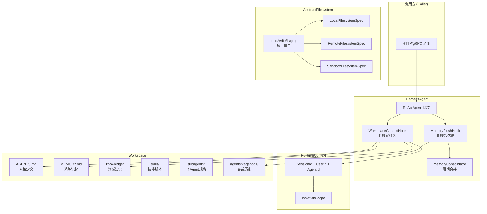
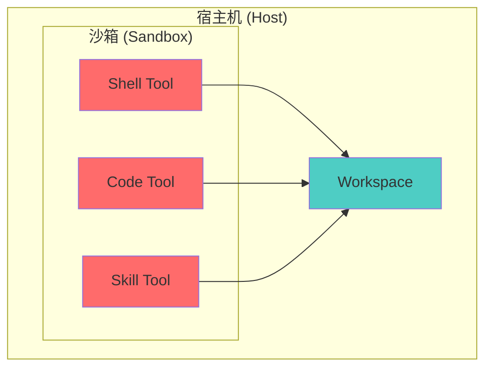
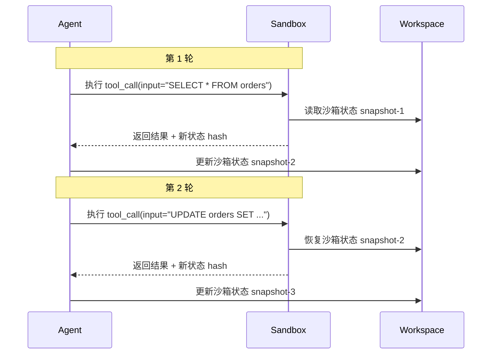

# AgentScope Java Harness Framework 2.0 — 企业级 Agent 分布式场景的 Harness 实现 (Java 2.0 重大升级)

## Ch03.050 AgentScope Java Harness Framework 2.0 — 企业级 Agent 分布式场景的 Harness 实现 (Java 2.0 重大升级)

> 📊 Level ⭐⭐ | 45.8KB | `entities/agentscope-java-harness-framework-enterprise-distributed.md`

## 背景：个人助手型 Agent 与企业级 Agent 是两种工程形态

个人助手型 Agent（OpenClaw/Hermes/Claude Code）以本地目录为工作区，单机单用户运行良好，但直接平移到企业场景面临五个核心障碍：

1. **多用户多副本**：工作区需同时满足多用户隔离与多副本共享，传统单机文件系统无法应对。
2. **隔离执行**：Tool/Skill Script 不能在宿主机直接运行，需要沙箱支持多轮状态可恢复。
3. **分布式文件系统**：Workspace + 文件系统如何适配 OSS/Redis/KV 等分布式存储介质？
4. **Multi-Agent 编排**：子任务分发、上下文隔离、异步执行、结果回收、超时取消等工程挑战。
5. **开箱即用上下文管理**：压缩时机、压缩策略、历史可检索、跨进程重启恢复。

> [!concept]
> 这些障碍的根源在于：个人助手型 Agent 和企业级 Agent 是两种截然不同的工程形态，后者需要系统性架构设计而非简单的能力叠加。

## AgentScope Java 1.1.0 四项核心能力

AgentScope Java 1.1.0 通过四项核心能力回应上述挑战：

1. **工作区驱动的 Agent 运行环境**：人格、知识、技能、记忆、子 Agent 规格统一沉淀在结构化工作区，每次运行自动加载上下文、结束后自动回写记忆。
2. **可插拔的抽象文件系统**：本机磁盘、远端共享存储、隔离沙箱通过同一套接口操作，实现一套 Agent 逻辑从个人到企业的全场景适配。
3. **开箱即用的上下文管理**：内置对话压缩 + 双层记忆沉淀 + 全文检索，解决长对话上下文膨胀和跨会话记忆丢失问题。
4. **子 Agent 编排与隔离执行**：声明式定义子 Agent、同步/异步委派；沙箱内工具执行，多轮对话间沙箱状态可恢复。

## 架构总览



> [!architecture]
> **设计原则**：HarnessAgent 是唯一入口，RuntimeContext 携带身份上下文，AbstractFilesystem 屏蔽底层存储差异，Workspace 是所有持久化内容的载体。

## 核心支柱一：Workspace 作为唯一事实来源

Harness 为每个 Agent 引入结构化的 workspace 工作空间，作为所有持久化内容的唯一载体。Workspace 目录结构如下：

| 目录/文件 | 用途 |
|-----------|------|
| `AGENTS.md` | Agent 人格定义（system prompt 模板） |
| `MEMORY.md` | 长期记忆（由双层记忆系统持续精炼） |
| `knowledge/` | 领域知识库（可被检索注入上下文） |
| `skills/` | 可复用技能脚本 |
| `subagents/` | 子 Agent 规格声明 |
| `agents/<agentId>/` | 会话历史（JSONL 格式，支持跨进程恢复） |

工作原理：推理开始前，`WorkspaceContextHook` 将 `AGENTS.md`、`MEMORY.md`、`knowledge/` 自动注入 system prompt；推理结束后，`MemoryFlushHook` 提炼新事实写入记忆文件；后台 `MemoryConsolidator` 周期性地将流水账合并为精炼的长期记忆。

### Workspace 与 OpenClaw 的本质区别

| 维度 | OpenClaw | AgentScope Workspace |
|------|----------|---------------------|
| 存储介质 | 本地磁盘（单机假设） | 可插拔（Local/Remote/Sandbox） |
| 多用户隔离 | 无（单用户假设） | IsolationScope 四级隔离 |
| 上下文恢复 | 依赖本地文件 | JSONL + 跨进程恢复 |
| 子 Agent 继承 | 手动传递 | 声明式继承/独立配置 |
| 知识检索 | 无内置 | FTS5 全文检索 |

> [!comparison]
> OpenClaw 的 workspace 是"单机本地目录"的自然映射；AgentScope 的 Workspace 是"分布式持久化工作区"的概念抽象。

## 核心支柱二：AbstractFilesystem 统一抽象

传统本地磁盘文件系统在分布式场景下无法工作，AgentScope 提出 Filesystem 统一抽象层，提供 `read/write/ls/grep` 等标准接口，可适配本机磁盘、OSS、Redis、沙箱文件系统等任意介质：

| 模式 | 适用场景 | Shell 工具支持 |
|------|----------|---------------|
| 本机 + Shell（默认） | 个人本机应用、开发测试 | ✅ |
| 远端共享存储 | 多副本在线服务 | ❌（默认不注册） |
| 沙箱执行 | DataAgent、Coding Agent 等不可信输入 | ✅（隔离内） |

### AbstractFilesystem 接口规范

```java
public interface Filesystem {
    // 读取文件内容
    String read(String path) throws IOException;

    // 写入文件内容
    void write(String path, String content) throws IOException;

    // 列出目录内容
    List<String> ls(String path) throws IOException;

    // 全文搜索
    List<GrepResult> grep(String pattern, String path) throws IOException;

    // 文件存在检查
    boolean exists(String path);

    // 删除文件/目录
    void rm(String path) throws IOException;
}
```

### 三种模式的注册策略

```java
// 个人本机场景 - 默认全部注册
FilesystemRegistry.register(new LocalFilesystemSpec());
FilesystemRegistry.register(new SandboxFilesystemSpec());

// 企业多副本场景 - 按需注册 Remote
FilesystemRegistry.register(new RemoteFilesystemSpec(
    RemoteStorageConfig.builder()
        .type(RemoteStorageType.OSS)  // 或 Redis/KV
        .bucket("agentscope-workspace")
        .build()
));
```

> [!design]
> **对角线设计**：Local 和 Sandbox 默认开启，Remote 默认不注册——这是一个务实的工程选择。企业在线服务通常不需要远程文件系统，只有多副本共享状态时才需要 OSS/Redis 后端。

## 三大工程能力

### 安全与隔离

Shell/Code/Skill 在沙箱后端隔离执行，不直接在宿主机运行；工作区本身也可运行在沙箱内；工具注册与暴露由框架统一管理。

**安全边界分层**：



### 分布式部署

多副本对等部署，关键文件通过 Remote 后端路由到共享存储实现跨节点同步；`IsolationScope`（SESSION / USER / AGENT / GLOBAL）+ `RuntimeContext` 实现多租户策略。

**IsolationScope 四级隔离模型**：

| 级别 | 作用域 | 典型用途 |
|------|--------|----------|
| SESSION | 单次 `call()` 调用 | 临时状态，不跨请求共享 |
| USER | 用户级别 | 同一用户的跨会话共享 |
| AGENT | Agent 实例级别 | 多用户但同 Agent 的隔离 |
| GLOBAL | 全局共享 | 跨 Agent 的共享知识/配置 |

### Subagent 与异步任务

子 Agent 工作区、文件系统、会话状态从父 Agent 继承或独立配置；异步任务状态机（PENDING / RUNNING / COMPLETED / FAILED / CANCELLED）开箱即用。

**子 Agent 编排模式**：

```java
// 声明式子 Agent 定义
SubAgentConfig subAgent = SubAgentConfig.builder()
    .name("data-extractor")
    .model(extractionModel)
    .workspace(childWorkspace)  // 继承或独立
    .filesystem(childFilesystem)  // 继承或独立
    .inheritContext(false)  // 是否继承父上下文
    .async(true)  // 同步或异步
    .build();

// 父 Agent 委派
agent.delegate(task, subAgent, callback);
```

## 记忆管理机制

AgentScope 的记忆管理采用双层架构：

**第一层——每日流水账**：每次对话结束后，LLM 从当次对话提炼"新增事实"，以 bullet point 追加到当日记忆文件。只追加、不修改，保证信息的完整性和可追溯性。

**第二层——长期记忆**：后台调度器周期性地将日流水账与现有 `MEMORY.md` 合并、去重、精炼，输出 Token 预算内的"可注入版"，在每次 `call()` 开始时注入上下文。

**对话压缩**：当消息数或 Token 数超过阈值，Harness 用 LLM 将之前对话压缩成摘要，保留最近若干条，其余卸载到 JSONL。压缩会在提炼长期记忆之后进行。框架自动捕获 `context overflow` 异常、强制压缩、自动重试，对调用方透明。

### 双层记忆 vs Compaction 四档策略

| 维度 | AgentScope 双层记忆 | Claude Code 四档压缩 |
|------|---------------------|----------------------|
| 第一层 | 每日流水账（追加不改） | 确定性驱逐 / LLM 总结 |
| 第二层 | 长期记忆（周期性合并精炼） | Checkpoint + 记忆迁移 / 结构化分维压缩 |
| 触发机制 | 后台调度器周期触发 | 阈值触发（消息数/Token数） |
| 可恢复性 | 流水账完整保留，可回溯 | 结构化压缩后可恢复 |
| 检索能力 | FTS5 全文检索 | 有限 |

> [!analysis]
> AgentScope 的双层记忆与 [上下文管理四档策略](ch03/044-agent.md) 中的第三代（Checkpoint + 记忆迁移）和第四代（结构化分维压缩）理念一致，但实现路径不同：AgentScope 采用"日流水账 + 周期性合并"的工程化思路，Claude Code 采用"分维保留"的结构化思路。两者都是对单层压缩局限性的超越。

## 核心概念映射

| 概念 | 定义 | 解决的问题 |
|------|------|----------|
| `HarnessAgent` | 基于 ReActAgent 的工程化封装入口 | 不想从零拼装压缩、记忆、会话、子任务、文件系统 |
| `Workspace` | Agent 的工作目录，承载全部持久化内容 | 人格、知识、记忆、状态放哪、如何持续演化 |
| `Filesystem` | 文件读写的统一接口抽象层 | 同一套 Agent 逻辑如何在本地、共享存储、沙箱间切换 |
| `RuntimeContext` | 单次 `call()` 的身份上下文 | 这一轮是谁、状态读写到哪、多租户如何隔离 |
| `Sandbox` | 隔离执行环境，状态多轮可恢复 | 如何在不信任输入下安全执行工具，并保持多轮状态连续 |
| `Memory` | 双层记忆系统（流水账 + 长期记忆） | 长对话不丢事实、上下文不爆、历史可检索 |

## RuntimeContext 与多租户隔离

`RuntimeContext` 是 AgentScope 实现多租户隔离的核心抽象：

```java
RuntimeContext ctx = RuntimeContext.builder()
    .sessionId("user-session-001")    // 会话级隔离
    .userId("alice")                   // 用户级隔离
    .agentId("my-agent")              // Agent 级隔离
    .isolationScope(IsolationScope.USER)  // 隔离粒度
    .build();
```

**跨请求会话连续**：相同 `sessionId` 的请求自动续接上下文，无需手动管理对话历史。

**多租户隔离实现**：

```java
// 路径隔离示例
String workspacePath = workspace.resolve(ctx.getUserId())
                                .resolve(ctx.getAgentId())
                                .resolve(ctx.getSessionId());

// 命名空间隔离示例
String namespace = String.format("agentscope:%s:%s:%s",
    ctx.getUserId(), ctx.getAgentId(), ctx.getSessionId());
```

> [!security]
> RuntimeContext 不仅传递身份信息，还参与文件路径和命名空间的构造，从根本上保证多租户数据隔离。

## Sandbox 隔离执行机制

Sandbox 是 AgentScope 安全架构的核心组件，解决"用户驱动的代码不能无限制运行"的问题。

### 多轮状态可恢复



### Sandbox vs 直接执行

| 维度 | 直接执行（宿主机） | Sandbox 隔离执行 |
|------|-------------------|------------------|
| 安全性 | ❌ 用户代码直接访问系统 | ✅ 受限资源访问 |
| 状态持久 | 进程级，跨轮丢失 | ✅ 快照保存/恢复 |
| 资源限制 | 无 | ✅ CPU/内存/时间限制 |
| 网络访问 | 完全 | ✅ 可配置白名单 |
| 文件系统 | 完全 | ✅ 限定目录 |

> [!warning]
> Sandbox 的性能开销需要评估：状态快照和恢复涉及序列化/反序列化，对高频短任务场景可能有显著延迟影响。

## 典型使用场景

### 个人代理 Agent（OpenClaw 类应用）

核心诉求：让 Agent 真正了解用户、记住用户。能力集：持续记忆、本地 Shell 执行、工作区即配置、会话跨进程恢复。

**配置示例**：

```java
HarnessAgent agent = HarnessAgent.builder()
    .name("personal-assistant")
    .model(model)
    .workspace(Paths.get(".agentscope/personal"))
    .filesystem(new LocalFilesystemSpec())  // 本机磁盘
    .compaction(CompactionConfig.builder()
        .triggerMessages(50)
        .keepMessages(20)
        .build())
    .build();
```

### 企业级数据服务（DataAgent）

核心诉求：执行安全（用户驱动的代码不能无限制运行）、多副本体验一致。能力集：隔离沙箱执行、多轮沙箱状态恢复、分布式记忆共享、子 Agent 并行编排、多租户隔离。

**配置示例**：

```java
HarnessAgent agent = HarnessAgent.builder()
    .name("data-agent")
    .model(model)
    .workspace(Paths.get(".agentscope/data-agent"))
    .filesystem(new SandboxFilesystemSpec())  // 沙箱隔离
    .remoteFilesystem(remoteConfig)  // 分布式记忆共享
    .compaction(CompactionConfig.builder()
        .triggerMessages(30)
        .keepMessages(15)
        .build())
    .build();
```

### 企业在线服务（淘天交易 Agent）

核心诉求：稳定与安全，不需要 Shell。能力集：默认安全边界（不开启沙箱则不暴露 Shell）、多实例共享记忆、会话跨请求连续、并行子任务支持。

**配置示例**：

```java
HarnessAgent agent = HarnessAgent.builder()
    .name("trading-agent")
    .model(model)
    .workspace(Paths.get(".agentscope/trading"))
    .filesystem(new RemoteFilesystemSpec(ossConfig))  // 多副本共享
    .enableShell(false)  // 默认关闭 Shell
    .compaction(CompactionConfig.builder()
        .triggerMessages(100)
        .keepMessages(50)
        .build())
    .build();
```

## Quick Start 示例

```java
// 引入依赖
// <dependency>
//     <groupId>io.agentscope</groupId>
//     <artifactId>agentscope-harness</artifactId>
//     <version>${agentscope.version}</version>
// </dependency>

// 准备工作区：创建 workspace/AGENTS.md

// 构建 HarnessAgent
HarnessAgent agent = HarnessAgent.builder()
    .name("my-agent")
    .model(model)
    .workspace(Paths.get(".agentscope/workspace"))
    .compaction(CompactionConfig.builder()
        .triggerMessages(50)  // 消息数超过 50 触发压缩
        .keepMessages(20)     // 保留最近 20 条
        .build())
    .build();

// 构建运行时上下文
RuntimeContext ctx = RuntimeContext.builder()
    .sessionId("user-session-001")  // 相同 sessionId 自动续接上下文
    .userId("alice")               // 多用户场景必传，用于命名空间隔离
    .build();

// 调用 Agent
Msg reply = agent.call(userMessage, ctx).block();
```

## 在 Harness 工程体系中的坐标

### 与其他 Harness 框架的对比

| 框架 | 生态 | 存储假设 | 隔离级别 | 记忆机制 |
|------|------|----------|----------|----------|
| AgentScope Java | Java | 可插拔 | 四级多租户 | 双层记忆 + FTS5 |
| OpenClaw | Python | 本机磁盘 | 单机单用户 | MEMORY.md |
| Claude Code | TypeScript | 本机磁盘 | 单机单用户 | 结构化分维压缩 |
| LangChain Agents | Python | 内存/向量 | 应用级 | 向量检索 |

> [!analysis]
> AgentScope Java 的设计目标与 [Harness Engineering 系统梳理](ch05/061-harness-engineering.md) 中描述的"七环节控制回路"完全对齐：Workspace 对应 State 层、AbstractFilesystem 对应 Tools 层、RuntimeContext 对应身份和隔离层、Memory 对应 Harness Update 层。

### 与阿里 Java 案例的关联

[阿里 Java Harness 案例](ch05/061-harness-engineering.md) 揭示的企业级挑战（隐性知识问题、质量控制缺失、熵累积），正是 AgentScope 设计时重点解决的问题：

- **隐性知识** → `knowledge/` 目录 + FTS5 检索
- **质量控制** → Sandbox 隔离执行 + 端到端验证
- **熵累积** → 双层记忆精炼 + 周期合并机制

## 技术定位与生态意义

AgentScope Java 1.1.0 的发布标志着 Java 生态首次拥有了成熟的 Harness Framework。在此之前，Harness 理念主要在 Python 生态（如 LangChain Agents）中落地，Java 开发者缺乏统一框架来工程化 Agent 应用。企业级场景对多租户、分布式、隔离执行的要求，与个人助手型 Agent 的简单本地运行范式存在根本差异，AgentScope 通过 Workspace、AbstractFilesystem、RuntimeContext、Memory 四大核心抽象，系统性地解决了这一 gap。

> [!significance]
> 从 [Harness Engineering 框架](https://github.com/QianJinGuo/wiki/blob/main/concepts/harness-engineering-framework.md) 的视角看，AgentScope 是 Java 生态对"第三代工程范式"的首次完整实现。

## 当前局限性

1. **RemoteFilesystem 依赖外部存储**：OSS/Redis 需要额外的运维资源和一致性保证
2. **沙箱性能开销**：状态快照和恢复涉及序列化/反序列化，对高频短任务有延迟影响
3. **多租户资源配额**：框架层面尚未支持资源配额和限流机制
4. **组合场景描述不足**："多副本水平扩展 + 隔离沙箱执行"组合场景的文档缺失

## 深度分析

### 架构定位：填补 Java 生态的 Harness 空白

AgentScope Java 1.1.0 的核心价值在于填补了 Java 生态缺乏成熟 Agent 工程框架的空白 。在此之前，Harness 理念主要在 Python 生态（LangChain Agents）落地，Java 开发者缺乏统一框架。AgentScope 通过 Workspace、AbstractFilesystem、RuntimeContext、Memory 四大核心抽象，系统性地解决了企业级场景的工程化难题 。

### Workspace 抽象的工程哲学

Workspace 作为"唯一事实来源"，本质上是将 Agent 的全部持久化状态统一到一个结构化目录中 。这一设计体现了"配置即代码"的工程哲学——AGENTS.md 定义人格、knowledge/ 承载知识、skills/ 管理技能、MEMORY.md 沉淀记忆，所有内容都版本可控、可审查、可恢复 。

相比 OpenClaw 的本地目录假设，AgentScope 的 Workspace 是分布式持久化工作区的概念抽象，支持多副本共享和多租户隔离 。

### AbstractFilesystem 的"对角线设计"

AbstractFilesystem 的三种模式注册策略（Local + Sandbox 默认开启，Remote 默认不注册）体现了一种务实的"对角线设计"思想 。企业在线服务通常不需要远程文件系统，只有多副本共享状态时才需要 OSS/Redis 后端。这种按需注册的模式避免了过度工程化，同时保持了扩展能力 。

Filesystem 统一抽象层的价值在于：一套 Agent 逻辑可以从个人本机（LocalFilesystem）平滑切换到企业分布式（RemoteFilesystem），无需修改业务代码 。

### 双层记忆 vs 单层压缩的范式差异

AgentScope 的双层记忆系统（日流水账 + 周期合并精炼）与 Claude Code 的四档压缩策略代表了两种不同的记忆管理范式 。AgentScope 采用"日流水账 + 周期性合并"的工程化思路，强调信息完整性和可追溯性；Claude Code 采用"分维保留"的结构化思路，强调记忆的可用性 。

两种思路的共同点是：都认识到单层压缩的局限性，都通过多层机制超越它。区别在于侧重点不同——前者侧重"不丢信息"，后者侧重"高效复用" 。

### Sandbox 隔离的工程权衡

Sandbox 设计需要在安全性与性能之间做出权衡 。状态快照和恢复涉及序列化/反序列化，对高频短任务可能有显著延迟影响 。但这个代价换来的是：不受信任的输入可以被安全执行，多轮对话间状态连续，资源访问可控 。

对于 DataAgent 等不可信输入场景，Sandbox 是必要的；对于企业在线服务等可信场景，可以选择不开启 Sandbox 。

## 实践启示

### 对于企业 Agent 架构设计者

1. **从个人助手型到企业型的架构迁移**：不要试图将个人助手型 Agent（OpenClaw）直接平移到企业场景。两者的工程形态根本不同，需要系统性架构设计 。

2. **Workspace 作为核心抽象**：优先设计好 Workspace 的目录结构和内容规范。AGENTS.md、MEMORY.md、knowledge/、skills/、subagents/ 的职责划分决定了 Agent 的可维护性 。

3. **Filesystem 抽象预留扩展能力**：即使当前只需要 LocalFilesystem，也通过 AbstractFilesystem 接口编程。这为未来的分布式扩展保留可能性 。

### 对于多租户系统开发者

1. **RuntimeContext 是多租户隔离的核心**：从一开始就基于 RuntimeContext 构建身份上下文，不要等到后期再补救。IsolationScope 的四级隔离（SESSION/USER/AGENT/GLOBAL）覆盖了常见的多租户场景 。

2. **路径隔离与命名空间隔离双重保护**：RuntimeContext 不仅传递身份信息，还参与文件路径和命名空间的构造，从根本上保证多租户数据隔离 。

3. **跨请求会话连续的工程实现**：相同 sessionId 自动续接上下文，但需要处理 session 过期、跨节点恢复等边界情况 。

### 对于记忆系统设计者

1. **流水账 + 精炼的两层架构值得借鉴**：日流水账只追加不修改，保证信息完整性；周期合并去重精炼，控制上下文膨胀 。

2. **FTS5 全文检索是记忆可用的关键**：没有检索能力的记忆只是存储。有了 FTS5，历史信息才能被按需调用 。

3. **压缩触发时机需要调参**：CompactionConfig 的 triggerMessages 和 keepMessages 需要根据实际对话长度分布来调参，不存在一刀切的最优值 。

### 对于安全架构设计者

1. **沙箱隔离是处理不可信输入的必要手段**：如果 Agent 需要处理用户提供的代码、SQL 等不可信输入，必须使用 Sandbox 。

2. **工具注册与暴露由框架统一管理**：不要让 Agent 直接调用系统命令，所有工具都通过框架注册和暴露，便于审计和控制 。

3. **RemoteFilesystem 的安全边界**：OSS/Redis 等远程存储需要额外的访问控制和传输加密，不要假设远程存储本身是安全的 。

---

## 相关实体

- [Agent Harness 架构](ch03/044-agent.md)
- [OpenClaw Prompt/Harness](ch11/210-openclaw.md)

→ [原文存档](https://raw.githubusercontent.com/QianJinGuo/wiki/main/raw/articles/agentscope-java-harness-framework-enterprise-distributed.md)

---

# AgentScope Java 2.0 重大升级（2026-06 第二来源）

> "**对企业用户而言，让一个智能体跑通一次通常不是问题，难的是让它长期稳定地运行、支持分布式部署与多租户隔离等。**"

**继 Python、TypeScript 版本相继升级到 2.0 之后，AgentScope Java 2.0 正式发布**——这是 AgentScope 多语言体系迈向 JVM 生态与企业级生产场景的重要一步。

**2.0 升级围绕 9 大主题**（每节标题都带"Cloud Native"标签 — **阿里云云原生**出品）：

- [agentrun：阿里云多 agent 生产级协作方案（a2a 开放协议）](ch03/044-agent.md)
- [这个开源 agent 框架的核心设计，可能是目前最「聪明」的取舍](ch03/044-agent.md)

## ① 企业级分布式部署 — 无状态水平扩展 + 零停机发布 + 多租户隔离

**3 大工程化设计**：

### 1. 分布式的会话与沙箱管理

- **单机开发阶段**：会话状态默认落到 `workspace` 工作区目录，**零配置开箱即用**
- **进入生产部署**：把状态后端替换为分布式存储
  - 对话历史 / 上下文摘要 / 计划进度 / 待办列表 / 权限规则等运行时状态**统一外置**
  - 任意副本都能拉到完整快照接续工作
- **沙箱模式多走一步**：智能体在容器内积累的可执行环境（已克隆的代码仓库、装好的依赖、临时文件）**每次调用结束打包成快照** → 落到对象存储或 Redis
  - 容器漂到其他节点时，**下一次调用可从快照重建完全相同的工作区**
  - 用户感知不到节点切换
- **装配阶段校验一致性**：使用了沙箱或远端存储却忘了把会话状态也换成分布式后端，**启动时就会直接报错**（避免上线后才发现状态丢失）

### 2. 多租户隔离贯穿整个执行链路

- `RuntimeContext` 的 `userId` / `sessionId` **不只是日志字段**
- 直接贯穿**工作区路径 + KV 命名空间 + 沙箱环境**
- 框架**沿着工作区路径、存储命名空间、沙箱状态槽一路传下去**，参与每一次资源寻址
- **开发者只需要按业务语义挑一档隔离粒度**：
  - 每段对话各跑各的
  - 同一用户的多次会话共享工作区
  - 公共工具型智能体全员共享
  - 全局共享
- **"谁能看到谁的数据"被推给系统强制约束**（而非依赖业务代码自觉）

### 3. 统一抽象的文件系统层

- **所有文件操作（读写、检索、上传下载）收敛到 `AbstractFilesystem` 文件系统抽象**
- 每次调用都自动带上当前会话与用户的身份信息
- 框架据此把读写动作隔离到对应租户的命名空间
- **三类后端共用同一套上层语义**：本地磁盘 / 容器沙箱 / 远端存储
- **开发 → 测试 → 生产三段部署路径不需要改代码**

## ② Harness — 把"长期稳定运行"沉淀为框架内核实现

**核心抽象**：`HarnessAgent` —— **ReActAgent 之上的工程化封装**

**关键设计原则**：
- **核心 ReAct 推理循环原样保留**
- 围绕长期稳定运行所需的能力**全部打包进单一 builder**：
  - 工作区
  - 长期记忆
  - 上下文压缩
  - 子智能体编排
  - 沙箱隔离
  - 计划模式
- **从 ReActAgent 起步，需要长期稳定运行时无缝迁移到 HarnessAgent**
- **业务代码无须改动**

**Builder 范式示例**：

```java
HarnessAgent agent = HarnessAgent.builder()
    .name("demo-agent")
    .model("dashscope:qwen-max")                              // ModelRegistry 解析
    .workspace(Paths.get(".agentscope/workspace"))             // AGENTS.md / MEMORY.md / skills / subagents
    .filesystem(new DockerFilesystemSpec()                    // 沙箱执行: 本地/Docker/远端KV 一行切换
        .isolationScope(IsolationScope.USER))                 // 同一用户跨会话共享
    .build();
agent.call(msg, RuntimeContext.builder()
    .sessionId("demo").userId("alice").build()).block();
```

**Harness 对应的不是某项新模型能力，而是真实生产场景里那些"上线前看不到、上线后绕不开"的工程问题**：
- 身份持续注入
- 上下文规模可控
- 状态可恢复
- 能力可沉淀

**"只叠加，不替换"**：在不改写推理循环的前提下，把这些问题各自的解法**以 middleware 与 toolkit 的形式叠加到关键时机上**。

## ③ Workspace — 让执行环境与 Agent 逻辑解耦

**两层正交的抽象**：
- **工作区 = 智能体执行环境的逻辑视图**
- **抽象文件系统 = 工作区的物理存储载体**
- 两者通过一套统一的目录布局解耦

### 工作区 — 标准化目录结构

**工作区把智能体长期运行所需要的全部资源组织成磁盘上的一套标准化目录**：
- 人格设定
- 长期记忆
- 领域知识
- 可复用技能
- 子智能体声明
- 工具与 MCP 白名单
- 运行时产出的会话快照与对话日志

**关键设计**：
- 每轮推理时，框架**按需把这些资源拼进 system prompt**
- **开发者只要把工作区版本化进 Git**，智能体的"配置"就有了 PR、CR 和版本号
- **改文件即升级智能体**，不需要重启服务、更不需要改一行业务代码
- **智能体本身不依赖任何具体存储**——看到的永远是一个统一的文件视图

### 抽象文件系统 — 三类后端

| 模式 | 用途 | 特点 |
|---|---|---|
| **本地文件系统** | 宿主磁盘 | **零配置开箱即用**、适合开发与单机部署；智能体需在宿主上执行命令时**显式开启**，**仅用于你信任的本机环境** |
| **沙箱文件系统** | 容器隔离 | 工作区放进隔离容器，**所有文件读写和命令执行都自动路由进容器内部**；容器状态可按会话/用户粒度**持久化到对象存储或 Redis**；**节点切换、容器漂移后，下一次调用也能从快照重建** |
| **远端文件系统** | 远端 KV/对象存储 | 工作区直接落到远端存储后端，**多副本之间共享同一份逻辑工作区**；适合纯 Web 服务形态；可与企业现有存储基础设施天然对齐 |

**关键属性**：
- 三种模式之上是**同一套统一的文件系统语义**
- 每次读写都**带上当前会话与用户的身份信息**
- 框架**自动把数据隔离到对应租户的命名空间**
- **多租户隔离被推到底层强制约束**，业务侧不需要再自己写一遍
- **支持分层组合**：只读的团队知识库叠加在可写的会话工作区之上 — **共享底座承载共性 + 上层私有空间承载个性化状态**

> "**这种'逻辑视图 / 物理载体'的两层切分，让开发 → 测试 → 生产三段路径不再需要改代码——同一份智能体实现，按环境切换底层存储就能在本地磁盘、容器沙箱、远端存储之间自由迁移。**"

## ④ Context — 支撑长期任务的上下文管理机制

**2.0 把 Context 从"压缩历史"升级为"支撑长期任务执行的系统策略"**：

### 4 大工程化策略

1. **结构化压缩**（不只是简单摘要）：
   - 任务目标
   - 当前状态
   - 关键发现
   - 下一步计划
   - 需要长期保留的信息

2. **超大工具结果自动卸载**：
   - 动辄几十 K 字符的 `git diff` / `mvn test` 输出 / 搜索结果
   - **自动卸载到工作区**
   - 上下文里**只保留首尾摘要 + 一个 `read_file` 路径占位符**

3. **内置文件读写工具缓存**：
   - 减少重复 IO
   - **要求编辑已有文件前先读取文件内容**（提升性能和操作可靠性）

4. **context_length_exceeded 兜底**：
   - 真的撞到模型上下文上限时
   - 框架**自动触发兜底压缩重试**
   - **避免任务直接断在边界处**

> "**上下文管理在 AgentScope 2.0 中不只是'压缩历史'，而是升级为支撑长期任务执行的系统策略。**"

## ⑤ 模型接入 — 开放生态之上，加入容错能力

**继续开放的模型接入**：Qwen、Anthropic、DeepSeek、Gemini、OpenAI、Grok、Moonshot、Ollama 等

**2.0 重点不是"接入更多模型"，而是让模型调用在复杂任务中更加稳定可靠**：

### Credential + ChatModel 抽象

- 统一抽象：**每个厂商都是同一套 builder 后面的一份独立实现**

### FallbackModel 容错机制

- **通过 `FallbackModel` 包裹主模型**
- 开发者可配置：
  - **最大重试次数**
  - **备用模型链**
- 主模型不可用 / 限流 / 过载时**框架自动透明切换**
- **尽可能保持任务执行的连续性**

## ⑥ 消息与事件 — 从聊天消息升级为可交互执行流

### ContentBlock 统一承载

**消息里可能同时包含**：文本 / 图片 / 文件 / 工具调用 / 工具结果 / 模型思考 / 用户确认状态 / 外部执行结果

**AgentScope 2.0 对消息模块进行了重构**：
- **统一的 `ContentBlock` 承载以上不同的消息类型**
- Java 侧借助 **sealed class 与 record 把每一种 block 表达成强类型**
- **非法的 role × content 组合在构造期就被拦下**（**不是跑起来才报错**）
- **`DataBlock` 同时兼容 base64 与 URL 两类数据源**

### 事件系统（Event Stream）

**一次 `call()` 不再只是返回最终文本**，而是可以**通过 `streamEvents()` 流式产生类型化事件**：
- 模型调用开始
- 文本增量
- 工具调用
- 工具结果
- 用户确认
- 外部执行

**基于 Project Reactor 的 `Flux` 输出** — 前端 UI 直接订阅就能实时跟随，**不需要手动 diff 或轮询**。

**核心价值**：
- **人工确认、人工介入和外部工具执行成为框架内生能力**
- 智能体要执行敏感工具时，**可以触发用户确认**
- 工具需要在外部环境中执行时，**可以等待外部执行结果后继续任务**
- **开发者看到的不只是最终答案，而是一个可以被持续观察和继续推进的智能体执行过程**

## ⑦ 权限系统 — 让自主执行更有边界

**2.0 引入更加系统化的权限系统**：

### 3 态决策（不是 2 态）

工具调用不再是简单的允许或禁止，而是基于：
- 静态规则
- 工具类型
- 输入内容

**综合判断 → "允许 / 用户审批 / 拒绝" 三态决策**

### 自动安全检查

- **文件读写工具**：检查是否涉及**危险目录和敏感文件**
- **命令执行工具**：分析**高风险命令、动态 shell 结构和危险删除操作**
- **未知或高风险行为**：**自动进入用户审批流程（HITL）**——把决策权交回给人

## ⑧ Middleware — 让框架扩展更灵活

**把原本松散的 Hook 列表收敛成 5 个清晰阶段**：

```
onAgent → onReasoning → onActing → onModelCall → onSystemPrompt
```

**5 个阶段的关键执行环节**：
- **`onAgent`** — Agent 主流程
- **`onReasoning`** — 推理阶段
- **`onActing`** — 行动阶段
- **`onModelCall`** — 模型调用前后（日志追踪、限流）
- **`onSystemPrompt`** — system prompt 构造阶段（动态上下文注入）

**每个关注点各居其层，组合起来干净利落** — **在保持核心框架稳定的同时，为不同应用场景留下足够灵活的扩展空间**。

## ⑨ 总结

> "**AgentScope Java 2.0 进一步围绕让智能体在企业环境中可靠运行这一目标全面升级：从模型层的容错切换，到执行环境的抽象解耦；从细粒度的权限边界，到分布式 Session 与沙箱快照；从结构化的事件流式输出，到多租户隔离与可观测体系。**"

**系统性地回应了 5 大共同需求**：
1. 智能体长期运行
2. 安全调用工具
3. 持续推进任务
4. 跨副本恢复
5. 接入外部应用

## Java 2.0 vs 1.0 升级全景表

| 维度 | 1.0 | 2.0 |
|---|---|---|
| 核心抽象 | ReActAgent | **HarnessAgent = ReActAgent 之上工程化封装** |
| 部署形态 | 单机 | **无状态水平扩展 + 零停机发布 + 多租户隔离** |
| 会话状态 | 进程内 / 磁盘 | **统一外置分布式存储 + 沙箱快照** |
| 文件系统 | 单一后端 | **`AbstractFilesystem` 抽象 + 三类后端** |
| 工作区 | 隐式 | **标准化目录结构 + Git 版本化** |
| 上下文 | 简单压缩 | **结构化保留 + 超大结果自动卸载 + 兜底重试** |
| 模型调用 | 直接调 | **`FallbackModel` 包裹 + 重试 + 备用模型链** |
| 消息类型 | 字符串 | **`ContentBlock` 强类型 + sealed class** |
| 事件流 | 同步返回 | **`streamEvents()` + Project Reactor Flux** |
| 权限 | 简单允许/禁止 | **3 态决策（允许/审批/拒绝）+ HITL** |
| 扩展 | 散乱 Hook | **5 阶段 Middleware** |
| 隔离粒度 | 用户级 | **4 档粒度（每段对话/同用户/公共/全局）** |
| Java 特有 | — | **sealed class + record 强类型** + Spring Boot 集成 + Kubernetes 友好 |

## 2.0 来源核心金句

- "**让一个智能体跑通一次通常不是问题，难的是让它长期稳定地运行**"
- "**多租户隔离被推给系统强制约束，而不是依赖业务代码自觉**"
- "**同一份业务代码，按需切换到分布式形态，任意副本都能恢复任意用户的完整上下文**"
- "**装配阶段会校验配置的一致性 —— 启动时就会直接报错，避免上线后才发现状态丢失**"
- "**Harness 对应的不是某项新模型能力，而是真实生产场景里那些'上线前看不到、上线后绕不开'的工程问题**"
- "**改文件即升级智能体，不需要重启服务、更不需要改一行业务代码**"
- "**'逻辑视图 / 物理载体'的两层切分，让开发 → 测试 → 生产三段路径不再需要改代码**"
- "**上下文管理从'压缩历史'升级为'支撑长期任务执行的系统策略'**"
- "**FallbackModel —— 主模型不可用、限流或过载时框架自动透明切换**"
- "**非法的 role × content 组合在构造期就被拦下，而不是跑起来才报错**"
- "**streamEvents() 让人工确认、人工介入和外部工具执行成为框架内生能力**"
- "**权限系统 3 态决策：允许 / 用户审批 / 拒绝**"
- "**5 阶段 Middleware：onAgent / onReasoning / onActing / onModelCall / onSystemPrompt**"

---

