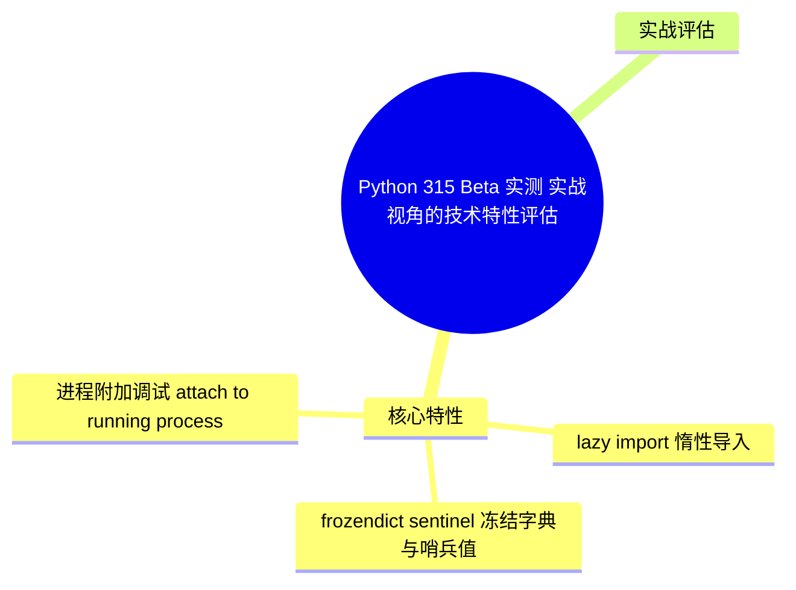
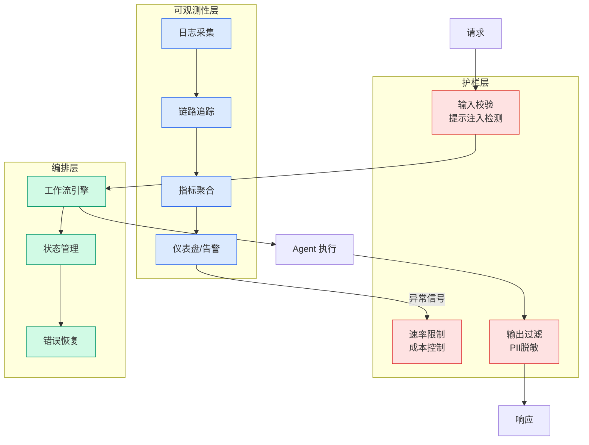

# Python 3.15 Beta 实测：实战视角的技术特性评估

## Ch03.050 Python 3.15 Beta 实测：实战视角的技术特性评估

> 📊 Level ⭐ | 3.5KB | `entities/python-315-beta-practical-test-new-features.md`

# Python 3.15 Beta 实测：实战视角的技术特性评估

> **Background**：本文基于 数据STUDIO 公众号对 Python 3.15 beta 1 的实测体验，从开发者实际项目的视角评估了该版本的关键改动：惰性导入、冻结字典与哨兵值、以及进程附加调试等特性。文章以"会不会真的塞进项目里"为排序标准，而非 Release Notes 的顺序。


## 概念导图



## 核心特性

### 1. `lazy import` — 惰性导入

Python 3.15 引入 `lazy` 作为**软关键字**（仅在 import 语句中生效，不影响变量命名），实现模块的延迟加载。背后的机制是：Python 先创建一个代理对象，真正的 import 延迟到**第一次访问被导入名字**时发生。

**解决的问题**：CLI 工具或多依赖项目启动时，入口文件 import 框架 → 框架拖入多个工具模块 → 每个模块再拽入十几个依赖。用户只敲 `--help`，什么业务都没跑，先原地等 2 秒。以前只能把 import 往函数体里塞，代码变得别扭，难以判断是刻意优化还是顺手写的。

**示例用法**：
```python
lazy import json
lazy import pandas as pd
lazy from pathlib import Path

print("Starting up...")  # 立刻打印，模块还没加载

data = json.loads('{"name": "Yang"}')  # json 在这里才真正 import
path = Path(".")  # pathlib 在这里才真正 import
```

**全局开关**（用于 staging/production 分环境控制）：
- `-X lazy_imports` 命令行参数
- `PYTHON_LAZY_IMPORTS` 环境变量
- `sys.set_lazy_imports()` 运行时开关

**注意事项**：有些模块在 import 时会连接数据库、注册 hook、加载插件、修改全局状态——这类代码一旦被延迟，问题可能在业务路径第一次访问时才暴露，排查更困难。建议先从显式 `lazy import` 开始，标记确定无副作用的模块。

### 2. `frozendict` + `sentinel` — 冻结字典与哨兵值

两个写了十年的 workaround，终于有了标准实现：
- **`frozendict`**：不可变字典，解决了长期以来用 `types.MappingProxyType` 或第三方库模拟的需求
- **`sentinel`**：标准哨兵值，替代 `object()` 或自定义 `_MISSING = object()` 的模式

### 3. 进程附加调试（attach to running process）

允许直接附加到正在运行的生产进程进行调试——对于排查生产环境偶发问题有重大实战价值。

## 实战评估




文章的特色在于以"会不会真的塞进项目里"为标准对特性排序：
- **最想用**：`lazy import` — 解决 CLI 工具启动慢的经典工程问题
- **最实用**：`frozendict` — 替代十余年的土办法
- **最后手段**：进程附加调试 — 生产环境救急

→ [原文存档](https://github.com/QianJinGuo/wiki-book/tree/main/docs/raw/articles/python-315-beta-practical-test-new-features.md)

---
## 关联
- 相关概念: [Harness Engineering](https://github.com/QianJinGuo/wiki/blob/main/concepts/harness-engineering-framework.md)

---

