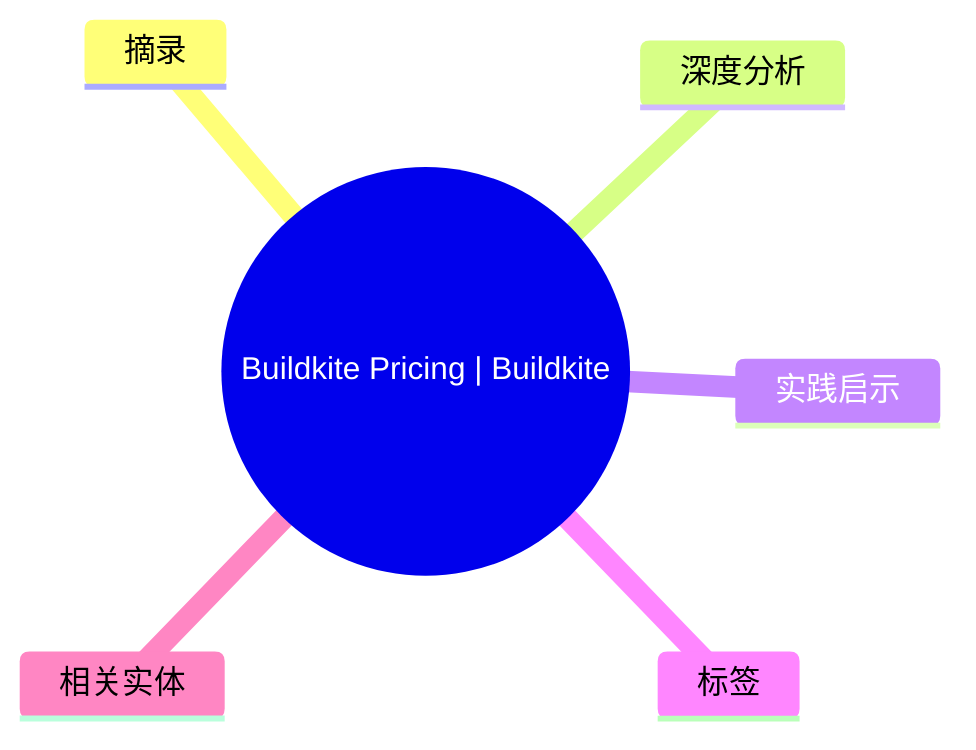
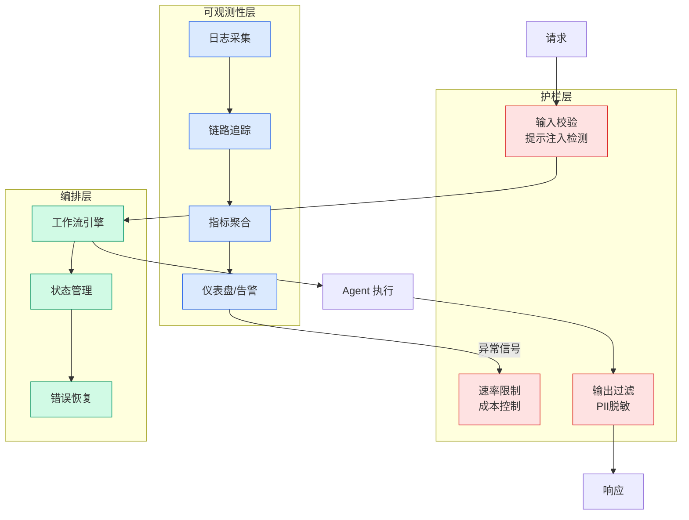

# Buildkite Pricing | Buildkite

## Ch03.051 Buildkite Pricing | Buildkite

> 📊 Level ⭐ | 3.2KB | `entities/buildkite-pricing-buildkite-v2.md`

→ 原文存档

## 概念导图

## 摘录
> Title: Buildkite Pricing
URL Source: https://buildkite.com/pricing
Published Time: Sun, 10 May 2026 19:08:21 GMT
Markdown Content:
Buildkite Pricing | Buildkite
   Platform### Capabilities
Pipelines→ Build the CI/CD workflows you need.## Test Engine→ Remove flaky tests, split tests, optimize performance.## Package Registries→ Speed up builds, lock down security.## Mobile Delivery Cloud→ Supercharge your mobile app delivery.  ### Flexible compute
Self-hosted agentsMac hosted agentsLinux hosted agents

## 深度分析

Buildkite 的定价页面揭示了 CI/CD 平台在 2026 年的竞争格局已从单纯的"构建时长计费"演变为"能力模块化订阅"。其四大核心能力——Pipelines、Test Engine、Package Registries、Mobile Delivery Cloud——覆盖了从代码提交到生产发布的完整链路，这意味着 Buildkite 正在从纯粹的构建执行工具向端到端发布平台转型。
**定价结构的分层逻辑**：页面突出"Flexible compute"，明确区分 self-hosted agents、Mac hosted agents 和 Linux hosted agents 三种计算环境。这种分层暗示了企业在 CI/CD 场景中的异构需求——iOS/macOS 开发需要 Apple 硬件，而 Web 服务通常跑在 Linux 上。Buildkite 不再要求所有工作负载使用同一套基础设施，客观上降低了迁移成本。
**Test Engine 的定位值得注意**：页面将"Remove flaky tests, split tests, optimize performance"作为独立能力模块推广，说明 Buildkite 认定 flaky test 是企业级 CI/CD 的核心痛点之一。这与社区中大量关于 test flakiness 讨论的现状吻合——flaky tests 直接影响构建可靠性，进而影响团队对 CI 系统的信任度。
**Mobile Delivery Cloud 的独立推广**：将移动端交付作为单独模块，说明 Buildkite 观察到移动应用发布的特殊性——签名、OTA、分发、版本管理——与 Web CI/CD 有本质区别，独立产品线有助于专门优化这一工作流。

## 实践启示
1. **选型评估时关注能力边界而非单一价格**：Buildkite 的定价模块化意味着同一团队可能需要 Pipeline + Test Engine + Package Registries 的组合，而非购买一个"全功能版本"。评估时应对照自身工作流，确认需要哪些模块。
2. **移动端 CI 优先考虑专用平台**：Mobile Delivery Cloud 的独立存在说明通用 CI 系统处理移动发布时存在效率损耗。如果你的团队同时有 iOS/Android 应用和 Web 服务，评估移动端发布是否值得使用专门工具链。
3. **关注 Test Engine 的集成方式**：作为外部引入的能力（而非纯自研），Test Engine 的集成方式决定了它能否与现有测试套件兼容。在选型时应实际运行一个包含 flaky tests 的样本构建，观察识别和分组的准确率。

## 标签
- source/newsletter

## 相关实体
- [Buildkite Pricing | Buildkite](ch03/051-buildkite-pricing-buildkite.html)

---
## 关联
- 相关概念: [Harness Engineering](https://github.com/QianJinGuo/wiki/blob/main/concepts/harness-engineering-framework.md)

---

