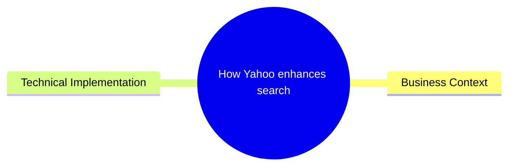
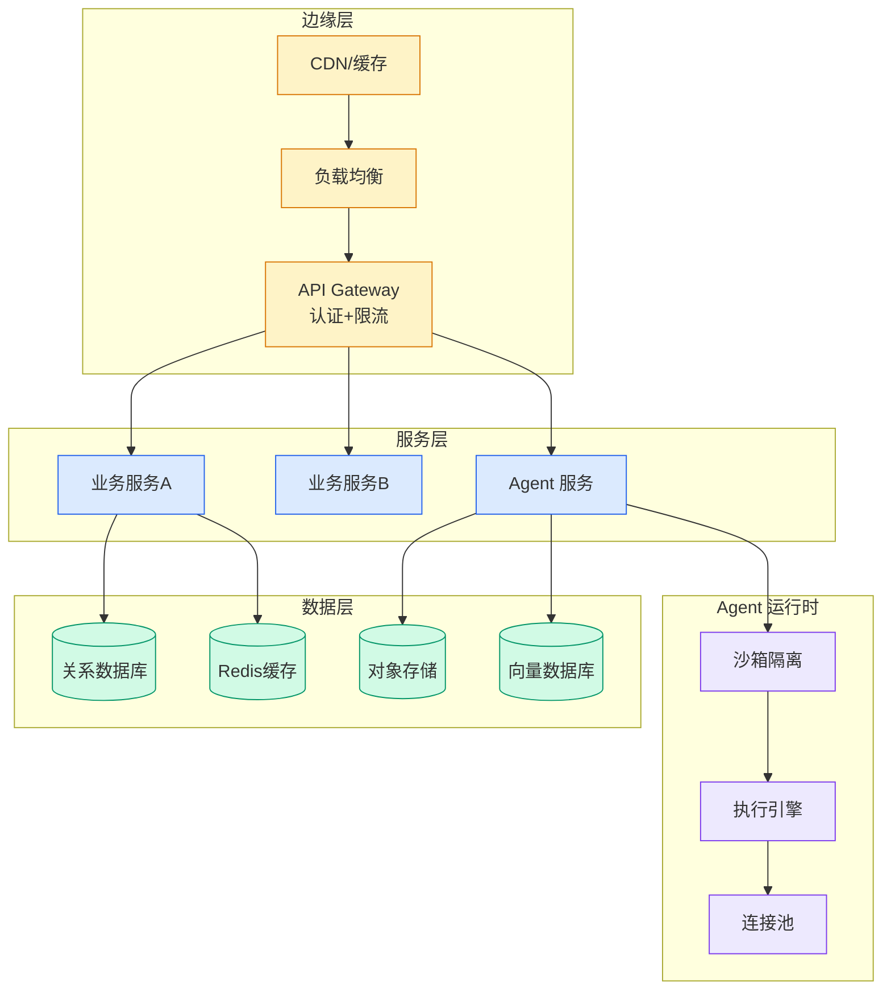

# How Yahoo enhances search retargeting using Amazon Bedrock

## Ch03.052 How Yahoo enhances search retargeting using Amazon Bedrock

> 📊 Level ⭐ | 2.0KB | `entities/how-yahoo-enhances-search-retargeting-using-amazon-bedrock.md`

# How Yahoo enhances search retargeting using Amazon Bedrock

> **Background**: Based on the AWS ML Blog article describing Yahoo's implementation of Amazon Bedrock to enhance Search Retargeting (SRT) capabilities in their omnichannel Demand-Side Platform (DSP).

## 概念导图

## Business Context

Yahoo's omnichannel DSP enables advertisers to purchase ad inventory across multiple exchanges and channels through a single interface. Search Retargeting (SRT) is a core audience targeting solution that helps advertisers reach users based on their historical search behavior, bridging search intent with display, video, and native advertising.

Traditional keyword expansion approaches struggle with outdated vocabulary, limited semantic understanding, and inability to capture nuanced meaning behind search queries.

## Technical Implementation

Yahoo implemented Amazon Bedrock to enhance their SRT capabilities using:

- **ML-based audience segmentation**: Using advertiser-defined rules, ML, and generative AI to define audience segments
- **Search intent bridging**: Connecting search activity on Yahoo Search and integrated partner systems with ad targeting
- **Semantic understanding**: Using LLMs to go beyond simple keyword matching to understand the nuanced meaning behind search queries

The system targets users based on demonstrated interests and behaviors, particularly their search activity, which is one of the strongest signals of user intent.

→ [原文存档](https://github.com/QianJinGuo/wiki-book/tree/main/docs/raw/articles/how-yahoo-enhances-search-retargeting-using-amazon-bedrock.md)

---

