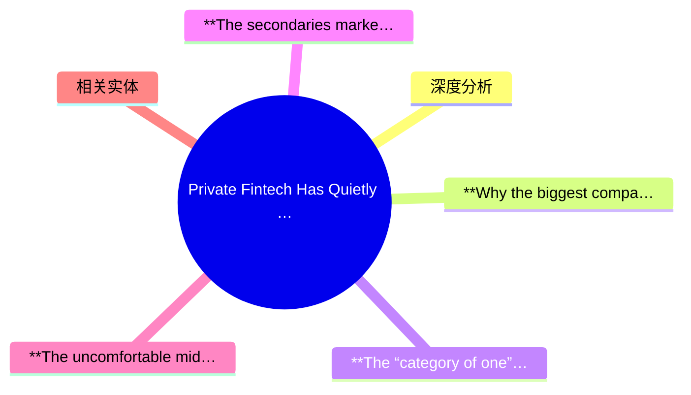
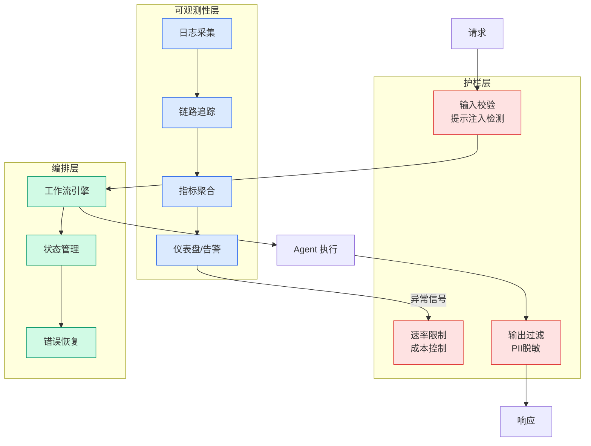

# Private Fintech Has Quietly Become Bigger Than Public Fintech

## Ch03.108 Private Fintech Has Quietly Become Bigger Than Public Fintech

> 📊 Level ⭐⭐ | 6.4KB | `entities/private-fintech-vs-public-fintech.md`

# Private Fintech Has Quietly Become Bigger Than Public Fintech

## 概念导图

## 深度分析

Published Time: 2026-05-28T21:28:52+00:00

Markdown Content:
The top 100 private fintech companies in the world are now worth $1.9 trillion, nearly three times the combined market cap of the 100 largest public fintechs founded in the last twenty years. They generate about 10% more revenue, too. That’s the headline finding from a new [report](https://bluedotinvestors.com/research/bluedot-ft-partners-report) jointly produced by Blue Dot Investors and FT Partners, and it should make every fintech founder, investor, and board member rethink what “winning” looks like.

For most of the last decade, the assumed endgame for a successful fintech was an IPO. That assumption is breaking down. The companies people most want to own, including Stripe, Revolut, and Ramp are private, growing fast, and showing no urgency to change that. When I sat down with Sahej Suri, founder of Blue Dot Investors and Steve McLaughlin, founder of FT Partners, to walk through the data, both made the same point in different ways: the private market is not the waiting room anymore. It’s the destination.

## **Why the biggest companies are choosing to stay home**

Steve put it as plainly as I’ve heard anyone say it: “You’re starting to see a world where there are going to be trillion-dollar fintech companies and they could be private. It’s a state of the world where you just don’t need to be a public company anymore. There’s plenty of capital available.”

That is a remarkable sentence from someone who has spent 25 years arranging private capital raises, IPOs and fintech M&A. And the data backs him up. The cohort is concentrated, though. The top ten private fintechs account for 60% of the $1.9 trillion in total valuation, and the same names dominate the secondary market. Stripe, Revolut, Kraken, Rippling, AlphaSense and a handful of others soak up roughly 96% of last twelve months’ executed secondary volume.

Steve’s view is that staying private is increasingly the rational choice for the very best companies. “It’s almost a good fiduciary thing for these companies to stay private. They don’t get distracted. They let people compound gains.” He pointed to the counterfactual: if Revolut had gone public at $10 billion, early shareholders would have cashed out at $12 billion and missed the ride to what is now a $75 billion-plus company that he expects could approach $200 billion within a year.

Sahej framed the same dynamic as a structural shift in how late-stage capital flows. “The Stripes and Revoluts don’t necessarily need to go public tomorrow. You’re seeing incredible amounts of liquidity through private tenders or secondary offerings today.”

## **The “category of one” question**

If private fintech is where the value is, the question becomes which companies actually deserve to be priced at these levels. Steve was direct on Revolut, where his firm raised $1.25 billion at a $33 billion valuation a few years ago: “I think they’ve got no competition globally. Revolut competes with nobody, including NuBank. They’re just on a whole other level.”

He extends the logic to Nu Holdings, which together with Revolut now serves more retail customers than Bank of America and Chase combined, 199 million versus 157 million, growing at roughly 35% a year against the incumbents’ 4%. “Nubank is in the category of one for what they do, lending money, high interest rates, high cost of capital, but incredibly good at it.”

Sahej picked up the thread on what this means competitively for the next wave. “You’re not just competing against the big incumbents. You’re also competing against Revolut and Nubank now.” His example: Plata in Mexico, which moved Tinkoff Bank’s Russian playbook to Latin America and within three years became one of the country’s largest credit card issuers, competing simultaneously against incumbents and against the global neobanks.

## **The secondaries market is no longer a workaround**

If private fintech is the destination, secondaries are the road that gets you there. And that road got 4x bigger in 2025. Sahej’s read is that this is not a passing window. It’s permanent infrastructure being built. “We actually think this is a structural issue going forward where there’s so many high-quality companies that were created in 2012, ’13, ’14, ’15. Unless they’re going public tomorrow, which we don’t see as likely, people will still need liquidity.”

Steve, who has been in the middle of these transactions for 25 years, sees the consequence on the ground. He told me about a recent secondary deal where his firm bought a meaningful position from a founder who needed liquidity. “This company sold for 2X or almost 2X within six months.” The point isn’t the trade. It’s that real money is now being made in private markets at speeds that used to be reserved for the public ones.

## **The uncomfortable middle**

Here’s where the report’s headline finding gets complicated. The top 10 are minting wealth. The next 90 are doing fine. But there are thousands of

## 相关实体
- [5Thingstoknowabouttheclarityact](https://github.com/QianJinGuo/wiki/blob/main/entities/5thingstoknowabouttheclarityact.md)
- [Plaid Effects](../ch05/094-ai.html)
- [The Stablecoin 24X7 Money Loop Fintechbrainfood](../ch05/094-ai.html)
- [Based On Prowler Genai Build Fintech Intelligent Compliance 2](../ch11/054-prowler-genai.html)
- [Klarna Delivers Strong Start To 2026 With 1Bn Revenue And 68M Adj Operating Prof](../ch01/079-klarna-delivers-strong-start-to-2026-with-1bn-revenue-and.html)

→ [原文存档](https://github.com/QianJinGuo/wiki-book/tree/main/docs/raw/articles/private-fintech-vs-public-fintech.md)

---

