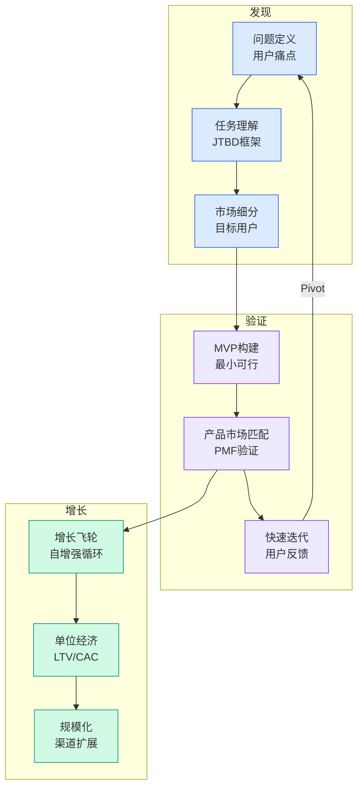

# Plaid's Effects on the Financial Ecosystem

## Ch03.124 Plaid's Effects on the Financial Ecosystem

> 📊 Level ⭐⭐ | 5.1KB | `entities/plaid-effects.md`

## 核心要点
- Plaid 主办的年度金融科技峰会，聚焦 AI 与金融服务的融合
- 2026 年主题：智能金融（Intelligent Finance），围绕 AI 在信用风险、反欺诈、支付创新中的应用
- 现场（纽约 Cipriani, 25 Broadway）和虚拟同步进行，半天议程
- 参会方涵盖传统银行（FICO、TD Bank、Truist）、金融科技（Ramp、Affirm、Brex、Copilot）、Big Tech（Databricks）及支付/加密（MoonPay）等多元生态

## 深度分析

**Plaid 的生态位：从 API 中间件到 AI 基础设施**
Plaid 起家于银行账户数据连接（Auth、Identity、Transactions），但 Effects 大会的议题结构揭示了其战略跃迁：从「让应用连接银行」的工具层，演进为「为 AI 提供金融数据燃料」的基础设施层。整场活动的主线并非某一款具体产品更新，而是系统性传递一个信息——Plaid 的网络是 AI 在金融场景落地的数据地基。
这一判断有三条证据支撑：
1. **议程设计**：开场 keynote 主题「What's next for AI in finance and what Plaid's launching to power it」将 AI 置于核心；所有分会场的分组（Agentic workflows、Personalization、Governance/Risk）均围绕 AI 工作流展开
2. **嘉宾构成**：邀请的演讲者多为各机构的 AI/ML 负责人（TD Bank VP AI/ML Practice、Brex Director of AI Products、Amex Head of AI Labs、2nd Order Head of AI），而非传统的商业或运营负责人
3. **产品发布**：四项虚拟议程发布全部围绕 AI——Cash Advance 风险识别、Plaid Protect 欺诈模型、Income 新引擎（将存款活动噪声转为稳定收入信号）、Bank Intelligence，均是 AI 推理依赖数据质量的产品化
**「智能金融」的技术含义**
从峰会内容看，「智能金融」不是营销概念，而是指 AI 系统在三个核心环节替代或增强人类决策：

- **信贷决策**：FICO 和 Affirm 的嘉宾均出席，指向信用评估与风险定价的 AI 化（Plaid LendScore、Credit-genie 也在产品列表中）
- **反欺诈**：Plaid Protect 的新模型被描述为「catch more fraud, not real users」——这是对传统规则引擎误报率高的直接回应
- **支付可靠性**：Plaid Income 新引擎将存款噪声转为可靠收入信号，直接服务于 cash advance 和贷款产品的风控
**生态聚合效应**
峰会参展商的结构本身值得分析：既有 Amex、TD Bank、Truist 等传统金融机构，也有 Ramp、Affirm、Brex 等金融科技新贵，还包括 Databricks（数据基础设施）、MoonPay（加密支付）等相邻领域。这种组合说明 Plaid 的连接范围已经远超「用户向应用授权银行数据」的原始场景，演进为横跨银行、信贷、支付、数据平台的全栈金融数据网络。
Plaid CTO Will Robinson 和 Head of Data & AI Suddu Seshadri 同时出现，表明 Plaid 正在构建自己的 AI 模型能力（而非单纯做数据管道），这对 Parse、MX 等同类竞品构成差异化压力。
**对行业的暗示**
Effects 2026 传递的隐含信号是：开放银行（Open Banking）基础设施的价值正在从「连接」迁移到「智能」——谁能提供 AI-ready 的金融数据，谁就能在下一代金融科技中占据枢纽位置。传统金融机构（FICO、TD Bank、Amex）参会而非被动，说明它们已经意识到这一迁移并积极参与生态博弈。

## 实践启示
- **对于金融科技创业者**：在构建信贷、欺诈或个性化金融产品时，优先考虑接入 Plaid 的数据层而非自建银行连接；其 AI-ready 的数据产品（如 Income、Signal）可以显著缩短模型冷启动时间
- **对于金融机构**：开放 API 不仅是合规要求（美国Regulation E/PSD2），更是导入外部 AI 创新生态的通道；Plaid 的 Permissions Manager 和 Core Exchange 产品线专门解决机构侧的数据共享控制问题
- **对于 AI/ML 工程师**：金融数据质量是模型效果的天花板——Plaid Income 新引擎解决的「存款噪声变信号」问题是一个典型特征工程挑战；收入稳定性、支出模式、多账户关联是构建金融 AI 模型的高价值特征
- **对于投资者**：Plaid 生态的广度（从 Auth 到 LendScore、从个人理财到企业支付）使其成为金融 AI 赛道的事实观察窗口；Ramp、Affirm、Brex 等高频金融场景的规模化盈利路径值得关注
## 相关实体
- [The Stablecoin 24X7 Money Loop Fintechbrainfood](../ch05/094-ai.html)
- [Affirm Maps Road To 100B Gmv With Card Ai Commerce And Global Expansion](ch03/094-affirm-maps-road-to-100b-gmv-with-card-ai-commerce-and-glo.html)
- [Affirm Maps Road To 100B Gmv With Card Ai Commerce](ch03/090-affirm-maps-road-to-100b-gmv-with-card-ai-commerce.html)
- Bnpl Walmart
- [5Thingstoknowabouttheclarityact](https://github.com/QianJinGuo/wiki/blob/main/entities/5thingstoknowabouttheclarityact.md)

→ [原文存档](https://github.com/QianJinGuo/wiki-book/tree/main/docs/raw/articles/plaid-effects.md)

---

