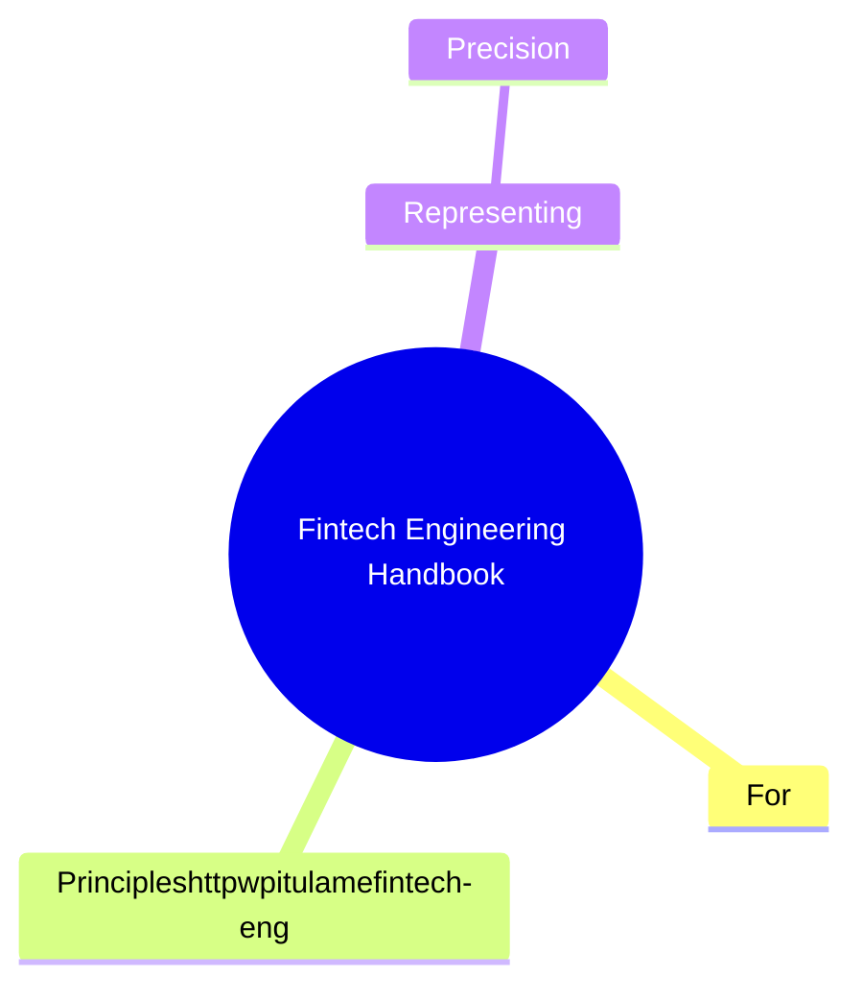
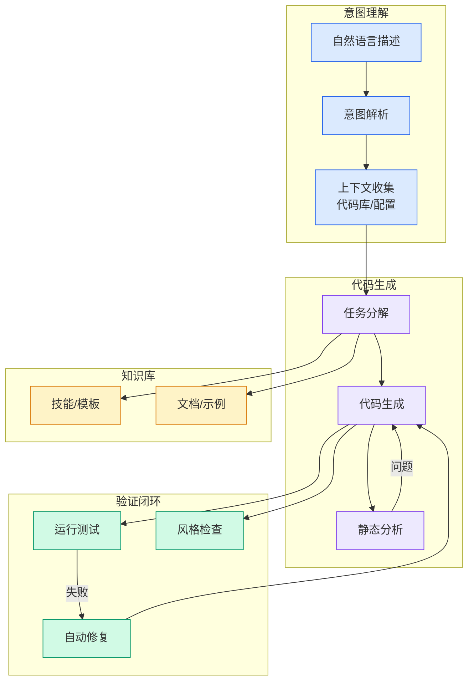

# Fintech Engineering Handbook

## Ch03.130 Fintech Engineering Handbook

> 📊 Level ⭐⭐ | 4.0KB | `entities/fintech-engineering-handbook.md`

# Fintech Engineering Handbook

> Source: [Fintech Engineering Handbook](https://w.pitula.me/fintech-engineering-handbook) | Score: v*c=48

## 概念导图

## Overview

Markdown Content:
Welcome to the Fintech Engineering Handbook. This resource aims to describe the most important patterns used in software engineering, where money is the primary focus of the system. It can be read in full to get a comprehensive understanding or in parts when dealing with a particular problem.

### For whom?

*   **People joining fintech.** To get familiar with the domain and the patterns that make money systems trustworthy.
*   **People already in fintech.** As a reference to reach for when facing a particular problem, and a shared vocabulary to point colleagues at.
*   **People outside fintech.** To understand how building for money differs from what they’re used to, and why.

To learn more about the background of this book, see [Appendix C](http://w.pitula.me/fintech-engineering-handbook#about).

## Principles

Everything you will read below is a way to adhere to the three principles:

1.   **No invented data.** Money can’t be created out of nowhere, so we can’t tolerate duplicates or arbitrary balance updates. We enforce this with idempotency, deduplication, and reconciliation.
2.   **No lost data.** Everything that happens to money has to be tracked and persisted. We protect this with full precision, at-least-once deliveries, event sourcing, audit trails, and immutability.
3.   **No trust.** Trust neither external providers, internal components, nor the world. We uphold this by verifying webhooks, cross-checking data across sources, and failing loudly on broken assumptions.

## Representing money

Before you can move or record money, you have to represent it. These are the decisions about how a monetary value is modeled, stored, computed, and converted. Getting them wrong means every layer above inherits the error.

### Precision handling

Money representation is one of the most fundamental decisions in financial systems. There are four primary ways to do it:

1.   **Floating-point.** Built-in float or double types. This can create unpredictable precision losses and is almost never a good idea. But it’s the fastest and most memory efficient, and requires no additional libraries or data structures.
2.   **Arbitrary precision.** Types like Java’s `BigDecimal` let you control the precision of a computation precisely. The code is predictable and we get to decide where and how rounding happens. It fits intermediate work like FX or pricing math, where many operations chain together.
3.   **Minor-units precision.** For most fiat currencies it’s ok to keep only a fixed precision, the same that is used in the connected central banking system. The number of digits is described by ISO 4217 (don’t assume it’s always 2, it’s not!). In practice this means storing the amount as an 

→ [原文存档](https://github.com/QianJinGuo/wiki-book/tree/main/docs/raw/articles/fintech-engineering-handbook.md)

---
## 关联
- 相关概念: [Harness Engineering](https://github.com/QianJinGuo/wiki/blob/main/concepts/harness-engineering-framework.md)

---

