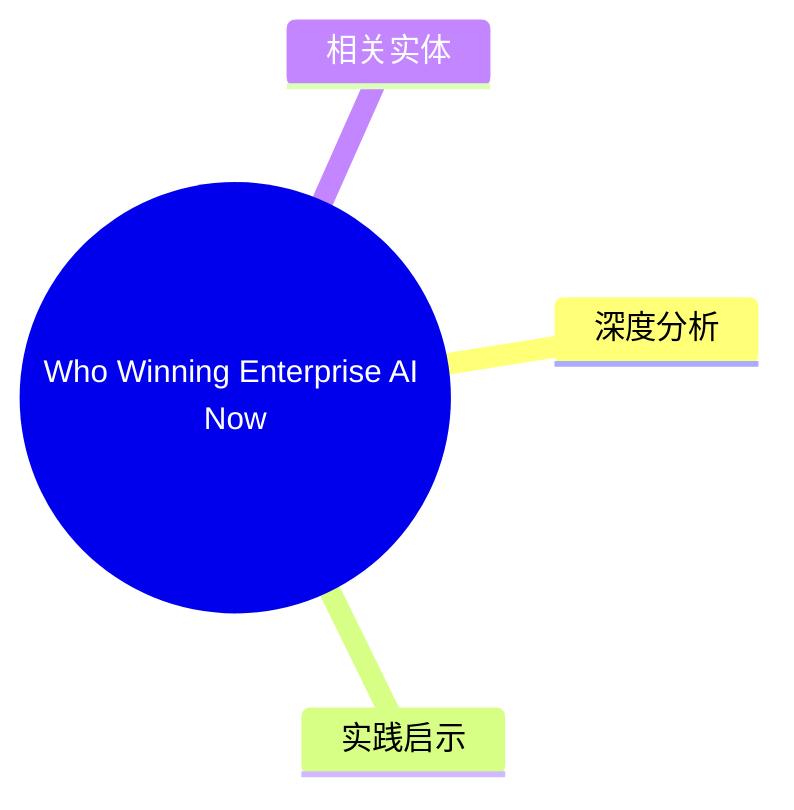
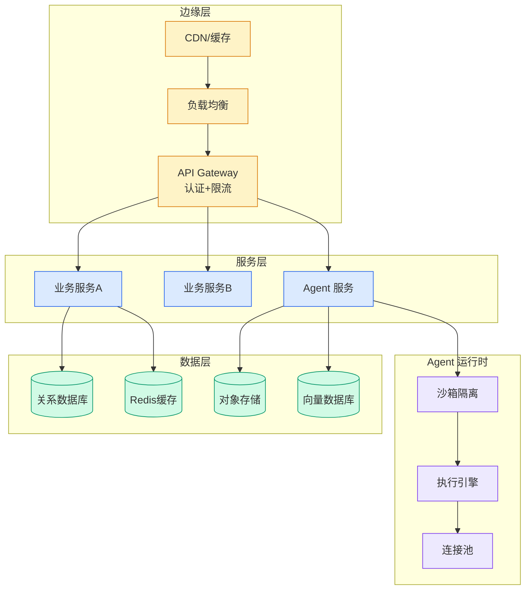

# Who Winning Enterprise AI Now

## Ch03.137 Who Winning Enterprise AI Now

> 📊 Level ⭐⭐⭐⭐⭐ | 3.5KB | `entities/saastr-who-winning-enterprise-ai.md`

> -> [原文存档](https://github.com/QianJinGuo/wiki-book/tree/main/docs/raw/articles/saastr-who-winning-enterprise-ai.md)
→ [原文存档](https://github.com/QianJinGuo/wiki-book/tree/main/docs/raw/articles/saastr-who-winning-enterprise-ai.md)

## 概念导图

## 深度分析
**企业 AI 市场格局的结构性变化**：
1. **多模型成为新默认**：ETR 数据显示四家可信供应商（OpenAI、Anthropic、Google xGroq）并存，单一模型架构已成采购风险
2. **第二名是真实业务**：Anthropic 份额从 21%→48%（翻倍+），Claude 在编码助手领域的高速增长说明"可信替代者"具有强劲的商业价值
3. **分发渠道仍是决定性因素**：Gemini 通过 Google Workspace/Vertex AI/BigQuery 预装实现 27%→40% 增长——"我们已有合同"是 2026 年企业 AI 最快推进方式
4. **编码助手驱动收入**：ETR 明确指出，编程助手是当前各大实验室收入增长最快的细分市场，高 token 消耗量拉动了企业支出
5. **OpenAI 护城河仍宽但收窄**：从领先 Anthropic 41 个百分点压缩到 8 个百分点，差距正在快速收窄
这组数据揭示了企业 AI 采购的理性回归：从早期的"OpenAI 狂热"转向基于实际集成难度、分发渠道和细分场景选择的多供应商策略。

## 实践启示

- **企业 AI 采购策略**：不要押注单一模型供应商；建立多模型评估框架，按场景（编码、文档、推理）选择最优模型
- **AI 供应商**：编码助手是当前企业 AI 的最大收入来源，也是竞争最激烈的领域——这是获客和留存的关键战场
- **分发渠道重要性**：与现有企业软件（Google Workspace、Microsoft 365、Salesforce）深度集成的 AI 产品比独立 AI 工具更具分发优势
- **技术团队**：在内部搭建 AI 能力评估平台，针对常见工作流（代码审查、数据分析、文档生成）测试各模型的实际表现
- **投资视角**：Claude 的高速增长说明"可信替代者"战略在企业市场有效；关注模型公司在编码、医疗、法律等垂直场景的专有数据积累

## 相关实体
- [AI tool poisoning exposes a major flaw in enterprise agent security](../ch04/313-ai-tool-poisoning-exposes-a-major-flaw-in-enterprise-agent-s.html)
- [Control where your AI agents can browse with Chrome enterprise policies on Amazon Bedrock AgentCore](../ch11/135-control-where-your-ai-agents-can-browse-with-chrome-enterpri.html)
- [Amazon Quick: Accelerating the path from enterprise data to AI-powered decisions](../ch11/222-amazon-quick.html)
- [用 Kiro构建 AI：基于 AWS 基础设施快速构建企业级 Agentic AI 平台 | 亚马逊AWS官方博客](../ch04/060-agentic-ai.html)

→ [原文存档](https://github.com/QianJinGuo/wiki-book/tree/main/docs/raw/articles/claude-managed-agents-self-hosted-sandbox-mcp-tunnels-enterprise.md)

- [AI tool poisoning exposes a major flaw in enterprise agent security | VentureBeat](../ch04/313-ai-tool-poisoning-exposes-a-major-flaw-in-enterprise-agent-s.html)

---
