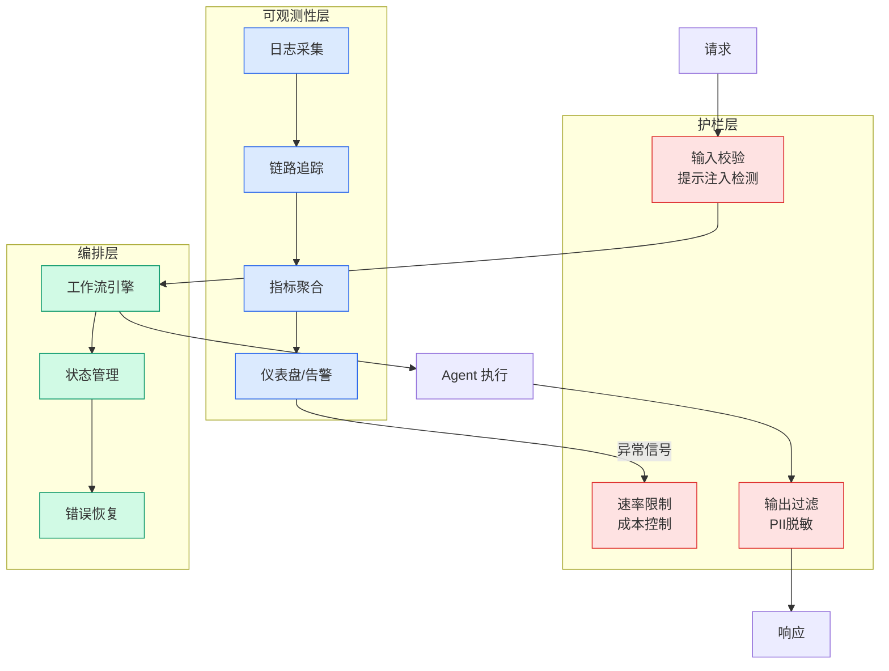

# The Agentic Trust Management Platform | Drata

## Ch04.022 The Agentic Trust Management Platform | Drata

> 📊 Level ⭐ | 3.7KB | `entities/the-agentic-trust-management-platform-drata.md`

> -> [原文存档](https://github.com/QianJinGuo/wiki-book/tree/main/docs/raw/articles/the-agentic-trust-management-platform-drata.md)

## 核心要点
- 来源：drata.com
- 评分：v=7, c=8, product=56
→ [原文存档](https://github.com/QianJinGuo/wiki-book/tree/main/docs/raw/articles/the-agentic-trust-management-platform-drata.md)

## 深度分析

Drata 的"Agentic Trust Management"定位揭示了 GRC（治理、风险、合规）领域正在发生结构性转变：
**1. 从周期性审计到持续性证明**
传统 GRC 模式下，企业每年接受一次审计——这意味着 364 天的安全状态是未知数。Drata 的核心价值主张是"每天都在证明你的安全状态，而非一年一次"。Continuous Real-Time Trust 意味着控制项被实时监控，证据被自动采集，风险被即时标记。这不只是效率提升，而是合规范式的根本转变。
**2. Agentic AI 的具体应用场景**
Drata 页面明确列出了四个 AI Agent 应用场景：

- **问卷自动化**（AI Security Questionnaire）：375+ 小时/年节省，核心是 AI 学习企业 Knowledge Base 并持续生成一致答案
- **第三方风险评估**：AI 自动化 criteria 创建、Trust Center 文档收集、评估和跟进
- **证据采集**：自动化控制监控和证据收集
- **Trust Center**：AI 驱动对外安全姿态展示
**3. 量化收益的市场信号**
Drata 给出三个具体数字：SOC 2 审计时间减少 75%、问卷处理节省 375+ 小时/年、$20M 年均收入加速。这些数字比任何功能列表更有说服力——它们表明 GRC SaaS 的竞争已经从"功能完整性"转向"ROI 可量化性"。
**4. ISO 42001 的战略意义**
ISO 42001 是 AI 质量管理体系认证，获得此认证意味着 Drata 的 AI 系统本身经过了独立审计。这对于一个以"可信赖的 AI"为核心卖点的产品，具有自我验证的战略价值。
**5. 8,000+ 客户的规模效应**
Drata 积累了 8,000+ 企业客户，其平台的网络效应在于：客户越多，AI 在问卷、风险评估中可学习的最佳实践越多，自动化覆盖的框架越广，新客户的上手成本越低。

## 实践启示
- **评估 GRC 平台时，核心指标是"自动化覆盖的控制项比例"**：人工控制的持续监控成本极高，只有当平台能自动采集证据、自动触发控制测试时，才能实现真正的 continuous compliance。
- **Trust Center 是 AI 驱动的客户信任变现工具**：Drata 数据显示 $20M 年均收入加速，说明安全合规展示（Trust Center）直接推动收入，而非纯粹成本。安全团队应将 Trust Center 视为 revenue enabler 而非 overhead。
- **AI 问卷自动化在安全销售周期中具有杠杆效应**：375+ 小时/年的节省不只是工时节省，更重要的是加速了企业安全审查流程，从而缩短了销售周期。
- **在 ISO 42001 成为行业标准前抢先获得认证**：ISO 42001 是 2024 年新发布的标准，目前持有者寥寥。早期认证将在 AI 合规需求爆发时形成显著的差异化优势。

## 相关实体
- [Exaforce | Agentic SOC Platform and MDR](ch04/024-exaforce-agentic-soc-platform-and-mdr.html)

---
## 关联
- 相关概念: [Harness Engineering](https://github.com/QianJinGuo/wiki/blob/main/concepts/harness-engineering-framework.md)

---

